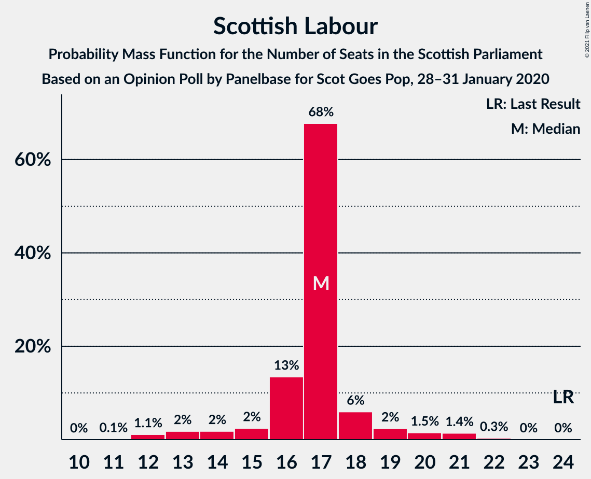
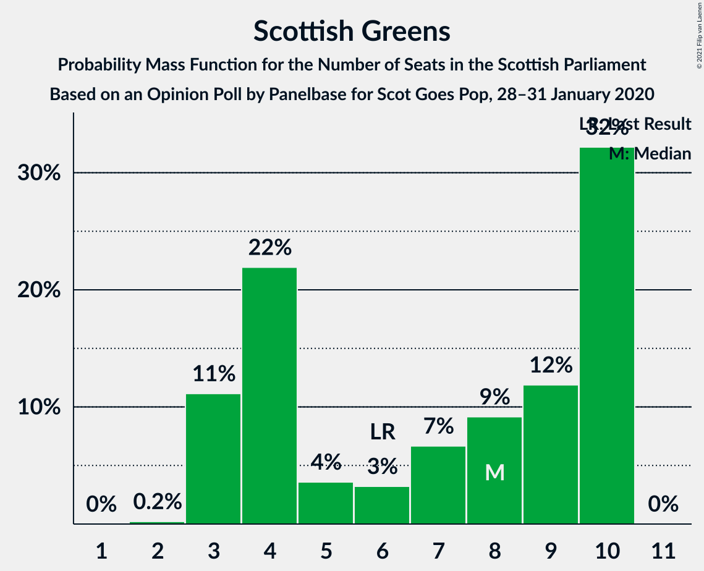

# Opinion Poll by Panelbase for Scot Goes Pop, 28–31 January 2020

<a href="#voting-intentions">Voting Intentions</a> | <a href="#seats">Seats</a> | <a href="#coalitions">Coalitions</a> | <a href="#technical-information">Technical Information</a>

## Voting Intentions

### Confidence Intervals

| Party | Last Result | Poll Result | 80% Confidence Interval | 90% Confidence Interval | 95% Confidence Interval | 99% Confidence Interval |
|:-----:|:-----------:|:-----------:|:-----------------------:|:-----------------------:|:-----------------------:|:-----------------------:|
| Scottish National Party | 41.7% | 46.9% | 44.8–48.9% |44.3–49.4% |43.8–49.9% |42.8–50.9% |
| Scottish Conservative & Unionist Party | 22.9% | 24.9% | 23.2–26.7% |22.7–27.2% |22.3–27.7% |21.6–28.5% |
| Scottish Labour | 19.1% | 14.0% | 12.7–15.5% |12.3–15.9% |12.0–16.2% |11.4–17.0% |
| Scottish Greens | 6.6% | 7.0% | 6.1–8.1% |5.8–8.4% |5.6–8.7% |5.2–9.3% |
| Scottish Liberal Democrats | 5.2% | 7.0% | 6.1–8.1% |5.8–8.4% |5.6–8.7% |5.2–9.3% |

*Note:* The poll result column reflects the actual value used in the calculations. Published results may vary slightly, and in addition be rounded to fewer digits.

## Seats

### Confidence Intervals

| Party | Last Result | Median | 80% Confidence Interval | 90% Confidence Interval | 95% Confidence Interval | 99% Confidence Interval |
|:-----:|:-----------:|:------:|:-----------------------:|:-----------------------:|:-----------------------:|:-----------------------:|
| <a href="#scottish-national-party">Scottish National Party</a> | 63 | 67 | 64–70 |63–71 |62–72 |61–73 |
| <a href="#scottish-conservative-&-unionist-party">Scottish Conservative & Unionist Party</a> | 31 | 31 | 30–35 |29–36 |28–36 |26–38 |
| <a href="#scottish-labour">Scottish Labour</a> | 24 | 17 | 16–17 |14–18 |13–20 |13–21 |
| <a href="#scottish-greens">Scottish Greens</a> | 6 | 8 | 3–10 |3–10 |3–10 |3–10 |
| <a href="#scottish-liberal-democrats">Scottish Liberal Democrats</a> | 5 | 6 | 5–8 |5–8 |5–9 |4–10 |

### Scottish National Party

*For a full overview of the results for this party, see the [Scottish National Party](party-scottishnationalparty.html) page.*

| Number of Seats | Probability | Accumulated | Special Marks |
|:---------------:|:-----------:|:-----------:|:-------------:|
| 60 | 0.2% | 100% |  |
| 61 | 0.8% | 99.8% |  |
| 62 | 2% | 99.0% |  |
| 63 | 3% | 97% | Last Result |
| 64 | 5% | 93% |  |
| 65 | 19% | 88% | Majority |
| 66 | 15% | 69% |  |
| 67 | 8% | 55% | Median |
| 68 | 11% | 46% |  |
| 69 | 19% | 35% |  |
| 70 | 9% | 16% |  |
| 71 | 3% | 6% |  |
| 72 | 2% | 4% |  |
| 73 | 2% | 2% |  |
| 74 | 0.2% | 0.3% |  |
| 75 | 0.1% | 0.1% |  |
| 76 | 0% | 0% |  |

### Scottish Conservative & Unionist Party

*For a full overview of the results for this party, see the [Scottish Conservative & Unionist Party](party-scottishconservativeunionistparty.html) page.*

| Number of Seats | Probability | Accumulated | Special Marks |
|:---------------:|:-----------:|:-----------:|:-------------:|
| 25 | 0.1% | 100% |  |
| 26 | 0.7% | 99.9% |  |
| 27 | 1.5% | 99.2% |  |
| 28 | 2% | 98% |  |
| 29 | 5% | 96% |  |
| 30 | 10% | 91% |  |
| 31 | 33% | 81% | Last Result, Median |
| 32 | 19% | 49% |  |
| 33 | 8% | 30% |  |
| 34 | 8% | 22% |  |
| 35 | 7% | 14% |  |
| 36 | 4% | 7% |  |
| 37 | 2% | 2% |  |
| 38 | 0.5% | 0.6% |  |
| 39 | 0.1% | 0.2% |  |
| 40 | 0% | 0% |  |

### Scottish Labour

*For a full overview of the results for this party, see the [Scottish Labour](party-scottishlabour.html) page.*

| Number of Seats | Probability | Accumulated | Special Marks |
|:---------------:|:-----------:|:-----------:|:-------------:|
| 11 | 0.1% | 100% |  |
| 12 | 0.4% | 99.9% |  |
| 13 | 3% | 99.6% |  |
| 14 | 4% | 97% |  |
| 15 | 3% | 93% |  |
| 16 | 17% | 91% |  |
| 17 | 64% | 74% | Median |
| 18 | 5% | 10% |  |
| 19 | 1.3% | 5% |  |
| 20 | 0.9% | 3% |  |
| 21 | 2% | 2% |  |
| 22 | 0.3% | 0.3% |  |
| 23 | 0% | 0% |  |
| 24 | 0% | 0% | Last Result |

### Scottish Greens

*For a full overview of the results for this party, see the [Scottish Greens](party-scottishgreens.html) page.*

| Number of Seats | Probability | Accumulated | Special Marks |
|:---------------:|:-----------:|:-----------:|:-------------:|
| 2 | 0.2% | 100% |  |
| 3 | 12% | 99.8% |  |
| 4 | 25% | 87% |  |
| 5 | 1.0% | 62% |  |
| 6 | 0.3% | 61% | Last Result |
| 7 | 9% | 61% |  |
| 8 | 8% | 51% | Median |
| 9 | 16% | 43% |  |
| 10 | 27% | 27% |  |
| 11 | 0% | 0% |  |

### Scottish Liberal Democrats

*For a full overview of the results for this party, see the [Scottish Liberal Democrats](party-scottishliberaldemocrats.html) page.*

| Number of Seats | Probability | Accumulated | Special Marks |
|:---------------:|:-----------:|:-----------:|:-------------:|
| 3 | 0.1% | 100% |  |
| 4 | 2% | 99.9% |  |
| 5 | 40% | 98% | Last Result |
| 6 | 17% | 58% | Median |
| 7 | 14% | 41% |  |
| 8 | 23% | 27% |  |
| 9 | 3% | 4% |  |
| 10 | 1.1% | 1.2% |  |
| 11 | 0.1% | 0.1% |  |
| 12 | 0% | 0% |  |

## Coalitions

### Confidence Intervals

| Coalition | Last Result | Median | Majority? | 80% Confidence Interval | 90% Confidence Interval | 95% Confidence Interval | 99% Confidence Interval |
|:---------:|:-----------:|:------:|:---------:|:-----------------------:|:-----------------------:|:-----------------------:|:-----------------------:|
| Scottish National Party – Scottish Greens | 69 | 75 | 100% | 70–77 | 69–78 | 69–79 | 68–81 |
| Scottish National Party | 63 | 67 | 88% | 64–70 | 63–71 | 62–72 | 61–73 |
| Scottish Conservative & Unionist Party – Scottish Labour – Scottish Liberal Democrats | 60 | 54 | 0% | 52–59 | 51–60 | 50–60 | 48–61 |
| Scottish Conservative & Unionist Party – Scottish Labour | 55 | 48 | 0% | 46–52 | 45–53 | 44–53 | 43–55 |
| Scottish Conservative & Unionist Party – Scottish Liberal Democrats | 36 | 38 | 0% | 36–41 | 34–42 | 34–43 | 31–44 |
| Scottish Labour – Scottish Greens – Scottish Liberal Democrats | 35 | 30 | 0% | 26–33 | 25–33 | 25–34 | 24–36 |
| Scottish Labour – Scottish Liberal Democrats | 29 | 23 | 0% | 21–25 | 20–26 | 18–27 | 18–29 |

### Scottish National Party – Scottish Greens

| Number of Seats | Probability | Accumulated | Special Marks |
|:---------------:|:-----------:|:-----------:|:-------------:|
| 66 | 0.1% | 100% |  |
| 67 | 0.3% | 99.8% |  |
| 68 | 0.9% | 99.6% |  |
| 69 | 5% | 98.7% | Last Result |
| 70 | 6% | 94% |  |
| 71 | 8% | 88% |  |
| 72 | 9% | 80% |  |
| 73 | 9% | 71% |  |
| 74 | 12% | 62% |  |
| 75 | 20% | 50% | Median |
| 76 | 15% | 31% |  |
| 77 | 8% | 15% |  |
| 78 | 5% | 8% |  |
| 79 | 0.9% | 3% |  |
| 80 | 1.2% | 2% |  |
| 81 | 0.5% | 0.8% |  |
| 82 | 0.2% | 0.2% |  |
| 83 | 0% | 0% |  |

### Scottish National Party

| Number of Seats | Probability | Accumulated | Special Marks |
|:---------------:|:-----------:|:-----------:|:-------------:|
| 60 | 0.2% | 100% |  |
| 61 | 0.8% | 99.8% |  |
| 62 | 2% | 99.0% |  |
| 63 | 3% | 97% | Last Result |
| 64 | 5% | 93% |  |
| 65 | 19% | 88% | Majority |
| 66 | 15% | 69% |  |
| 67 | 8% | 55% | Median |
| 68 | 11% | 46% |  |
| 69 | 19% | 35% |  |
| 70 | 9% | 16% |  |
| 71 | 3% | 6% |  |
| 72 | 2% | 4% |  |
| 73 | 2% | 2% |  |
| 74 | 0.2% | 0.3% |  |
| 75 | 0.1% | 0.1% |  |
| 76 | 0% | 0% |  |

### Scottish Conservative & Unionist Party – Scottish Labour – Scottish Liberal Democrats

| Number of Seats | Probability | Accumulated | Special Marks |
|:---------------:|:-----------:|:-----------:|:-------------:|
| 47 | 0.2% | 100% |  |
| 48 | 0.5% | 99.8% |  |
| 49 | 1.2% | 99.2% |  |
| 50 | 0.9% | 98% |  |
| 51 | 5% | 97% |  |
| 52 | 8% | 92% |  |
| 53 | 15% | 85% |  |
| 54 | 20% | 69% | Median |
| 55 | 12% | 50% |  |
| 56 | 9% | 38% |  |
| 57 | 9% | 29% |  |
| 58 | 8% | 20% |  |
| 59 | 6% | 12% |  |
| 60 | 5% | 6% | Last Result |
| 61 | 0.9% | 1.3% |  |
| 62 | 0.3% | 0.4% |  |
| 63 | 0.1% | 0.2% |  |
| 64 | 0% | 0% |  |

### Scottish Conservative & Unionist Party – Scottish Labour

| Number of Seats | Probability | Accumulated | Special Marks |
|:---------------:|:-----------:|:-----------:|:-------------:|
| 41 | 0% | 100% |  |
| 42 | 0.2% | 99.9% |  |
| 43 | 0.7% | 99.7% |  |
| 44 | 2% | 99.0% |  |
| 45 | 4% | 97% |  |
| 46 | 9% | 93% |  |
| 47 | 15% | 84% |  |
| 48 | 24% | 69% | Median |
| 49 | 15% | 45% |  |
| 50 | 9% | 30% |  |
| 51 | 6% | 21% |  |
| 52 | 8% | 16% |  |
| 53 | 5% | 7% |  |
| 54 | 1.1% | 2% |  |
| 55 | 0.8% | 1.3% | Last Result |
| 56 | 0.3% | 0.4% |  |
| 57 | 0.1% | 0.2% |  |
| 58 | 0.1% | 0.1% |  |
| 59 | 0% | 0% |  |

### Scottish Conservative & Unionist Party – Scottish Liberal Democrats

| Number of Seats | Probability | Accumulated | Special Marks |
|:---------------:|:-----------:|:-----------:|:-------------:|
| 30 | 0.1% | 100% |  |
| 31 | 0.5% | 99.9% |  |
| 32 | 0.9% | 99.4% |  |
| 33 | 0.7% | 98.6% |  |
| 34 | 4% | 98% |  |
| 35 | 4% | 94% |  |
| 36 | 13% | 90% | Last Result |
| 37 | 19% | 78% | Median |
| 38 | 18% | 59% |  |
| 39 | 14% | 42% |  |
| 40 | 9% | 27% |  |
| 41 | 9% | 18% |  |
| 42 | 5% | 10% |  |
| 43 | 4% | 5% |  |
| 44 | 0.5% | 0.7% |  |
| 45 | 0.1% | 0.2% |  |
| 46 | 0.1% | 0.1% |  |
| 47 | 0% | 0% |  |

### Scottish Labour – Scottish Greens – Scottish Liberal Democrats

| Number of Seats | Probability | Accumulated | Special Marks |
|:---------------:|:-----------:|:-----------:|:-------------:|
| 22 | 0% | 100% |  |
| 23 | 0.1% | 99.9% |  |
| 24 | 0.4% | 99.8% |  |
| 25 | 7% | 99.4% |  |
| 26 | 6% | 92% |  |
| 27 | 2% | 86% |  |
| 28 | 10% | 84% |  |
| 29 | 22% | 75% |  |
| 30 | 8% | 53% |  |
| 31 | 12% | 45% | Median |
| 32 | 8% | 33% |  |
| 33 | 21% | 25% |  |
| 34 | 3% | 5% |  |
| 35 | 0.5% | 1.5% | Last Result |
| 36 | 0.9% | 1.0% |  |
| 37 | 0.1% | 0.1% |  |
| 38 | 0% | 0% |  |

### Scottish Labour – Scottish Liberal Democrats

| Number of Seats | Probability | Accumulated | Special Marks |
|:---------------:|:-----------:|:-----------:|:-------------:|
| 17 | 0.3% | 100% |  |
| 18 | 2% | 99.7% |  |
| 19 | 0.9% | 97% |  |
| 20 | 2% | 97% |  |
| 21 | 7% | 94% |  |
| 22 | 32% | 88% |  |
| 23 | 19% | 55% | Median |
| 24 | 13% | 36% |  |
| 25 | 15% | 23% |  |
| 26 | 3% | 8% |  |
| 27 | 3% | 5% |  |
| 28 | 1.0% | 2% |  |
| 29 | 1.2% | 1.3% | Last Result |
| 30 | 0.1% | 0.1% |  |
| 31 | 0% | 0% |  |

## Technical Information

### Opinion Poll

+ **Polling firm:** Panelbase
+ **Commissioner(s):** Scot Goes Pop
+ **Fieldwork period:** 28–31 January 2020

### Calculations

+ **Sample size:** 1016
+ **Simulations done:** 131,072
+ **Error estimate:** 0.40%

