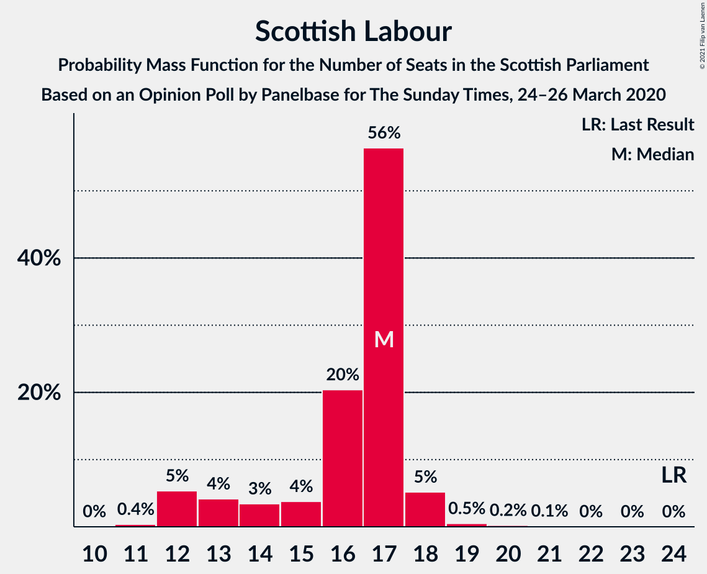

# Opinion Poll by Panelbase for The Sunday Times, 24–26 March 2020

<a href="#voting-intentions">Voting Intentions</a> | <a href="#seats">Seats</a> | <a href="#coalitions">Coalitions</a> | <a href="#technical-information">Technical Information</a>

## Voting Intentions

### Confidence Intervals

| Party | Last Result | Poll Result | 80% Confidence Interval | 90% Confidence Interval | 95% Confidence Interval | 99% Confidence Interval |
|:-----:|:-----------:|:-----------:|:-----------------------:|:-----------------------:|:-----------------------:|:-----------------------:|
| Scottish National Party | 41.7% | 48.0% | 46.0–50.0% |45.4–50.6% |44.9–51.1% |44.0–52.0% |
| Scottish Conservative & Unionist Party | 22.9% | 26.0% | 24.3–27.8% |23.8–28.3% |23.4–28.8% |22.6–29.7% |
| Scottish Labour | 19.1% | 13.0% | 11.7–14.4% |11.4–14.8% |11.1–15.2% |10.5–15.9% |
| Scottish Greens | 6.6% | 6.0% | 5.1–7.0% |4.9–7.3% |4.7–7.6% |4.3–8.1% |
| Scottish Liberal Democrats | 5.2% | 6.0% | 5.1–7.0% |4.9–7.3% |4.7–7.6% |4.3–8.1% |

*Note:* The poll result column reflects the actual value used in the calculations. Published results may vary slightly, and in addition be rounded to fewer digits.

## Seats

### Confidence Intervals

| Party | Last Result | Median | 80% Confidence Interval | 90% Confidence Interval | 95% Confidence Interval | 99% Confidence Interval |
|:-----:|:-----------:|:------:|:-----------------------:|:-----------------------:|:-----------------------:|:-----------------------:|
| <a href="#scottish-national-party">Scottish National Party</a> | 63 | 69 | 66–73 |65–74 |65–75 |64–76 |
| <a href="#scottish-conservative-&-unionist-party">Scottish Conservative & Unionist Party</a> | 31 | 34 | 31–37 |31–37 |30–38 |27–40 |
| <a href="#scottish-labour">Scottish Labour</a> | 24 | 17 | 14–17 |12–18 |12–18 |12–19 |
| <a href="#scottish-greens">Scottish Greens</a> | 6 | 2 | 2–10 |2–10 |2–10 |2–10 |
| <a href="#scottish-liberal-democrats">Scottish Liberal Democrats</a> | 5 | 5 | 5–7 |4–8 |3–8 |2–9 |

### Scottish National Party

*For a full overview of the results for this party, see the [Scottish National Party](party-scottishnationalparty.html) page.*

| Number of Seats | Probability | Accumulated | Special Marks |
|:---------------:|:-----------:|:-----------:|:-------------:|
| 62 | 0.1% | 100% |  |
| 63 | 0.1% | 99.9% | Last Result |
| 64 | 0.8% | 99.8% |  |
| 65 | 6% | 99.0% | Majority |
| 66 | 4% | 93% |  |
| 67 | 14% | 89% |  |
| 68 | 17% | 75% |  |
| 69 | 15% | 58% | Median |
| 70 | 11% | 43% |  |
| 71 | 7% | 32% |  |
| 72 | 10% | 25% |  |
| 73 | 9% | 14% |  |
| 74 | 2% | 5% |  |
| 75 | 2% | 3% |  |
| 76 | 0.5% | 0.6% |  |
| 77 | 0.1% | 0.1% |  |
| 78 | 0% | 0% |  |

### Scottish Conservative & Unionist Party

*For a full overview of the results for this party, see the [Scottish Conservative & Unionist Party](party-scottishconservativeunionistparty.html) page.*

| Number of Seats | Probability | Accumulated | Special Marks |
|:---------------:|:-----------:|:-----------:|:-------------:|
| 26 | 0.1% | 100% |  |
| 27 | 0.5% | 99.9% |  |
| 28 | 0.4% | 99.4% |  |
| 29 | 0.8% | 99.0% |  |
| 30 | 2% | 98% |  |
| 31 | 7% | 96% | Last Result |
| 32 | 13% | 90% |  |
| 33 | 14% | 76% |  |
| 34 | 14% | 62% | Median |
| 35 | 15% | 49% |  |
| 36 | 17% | 34% |  |
| 37 | 12% | 16% |  |
| 38 | 3% | 4% |  |
| 39 | 1.1% | 2% |  |
| 40 | 0.5% | 0.8% |  |
| 41 | 0.1% | 0.3% |  |
| 42 | 0.1% | 0.1% |  |
| 43 | 0% | 0% |  |

### Scottish Labour

*For a full overview of the results for this party, see the [Scottish Labour](party-scottishlabour.html) page.*

| Number of Seats | Probability | Accumulated | Special Marks |
|:---------------:|:-----------:|:-----------:|:-------------:|
| 11 | 0.4% | 100% |  |
| 12 | 5% | 99.6% |  |
| 13 | 4% | 94% |  |
| 14 | 3% | 90% |  |
| 15 | 4% | 87% |  |
| 16 | 20% | 83% |  |
| 17 | 56% | 62% | Median |
| 18 | 5% | 6% |  |
| 19 | 0.5% | 0.9% |  |
| 20 | 0.2% | 0.4% |  |
| 21 | 0.1% | 0.2% |  |
| 22 | 0% | 0% |  |
| 23 | 0% | 0% |  |
| 24 | 0% | 0% | Last Result |

### Scottish Greens

*For a full overview of the results for this party, see the [Scottish Greens](party-scottishgreens.html) page.*

| Number of Seats | Probability | Accumulated | Special Marks |
|:---------------:|:-----------:|:-----------:|:-------------:|
| 2 | 78% | 100% | Median |
| 3 | 4% | 22% |  |
| 4 | 0% | 18% |  |
| 5 | 0% | 18% |  |
| 6 | 0.2% | 18% | Last Result |
| 7 | 0.8% | 18% |  |
| 8 | 2% | 17% |  |
| 9 | 2% | 14% |  |
| 10 | 12% | 12% |  |
| 11 | 0% | 0% |  |

### Scottish Liberal Democrats

*For a full overview of the results for this party, see the [Scottish Liberal Democrats](party-scottishliberaldemocrats.html) page.*

| Number of Seats | Probability | Accumulated | Special Marks |
|:---------------:|:-----------:|:-----------:|:-------------:|
| 2 | 1.4% | 100% |  |
| 3 | 2% | 98.6% |  |
| 4 | 3% | 97% |  |
| 5 | 51% | 94% | Last Result, Median |
| 6 | 11% | 43% |  |
| 7 | 22% | 32% |  |
| 8 | 8% | 10% |  |
| 9 | 2% | 2% |  |
| 10 | 0.1% | 0.1% |  |
| 11 | 0% | 0% |  |

## Coalitions

### Confidence Intervals

| Coalition | Last Result | Median | Majority? | 80% Confidence Interval | 90% Confidence Interval | 95% Confidence Interval | 99% Confidence Interval |
|:---------:|:-----------:|:------:|:---------:|:-----------------------:|:-----------------------:|:-----------------------:|:-----------------------:|
| Scottish National Party – Scottish Greens | 69 | 72 | 100% | 69–77 | 69–78 | 68–80 | 67–82 |
| Scottish National Party | 63 | 69 | 99.0% | 66–73 | 65–74 | 65–75 | 64–76 |
| Scottish Conservative & Unionist Party – Scottish Labour – Scottish Liberal Democrats | 60 | 57 | 0% | 52–60 | 51–60 | 49–61 | 47–62 |
| Scottish Conservative & Unionist Party – Scottish Labour | 55 | 51 | 0% | 47–54 | 46–54 | 45–54 | 42–56 |
| Scottish Conservative & Unionist Party – Scottish Liberal Democrats | 36 | 40 | 0% | 37–43 | 36–44 | 34–45 | 32–47 |
| Scottish Labour – Scottish Greens – Scottish Liberal Democrats | 35 | 25 | 0% | 23–29 | 21–32 | 20–32 | 19–32 |
| Scottish Labour – Scottish Liberal Democrats | 29 | 22 | 0% | 19–24 | 17–25 | 17–25 | 16–26 |

### Scottish National Party – Scottish Greens

| Number of Seats | Probability | Accumulated | Special Marks |
|:---------------:|:-----------:|:-----------:|:-------------:|
| 65 | 0.1% | 100% | Majority |
| 66 | 0.1% | 99.9% |  |
| 67 | 0.6% | 99.8% |  |
| 68 | 2% | 99.2% |  |
| 69 | 11% | 97% | Last Result |
| 70 | 15% | 86% |  |
| 71 | 13% | 71% | Median |
| 72 | 10% | 58% |  |
| 73 | 6% | 47% |  |
| 74 | 10% | 41% |  |
| 75 | 15% | 31% |  |
| 76 | 5% | 16% |  |
| 77 | 5% | 11% |  |
| 78 | 2% | 6% |  |
| 79 | 1.2% | 4% |  |
| 80 | 0.9% | 3% |  |
| 81 | 0.8% | 2% |  |
| 82 | 0.6% | 1.0% |  |
| 83 | 0.3% | 0.4% |  |
| 84 | 0.1% | 0.1% |  |
| 85 | 0% | 0% |  |

### Scottish National Party

| Number of Seats | Probability | Accumulated | Special Marks |
|:---------------:|:-----------:|:-----------:|:-------------:|
| 62 | 0.1% | 100% |  |
| 63 | 0.1% | 99.9% | Last Result |
| 64 | 0.8% | 99.8% |  |
| 65 | 6% | 99.0% | Majority |
| 66 | 4% | 93% |  |
| 67 | 14% | 89% |  |
| 68 | 17% | 75% |  |
| 69 | 15% | 58% | Median |
| 70 | 11% | 43% |  |
| 71 | 7% | 32% |  |
| 72 | 10% | 25% |  |
| 73 | 9% | 14% |  |
| 74 | 2% | 5% |  |
| 75 | 2% | 3% |  |
| 76 | 0.5% | 0.6% |  |
| 77 | 0.1% | 0.1% |  |
| 78 | 0% | 0% |  |

### Scottish Conservative & Unionist Party – Scottish Labour – Scottish Liberal Democrats

| Number of Seats | Probability | Accumulated | Special Marks |
|:---------------:|:-----------:|:-----------:|:-------------:|
| 45 | 0.1% | 100% |  |
| 46 | 0.3% | 99.9% |  |
| 47 | 0.6% | 99.6% |  |
| 48 | 0.8% | 99.0% |  |
| 49 | 0.9% | 98% |  |
| 50 | 1.2% | 97% |  |
| 51 | 2% | 96% |  |
| 52 | 5% | 94% |  |
| 53 | 5% | 89% |  |
| 54 | 15% | 84% |  |
| 55 | 10% | 69% |  |
| 56 | 6% | 59% | Median |
| 57 | 10% | 53% |  |
| 58 | 13% | 42% |  |
| 59 | 15% | 29% |  |
| 60 | 11% | 14% | Last Result |
| 61 | 2% | 3% |  |
| 62 | 0.6% | 0.8% |  |
| 63 | 0.1% | 0.2% |  |
| 64 | 0.1% | 0.1% |  |
| 65 | 0% | 0% | Majority |

### Scottish Conservative & Unionist Party – Scottish Labour

| Number of Seats | Probability | Accumulated | Special Marks |
|:---------------:|:-----------:|:-----------:|:-------------:|
| 41 | 0.2% | 100% |  |
| 42 | 0.5% | 99.8% |  |
| 43 | 0.7% | 99.3% |  |
| 44 | 1.1% | 98.6% |  |
| 45 | 1.5% | 98% |  |
| 46 | 3% | 96% |  |
| 47 | 6% | 93% |  |
| 48 | 7% | 87% |  |
| 49 | 15% | 80% |  |
| 50 | 13% | 65% |  |
| 51 | 10% | 52% | Median |
| 52 | 16% | 42% |  |
| 53 | 15% | 26% |  |
| 54 | 9% | 11% |  |
| 55 | 1.3% | 2% | Last Result |
| 56 | 0.8% | 1.1% |  |
| 57 | 0.2% | 0.3% |  |
| 58 | 0% | 0.1% |  |
| 59 | 0% | 0% |  |

### Scottish Conservative & Unionist Party – Scottish Liberal Democrats

| Number of Seats | Probability | Accumulated | Special Marks |
|:---------------:|:-----------:|:-----------:|:-------------:|
| 31 | 0.2% | 100% |  |
| 32 | 0.5% | 99.8% |  |
| 33 | 0.8% | 99.3% |  |
| 34 | 1.1% | 98% |  |
| 35 | 2% | 97% |  |
| 36 | 3% | 96% | Last Result |
| 37 | 12% | 93% |  |
| 38 | 11% | 81% |  |
| 39 | 10% | 70% | Median |
| 40 | 15% | 60% |  |
| 41 | 14% | 45% |  |
| 42 | 13% | 32% |  |
| 43 | 10% | 19% |  |
| 44 | 6% | 9% |  |
| 45 | 2% | 3% |  |
| 46 | 0.5% | 1.1% |  |
| 47 | 0.4% | 0.6% |  |
| 48 | 0.2% | 0.2% |  |
| 49 | 0% | 0% |  |

### Scottish Labour – Scottish Greens – Scottish Liberal Democrats

| Number of Seats | Probability | Accumulated | Special Marks |
|:---------------:|:-----------:|:-----------:|:-------------:|
| 19 | 2% | 100% |  |
| 20 | 1.4% | 98% |  |
| 21 | 2% | 97% |  |
| 22 | 2% | 95% |  |
| 23 | 6% | 92% |  |
| 24 | 28% | 86% | Median |
| 25 | 21% | 58% |  |
| 26 | 13% | 36% |  |
| 27 | 7% | 23% |  |
| 28 | 4% | 16% |  |
| 29 | 3% | 12% |  |
| 30 | 2% | 9% |  |
| 31 | 2% | 8% |  |
| 32 | 5% | 5% |  |
| 33 | 0.1% | 0.1% |  |
| 34 | 0% | 0% |  |
| 35 | 0% | 0% | Last Result |

### Scottish Labour – Scottish Liberal Democrats

| Number of Seats | Probability | Accumulated | Special Marks |
|:---------------:|:-----------:|:-----------:|:-------------:|
| 14 | 0.1% | 100% |  |
| 15 | 0.3% | 99.9% |  |
| 16 | 1.0% | 99.7% |  |
| 17 | 4% | 98.6% |  |
| 18 | 3% | 95% |  |
| 19 | 4% | 92% |  |
| 20 | 5% | 87% |  |
| 21 | 9% | 83% |  |
| 22 | 33% | 74% | Median |
| 23 | 21% | 40% |  |
| 24 | 12% | 20% |  |
| 25 | 5% | 7% |  |
| 26 | 2% | 2% |  |
| 27 | 0.3% | 0.5% |  |
| 28 | 0.1% | 0.2% |  |
| 29 | 0.1% | 0.1% | Last Result |
| 30 | 0% | 0% |  |

## Technical Information

### Opinion Poll

+ **Polling firm:** Panelbase
+ **Commissioner(s):** The Sunday Times
+ **Fieldwork period:** 24–26 March 2020

### Calculations

+ **Sample size:** 1023
+ **Simulations done:** 1,048,576
+ **Error estimate:** 0.53%

