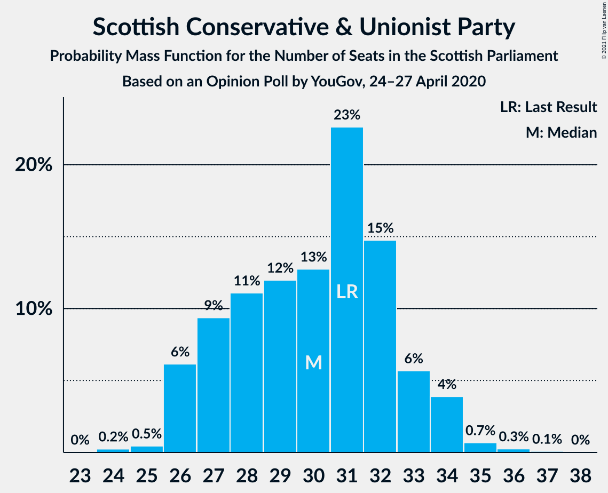

# Opinion Poll by YouGov, 24–27 April 2020

<a href="#voting-intentions">Voting Intentions</a> | <a href="#seats">Seats</a> | <a href="#coalitions">Coalitions</a> | <a href="#technical-information">Technical Information</a>

## Voting Intentions

### Confidence Intervals

| Party | Last Result | Poll Result | 80% Confidence Interval | 90% Confidence Interval | 95% Confidence Interval | 99% Confidence Interval |
|:-----:|:-----------:|:-----------:|:-----------------------:|:-----------------------:|:-----------------------:|:-----------------------:|
| Scottish National Party | 41.7% | 45.0% | 43.1–47.0% |42.6–47.5% |42.1–48.0% |41.2–48.9% |
| Scottish Conservative & Unionist Party | 22.9% | 23.0% | 21.4–24.7% |21.0–25.2% |20.6–25.6% |19.9–26.4% |
| Scottish Labour | 19.1% | 12.0% | 10.8–13.3% |10.5–13.7% |10.2–14.0% |9.6–14.7% |
| Scottish Greens | 6.6% | 8.0% | 7.1–9.2% |6.8–9.5% |6.6–9.8% |6.1–10.4% |
| Scottish Liberal Democrats | 5.2% | 7.0% | 6.1–8.1% |5.9–8.4% |5.7–8.7% |5.3–9.3% |
| Scottish Socialist Party | 0.5% | 4.0% | 3.4–4.9% |3.2–5.1% |3.0–5.4% |2.7–5.8% |

*Note:* The poll result column reflects the actual value used in the calculations. Published results may vary slightly, and in addition be rounded to fewer digits.

## Seats

### Confidence Intervals

| Party | Last Result | Median | 80% Confidence Interval | 90% Confidence Interval | 95% Confidence Interval | 99% Confidence Interval |
|:-----:|:-----------:|:------:|:-----------------------:|:-----------------------:|:-----------------------:|:-----------------------:|
| <a href="#scottish-national-party">Scottish National Party</a> | 63 | 68 | 65–71 |65–72 |64–73 |63–74 |
| <a href="#scottish-conservative-&-unionist-party">Scottish Conservative & Unionist Party</a> | 31 | 30 | 27–32 |27–34 |26–34 |25–35 |
| <a href="#scottish-labour">Scottish Labour</a> | 24 | 15 | 12–17 |12–17 |11–17 |11–17 |
| <a href="#scottish-greens">Scottish Greens</a> | 6 | 10 | 9–10 |9–10 |6–11 |4–12 |
| <a href="#scottish-liberal-democrats">Scottish Liberal Democrats</a> | 5 | 7 | 5–8 |5–9 |5–9 |4–9 |
| <a href="#scottish-socialist-party">Scottish Socialist Party</a> | 0 | 0 | 0 |0 |0 |0 |

### Scottish National Party

*For a full overview of the results for this party, see the [Scottish National Party](party-scottishnationalparty.html) page.*

| Number of Seats | Probability | Accumulated | Special Marks |
|:---------------:|:-----------:|:-----------:|:-------------:|
| 63 | 0.7% | 100% | Last Result |
| 64 | 2% | 99.2% |  |
| 65 | 14% | 97% | Majority |
| 66 | 11% | 83% |  |
| 67 | 14% | 73% |  |
| 68 | 15% | 58% | Median |
| 69 | 16% | 43% |  |
| 70 | 13% | 26% |  |
| 71 | 5% | 13% |  |
| 72 | 3% | 8% |  |
| 73 | 4% | 5% |  |
| 74 | 0.6% | 0.7% |  |
| 75 | 0.1% | 0.1% |  |
| 76 | 0% | 0% |  |

### Scottish Conservative & Unionist Party

*For a full overview of the results for this party, see the [Scottish Conservative & Unionist Party](party-scottishconservativeunionistparty.html) page.*

| Number of Seats | Probability | Accumulated | Special Marks |
|:---------------:|:-----------:|:-----------:|:-------------:|
| 24 | 0.1% | 100% |  |
| 25 | 1.0% | 99.9% |  |
| 26 | 3% | 98.9% |  |
| 27 | 8% | 96% |  |
| 28 | 12% | 88% |  |
| 29 | 23% | 76% |  |
| 30 | 18% | 53% | Median |
| 31 | 19% | 35% | Last Result |
| 32 | 7% | 16% |  |
| 33 | 4% | 9% |  |
| 34 | 4% | 5% |  |
| 35 | 0.6% | 1.1% |  |
| 36 | 0.3% | 0.4% |  |
| 37 | 0.1% | 0.1% |  |
| 38 | 0% | 0% |  |

### Scottish Labour

*For a full overview of the results for this party, see the [Scottish Labour](party-scottishlabour.html) page.*

| Number of Seats | Probability | Accumulated | Special Marks |
|:---------------:|:-----------:|:-----------:|:-------------:|
| 10 | 0.3% | 100% |  |
| 11 | 3% | 99.7% |  |
| 12 | 16% | 97% |  |
| 13 | 10% | 81% |  |
| 14 | 13% | 70% |  |
| 15 | 7% | 57% | Median |
| 16 | 31% | 50% |  |
| 17 | 19% | 19% |  |
| 18 | 0.3% | 0.3% |  |
| 19 | 0% | 0% |  |
| 20 | 0% | 0% |  |
| 21 | 0% | 0% |  |
| 22 | 0% | 0% |  |
| 23 | 0% | 0% |  |
| 24 | 0% | 0% | Last Result |

### Scottish Greens

*For a full overview of the results for this party, see the [Scottish Greens](party-scottishgreens.html) page.*

| Number of Seats | Probability | Accumulated | Special Marks |
|:---------------:|:-----------:|:-----------:|:-------------:|
| 3 | 0.1% | 100% |  |
| 4 | 0.4% | 99.9% |  |
| 5 | 1.1% | 99.4% |  |
| 6 | 0.9% | 98% | Last Result |
| 7 | 0.8% | 97% |  |
| 8 | 1.1% | 97% |  |
| 9 | 6% | 96% |  |
| 10 | 86% | 89% | Median |
| 11 | 2% | 3% |  |
| 12 | 0.6% | 0.8% |  |
| 13 | 0.1% | 0.1% |  |
| 14 | 0% | 0% |  |

### Scottish Liberal Democrats

*For a full overview of the results for this party, see the [Scottish Liberal Democrats](party-scottishliberaldemocrats.html) page.*

| Number of Seats | Probability | Accumulated | Special Marks |
|:---------------:|:-----------:|:-----------:|:-------------:|
| 4 | 0.9% | 100% |  |
| 5 | 25% | 99.0% | Last Result |
| 6 | 23% | 74% |  |
| 7 | 24% | 51% | Median |
| 8 | 17% | 27% |  |
| 9 | 9% | 10% |  |
| 10 | 0.3% | 0.4% |  |
| 11 | 0.1% | 0.1% |  |
| 12 | 0% | 0% |  |

### Scottish Socialist Party

*For a full overview of the results for this party, see the [Scottish Socialist Party](party-scottishsocialistparty.html) page.*

| Number of Seats | Probability | Accumulated | Special Marks |
|:---------------:|:-----------:|:-----------:|:-------------:|
| 0 | 100% | 100% | Last Result, Median |

## Coalitions

### Confidence Intervals

| Coalition | Last Result | Median | Majority? | 80% Confidence Interval | 90% Confidence Interval | 95% Confidence Interval | 99% Confidence Interval |
|:---------:|:-----------:|:------:|:---------:|:-----------------------:|:-----------------------:|:-----------------------:|:-----------------------:|
| Scottish National Party – Scottish Greens | 69 | 78 | 100% | 75–81 | 74–82 | 73–83 | 72–84 |
| Scottish National Party | 63 | 68 | 97% | 65–71 | 65–72 | 64–73 | 63–74 |
| Scottish Conservative & Unionist Party – Scottish Labour – Scottish Liberal Democrats | 60 | 51 | 0% | 48–54 | 47–55 | 46–56 | 45–57 |
| Scottish Conservative & Unionist Party – Scottish Labour | 55 | 44 | 0% | 41–48 | 41–48 | 40–49 | 40–51 |
| Scottish Conservative & Unionist Party – Scottish Liberal Democrats | 36 | 36 | 0% | 34–39 | 32–40 | 32–41 | 30–42 |
| Scottish Labour – Scottish Greens – Scottish Liberal Democrats | 35 | 32 | 0% | 28–33 | 27–34 | 26–34 | 25–35 |
| Scottish Labour – Scottish Liberal Democrats | 29 | 22 | 0% | 18–24 | 17–24 | 17–24 | 16–25 |

### Scottish National Party – Scottish Greens

| Number of Seats | Probability | Accumulated | Special Marks |
|:---------------:|:-----------:|:-----------:|:-------------:|
| 69 | 0% | 100% | Last Result |
| 70 | 0.1% | 100% |  |
| 71 | 0.2% | 99.9% |  |
| 72 | 0.8% | 99.7% |  |
| 73 | 2% | 99.0% |  |
| 74 | 3% | 97% |  |
| 75 | 14% | 94% |  |
| 76 | 11% | 80% |  |
| 77 | 13% | 70% |  |
| 78 | 18% | 56% | Median |
| 79 | 13% | 39% |  |
| 80 | 12% | 25% |  |
| 81 | 5% | 13% |  |
| 82 | 3% | 8% |  |
| 83 | 4% | 5% |  |
| 84 | 0.5% | 0.6% |  |
| 85 | 0% | 0% |  |

### Scottish National Party

| Number of Seats | Probability | Accumulated | Special Marks |
|:---------------:|:-----------:|:-----------:|:-------------:|
| 63 | 0.7% | 100% | Last Result |
| 64 | 2% | 99.2% |  |
| 65 | 14% | 97% | Majority |
| 66 | 11% | 83% |  |
| 67 | 14% | 73% |  |
| 68 | 15% | 58% | Median |
| 69 | 16% | 43% |  |
| 70 | 13% | 26% |  |
| 71 | 5% | 13% |  |
| 72 | 3% | 8% |  |
| 73 | 4% | 5% |  |
| 74 | 0.6% | 0.7% |  |
| 75 | 0.1% | 0.1% |  |
| 76 | 0% | 0% |  |

### Scottish Conservative & Unionist Party – Scottish Labour – Scottish Liberal Democrats

| Number of Seats | Probability | Accumulated | Special Marks |
|:---------------:|:-----------:|:-----------:|:-------------:|
| 45 | 0.5% | 100% |  |
| 46 | 4% | 99.4% |  |
| 47 | 3% | 95% |  |
| 48 | 5% | 92% |  |
| 49 | 12% | 87% |  |
| 50 | 13% | 75% |  |
| 51 | 18% | 61% |  |
| 52 | 13% | 44% | Median |
| 53 | 11% | 30% |  |
| 54 | 14% | 20% |  |
| 55 | 3% | 6% |  |
| 56 | 2% | 3% |  |
| 57 | 0.8% | 1.0% |  |
| 58 | 0.2% | 0.3% |  |
| 59 | 0.1% | 0.1% |  |
| 60 | 0% | 0% | Last Result |

### Scottish Conservative & Unionist Party – Scottish Labour

| Number of Seats | Probability | Accumulated | Special Marks |
|:---------------:|:-----------:|:-----------:|:-------------:|
| 38 | 0.2% | 100% |  |
| 39 | 0.3% | 99.8% |  |
| 40 | 3% | 99.6% |  |
| 41 | 7% | 97% |  |
| 42 | 12% | 90% |  |
| 43 | 17% | 78% |  |
| 44 | 15% | 61% |  |
| 45 | 12% | 47% | Median |
| 46 | 9% | 35% |  |
| 47 | 15% | 26% |  |
| 48 | 6% | 11% |  |
| 49 | 3% | 5% |  |
| 50 | 1.4% | 2% |  |
| 51 | 0.4% | 0.5% |  |
| 52 | 0.1% | 0.1% |  |
| 53 | 0% | 0% |  |
| 54 | 0% | 0% |  |
| 55 | 0% | 0% | Last Result |

### Scottish Conservative & Unionist Party – Scottish Liberal Democrats

| Number of Seats | Probability | Accumulated | Special Marks |
|:---------------:|:-----------:|:-----------:|:-------------:|
| 30 | 0.8% | 100% |  |
| 31 | 1.4% | 99.1% |  |
| 32 | 3% | 98% |  |
| 33 | 4% | 94% |  |
| 34 | 8% | 90% |  |
| 35 | 16% | 82% |  |
| 36 | 17% | 66% | Last Result |
| 37 | 16% | 49% | Median |
| 38 | 16% | 33% |  |
| 39 | 9% | 17% |  |
| 40 | 6% | 8% |  |
| 41 | 2% | 3% |  |
| 42 | 0.5% | 0.6% |  |
| 43 | 0.1% | 0.2% |  |
| 44 | 0% | 0.1% |  |
| 45 | 0% | 0% |  |

### Scottish Labour – Scottish Greens – Scottish Liberal Democrats

| Number of Seats | Probability | Accumulated | Special Marks |
|:---------------:|:-----------:|:-----------:|:-------------:|
| 23 | 0% | 100% |  |
| 24 | 0.1% | 99.9% |  |
| 25 | 0.7% | 99.9% |  |
| 26 | 2% | 99.2% |  |
| 27 | 4% | 97% |  |
| 28 | 6% | 93% |  |
| 29 | 8% | 86% |  |
| 30 | 10% | 78% |  |
| 31 | 17% | 69% |  |
| 32 | 18% | 52% | Median |
| 33 | 27% | 34% |  |
| 34 | 6% | 7% |  |
| 35 | 0.4% | 0.6% | Last Result |
| 36 | 0.1% | 0.2% |  |
| 37 | 0% | 0% |  |

### Scottish Labour – Scottish Liberal Democrats

| Number of Seats | Probability | Accumulated | Special Marks |
|:---------------:|:-----------:|:-----------:|:-------------:|
| 15 | 0% | 100% |  |
| 16 | 2% | 99.9% |  |
| 17 | 4% | 98% |  |
| 18 | 6% | 94% |  |
| 19 | 7% | 89% |  |
| 20 | 10% | 81% |  |
| 21 | 17% | 71% |  |
| 22 | 20% | 54% | Median |
| 23 | 24% | 35% |  |
| 24 | 10% | 11% |  |
| 25 | 0.8% | 1.1% |  |
| 26 | 0.2% | 0.3% |  |
| 27 | 0.1% | 0.1% |  |
| 28 | 0% | 0% |  |
| 29 | 0% | 0% | Last Result |

## Technical Information

### Opinion Poll

+ **Polling firm:** YouGov
+ **Commissioner(s):** —
+ **Fieldwork period:** 24–27 April 2020

### Calculations

+ **Sample size:** 1095
+ **Simulations done:** 131,072
+ **Error estimate:** 1.10%

