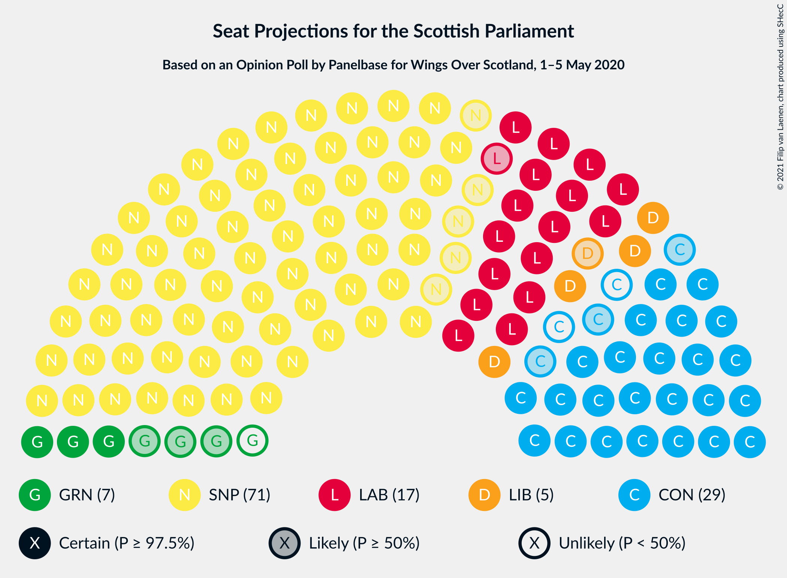
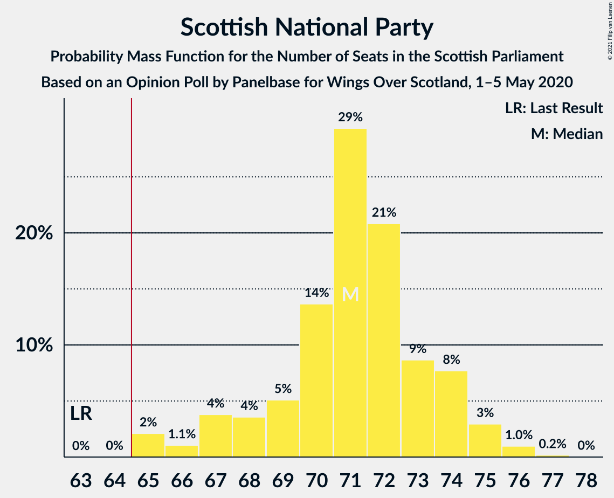
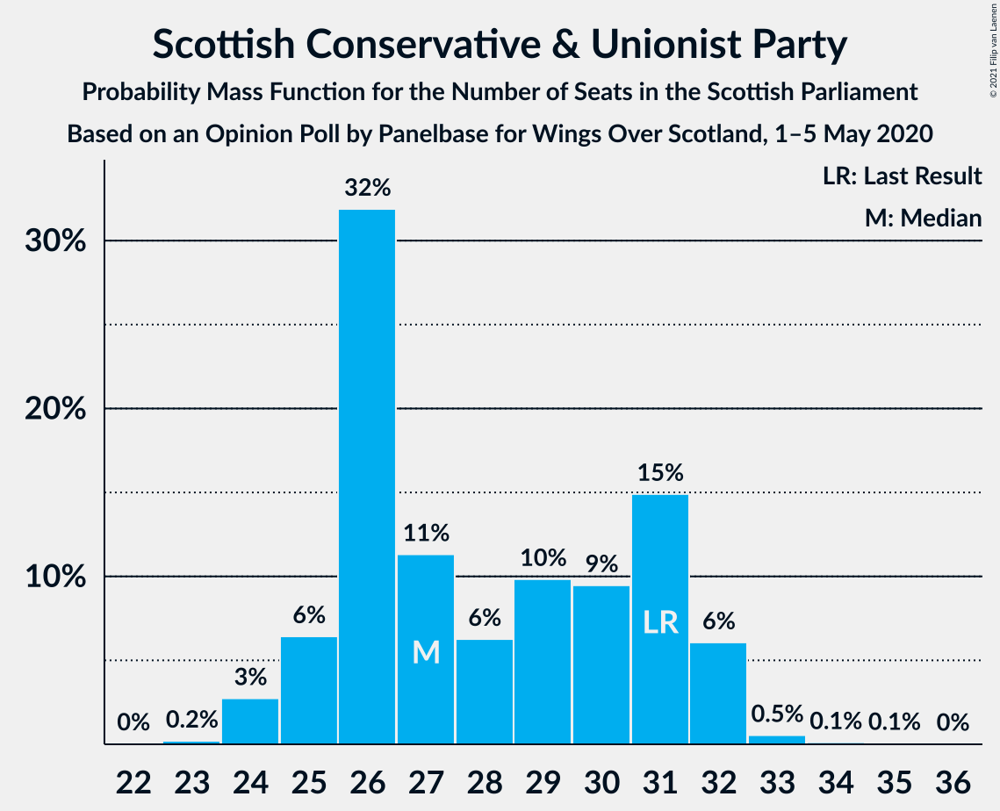
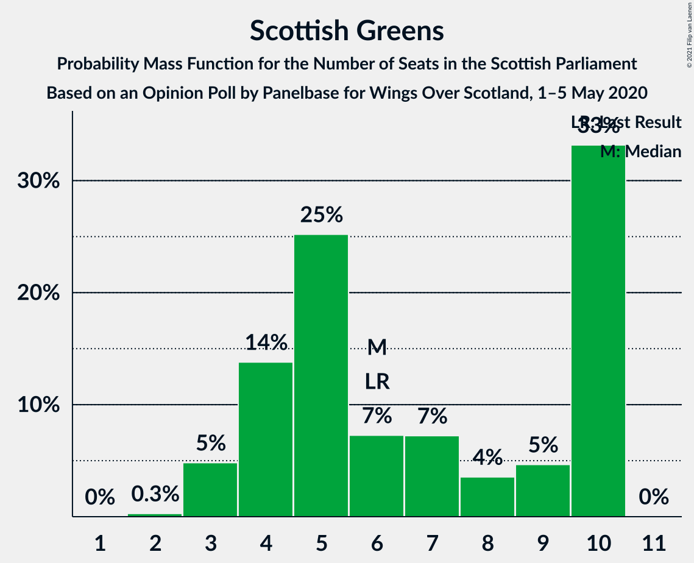
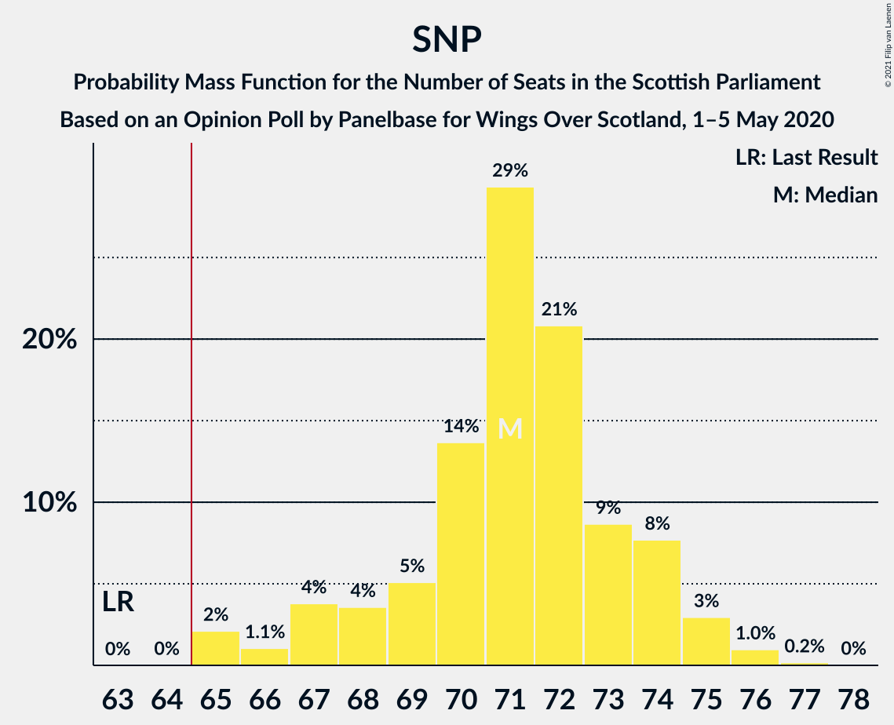
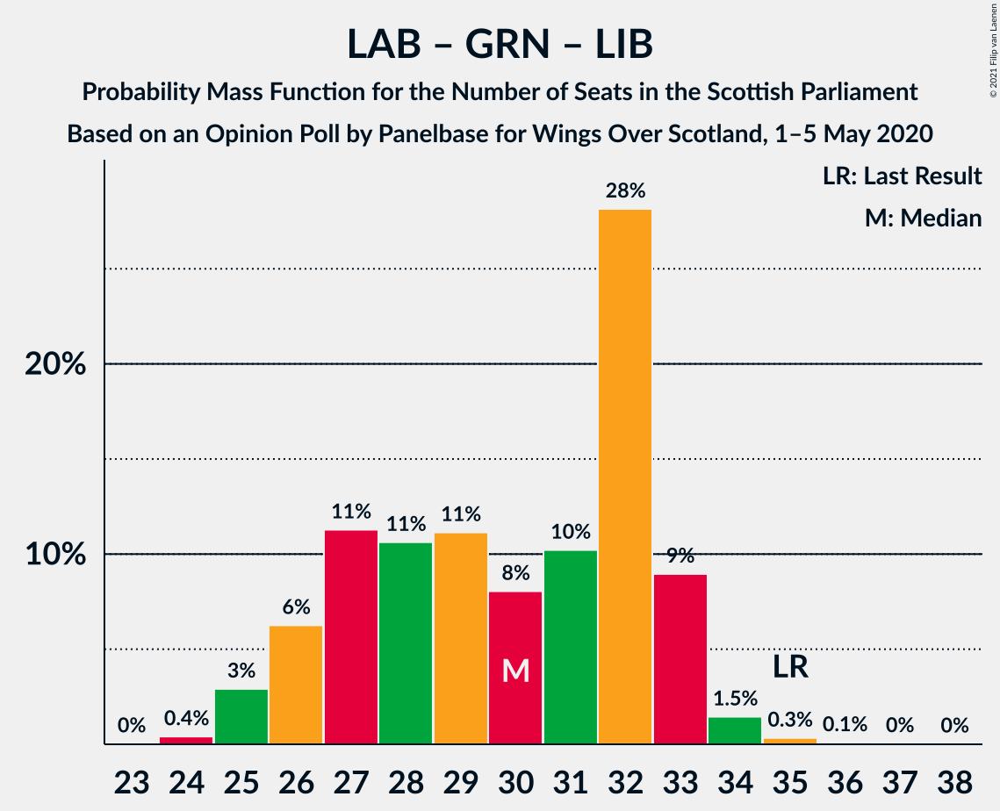

# Opinion Poll by Panelbase for Wings Over Scotland, 1–5 May 2020

<a href="#voting-intentions">Voting Intentions</a> | <a href="#seats">Seats</a> | <a href="#coalitions">Coalitions</a> | <a href="#technical-information">Technical Information</a>

## Voting Intentions

### Confidence Intervals

| Party | Last Result | Poll Result | 80% Confidence Interval | 90% Confidence Interval | 95% Confidence Interval | 99% Confidence Interval |
|:-----:|:-----------:|:-----------:|:-----------------------:|:-----------------------:|:-----------------------:|:-----------------------:|
| Scottish National Party | 41.7% | 48.5% | 46.6–50.5% |46.0–51.0% |45.6–51.5% |44.6–52.4% |
| Scottish Conservative & Unionist Party | 22.9% | 22.2% | 20.6–23.9% |20.2–24.4% |19.8–24.8% |19.1–25.6% |
| Scottish Labour | 19.1% | 15.2% | 13.9–16.7% |13.5–17.1% |13.2–17.5% |12.6–18.2% |
| Scottish Greens | 6.6% | 7.1% | 6.2–8.2% |5.9–8.5% |5.7–8.8% |5.3–9.3% |
| Scottish Liberal Democrats | 5.2% | 6.1% | 5.2–7.1% |5.0–7.4% |4.8–7.7% |4.4–8.2% |

*Note:* The poll result column reflects the actual value used in the calculations. Published results may vary slightly, and in addition be rounded to fewer digits.

## Seats

### Confidence Intervals

| Party | Last Result | Median | 80% Confidence Interval | 90% Confidence Interval | 95% Confidence Interval | 99% Confidence Interval |
|:-----:|:-----------:|:------:|:-----------------------:|:-----------------------:|:-----------------------:|:-----------------------:|
| <a href="#scottish-national-party">Scottish National Party</a> | 63 | 71 | 68–74 |67–74 |66–75 |65–76 |
| <a href="#scottish-conservative-&-unionist-party">Scottish Conservative & Unionist Party</a> | 31 | 27 | 26–31 |25–32 |24–32 |24–33 |
| <a href="#scottish-labour">Scottish Labour</a> | 24 | 17 | 17–21 |16–22 |16–22 |15–23 |
| <a href="#scottish-greens">Scottish Greens</a> | 6 | 6 | 4–10 |3–10 |3–10 |3–10 |
| <a href="#scottish-liberal-democrats">Scottish Liberal Democrats</a> | 5 | 5 | 5–6 |4–7 |4–8 |2–8 |

### Scottish National Party

*For a full overview of the results for this party, see the [Scottish National Party](party-scottishnationalparty.html) page.*

| Number of Seats | Probability | Accumulated | Special Marks |
|:---------------:|:-----------:|:-----------:|:-------------:|
| 63 | 0% | 100% | Last Result |
| 64 | 0% | 100% |  |
| 65 | 2% | 100% | Majority |
| 66 | 1.1% | 98% |  |
| 67 | 4% | 97% |  |
| 68 | 4% | 93% |  |
| 69 | 5% | 89% |  |
| 70 | 14% | 84% |  |
| 71 | 29% | 71% | Median |
| 72 | 21% | 41% |  |
| 73 | 9% | 21% |  |
| 74 | 8% | 12% |  |
| 75 | 3% | 4% |  |
| 76 | 1.0% | 1.2% |  |
| 77 | 0.2% | 0.2% |  |
| 78 | 0% | 0% |  |

### Scottish Conservative & Unionist Party

*For a full overview of the results for this party, see the [Scottish Conservative & Unionist Party](party-scottishconservativeunionistparty.html) page.*

| Number of Seats | Probability | Accumulated | Special Marks |
|:---------------:|:-----------:|:-----------:|:-------------:|
| 22 | 0% | 100% |  |
| 23 | 0.2% | 99.9% |  |
| 24 | 3% | 99.7% |  |
| 25 | 6% | 97% |  |
| 26 | 32% | 91% |  |
| 27 | 11% | 59% | Median |
| 28 | 6% | 47% |  |
| 29 | 10% | 41% |  |
| 30 | 9% | 31% |  |
| 31 | 15% | 22% | Last Result |
| 32 | 6% | 7% |  |
| 33 | 0.5% | 0.8% |  |
| 34 | 0.1% | 0.2% |  |
| 35 | 0.1% | 0.1% |  |
| 36 | 0% | 0% |  |

### Scottish Labour

*For a full overview of the results for this party, see the [Scottish Labour](party-scottishlabour.html) page.*

| Number of Seats | Probability | Accumulated | Special Marks |
|:---------------:|:-----------:|:-----------:|:-------------:|
| 13 | 0.1% | 100% |  |
| 14 | 0.1% | 99.9% |  |
| 15 | 0.5% | 99.8% |  |
| 16 | 5% | 99.3% |  |
| 17 | 62% | 95% | Median |
| 18 | 12% | 33% |  |
| 19 | 7% | 21% |  |
| 20 | 4% | 15% |  |
| 21 | 4% | 10% |  |
| 22 | 6% | 6% |  |
| 23 | 0.8% | 1.0% |  |
| 24 | 0.2% | 0.2% | Last Result |
| 25 | 0% | 0% |  |

### Scottish Greens

*For a full overview of the results for this party, see the [Scottish Greens](party-scottishgreens.html) page.*

| Number of Seats | Probability | Accumulated | Special Marks |
|:---------------:|:-----------:|:-----------:|:-------------:|
| 2 | 0.3% | 100% |  |
| 3 | 5% | 99.7% |  |
| 4 | 14% | 95% |  |
| 5 | 25% | 81% |  |
| 6 | 7% | 56% | Last Result, Median |
| 7 | 7% | 49% |  |
| 8 | 4% | 41% |  |
| 9 | 5% | 38% |  |
| 10 | 33% | 33% |  |
| 11 | 0% | 0% |  |

### Scottish Liberal Democrats

*For a full overview of the results for this party, see the [Scottish Liberal Democrats](party-scottishliberaldemocrats.html) page.*

| Number of Seats | Probability | Accumulated | Special Marks |
|:---------------:|:-----------:|:-----------:|:-------------:|
| 2 | 0.7% | 100% |  |
| 3 | 1.0% | 99.3% |  |
| 4 | 5% | 98% |  |
| 5 | 74% | 93% | Last Result, Median |
| 6 | 13% | 19% |  |
| 7 | 4% | 7% |  |
| 8 | 3% | 3% |  |
| 9 | 0.2% | 0.2% |  |
| 10 | 0% | 0% |  |

## Coalitions

### Confidence Intervals

| Coalition | Last Result | Median | Majority? | 80% Confidence Interval | 90% Confidence Interval | 95% Confidence Interval | 99% Confidence Interval |
|:---------:|:-----------:|:------:|:---------:|:-----------------------:|:-----------------------:|:-----------------------:|:-----------------------:|
| Scottish National Party – Scottish Greens | 69 | 78 | 100% | 75–81 | 74–82 | 73–83 | 71–83 |
| Scottish National Party | 63 | 71 | 100% | 68–74 | 67–74 | 66–75 | 65–76 |
| Scottish Conservative & Unionist Party – Scottish Labour – Scottish Liberal Democrats | 60 | 51 | 0% | 48–54 | 47–55 | 46–56 | 46–58 |
| Scottish Conservative & Unionist Party – Scottish Labour | 55 | 46 | 0% | 43–49 | 42–49 | 42–51 | 41–53 |
| Scottish Conservative & Unionist Party – Scottish Liberal Democrats | 36 | 33 | 0% | 30–37 | 30–37 | 29–37 | 28–39 |
| Scottish Labour – Scottish Greens – Scottish Liberal Democrats | 35 | 30 | 0% | 27–33 | 26–33 | 25–33 | 25–35 |
| Scottish Labour – Scottish Liberal Democrats | 29 | 22 | 0% | 22–26 | 21–27 | 21–28 | 19–29 |

### Scottish National Party – Scottish Greens

| Number of Seats | Probability | Accumulated | Special Marks |
|:---------------:|:-----------:|:-----------:|:-------------:|
| 69 | 0.1% | 100% | Last Result |
| 70 | 0.4% | 99.9% |  |
| 71 | 0.6% | 99.5% |  |
| 72 | 0.8% | 98.9% |  |
| 73 | 2% | 98% |  |
| 74 | 3% | 96% |  |
| 75 | 11% | 94% |  |
| 76 | 17% | 82% |  |
| 77 | 12% | 65% | Median |
| 78 | 9% | 53% |  |
| 79 | 8% | 44% |  |
| 80 | 9% | 36% |  |
| 81 | 21% | 28% |  |
| 82 | 4% | 7% |  |
| 83 | 2% | 3% |  |
| 84 | 0.3% | 0.3% |  |
| 85 | 0% | 0% |  |

### Scottish National Party

| Number of Seats | Probability | Accumulated | Special Marks |
|:---------------:|:-----------:|:-----------:|:-------------:|
| 63 | 0% | 100% | Last Result |
| 64 | 0% | 100% |  |
| 65 | 2% | 100% | Majority |
| 66 | 1.1% | 98% |  |
| 67 | 4% | 97% |  |
| 68 | 4% | 93% |  |
| 69 | 5% | 89% |  |
| 70 | 14% | 84% |  |
| 71 | 29% | 71% | Median |
| 72 | 21% | 41% |  |
| 73 | 9% | 21% |  |
| 74 | 8% | 12% |  |
| 75 | 3% | 4% |  |
| 76 | 1.0% | 1.2% |  |
| 77 | 0.2% | 0.2% |  |
| 78 | 0% | 0% |  |

### Scottish Conservative & Unionist Party – Scottish Labour – Scottish Liberal Democrats

| Number of Seats | Probability | Accumulated | Special Marks |
|:---------------:|:-----------:|:-----------:|:-------------:|
| 45 | 0.3% | 100% |  |
| 46 | 2% | 99.7% |  |
| 47 | 4% | 97% |  |
| 48 | 21% | 93% |  |
| 49 | 9% | 72% | Median |
| 50 | 8% | 64% |  |
| 51 | 9% | 56% |  |
| 52 | 12% | 47% |  |
| 53 | 17% | 35% |  |
| 54 | 11% | 18% |  |
| 55 | 3% | 6% |  |
| 56 | 2% | 4% |  |
| 57 | 0.8% | 2% |  |
| 58 | 0.6% | 1.1% |  |
| 59 | 0.4% | 0.5% |  |
| 60 | 0.1% | 0.1% | Last Result |
| 61 | 0% | 0% |  |

### Scottish Conservative & Unionist Party – Scottish Labour

| Number of Seats | Probability | Accumulated | Special Marks |
|:---------------:|:-----------:|:-----------:|:-------------:|
| 40 | 0.2% | 100% |  |
| 41 | 2% | 99.8% |  |
| 42 | 4% | 98% |  |
| 43 | 26% | 94% |  |
| 44 | 6% | 68% | Median |
| 45 | 7% | 62% |  |
| 46 | 11% | 55% |  |
| 47 | 12% | 44% |  |
| 48 | 19% | 32% |  |
| 49 | 8% | 13% |  |
| 50 | 2% | 5% |  |
| 51 | 1.4% | 3% |  |
| 52 | 0.6% | 1.5% |  |
| 53 | 0.5% | 0.8% |  |
| 54 | 0.3% | 0.4% |  |
| 55 | 0.1% | 0.1% | Last Result |
| 56 | 0% | 0% |  |

### Scottish Conservative & Unionist Party – Scottish Liberal Democrats

| Number of Seats | Probability | Accumulated | Special Marks |
|:---------------:|:-----------:|:-----------:|:-------------:|
| 27 | 0.1% | 100% |  |
| 28 | 0.5% | 99.9% |  |
| 29 | 3% | 99.4% |  |
| 30 | 7% | 96% |  |
| 31 | 25% | 90% |  |
| 32 | 14% | 65% | Median |
| 33 | 7% | 51% |  |
| 34 | 10% | 44% |  |
| 35 | 10% | 34% |  |
| 36 | 13% | 24% | Last Result |
| 37 | 9% | 11% |  |
| 38 | 1.4% | 2% |  |
| 39 | 0.4% | 0.6% |  |
| 40 | 0.1% | 0.2% |  |
| 41 | 0% | 0% |  |

### Scottish Labour – Scottish Greens – Scottish Liberal Democrats

| Number of Seats | Probability | Accumulated | Special Marks |
|:---------------:|:-----------:|:-----------:|:-------------:|
| 24 | 0.4% | 100% |  |
| 25 | 3% | 99.6% |  |
| 26 | 6% | 97% |  |
| 27 | 11% | 90% |  |
| 28 | 11% | 79% | Median |
| 29 | 11% | 68% |  |
| 30 | 8% | 57% |  |
| 31 | 10% | 49% |  |
| 32 | 28% | 39% |  |
| 33 | 9% | 11% |  |
| 34 | 1.5% | 2% |  |
| 35 | 0.3% | 0.5% | Last Result |
| 36 | 0.1% | 0.2% |  |
| 37 | 0% | 0.1% |  |
| 38 | 0% | 0% |  |

### Scottish Labour – Scottish Liberal Democrats

| Number of Seats | Probability | Accumulated | Special Marks |
|:---------------:|:-----------:|:-----------:|:-------------:|
| 18 | 0.1% | 100% |  |
| 19 | 0.6% | 99.9% |  |
| 20 | 1.2% | 99.3% |  |
| 21 | 6% | 98% |  |
| 22 | 48% | 92% | Median |
| 23 | 18% | 44% |  |
| 24 | 9% | 26% |  |
| 25 | 6% | 18% |  |
| 26 | 4% | 12% |  |
| 27 | 5% | 8% |  |
| 28 | 2% | 3% |  |
| 29 | 0.6% | 0.7% | Last Result |
| 30 | 0.1% | 0.1% |  |
| 31 | 0% | 0% |  |

## Technical Information

### Opinion Poll

+ **Polling firm:** Panelbase
+ **Commissioner(s):** Wings Over Scotland
+ **Fieldwork period:** 1–5 May 2020

### Calculations

+ **Sample size:** 1086
+ **Simulations done:** 1,048,576
+ **Error estimate:** 0.72%

