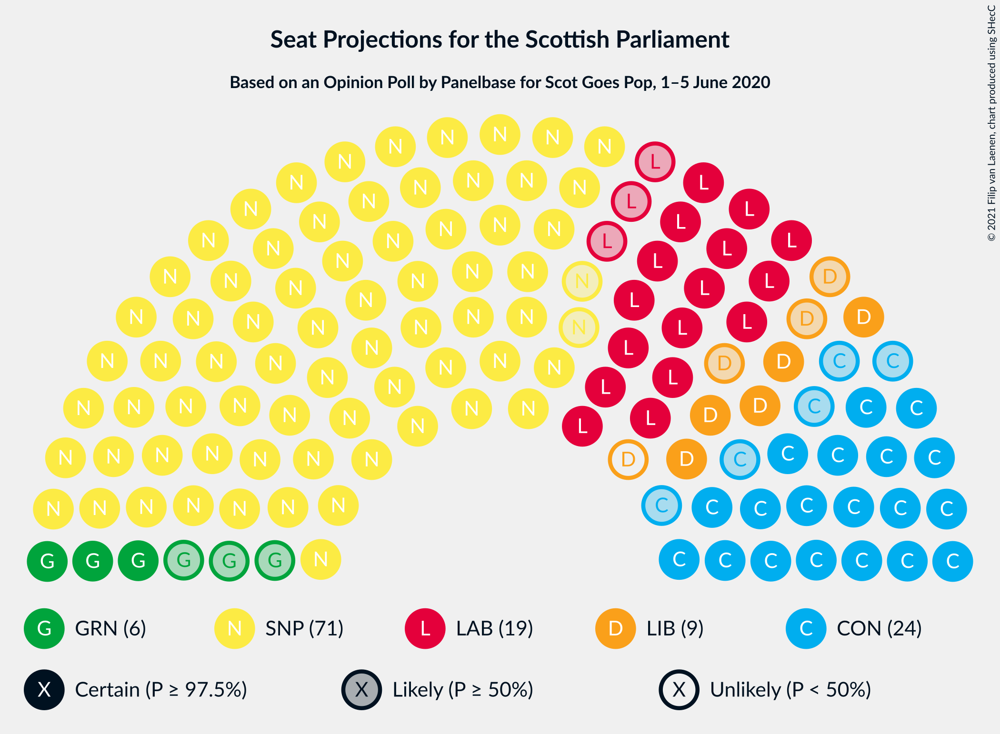
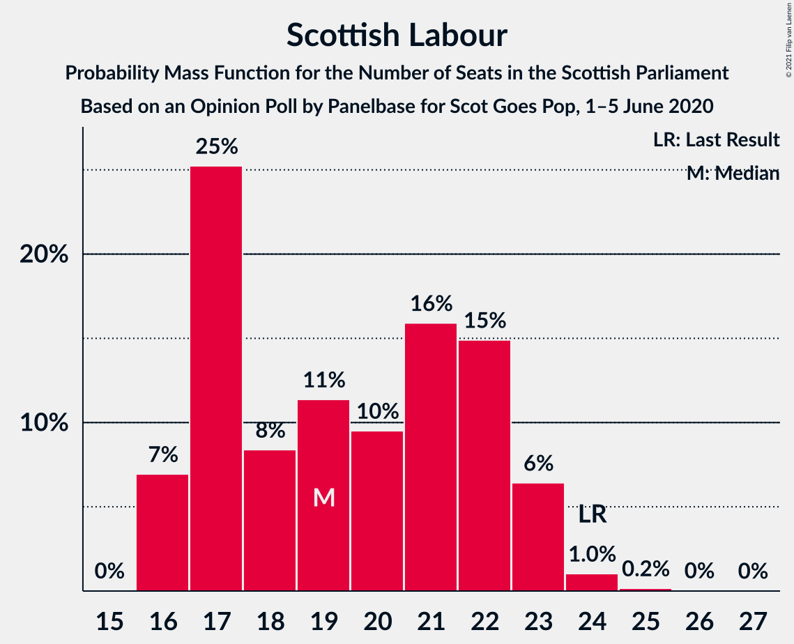
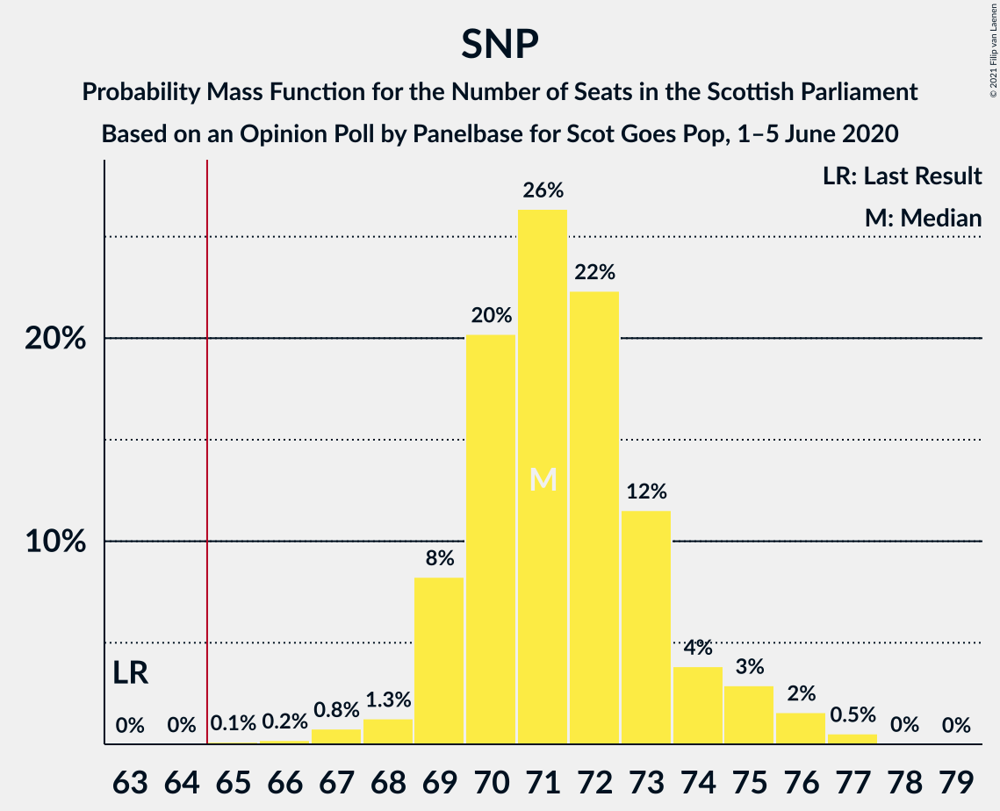

# Opinion Poll by Panelbase for Scot Goes Pop, 1–5 June 2020

<a href="#voting-intentions">Voting Intentions</a> | <a href="#seats">Seats</a> | <a href="#coalitions">Coalitions</a> | <a href="#technical-information">Technical Information</a>

## Voting Intentions

### Confidence Intervals

| Party | Last Result | Poll Result | 80% Confidence Interval | 90% Confidence Interval | 95% Confidence Interval | 99% Confidence Interval |
|:-----:|:-----------:|:-----------:|:-----------------------:|:-----------------------:|:-----------------------:|:-----------------------:|
| Scottish National Party | 41.7% | 48.0% | 46.0–50.1% |45.5–50.6% |45.0–51.1% |44.0–52.1% |
| Scottish Conservative & Unionist Party | 22.9% | 19.0% | 17.5–20.6% |17.1–21.1% |16.7–21.5% |16.0–22.3% |
| Scottish Labour | 19.1% | 16.0% | 14.6–17.6% |14.3–18.0% |13.9–18.4% |13.3–19.2% |
| Scottish Liberal Democrats | 5.2% | 8.0% | 7.0–9.2% |6.7–9.6% |6.5–9.9% |6.1–10.5% |
| Scottish Greens | 6.6% | 7.0% | 6.1–8.2% |5.9–8.5% |5.6–8.8% |5.2–9.4% |

*Note:* The poll result column reflects the actual value used in the calculations. Published results may vary slightly, and in addition be rounded to fewer digits.

## Seats

### Confidence Intervals

| Party | Last Result | Median | 80% Confidence Interval | 90% Confidence Interval | 95% Confidence Interval | 99% Confidence Interval |
|:-----:|:-----------:|:------:|:-----------------------:|:-----------------------:|:-----------------------:|:-----------------------:|
| <a href="#scottish-national-party">Scottish National Party</a> | 63 | 72 | 69–73 |68–75 |67–75 |65–76 |
| <a href="#scottish-conservative-&-unionist-party">Scottish Conservative & Unionist Party</a> | 31 | 24 | 21–25 |20–26 |19–27 |18–29 |
| <a href="#scottish-labour">Scottish Labour</a> | 24 | 20 | 17–22 |17–22 |16–23 |16–24 |
| <a href="#scottish-liberal-democrats">Scottish Liberal Democrats</a> | 5 | 8 | 6–10 |6–11 |5–11 |5–12 |
| <a href="#scottish-greens">Scottish Greens</a> | 6 | 6 | 4–10 |3–10 |3–10 |2–10 |

### Scottish National Party

*For a full overview of the results for this party, see the [Scottish National Party](party-scottishnationalparty.html) page.*

| Number of Seats | Probability | Accumulated | Special Marks |
|:---------------:|:-----------:|:-----------:|:-------------:|
| 63 | 0% | 100% | Last Result |
| 64 | 0.1% | 100% |  |
| 65 | 0.4% | 99.9% | Majority |
| 66 | 1.1% | 99.5% |  |
| 67 | 2% | 98% |  |
| 68 | 4% | 96% |  |
| 69 | 8% | 92% |  |
| 70 | 12% | 85% |  |
| 71 | 14% | 72% |  |
| 72 | 31% | 59% | Median |
| 73 | 19% | 28% |  |
| 74 | 2% | 9% |  |
| 75 | 4% | 6% |  |
| 76 | 2% | 2% |  |
| 77 | 0.4% | 0.5% |  |
| 78 | 0% | 0% |  |

### Scottish Conservative & Unionist Party

*For a full overview of the results for this party, see the [Scottish Conservative & Unionist Party](party-scottishconservativeunionistparty.html) page.*

| Number of Seats | Probability | Accumulated | Special Marks |
|:---------------:|:-----------:|:-----------:|:-------------:|
| 17 | 0% | 100% |  |
| 18 | 0.5% | 99.9% |  |
| 19 | 4% | 99.4% |  |
| 20 | 4% | 95% |  |
| 21 | 7% | 92% |  |
| 22 | 15% | 85% |  |
| 23 | 17% | 70% |  |
| 24 | 20% | 53% | Median |
| 25 | 24% | 33% |  |
| 26 | 6% | 10% |  |
| 27 | 1.4% | 3% |  |
| 28 | 1.3% | 2% |  |
| 29 | 0.4% | 0.8% |  |
| 30 | 0.2% | 0.3% |  |
| 31 | 0.1% | 0.1% | Last Result |
| 32 | 0% | 0% |  |

### Scottish Labour

*For a full overview of the results for this party, see the [Scottish Labour](party-scottishlabour.html) page.*

| Number of Seats | Probability | Accumulated | Special Marks |
|:---------------:|:-----------:|:-----------:|:-------------:|
| 15 | 0.1% | 100% |  |
| 16 | 3% | 99.9% |  |
| 17 | 26% | 96% |  |
| 18 | 8% | 70% |  |
| 19 | 12% | 62% |  |
| 20 | 10% | 51% | Median |
| 21 | 16% | 41% |  |
| 22 | 21% | 25% |  |
| 23 | 3% | 4% |  |
| 24 | 0.4% | 0.5% | Last Result |
| 25 | 0.1% | 0.1% |  |
| 26 | 0% | 0% |  |

### Scottish Liberal Democrats

*For a full overview of the results for this party, see the [Scottish Liberal Democrats](party-scottishliberaldemocrats.html) page.*

| Number of Seats | Probability | Accumulated | Special Marks |
|:---------------:|:-----------:|:-----------:|:-------------:|
| 5 | 4% | 100% | Last Result |
| 6 | 8% | 96% |  |
| 7 | 23% | 88% |  |
| 8 | 45% | 65% | Median |
| 9 | 10% | 21% |  |
| 10 | 6% | 11% |  |
| 11 | 4% | 5% |  |
| 12 | 1.4% | 1.5% |  |
| 13 | 0.1% | 0.1% |  |
| 14 | 0% | 0% |  |

### Scottish Greens

*For a full overview of the results for this party, see the [Scottish Greens](party-scottishgreens.html) page.*

| Number of Seats | Probability | Accumulated | Special Marks |
|:---------------:|:-----------:|:-----------:|:-------------:|
| 2 | 0.7% | 100% |  |
| 3 | 7% | 99.3% |  |
| 4 | 21% | 92% |  |
| 5 | 14% | 71% |  |
| 6 | 8% | 56% | Last Result, Median |
| 7 | 7% | 48% |  |
| 8 | 7% | 41% |  |
| 9 | 7% | 35% |  |
| 10 | 27% | 27% |  |
| 11 | 0% | 0% |  |

## Coalitions

### Confidence Intervals

| Coalition | Last Result | Median | Majority? | 80% Confidence Interval | 90% Confidence Interval | 95% Confidence Interval | 99% Confidence Interval |
|:---------:|:-----------:|:------:|:---------:|:-----------------------:|:-----------------------:|:-----------------------:|:-----------------------:|
| Scottish National Party – Scottish Greens | 69 | 78 | 100% | 75–82 | 74–83 | 73–83 | 71–84 |
| Scottish National Party | 63 | 72 | 99.9% | 69–73 | 68–75 | 67–75 | 65–76 |
| Scottish Conservative & Unionist Party – Scottish Labour – Scottish Liberal Democrats | 60 | 51 | 0% | 47–54 | 46–55 | 46–56 | 45–58 |
| Scottish Conservative & Unionist Party – Scottish Labour | 55 | 43 | 0% | 39–46 | 38–47 | 38–48 | 37–49 |
| Scottish Labour – Scottish Liberal Democrats – Scottish Greens | 35 | 34 | 0% | 31–37 | 31–38 | 30–39 | 28–40 |
| Scottish Conservative & Unionist Party – Scottish Liberal Democrats | 36 | 31 | 0% | 28–34 | 27–35 | 27–36 | 26–38 |
| Scottish Labour – Scottish Liberal Democrats | 29 | 28 | 0% | 24–30 | 24–31 | 23–32 | 22–33 |

### Scottish National Party – Scottish Greens

| Number of Seats | Probability | Accumulated | Special Marks |
|:---------------:|:-----------:|:-----------:|:-------------:|
| 69 | 0.1% | 100% | Last Result |
| 70 | 0.1% | 99.9% |  |
| 71 | 0.7% | 99.8% |  |
| 72 | 0.8% | 99.1% |  |
| 73 | 2% | 98% |  |
| 74 | 4% | 96% |  |
| 75 | 7% | 92% |  |
| 76 | 19% | 85% |  |
| 77 | 15% | 66% |  |
| 78 | 7% | 51% | Median |
| 79 | 7% | 44% |  |
| 80 | 11% | 37% |  |
| 81 | 9% | 26% |  |
| 82 | 9% | 17% |  |
| 83 | 6% | 7% |  |
| 84 | 0.9% | 0.9% |  |
| 85 | 0% | 0% |  |

### Scottish National Party

| Number of Seats | Probability | Accumulated | Special Marks |
|:---------------:|:-----------:|:-----------:|:-------------:|
| 63 | 0% | 100% | Last Result |
| 64 | 0.1% | 100% |  |
| 65 | 0.4% | 99.9% | Majority |
| 66 | 1.1% | 99.5% |  |
| 67 | 2% | 98% |  |
| 68 | 4% | 96% |  |
| 69 | 8% | 92% |  |
| 70 | 12% | 85% |  |
| 71 | 14% | 72% |  |
| 72 | 31% | 59% | Median |
| 73 | 19% | 28% |  |
| 74 | 2% | 9% |  |
| 75 | 4% | 6% |  |
| 76 | 2% | 2% |  |
| 77 | 0.4% | 0.5% |  |
| 78 | 0% | 0% |  |

### Scottish Conservative & Unionist Party – Scottish Labour – Scottish Liberal Democrats

| Number of Seats | Probability | Accumulated | Special Marks |
|:---------------:|:-----------:|:-----------:|:-------------:|
| 45 | 0.9% | 100% |  |
| 46 | 6% | 99.1% |  |
| 47 | 9% | 93% |  |
| 48 | 9% | 83% |  |
| 49 | 11% | 74% |  |
| 50 | 7% | 63% |  |
| 51 | 7% | 56% |  |
| 52 | 15% | 49% | Median |
| 53 | 19% | 34% |  |
| 54 | 7% | 15% |  |
| 55 | 4% | 8% |  |
| 56 | 2% | 4% |  |
| 57 | 0.8% | 2% |  |
| 58 | 0.7% | 0.9% |  |
| 59 | 0.1% | 0.2% |  |
| 60 | 0.1% | 0.1% | Last Result |
| 61 | 0% | 0% |  |

### Scottish Conservative & Unionist Party – Scottish Labour

| Number of Seats | Probability | Accumulated | Special Marks |
|:---------------:|:-----------:|:-----------:|:-------------:|
| 36 | 0.2% | 100% |  |
| 37 | 0.5% | 99.8% |  |
| 38 | 6% | 99.4% |  |
| 39 | 6% | 94% |  |
| 40 | 8% | 88% |  |
| 41 | 11% | 80% |  |
| 42 | 13% | 69% |  |
| 43 | 9% | 56% |  |
| 44 | 15% | 48% | Median |
| 45 | 20% | 33% |  |
| 46 | 5% | 13% |  |
| 47 | 4% | 7% |  |
| 48 | 2% | 4% |  |
| 49 | 1.0% | 1.5% |  |
| 50 | 0.3% | 0.5% |  |
| 51 | 0.2% | 0.2% |  |
| 52 | 0% | 0% |  |
| 53 | 0% | 0% |  |
| 54 | 0% | 0% |  |
| 55 | 0% | 0% | Last Result |

### Scottish Labour – Scottish Liberal Democrats – Scottish Greens

| Number of Seats | Probability | Accumulated | Special Marks |
|:---------------:|:-----------:|:-----------:|:-------------:|
| 26 | 0.1% | 100% |  |
| 27 | 0.2% | 99.9% |  |
| 28 | 0.3% | 99.7% |  |
| 29 | 1.1% | 99.4% |  |
| 30 | 1.5% | 98% |  |
| 31 | 8% | 97% |  |
| 32 | 10% | 89% |  |
| 33 | 21% | 79% |  |
| 34 | 23% | 58% | Median |
| 35 | 12% | 35% | Last Result |
| 36 | 7% | 23% |  |
| 37 | 6% | 16% |  |
| 38 | 6% | 10% |  |
| 39 | 2% | 4% |  |
| 40 | 0.9% | 1.4% |  |
| 41 | 0.4% | 0.4% |  |
| 42 | 0% | 0.1% |  |
| 43 | 0% | 0% |  |

### Scottish Conservative & Unionist Party – Scottish Liberal Democrats

| Number of Seats | Probability | Accumulated | Special Marks |
|:---------------:|:-----------:|:-----------:|:-------------:|
| 25 | 0.1% | 100% |  |
| 26 | 2% | 99.9% |  |
| 27 | 4% | 98% |  |
| 28 | 4% | 93% |  |
| 29 | 8% | 89% |  |
| 30 | 16% | 82% |  |
| 31 | 20% | 65% |  |
| 32 | 16% | 46% | Median |
| 33 | 12% | 30% |  |
| 34 | 11% | 18% |  |
| 35 | 4% | 7% |  |
| 36 | 1.5% | 3% | Last Result |
| 37 | 0.6% | 1.1% |  |
| 38 | 0.2% | 0.5% |  |
| 39 | 0.2% | 0.3% |  |
| 40 | 0.1% | 0.1% |  |
| 41 | 0% | 0% |  |

### Scottish Labour – Scottish Liberal Democrats

| Number of Seats | Probability | Accumulated | Special Marks |
|:---------------:|:-----------:|:-----------:|:-------------:|
| 22 | 2% | 100% |  |
| 23 | 3% | 98% |  |
| 24 | 13% | 95% |  |
| 25 | 12% | 83% |  |
| 26 | 8% | 71% |  |
| 27 | 10% | 63% |  |
| 28 | 14% | 53% | Median |
| 29 | 16% | 38% | Last Result |
| 30 | 15% | 23% |  |
| 31 | 5% | 8% |  |
| 32 | 1.5% | 3% |  |
| 33 | 1.2% | 2% |  |
| 34 | 0.3% | 0.4% |  |
| 35 | 0.1% | 0.1% |  |
| 36 | 0% | 0% |  |

## Technical Information

### Opinion Poll

+ **Polling firm:** Panelbase
+ **Commissioner(s):** Scot Goes Pop
+ **Fieldwork period:** 1–5 June 2020

### Calculations

+ **Sample size:** 1022
+ **Simulations done:** 131,072
+ **Error estimate:** 0.84%

