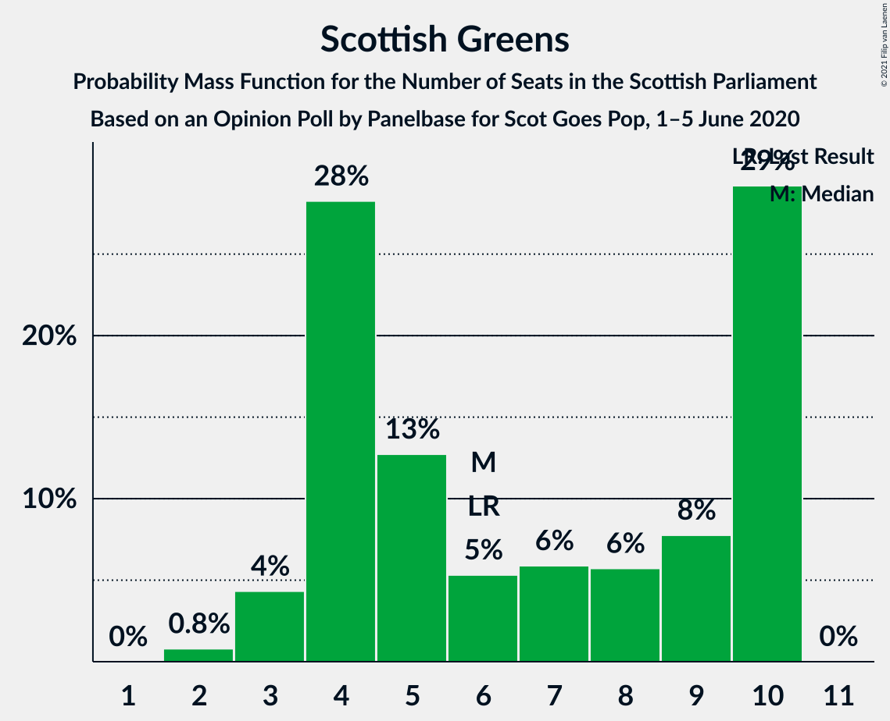
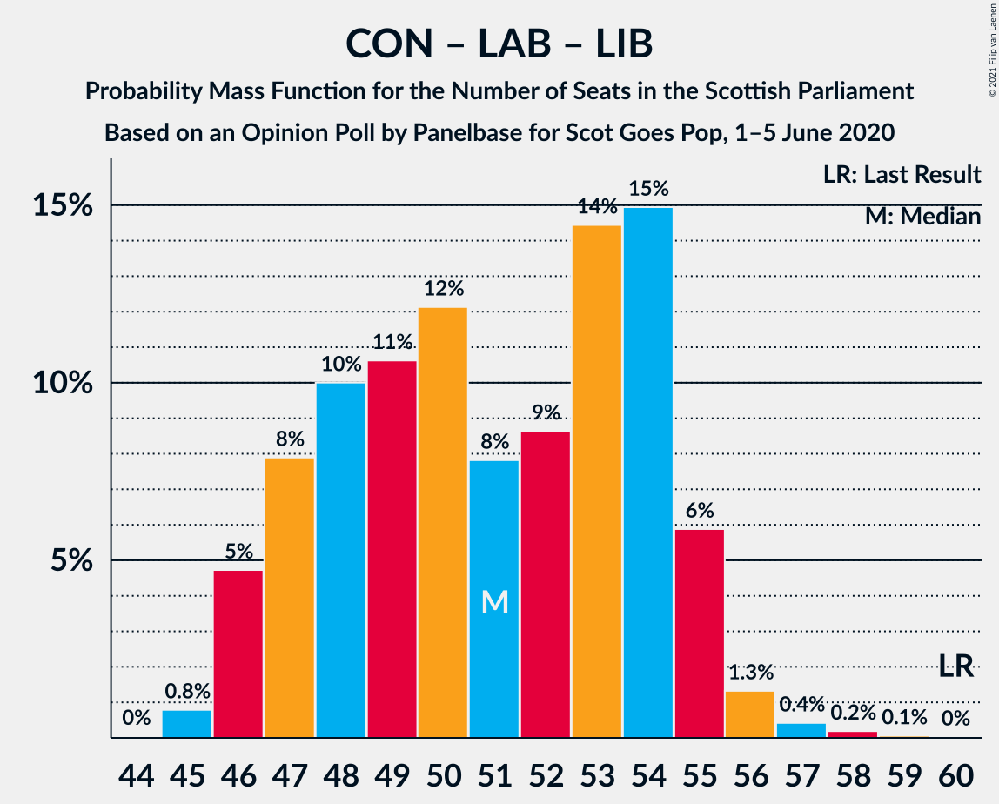

# Opinion Poll by Panelbase for Scot Goes Pop, 1–5 June 2020

<a href="#voting-intentions">Voting Intentions</a> | <a href="#seats">Seats</a> | <a href="#coalitions">Coalitions</a> | <a href="#technical-information">Technical Information</a>

## Voting Intentions

### Confidence Intervals

| Party | Last Result | Poll Result | 80% Confidence Interval | 90% Confidence Interval | 95% Confidence Interval | 99% Confidence Interval |
|:-----:|:-----------:|:-----------:|:-----------------------:|:-----------------------:|:-----------------------:|:-----------------------:|
| Scottish National Party | 41.7% | 48.0% | 46.0–50.1% |45.5–50.6% |45.0–51.1% |44.0–52.1% |
| Scottish Conservative & Unionist Party | 22.9% | 19.0% | 17.5–20.6% |17.1–21.1% |16.7–21.5% |16.0–22.3% |
| Scottish Labour | 19.1% | 16.0% | 14.6–17.6% |14.3–18.0% |13.9–18.4% |13.3–19.2% |
| Scottish Liberal Democrats | 5.2% | 8.0% | 7.0–9.2% |6.7–9.6% |6.5–9.9% |6.1–10.5% |
| Scottish Greens | 6.6% | 7.0% | 6.1–8.2% |5.9–8.5% |5.6–8.8% |5.2–9.4% |

*Note:* The poll result column reflects the actual value used in the calculations. Published results may vary slightly, and in addition be rounded to fewer digits.

## Seats

### Confidence Intervals

| Party | Last Result | Median | 80% Confidence Interval | 90% Confidence Interval | 95% Confidence Interval | 99% Confidence Interval |
|:-----:|:-----------:|:------:|:-----------------------:|:-----------------------:|:-----------------------:|:-----------------------:|
| <a href="#scottish-national-party">Scottish National Party</a> | 63 | 71 | 69–73 |69–75 |69–75 |67–77 |
| <a href="#scottish-conservative-&-unionist-party">Scottish Conservative & Unionist Party</a> | 31 | 24 | 21–26 |20–26 |19–27 |19–29 |
| <a href="#scottish-labour">Scottish Labour</a> | 24 | 19 | 17–22 |16–23 |16–23 |16–24 |
| <a href="#scottish-liberal-democrats">Scottish Liberal Democrats</a> | 5 | 8 | 6–10 |5–11 |5–11 |5–12 |
| <a href="#scottish-greens">Scottish Greens</a> | 6 | 6 | 4–10 |3–10 |3–10 |2–10 |

### Scottish National Party

*For a full overview of the results for this party, see the [Scottish National Party](party-scottishnationalparty.html) page.*

| Number of Seats | Probability | Accumulated | Special Marks |
|:---------------:|:-----------:|:-----------:|:-------------:|
| 63 | 0% | 100% | Last Result |
| 64 | 0% | 100% |  |
| 65 | 0.1% | 100% | Majority |
| 66 | 0.2% | 99.8% |  |
| 67 | 0.8% | 99.6% |  |
| 68 | 1.3% | 98.9% |  |
| 69 | 8% | 98% |  |
| 70 | 20% | 89% |  |
| 71 | 26% | 69% | Median |
| 72 | 22% | 43% |  |
| 73 | 12% | 20% |  |
| 74 | 4% | 9% |  |
| 75 | 3% | 5% |  |
| 76 | 2% | 2% |  |
| 77 | 0.5% | 0.6% |  |
| 78 | 0% | 0.1% |  |
| 79 | 0% | 0% |  |

### Scottish Conservative & Unionist Party

*For a full overview of the results for this party, see the [Scottish Conservative & Unionist Party](party-scottishconservativeunionistparty.html) page.*

| Number of Seats | Probability | Accumulated | Special Marks |
|:---------------:|:-----------:|:-----------:|:-------------:|
| 17 | 0% | 100% |  |
| 18 | 0.2% | 99.9% |  |
| 19 | 4% | 99.8% |  |
| 20 | 4% | 96% |  |
| 21 | 7% | 92% |  |
| 22 | 15% | 85% |  |
| 23 | 17% | 70% |  |
| 24 | 18% | 53% | Median |
| 25 | 18% | 35% |  |
| 26 | 14% | 17% |  |
| 27 | 2% | 3% |  |
| 28 | 0.9% | 2% |  |
| 29 | 0.4% | 0.7% |  |
| 30 | 0.2% | 0.3% |  |
| 31 | 0.1% | 0.1% | Last Result |
| 32 | 0% | 0% |  |

### Scottish Labour

*For a full overview of the results for this party, see the [Scottish Labour](party-scottishlabour.html) page.*

| Number of Seats | Probability | Accumulated | Special Marks |
|:---------------:|:-----------:|:-----------:|:-------------:|
| 16 | 7% | 100% |  |
| 17 | 25% | 93% |  |
| 18 | 8% | 68% |  |
| 19 | 11% | 59% | Median |
| 20 | 10% | 48% |  |
| 21 | 16% | 39% |  |
| 22 | 15% | 23% |  |
| 23 | 6% | 8% |  |
| 24 | 1.0% | 1.3% | Last Result |
| 25 | 0.2% | 0.2% |  |
| 26 | 0% | 0.1% |  |
| 27 | 0% | 0% |  |

### Scottish Liberal Democrats

*For a full overview of the results for this party, see the [Scottish Liberal Democrats](party-scottishliberaldemocrats.html) page.*

| Number of Seats | Probability | Accumulated | Special Marks |
|:---------------:|:-----------:|:-----------:|:-------------:|
| 5 | 5% | 100% | Last Result |
| 6 | 11% | 95% |  |
| 7 | 18% | 83% |  |
| 8 | 25% | 65% | Median |
| 9 | 29% | 41% |  |
| 10 | 6% | 12% |  |
| 11 | 5% | 5% |  |
| 12 | 0.6% | 0.6% |  |
| 13 | 0.1% | 0.1% |  |
| 14 | 0% | 0% |  |

### Scottish Greens

*For a full overview of the results for this party, see the [Scottish Greens](party-scottishgreens.html) page.*

| Number of Seats | Probability | Accumulated | Special Marks |
|:---------------:|:-----------:|:-----------:|:-------------:|
| 2 | 0.8% | 100% |  |
| 3 | 4% | 99.2% |  |
| 4 | 28% | 95% |  |
| 5 | 13% | 67% |  |
| 6 | 5% | 54% | Last Result, Median |
| 7 | 6% | 49% |  |
| 8 | 6% | 43% |  |
| 9 | 8% | 37% |  |
| 10 | 29% | 29% |  |
| 11 | 0% | 0% |  |

## Coalitions

### Confidence Intervals

| Coalition | Last Result | Median | Majority? | 80% Confidence Interval | 90% Confidence Interval | 95% Confidence Interval | 99% Confidence Interval |
|:---------:|:-----------:|:------:|:---------:|:-----------------------:|:-----------------------:|:-----------------------:|:-----------------------:|
| Scottish National Party – Scottish Greens | 69 | 78 | 100% | 75–82 | 74–83 | 74–83 | 72–84 |
| Scottish National Party | 63 | 71 | 100% | 69–73 | 69–75 | 69–75 | 67–77 |
| Scottish Conservative & Unionist Party – Scottish Labour – Scottish Liberal Democrats | 60 | 51 | 0% | 47–54 | 46–55 | 46–55 | 45–57 |
| Scottish Conservative & Unionist Party – Scottish Labour | 55 | 43 | 0% | 39–46 | 38–47 | 38–48 | 37–49 |
| Scottish Labour – Scottish Liberal Democrats – Scottish Greens | 35 | 34 | 0% | 32–37 | 31–39 | 30–39 | 28–41 |
| Scottish Conservative & Unionist Party – Scottish Liberal Democrats | 36 | 32 | 0% | 29–34 | 28–35 | 27–35 | 26–37 |
| Scottish Labour – Scottish Liberal Democrats | 29 | 28 | 0% | 24–31 | 23–31 | 23–32 | 22–33 |

### Scottish National Party – Scottish Greens

| Number of Seats | Probability | Accumulated | Special Marks |
|:---------------:|:-----------:|:-----------:|:-------------:|
| 69 | 0% | 100% | Last Result |
| 70 | 0.1% | 100% |  |
| 71 | 0.2% | 99.9% |  |
| 72 | 0.4% | 99.7% |  |
| 73 | 1.3% | 99.3% |  |
| 74 | 6% | 98% |  |
| 75 | 15% | 92% |  |
| 76 | 14% | 77% |  |
| 77 | 9% | 63% | Median |
| 78 | 8% | 54% |  |
| 79 | 12% | 46% |  |
| 80 | 11% | 34% |  |
| 81 | 10% | 23% |  |
| 82 | 8% | 13% |  |
| 83 | 5% | 6% |  |
| 84 | 0.8% | 0.8% |  |
| 85 | 0% | 0.1% |  |
| 86 | 0% | 0% |  |

### Scottish National Party

| Number of Seats | Probability | Accumulated | Special Marks |
|:---------------:|:-----------:|:-----------:|:-------------:|
| 63 | 0% | 100% | Last Result |
| 64 | 0% | 100% |  |
| 65 | 0.1% | 100% | Majority |
| 66 | 0.2% | 99.8% |  |
| 67 | 0.8% | 99.6% |  |
| 68 | 1.3% | 98.9% |  |
| 69 | 8% | 98% |  |
| 70 | 20% | 89% |  |
| 71 | 26% | 69% | Median |
| 72 | 22% | 43% |  |
| 73 | 12% | 20% |  |
| 74 | 4% | 9% |  |
| 75 | 3% | 5% |  |
| 76 | 2% | 2% |  |
| 77 | 0.5% | 0.6% |  |
| 78 | 0% | 0.1% |  |
| 79 | 0% | 0% |  |

### Scottish Conservative & Unionist Party – Scottish Labour – Scottish Liberal Democrats

| Number of Seats | Probability | Accumulated | Special Marks |
|:---------------:|:-----------:|:-----------:|:-------------:|
| 44 | 0% | 100% |  |
| 45 | 0.8% | 99.9% |  |
| 46 | 5% | 99.2% |  |
| 47 | 8% | 94% |  |
| 48 | 10% | 87% |  |
| 49 | 11% | 77% |  |
| 50 | 12% | 66% |  |
| 51 | 8% | 54% | Median |
| 52 | 9% | 46% |  |
| 53 | 14% | 37% |  |
| 54 | 15% | 23% |  |
| 55 | 6% | 8% |  |
| 56 | 1.3% | 2% |  |
| 57 | 0.4% | 0.7% |  |
| 58 | 0.2% | 0.3% |  |
| 59 | 0.1% | 0.1% |  |
| 60 | 0% | 0% | Last Result |

### Scottish Conservative & Unionist Party – Scottish Labour

| Number of Seats | Probability | Accumulated | Special Marks |
|:---------------:|:-----------:|:-----------:|:-------------:|
| 36 | 0.1% | 100% |  |
| 37 | 0.8% | 99.9% |  |
| 38 | 6% | 99.1% |  |
| 39 | 7% | 93% |  |
| 40 | 8% | 86% |  |
| 41 | 11% | 78% |  |
| 42 | 10% | 67% |  |
| 43 | 12% | 57% | Median |
| 44 | 12% | 46% |  |
| 45 | 15% | 33% |  |
| 46 | 9% | 18% |  |
| 47 | 6% | 9% |  |
| 48 | 2% | 3% |  |
| 49 | 0.6% | 0.9% |  |
| 50 | 0.2% | 0.3% |  |
| 51 | 0.1% | 0.1% |  |
| 52 | 0% | 0% |  |
| 53 | 0% | 0% |  |
| 54 | 0% | 0% |  |
| 55 | 0% | 0% | Last Result |

### Scottish Labour – Scottish Liberal Democrats – Scottish Greens

| Number of Seats | Probability | Accumulated | Special Marks |
|:---------------:|:-----------:|:-----------:|:-------------:|
| 26 | 0% | 100% |  |
| 27 | 0.1% | 99.9% |  |
| 28 | 0.4% | 99.8% |  |
| 29 | 1.3% | 99.4% |  |
| 30 | 2% | 98% |  |
| 31 | 6% | 96% |  |
| 32 | 11% | 90% |  |
| 33 | 20% | 79% | Median |
| 34 | 20% | 58% |  |
| 35 | 15% | 38% | Last Result |
| 36 | 9% | 23% |  |
| 37 | 5% | 14% |  |
| 38 | 4% | 9% |  |
| 39 | 3% | 5% |  |
| 40 | 2% | 2% |  |
| 41 | 0.6% | 0.7% |  |
| 42 | 0.1% | 0.1% |  |
| 43 | 0% | 0% |  |

### Scottish Conservative & Unionist Party – Scottish Liberal Democrats

| Number of Seats | Probability | Accumulated | Special Marks |
|:---------------:|:-----------:|:-----------:|:-------------:|
| 25 | 0.1% | 100% |  |
| 26 | 1.4% | 99.9% |  |
| 27 | 3% | 98.5% |  |
| 28 | 4% | 96% |  |
| 29 | 9% | 92% |  |
| 30 | 13% | 83% |  |
| 31 | 19% | 70% |  |
| 32 | 16% | 51% | Median |
| 33 | 15% | 35% |  |
| 34 | 13% | 20% |  |
| 35 | 5% | 7% |  |
| 36 | 1.4% | 2% | Last Result |
| 37 | 0.6% | 0.9% |  |
| 38 | 0.2% | 0.3% |  |
| 39 | 0.1% | 0.1% |  |
| 40 | 0% | 0% |  |

### Scottish Labour – Scottish Liberal Democrats

| Number of Seats | Probability | Accumulated | Special Marks |
|:---------------:|:-----------:|:-----------:|:-------------:|
| 22 | 2% | 100% |  |
| 23 | 5% | 98% |  |
| 24 | 10% | 93% |  |
| 25 | 11% | 83% |  |
| 26 | 11% | 72% |  |
| 27 | 10% | 62% | Median |
| 28 | 13% | 51% |  |
| 29 | 13% | 39% | Last Result |
| 30 | 13% | 25% |  |
| 31 | 9% | 12% |  |
| 32 | 2% | 3% |  |
| 33 | 1.1% | 1.3% |  |
| 34 | 0.2% | 0.2% |  |
| 35 | 0% | 0.1% |  |
| 36 | 0% | 0% |  |

## Technical Information

### Opinion Poll

+ **Polling firm:** Panelbase
+ **Commissioner(s):** Scot Goes Pop
+ **Fieldwork period:** 1–5 June 2020

### Calculations

+ **Sample size:** 1022
+ **Simulations done:** 1,048,576
+ **Error estimate:** 0.64%

