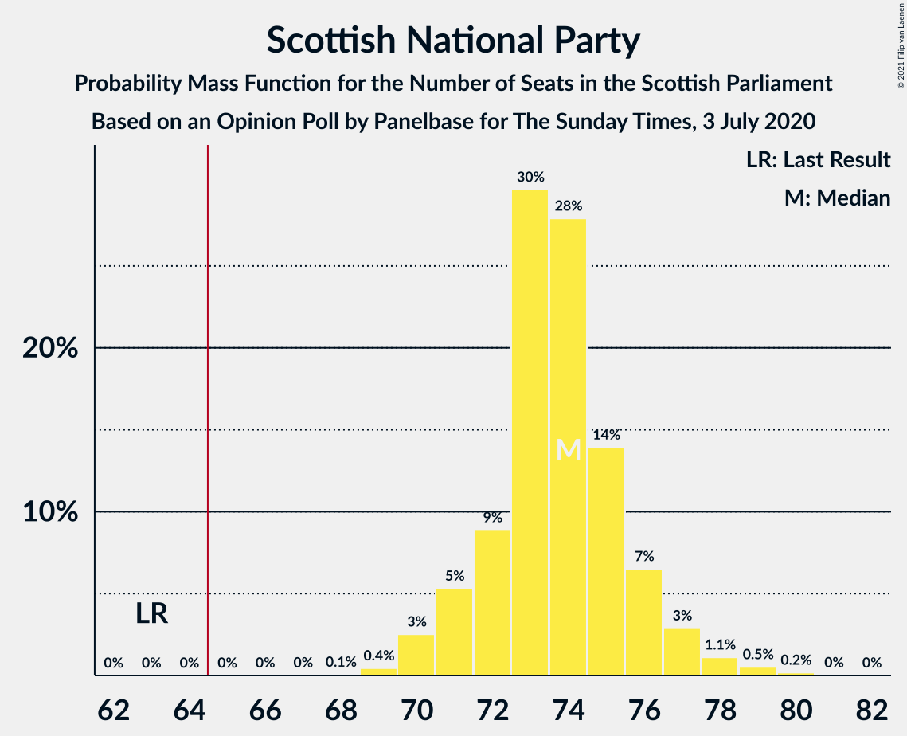
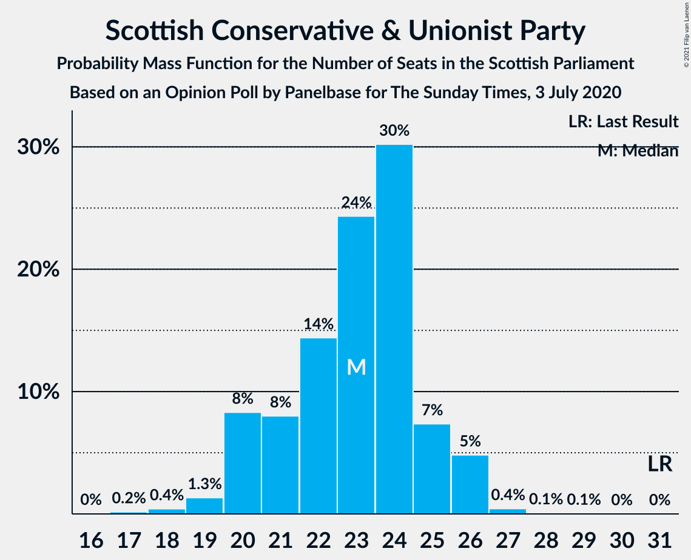
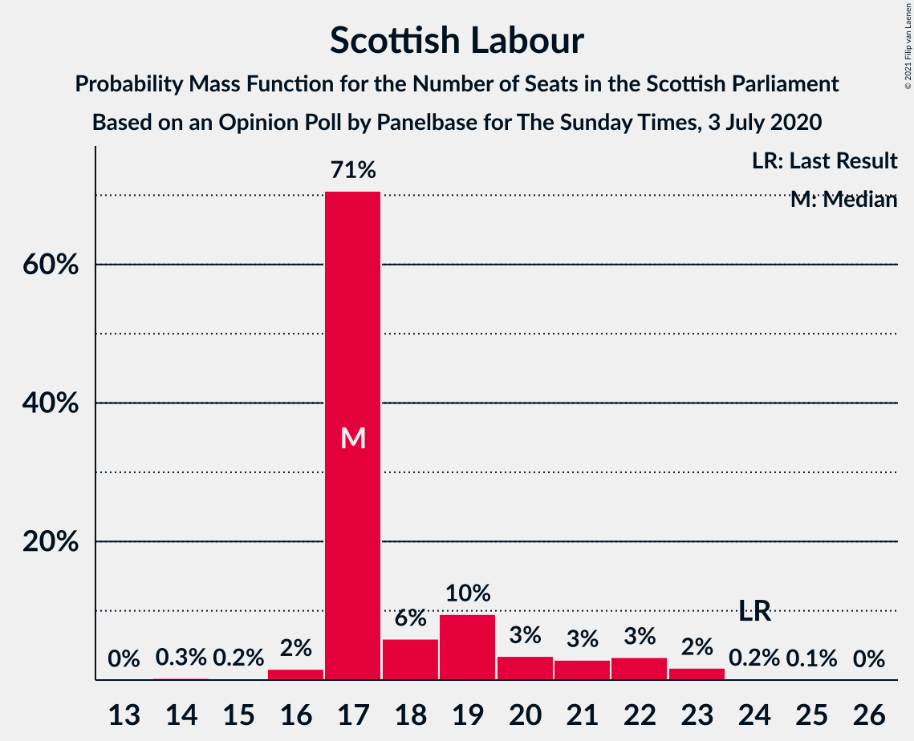
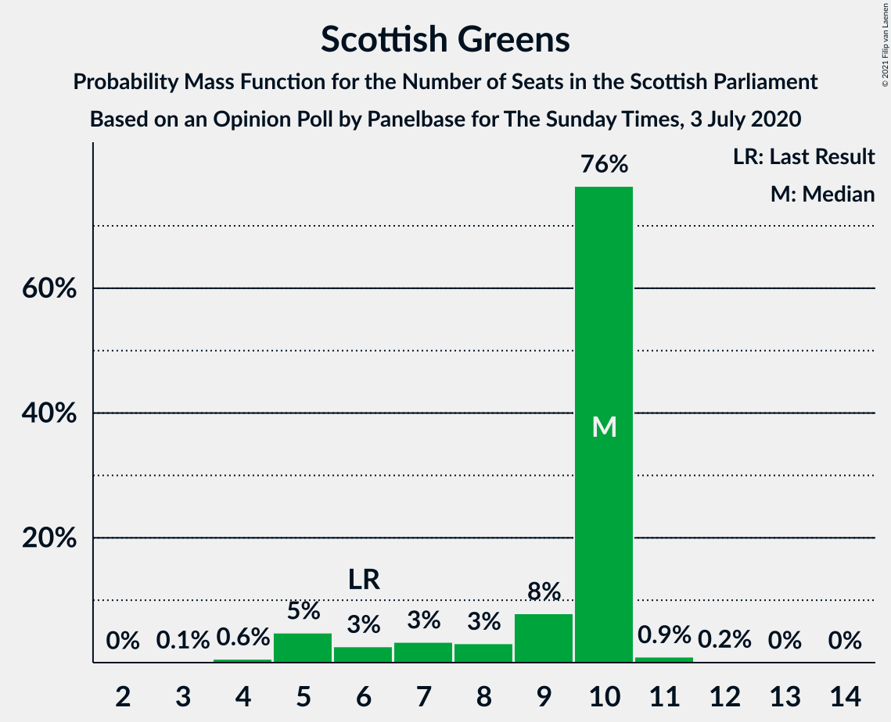
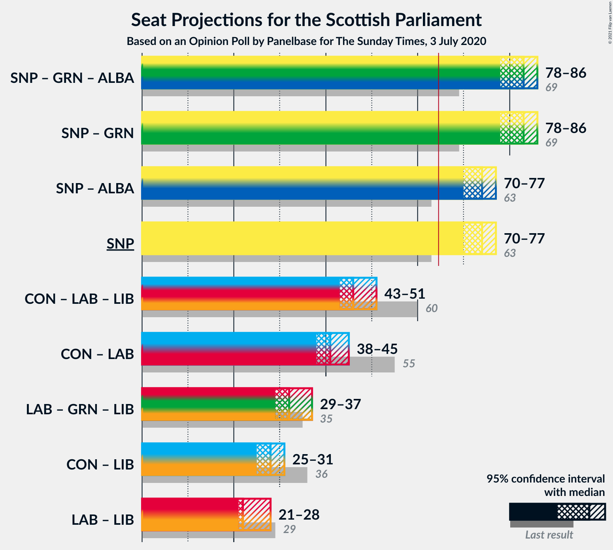
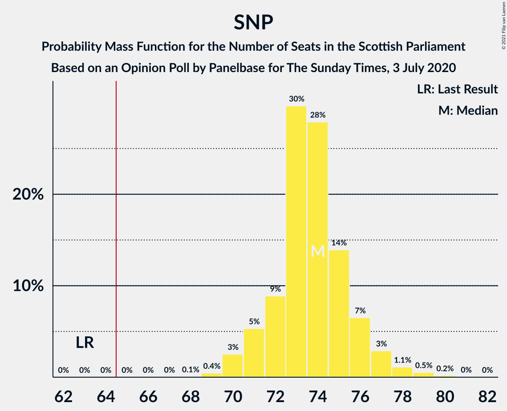
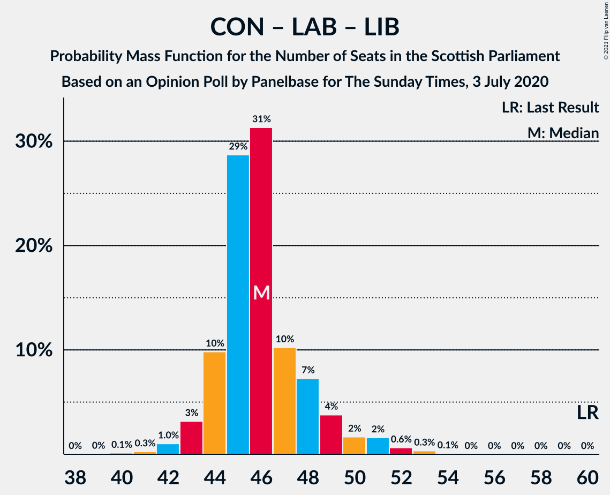

# Opinion Poll by Panelbase for The Sunday Times, 3 July 2020

<a href="#voting-intentions">Voting Intentions</a> | <a href="#seats">Seats</a> | <a href="#coalitions">Coalitions</a> | <a href="#technical-information">Technical Information</a>

## Voting Intentions

### Confidence Intervals

| Party | Last Result | Poll Result | 80% Confidence Interval | 90% Confidence Interval | 95% Confidence Interval | 99% Confidence Interval |
|:-----:|:-----------:|:-----------:|:-----------------------:|:-----------------------:|:-----------------------:|:-----------------------:|
| Scottish National Party | 41.7% | 50.5% | 48.5–52.5% |47.9–53.1% |47.4–53.5% |46.5–54.5% |
| Scottish Conservative & Unionist Party | 22.9% | 18.2% | 16.8–19.9% |16.3–20.3% |16.0–20.7% |15.3–21.5% |
| Scottish Labour | 19.1% | 15.1% | 13.7–16.6% |13.4–17.1% |13.0–17.4% |12.4–18.2% |
| Scottish Greens | 6.6% | 8.1% | 7.1–9.3% |6.8–9.6% |6.6–9.9% |6.1–10.5% |
| Scottish Liberal Democrats | 5.2% | 6.0% | 5.2–7.1% |4.9–7.4% |4.7–7.7% |4.4–8.2% |

*Note:* The poll result column reflects the actual value used in the calculations. Published results may vary slightly, and in addition be rounded to fewer digits.

## Seats

### Confidence Intervals

| Party | Last Result | Median | 80% Confidence Interval | 90% Confidence Interval | 95% Confidence Interval | 99% Confidence Interval |
|:-----:|:-----------:|:------:|:-----------------------:|:-----------------------:|:-----------------------:|:-----------------------:|
| <a href="#scottish-national-party">Scottish National Party</a> | 63 | 74 | 72–75 |71–76 |70–77 |68–78 |
| <a href="#scottish-conservative-&-unionist-party">Scottish Conservative & Unionist Party</a> | 31 | 23 | 20–24 |20–26 |20–26 |18–27 |
| <a href="#scottish-labour">Scottish Labour</a> | 24 | 17 | 17–20 |17–21 |17–22 |15–23 |
| <a href="#scottish-greens">Scottish Greens</a> | 6 | 10 | 7–10 |5–10 |5–10 |4–11 |
| <a href="#scottish-liberal-democrats">Scottish Liberal Democrats</a> | 5 | 5 | 5–6 |4–7 |4–8 |3–9 |

### Scottish National Party

*For a full overview of the results for this party, see the [Scottish National Party](party-scottishnationalparty.html) page.*

| Number of Seats | Probability | Accumulated | Special Marks |
|:---------------:|:-----------:|:-----------:|:-------------:|
| 63 | 0% | 100% | Last Result |
| 64 | 0% | 100% |  |
| 65 | 0% | 100% | Majority |
| 66 | 0.1% | 100% |  |
| 67 | 0.1% | 99.9% |  |
| 68 | 0.4% | 99.8% |  |
| 69 | 0.9% | 99.4% |  |
| 70 | 2% | 98% |  |
| 71 | 6% | 97% |  |
| 72 | 5% | 91% |  |
| 73 | 30% | 86% |  |
| 74 | 34% | 56% | Median |
| 75 | 12% | 21% |  |
| 76 | 6% | 9% |  |
| 77 | 2% | 4% |  |
| 78 | 0.8% | 1.3% |  |
| 79 | 0.3% | 0.5% |  |
| 80 | 0.1% | 0.1% |  |
| 81 | 0% | 0% |  |

### Scottish Conservative & Unionist Party

*For a full overview of the results for this party, see the [Scottish Conservative & Unionist Party](party-scottishconservativeunionistparty.html) page.*

| Number of Seats | Probability | Accumulated | Special Marks |
|:---------------:|:-----------:|:-----------:|:-------------:|
| 17 | 0.1% | 100% |  |
| 18 | 0.5% | 99.9% |  |
| 19 | 0.7% | 99.3% |  |
| 20 | 9% | 98.6% |  |
| 21 | 8% | 90% |  |
| 22 | 14% | 82% |  |
| 23 | 30% | 68% | Median |
| 24 | 30% | 38% |  |
| 25 | 4% | 9% |  |
| 26 | 4% | 5% |  |
| 27 | 0.8% | 1.1% |  |
| 28 | 0.2% | 0.3% |  |
| 29 | 0.1% | 0.1% |  |
| 30 | 0% | 0.1% |  |
| 31 | 0% | 0% | Last Result |

### Scottish Labour

*For a full overview of the results for this party, see the [Scottish Labour](party-scottishlabour.html) page.*

| Number of Seats | Probability | Accumulated | Special Marks |
|:---------------:|:-----------:|:-----------:|:-------------:|
| 13 | 0.1% | 100% |  |
| 14 | 0.3% | 99.9% |  |
| 15 | 0.3% | 99.7% |  |
| 16 | 1.3% | 99.4% |  |
| 17 | 64% | 98% | Median |
| 18 | 11% | 34% |  |
| 19 | 13% | 24% |  |
| 20 | 3% | 11% |  |
| 21 | 3% | 8% |  |
| 22 | 4% | 5% |  |
| 23 | 0.8% | 1.0% |  |
| 24 | 0.2% | 0.2% | Last Result |
| 25 | 0% | 0% |  |

### Scottish Greens

*For a full overview of the results for this party, see the [Scottish Greens](party-scottishgreens.html) page.*

| Number of Seats | Probability | Accumulated | Special Marks |
|:---------------:|:-----------:|:-----------:|:-------------:|
| 3 | 0.2% | 100% |  |
| 4 | 0.6% | 99.8% |  |
| 5 | 5% | 99.3% |  |
| 6 | 2% | 94% | Last Result |
| 7 | 4% | 92% |  |
| 8 | 2% | 88% |  |
| 9 | 7% | 86% |  |
| 10 | 77% | 79% | Median |
| 11 | 2% | 2% |  |
| 12 | 0.2% | 0.3% |  |
| 13 | 0.1% | 0.1% |  |
| 14 | 0% | 0% |  |

### Scottish Liberal Democrats

*For a full overview of the results for this party, see the [Scottish Liberal Democrats](party-scottishliberaldemocrats.html) page.*

| Number of Seats | Probability | Accumulated | Special Marks |
|:---------------:|:-----------:|:-----------:|:-------------:|
| 2 | 0.1% | 100% |  |
| 3 | 1.1% | 99.9% |  |
| 4 | 8% | 98.9% |  |
| 5 | 69% | 91% | Last Result, Median |
| 6 | 13% | 22% |  |
| 7 | 6% | 9% |  |
| 8 | 2% | 3% |  |
| 9 | 0.6% | 0.7% |  |
| 10 | 0% | 0% |  |

## Coalitions

### Confidence Intervals

| Coalition | Last Result | Median | Majority? | 80% Confidence Interval | 90% Confidence Interval | 95% Confidence Interval | 99% Confidence Interval |
|:---------:|:-----------:|:------:|:---------:|:-----------------------:|:-----------------------:|:-----------------------:|:-----------------------:|
| Scottish National Party – Scottish Greens | 69 | 83 | 100% | 81–85 | 79–85 | 78–85 | 77–87 |
| Scottish National Party | 63 | 74 | 100% | 72–75 | 71–76 | 70–77 | 68–78 |
| Scottish Conservative & Unionist Party – Scottish Labour – Scottish Liberal Democrats | 60 | 46 | 0% | 44–48 | 44–50 | 44–51 | 42–52 |
| Scottish Conservative & Unionist Party – Scottish Labour | 55 | 40 | 0% | 39–43 | 39–44 | 38–45 | 37–46 |
| Scottish Labour – Scottish Greens – Scottish Liberal Democrats | 35 | 32 | 0% | 31–35 | 29–36 | 29–36 | 28–39 |
| Scottish Conservative & Unionist Party – Scottish Liberal Democrats | 36 | 28 | 0% | 26–30 | 25–31 | 25–31 | 24–33 |
| Scottish Labour – Scottish Liberal Democrats | 29 | 22 | 0% | 22–26 | 22–27 | 22–27 | 20–29 |

### Scottish National Party – Scottish Greens

| Number of Seats | Probability | Accumulated | Special Marks |
|:---------------:|:-----------:|:-----------:|:-------------:|
| 69 | 0% | 100% | Last Result |
| 70 | 0% | 100% |  |
| 71 | 0% | 100% |  |
| 72 | 0% | 100% |  |
| 73 | 0% | 100% |  |
| 74 | 0% | 100% |  |
| 75 | 0.1% | 100% |  |
| 76 | 0.4% | 99.9% |  |
| 77 | 0.5% | 99.5% |  |
| 78 | 3% | 99.1% |  |
| 79 | 2% | 97% |  |
| 80 | 3% | 95% |  |
| 81 | 8% | 92% |  |
| 82 | 7% | 84% |  |
| 83 | 31% | 77% |  |
| 84 | 34% | 45% | Median |
| 85 | 9% | 12% |  |
| 86 | 2% | 2% |  |
| 87 | 0.5% | 0.8% |  |
| 88 | 0.1% | 0.3% |  |
| 89 | 0.1% | 0.2% |  |
| 90 | 0% | 0% |  |

### Scottish National Party

| Number of Seats | Probability | Accumulated | Special Marks |
|:---------------:|:-----------:|:-----------:|:-------------:|
| 63 | 0% | 100% | Last Result |
| 64 | 0% | 100% |  |
| 65 | 0% | 100% | Majority |
| 66 | 0.1% | 100% |  |
| 67 | 0.1% | 99.9% |  |
| 68 | 0.4% | 99.8% |  |
| 69 | 0.9% | 99.4% |  |
| 70 | 2% | 98% |  |
| 71 | 6% | 97% |  |
| 72 | 5% | 91% |  |
| 73 | 30% | 86% |  |
| 74 | 34% | 56% | Median |
| 75 | 12% | 21% |  |
| 76 | 6% | 9% |  |
| 77 | 2% | 4% |  |
| 78 | 0.8% | 1.3% |  |
| 79 | 0.3% | 0.5% |  |
| 80 | 0.1% | 0.1% |  |
| 81 | 0% | 0% |  |

### Scottish Conservative & Unionist Party – Scottish Labour – Scottish Liberal Democrats

| Number of Seats | Probability | Accumulated | Special Marks |
|:---------------:|:-----------:|:-----------:|:-------------:|
| 40 | 0.1% | 100% |  |
| 41 | 0.1% | 99.8% |  |
| 42 | 0.5% | 99.7% |  |
| 43 | 2% | 99.2% |  |
| 44 | 9% | 98% |  |
| 45 | 34% | 88% | Median |
| 46 | 31% | 55% |  |
| 47 | 7% | 23% |  |
| 48 | 8% | 16% |  |
| 49 | 3% | 8% |  |
| 50 | 2% | 5% |  |
| 51 | 3% | 3% |  |
| 52 | 0.5% | 0.9% |  |
| 53 | 0.4% | 0.5% |  |
| 54 | 0.1% | 0.1% |  |
| 55 | 0% | 0% |  |
| 56 | 0% | 0% |  |
| 57 | 0% | 0% |  |
| 58 | 0% | 0% |  |
| 59 | 0% | 0% |  |
| 60 | 0% | 0% | Last Result |

### Scottish Conservative & Unionist Party – Scottish Labour

| Number of Seats | Probability | Accumulated | Special Marks |
|:---------------:|:-----------:|:-----------:|:-------------:|
| 35 | 0.2% | 100% |  |
| 36 | 0.2% | 99.8% |  |
| 37 | 0.9% | 99.6% |  |
| 38 | 2% | 98.6% |  |
| 39 | 18% | 96% |  |
| 40 | 30% | 79% | Median |
| 41 | 26% | 48% |  |
| 42 | 8% | 22% |  |
| 43 | 7% | 14% |  |
| 44 | 3% | 7% |  |
| 45 | 2% | 4% |  |
| 46 | 2% | 2% |  |
| 47 | 0.3% | 0.4% |  |
| 48 | 0.1% | 0.2% |  |
| 49 | 0% | 0% |  |
| 50 | 0% | 0% |  |
| 51 | 0% | 0% |  |
| 52 | 0% | 0% |  |
| 53 | 0% | 0% |  |
| 54 | 0% | 0% |  |
| 55 | 0% | 0% | Last Result |

### Scottish Labour – Scottish Greens – Scottish Liberal Democrats

| Number of Seats | Probability | Accumulated | Special Marks |
|:---------------:|:-----------:|:-----------:|:-------------:|
| 26 | 0.1% | 100% |  |
| 27 | 0.3% | 99.9% |  |
| 28 | 1.5% | 99.6% |  |
| 29 | 4% | 98% |  |
| 30 | 4% | 95% |  |
| 31 | 6% | 91% |  |
| 32 | 51% | 85% | Median |
| 33 | 12% | 34% |  |
| 34 | 11% | 22% |  |
| 35 | 5% | 11% | Last Result |
| 36 | 4% | 6% |  |
| 37 | 1.3% | 2% |  |
| 38 | 0.4% | 0.9% |  |
| 39 | 0.4% | 0.5% |  |
| 40 | 0.1% | 0.1% |  |
| 41 | 0% | 0% |  |

### Scottish Conservative & Unionist Party – Scottish Liberal Democrats

| Number of Seats | Probability | Accumulated | Special Marks |
|:---------------:|:-----------:|:-----------:|:-------------:|
| 22 | 0.1% | 100% |  |
| 23 | 0.3% | 99.9% |  |
| 24 | 0.5% | 99.6% |  |
| 25 | 5% | 99.1% |  |
| 26 | 11% | 94% |  |
| 27 | 9% | 83% |  |
| 28 | 31% | 74% | Median |
| 29 | 29% | 43% |  |
| 30 | 6% | 13% |  |
| 31 | 5% | 7% |  |
| 32 | 1.2% | 2% |  |
| 33 | 0.9% | 1.2% |  |
| 34 | 0.3% | 0.4% |  |
| 35 | 0.1% | 0.1% |  |
| 36 | 0% | 0.1% | Last Result |
| 37 | 0% | 0% |  |

### Scottish Labour – Scottish Liberal Democrats

| Number of Seats | Probability | Accumulated | Special Marks |
|:---------------:|:-----------:|:-----------:|:-------------:|
| 18 | 0.1% | 100% |  |
| 19 | 0.2% | 99.9% |  |
| 20 | 0.3% | 99.7% |  |
| 21 | 0.8% | 99.4% |  |
| 22 | 58% | 98.6% | Median |
| 23 | 11% | 41% |  |
| 24 | 12% | 29% |  |
| 25 | 7% | 18% |  |
| 26 | 5% | 11% |  |
| 27 | 4% | 6% |  |
| 28 | 1.1% | 2% |  |
| 29 | 0.7% | 1.0% | Last Result |
| 30 | 0.3% | 0.3% |  |
| 31 | 0% | 0% |  |

## Technical Information

### Opinion Poll

+ **Polling firm:** Panelbase
+ **Commissioner(s):** The Sunday Times
+ **Fieldwork period:** 3 July 2020

### Calculations

+ **Sample size:** 1026
+ **Simulations done:** 131,072
+ **Error estimate:** 0.76%

