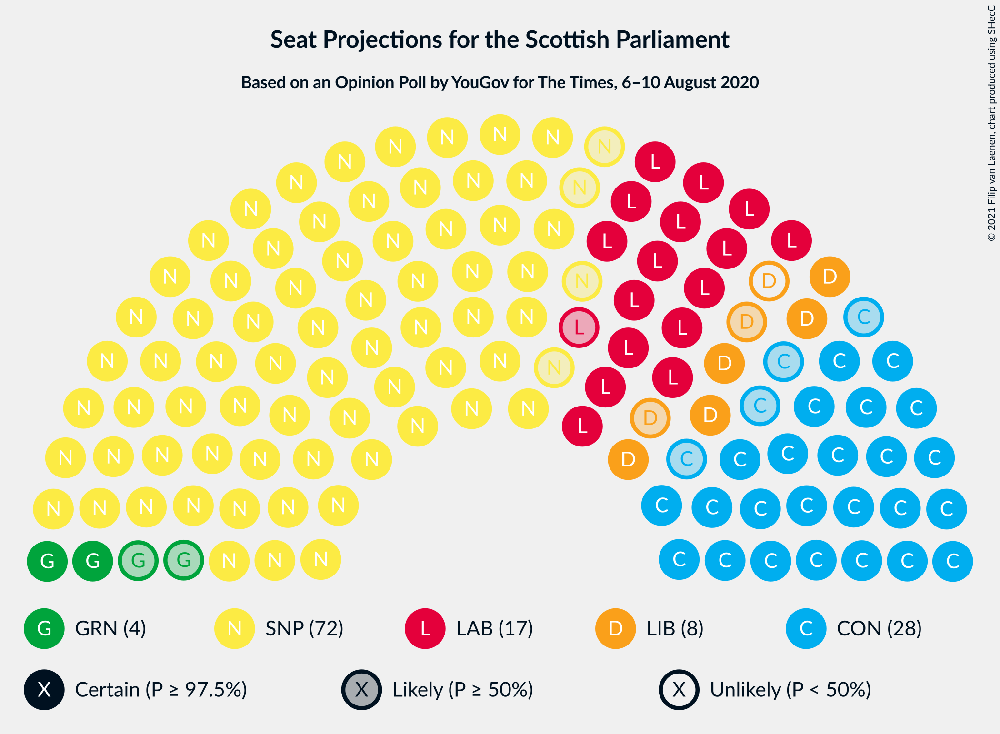
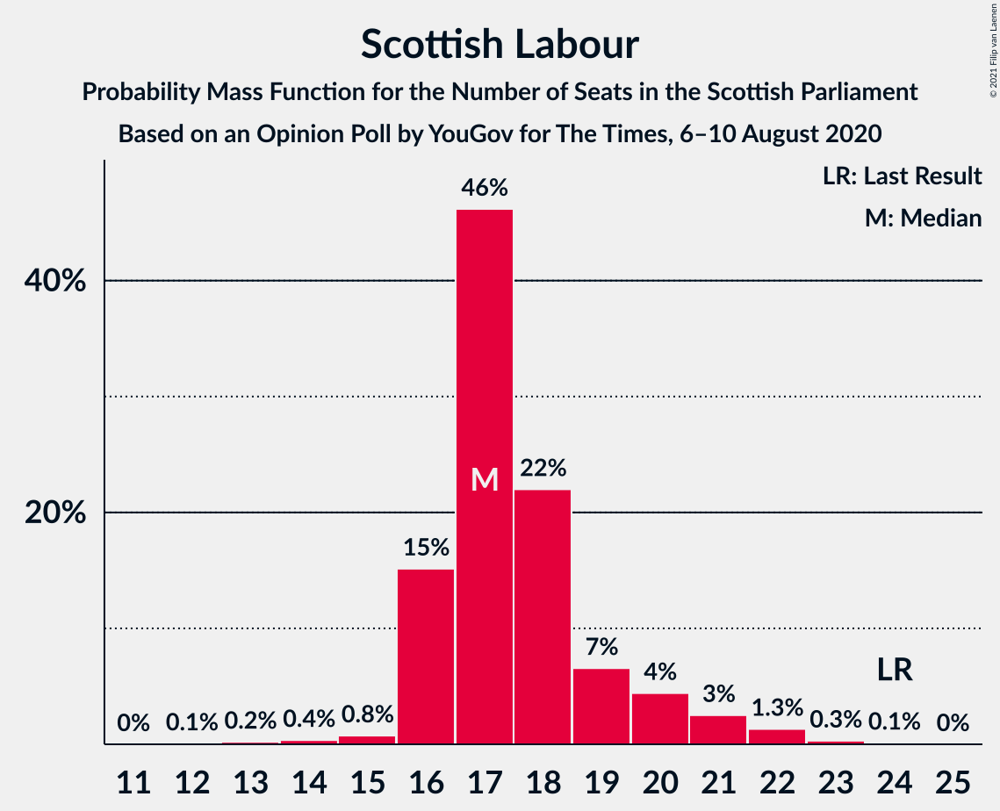
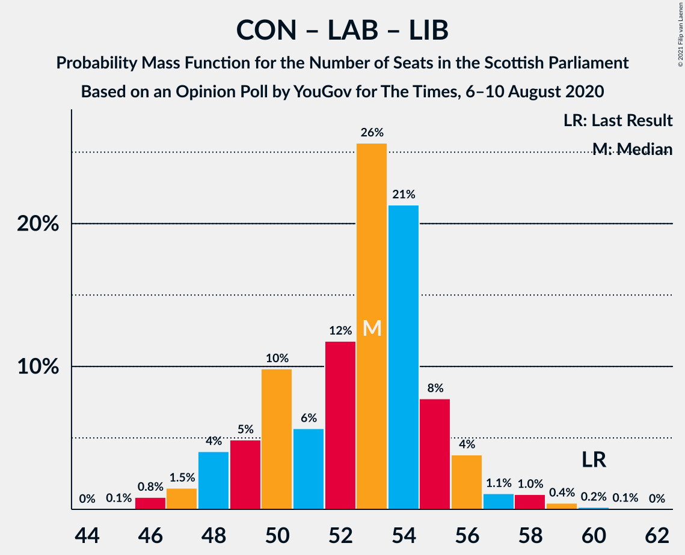

# Opinion Poll by YouGov for The Times, 6–10 August 2020

<a href="#voting-intentions">Voting Intentions</a> | <a href="#seats">Seats</a> | <a href="#coalitions">Coalitions</a> | <a href="#technical-information">Technical Information</a>

## Voting Intentions

### Confidence Intervals

| Party | Last Result | Poll Result | 80% Confidence Interval | 90% Confidence Interval | 95% Confidence Interval | 99% Confidence Interval |
|:-----:|:-----------:|:-----------:|:-----------------------:|:-----------------------:|:-----------------------:|:-----------------------:|
| Scottish National Party | 41.7% | 46.5% | 44.6–48.4% |44.1–48.9% |43.6–49.4% |42.7–50.3% |
| Scottish Conservative & Unionist Party | 22.9% | 20.8% | 19.3–22.4% |18.9–22.8% |18.5–23.2% |17.8–24.0% |
| Scottish Labour | 19.1% | 13.8% | 12.6–15.2% |12.2–15.6% |11.9–16.0% |11.4–16.7% |
| Scottish Liberal Democrats | 5.2% | 6.9% | 6.0–8.0% |5.8–8.3% |5.6–8.6% |5.2–9.1% |
| Scottish Greens | 6.6% | 6.0% | 5.1–7.0% |4.9–7.2% |4.7–7.5% |4.4–8.0% |
| Scottish Socialist Party | 0.5% | 3.9% | 3.3–4.8% |3.1–5.0% |3.0–5.2% |2.7–5.7% |
| Reform UK | 0.0% | 1.0% | 0.7–1.5% |0.6–1.6% |0.5–1.7% |0.4–2.0% |

*Note:* The poll result column reflects the actual value used in the calculations. Published results may vary slightly, and in addition be rounded to fewer digits.

## Seats

### Confidence Intervals

| Party | Last Result | Median | 80% Confidence Interval | 90% Confidence Interval | 95% Confidence Interval | 99% Confidence Interval |
|:-----:|:-----------:|:------:|:-----------------------:|:-----------------------:|:-----------------------:|:-----------------------:|
| <a href="#scottish-national-party">Scottish National Party</a> | 63 | 72 | 70–74 |69–75 |68–76 |66–77 |
| <a href="#scottish-conservative-&-unionist-party">Scottish Conservative & Unionist Party</a> | 31 | 28 | 26–31 |25–31 |24–32 |23–33 |
| <a href="#scottish-labour">Scottish Labour</a> | 24 | 17 | 16–19 |16–20 |16–21 |14–22 |
| <a href="#scottish-liberal-democrats">Scottish Liberal Democrats</a> | 5 | 7 | 5–9 |5–9 |5–9 |5–10 |
| <a href="#scottish-greens">Scottish Greens</a> | 6 | 4 | 3–8 |2–10 |2–10 |2–10 |
| <a href="#scottish-socialist-party">Scottish Socialist Party</a> | 0 | 0 | 0 |0 |0 |0 |
| <a href="#reform-uk">Reform UK</a> | 0 | 0 | 0 |0 |0 |0 |

### Scottish National Party

*For a full overview of the results for this party, see the [Scottish National Party](party-scottishnationalparty.html) page.*

| Number of Seats | Probability | Accumulated | Special Marks |
|:---------------:|:-----------:|:-----------:|:-------------:|
| 63 | 0% | 100% | Last Result |
| 64 | 0% | 100% |  |
| 65 | 0.4% | 100% | Majority |
| 66 | 0.3% | 99.6% |  |
| 67 | 2% | 99.3% |  |
| 68 | 2% | 98% |  |
| 69 | 4% | 96% |  |
| 70 | 13% | 92% |  |
| 71 | 23% | 79% |  |
| 72 | 28% | 56% | Median |
| 73 | 12% | 28% |  |
| 74 | 7% | 16% |  |
| 75 | 5% | 8% |  |
| 76 | 3% | 4% |  |
| 77 | 0.5% | 0.8% |  |
| 78 | 0.2% | 0.2% |  |
| 79 | 0% | 0.1% |  |
| 80 | 0% | 0% |  |

### Scottish Conservative & Unionist Party

*For a full overview of the results for this party, see the [Scottish Conservative & Unionist Party](party-scottishconservativeunionistparty.html) page.*

| Number of Seats | Probability | Accumulated | Special Marks |
|:---------------:|:-----------:|:-----------:|:-------------:|
| 22 | 0.3% | 100% |  |
| 23 | 0.7% | 99.7% |  |
| 24 | 2% | 99.0% |  |
| 25 | 6% | 97% |  |
| 26 | 18% | 91% |  |
| 27 | 13% | 73% |  |
| 28 | 16% | 60% | Median |
| 29 | 12% | 44% |  |
| 30 | 12% | 32% |  |
| 31 | 18% | 20% | Last Result |
| 32 | 2% | 3% |  |
| 33 | 0.7% | 1.0% |  |
| 34 | 0.1% | 0.3% |  |
| 35 | 0.1% | 0.1% |  |
| 36 | 0% | 0% |  |

### Scottish Labour

*For a full overview of the results for this party, see the [Scottish Labour](party-scottishlabour.html) page.*

| Number of Seats | Probability | Accumulated | Special Marks |
|:---------------:|:-----------:|:-----------:|:-------------:|
| 12 | 0.1% | 100% |  |
| 13 | 0.2% | 99.9% |  |
| 14 | 0.4% | 99.7% |  |
| 15 | 0.8% | 99.4% |  |
| 16 | 15% | 98.6% |  |
| 17 | 46% | 83% | Median |
| 18 | 22% | 37% |  |
| 19 | 7% | 15% |  |
| 20 | 4% | 9% |  |
| 21 | 3% | 4% |  |
| 22 | 1.3% | 2% |  |
| 23 | 0.3% | 0.4% |  |
| 24 | 0.1% | 0.1% | Last Result |
| 25 | 0% | 0% |  |

### Scottish Liberal Democrats

*For a full overview of the results for this party, see the [Scottish Liberal Democrats](party-scottishliberaldemocrats.html) page.*

| Number of Seats | Probability | Accumulated | Special Marks |
|:---------------:|:-----------:|:-----------:|:-------------:|
| 4 | 0.2% | 100% |  |
| 5 | 27% | 99.8% | Last Result |
| 6 | 17% | 73% |  |
| 7 | 14% | 56% | Median |
| 8 | 31% | 42% |  |
| 9 | 9% | 11% |  |
| 10 | 2% | 2% |  |
| 11 | 0.3% | 0.4% |  |
| 12 | 0.1% | 0.1% |  |
| 13 | 0% | 0% |  |

### Scottish Greens

*For a full overview of the results for this party, see the [Scottish Greens](party-scottishgreens.html) page.*

| Number of Seats | Probability | Accumulated | Special Marks |
|:---------------:|:-----------:|:-----------:|:-------------:|
| 2 | 8% | 100% |  |
| 3 | 21% | 92% |  |
| 4 | 32% | 72% | Median |
| 5 | 19% | 40% |  |
| 6 | 4% | 21% | Last Result |
| 7 | 5% | 17% |  |
| 8 | 2% | 12% |  |
| 9 | 4% | 10% |  |
| 10 | 5% | 5% |  |
| 11 | 0% | 0% |  |

### Scottish Socialist Party

*For a full overview of the results for this party, see the [Scottish Socialist Party](party-scottishsocialistparty.html) page.*

| Number of Seats | Probability | Accumulated | Special Marks |
|:---------------:|:-----------:|:-----------:|:-------------:|
| 0 | 100% | 100% | Last Result, Median |

### Reform UK

*For a full overview of the results for this party, see the [Reform UK](party-reformuk.html) page.*

| Number of Seats | Probability | Accumulated | Special Marks |
|:---------------:|:-----------:|:-----------:|:-------------:|
| 0 | 100% | 100% | Last Result, Median |

## Coalitions

### Confidence Intervals

| Coalition | Last Result | Median | Majority? | 80% Confidence Interval | 90% Confidence Interval | 95% Confidence Interval | 99% Confidence Interval |
|:---------:|:-----------:|:------:|:---------:|:-----------------------:|:-----------------------:|:-----------------------:|:-----------------------:|
| Scottish National Party – Scottish Greens | 69 | 76 | 100% | 74–80 | 73–81 | 72–81 | 70–83 |
| Scottish National Party | 63 | 72 | 100% | 70–74 | 69–75 | 68–76 | 66–77 |
| Scottish Conservative & Unionist Party – Scottish Labour – Scottish Liberal Democrats | 60 | 53 | 0% | 49–55 | 48–56 | 48–57 | 46–59 |
| Scottish Conservative & Unionist Party – Scottish Labour | 55 | 46 | 0% | 43–48 | 42–49 | 41–50 | 40–52 |
| Scottish Conservative & Unionist Party – Scottish Liberal Democrats | 36 | 35 | 0% | 32–38 | 31–39 | 30–39 | 29–40 |
| Scottish Labour – Scottish Liberal Democrats – Scottish Greens | 35 | 29 | 0% | 26–32 | 25–33 | 25–33 | 25–34 |
| Scottish Labour – Scottish Liberal Democrats | 29 | 24 | 0% | 22–27 | 22–28 | 22–29 | 20–30 |

### Scottish National Party – Scottish Greens

| Number of Seats | Probability | Accumulated | Special Marks |
|:---------------:|:-----------:|:-----------:|:-------------:|
| 68 | 0.1% | 100% |  |
| 69 | 0.2% | 99.9% | Last Result |
| 70 | 0.4% | 99.8% |  |
| 71 | 1.0% | 99.3% |  |
| 72 | 1.1% | 98% |  |
| 73 | 4% | 97% |  |
| 74 | 8% | 93% |  |
| 75 | 21% | 86% |  |
| 76 | 26% | 64% | Median |
| 77 | 12% | 39% |  |
| 78 | 6% | 27% |  |
| 79 | 10% | 21% |  |
| 80 | 5% | 11% |  |
| 81 | 4% | 6% |  |
| 82 | 1.5% | 2% |  |
| 83 | 0.8% | 0.9% |  |
| 84 | 0.1% | 0.1% |  |
| 85 | 0% | 0% |  |

### Scottish National Party

| Number of Seats | Probability | Accumulated | Special Marks |
|:---------------:|:-----------:|:-----------:|:-------------:|
| 63 | 0% | 100% | Last Result |
| 64 | 0% | 100% |  |
| 65 | 0.4% | 100% | Majority |
| 66 | 0.3% | 99.6% |  |
| 67 | 2% | 99.3% |  |
| 68 | 2% | 98% |  |
| 69 | 4% | 96% |  |
| 70 | 13% | 92% |  |
| 71 | 23% | 79% |  |
| 72 | 28% | 56% | Median |
| 73 | 12% | 28% |  |
| 74 | 7% | 16% |  |
| 75 | 5% | 8% |  |
| 76 | 3% | 4% |  |
| 77 | 0.5% | 0.8% |  |
| 78 | 0.2% | 0.2% |  |
| 79 | 0% | 0.1% |  |
| 80 | 0% | 0% |  |

### Scottish Conservative & Unionist Party – Scottish Labour – Scottish Liberal Democrats

| Number of Seats | Probability | Accumulated | Special Marks |
|:---------------:|:-----------:|:-----------:|:-------------:|
| 45 | 0.1% | 100% |  |
| 46 | 0.8% | 99.9% |  |
| 47 | 1.5% | 99.1% |  |
| 48 | 4% | 98% |  |
| 49 | 5% | 94% |  |
| 50 | 10% | 89% |  |
| 51 | 6% | 79% |  |
| 52 | 12% | 73% | Median |
| 53 | 26% | 61% |  |
| 54 | 21% | 36% |  |
| 55 | 8% | 14% |  |
| 56 | 4% | 7% |  |
| 57 | 1.1% | 3% |  |
| 58 | 1.0% | 2% |  |
| 59 | 0.4% | 0.7% |  |
| 60 | 0.2% | 0.2% | Last Result |
| 61 | 0.1% | 0.1% |  |
| 62 | 0% | 0% |  |

### Scottish Conservative & Unionist Party – Scottish Labour

| Number of Seats | Probability | Accumulated | Special Marks |
|:---------------:|:-----------:|:-----------:|:-------------:|
| 38 | 0.1% | 100% |  |
| 39 | 0.2% | 99.9% |  |
| 40 | 0.6% | 99.7% |  |
| 41 | 2% | 99.0% |  |
| 42 | 5% | 97% |  |
| 43 | 9% | 92% |  |
| 44 | 6% | 82% |  |
| 45 | 21% | 76% | Median |
| 46 | 21% | 55% |  |
| 47 | 11% | 35% |  |
| 48 | 18% | 24% |  |
| 49 | 2% | 5% |  |
| 50 | 2% | 3% |  |
| 51 | 0.6% | 1.1% |  |
| 52 | 0.2% | 0.5% |  |
| 53 | 0.2% | 0.3% |  |
| 54 | 0.1% | 0.1% |  |
| 55 | 0% | 0% | Last Result |

### Scottish Conservative & Unionist Party – Scottish Liberal Democrats

| Number of Seats | Probability | Accumulated | Special Marks |
|:---------------:|:-----------:|:-----------:|:-------------:|
| 28 | 0.1% | 100% |  |
| 29 | 1.1% | 99.9% |  |
| 30 | 2% | 98.8% |  |
| 31 | 5% | 97% |  |
| 32 | 7% | 92% |  |
| 33 | 11% | 85% |  |
| 34 | 11% | 75% |  |
| 35 | 18% | 63% | Median |
| 36 | 17% | 46% | Last Result |
| 37 | 17% | 29% |  |
| 38 | 6% | 12% |  |
| 39 | 5% | 6% |  |
| 40 | 1.0% | 1.5% |  |
| 41 | 0.4% | 0.5% |  |
| 42 | 0.1% | 0.1% |  |
| 43 | 0% | 0% |  |

### Scottish Labour – Scottish Liberal Democrats – Scottish Greens

| Number of Seats | Probability | Accumulated | Special Marks |
|:---------------:|:-----------:|:-----------:|:-------------:|
| 23 | 0.1% | 100% |  |
| 24 | 0.4% | 99.9% |  |
| 25 | 6% | 99.5% |  |
| 26 | 10% | 94% |  |
| 27 | 13% | 84% |  |
| 28 | 15% | 71% | Median |
| 29 | 13% | 56% |  |
| 30 | 16% | 43% |  |
| 31 | 10% | 27% |  |
| 32 | 8% | 17% |  |
| 33 | 7% | 9% |  |
| 34 | 1.2% | 2% |  |
| 35 | 0.3% | 0.3% | Last Result |
| 36 | 0% | 0.1% |  |
| 37 | 0% | 0% |  |

### Scottish Labour – Scottish Liberal Democrats

| Number of Seats | Probability | Accumulated | Special Marks |
|:---------------:|:-----------:|:-----------:|:-------------:|
| 18 | 0.1% | 100% |  |
| 19 | 0.1% | 99.9% |  |
| 20 | 0.5% | 99.8% |  |
| 21 | 2% | 99.4% |  |
| 22 | 18% | 98% |  |
| 23 | 18% | 80% |  |
| 24 | 19% | 62% | Median |
| 25 | 15% | 43% |  |
| 26 | 13% | 28% |  |
| 27 | 7% | 14% |  |
| 28 | 4% | 7% |  |
| 29 | 2% | 3% | Last Result |
| 30 | 0.8% | 0.9% |  |
| 31 | 0.1% | 0.1% |  |
| 32 | 0% | 0% |  |

## Technical Information

### Opinion Poll

+ **Polling firm:** YouGov
+ **Commissioner(s):** The Times
+ **Fieldwork period:** 6–10 August 2020

### Calculations

+ **Sample size:** 1142
+ **Simulations done:** 1,048,576
+ **Error estimate:** 2.70%

