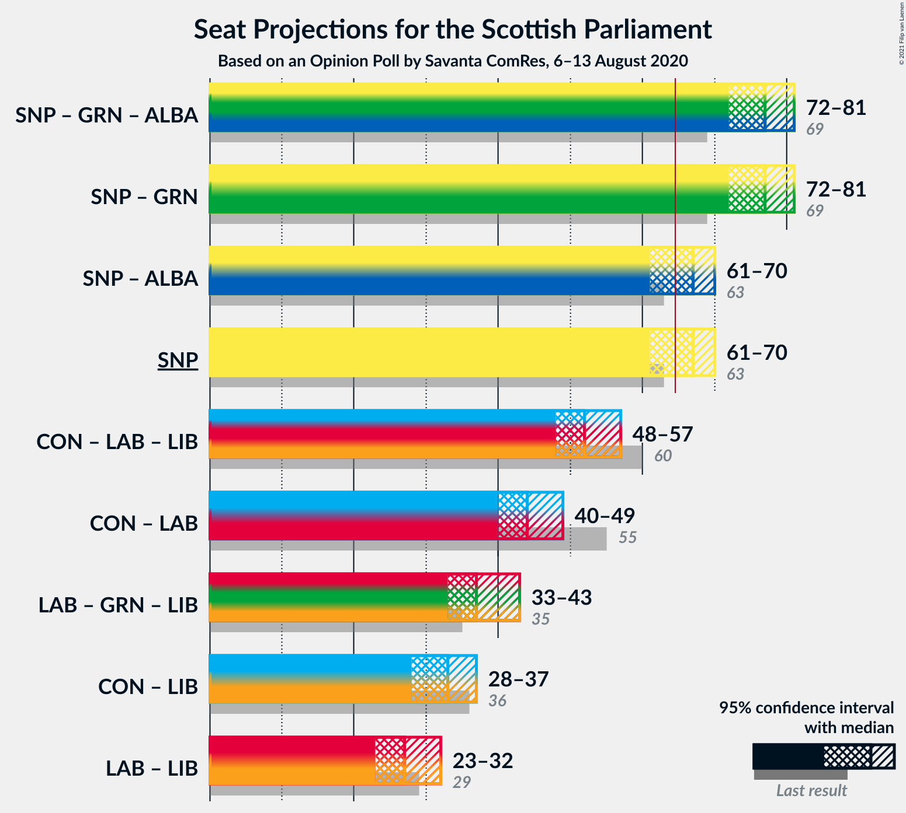
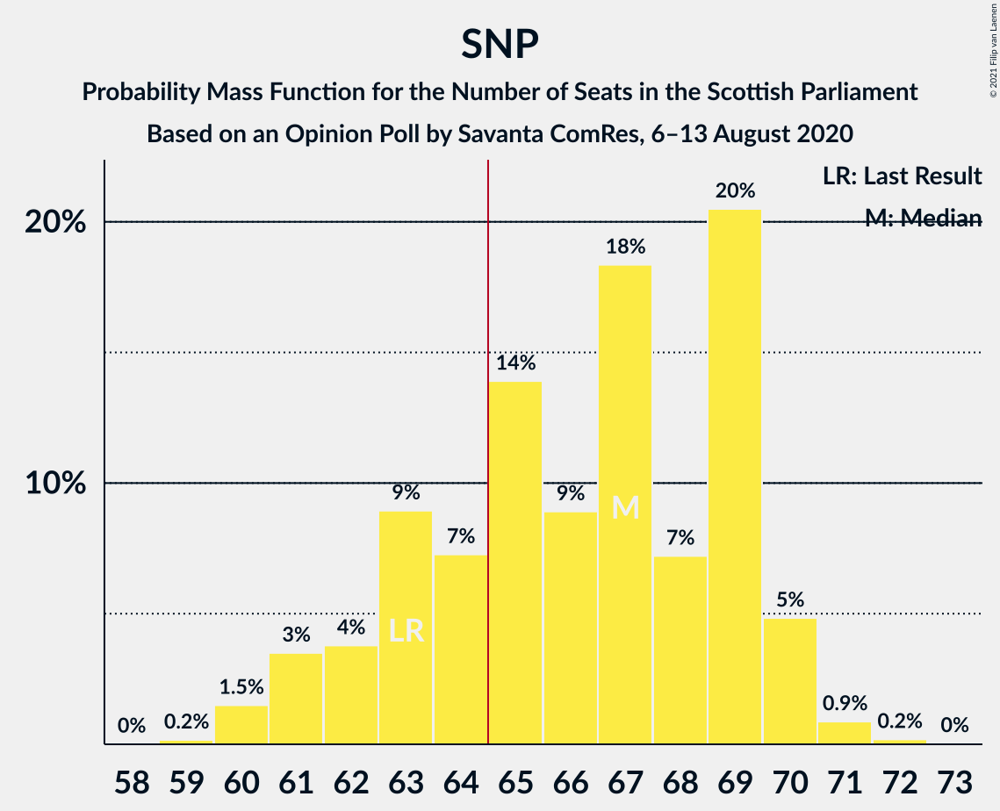

# Opinion Poll by Savanta ComRes, 6–13 August 2020

<a href="#voting-intentions">Voting Intentions</a> | <a href="#seats">Seats</a> | <a href="#coalitions">Coalitions</a> | <a href="#technical-information">Technical Information</a>

## Voting Intentions

### Confidence Intervals

| Party | Last Result | Poll Result | 80% Confidence Interval | 90% Confidence Interval | 95% Confidence Interval | 99% Confidence Interval |
|:-----:|:-----------:|:-----------:|:-----------------------:|:-----------------------:|:-----------------------:|:-----------------------:|
| Scottish National Party | 41.7% | 42.6% | 40.6–44.6% |40.0–45.1% |39.5–45.6% |38.6–46.6% |
| Scottish Conservative & Unionist Party | 22.9% | 20.8% | 19.3–22.5% |18.8–23.0% |18.4–23.5% |17.7–24.3% |
| Scottish Labour | 19.1% | 16.9% | 15.4–18.5% |15.0–18.9% |14.7–19.3% |14.0–20.1% |
| Scottish Greens | 6.6% | 9.9% | 8.8–11.2% |8.5–11.6% |8.2–11.9% |7.7–12.6% |
| Scottish Liberal Democrats | 5.2% | 7.9% | 6.9–9.1% |6.7–9.5% |6.4–9.8% |6.0–10.4% |

*Note:* The poll result column reflects the actual value used in the calculations. Published results may vary slightly, and in addition be rounded to fewer digits.

## Seats

### Confidence Intervals

| Party | Last Result | Median | 80% Confidence Interval | 90% Confidence Interval | 95% Confidence Interval | 99% Confidence Interval |
|:-----:|:-----------:|:------:|:-----------------------:|:-----------------------:|:-----------------------:|:-----------------------:|
| <a href="#scottish-national-party">Scottish National Party</a> | 63 | 67 | 64–69 |63–71 |62–71 |61–72 |
| <a href="#scottish-conservative-&-unionist-party">Scottish Conservative & Unionist Party</a> | 31 | 25 | 22–27 |21–28 |21–30 |19–31 |
| <a href="#scottish-labour">Scottish Labour</a> | 24 | 19 | 17–22 |17–22 |17–23 |17–24 |
| <a href="#scottish-greens">Scottish Greens</a> | 6 | 10 | 10–12 |10–12 |10–12 |9–13 |
| <a href="#scottish-liberal-democrats">Scottish Liberal Democrats</a> | 5 | 8 | 6–10 |6–10 |5–11 |4–11 |

### Scottish National Party

*For a full overview of the results for this party, see the [Scottish National Party](party-scottishnationalparty.html) page.*

| Number of Seats | Probability | Accumulated | Special Marks |
|:---------------:|:-----------:|:-----------:|:-------------:|
| 58 | 0% | 100% |  |
| 59 | 0.1% | 99.9% |  |
| 60 | 0.2% | 99.8% |  |
| 61 | 0.5% | 99.6% |  |
| 62 | 2% | 99.1% |  |
| 63 | 5% | 97% | Last Result |
| 64 | 9% | 92% |  |
| 65 | 12% | 83% | Majority |
| 66 | 17% | 72% |  |
| 67 | 30% | 55% | Median |
| 68 | 7% | 24% |  |
| 69 | 8% | 18% |  |
| 70 | 4% | 9% |  |
| 71 | 5% | 6% |  |
| 72 | 1.1% | 1.3% |  |
| 73 | 0.2% | 0.2% |  |
| 74 | 0% | 0% |  |

### Scottish Conservative & Unionist Party

*For a full overview of the results for this party, see the [Scottish Conservative & Unionist Party](party-scottishconservativeunionistparty.html) page.*

| Number of Seats | Probability | Accumulated | Special Marks |
|:---------------:|:-----------:|:-----------:|:-------------:|
| 19 | 0.5% | 100% |  |
| 20 | 1.1% | 99.5% |  |
| 21 | 5% | 98% |  |
| 22 | 7% | 93% |  |
| 23 | 10% | 86% |  |
| 24 | 24% | 76% |  |
| 25 | 22% | 51% | Median |
| 26 | 18% | 29% |  |
| 27 | 5% | 11% |  |
| 28 | 1.4% | 6% |  |
| 29 | 2% | 5% |  |
| 30 | 2% | 3% |  |
| 31 | 0.7% | 0.9% | Last Result |
| 32 | 0.1% | 0.2% |  |
| 33 | 0.1% | 0.1% |  |
| 34 | 0% | 0% |  |

### Scottish Labour

*For a full overview of the results for this party, see the [Scottish Labour](party-scottishlabour.html) page.*

| Number of Seats | Probability | Accumulated | Special Marks |
|:---------------:|:-----------:|:-----------:|:-------------:|
| 16 | 0.4% | 100% |  |
| 17 | 15% | 99.6% |  |
| 18 | 10% | 85% |  |
| 19 | 26% | 75% | Median |
| 20 | 18% | 49% |  |
| 21 | 14% | 31% |  |
| 22 | 13% | 17% |  |
| 23 | 3% | 4% |  |
| 24 | 1.3% | 1.3% | Last Result |
| 25 | 0.1% | 0.1% |  |
| 26 | 0% | 0% |  |

### Scottish Greens

*For a full overview of the results for this party, see the [Scottish Greens](party-scottishgreens.html) page.*

| Number of Seats | Probability | Accumulated | Special Marks |
|:---------------:|:-----------:|:-----------:|:-------------:|
| 5 | 0.1% | 100% |  |
| 6 | 0% | 99.9% | Last Result |
| 7 | 0.1% | 99.9% |  |
| 8 | 0.3% | 99.8% |  |
| 9 | 1.5% | 99.5% |  |
| 10 | 69% | 98% | Median |
| 11 | 18% | 29% |  |
| 12 | 11% | 12% |  |
| 13 | 1.0% | 1.2% |  |
| 14 | 0.1% | 0.1% |  |
| 15 | 0% | 0% |  |

### Scottish Liberal Democrats

*For a full overview of the results for this party, see the [Scottish Liberal Democrats](party-scottishliberaldemocrats.html) page.*

| Number of Seats | Probability | Accumulated | Special Marks |
|:---------------:|:-----------:|:-----------:|:-------------:|
| 4 | 0.7% | 100% |  |
| 5 | 4% | 99.3% | Last Result |
| 6 | 16% | 95% |  |
| 7 | 8% | 79% |  |
| 8 | 49% | 71% | Median |
| 9 | 11% | 22% |  |
| 10 | 8% | 11% |  |
| 11 | 3% | 3% |  |
| 12 | 0.2% | 0.2% |  |
| 13 | 0% | 0% |  |

## Coalitions

### Confidence Intervals

| Coalition | Last Result | Median | Majority? | 80% Confidence Interval | 90% Confidence Interval | 95% Confidence Interval | 99% Confidence Interval |
|:---------:|:-----------:|:------:|:---------:|:-----------------------:|:-----------------------:|:-----------------------:|:-----------------------:|
| Scottish National Party – Scottish Greens | 69 | 77 | 100% | 74–80 | 73–81 | 73–82 | 71–83 |
| Scottish National Party | 63 | 67 | 83% | 64–69 | 63–71 | 62–71 | 61–72 |
| Scottish Conservative & Unionist Party – Scottish Labour – Scottish Liberal Democrats | 60 | 52 | 0% | 49–55 | 48–56 | 47–56 | 46–58 |
| Scottish Conservative & Unionist Party – Scottish Labour | 55 | 44 | 0% | 42–46 | 41–47 | 40–48 | 38–50 |
| Scottish Labour – Scottish Greens – Scottish Liberal Democrats | 35 | 38 | 0% | 35–40 | 34–41 | 33–42 | 33–43 |
| Scottish Conservative & Unionist Party – Scottish Liberal Democrats | 36 | 32 | 0% | 29–35 | 28–36 | 28–37 | 26–39 |
| Scottish Labour – Scottish Liberal Democrats | 29 | 27 | 0% | 25–30 | 24–31 | 23–31 | 22–32 |

### Scottish National Party – Scottish Greens

| Number of Seats | Probability | Accumulated | Special Marks |
|:---------------:|:-----------:|:-----------:|:-------------:|
| 69 | 0.1% | 100% | Last Result |
| 70 | 0.3% | 99.9% |  |
| 71 | 0.3% | 99.6% |  |
| 72 | 1.3% | 99.4% |  |
| 73 | 3% | 98% |  |
| 74 | 7% | 95% |  |
| 75 | 8% | 88% |  |
| 76 | 16% | 81% |  |
| 77 | 37% | 65% | Median |
| 78 | 8% | 28% |  |
| 79 | 10% | 20% |  |
| 80 | 4% | 11% |  |
| 81 | 4% | 7% |  |
| 82 | 2% | 3% |  |
| 83 | 0.6% | 0.9% |  |
| 84 | 0.4% | 0.4% |  |
| 85 | 0% | 0% |  |

### Scottish National Party

| Number of Seats | Probability | Accumulated | Special Marks |
|:---------------:|:-----------:|:-----------:|:-------------:|
| 58 | 0% | 100% |  |
| 59 | 0.1% | 99.9% |  |
| 60 | 0.2% | 99.8% |  |
| 61 | 0.5% | 99.6% |  |
| 62 | 2% | 99.1% |  |
| 63 | 5% | 97% | Last Result |
| 64 | 9% | 92% |  |
| 65 | 12% | 83% | Majority |
| 66 | 17% | 72% |  |
| 67 | 30% | 55% | Median |
| 68 | 7% | 24% |  |
| 69 | 8% | 18% |  |
| 70 | 4% | 9% |  |
| 71 | 5% | 6% |  |
| 72 | 1.1% | 1.3% |  |
| 73 | 0.2% | 0.2% |  |
| 74 | 0% | 0% |  |

### Scottish Conservative & Unionist Party – Scottish Labour – Scottish Liberal Democrats

| Number of Seats | Probability | Accumulated | Special Marks |
|:---------------:|:-----------:|:-----------:|:-------------:|
| 45 | 0.4% | 100% |  |
| 46 | 0.6% | 99.6% |  |
| 47 | 2% | 99.1% |  |
| 48 | 4% | 97% |  |
| 49 | 4% | 93% |  |
| 50 | 10% | 89% |  |
| 51 | 8% | 80% |  |
| 52 | 37% | 72% | Median |
| 53 | 16% | 35% |  |
| 54 | 8% | 19% |  |
| 55 | 7% | 12% |  |
| 56 | 3% | 5% |  |
| 57 | 1.3% | 2% |  |
| 58 | 0.3% | 0.6% |  |
| 59 | 0.3% | 0.4% |  |
| 60 | 0.1% | 0.1% | Last Result |
| 61 | 0% | 0% |  |

### Scottish Conservative & Unionist Party – Scottish Labour

| Number of Seats | Probability | Accumulated | Special Marks |
|:---------------:|:-----------:|:-----------:|:-------------:|
| 37 | 0.2% | 100% |  |
| 38 | 0.5% | 99.8% |  |
| 39 | 1.0% | 99.3% |  |
| 40 | 2% | 98% |  |
| 41 | 4% | 96% |  |
| 42 | 11% | 92% |  |
| 43 | 6% | 81% |  |
| 44 | 33% | 75% | Median |
| 45 | 15% | 42% |  |
| 46 | 17% | 26% |  |
| 47 | 6% | 9% |  |
| 48 | 2% | 3% |  |
| 49 | 0.5% | 1.1% |  |
| 50 | 0.3% | 0.6% |  |
| 51 | 0.1% | 0.3% |  |
| 52 | 0.1% | 0.2% |  |
| 53 | 0.1% | 0.1% |  |
| 54 | 0% | 0% |  |
| 55 | 0% | 0% | Last Result |

### Scottish Labour – Scottish Greens – Scottish Liberal Democrats

| Number of Seats | Probability | Accumulated | Special Marks |
|:---------------:|:-----------:|:-----------:|:-------------:|
| 32 | 0.3% | 100% |  |
| 33 | 3% | 99.7% |  |
| 34 | 2% | 97% |  |
| 35 | 7% | 95% | Last Result |
| 36 | 14% | 88% |  |
| 37 | 17% | 74% | Median |
| 38 | 19% | 57% |  |
| 39 | 16% | 37% |  |
| 40 | 11% | 21% |  |
| 41 | 5% | 10% |  |
| 42 | 4% | 4% |  |
| 43 | 0.5% | 0.6% |  |
| 44 | 0.1% | 0.1% |  |
| 45 | 0% | 0% |  |

### Scottish Conservative & Unionist Party – Scottish Liberal Democrats

| Number of Seats | Probability | Accumulated | Special Marks |
|:---------------:|:-----------:|:-----------:|:-------------:|
| 25 | 0.1% | 100% |  |
| 26 | 0.5% | 99.9% |  |
| 27 | 1.3% | 99.4% |  |
| 28 | 3% | 98% |  |
| 29 | 7% | 95% |  |
| 30 | 10% | 88% |  |
| 31 | 10% | 78% |  |
| 32 | 19% | 68% |  |
| 33 | 17% | 49% | Median |
| 34 | 14% | 32% |  |
| 35 | 9% | 18% |  |
| 36 | 5% | 9% | Last Result |
| 37 | 2% | 4% |  |
| 38 | 0.9% | 2% |  |
| 39 | 0.4% | 0.8% |  |
| 40 | 0.3% | 0.4% |  |
| 41 | 0% | 0.1% |  |
| 42 | 0% | 0% |  |

### Scottish Labour – Scottish Liberal Democrats

| Number of Seats | Probability | Accumulated | Special Marks |
|:---------------:|:-----------:|:-----------:|:-------------:|
| 21 | 0.1% | 100% |  |
| 22 | 0.9% | 99.9% |  |
| 23 | 3% | 99.1% |  |
| 24 | 2% | 96% |  |
| 25 | 9% | 94% |  |
| 26 | 15% | 85% |  |
| 27 | 22% | 70% | Median |
| 28 | 20% | 48% |  |
| 29 | 15% | 29% | Last Result |
| 30 | 7% | 13% |  |
| 31 | 4% | 7% |  |
| 32 | 2% | 2% |  |
| 33 | 0.1% | 0.1% |  |
| 34 | 0% | 0% |  |

## Technical Information

### Opinion Poll

+ **Polling firm:** Savanta ComRes
+ **Commissioner(s):** —
+ **Fieldwork period:** 6–13 August 2020

### Calculations

+ **Sample size:** 1008
+ **Simulations done:** 131,072
+ **Error estimate:** 0.41%

