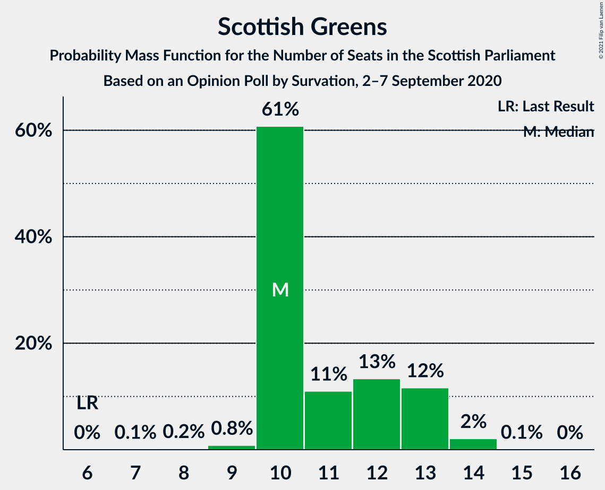
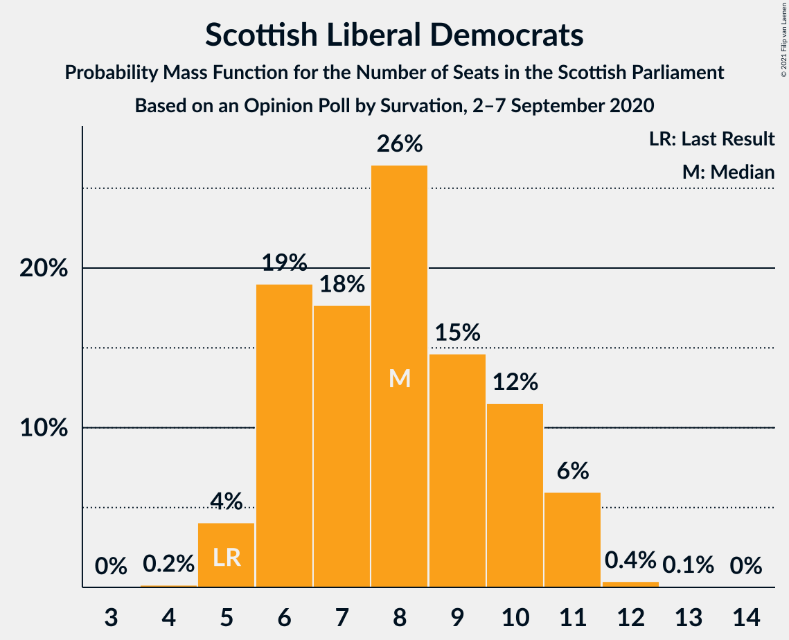
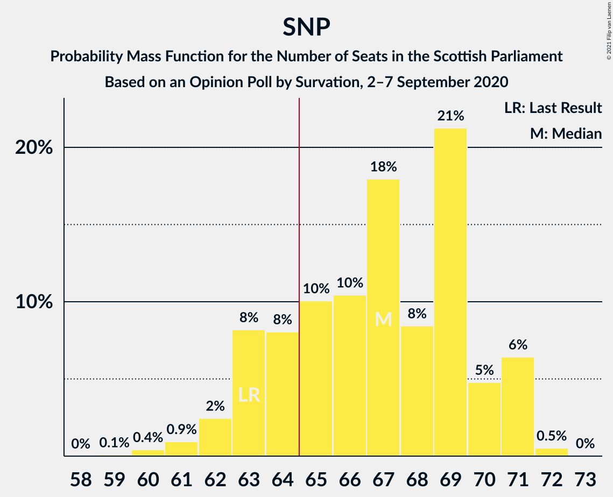

# Opinion Poll by Survation, 2–7 September 2020

<a href="#voting-intentions">Voting Intentions</a> | <a href="#seats">Seats</a> | <a href="#coalitions">Coalitions</a> | <a href="#technical-information">Technical Information</a>

## Voting Intentions

### Confidence Intervals

| Party | Last Result | Poll Result | 80% Confidence Interval | 90% Confidence Interval | 95% Confidence Interval | 99% Confidence Interval |
|:-----:|:-----------:|:-----------:|:-----------------------:|:-----------------------:|:-----------------------:|:-----------------------:|
| Scottish National Party | 41.7% | 41.8% | 39.9–43.8% |39.3–44.4% |38.9–44.9% |37.9–45.9% |
| Scottish Conservative & Unionist Party | 22.9% | 18.0% | 16.5–19.6% |16.1–20.1% |15.7–20.5% |15.1–21.3% |
| Scottish Labour | 19.1% | 18.0% | 16.5–19.6% |16.1–20.1% |15.7–20.5% |15.1–21.3% |
| Scottish Greens | 6.6% | 10.0% | 8.9–11.3% |8.6–11.7% |8.3–12.0% |7.8–12.7% |
| Scottish Liberal Democrats | 5.2% | 8.0% | 7.0–9.2% |6.7–9.5% |6.4–9.8% |6.0–10.4% |
| UK Independence Party | 2.0% | 2.0% | 1.5–2.7% |1.4–2.9% |1.3–3.0% |1.1–3.4% |
| Reform UK | 0.0% | 2.0% | 1.5–2.7% |1.4–2.9% |1.3–3.0% |1.1–3.4% |

*Note:* The poll result column reflects the actual value used in the calculations. Published results may vary slightly, and in addition be rounded to fewer digits.

## Seats

### Confidence Intervals

| Party | Last Result | Median | 80% Confidence Interval | 90% Confidence Interval | 95% Confidence Interval | 99% Confidence Interval |
|:-----:|:-----------:|:------:|:-----------------------:|:-----------------------:|:-----------------------:|:-----------------------:|
| <a href="#scottish-national-party">Scottish National Party</a> | 63 | 67 | 63–70 |63–71 |62–71 |60–72 |
| <a href="#scottish-conservative-&-unionist-party">Scottish Conservative & Unionist Party</a> | 31 | 21 | 19–24 |19–25 |19–25 |18–26 |
| <a href="#scottish-labour">Scottish Labour</a> | 24 | 22 | 19–25 |19–25 |18–26 |17–27 |
| <a href="#scottish-greens">Scottish Greens</a> | 6 | 10 | 10–13 |10–13 |10–13 |9–14 |
| <a href="#scottish-liberal-democrats">Scottish Liberal Democrats</a> | 5 | 8 | 6–10 |6–11 |5–11 |5–11 |
| <a href="#uk-independence-party">UK Independence Party</a> | 0 | 0 | 0 |0 |0 |0 |
| <a href="#reform-uk">Reform UK</a> | 0 | 0 | 0 |0 |0 |0 |

### Scottish National Party

*For a full overview of the results for this party, see the [Scottish National Party](party-scottishnationalparty.html) page.*

| Number of Seats | Probability | Accumulated | Special Marks |
|:---------------:|:-----------:|:-----------:|:-------------:|
| 59 | 0.1% | 100% |  |
| 60 | 0.4% | 99.9% |  |
| 61 | 0.9% | 99.5% |  |
| 62 | 2% | 98.6% |  |
| 63 | 8% | 96% | Last Result |
| 64 | 8% | 88% |  |
| 65 | 10% | 80% | Majority |
| 66 | 10% | 70% |  |
| 67 | 18% | 59% | Median |
| 68 | 8% | 41% |  |
| 69 | 21% | 33% |  |
| 70 | 5% | 12% |  |
| 71 | 6% | 7% |  |
| 72 | 0.5% | 0.5% |  |
| 73 | 0% | 0% |  |

### Scottish Conservative & Unionist Party

*For a full overview of the results for this party, see the [Scottish Conservative & Unionist Party](party-scottishconservativeunionistparty.html) page.*

| Number of Seats | Probability | Accumulated | Special Marks |
|:---------------:|:-----------:|:-----------:|:-------------:|
| 16 | 0.1% | 100% |  |
| 17 | 0.3% | 99.9% |  |
| 18 | 2% | 99.6% |  |
| 19 | 15% | 98% |  |
| 20 | 19% | 83% |  |
| 21 | 23% | 64% | Median |
| 22 | 15% | 41% |  |
| 23 | 14% | 26% |  |
| 24 | 6% | 12% |  |
| 25 | 5% | 6% |  |
| 26 | 1.3% | 2% |  |
| 27 | 0.3% | 0.3% |  |
| 28 | 0% | 0.1% |  |
| 29 | 0% | 0% |  |
| 30 | 0% | 0% |  |
| 31 | 0% | 0% | Last Result |

### Scottish Labour

*For a full overview of the results for this party, see the [Scottish Labour](party-scottishlabour.html) page.*

| Number of Seats | Probability | Accumulated | Special Marks |
|:---------------:|:-----------:|:-----------:|:-------------:|
| 16 | 0.2% | 100% |  |
| 17 | 1.0% | 99.8% |  |
| 18 | 3% | 98.8% |  |
| 19 | 8% | 96% |  |
| 20 | 7% | 88% |  |
| 21 | 20% | 81% |  |
| 22 | 15% | 61% | Median |
| 23 | 20% | 46% |  |
| 24 | 10% | 25% | Last Result |
| 25 | 13% | 15% |  |
| 26 | 2% | 3% |  |
| 27 | 0.3% | 0.5% |  |
| 28 | 0.1% | 0.2% |  |
| 29 | 0% | 0.1% |  |
| 30 | 0% | 0% |  |

### Scottish Greens

*For a full overview of the results for this party, see the [Scottish Greens](party-scottishgreens.html) page.*

| Number of Seats | Probability | Accumulated | Special Marks |
|:---------------:|:-----------:|:-----------:|:-------------:|
| 6 | 0% | 100% | Last Result |
| 7 | 0.1% | 100% |  |
| 8 | 0.2% | 99.9% |  |
| 9 | 0.8% | 99.7% |  |
| 10 | 61% | 98.9% | Median |
| 11 | 11% | 38% |  |
| 12 | 13% | 27% |  |
| 13 | 12% | 14% |  |
| 14 | 2% | 2% |  |
| 15 | 0.1% | 0.1% |  |
| 16 | 0% | 0% |  |

### Scottish Liberal Democrats

*For a full overview of the results for this party, see the [Scottish Liberal Democrats](party-scottishliberaldemocrats.html) page.*

| Number of Seats | Probability | Accumulated | Special Marks |
|:---------------:|:-----------:|:-----------:|:-------------:|
| 4 | 0.2% | 100% |  |
| 5 | 4% | 99.8% | Last Result |
| 6 | 19% | 96% |  |
| 7 | 18% | 77% |  |
| 8 | 26% | 59% | Median |
| 9 | 15% | 33% |  |
| 10 | 12% | 18% |  |
| 11 | 6% | 6% |  |
| 12 | 0.4% | 0.5% |  |
| 13 | 0.1% | 0.1% |  |
| 14 | 0% | 0% |  |

### UK Independence Party

*For a full overview of the results for this party, see the [UK Independence Party](party-ukindependenceparty.html) page.*

| Number of Seats | Probability | Accumulated | Special Marks |
|:---------------:|:-----------:|:-----------:|:-------------:|
| 0 | 100% | 100% | Last Result, Median |

### Reform UK

*For a full overview of the results for this party, see the [Reform UK](party-reformuk.html) page.*

| Number of Seats | Probability | Accumulated | Special Marks |
|:---------------:|:-----------:|:-----------:|:-------------:|
| 0 | 100% | 100% | Last Result, Median |

## Coalitions

### Confidence Intervals

| Coalition | Last Result | Median | Majority? | 80% Confidence Interval | 90% Confidence Interval | 95% Confidence Interval | 99% Confidence Interval |
|:---------:|:-----------:|:------:|:---------:|:-----------------------:|:-----------------------:|:-----------------------:|:-----------------------:|
| Scottish National Party – Scottish Greens | 69 | 78 | 100% | 74–81 | 73–81 | 73–82 | 71–83 |
| Scottish National Party | 63 | 67 | 80% | 63–70 | 63–71 | 62–71 | 60–72 |
| Scottish Conservative & Unionist Party – Scottish Labour – Scottish Liberal Democrats | 60 | 51 | 0% | 48–55 | 48–56 | 47–56 | 46–58 |
| Scottish Conservative & Unionist Party – Scottish Labour | 55 | 44 | 0% | 40–47 | 40–47 | 39–48 | 38–49 |
| Scottish Labour – Scottish Greens – Scottish Liberal Democrats | 35 | 41 | 0% | 37–44 | 37–45 | 36–46 | 35–47 |
| Scottish Conservative & Unionist Party – Scottish Liberal Democrats | 36 | 29 | 0% | 27–32 | 26–33 | 26–34 | 25–35 |
| Scottish Labour – Scottish Liberal Democrats | 29 | 30 | 0% | 27–33 | 26–33 | 25–34 | 24–35 |

### Scottish National Party – Scottish Greens

| Number of Seats | Probability | Accumulated | Special Marks |
|:---------------:|:-----------:|:-----------:|:-------------:|
| 69 | 0% | 100% | Last Result |
| 70 | 0.1% | 100% |  |
| 71 | 0.6% | 99.9% |  |
| 72 | 2% | 99.3% |  |
| 73 | 3% | 98% |  |
| 74 | 6% | 94% |  |
| 75 | 9% | 88% |  |
| 76 | 9% | 80% |  |
| 77 | 18% | 71% | Median |
| 78 | 9% | 52% |  |
| 79 | 21% | 43% |  |
| 80 | 12% | 22% |  |
| 81 | 7% | 11% |  |
| 82 | 2% | 4% |  |
| 83 | 1.4% | 2% |  |
| 84 | 0.1% | 0.1% |  |
| 85 | 0% | 0% |  |

### Scottish National Party

| Number of Seats | Probability | Accumulated | Special Marks |
|:---------------:|:-----------:|:-----------:|:-------------:|
| 59 | 0.1% | 100% |  |
| 60 | 0.4% | 99.9% |  |
| 61 | 0.9% | 99.5% |  |
| 62 | 2% | 98.6% |  |
| 63 | 8% | 96% | Last Result |
| 64 | 8% | 88% |  |
| 65 | 10% | 80% | Majority |
| 66 | 10% | 70% |  |
| 67 | 18% | 59% | Median |
| 68 | 8% | 41% |  |
| 69 | 21% | 33% |  |
| 70 | 5% | 12% |  |
| 71 | 6% | 7% |  |
| 72 | 0.5% | 0.5% |  |
| 73 | 0% | 0% |  |

### Scottish Conservative & Unionist Party – Scottish Labour – Scottish Liberal Democrats

| Number of Seats | Probability | Accumulated | Special Marks |
|:---------------:|:-----------:|:-----------:|:-------------:|
| 45 | 0.1% | 100% |  |
| 46 | 1.4% | 99.9% |  |
| 47 | 2% | 98% |  |
| 48 | 7% | 96% |  |
| 49 | 12% | 89% |  |
| 50 | 21% | 78% |  |
| 51 | 9% | 57% | Median |
| 52 | 18% | 48% |  |
| 53 | 9% | 29% |  |
| 54 | 9% | 20% |  |
| 55 | 6% | 12% |  |
| 56 | 3% | 6% |  |
| 57 | 2% | 2% |  |
| 58 | 0.6% | 0.7% |  |
| 59 | 0.1% | 0.1% |  |
| 60 | 0% | 0% | Last Result |

### Scottish Conservative & Unionist Party – Scottish Labour

| Number of Seats | Probability | Accumulated | Special Marks |
|:---------------:|:-----------:|:-----------:|:-------------:|
| 37 | 0.2% | 100% |  |
| 38 | 0.9% | 99.7% |  |
| 39 | 3% | 98.8% |  |
| 40 | 8% | 96% |  |
| 41 | 12% | 87% |  |
| 42 | 12% | 75% |  |
| 43 | 13% | 63% | Median |
| 44 | 17% | 50% |  |
| 45 | 12% | 34% |  |
| 46 | 8% | 22% |  |
| 47 | 9% | 14% |  |
| 48 | 3% | 5% |  |
| 49 | 1.2% | 2% |  |
| 50 | 0.3% | 0.4% |  |
| 51 | 0.1% | 0.1% |  |
| 52 | 0% | 0% |  |
| 53 | 0% | 0% |  |
| 54 | 0% | 0% |  |
| 55 | 0% | 0% | Last Result |

### Scottish Labour – Scottish Greens – Scottish Liberal Democrats

| Number of Seats | Probability | Accumulated | Special Marks |
|:---------------:|:-----------:|:-----------:|:-------------:|
| 33 | 0.1% | 100% |  |
| 34 | 0.4% | 99.9% |  |
| 35 | 1.2% | 99.5% | Last Result |
| 36 | 2% | 98% |  |
| 37 | 10% | 96% |  |
| 38 | 5% | 87% |  |
| 39 | 13% | 82% |  |
| 40 | 14% | 69% | Median |
| 41 | 12% | 55% |  |
| 42 | 16% | 43% |  |
| 43 | 13% | 27% |  |
| 44 | 8% | 14% |  |
| 45 | 2% | 6% |  |
| 46 | 4% | 4% |  |
| 47 | 0.4% | 0.7% |  |
| 48 | 0.2% | 0.3% |  |
| 49 | 0% | 0% |  |

### Scottish Conservative & Unionist Party – Scottish Liberal Democrats

| Number of Seats | Probability | Accumulated | Special Marks |
|:---------------:|:-----------:|:-----------:|:-------------:|
| 23 | 0.2% | 100% |  |
| 24 | 0.3% | 99.8% |  |
| 25 | 1.2% | 99.5% |  |
| 26 | 6% | 98% |  |
| 27 | 12% | 92% |  |
| 28 | 19% | 80% |  |
| 29 | 21% | 61% | Median |
| 30 | 16% | 40% |  |
| 31 | 10% | 24% |  |
| 32 | 7% | 14% |  |
| 33 | 4% | 7% |  |
| 34 | 2% | 3% |  |
| 35 | 1.0% | 1.2% |  |
| 36 | 0.2% | 0.3% | Last Result |
| 37 | 0% | 0% |  |

### Scottish Labour – Scottish Liberal Democrats

| Number of Seats | Probability | Accumulated | Special Marks |
|:---------------:|:-----------:|:-----------:|:-------------:|
| 23 | 0.2% | 100% |  |
| 24 | 0.7% | 99.7% |  |
| 25 | 2% | 99.0% |  |
| 26 | 4% | 97% |  |
| 27 | 10% | 92% |  |
| 28 | 6% | 83% |  |
| 29 | 14% | 76% | Last Result |
| 30 | 19% | 62% | Median |
| 31 | 14% | 43% |  |
| 32 | 12% | 29% |  |
| 33 | 12% | 16% |  |
| 34 | 3% | 4% |  |
| 35 | 0.6% | 1.1% |  |
| 36 | 0.2% | 0.5% |  |
| 37 | 0.2% | 0.3% |  |
| 38 | 0% | 0% |  |

## Technical Information

### Opinion Poll

+ **Polling firm:** Survation
+ **Commissioner(s):** —
+ **Fieldwork period:** 2–7 September 2020

### Calculations

+ **Sample size:** 1018
+ **Simulations done:** 1,048,576
+ **Error estimate:** 1.25%

