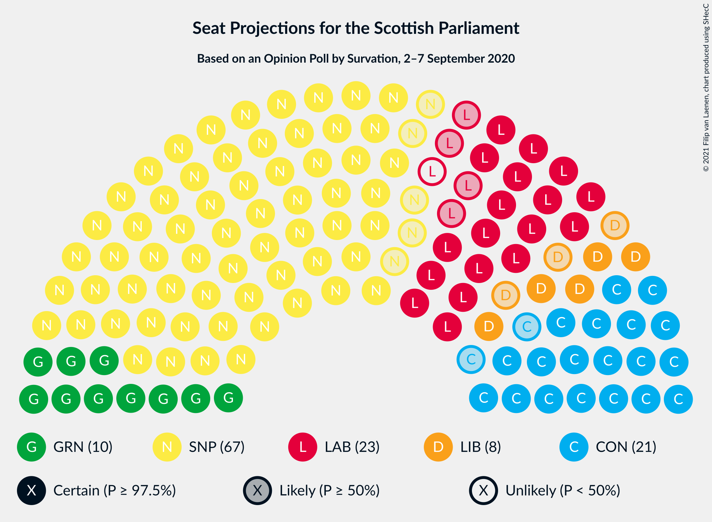
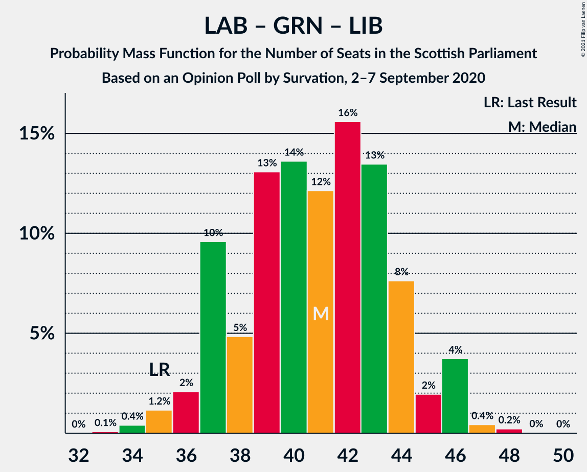

# Opinion Poll by Survation, 2–7 September 2020

<a href="#voting-intentions">Voting Intentions</a> | <a href="#seats">Seats</a> | <a href="#coalitions">Coalitions</a> | <a href="#technical-information">Technical Information</a>

## Voting Intentions

### Confidence Intervals

| Party | Last Result | Poll Result | 80% Confidence Interval | 90% Confidence Interval | 95% Confidence Interval | 99% Confidence Interval |
|:-----:|:-----------:|:-----------:|:-----------------------:|:-----------------------:|:-----------------------:|:-----------------------:|
| Scottish National Party | 41.7% | 41.8% | 39.9–43.8% |39.3–44.4% |38.9–44.9% |37.9–45.9% |
| Scottish Conservative & Unionist Party | 22.9% | 18.0% | 16.5–19.6% |16.1–20.1% |15.7–20.5% |15.1–21.3% |
| Scottish Labour | 19.1% | 18.0% | 16.5–19.6% |16.1–20.1% |15.7–20.5% |15.1–21.3% |
| Scottish Greens | 6.6% | 10.0% | 8.9–11.3% |8.6–11.7% |8.3–12.0% |7.8–12.7% |
| Scottish Liberal Democrats | 5.2% | 8.0% | 7.0–9.2% |6.7–9.5% |6.4–9.8% |6.0–10.4% |
| UK Independence Party | 2.0% | 2.0% | 1.5–2.7% |1.4–2.9% |1.3–3.0% |1.1–3.4% |
| Reform UK | 0.0% | 2.0% | 1.5–2.7% |1.4–2.9% |1.3–3.0% |1.1–3.4% |

*Note:* The poll result column reflects the actual value used in the calculations. Published results may vary slightly, and in addition be rounded to fewer digits.

## Seats

### Confidence Intervals

| Party | Last Result | Median | 80% Confidence Interval | 90% Confidence Interval | 95% Confidence Interval | 99% Confidence Interval |
|:-----:|:-----------:|:------:|:-----------------------:|:-----------------------:|:-----------------------:|:-----------------------:|
| <a href="#scottish-national-party">Scottish National Party</a> | 63 | 70 | 68–71 |66–71 |66–72 |63–72 |
| <a href="#scottish-conservative-&-unionist-party">Scottish Conservative & Unionist Party</a> | 31 | 20 | 19–22 |18–23 |18–24 |17–25 |
| <a href="#scottish-labour">Scottish Labour</a> | 24 | 21 | 19–23 |19–24 |19–24 |16–25 |
| <a href="#scottish-greens">Scottish Greens</a> | 6 | 10 | 10–11 |10–12 |9–13 |8–13 |
| <a href="#scottish-liberal-democrats">Scottish Liberal Democrats</a> | 5 | 8 | 6–10 |6–10 |5–10 |4–11 |
| <a href="#uk-independence-party">UK Independence Party</a> | 0 | 0 | 0 |0 |0 |0 |
| <a href="#reform-uk">Reform UK</a> | 0 | 0 | 0 |0 |0 |0 |

### Scottish National Party

*For a full overview of the results for this party, see the [Scottish National Party](party-scottishnationalparty.html) page.*

| Number of Seats | Probability | Accumulated | Special Marks |
|:---------------:|:-----------:|:-----------:|:-------------:|
| 62 | 0.1% | 100% |  |
| 63 | 1.4% | 99.9% | Last Result |
| 64 | 0.3% | 98% |  |
| 65 | 0.3% | 98% | Majority |
| 66 | 3% | 98% |  |
| 67 | 2% | 94% |  |
| 68 | 8% | 92% |  |
| 69 | 19% | 84% |  |
| 70 | 23% | 64% | Median |
| 71 | 39% | 42% |  |
| 72 | 3% | 3% |  |
| 73 | 0% | 0.1% |  |
| 74 | 0% | 0% |  |

### Scottish Conservative & Unionist Party

*For a full overview of the results for this party, see the [Scottish Conservative & Unionist Party](party-scottishconservativeunionistparty.html) page.*

| Number of Seats | Probability | Accumulated | Special Marks |
|:---------------:|:-----------:|:-----------:|:-------------:|
| 15 | 0.1% | 100% |  |
| 16 | 0.1% | 99.9% |  |
| 17 | 1.0% | 99.8% |  |
| 18 | 5% | 98.8% |  |
| 19 | 15% | 94% |  |
| 20 | 31% | 78% | Median |
| 21 | 35% | 47% |  |
| 22 | 5% | 12% |  |
| 23 | 3% | 7% |  |
| 24 | 4% | 4% |  |
| 25 | 0.4% | 0.7% |  |
| 26 | 0.2% | 0.3% |  |
| 27 | 0% | 0.1% |  |
| 28 | 0% | 0% |  |
| 29 | 0% | 0% |  |
| 30 | 0% | 0% |  |
| 31 | 0% | 0% | Last Result |

### Scottish Labour

*For a full overview of the results for this party, see the [Scottish Labour](party-scottishlabour.html) page.*

| Number of Seats | Probability | Accumulated | Special Marks |
|:---------------:|:-----------:|:-----------:|:-------------:|
| 16 | 0.5% | 100% |  |
| 17 | 0.4% | 99.5% |  |
| 18 | 2% | 99.1% |  |
| 19 | 8% | 98% |  |
| 20 | 10% | 89% |  |
| 21 | 58% | 79% | Median |
| 22 | 10% | 21% |  |
| 23 | 6% | 11% |  |
| 24 | 3% | 5% | Last Result |
| 25 | 1.5% | 2% |  |
| 26 | 0.2% | 0.2% |  |
| 27 | 0% | 0% |  |

### Scottish Greens

*For a full overview of the results for this party, see the [Scottish Greens](party-scottishgreens.html) page.*

| Number of Seats | Probability | Accumulated | Special Marks |
|:---------------:|:-----------:|:-----------:|:-------------:|
| 6 | 0% | 100% | Last Result |
| 7 | 0% | 100% |  |
| 8 | 0.8% | 99.9% |  |
| 9 | 4% | 99.2% |  |
| 10 | 73% | 95% | Median |
| 11 | 14% | 23% |  |
| 12 | 7% | 9% |  |
| 13 | 2% | 3% |  |
| 14 | 0.4% | 0.4% |  |
| 15 | 0% | 0% |  |

### Scottish Liberal Democrats

*For a full overview of the results for this party, see the [Scottish Liberal Democrats](party-scottishliberaldemocrats.html) page.*

| Number of Seats | Probability | Accumulated | Special Marks |
|:---------------:|:-----------:|:-----------:|:-------------:|
| 4 | 1.0% | 100% |  |
| 5 | 3% | 99.0% | Last Result |
| 6 | 36% | 96% |  |
| 7 | 8% | 60% |  |
| 8 | 22% | 53% | Median |
| 9 | 19% | 30% |  |
| 10 | 11% | 12% |  |
| 11 | 1.2% | 1.3% |  |
| 12 | 0% | 0% |  |

### UK Independence Party

*For a full overview of the results for this party, see the [UK Independence Party](party-ukindependenceparty.html) page.*

| Number of Seats | Probability | Accumulated | Special Marks |
|:---------------:|:-----------:|:-----------:|:-------------:|
| 0 | 100% | 100% | Last Result, Median |

### Reform UK

*For a full overview of the results for this party, see the [Reform UK](party-reformuk.html) page.*

| Number of Seats | Probability | Accumulated | Special Marks |
|:---------------:|:-----------:|:-----------:|:-------------:|
| 0 | 100% | 100% | Last Result, Median |

## Coalitions

### Confidence Intervals

| Coalition | Last Result | Median | Majority? | 80% Confidence Interval | 90% Confidence Interval | 95% Confidence Interval | 99% Confidence Interval |
|:---------:|:-----------:|:------:|:---------:|:-----------------------:|:-----------------------:|:-----------------------:|:-----------------------:|
| Scottish National Party – Scottish Greens | 69 | 80 | 100% | 78–82 | 77–82 | 76–83 | 74–83 |
| Scottish National Party | 63 | 70 | 98% | 68–71 | 66–71 | 66–72 | 63–72 |
| Scottish Conservative & Unionist Party – Scottish Labour – Scottish Liberal Democrats | 60 | 49 | 0% | 47–51 | 47–52 | 46–53 | 46–55 |
| Scottish Conservative & Unionist Party – Scottish Labour | 55 | 41 | 0% | 40–43 | 39–44 | 38–46 | 38–47 |
| Scottish Labour – Scottish Greens – Scottish Liberal Democrats | 35 | 39 | 0% | 37–41 | 37–42 | 36–42 | 35–43 |
| Scottish Conservative & Unionist Party – Scottish Liberal Democrats | 36 | 28 | 0% | 26–30 | 26–31 | 25–32 | 23–34 |
| Scottish Labour – Scottish Liberal Democrats | 29 | 29 | 0% | 27–31 | 26–31 | 25–32 | 24–33 |

### Scottish National Party – Scottish Greens

| Number of Seats | Probability | Accumulated | Special Marks |
|:---------------:|:-----------:|:-----------:|:-------------:|
| 69 | 0% | 100% | Last Result |
| 70 | 0% | 100% |  |
| 71 | 0% | 100% |  |
| 72 | 0% | 100% |  |
| 73 | 0.3% | 100% |  |
| 74 | 1.3% | 99.7% |  |
| 75 | 0.7% | 98% |  |
| 76 | 1.1% | 98% |  |
| 77 | 4% | 96% |  |
| 78 | 6% | 93% |  |
| 79 | 19% | 87% |  |
| 80 | 21% | 68% | Median |
| 81 | 33% | 46% |  |
| 82 | 9% | 13% |  |
| 83 | 4% | 4% |  |
| 84 | 0.2% | 0.2% |  |
| 85 | 0% | 0% |  |

### Scottish National Party

| Number of Seats | Probability | Accumulated | Special Marks |
|:---------------:|:-----------:|:-----------:|:-------------:|
| 62 | 0.1% | 100% |  |
| 63 | 1.4% | 99.9% | Last Result |
| 64 | 0.3% | 98% |  |
| 65 | 0.3% | 98% | Majority |
| 66 | 3% | 98% |  |
| 67 | 2% | 94% |  |
| 68 | 8% | 92% |  |
| 69 | 19% | 84% |  |
| 70 | 23% | 64% | Median |
| 71 | 39% | 42% |  |
| 72 | 3% | 3% |  |
| 73 | 0% | 0.1% |  |
| 74 | 0% | 0% |  |

### Scottish Conservative & Unionist Party – Scottish Labour – Scottish Liberal Democrats

| Number of Seats | Probability | Accumulated | Special Marks |
|:---------------:|:-----------:|:-----------:|:-------------:|
| 45 | 0.2% | 100% |  |
| 46 | 4% | 99.8% |  |
| 47 | 9% | 96% |  |
| 48 | 33% | 87% |  |
| 49 | 21% | 54% | Median |
| 50 | 19% | 32% |  |
| 51 | 6% | 13% |  |
| 52 | 4% | 7% |  |
| 53 | 1.1% | 4% |  |
| 54 | 0.7% | 2% |  |
| 55 | 1.3% | 2% |  |
| 56 | 0.3% | 0.3% |  |
| 57 | 0% | 0% |  |
| 58 | 0% | 0% |  |
| 59 | 0% | 0% |  |
| 60 | 0% | 0% | Last Result |

### Scottish Conservative & Unionist Party – Scottish Labour

| Number of Seats | Probability | Accumulated | Special Marks |
|:---------------:|:-----------:|:-----------:|:-------------:|
| 36 | 0.1% | 100% |  |
| 37 | 0.2% | 99.9% |  |
| 38 | 3% | 99.7% |  |
| 39 | 6% | 97% |  |
| 40 | 11% | 91% |  |
| 41 | 33% | 80% | Median |
| 42 | 32% | 47% |  |
| 43 | 8% | 15% |  |
| 44 | 3% | 7% |  |
| 45 | 2% | 5% |  |
| 46 | 1.4% | 3% |  |
| 47 | 1.2% | 1.3% |  |
| 48 | 0.1% | 0.2% |  |
| 49 | 0% | 0% |  |
| 50 | 0% | 0% |  |
| 51 | 0% | 0% |  |
| 52 | 0% | 0% |  |
| 53 | 0% | 0% |  |
| 54 | 0% | 0% |  |
| 55 | 0% | 0% | Last Result |

### Scottish Labour – Scottish Greens – Scottish Liberal Democrats

| Number of Seats | Probability | Accumulated | Special Marks |
|:---------------:|:-----------:|:-----------:|:-------------:|
| 34 | 0.2% | 100% |  |
| 35 | 2% | 99.7% | Last Result |
| 36 | 1.1% | 98% |  |
| 37 | 31% | 97% |  |
| 38 | 9% | 66% |  |
| 39 | 21% | 57% | Median |
| 40 | 17% | 36% |  |
| 41 | 10% | 19% |  |
| 42 | 6% | 8% |  |
| 43 | 2% | 2% |  |
| 44 | 0.4% | 0.5% |  |
| 45 | 0.1% | 0.1% |  |
| 46 | 0% | 0% |  |

### Scottish Conservative & Unionist Party – Scottish Liberal Democrats

| Number of Seats | Probability | Accumulated | Special Marks |
|:---------------:|:-----------:|:-----------:|:-------------:|
| 22 | 0.1% | 100% |  |
| 23 | 1.1% | 99.8% |  |
| 24 | 0.9% | 98.7% |  |
| 25 | 2% | 98% |  |
| 26 | 8% | 95% |  |
| 27 | 36% | 87% |  |
| 28 | 16% | 51% | Median |
| 29 | 21% | 36% |  |
| 30 | 7% | 15% |  |
| 31 | 2% | 7% |  |
| 32 | 3% | 5% |  |
| 33 | 1.1% | 2% |  |
| 34 | 0.5% | 0.7% |  |
| 35 | 0.1% | 0.2% |  |
| 36 | 0.1% | 0.1% | Last Result |
| 37 | 0% | 0% |  |

### Scottish Labour – Scottish Liberal Democrats

| Number of Seats | Probability | Accumulated | Special Marks |
|:---------------:|:-----------:|:-----------:|:-------------:|
| 23 | 0.3% | 100% |  |
| 24 | 0.4% | 99.7% |  |
| 25 | 2% | 99.3% |  |
| 26 | 3% | 97% |  |
| 27 | 36% | 94% |  |
| 28 | 8% | 58% |  |
| 29 | 15% | 50% | Last Result, Median |
| 30 | 19% | 35% |  |
| 31 | 12% | 16% |  |
| 32 | 3% | 4% |  |
| 33 | 1.0% | 1.2% |  |
| 34 | 0.1% | 0.1% |  |
| 35 | 0% | 0% |  |

## Technical Information

### Opinion Poll

+ **Polling firm:** Survation
+ **Commissioner(s):** —
+ **Fieldwork period:** 2–7 September 2020

### Calculations

+ **Sample size:** 1018
+ **Simulations done:** 131,072
+ **Error estimate:** 1.25%

