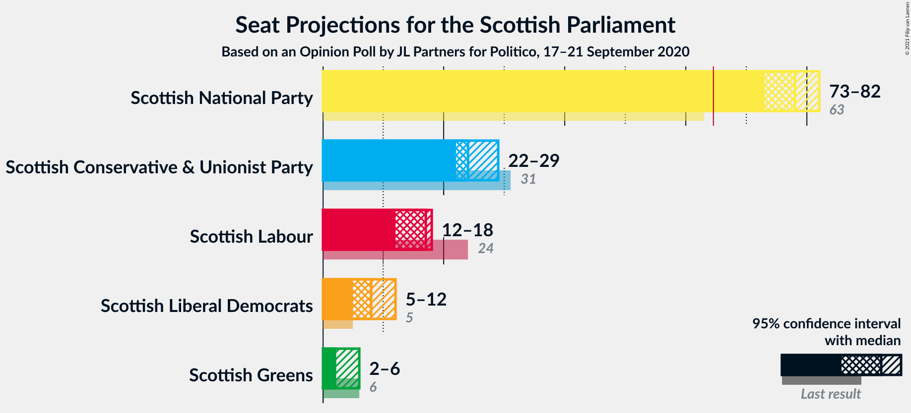
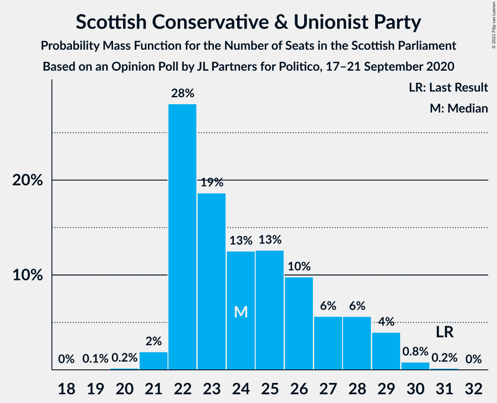
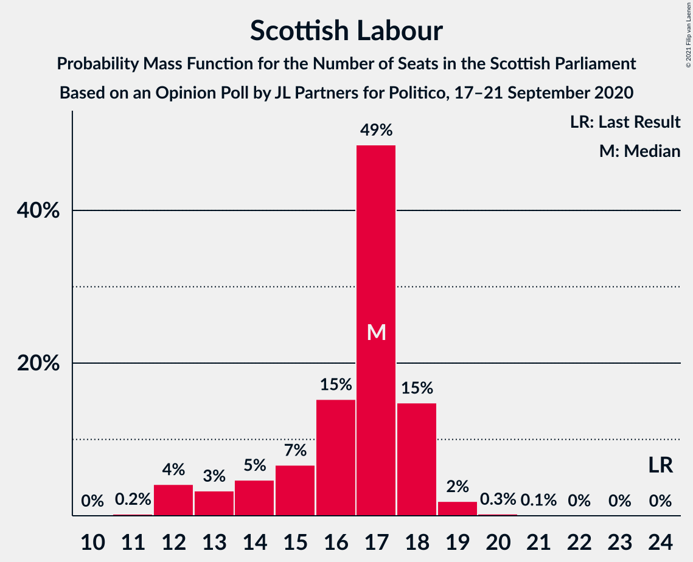
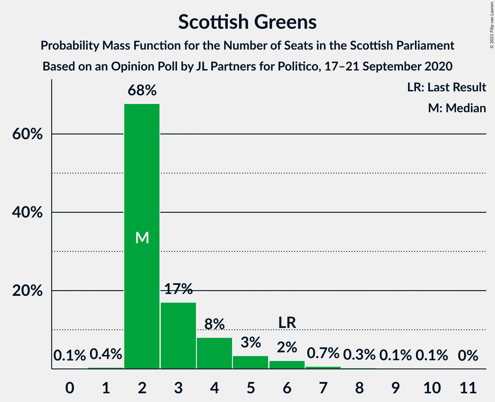
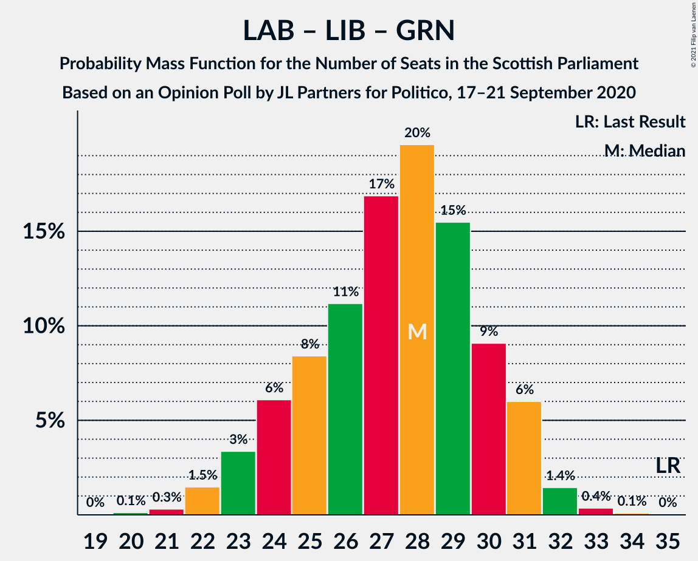

# Opinion Poll by JL Partners for Politico, 17–21 September 2020

<a href="#voting-intentions">Voting Intentions</a> | <a href="#seats">Seats</a> | <a href="#coalitions">Coalitions</a> | <a href="#technical-information">Technical Information</a>

## Voting Intentions

### Confidence Intervals

| Party | Last Result | Poll Result | 80% Confidence Interval | 90% Confidence Interval | 95% Confidence Interval | 99% Confidence Interval |
|:-----:|:-----------:|:-----------:|:-----------------------:|:-----------------------:|:-----------------------:|:-----------------------:|
| Scottish National Party | 41.7% | 53.0% | 50.9–55.0% |50.4–55.5% |49.9–56.0% |48.9–57.0% |
| Scottish Conservative & Unionist Party | 22.9% | 19.0% | 17.5–20.7% |17.1–21.1% |16.7–21.5% |16.0–22.3% |
| Scottish Labour | 19.1% | 13.0% | 11.7–14.4% |11.4–14.8% |11.1–15.2% |10.5–15.9% |
| Scottish Liberal Democrats | 5.2% | 8.0% | 7.0–9.2% |6.7–9.5% |6.5–9.8% |6.0–10.4% |
| Scottish Greens | 6.6% | 5.0% | 4.2–6.0% |4.0–6.3% |3.8–6.6% |3.5–7.1% |

*Note:* The poll result column reflects the actual value used in the calculations. Published results may vary slightly, and in addition be rounded to fewer digits.

## Seats

### Confidence Intervals

| Party | Last Result | Median | 80% Confidence Interval | 90% Confidence Interval | 95% Confidence Interval | 99% Confidence Interval |
|:-----:|:-----------:|:------:|:-----------------------:|:-----------------------:|:-----------------------:|:-----------------------:|
| <a href="#scottish-national-party">Scottish National Party</a> | 63 | 78 | 74–81 |73–82 |72–82 |72–84 |
| <a href="#scottish-conservative-&-unionist-party">Scottish Conservative & Unionist Party</a> | 31 | 24 | 22–28 |22–29 |22–29 |21–30 |
| <a href="#scottish-labour">Scottish Labour</a> | 24 | 17 | 14–18 |13–18 |12–18 |12–19 |
| <a href="#scottish-liberal-democrats">Scottish Liberal Democrats</a> | 5 | 8 | 6–10 |5–11 |5–12 |5–12 |
| <a href="#scottish-greens">Scottish Greens</a> | 6 | 2 | 2–4 |2–5 |2–6 |2–7 |

### Scottish National Party

*For a full overview of the results for this party, see the [Scottish National Party](party-scottishnationalparty.html) page.*

| Number of Seats | Probability | Accumulated | Special Marks |
|:---------------:|:-----------:|:-----------:|:-------------:|
| 63 | 0% | 100% | Last Result |
| 64 | 0% | 100% |  |
| 65 | 0% | 100% | Majority |
| 66 | 0% | 100% |  |
| 67 | 0% | 100% |  |
| 68 | 0% | 100% |  |
| 69 | 0% | 100% |  |
| 70 | 0.1% | 100% |  |
| 71 | 0.2% | 99.9% |  |
| 72 | 2% | 99.7% |  |
| 73 | 4% | 97% |  |
| 74 | 8% | 93% |  |
| 75 | 9% | 86% |  |
| 76 | 12% | 77% |  |
| 77 | 13% | 65% |  |
| 78 | 23% | 52% | Median |
| 79 | 11% | 29% |  |
| 80 | 6% | 18% |  |
| 81 | 6% | 11% |  |
| 82 | 4% | 6% |  |
| 83 | 1.4% | 2% |  |
| 84 | 0.4% | 0.6% |  |
| 85 | 0.2% | 0.2% |  |
| 86 | 0% | 0% |  |

### Scottish Conservative & Unionist Party

*For a full overview of the results for this party, see the [Scottish Conservative & Unionist Party](party-scottishconservativeunionistparty.html) page.*

| Number of Seats | Probability | Accumulated | Special Marks |
|:---------------:|:-----------:|:-----------:|:-------------:|
| 19 | 0.1% | 100% |  |
| 20 | 0.2% | 99.9% |  |
| 21 | 2% | 99.7% |  |
| 22 | 29% | 98% |  |
| 23 | 16% | 69% |  |
| 24 | 11% | 52% | Median |
| 25 | 14% | 41% |  |
| 26 | 12% | 27% |  |
| 27 | 4% | 15% |  |
| 28 | 5% | 11% |  |
| 29 | 5% | 6% |  |
| 30 | 1.0% | 1.2% |  |
| 31 | 0.1% | 0.1% | Last Result |
| 32 | 0% | 0% |  |

### Scottish Labour

*For a full overview of the results for this party, see the [Scottish Labour](party-scottishlabour.html) page.*

| Number of Seats | Probability | Accumulated | Special Marks |
|:---------------:|:-----------:|:-----------:|:-------------:|
| 11 | 0.2% | 100% |  |
| 12 | 4% | 99.7% |  |
| 13 | 3% | 96% |  |
| 14 | 4% | 92% |  |
| 15 | 6% | 89% |  |
| 16 | 15% | 82% |  |
| 17 | 52% | 68% | Median |
| 18 | 14% | 16% |  |
| 19 | 1.5% | 2% |  |
| 20 | 0.2% | 0.5% |  |
| 21 | 0.2% | 0.2% |  |
| 22 | 0% | 0.1% |  |
| 23 | 0% | 0% |  |
| 24 | 0% | 0% | Last Result |

### Scottish Liberal Democrats

*For a full overview of the results for this party, see the [Scottish Liberal Democrats](party-scottishliberaldemocrats.html) page.*

| Number of Seats | Probability | Accumulated | Special Marks |
|:---------------:|:-----------:|:-----------:|:-------------:|
| 5 | 6% | 100% | Last Result |
| 6 | 7% | 94% |  |
| 7 | 7% | 87% |  |
| 8 | 33% | 80% | Median |
| 9 | 30% | 47% |  |
| 10 | 10% | 17% |  |
| 11 | 3% | 7% |  |
| 12 | 4% | 4% |  |
| 13 | 0.1% | 0.1% |  |
| 14 | 0% | 0% |  |

### Scottish Greens

*For a full overview of the results for this party, see the [Scottish Greens](party-scottishgreens.html) page.*

| Number of Seats | Probability | Accumulated | Special Marks |
|:---------------:|:-----------:|:-----------:|:-------------:|
| 1 | 0.1% | 100% |  |
| 2 | 64% | 99.9% | Median |
| 3 | 20% | 36% |  |
| 4 | 9% | 16% |  |
| 5 | 3% | 6% |  |
| 6 | 2% | 3% | Last Result |
| 7 | 0.7% | 1.1% |  |
| 8 | 0.3% | 0.4% |  |
| 9 | 0.1% | 0.2% |  |
| 10 | 0.1% | 0.1% |  |
| 11 | 0% | 0% |  |

## Coalitions

### Confidence Intervals

| Coalition | Last Result | Median | Majority? | 80% Confidence Interval | 90% Confidence Interval | 95% Confidence Interval | 99% Confidence Interval |
|:---------:|:-----------:|:------:|:---------:|:-----------------------:|:-----------------------:|:-----------------------:|:-----------------------:|
| Scottish National Party – Scottish Greens | 69 | 80 | 100% | 76–83 | 76–84 | 75–85 | 74–86 |
| Scottish National Party | 63 | 78 | 100% | 74–81 | 73–82 | 72–82 | 72–84 |
| Scottish Conservative & Unionist Party – Scottish Labour – Scottish Liberal Democrats | 60 | 49 | 0% | 46–53 | 45–53 | 44–54 | 43–55 |
| Scottish Conservative & Unionist Party – Scottish Labour | 55 | 40 | 0% | 38–44 | 37–45 | 36–45 | 35–46 |
| Scottish Conservative & Unionist Party – Scottish Liberal Democrats | 36 | 32 | 0% | 30–36 | 30–37 | 29–38 | 27–39 |
| Scottish Labour – Scottish Liberal Democrats – Scottish Greens | 35 | 28 | 0% | 24–30 | 24–31 | 22–31 | 22–32 |
| Scottish Labour – Scottish Liberal Democrats | 29 | 25 | 0% | 22–27 | 21–28 | 20–29 | 19–29 |

### Scottish National Party – Scottish Greens

| Number of Seats | Probability | Accumulated | Special Marks |
|:---------------:|:-----------:|:-----------:|:-------------:|
| 69 | 0% | 100% | Last Result |
| 70 | 0% | 100% |  |
| 71 | 0% | 100% |  |
| 72 | 0% | 100% |  |
| 73 | 0.1% | 100% |  |
| 74 | 0.8% | 99.8% |  |
| 75 | 3% | 99.1% |  |
| 76 | 7% | 96% |  |
| 77 | 8% | 89% |  |
| 78 | 11% | 81% |  |
| 79 | 12% | 70% |  |
| 80 | 12% | 58% | Median |
| 81 | 17% | 46% |  |
| 82 | 13% | 29% |  |
| 83 | 8% | 15% |  |
| 84 | 3% | 7% |  |
| 85 | 3% | 4% |  |
| 86 | 0.8% | 1.2% |  |
| 87 | 0.2% | 0.4% |  |
| 88 | 0.2% | 0.2% |  |
| 89 | 0% | 0% |  |

### Scottish National Party

| Number of Seats | Probability | Accumulated | Special Marks |
|:---------------:|:-----------:|:-----------:|:-------------:|
| 63 | 0% | 100% | Last Result |
| 64 | 0% | 100% |  |
| 65 | 0% | 100% | Majority |
| 66 | 0% | 100% |  |
| 67 | 0% | 100% |  |
| 68 | 0% | 100% |  |
| 69 | 0% | 100% |  |
| 70 | 0.1% | 100% |  |
| 71 | 0.2% | 99.9% |  |
| 72 | 2% | 99.7% |  |
| 73 | 4% | 97% |  |
| 74 | 8% | 93% |  |
| 75 | 9% | 86% |  |
| 76 | 12% | 77% |  |
| 77 | 13% | 65% |  |
| 78 | 23% | 52% | Median |
| 79 | 11% | 29% |  |
| 80 | 6% | 18% |  |
| 81 | 6% | 11% |  |
| 82 | 4% | 6% |  |
| 83 | 1.4% | 2% |  |
| 84 | 0.4% | 0.6% |  |
| 85 | 0.2% | 0.2% |  |
| 86 | 0% | 0% |  |

### Scottish Conservative & Unionist Party – Scottish Labour – Scottish Liberal Democrats

| Number of Seats | Probability | Accumulated | Special Marks |
|:---------------:|:-----------:|:-----------:|:-------------:|
| 41 | 0.2% | 100% |  |
| 42 | 0.2% | 99.8% |  |
| 43 | 0.8% | 99.6% |  |
| 44 | 3% | 98.8% |  |
| 45 | 3% | 96% |  |
| 46 | 8% | 93% |  |
| 47 | 13% | 85% |  |
| 48 | 17% | 71% |  |
| 49 | 12% | 54% | Median |
| 50 | 12% | 42% |  |
| 51 | 11% | 30% |  |
| 52 | 8% | 19% |  |
| 53 | 7% | 11% |  |
| 54 | 3% | 4% |  |
| 55 | 0.8% | 0.9% |  |
| 56 | 0.1% | 0.2% |  |
| 57 | 0% | 0% |  |
| 58 | 0% | 0% |  |
| 59 | 0% | 0% |  |
| 60 | 0% | 0% | Last Result |

### Scottish Conservative & Unionist Party – Scottish Labour

| Number of Seats | Probability | Accumulated | Special Marks |
|:---------------:|:-----------:|:-----------:|:-------------:|
| 33 | 0.1% | 100% |  |
| 34 | 0.4% | 99.9% |  |
| 35 | 2% | 99.5% |  |
| 36 | 2% | 98% |  |
| 37 | 3% | 96% |  |
| 38 | 8% | 93% |  |
| 39 | 20% | 85% |  |
| 40 | 19% | 65% |  |
| 41 | 11% | 46% | Median |
| 42 | 9% | 35% |  |
| 43 | 12% | 26% |  |
| 44 | 4% | 13% |  |
| 45 | 7% | 9% |  |
| 46 | 1.4% | 2% |  |
| 47 | 0.2% | 0.3% |  |
| 48 | 0.1% | 0.1% |  |
| 49 | 0% | 0% |  |
| 50 | 0% | 0% |  |
| 51 | 0% | 0% |  |
| 52 | 0% | 0% |  |
| 53 | 0% | 0% |  |
| 54 | 0% | 0% |  |
| 55 | 0% | 0% | Last Result |

### Scottish Conservative & Unionist Party – Scottish Liberal Democrats

| Number of Seats | Probability | Accumulated | Special Marks |
|:---------------:|:-----------:|:-----------:|:-------------:|
| 26 | 0.1% | 100% |  |
| 27 | 0.6% | 99.9% |  |
| 28 | 1.1% | 99.3% |  |
| 29 | 3% | 98% |  |
| 30 | 16% | 95% |  |
| 31 | 18% | 80% |  |
| 32 | 15% | 61% | Median |
| 33 | 12% | 46% |  |
| 34 | 14% | 34% |  |
| 35 | 7% | 20% |  |
| 36 | 4% | 12% | Last Result |
| 37 | 4% | 8% |  |
| 38 | 3% | 4% |  |
| 39 | 0.7% | 0.8% |  |
| 40 | 0.1% | 0.1% |  |
| 41 | 0% | 0% |  |

### Scottish Labour – Scottish Liberal Democrats – Scottish Greens

| Number of Seats | Probability | Accumulated | Special Marks |
|:---------------:|:-----------:|:-----------:|:-------------:|
| 20 | 0% | 100% |  |
| 21 | 0.2% | 99.9% |  |
| 22 | 2% | 99.7% |  |
| 23 | 2% | 97% |  |
| 24 | 5% | 95% |  |
| 25 | 10% | 90% |  |
| 26 | 13% | 80% |  |
| 27 | 15% | 67% | Median |
| 28 | 17% | 52% |  |
| 29 | 17% | 35% |  |
| 30 | 11% | 18% |  |
| 31 | 6% | 8% |  |
| 32 | 1.2% | 2% |  |
| 33 | 0.3% | 0.5% |  |
| 34 | 0.1% | 0.2% |  |
| 35 | 0% | 0.1% | Last Result |
| 36 | 0% | 0% |  |

### Scottish Labour – Scottish Liberal Democrats

| Number of Seats | Probability | Accumulated | Special Marks |
|:---------------:|:-----------:|:-----------:|:-------------:|
| 17 | 0.1% | 100% |  |
| 18 | 0.3% | 99.9% |  |
| 19 | 0.8% | 99.6% |  |
| 20 | 2% | 98.8% |  |
| 21 | 3% | 96% |  |
| 22 | 9% | 93% |  |
| 23 | 10% | 85% |  |
| 24 | 13% | 74% |  |
| 25 | 20% | 61% | Median |
| 26 | 23% | 41% |  |
| 27 | 9% | 18% |  |
| 28 | 6% | 10% |  |
| 29 | 3% | 4% | Last Result |
| 30 | 0.2% | 0.3% |  |
| 31 | 0% | 0.1% |  |
| 32 | 0% | 0% |  |

## Technical Information

### Opinion Poll

+ **Polling firm:** JL Partners
+ **Commissioner(s):** Politico
+ **Fieldwork period:** 17–21 September 2020

### Calculations

+ **Sample size:** 1016
+ **Simulations done:** 131,072
+ **Error estimate:** 1.45%

