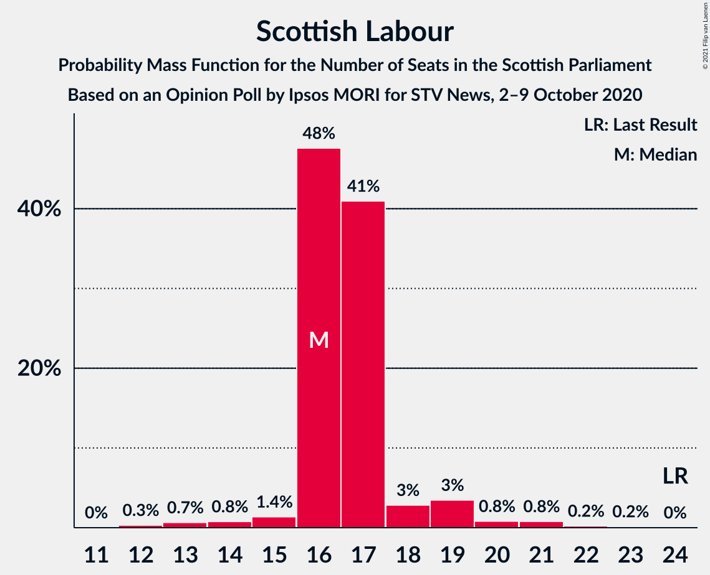
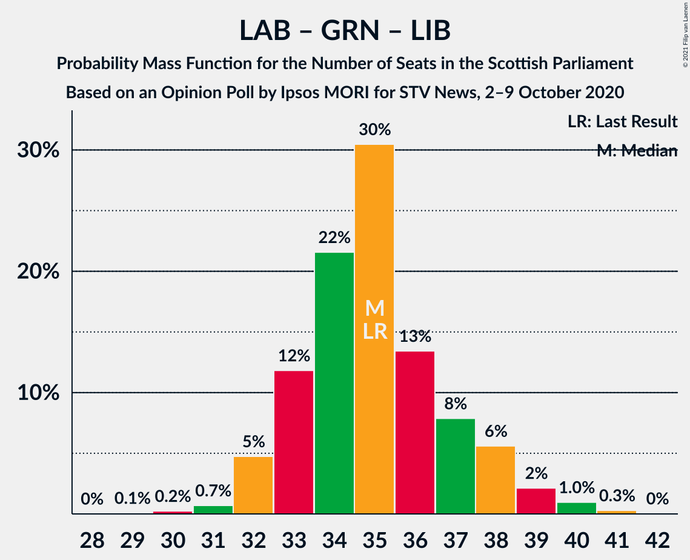

# Opinion Poll by Ipsos MORI for STV News, 2–9 October 2020

<a href="#voting-intentions">Voting Intentions</a> | <a href="#seats">Seats</a> | <a href="#coalitions">Coalitions</a> | <a href="#technical-information">Technical Information</a>

## Voting Intentions

### Confidence Intervals

| Party | Last Result | Poll Result | 80% Confidence Interval | 90% Confidence Interval | 95% Confidence Interval | 99% Confidence Interval |
|:-----:|:-----------:|:-----------:|:-----------------------:|:-----------------------:|:-----------------------:|:-----------------------:|
| Scottish National Party | 41.7% | 48.0% | 46.1–50.0% |45.5–50.6% |45.0–51.1% |44.1–52.0% |
| Scottish Conservative & Unionist Party | 22.9% | 18.0% | 16.5–19.6% |16.1–20.0% |15.8–20.4% |15.1–21.2% |
| Scottish Labour | 19.1% | 14.0% | 12.7–15.4% |12.3–15.9% |12.0–16.2% |11.4–16.9% |
| Scottish Greens | 6.6% | 9.0% | 7.9–10.2% |7.7–10.6% |7.4–10.9% |6.9–11.5% |
| Scottish Liberal Democrats | 5.2% | 8.0% | 7.0–9.2% |6.8–9.6% |6.5–9.8% |6.1–10.4% |

*Note:* The poll result column reflects the actual value used in the calculations. Published results may vary slightly, and in addition be rounded to fewer digits.

## Seats

### Confidence Intervals

| Party | Last Result | Median | 80% Confidence Interval | 90% Confidence Interval | 95% Confidence Interval | 99% Confidence Interval |
|:-----:|:-----------:|:------:|:-----------------------:|:-----------------------:|:-----------------------:|:-----------------------:|
| <a href="#scottish-national-party">Scottish National Party</a> | 63 | 72 | 70–73 |70–74 |70–75 |69–76 |
| <a href="#scottish-conservative-&-unionist-party">Scottish Conservative & Unionist Party</a> | 31 | 22 | 20–24 |19–25 |19–26 |18–26 |
| <a href="#scottish-labour">Scottish Labour</a> | 24 | 16 | 16–17 |16–19 |15–19 |13–21 |
| <a href="#scottish-greens">Scottish Greens</a> | 6 | 10 | 10 |10–11 |9–12 |7–13 |
| <a href="#scottish-liberal-democrats">Scottish Liberal Democrats</a> | 5 | 9 | 6–10 |6–11 |5–11 |5–12 |

### Scottish National Party

*For a full overview of the results for this party, see the [Scottish National Party](party-scottishnationalparty.html) page.*

| Number of Seats | Probability | Accumulated | Special Marks |
|:---------------:|:-----------:|:-----------:|:-------------:|
| 63 | 0% | 100% | Last Result |
| 64 | 0% | 100% |  |
| 65 | 0% | 100% | Majority |
| 66 | 0% | 100% |  |
| 67 | 0.1% | 100% |  |
| 68 | 0.3% | 99.9% |  |
| 69 | 2% | 99.6% |  |
| 70 | 15% | 98% |  |
| 71 | 29% | 83% |  |
| 72 | 26% | 54% | Median |
| 73 | 19% | 28% |  |
| 74 | 6% | 9% |  |
| 75 | 2% | 3% |  |
| 76 | 0.6% | 0.8% |  |
| 77 | 0.2% | 0.2% |  |
| 78 | 0% | 0% |  |

### Scottish Conservative & Unionist Party

*For a full overview of the results for this party, see the [Scottish Conservative & Unionist Party](party-scottishconservativeunionistparty.html) page.*

| Number of Seats | Probability | Accumulated | Special Marks |
|:---------------:|:-----------:|:-----------:|:-------------:|
| 16 | 0.2% | 100% |  |
| 17 | 0.2% | 99.8% |  |
| 18 | 0.8% | 99.7% |  |
| 19 | 5% | 98.8% |  |
| 20 | 6% | 94% |  |
| 21 | 16% | 88% |  |
| 22 | 29% | 71% | Median |
| 23 | 22% | 42% |  |
| 24 | 11% | 20% |  |
| 25 | 4% | 9% |  |
| 26 | 5% | 5% |  |
| 27 | 0.2% | 0.2% |  |
| 28 | 0% | 0.1% |  |
| 29 | 0% | 0% |  |
| 30 | 0% | 0% |  |
| 31 | 0% | 0% | Last Result |

### Scottish Labour

*For a full overview of the results for this party, see the [Scottish Labour](party-scottishlabour.html) page.*

| Number of Seats | Probability | Accumulated | Special Marks |
|:---------------:|:-----------:|:-----------:|:-------------:|
| 12 | 0.3% | 100% |  |
| 13 | 0.7% | 99.7% |  |
| 14 | 0.8% | 99.0% |  |
| 15 | 1.4% | 98% |  |
| 16 | 48% | 97% | Median |
| 17 | 41% | 49% |  |
| 18 | 3% | 8% |  |
| 19 | 3% | 5% |  |
| 20 | 0.8% | 2% |  |
| 21 | 0.8% | 1.2% |  |
| 22 | 0.2% | 0.4% |  |
| 23 | 0.2% | 0.2% |  |
| 24 | 0% | 0% | Last Result |

### Scottish Greens

*For a full overview of the results for this party, see the [Scottish Greens](party-scottishgreens.html) page.*

| Number of Seats | Probability | Accumulated | Special Marks |
|:---------------:|:-----------:|:-----------:|:-------------:|
| 4 | 0.1% | 100% |  |
| 5 | 0.1% | 99.9% |  |
| 6 | 0.2% | 99.8% | Last Result |
| 7 | 0.3% | 99.6% |  |
| 8 | 0.6% | 99.3% |  |
| 9 | 2% | 98.7% |  |
| 10 | 89% | 97% | Median |
| 11 | 4% | 8% |  |
| 12 | 2% | 4% |  |
| 13 | 1.4% | 2% |  |
| 14 | 0.4% | 0.4% |  |
| 15 | 0% | 0% |  |

### Scottish Liberal Democrats

*For a full overview of the results for this party, see the [Scottish Liberal Democrats](party-scottishliberaldemocrats.html) page.*

| Number of Seats | Probability | Accumulated | Special Marks |
|:---------------:|:-----------:|:-----------:|:-------------:|
| 5 | 4% | 100% | Last Result |
| 6 | 9% | 96% |  |
| 7 | 15% | 86% |  |
| 8 | 19% | 72% |  |
| 9 | 39% | 53% | Median |
| 10 | 7% | 14% |  |
| 11 | 6% | 7% |  |
| 12 | 0.5% | 0.5% |  |
| 13 | 0.1% | 0.1% |  |
| 14 | 0% | 0% |  |

## Coalitions

### Confidence Intervals

| Coalition | Last Result | Median | Majority? | 80% Confidence Interval | 90% Confidence Interval | 95% Confidence Interval | 99% Confidence Interval |
|:---------:|:-----------:|:------:|:---------:|:-----------------------:|:-----------------------:|:-----------------------:|:-----------------------:|
| Scottish National Party – Scottish Greens | 69 | 82 | 100% | 80–84 | 80–84 | 79–85 | 78–86 |
| Scottish National Party | 63 | 72 | 100% | 70–73 | 70–74 | 70–75 | 69–76 |
| Scottish Conservative & Unionist Party – Scottish Labour – Scottish Liberal Democrats | 60 | 47 | 0% | 45–49 | 45–49 | 44–50 | 43–51 |
| Scottish Conservative & Unionist Party – Scottish Labour | 55 | 39 | 0% | 37–41 | 37–42 | 36–43 | 35–43 |
| Scottish Labour – Scottish Greens – Scottish Liberal Democrats | 35 | 35 | 0% | 33–37 | 32–38 | 32–39 | 31–40 |
| Scottish Conservative & Unionist Party – Scottish Liberal Democrats | 36 | 31 | 0% | 28–32 | 28–33 | 27–33 | 26–35 |
| Scottish Labour – Scottish Liberal Democrats | 29 | 25 | 0% | 23–27 | 22–28 | 22–28 | 21–30 |

### Scottish National Party – Scottish Greens

| Number of Seats | Probability | Accumulated | Special Marks |
|:---------------:|:-----------:|:-----------:|:-------------:|
| 69 | 0% | 100% | Last Result |
| 70 | 0% | 100% |  |
| 71 | 0% | 100% |  |
| 72 | 0% | 100% |  |
| 73 | 0% | 100% |  |
| 74 | 0% | 100% |  |
| 75 | 0.1% | 100% |  |
| 76 | 0.1% | 99.9% |  |
| 77 | 0.2% | 99.9% |  |
| 78 | 0.4% | 99.7% |  |
| 79 | 2% | 99.3% |  |
| 80 | 11% | 97% |  |
| 81 | 28% | 85% |  |
| 82 | 27% | 57% | Median |
| 83 | 20% | 30% |  |
| 84 | 7% | 10% |  |
| 85 | 2% | 3% |  |
| 86 | 0.8% | 1.1% |  |
| 87 | 0.2% | 0.3% |  |
| 88 | 0% | 0.1% |  |
| 89 | 0% | 0% |  |

### Scottish National Party

| Number of Seats | Probability | Accumulated | Special Marks |
|:---------------:|:-----------:|:-----------:|:-------------:|
| 63 | 0% | 100% | Last Result |
| 64 | 0% | 100% |  |
| 65 | 0% | 100% | Majority |
| 66 | 0% | 100% |  |
| 67 | 0.1% | 100% |  |
| 68 | 0.3% | 99.9% |  |
| 69 | 2% | 99.6% |  |
| 70 | 15% | 98% |  |
| 71 | 29% | 83% |  |
| 72 | 26% | 54% | Median |
| 73 | 19% | 28% |  |
| 74 | 6% | 9% |  |
| 75 | 2% | 3% |  |
| 76 | 0.6% | 0.8% |  |
| 77 | 0.2% | 0.2% |  |
| 78 | 0% | 0% |  |

### Scottish Conservative & Unionist Party – Scottish Labour – Scottish Liberal Democrats

| Number of Seats | Probability | Accumulated | Special Marks |
|:---------------:|:-----------:|:-----------:|:-------------:|
| 41 | 0% | 100% |  |
| 42 | 0.2% | 99.9% |  |
| 43 | 0.8% | 99.7% |  |
| 44 | 2% | 98.9% |  |
| 45 | 7% | 97% |  |
| 46 | 20% | 90% |  |
| 47 | 27% | 70% | Median |
| 48 | 28% | 43% |  |
| 49 | 11% | 15% |  |
| 50 | 2% | 3% |  |
| 51 | 0.4% | 0.7% |  |
| 52 | 0.2% | 0.3% |  |
| 53 | 0.1% | 0.1% |  |
| 54 | 0.1% | 0.1% |  |
| 55 | 0% | 0% |  |
| 56 | 0% | 0% |  |
| 57 | 0% | 0% |  |
| 58 | 0% | 0% |  |
| 59 | 0% | 0% |  |
| 60 | 0% | 0% | Last Result |

### Scottish Conservative & Unionist Party – Scottish Labour

| Number of Seats | Probability | Accumulated | Special Marks |
|:---------------:|:-----------:|:-----------:|:-------------:|
| 33 | 0.1% | 100% |  |
| 34 | 0.3% | 99.9% |  |
| 35 | 0.9% | 99.5% |  |
| 36 | 2% | 98.6% |  |
| 37 | 11% | 96% |  |
| 38 | 32% | 86% | Median |
| 39 | 26% | 54% |  |
| 40 | 13% | 28% |  |
| 41 | 8% | 15% |  |
| 42 | 4% | 7% |  |
| 43 | 3% | 3% |  |
| 44 | 0.4% | 0.5% |  |
| 45 | 0.1% | 0.1% |  |
| 46 | 0% | 0% |  |
| 47 | 0% | 0% |  |
| 48 | 0% | 0% |  |
| 49 | 0% | 0% |  |
| 50 | 0% | 0% |  |
| 51 | 0% | 0% |  |
| 52 | 0% | 0% |  |
| 53 | 0% | 0% |  |
| 54 | 0% | 0% |  |
| 55 | 0% | 0% | Last Result |

### Scottish Labour – Scottish Greens – Scottish Liberal Democrats

| Number of Seats | Probability | Accumulated | Special Marks |
|:---------------:|:-----------:|:-----------:|:-------------:|
| 29 | 0.1% | 100% |  |
| 30 | 0.2% | 99.9% |  |
| 31 | 0.7% | 99.7% |  |
| 32 | 5% | 99.0% |  |
| 33 | 12% | 94% |  |
| 34 | 22% | 82% |  |
| 35 | 30% | 61% | Last Result, Median |
| 36 | 13% | 30% |  |
| 37 | 8% | 17% |  |
| 38 | 6% | 9% |  |
| 39 | 2% | 3% |  |
| 40 | 1.0% | 1.3% |  |
| 41 | 0.3% | 0.3% |  |
| 42 | 0% | 0% |  |

### Scottish Conservative & Unionist Party – Scottish Liberal Democrats

| Number of Seats | Probability | Accumulated | Special Marks |
|:---------------:|:-----------:|:-----------:|:-------------:|
| 25 | 0.3% | 100% |  |
| 26 | 1.4% | 99.7% |  |
| 27 | 3% | 98% |  |
| 28 | 7% | 96% |  |
| 29 | 14% | 89% |  |
| 30 | 20% | 75% |  |
| 31 | 22% | 55% | Median |
| 32 | 23% | 32% |  |
| 33 | 8% | 10% |  |
| 34 | 1.3% | 2% |  |
| 35 | 0.5% | 0.6% |  |
| 36 | 0.1% | 0.1% | Last Result |
| 37 | 0% | 0% |  |

### Scottish Labour – Scottish Liberal Democrats

| Number of Seats | Probability | Accumulated | Special Marks |
|:---------------:|:-----------:|:-----------:|:-------------:|
| 19 | 0.1% | 100% |  |
| 20 | 0.2% | 99.9% |  |
| 21 | 0.5% | 99.7% |  |
| 22 | 5% | 99.2% |  |
| 23 | 11% | 94% |  |
| 24 | 23% | 83% |  |
| 25 | 33% | 60% | Median |
| 26 | 13% | 27% |  |
| 27 | 7% | 14% |  |
| 28 | 5% | 7% |  |
| 29 | 2% | 2% | Last Result |
| 30 | 0.7% | 1.0% |  |
| 31 | 0.2% | 0.3% |  |
| 32 | 0% | 0% |  |

## Technical Information

### Opinion Poll

+ **Polling firm:** Ipsos MORI
+ **Commissioner(s):** STV News
+ **Fieldwork period:** 2–9 October 2020

### Calculations

+ **Sample size:** 1045
+ **Simulations done:** 1,048,576
+ **Error estimate:** 0.34%

