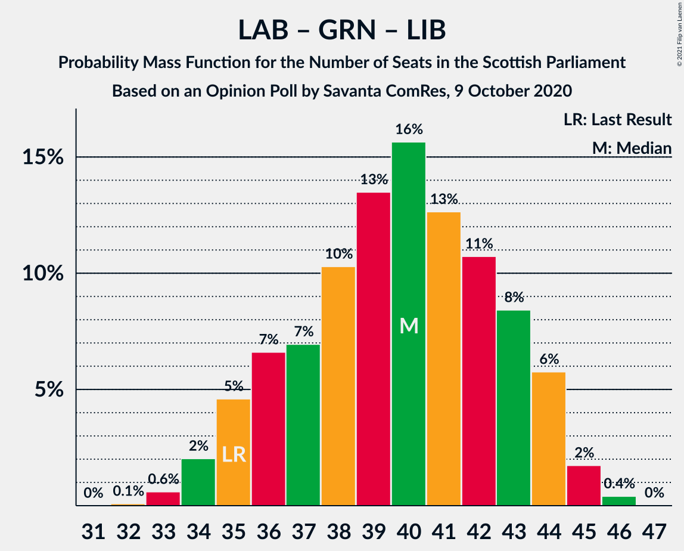

# Opinion Poll by Savanta ComRes, 9 October 2020

<a href="#voting-intentions">Voting Intentions</a> | <a href="#seats">Seats</a> | <a href="#coalitions">Coalitions</a> | <a href="#technical-information">Technical Information</a>

## Voting Intentions

### Confidence Intervals

| Party | Last Result | Poll Result | 80% Confidence Interval | 90% Confidence Interval | 95% Confidence Interval | 99% Confidence Interval |
|:-----:|:-----------:|:-----------:|:-----------------------:|:-----------------------:|:-----------------------:|:-----------------------:|
| Scottish National Party | 41.7% | 41.4% | 39.4–43.4% |38.8–44.0% |38.4–44.5% |37.4–45.4% |
| Scottish Conservative & Unionist Party | 22.9% | 21.2% | 19.6–23.0% |19.2–23.5% |18.8–23.9% |18.1–24.7% |
| Scottish Labour | 19.1% | 18.1% | 16.7–19.8% |16.2–20.3% |15.9–20.7% |15.2–21.5% |
| Scottish Greens | 6.6% | 11.1% | 9.9–12.4% |9.6–12.8% |9.3–13.2% |8.7–13.9% |
| Scottish Liberal Democrats | 5.2% | 7.1% | 6.1–8.2% |5.9–8.6% |5.6–8.8% |5.2–9.4% |

*Note:* The poll result column reflects the actual value used in the calculations. Published results may vary slightly, and in addition be rounded to fewer digits.

## Seats

### Confidence Intervals

| Party | Last Result | Median | 80% Confidence Interval | 90% Confidence Interval | 95% Confidence Interval | 99% Confidence Interval |
|:-----:|:-----------:|:------:|:-----------------------:|:-----------------------:|:-----------------------:|:-----------------------:|
| <a href="#scottish-national-party">Scottish National Party</a> | 63 | 64 | 60–68 |60–69 |60–69 |59–71 |
| <a href="#scottish-conservative-&-unionist-party">Scottish Conservative & Unionist Party</a> | 31 | 25 | 23–28 |22–29 |21–30 |20–32 |
| <a href="#scottish-labour">Scottish Labour</a> | 24 | 22 | 18–24 |18–25 |17–25 |17–26 |
| <a href="#scottish-greens">Scottish Greens</a> | 6 | 12 | 10–13 |10–14 |10–14 |10–15 |
| <a href="#scottish-liberal-democrats">Scottish Liberal Democrats</a> | 5 | 6 | 5–8 |5–8 |5–9 |4–10 |

### Scottish National Party

*For a full overview of the results for this party, see the [Scottish National Party](party-scottishnationalparty.html) page.*

| Number of Seats | Probability | Accumulated | Special Marks |
|:---------------:|:-----------:|:-----------:|:-------------:|
| 57 | 0% | 100% |  |
| 58 | 0.1% | 99.9% |  |
| 59 | 2% | 99.8% |  |
| 60 | 10% | 98% |  |
| 61 | 12% | 89% |  |
| 62 | 10% | 77% |  |
| 63 | 15% | 67% | Last Result |
| 64 | 11% | 52% | Median |
| 65 | 12% | 41% | Majority |
| 66 | 9% | 29% |  |
| 67 | 9% | 19% |  |
| 68 | 4% | 10% |  |
| 69 | 5% | 6% |  |
| 70 | 0.8% | 1.4% |  |
| 71 | 0.6% | 0.7% |  |
| 72 | 0% | 0% |  |

### Scottish Conservative & Unionist Party

*For a full overview of the results for this party, see the [Scottish Conservative & Unionist Party](party-scottishconservativeunionistparty.html) page.*

| Number of Seats | Probability | Accumulated | Special Marks |
|:---------------:|:-----------:|:-----------:|:-------------:|
| 19 | 0.2% | 100% |  |
| 20 | 0.7% | 99.8% |  |
| 21 | 3% | 99.2% |  |
| 22 | 5% | 96% |  |
| 23 | 10% | 91% |  |
| 24 | 16% | 81% |  |
| 25 | 16% | 65% | Median |
| 26 | 21% | 49% |  |
| 27 | 13% | 28% |  |
| 28 | 6% | 14% |  |
| 29 | 4% | 8% |  |
| 30 | 3% | 4% |  |
| 31 | 0.9% | 2% | Last Result |
| 32 | 0.4% | 0.6% |  |
| 33 | 0.2% | 0.2% |  |
| 34 | 0% | 0% |  |

### Scottish Labour

*For a full overview of the results for this party, see the [Scottish Labour](party-scottishlabour.html) page.*

| Number of Seats | Probability | Accumulated | Special Marks |
|:---------------:|:-----------:|:-----------:|:-------------:|
| 17 | 3% | 100% |  |
| 18 | 8% | 97% |  |
| 19 | 10% | 89% |  |
| 20 | 8% | 79% |  |
| 21 | 12% | 71% |  |
| 22 | 17% | 59% | Median |
| 23 | 20% | 42% |  |
| 24 | 13% | 22% | Last Result |
| 25 | 7% | 9% |  |
| 26 | 1.4% | 2% |  |
| 27 | 0.2% | 0.3% |  |
| 28 | 0% | 0.1% |  |
| 29 | 0% | 0% |  |

### Scottish Greens

*For a full overview of the results for this party, see the [Scottish Greens](party-scottishgreens.html) page.*

| Number of Seats | Probability | Accumulated | Special Marks |
|:---------------:|:-----------:|:-----------:|:-------------:|
| 6 | 0% | 100% | Last Result |
| 7 | 0% | 100% |  |
| 8 | 0% | 100% |  |
| 9 | 0.1% | 100% |  |
| 10 | 23% | 99.9% |  |
| 11 | 21% | 77% |  |
| 12 | 33% | 56% | Median |
| 13 | 15% | 22% |  |
| 14 | 5% | 7% |  |
| 15 | 2% | 2% |  |
| 16 | 0% | 0.1% |  |
| 17 | 0% | 0% |  |

### Scottish Liberal Democrats

*For a full overview of the results for this party, see the [Scottish Liberal Democrats](party-scottishliberaldemocrats.html) page.*

| Number of Seats | Probability | Accumulated | Special Marks |
|:---------------:|:-----------:|:-----------:|:-------------:|
| 4 | 2% | 100% |  |
| 5 | 27% | 98% | Last Result |
| 6 | 32% | 70% | Median |
| 7 | 12% | 38% |  |
| 8 | 23% | 27% |  |
| 9 | 2% | 4% |  |
| 10 | 1.3% | 1.4% |  |
| 11 | 0.1% | 0.2% |  |
| 12 | 0% | 0% |  |

## Coalitions

### Confidence Intervals

| Coalition | Last Result | Median | Majority? | 80% Confidence Interval | 90% Confidence Interval | 95% Confidence Interval | 99% Confidence Interval |
|:---------:|:-----------:|:------:|:---------:|:-----------------------:|:-----------------------:|:-----------------------:|:-----------------------:|
| Scottish National Party – Scottish Greens | 69 | 75 | 100% | 72–79 | 72–80 | 71–81 | 70–82 |
| Scottish National Party | 63 | 64 | 41% | 60–68 | 60–69 | 60–69 | 59–71 |
| Scottish Conservative & Unionist Party – Scottish Labour – Scottish Liberal Democrats | 60 | 54 | 0% | 50–57 | 49–57 | 48–58 | 47–59 |
| Scottish Conservative & Unionist Party – Scottish Labour | 55 | 47 | 0% | 44–50 | 43–51 | 42–52 | 41–53 |
| Scottish Labour – Scottish Greens – Scottish Liberal Democrats | 35 | 40 | 0% | 36–43 | 35–44 | 34–44 | 33–45 |
| Scottish Conservative & Unionist Party – Scottish Liberal Democrats | 36 | 32 | 0% | 29–35 | 28–36 | 27–36 | 26–38 |
| Scottish Labour – Scottish Liberal Democrats | 29 | 28 | 0% | 25–31 | 24–32 | 23–33 | 22–34 |

### Scottish National Party – Scottish Greens

| Number of Seats | Probability | Accumulated | Special Marks |
|:---------------:|:-----------:|:-----------:|:-------------:|
| 68 | 0% | 100% |  |
| 69 | 0.3% | 99.9% | Last Result |
| 70 | 1.3% | 99.6% |  |
| 71 | 3% | 98% |  |
| 72 | 8% | 95% |  |
| 73 | 11% | 87% |  |
| 74 | 14% | 76% |  |
| 75 | 14% | 62% |  |
| 76 | 12% | 48% | Median |
| 77 | 14% | 36% |  |
| 78 | 7% | 22% |  |
| 79 | 7% | 15% |  |
| 80 | 5% | 8% |  |
| 81 | 2% | 3% |  |
| 82 | 1.0% | 1.3% |  |
| 83 | 0.3% | 0.3% |  |
| 84 | 0% | 0% |  |

### Scottish National Party

| Number of Seats | Probability | Accumulated | Special Marks |
|:---------------:|:-----------:|:-----------:|:-------------:|
| 57 | 0% | 100% |  |
| 58 | 0.1% | 99.9% |  |
| 59 | 2% | 99.8% |  |
| 60 | 10% | 98% |  |
| 61 | 12% | 89% |  |
| 62 | 10% | 77% |  |
| 63 | 15% | 67% | Last Result |
| 64 | 11% | 52% | Median |
| 65 | 12% | 41% | Majority |
| 66 | 9% | 29% |  |
| 67 | 9% | 19% |  |
| 68 | 4% | 10% |  |
| 69 | 5% | 6% |  |
| 70 | 0.8% | 1.4% |  |
| 71 | 0.6% | 0.7% |  |
| 72 | 0% | 0% |  |

### Scottish Conservative & Unionist Party – Scottish Labour – Scottish Liberal Democrats

| Number of Seats | Probability | Accumulated | Special Marks |
|:---------------:|:-----------:|:-----------:|:-------------:|
| 46 | 0.3% | 100% |  |
| 47 | 1.0% | 99.7% |  |
| 48 | 2% | 98.7% |  |
| 49 | 5% | 97% |  |
| 50 | 7% | 92% |  |
| 51 | 7% | 85% |  |
| 52 | 14% | 78% |  |
| 53 | 12% | 64% | Median |
| 54 | 14% | 52% |  |
| 55 | 14% | 38% |  |
| 56 | 11% | 24% |  |
| 57 | 8% | 13% |  |
| 58 | 3% | 5% |  |
| 59 | 1.3% | 2% |  |
| 60 | 0.3% | 0.4% | Last Result |
| 61 | 0% | 0.1% |  |
| 62 | 0% | 0% |  |

### Scottish Conservative & Unionist Party – Scottish Labour

| Number of Seats | Probability | Accumulated | Special Marks |
|:---------------:|:-----------:|:-----------:|:-------------:|
| 39 | 0.1% | 100% |  |
| 40 | 0.3% | 99.9% |  |
| 41 | 0.9% | 99.6% |  |
| 42 | 3% | 98.8% |  |
| 43 | 4% | 96% |  |
| 44 | 10% | 92% |  |
| 45 | 8% | 81% |  |
| 46 | 13% | 74% |  |
| 47 | 15% | 60% | Median |
| 48 | 15% | 45% |  |
| 49 | 14% | 30% |  |
| 50 | 7% | 16% |  |
| 51 | 6% | 9% |  |
| 52 | 2% | 4% |  |
| 53 | 0.9% | 1.3% |  |
| 54 | 0.4% | 0.4% |  |
| 55 | 0% | 0.1% | Last Result |
| 56 | 0% | 0% |  |

### Scottish Labour – Scottish Greens – Scottish Liberal Democrats

| Number of Seats | Probability | Accumulated | Special Marks |
|:---------------:|:-----------:|:-----------:|:-------------:|
| 32 | 0.1% | 100% |  |
| 33 | 0.6% | 99.9% |  |
| 34 | 2% | 99.3% |  |
| 35 | 5% | 97% | Last Result |
| 36 | 7% | 93% |  |
| 37 | 7% | 86% |  |
| 38 | 10% | 79% |  |
| 39 | 13% | 69% |  |
| 40 | 16% | 55% | Median |
| 41 | 13% | 40% |  |
| 42 | 11% | 27% |  |
| 43 | 8% | 16% |  |
| 44 | 6% | 8% |  |
| 45 | 2% | 2% |  |
| 46 | 0.4% | 0.4% |  |
| 47 | 0% | 0% |  |

### Scottish Conservative & Unionist Party – Scottish Liberal Democrats

| Number of Seats | Probability | Accumulated | Special Marks |
|:---------------:|:-----------:|:-----------:|:-------------:|
| 25 | 0.2% | 100% |  |
| 26 | 1.0% | 99.8% |  |
| 27 | 2% | 98.7% |  |
| 28 | 6% | 97% |  |
| 29 | 9% | 91% |  |
| 30 | 13% | 82% |  |
| 31 | 13% | 69% | Median |
| 32 | 17% | 56% |  |
| 33 | 13% | 39% |  |
| 34 | 15% | 26% |  |
| 35 | 5% | 11% |  |
| 36 | 3% | 5% | Last Result |
| 37 | 1.3% | 2% |  |
| 38 | 0.5% | 0.8% |  |
| 39 | 0.2% | 0.3% |  |
| 40 | 0.1% | 0.1% |  |
| 41 | 0% | 0% |  |

### Scottish Labour – Scottish Liberal Democrats

| Number of Seats | Probability | Accumulated | Special Marks |
|:---------------:|:-----------:|:-----------:|:-------------:|
| 22 | 0.9% | 100% |  |
| 23 | 3% | 99.0% |  |
| 24 | 5% | 96% |  |
| 25 | 7% | 90% |  |
| 26 | 10% | 84% |  |
| 27 | 12% | 74% |  |
| 28 | 16% | 62% | Median |
| 29 | 17% | 46% | Last Result |
| 30 | 13% | 29% |  |
| 31 | 8% | 17% |  |
| 32 | 5% | 8% |  |
| 33 | 2% | 3% |  |
| 34 | 0.5% | 0.6% |  |
| 35 | 0.1% | 0.1% |  |
| 36 | 0% | 0% |  |

## Technical Information

### Opinion Poll

+ **Polling firm:** Savanta ComRes
+ **Commissioner(s):** —
+ **Fieldwork period:** 9 October 2020

### Calculations

+ **Sample size:** 1003
+ **Simulations done:** 1,048,576
+ **Error estimate:** 0.49%

