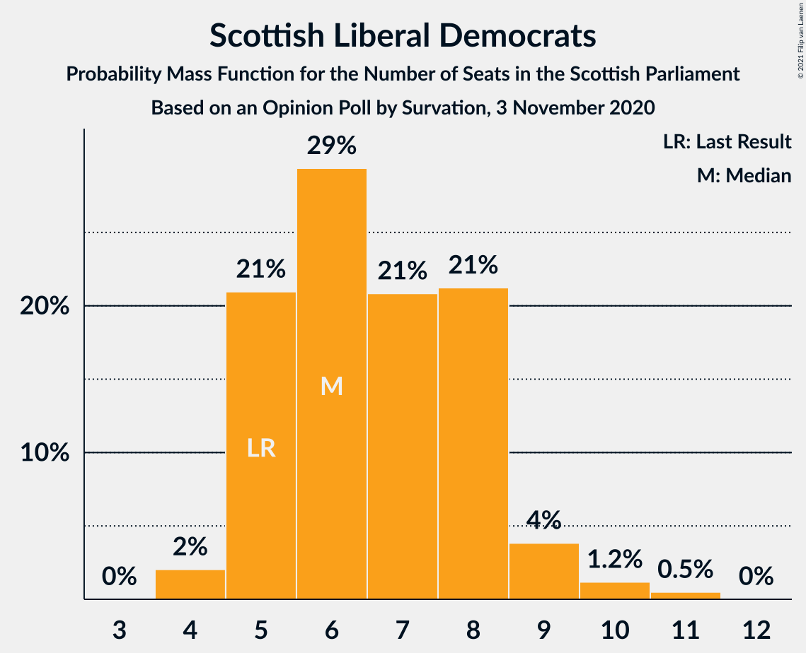

# Opinion Poll by Survation, 3 November 2020

<a href="#voting-intentions">Voting Intentions</a> | <a href="#seats">Seats</a> | <a href="#coalitions">Coalitions</a> | <a href="#technical-information">Technical Information</a>

## Voting Intentions

### Confidence Intervals

| Party | Last Result | Poll Result | 80% Confidence Interval | 90% Confidence Interval | 95% Confidence Interval | 99% Confidence Interval |
|:-----:|:-----------:|:-----------:|:-----------------------:|:-----------------------:|:-----------------------:|:-----------------------:|
| Scottish National Party | 41.7% | 43.0% | 41.1–45.0% |40.6–45.6% |40.1–46.0% |39.2–47.0% |
| Scottish Labour | 19.1% | 19.0% | 17.5–20.6% |17.1–21.0% |16.7–21.4% |16.0–22.2% |
| Scottish Conservative & Unionist Party | 22.9% | 17.0% | 15.6–18.5% |15.2–19.0% |14.9–19.4% |14.2–20.1% |
| Scottish Greens | 6.6% | 10.0% | 8.9–11.3% |8.6–11.6% |8.3–11.9% |7.8–12.6% |
| Scottish Liberal Democrats | 5.2% | 7.0% | 6.1–8.1% |5.8–8.4% |5.6–8.7% |5.2–9.3% |
| Reform UK | 0.0% | 2.0% | 1.5–2.6% |1.4–2.8% |1.3–3.0% |1.1–3.3% |
| UK Independence Party | 2.0% | 1.0% | 0.7–1.6% |0.6–1.7% |0.6–1.8% |0.5–2.1% |

*Note:* The poll result column reflects the actual value used in the calculations. Published results may vary slightly, and in addition be rounded to fewer digits.

## Seats

### Confidence Intervals

| Party | Last Result | Median | 80% Confidence Interval | 90% Confidence Interval | 95% Confidence Interval | 99% Confidence Interval |
|:-----:|:-----------:|:------:|:-----------------------:|:-----------------------:|:-----------------------:|:-----------------------:|
| <a href="#scottish-national-party">Scottish National Party</a> | 63 | 69 | 68–71 |68–71 |67–72 |65–72 |
| <a href="#scottish-labour">Scottish Labour</a> | 24 | 24 | 22–25 |21–25 |19–26 |18–26 |
| <a href="#scottish-conservative-&-unionist-party">Scottish Conservative & Unionist Party</a> | 31 | 19 | 18–21 |18–22 |17–23 |16–25 |
| <a href="#scottish-greens">Scottish Greens</a> | 6 | 10 | 10–11 |10–12 |10–13 |9–14 |
| <a href="#scottish-liberal-democrats">Scottish Liberal Democrats</a> | 5 | 6 | 4–8 |4–9 |4–9 |4–10 |
| <a href="#reform-uk">Reform UK</a> | 0 | 0 | 0 |0 |0 |0 |
| <a href="#uk-independence-party">UK Independence Party</a> | 0 | 0 | 0 |0 |0 |0 |

### Scottish National Party

*For a full overview of the results for this party, see the [Scottish National Party](party-scottishnationalparty.html) page.*

| Number of Seats | Probability | Accumulated | Special Marks |
|:---------------:|:-----------:|:-----------:|:-------------:|
| 63 | 0.1% | 100% | Last Result |
| 64 | 0.3% | 99.9% |  |
| 65 | 0.1% | 99.6% | Majority |
| 66 | 0.9% | 99.5% |  |
| 67 | 2% | 98.5% |  |
| 68 | 10% | 97% |  |
| 69 | 52% | 87% | Median |
| 70 | 21% | 34% |  |
| 71 | 8% | 13% |  |
| 72 | 5% | 5% |  |
| 73 | 0.4% | 0.5% |  |
| 74 | 0.1% | 0.1% |  |
| 75 | 0% | 0% |  |

### Scottish Labour

*For a full overview of the results for this party, see the [Scottish Labour](party-scottishlabour.html) page.*

| Number of Seats | Probability | Accumulated | Special Marks |
|:---------------:|:-----------:|:-----------:|:-------------:|
| 17 | 0.2% | 100% |  |
| 18 | 0.9% | 99.8% |  |
| 19 | 2% | 98.9% |  |
| 20 | 2% | 97% |  |
| 21 | 4% | 96% |  |
| 22 | 9% | 91% |  |
| 23 | 24% | 83% |  |
| 24 | 18% | 58% | Last Result, Median |
| 25 | 35% | 40% |  |
| 26 | 5% | 5% |  |
| 27 | 0.1% | 0.1% |  |
| 28 | 0% | 0% |  |

### Scottish Conservative & Unionist Party

*For a full overview of the results for this party, see the [Scottish Conservative & Unionist Party](party-scottishconservativeunionistparty.html) page.*

| Number of Seats | Probability | Accumulated | Special Marks |
|:---------------:|:-----------:|:-----------:|:-------------:|
| 16 | 0.7% | 100% |  |
| 17 | 3% | 99.2% |  |
| 18 | 11% | 97% |  |
| 19 | 45% | 86% | Median |
| 20 | 10% | 41% |  |
| 21 | 25% | 30% |  |
| 22 | 1.2% | 5% |  |
| 23 | 2% | 4% |  |
| 24 | 1.3% | 2% |  |
| 25 | 0.5% | 0.6% |  |
| 26 | 0.1% | 0.1% |  |
| 27 | 0% | 0% |  |
| 28 | 0% | 0% |  |
| 29 | 0% | 0% |  |
| 30 | 0% | 0% |  |
| 31 | 0% | 0% | Last Result |

### Scottish Greens

*For a full overview of the results for this party, see the [Scottish Greens](party-scottishgreens.html) page.*

| Number of Seats | Probability | Accumulated | Special Marks |
|:---------------:|:-----------:|:-----------:|:-------------:|
| 6 | 0% | 100% | Last Result |
| 7 | 0.1% | 100% |  |
| 8 | 0.1% | 99.9% |  |
| 9 | 1.0% | 99.8% |  |
| 10 | 60% | 98.9% | Median |
| 11 | 33% | 39% |  |
| 12 | 3% | 6% |  |
| 13 | 2% | 3% |  |
| 14 | 0.9% | 1.0% |  |
| 15 | 0.1% | 0.1% |  |
| 16 | 0% | 0% |  |

### Scottish Liberal Democrats

*For a full overview of the results for this party, see the [Scottish Liberal Democrats](party-scottishliberaldemocrats.html) page.*

| Number of Seats | Probability | Accumulated | Special Marks |
|:---------------:|:-----------:|:-----------:|:-------------:|
| 3 | 0.1% | 100% |  |
| 4 | 18% | 99.9% |  |
| 5 | 14% | 82% | Last Result |
| 6 | 51% | 68% | Median |
| 7 | 5% | 17% |  |
| 8 | 6% | 12% |  |
| 9 | 4% | 6% |  |
| 10 | 2% | 2% |  |
| 11 | 0% | 0% |  |

### Reform UK

*For a full overview of the results for this party, see the [Reform UK](party-reformuk.html) page.*

| Number of Seats | Probability | Accumulated | Special Marks |
|:---------------:|:-----------:|:-----------:|:-------------:|
| 0 | 100% | 100% | Last Result, Median |

### UK Independence Party

*For a full overview of the results for this party, see the [UK Independence Party](party-ukindependenceparty.html) page.*

| Number of Seats | Probability | Accumulated | Special Marks |
|:---------------:|:-----------:|:-----------:|:-------------:|
| 0 | 100% | 100% | Last Result, Median |

## Coalitions

### Confidence Intervals

| Coalition | Last Result | Median | Majority? | 80% Confidence Interval | 90% Confidence Interval | 95% Confidence Interval | 99% Confidence Interval |
|:---------:|:-----------:|:------:|:---------:|:-----------------------:|:-----------------------:|:-----------------------:|:-----------------------:|
| Scottish National Party – Scottish Greens | 69 | 80 | 100% | 79–82 | 78–82 | 78–82 | 75–84 |
| Scottish National Party | 63 | 69 | 99.6% | 68–71 | 68–71 | 67–72 | 65–72 |
| Scottish Labour – Scottish Conservative & Unionist Party – Scottish Liberal Democrats | 60 | 49 | 0% | 47–50 | 47–51 | 47–51 | 45–54 |
| Scottish Labour – Scottish Conservative & Unionist Party | 55 | 44 | 0% | 41–44 | 40–45 | 40–45 | 39–47 |
| Scottish Labour – Scottish Greens – Scottish Liberal Democrats | 35 | 40 | 0% | 38–42 | 37–42 | 36–43 | 35–44 |
| Scottish Labour – Scottish Liberal Democrats | 29 | 30 | 0% | 28–31 | 26–32 | 26–32 | 24–33 |
| Scottish Conservative & Unionist Party – Scottish Liberal Democrats | 36 | 25 | 0% | 23–28 | 23–29 | 22–30 | 21–31 |

### Scottish National Party – Scottish Greens

| Number of Seats | Probability | Accumulated | Special Marks |
|:---------------:|:-----------:|:-----------:|:-------------:|
| 69 | 0% | 100% | Last Result |
| 70 | 0% | 100% |  |
| 71 | 0% | 100% |  |
| 72 | 0% | 100% |  |
| 73 | 0.1% | 100% |  |
| 74 | 0.1% | 99.9% |  |
| 75 | 0.3% | 99.7% |  |
| 76 | 0.8% | 99.5% |  |
| 77 | 0.6% | 98.6% |  |
| 78 | 4% | 98% |  |
| 79 | 42% | 94% | Median |
| 80 | 27% | 52% |  |
| 81 | 13% | 25% |  |
| 82 | 10% | 12% |  |
| 83 | 2% | 2% |  |
| 84 | 0.5% | 0.6% |  |
| 85 | 0.1% | 0.1% |  |
| 86 | 0% | 0% |  |

### Scottish National Party

| Number of Seats | Probability | Accumulated | Special Marks |
|:---------------:|:-----------:|:-----------:|:-------------:|
| 63 | 0.1% | 100% | Last Result |
| 64 | 0.3% | 99.9% |  |
| 65 | 0.1% | 99.6% | Majority |
| 66 | 0.9% | 99.5% |  |
| 67 | 2% | 98.5% |  |
| 68 | 10% | 97% |  |
| 69 | 52% | 87% | Median |
| 70 | 21% | 34% |  |
| 71 | 8% | 13% |  |
| 72 | 5% | 5% |  |
| 73 | 0.4% | 0.5% |  |
| 74 | 0.1% | 0.1% |  |
| 75 | 0% | 0% |  |

### Scottish Labour – Scottish Conservative & Unionist Party – Scottish Liberal Democrats

| Number of Seats | Probability | Accumulated | Special Marks |
|:---------------:|:-----------:|:-----------:|:-------------:|
| 44 | 0.1% | 100% |  |
| 45 | 0.5% | 99.9% |  |
| 46 | 2% | 99.4% |  |
| 47 | 10% | 98% |  |
| 48 | 13% | 88% |  |
| 49 | 27% | 75% | Median |
| 50 | 42% | 48% |  |
| 51 | 4% | 6% |  |
| 52 | 0.6% | 2% |  |
| 53 | 0.8% | 1.4% |  |
| 54 | 0.3% | 0.5% |  |
| 55 | 0.1% | 0.3% |  |
| 56 | 0.1% | 0.1% |  |
| 57 | 0% | 0% |  |
| 58 | 0% | 0% |  |
| 59 | 0% | 0% |  |
| 60 | 0% | 0% | Last Result |

### Scottish Labour – Scottish Conservative & Unionist Party

| Number of Seats | Probability | Accumulated | Special Marks |
|:---------------:|:-----------:|:-----------:|:-------------:|
| 38 | 0.3% | 100% |  |
| 39 | 1.4% | 99.7% |  |
| 40 | 4% | 98% |  |
| 41 | 5% | 95% |  |
| 42 | 9% | 89% |  |
| 43 | 22% | 81% | Median |
| 44 | 51% | 59% |  |
| 45 | 6% | 8% |  |
| 46 | 0.9% | 2% |  |
| 47 | 0.8% | 1.2% |  |
| 48 | 0.2% | 0.4% |  |
| 49 | 0.2% | 0.2% |  |
| 50 | 0% | 0% |  |
| 51 | 0% | 0% |  |
| 52 | 0% | 0% |  |
| 53 | 0% | 0% |  |
| 54 | 0% | 0% |  |
| 55 | 0% | 0% | Last Result |

### Scottish Labour – Scottish Greens – Scottish Liberal Democrats

| Number of Seats | Probability | Accumulated | Special Marks |
|:---------------:|:-----------:|:-----------:|:-------------:|
| 33 | 0.1% | 100% |  |
| 34 | 0.2% | 99.9% |  |
| 35 | 0.5% | 99.7% | Last Result |
| 36 | 3% | 99.2% |  |
| 37 | 4% | 96% |  |
| 38 | 9% | 92% |  |
| 39 | 16% | 83% |  |
| 40 | 19% | 67% | Median |
| 41 | 34% | 48% |  |
| 42 | 10% | 13% |  |
| 43 | 3% | 4% |  |
| 44 | 0.7% | 0.8% |  |
| 45 | 0.1% | 0.1% |  |
| 46 | 0% | 0% |  |

### Scottish Labour – Scottish Liberal Democrats

| Number of Seats | Probability | Accumulated | Special Marks |
|:---------------:|:-----------:|:-----------:|:-------------:|
| 22 | 0.1% | 100% |  |
| 23 | 0.4% | 99.9% |  |
| 24 | 0.6% | 99.5% |  |
| 25 | 0.8% | 99.0% |  |
| 26 | 5% | 98% |  |
| 27 | 3% | 93% |  |
| 28 | 12% | 90% |  |
| 29 | 25% | 78% | Last Result |
| 30 | 17% | 52% | Median |
| 31 | 28% | 35% |  |
| 32 | 5% | 7% |  |
| 33 | 1.3% | 2% |  |
| 34 | 0.4% | 0.4% |  |
| 35 | 0% | 0% |  |

### Scottish Conservative & Unionist Party – Scottish Liberal Democrats

| Number of Seats | Probability | Accumulated | Special Marks |
|:---------------:|:-----------:|:-----------:|:-------------:|
| 20 | 0.1% | 100% |  |
| 21 | 0.6% | 99.9% |  |
| 22 | 2% | 99.3% |  |
| 23 | 11% | 97% |  |
| 24 | 7% | 86% |  |
| 25 | 36% | 79% | Median |
| 26 | 18% | 43% |  |
| 27 | 15% | 25% |  |
| 28 | 5% | 10% |  |
| 29 | 3% | 5% |  |
| 30 | 1.4% | 3% |  |
| 31 | 1.1% | 1.5% |  |
| 32 | 0.1% | 0.3% |  |
| 33 | 0.2% | 0.2% |  |
| 34 | 0% | 0% |  |
| 35 | 0% | 0% |  |
| 36 | 0% | 0% | Last Result |

## Technical Information

### Opinion Poll

+ **Polling firm:** Survation
+ **Commissioner(s):** —
+ **Fieldwork period:** 3 November 2020

### Calculations

+ **Sample size:** 1071
+ **Simulations done:** 131,072
+ **Error estimate:** 1.33%

