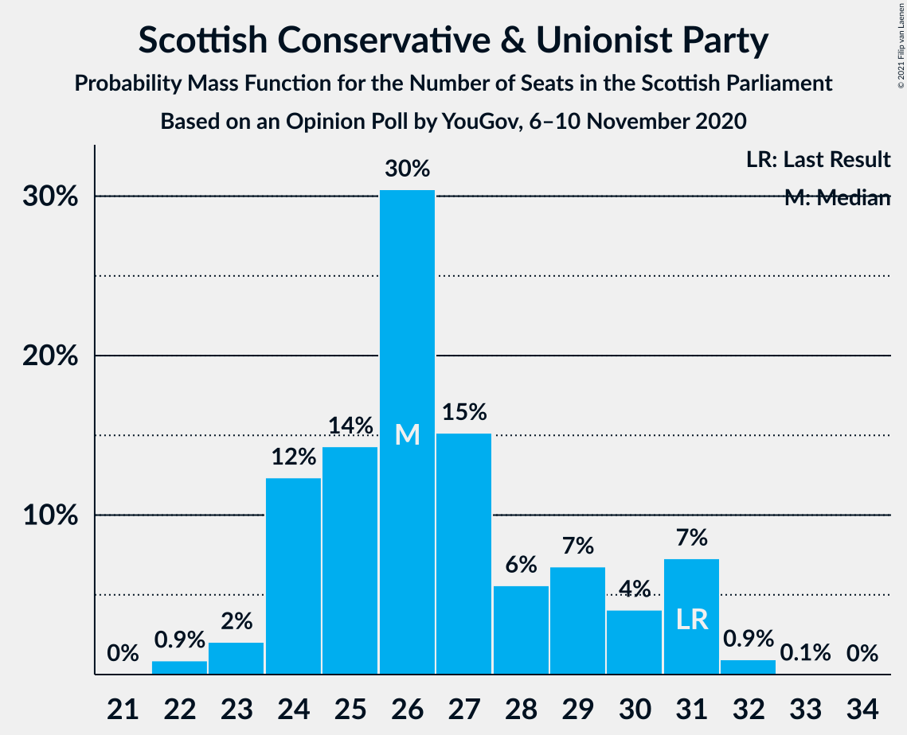
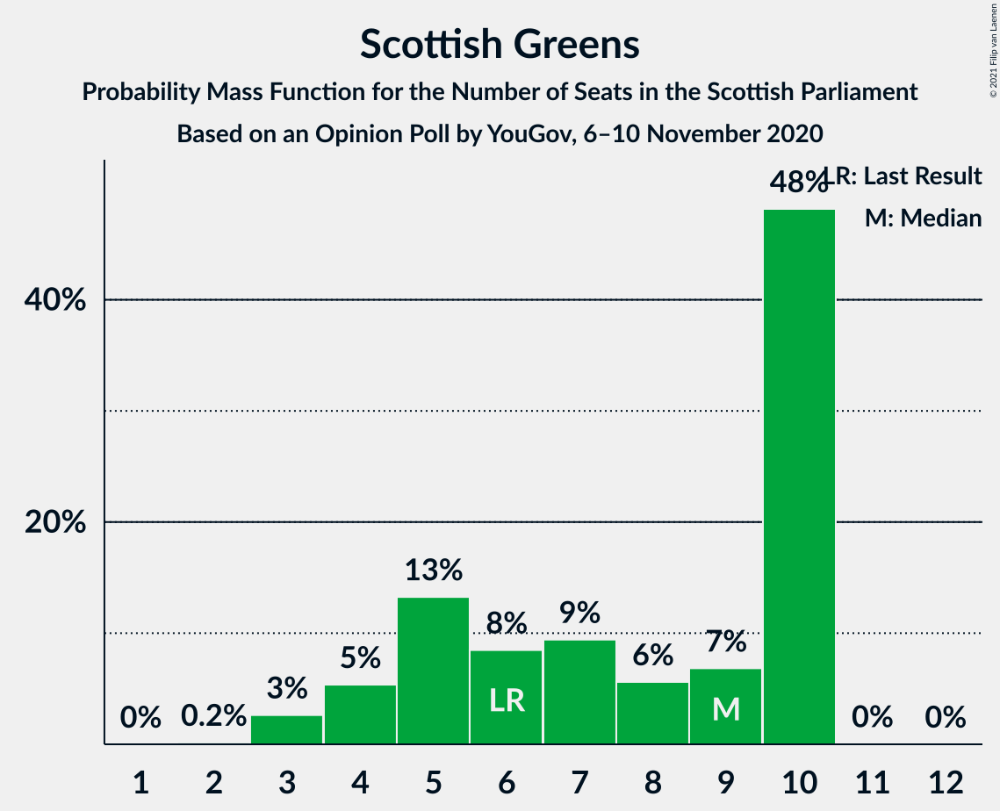

# Opinion Poll by YouGov, 6–10 November 2020

<a href="#voting-intentions">Voting Intentions</a> | <a href="#seats">Seats</a> | <a href="#coalitions">Coalitions</a> | <a href="#technical-information">Technical Information</a>

## Voting Intentions

### Confidence Intervals

| Party | Last Result | Poll Result | 80% Confidence Interval | 90% Confidence Interval | 95% Confidence Interval | 99% Confidence Interval |
|:-----:|:-----------:|:-----------:|:-----------------------:|:-----------------------:|:-----------------------:|:-----------------------:|
| Scottish National Party | 41.7% | 47.0% | 45.1–49.0% |44.5–49.5% |44.1–50.0% |43.1–50.9% |
| Scottish Conservative & Unionist Party | 22.9% | 20.0% | 18.5–21.6% |18.1–22.1% |17.7–22.5% |17.1–23.3% |
| Scottish Labour | 19.1% | 13.0% | 11.8–14.4% |11.5–14.8% |11.2–15.2% |10.6–15.9% |
| Scottish Greens | 6.6% | 7.0% | 6.1–8.1% |5.8–8.4% |5.6–8.7% |5.2–9.2% |
| Scottish Liberal Democrats | 5.2% | 6.0% | 5.1–7.0% |4.9–7.3% |4.7–7.5% |4.3–8.1% |
| Scottish Socialist Party | 0.5% | 3.0% | 2.5–3.8% |2.3–4.0% |2.2–4.2% |1.9–4.6% |

*Note:* The poll result column reflects the actual value used in the calculations. Published results may vary slightly, and in addition be rounded to fewer digits.

## Seats

### Confidence Intervals

| Party | Last Result | Median | 80% Confidence Interval | 90% Confidence Interval | 95% Confidence Interval | 99% Confidence Interval |
|:-----:|:-----------:|:------:|:-----------------------:|:-----------------------:|:-----------------------:|:-----------------------:|
| <a href="#scottish-national-party">Scottish National Party</a> | 63 | 73 | 71–75 |70–75 |70–76 |69–78 |
| <a href="#scottish-conservative-&-unionist-party">Scottish Conservative & Unionist Party</a> | 31 | 25 | 24–30 |24–31 |23–31 |22–32 |
| <a href="#scottish-labour">Scottish Labour</a> | 24 | 17 | 15–17 |14–18 |13–19 |12–21 |
| <a href="#scottish-greens">Scottish Greens</a> | 6 | 9 | 5–10 |3–10 |3–10 |3–10 |
| <a href="#scottish-liberal-democrats">Scottish Liberal Democrats</a> | 5 | 5 | 5–7 |5–8 |4–8 |3–9 |
| <a href="#scottish-socialist-party">Scottish Socialist Party</a> | 0 | 0 | 0 |0 |0 |0 |

### Scottish National Party

*For a full overview of the results for this party, see the [Scottish National Party](party-scottishnationalparty.html) page.*

| Number of Seats | Probability | Accumulated | Special Marks |
|:---------------:|:-----------:|:-----------:|:-------------:|
| 63 | 0% | 100% | Last Result |
| 64 | 0% | 100% |  |
| 65 | 0% | 100% | Majority |
| 66 | 0% | 100% |  |
| 67 | 0% | 100% |  |
| 68 | 0.3% | 99.9% |  |
| 69 | 1.0% | 99.7% |  |
| 70 | 4% | 98.6% |  |
| 71 | 9% | 95% |  |
| 72 | 27% | 86% |  |
| 73 | 27% | 59% | Median |
| 74 | 10% | 31% |  |
| 75 | 17% | 21% |  |
| 76 | 3% | 4% |  |
| 77 | 1.1% | 2% |  |
| 78 | 0.5% | 0.7% |  |
| 79 | 0.2% | 0.2% |  |
| 80 | 0% | 0.1% |  |
| 81 | 0% | 0% |  |

### Scottish Conservative & Unionist Party

*For a full overview of the results for this party, see the [Scottish Conservative & Unionist Party](party-scottishconservativeunionistparty.html) page.*

| Number of Seats | Probability | Accumulated | Special Marks |
|:---------------:|:-----------:|:-----------:|:-------------:|
| 22 | 0.7% | 100% |  |
| 23 | 2% | 99.2% |  |
| 24 | 16% | 97% |  |
| 25 | 34% | 81% | Median |
| 26 | 12% | 47% |  |
| 27 | 13% | 36% |  |
| 28 | 5% | 22% |  |
| 29 | 5% | 17% |  |
| 30 | 4% | 12% |  |
| 31 | 7% | 8% | Last Result |
| 32 | 0.8% | 0.9% |  |
| 33 | 0% | 0% |  |

### Scottish Labour

*For a full overview of the results for this party, see the [Scottish Labour](party-scottishlabour.html) page.*

| Number of Seats | Probability | Accumulated | Special Marks |
|:---------------:|:-----------:|:-----------:|:-------------:|
| 12 | 0.6% | 100% |  |
| 13 | 4% | 99.4% |  |
| 14 | 3% | 96% |  |
| 15 | 13% | 93% |  |
| 16 | 19% | 80% |  |
| 17 | 54% | 62% | Median |
| 18 | 4% | 7% |  |
| 19 | 1.4% | 3% |  |
| 20 | 0.5% | 1.4% |  |
| 21 | 0.4% | 0.9% |  |
| 22 | 0.5% | 0.5% |  |
| 23 | 0% | 0% |  |
| 24 | 0% | 0% | Last Result |

### Scottish Greens

*For a full overview of the results for this party, see the [Scottish Greens](party-scottishgreens.html) page.*

| Number of Seats | Probability | Accumulated | Special Marks |
|:---------------:|:-----------:|:-----------:|:-------------:|
| 2 | 0.1% | 100% |  |
| 3 | 5% | 99.9% |  |
| 4 | 3% | 94% |  |
| 5 | 12% | 92% |  |
| 6 | 8% | 79% | Last Result |
| 7 | 11% | 71% |  |
| 8 | 7% | 60% |  |
| 9 | 5% | 53% | Median |
| 10 | 49% | 49% |  |
| 11 | 0.1% | 0.1% |  |
| 12 | 0% | 0% |  |

### Scottish Liberal Democrats

*For a full overview of the results for this party, see the [Scottish Liberal Democrats](party-scottishliberaldemocrats.html) page.*

| Number of Seats | Probability | Accumulated | Special Marks |
|:---------------:|:-----------:|:-----------:|:-------------:|
| 2 | 0.3% | 100% |  |
| 3 | 0.3% | 99.7% |  |
| 4 | 3% | 99.4% |  |
| 5 | 71% | 96% | Last Result, Median |
| 6 | 14% | 25% |  |
| 7 | 4% | 11% |  |
| 8 | 6% | 7% |  |
| 9 | 0.8% | 0.9% |  |
| 10 | 0% | 0.1% |  |
| 11 | 0% | 0% |  |

### Scottish Socialist Party

*For a full overview of the results for this party, see the [Scottish Socialist Party](party-scottishsocialistparty.html) page.*

| Number of Seats | Probability | Accumulated | Special Marks |
|:---------------:|:-----------:|:-----------:|:-------------:|
| 0 | 100% | 100% | Last Result, Median |

## Coalitions

### Confidence Intervals

| Coalition | Last Result | Median | Majority? | 80% Confidence Interval | 90% Confidence Interval | 95% Confidence Interval | 99% Confidence Interval |
|:---------:|:-----------:|:------:|:---------:|:-----------------------:|:-----------------------:|:-----------------------:|:-----------------------:|
| Scottish National Party – Scottish Greens | 69 | 82 | 100% | 78–83 | 76–83 | 76–84 | 75–85 |
| Scottish National Party | 63 | 73 | 100% | 71–75 | 70–75 | 70–76 | 69–78 |
| Scottish Conservative & Unionist Party – Scottish Labour – Scottish Liberal Democrats | 60 | 47 | 0% | 46–51 | 46–53 | 45–53 | 44–54 |
| Scottish Conservative & Unionist Party – Scottish Labour | 55 | 42 | 0% | 41–46 | 40–46 | 40–48 | 38–48 |
| Scottish Conservative & Unionist Party – Scottish Liberal Democrats | 36 | 31 | 0% | 29–36 | 29–36 | 29–37 | 28–38 |
| Scottish Labour – Scottish Greens – Scottish Liberal Democrats | 35 | 30 | 0% | 25–33 | 25–33 | 25–33 | 24–34 |
| Scottish Labour – Scottish Liberal Democrats | 29 | 22 | 0% | 20–24 | 19–24 | 18–25 | 17–27 |

### Scottish National Party – Scottish Greens

| Number of Seats | Probability | Accumulated | Special Marks |
|:---------------:|:-----------:|:-----------:|:-------------:|
| 69 | 0% | 100% | Last Result |
| 70 | 0% | 100% |  |
| 71 | 0% | 100% |  |
| 72 | 0% | 100% |  |
| 73 | 0% | 100% |  |
| 74 | 0.2% | 100% |  |
| 75 | 2% | 99.8% |  |
| 76 | 3% | 98% |  |
| 77 | 3% | 95% |  |
| 78 | 10% | 92% |  |
| 79 | 6% | 82% |  |
| 80 | 7% | 76% |  |
| 81 | 14% | 70% |  |
| 82 | 34% | 56% | Median |
| 83 | 18% | 22% |  |
| 84 | 4% | 4% |  |
| 85 | 0.4% | 0.7% |  |
| 86 | 0.2% | 0.3% |  |
| 87 | 0.1% | 0.1% |  |
| 88 | 0% | 0% |  |

### Scottish National Party

| Number of Seats | Probability | Accumulated | Special Marks |
|:---------------:|:-----------:|:-----------:|:-------------:|
| 63 | 0% | 100% | Last Result |
| 64 | 0% | 100% |  |
| 65 | 0% | 100% | Majority |
| 66 | 0% | 100% |  |
| 67 | 0% | 100% |  |
| 68 | 0.3% | 99.9% |  |
| 69 | 1.0% | 99.7% |  |
| 70 | 4% | 98.6% |  |
| 71 | 9% | 95% |  |
| 72 | 27% | 86% |  |
| 73 | 27% | 59% | Median |
| 74 | 10% | 31% |  |
| 75 | 17% | 21% |  |
| 76 | 3% | 4% |  |
| 77 | 1.1% | 2% |  |
| 78 | 0.5% | 0.7% |  |
| 79 | 0.2% | 0.2% |  |
| 80 | 0% | 0.1% |  |
| 81 | 0% | 0% |  |

### Scottish Conservative & Unionist Party – Scottish Labour – Scottish Liberal Democrats

| Number of Seats | Probability | Accumulated | Special Marks |
|:---------------:|:-----------:|:-----------:|:-------------:|
| 42 | 0.1% | 100% |  |
| 43 | 0.2% | 99.9% |  |
| 44 | 0.4% | 99.7% |  |
| 45 | 4% | 99.3% |  |
| 46 | 18% | 96% |  |
| 47 | 34% | 78% | Median |
| 48 | 14% | 44% |  |
| 49 | 7% | 30% |  |
| 50 | 6% | 24% |  |
| 51 | 10% | 18% |  |
| 52 | 3% | 8% |  |
| 53 | 3% | 5% |  |
| 54 | 2% | 2% |  |
| 55 | 0.2% | 0.2% |  |
| 56 | 0% | 0% |  |
| 57 | 0% | 0% |  |
| 58 | 0% | 0% |  |
| 59 | 0% | 0% |  |
| 60 | 0% | 0% | Last Result |

### Scottish Conservative & Unionist Party – Scottish Labour

| Number of Seats | Probability | Accumulated | Special Marks |
|:---------------:|:-----------:|:-----------:|:-------------:|
| 36 | 0.1% | 100% |  |
| 37 | 0.1% | 99.9% |  |
| 38 | 0.5% | 99.8% |  |
| 39 | 1.2% | 99.3% |  |
| 40 | 5% | 98% |  |
| 41 | 22% | 93% |  |
| 42 | 36% | 71% | Median |
| 43 | 10% | 35% |  |
| 44 | 4% | 25% |  |
| 45 | 8% | 21% |  |
| 46 | 9% | 14% |  |
| 47 | 2% | 5% |  |
| 48 | 2% | 3% |  |
| 49 | 0.3% | 0.4% |  |
| 50 | 0.1% | 0.1% |  |
| 51 | 0% | 0% |  |
| 52 | 0% | 0% |  |
| 53 | 0% | 0% |  |
| 54 | 0% | 0% |  |
| 55 | 0% | 0% | Last Result |

### Scottish Conservative & Unionist Party – Scottish Liberal Democrats

| Number of Seats | Probability | Accumulated | Special Marks |
|:---------------:|:-----------:|:-----------:|:-------------:|
| 27 | 0.2% | 100% |  |
| 28 | 2% | 99.8% |  |
| 29 | 15% | 98% |  |
| 30 | 24% | 83% | Median |
| 31 | 16% | 59% |  |
| 32 | 15% | 43% |  |
| 33 | 7% | 28% |  |
| 34 | 7% | 21% |  |
| 35 | 4% | 14% |  |
| 36 | 7% | 10% | Last Result |
| 37 | 2% | 3% |  |
| 38 | 1.0% | 1.0% |  |
| 39 | 0% | 0.1% |  |
| 40 | 0% | 0% |  |

### Scottish Labour – Scottish Greens – Scottish Liberal Democrats

| Number of Seats | Probability | Accumulated | Special Marks |
|:---------------:|:-----------:|:-----------:|:-------------:|
| 22 | 0.1% | 100% |  |
| 23 | 0.2% | 99.9% |  |
| 24 | 0.4% | 99.7% |  |
| 25 | 10% | 99.3% |  |
| 26 | 3% | 89% |  |
| 27 | 8% | 86% |  |
| 28 | 9% | 78% |  |
| 29 | 11% | 69% |  |
| 30 | 10% | 58% |  |
| 31 | 7% | 48% | Median |
| 32 | 28% | 41% |  |
| 33 | 11% | 12% |  |
| 34 | 0.8% | 1.2% |  |
| 35 | 0.3% | 0.4% | Last Result |
| 36 | 0.1% | 0.1% |  |
| 37 | 0% | 0% |  |

### Scottish Labour – Scottish Liberal Democrats

| Number of Seats | Probability | Accumulated | Special Marks |
|:---------------:|:-----------:|:-----------:|:-------------:|
| 16 | 0.1% | 100% |  |
| 17 | 0.6% | 99.9% |  |
| 18 | 3% | 99.4% |  |
| 19 | 3% | 96% |  |
| 20 | 12% | 93% |  |
| 21 | 12% | 81% |  |
| 22 | 45% | 70% | Median |
| 23 | 14% | 25% |  |
| 24 | 6% | 10% |  |
| 25 | 2% | 4% |  |
| 26 | 1.3% | 2% |  |
| 27 | 0.8% | 1.1% |  |
| 28 | 0.2% | 0.3% |  |
| 29 | 0.1% | 0.1% | Last Result |
| 30 | 0% | 0% |  |

## Technical Information

### Opinion Poll

+ **Polling firm:** YouGov
+ **Commissioner(s):** —
+ **Fieldwork period:** 6–10 November 2020

### Calculations

+ **Sample size:** 1089
+ **Simulations done:** 131,072
+ **Error estimate:** 0.67%

