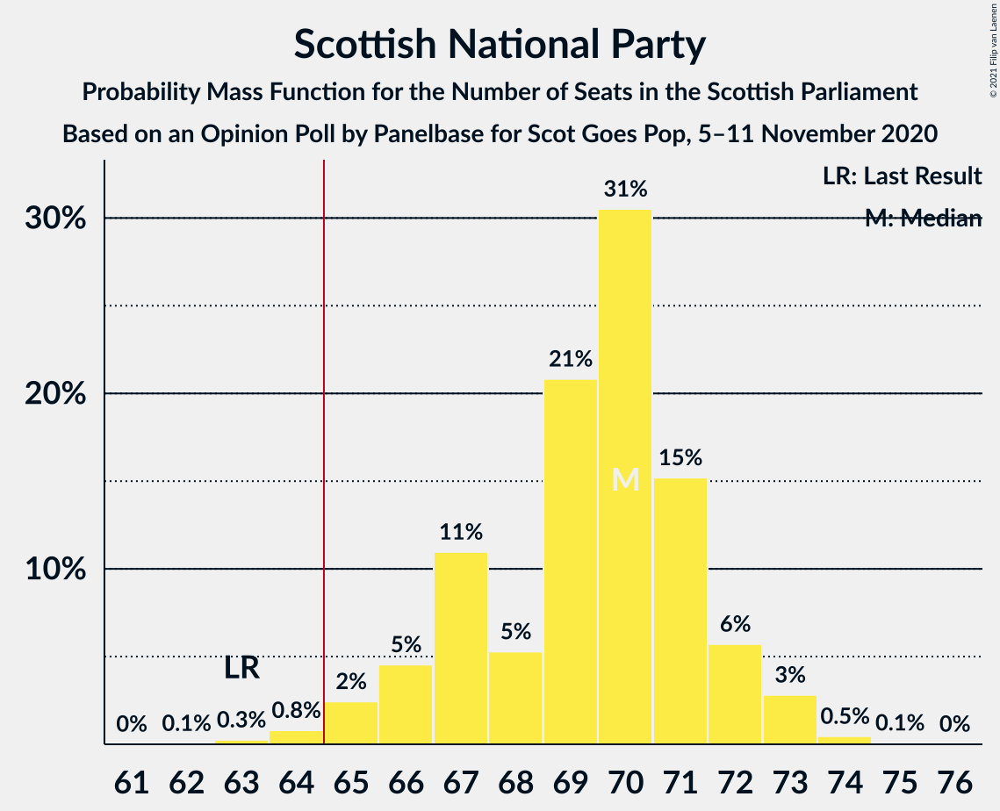
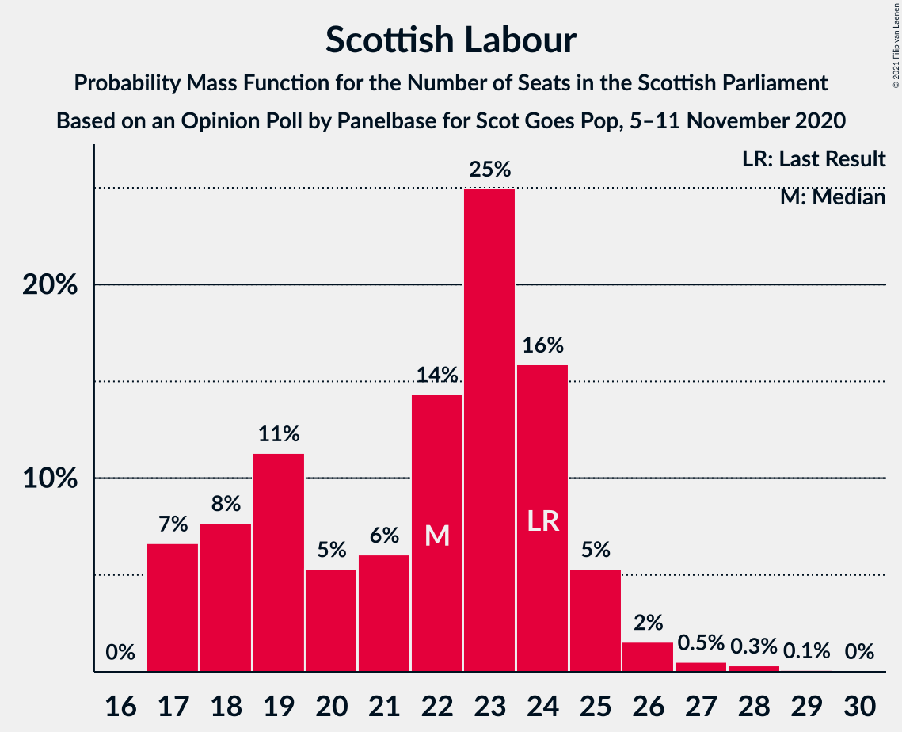

# Opinion Poll by Panelbase for Scot Goes Pop, 5–11 November 2020

<a href="#voting-intentions">Voting Intentions</a> | <a href="#seats">Seats</a> | <a href="#coalitions">Coalitions</a> | <a href="#technical-information">Technical Information</a>

## Voting Intentions

### Confidence Intervals

| Party | Last Result | Poll Result | 80% Confidence Interval | 90% Confidence Interval | 95% Confidence Interval | 99% Confidence Interval |
|:-----:|:-----------:|:-----------:|:-----------------------:|:-----------------------:|:-----------------------:|:-----------------------:|
| Scottish National Party | 41.7% | 45.6% | 43.6–47.6% |43.0–48.2% |42.5–48.7% |41.6–49.6% |
| Scottish Conservative & Unionist Party | 22.9% | 19.8% | 18.3–21.5% |17.8–21.9% |17.5–22.4% |16.8–23.2% |
| Scottish Labour | 19.1% | 17.8% | 16.4–19.5% |16.0–19.9% |15.6–20.3% |14.9–21.1% |
| Scottish Greens | 6.6% | 7.9% | 7.0–9.1% |6.7–9.5% |6.4–9.8% |6.0–10.4% |
| Scottish Liberal Democrats | 5.2% | 6.0% | 5.1–7.0% |4.9–7.3% |4.7–7.6% |4.3–8.2% |

*Note:* The poll result column reflects the actual value used in the calculations. Published results may vary slightly, and in addition be rounded to fewer digits.

## Seats

### Confidence Intervals

| Party | Last Result | Median | 80% Confidence Interval | 90% Confidence Interval | 95% Confidence Interval | 99% Confidence Interval |
|:-----:|:-----------:|:------:|:-----------------------:|:-----------------------:|:-----------------------:|:-----------------------:|
| <a href="#scottish-national-party">Scottish National Party</a> | 63 | 70 | 67–72 |66–73 |66–73 |66–73 |
| <a href="#scottish-conservative-&-unionist-party">Scottish Conservative & Unionist Party</a> | 31 | 24 | 21–26 |21–26 |20–28 |19–30 |
| <a href="#scottish-labour">Scottish Labour</a> | 24 | 22 | 18–24 |17–24 |17–24 |17–26 |
| <a href="#scottish-greens">Scottish Greens</a> | 6 | 10 | 5–10 |4–10 |4–10 |3–11 |
| <a href="#scottish-liberal-democrats">Scottish Liberal Democrats</a> | 5 | 5 | 4–6 |3–6 |3–7 |2–8 |

### Scottish National Party

*For a full overview of the results for this party, see the [Scottish National Party](party-scottishnationalparty.html) page.*

| Number of Seats | Probability | Accumulated | Special Marks |
|:---------------:|:-----------:|:-----------:|:-------------:|
| 63 | 0% | 100% | Last Result |
| 64 | 0.1% | 99.9% |  |
| 65 | 0.3% | 99.9% | Majority |
| 66 | 6% | 99.6% |  |
| 67 | 6% | 93% |  |
| 68 | 6% | 87% |  |
| 69 | 8% | 82% |  |
| 70 | 27% | 74% | Median |
| 71 | 29% | 47% |  |
| 72 | 12% | 18% |  |
| 73 | 5% | 6% |  |
| 74 | 0.4% | 0.5% |  |
| 75 | 0.1% | 0.1% |  |
| 76 | 0% | 0% |  |

### Scottish Conservative & Unionist Party

*For a full overview of the results for this party, see the [Scottish Conservative & Unionist Party](party-scottishconservativeunionistparty.html) page.*

| Number of Seats | Probability | Accumulated | Special Marks |
|:---------------:|:-----------:|:-----------:|:-------------:|
| 18 | 0.2% | 100% |  |
| 19 | 1.1% | 99.8% |  |
| 20 | 2% | 98.7% |  |
| 21 | 13% | 97% |  |
| 22 | 8% | 84% |  |
| 23 | 13% | 77% |  |
| 24 | 24% | 64% | Median |
| 25 | 27% | 40% |  |
| 26 | 9% | 13% |  |
| 27 | 2% | 4% |  |
| 28 | 0.8% | 3% |  |
| 29 | 0.8% | 2% |  |
| 30 | 0.8% | 1.1% |  |
| 31 | 0.2% | 0.3% | Last Result |
| 32 | 0.1% | 0.1% |  |
| 33 | 0% | 0% |  |

### Scottish Labour

*For a full overview of the results for this party, see the [Scottish Labour](party-scottishlabour.html) page.*

| Number of Seats | Probability | Accumulated | Special Marks |
|:---------------:|:-----------:|:-----------:|:-------------:|
| 17 | 6% | 100% |  |
| 18 | 5% | 94% |  |
| 19 | 9% | 89% |  |
| 20 | 8% | 80% |  |
| 21 | 7% | 72% |  |
| 22 | 33% | 65% | Median |
| 23 | 18% | 32% |  |
| 24 | 12% | 14% | Last Result |
| 25 | 1.3% | 2% |  |
| 26 | 0.8% | 1.2% |  |
| 27 | 0.3% | 0.4% |  |
| 28 | 0.1% | 0.1% |  |
| 29 | 0% | 0% |  |

### Scottish Greens

*For a full overview of the results for this party, see the [Scottish Greens](party-scottishgreens.html) page.*

| Number of Seats | Probability | Accumulated | Special Marks |
|:---------------:|:-----------:|:-----------:|:-------------:|
| 3 | 2% | 100% |  |
| 4 | 4% | 98% |  |
| 5 | 11% | 95% |  |
| 6 | 3% | 84% | Last Result |
| 7 | 8% | 82% |  |
| 8 | 5% | 74% |  |
| 9 | 9% | 68% |  |
| 10 | 58% | 59% | Median |
| 11 | 1.5% | 2% |  |
| 12 | 0.1% | 0.1% |  |
| 13 | 0% | 0% |  |

### Scottish Liberal Democrats

*For a full overview of the results for this party, see the [Scottish Liberal Democrats](party-scottishliberaldemocrats.html) page.*

| Number of Seats | Probability | Accumulated | Special Marks |
|:---------------:|:-----------:|:-----------:|:-------------:|
| 1 | 0.1% | 100% |  |
| 2 | 0.6% | 99.9% |  |
| 3 | 6% | 99.3% |  |
| 4 | 23% | 94% |  |
| 5 | 43% | 71% | Last Result, Median |
| 6 | 24% | 28% |  |
| 7 | 3% | 4% |  |
| 8 | 1.3% | 1.5% |  |
| 9 | 0.2% | 0.2% |  |
| 10 | 0% | 0% |  |

## Coalitions

### Confidence Intervals

| Coalition | Last Result | Median | Majority? | 80% Confidence Interval | 90% Confidence Interval | 95% Confidence Interval | 99% Confidence Interval |
|:---------:|:-----------:|:------:|:---------:|:-----------------------:|:-----------------------:|:-----------------------:|:-----------------------:|
| Scottish National Party – Scottish Greens | 69 | 79 | 100% | 75–81 | 75–82 | 74–82 | 72–83 |
| Scottish National Party | 63 | 70 | 99.9% | 67–72 | 66–73 | 66–73 | 66–73 |
| Scottish Conservative & Unionist Party – Scottish Labour – Scottish Liberal Democrats | 60 | 50 | 0% | 48–54 | 47–54 | 47–55 | 46–57 |
| Scottish Conservative & Unionist Party – Scottish Labour | 55 | 45 | 0% | 43–49 | 42–49 | 42–50 | 41–52 |
| Scottish Labour – Scottish Greens – Scottish Liberal Democrats | 35 | 35 | 0% | 32–38 | 32–38 | 32–39 | 30–40 |
| Scottish Conservative & Unionist Party – Scottish Liberal Democrats | 36 | 29 | 0% | 26–31 | 26–32 | 25–33 | 24–35 |
| Scottish Labour – Scottish Liberal Democrats | 29 | 27 | 0% | 23–29 | 23–29 | 22–30 | 22–32 |

### Scottish National Party – Scottish Greens

| Number of Seats | Probability | Accumulated | Special Marks |
|:---------------:|:-----------:|:-----------:|:-------------:|
| 69 | 0% | 100% | Last Result |
| 70 | 0.2% | 100% |  |
| 71 | 0.2% | 99.8% |  |
| 72 | 0.8% | 99.6% |  |
| 73 | 1.2% | 98.8% |  |
| 74 | 2% | 98% |  |
| 75 | 7% | 96% |  |
| 76 | 10% | 89% |  |
| 77 | 10% | 79% |  |
| 78 | 11% | 69% |  |
| 79 | 12% | 58% |  |
| 80 | 17% | 46% | Median |
| 81 | 22% | 29% |  |
| 82 | 4% | 6% |  |
| 83 | 2% | 2% |  |
| 84 | 0.1% | 0.1% |  |
| 85 | 0% | 0% |  |

### Scottish National Party

| Number of Seats | Probability | Accumulated | Special Marks |
|:---------------:|:-----------:|:-----------:|:-------------:|
| 63 | 0% | 100% | Last Result |
| 64 | 0.1% | 99.9% |  |
| 65 | 0.3% | 99.9% | Majority |
| 66 | 6% | 99.6% |  |
| 67 | 6% | 93% |  |
| 68 | 6% | 87% |  |
| 69 | 8% | 82% |  |
| 70 | 27% | 74% | Median |
| 71 | 29% | 47% |  |
| 72 | 12% | 18% |  |
| 73 | 5% | 6% |  |
| 74 | 0.4% | 0.5% |  |
| 75 | 0.1% | 0.1% |  |
| 76 | 0% | 0% |  |

### Scottish Conservative & Unionist Party – Scottish Labour – Scottish Liberal Democrats

| Number of Seats | Probability | Accumulated | Special Marks |
|:---------------:|:-----------:|:-----------:|:-------------:|
| 45 | 0.1% | 100% |  |
| 46 | 2% | 99.9% |  |
| 47 | 4% | 98% |  |
| 48 | 22% | 94% |  |
| 49 | 17% | 71% |  |
| 50 | 12% | 54% |  |
| 51 | 11% | 42% | Median |
| 52 | 10% | 31% |  |
| 53 | 10% | 21% |  |
| 54 | 7% | 11% |  |
| 55 | 2% | 4% |  |
| 56 | 1.2% | 2% |  |
| 57 | 0.8% | 1.2% |  |
| 58 | 0.2% | 0.4% |  |
| 59 | 0.2% | 0.2% |  |
| 60 | 0% | 0% | Last Result |

### Scottish Conservative & Unionist Party – Scottish Labour

| Number of Seats | Probability | Accumulated | Special Marks |
|:---------------:|:-----------:|:-----------:|:-------------:|
| 39 | 0.1% | 100% |  |
| 40 | 0.3% | 99.9% |  |
| 41 | 2% | 99.7% |  |
| 42 | 6% | 98% |  |
| 43 | 20% | 92% |  |
| 44 | 16% | 72% |  |
| 45 | 11% | 56% |  |
| 46 | 15% | 45% | Median |
| 47 | 10% | 31% |  |
| 48 | 9% | 20% |  |
| 49 | 8% | 11% |  |
| 50 | 2% | 4% |  |
| 51 | 1.0% | 2% |  |
| 52 | 0.7% | 1.1% |  |
| 53 | 0.2% | 0.4% |  |
| 54 | 0.1% | 0.2% |  |
| 55 | 0% | 0% | Last Result |

### Scottish Labour – Scottish Greens – Scottish Liberal Democrats

| Number of Seats | Probability | Accumulated | Special Marks |
|:---------------:|:-----------:|:-----------:|:-------------:|
| 28 | 0% | 100% |  |
| 29 | 0.2% | 99.9% |  |
| 30 | 0.3% | 99.8% |  |
| 31 | 0.9% | 99.4% |  |
| 32 | 14% | 98.5% |  |
| 33 | 11% | 85% |  |
| 34 | 15% | 74% |  |
| 35 | 13% | 58% | Last Result |
| 36 | 16% | 45% |  |
| 37 | 12% | 29% | Median |
| 38 | 13% | 16% |  |
| 39 | 2% | 3% |  |
| 40 | 0.8% | 1.1% |  |
| 41 | 0.2% | 0.3% |  |
| 42 | 0% | 0.1% |  |
| 43 | 0% | 0% |  |

### Scottish Conservative & Unionist Party – Scottish Liberal Democrats

| Number of Seats | Probability | Accumulated | Special Marks |
|:---------------:|:-----------:|:-----------:|:-------------:|
| 23 | 0.1% | 100% |  |
| 24 | 0.7% | 99.9% |  |
| 25 | 2% | 99.2% |  |
| 26 | 18% | 97% |  |
| 27 | 9% | 80% |  |
| 28 | 11% | 71% |  |
| 29 | 22% | 60% | Median |
| 30 | 19% | 39% |  |
| 31 | 11% | 19% |  |
| 32 | 5% | 9% |  |
| 33 | 2% | 4% |  |
| 34 | 1.0% | 2% |  |
| 35 | 0.9% | 1.2% |  |
| 36 | 0.2% | 0.3% | Last Result |
| 37 | 0% | 0% |  |

### Scottish Labour – Scottish Liberal Democrats

| Number of Seats | Probability | Accumulated | Special Marks |
|:---------------:|:-----------:|:-----------:|:-------------:|
| 21 | 0.1% | 100% |  |
| 22 | 5% | 99.9% |  |
| 23 | 6% | 95% |  |
| 24 | 10% | 89% |  |
| 25 | 9% | 79% |  |
| 26 | 12% | 70% |  |
| 27 | 23% | 58% | Median |
| 28 | 20% | 34% |  |
| 29 | 10% | 14% | Last Result |
| 30 | 3% | 4% |  |
| 31 | 1.0% | 2% |  |
| 32 | 0.4% | 0.5% |  |
| 33 | 0.1% | 0.2% |  |
| 34 | 0% | 0.1% |  |
| 35 | 0% | 0% |  |

## Technical Information

### Opinion Poll

+ **Polling firm:** Panelbase
+ **Commissioner(s):** Scot Goes Pop
+ **Fieldwork period:** 5–11 November 2020

### Calculations

+ **Sample size:** 1020
+ **Simulations done:** 131,072
+ **Error estimate:** 0.66%

