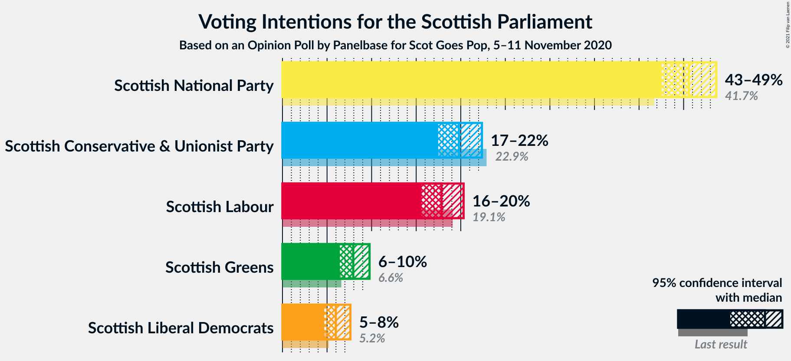
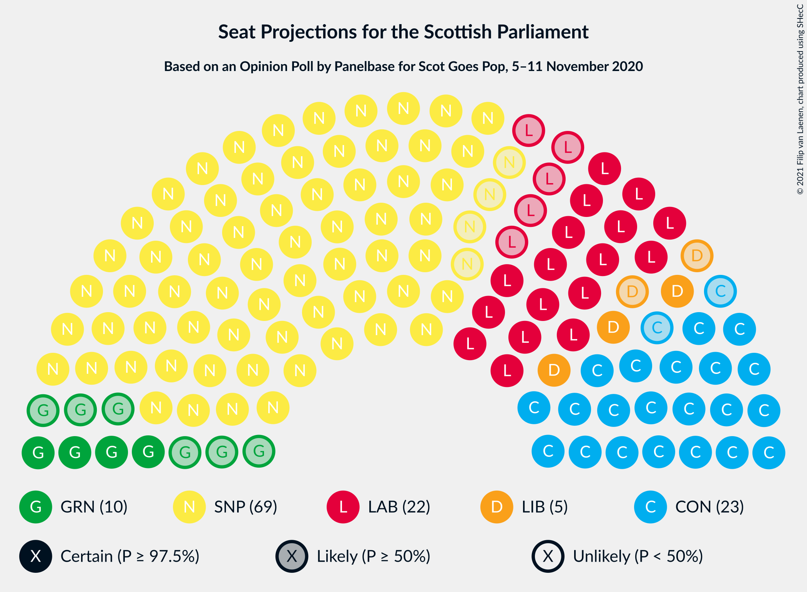
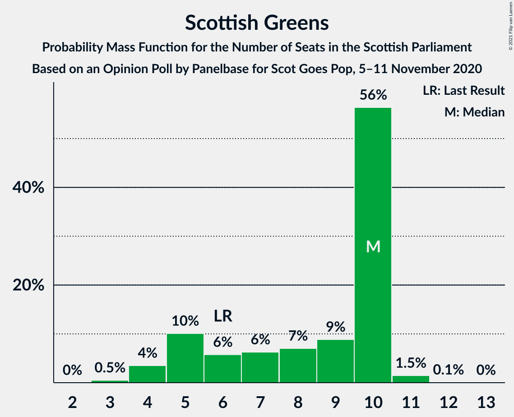
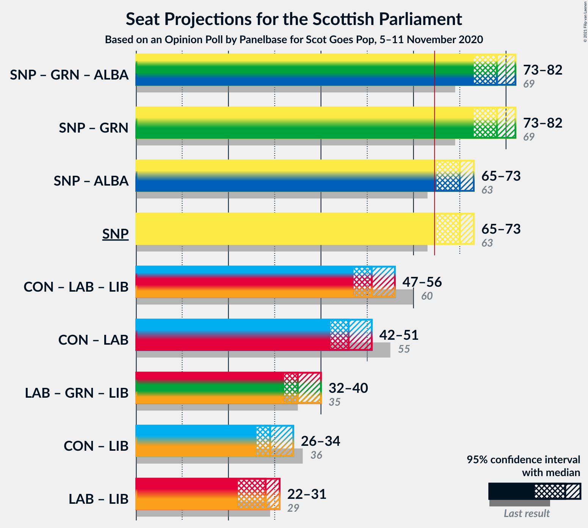
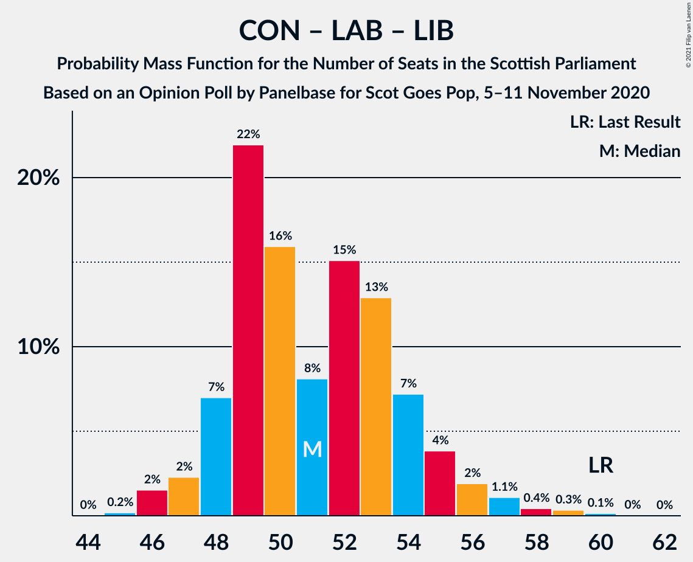

# Opinion Poll by Panelbase for Scot Goes Pop, 5–11 November 2020

<a href="#voting-intentions">Voting Intentions</a> | <a href="#seats">Seats</a> | <a href="#coalitions">Coalitions</a> | <a href="#technical-information">Technical Information</a>

## Voting Intentions

### Confidence Intervals

| Party | Last Result | Poll Result | 80% Confidence Interval | 90% Confidence Interval | 95% Confidence Interval | 99% Confidence Interval |
|:-----:|:-----------:|:-----------:|:-----------------------:|:-----------------------:|:-----------------------:|:-----------------------:|
| Scottish National Party | 41.7% | 45.6% | 43.6–47.6% |43.0–48.2% |42.5–48.7% |41.6–49.6% |
| Scottish Conservative & Unionist Party | 22.9% | 19.8% | 18.3–21.5% |17.8–21.9% |17.5–22.4% |16.8–23.2% |
| Scottish Labour | 19.1% | 17.8% | 16.4–19.5% |16.0–19.9% |15.6–20.3% |14.9–21.1% |
| Scottish Greens | 6.6% | 7.9% | 7.0–9.1% |6.7–9.5% |6.4–9.8% |6.0–10.4% |
| Scottish Liberal Democrats | 5.2% | 6.0% | 5.1–7.0% |4.9–7.3% |4.7–7.6% |4.3–8.2% |

*Note:* The poll result column reflects the actual value used in the calculations. Published results may vary slightly, and in addition be rounded to fewer digits.

## Seats

### Confidence Intervals

| Party | Last Result | Median | 80% Confidence Interval | 90% Confidence Interval | 95% Confidence Interval | 99% Confidence Interval |
|:-----:|:-----------:|:------:|:-----------------------:|:-----------------------:|:-----------------------:|:-----------------------:|
| <a href="#scottish-national-party">Scottish National Party</a> | 63 | 70 | 67–71 |66–72 |65–73 |64–74 |
| <a href="#scottish-conservative-&-unionist-party">Scottish Conservative & Unionist Party</a> | 31 | 24 | 21–26 |21–27 |21–28 |19–31 |
| <a href="#scottish-labour">Scottish Labour</a> | 24 | 22 | 18–24 |17–25 |17–26 |17–27 |
| <a href="#scottish-greens">Scottish Greens</a> | 6 | 10 | 5–10 |5–10 |4–10 |3–11 |
| <a href="#scottish-liberal-democrats">Scottish Liberal Democrats</a> | 5 | 5 | 5–6 |4–6 |3–7 |3–8 |

### Scottish National Party

*For a full overview of the results for this party, see the [Scottish National Party](party-scottishnationalparty.html) page.*

| Number of Seats | Probability | Accumulated | Special Marks |
|:---------------:|:-----------:|:-----------:|:-------------:|
| 62 | 0.1% | 100% |  |
| 63 | 0.3% | 99.9% | Last Result |
| 64 | 0.8% | 99.7% |  |
| 65 | 2% | 98.9% | Majority |
| 66 | 5% | 96% |  |
| 67 | 11% | 92% |  |
| 68 | 5% | 81% |  |
| 69 | 21% | 76% |  |
| 70 | 31% | 55% | Median |
| 71 | 15% | 24% |  |
| 72 | 6% | 9% |  |
| 73 | 3% | 3% |  |
| 74 | 0.5% | 0.6% |  |
| 75 | 0.1% | 0.1% |  |
| 76 | 0% | 0% |  |

### Scottish Conservative & Unionist Party

*For a full overview of the results for this party, see the [Scottish Conservative & Unionist Party](party-scottishconservativeunionistparty.html) page.*

| Number of Seats | Probability | Accumulated | Special Marks |
|:---------------:|:-----------:|:-----------:|:-------------:|
| 19 | 0.7% | 100% |  |
| 20 | 1.4% | 99.3% |  |
| 21 | 14% | 98% |  |
| 22 | 4% | 84% |  |
| 23 | 15% | 80% |  |
| 24 | 18% | 65% | Median |
| 25 | 23% | 47% |  |
| 26 | 18% | 24% |  |
| 27 | 3% | 6% |  |
| 28 | 1.2% | 3% |  |
| 29 | 0.9% | 2% |  |
| 30 | 0.6% | 1.2% |  |
| 31 | 0.4% | 0.7% | Last Result |
| 32 | 0.2% | 0.2% |  |
| 33 | 0% | 0% |  |

### Scottish Labour

*For a full overview of the results for this party, see the [Scottish Labour](party-scottishlabour.html) page.*

| Number of Seats | Probability | Accumulated | Special Marks |
|:---------------:|:-----------:|:-----------:|:-------------:|
| 17 | 7% | 100% |  |
| 18 | 8% | 93% |  |
| 19 | 11% | 86% |  |
| 20 | 5% | 74% |  |
| 21 | 6% | 69% |  |
| 22 | 14% | 63% | Median |
| 23 | 25% | 49% |  |
| 24 | 16% | 24% | Last Result |
| 25 | 5% | 8% |  |
| 26 | 2% | 3% |  |
| 27 | 0.5% | 1.0% |  |
| 28 | 0.3% | 0.5% |  |
| 29 | 0.1% | 0.1% |  |
| 30 | 0% | 0% |  |

### Scottish Greens

*For a full overview of the results for this party, see the [Scottish Greens](party-scottishgreens.html) page.*

| Number of Seats | Probability | Accumulated | Special Marks |
|:---------------:|:-----------:|:-----------:|:-------------:|
| 3 | 0.5% | 100% |  |
| 4 | 4% | 99.5% |  |
| 5 | 10% | 96% |  |
| 6 | 6% | 86% | Last Result |
| 7 | 6% | 80% |  |
| 8 | 7% | 74% |  |
| 9 | 9% | 67% |  |
| 10 | 56% | 58% | Median |
| 11 | 1.5% | 2% |  |
| 12 | 0.1% | 0.1% |  |
| 13 | 0% | 0% |  |

### Scottish Liberal Democrats

*For a full overview of the results for this party, see the [Scottish Liberal Democrats](party-scottishliberaldemocrats.html) page.*

| Number of Seats | Probability | Accumulated | Special Marks |
|:---------------:|:-----------:|:-----------:|:-------------:|
| 2 | 0.5% | 100% |  |
| 3 | 3% | 99.5% |  |
| 4 | 7% | 97% |  |
| 5 | 62% | 90% | Last Result, Median |
| 6 | 24% | 28% |  |
| 7 | 3% | 4% |  |
| 8 | 1.1% | 1.3% |  |
| 9 | 0.2% | 0.2% |  |
| 10 | 0% | 0% |  |

## Coalitions

### Confidence Intervals

| Coalition | Last Result | Median | Majority? | 80% Confidence Interval | 90% Confidence Interval | 95% Confidence Interval | 99% Confidence Interval |
|:---------:|:-----------:|:------:|:---------:|:-----------------------:|:-----------------------:|:-----------------------:|:-----------------------:|
| Scottish National Party – Scottish Greens | 69 | 78 | 100% | 75–81 | 74–81 | 73–82 | 70–83 |
| Scottish National Party | 63 | 70 | 98.9% | 67–71 | 66–72 | 65–73 | 64–74 |
| Scottish Conservative & Unionist Party – Scottish Labour – Scottish Liberal Democrats | 60 | 51 | 0% | 48–54 | 48–55 | 47–56 | 46–59 |
| Scottish Conservative & Unionist Party – Scottish Labour | 55 | 46 | 0% | 43–49 | 43–50 | 42–51 | 41–53 |
| Scottish Labour – Scottish Greens – Scottish Liberal Democrats | 35 | 35 | 0% | 32–39 | 32–39 | 32–40 | 30–41 |
| Scottish Conservative & Unionist Party – Scottish Liberal Democrats | 36 | 29 | 0% | 26–32 | 26–33 | 26–34 | 24–36 |
| Scottish Labour – Scottish Liberal Democrats | 29 | 28 | 0% | 23–29 | 22–30 | 22–31 | 22–33 |

### Scottish National Party – Scottish Greens

| Number of Seats | Probability | Accumulated | Special Marks |
|:---------------:|:-----------:|:-----------:|:-------------:|
| 69 | 0.1% | 100% | Last Result |
| 70 | 0.3% | 99.8% |  |
| 71 | 0.4% | 99.5% |  |
| 72 | 1.1% | 99.0% |  |
| 73 | 2% | 98% |  |
| 74 | 4% | 96% |  |
| 75 | 7% | 92% |  |
| 76 | 13% | 85% |  |
| 77 | 15% | 72% |  |
| 78 | 8% | 57% |  |
| 79 | 16% | 49% |  |
| 80 | 22% | 33% | Median |
| 81 | 7% | 11% |  |
| 82 | 2% | 4% |  |
| 83 | 2% | 2% |  |
| 84 | 0.2% | 0.2% |  |
| 85 | 0% | 0% |  |

### Scottish National Party

| Number of Seats | Probability | Accumulated | Special Marks |
|:---------------:|:-----------:|:-----------:|:-------------:|
| 62 | 0.1% | 100% |  |
| 63 | 0.3% | 99.9% | Last Result |
| 64 | 0.8% | 99.7% |  |
| 65 | 2% | 98.9% | Majority |
| 66 | 5% | 96% |  |
| 67 | 11% | 92% |  |
| 68 | 5% | 81% |  |
| 69 | 21% | 76% |  |
| 70 | 31% | 55% | Median |
| 71 | 15% | 24% |  |
| 72 | 6% | 9% |  |
| 73 | 3% | 3% |  |
| 74 | 0.5% | 0.6% |  |
| 75 | 0.1% | 0.1% |  |
| 76 | 0% | 0% |  |

### Scottish Conservative & Unionist Party – Scottish Labour – Scottish Liberal Democrats

| Number of Seats | Probability | Accumulated | Special Marks |
|:---------------:|:-----------:|:-----------:|:-------------:|
| 45 | 0.2% | 100% |  |
| 46 | 2% | 99.8% |  |
| 47 | 2% | 98% |  |
| 48 | 7% | 96% |  |
| 49 | 22% | 89% |  |
| 50 | 16% | 67% |  |
| 51 | 8% | 51% | Median |
| 52 | 15% | 43% |  |
| 53 | 13% | 28% |  |
| 54 | 7% | 15% |  |
| 55 | 4% | 8% |  |
| 56 | 2% | 4% |  |
| 57 | 1.1% | 2% |  |
| 58 | 0.4% | 1.0% |  |
| 59 | 0.3% | 0.5% |  |
| 60 | 0.1% | 0.2% | Last Result |
| 61 | 0% | 0% |  |

### Scottish Conservative & Unionist Party – Scottish Labour

| Number of Seats | Probability | Accumulated | Special Marks |
|:---------------:|:-----------:|:-----------:|:-------------:|
| 39 | 0.1% | 100% |  |
| 40 | 0.2% | 99.9% |  |
| 41 | 2% | 99.7% |  |
| 42 | 2% | 98% |  |
| 43 | 8% | 96% |  |
| 44 | 27% | 88% |  |
| 45 | 10% | 60% |  |
| 46 | 10% | 50% | Median |
| 47 | 14% | 40% |  |
| 48 | 13% | 25% |  |
| 49 | 6% | 12% |  |
| 50 | 3% | 7% |  |
| 51 | 2% | 3% |  |
| 52 | 0.9% | 2% |  |
| 53 | 0.4% | 0.8% |  |
| 54 | 0.3% | 0.4% |  |
| 55 | 0.1% | 0.1% | Last Result |
| 56 | 0% | 0% |  |

### Scottish Labour – Scottish Greens – Scottish Liberal Democrats

| Number of Seats | Probability | Accumulated | Special Marks |
|:---------------:|:-----------:|:-----------:|:-------------:|
| 28 | 0.1% | 100% |  |
| 29 | 0.2% | 99.9% |  |
| 30 | 0.3% | 99.7% |  |
| 31 | 1.3% | 99.5% |  |
| 32 | 10% | 98% |  |
| 33 | 13% | 88% |  |
| 34 | 16% | 75% |  |
| 35 | 12% | 58% | Last Result |
| 36 | 9% | 47% |  |
| 37 | 8% | 37% | Median |
| 38 | 13% | 29% |  |
| 39 | 12% | 16% |  |
| 40 | 3% | 4% |  |
| 41 | 0.8% | 1.2% |  |
| 42 | 0.2% | 0.3% |  |
| 43 | 0.1% | 0.1% |  |
| 44 | 0% | 0% |  |

### Scottish Conservative & Unionist Party – Scottish Liberal Democrats

| Number of Seats | Probability | Accumulated | Special Marks |
|:---------------:|:-----------:|:-----------:|:-------------:|
| 23 | 0.1% | 100% |  |
| 24 | 0.5% | 99.9% |  |
| 25 | 1.1% | 99.4% |  |
| 26 | 13% | 98% |  |
| 27 | 7% | 86% |  |
| 28 | 12% | 79% |  |
| 29 | 18% | 67% | Median |
| 30 | 18% | 49% |  |
| 31 | 18% | 31% |  |
| 32 | 7% | 13% |  |
| 33 | 3% | 5% |  |
| 34 | 1.4% | 3% |  |
| 35 | 0.7% | 1.5% |  |
| 36 | 0.5% | 0.8% | Last Result |
| 37 | 0.3% | 0.3% |  |
| 38 | 0% | 0% |  |

### Scottish Labour – Scottish Liberal Democrats

| Number of Seats | Probability | Accumulated | Special Marks |
|:---------------:|:-----------:|:-----------:|:-------------:|
| 21 | 0.3% | 100% |  |
| 22 | 5% | 99.6% |  |
| 23 | 7% | 95% |  |
| 24 | 10% | 88% |  |
| 25 | 8% | 78% |  |
| 26 | 7% | 70% |  |
| 27 | 12% | 63% | Median |
| 28 | 19% | 51% |  |
| 29 | 22% | 32% | Last Result |
| 30 | 6% | 10% |  |
| 31 | 2% | 4% |  |
| 32 | 0.8% | 2% |  |
| 33 | 0.4% | 0.7% |  |
| 34 | 0.1% | 0.2% |  |
| 35 | 0.1% | 0.1% |  |
| 36 | 0% | 0% |  |

## Technical Information

### Opinion Poll

+ **Polling firm:** Panelbase
+ **Commissioner(s):** Scot Goes Pop
+ **Fieldwork period:** 5–11 November 2020

### Calculations

+ **Sample size:** 1020
+ **Simulations done:** 1,048,576
+ **Error estimate:** 0.38%

