# Opinion Poll by Ipsos MORI for STV News, 20–26 November 2020

<a href="#voting-intentions">Voting Intentions</a> | <a href="#seats">Seats</a> | <a href="#coalitions">Coalitions</a> | <a href="#technical-information">Technical Information</a>

## Voting Intentions

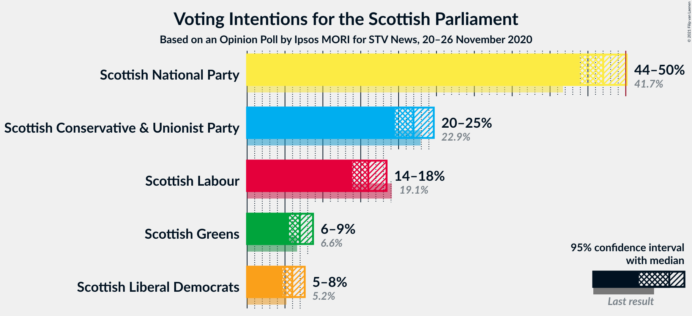

### Confidence Intervals

| Party | Last Result | Poll Result | 80% Confidence Interval | 90% Confidence Interval | 95% Confidence Interval | 99% Confidence Interval |
|:-----:|:-----------:|:-----------:|:-----------------------:|:-----------------------:|:-----------------------:|:-----------------------:|
| Scottish National Party | 41.7% | 47.0% | 45.0–49.0% |44.4–49.6% |43.9–50.1% |43.0–51.1% |
| Scottish Conservative & Unionist Party | 22.9% | 22.0% | 20.4–23.7% |19.9–24.2% |19.5–24.6% |18.8–25.5% |
| Scottish Labour | 19.1% | 16.0% | 14.6–17.6% |14.2–18.0% |13.9–18.4% |13.2–19.2% |
| Scottish Greens | 6.6% | 7.0% | 6.0–8.1% |5.8–8.4% |5.5–8.7% |5.1–9.3% |
| Scottish Liberal Democrats | 5.2% | 6.0% | 5.1–7.0% |4.9–7.3% |4.7–7.6% |4.3–8.2% |

*Note:* The poll result column reflects the actual value used in the calculations. Published results may vary slightly, and in addition be rounded to fewer digits.

## Seats

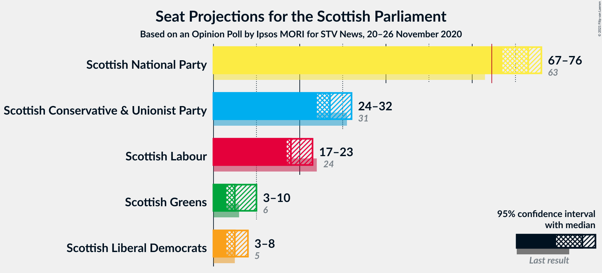

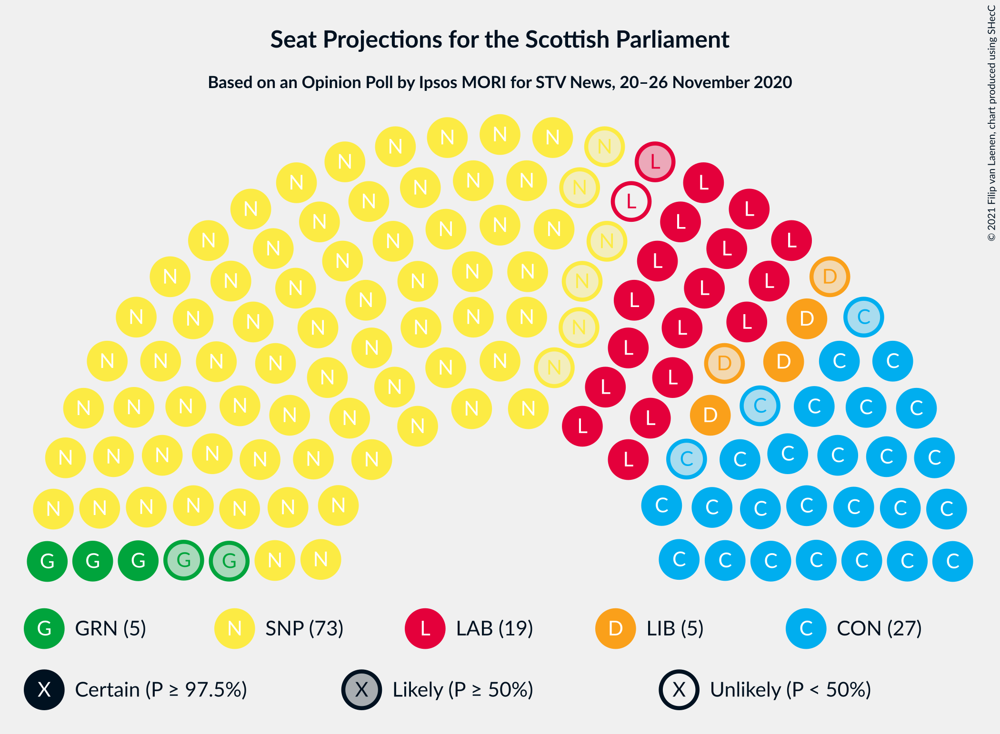

### Confidence Intervals

| Party | Last Result | Median | 80% Confidence Interval | 90% Confidence Interval | 95% Confidence Interval | 99% Confidence Interval |
|:-----:|:-----------:|:------:|:-----------------------:|:-----------------------:|:-----------------------:|:-----------------------:|
| <a href="#scottish-national-party">Scottish National Party</a> | 63 | 71 | 67–73 |65–74 |65–74 |65–76 |
| <a href="#scottish-conservative-&-unionist-party">Scottish Conservative & Unionist Party</a> | 31 | 27 | 25–31 |25–32 |24–32 |23–33 |
| <a href="#scottish-labour">Scottish Labour</a> | 24 | 18 | 17–22 |17–23 |17–23 |16–24 |
| <a href="#scottish-greens">Scottish Greens</a> | 6 | 5 | 4–10 |3–10 |3–10 |3–10 |
| <a href="#scottish-liberal-democrats">Scottish Liberal Democrats</a> | 5 | 5 | 5–6 |4–7 |3–8 |2–8 |

### Scottish National Party

*For a full overview of the results for this party, see the [Scottish National Party](party-scottishnationalparty.html) page.*

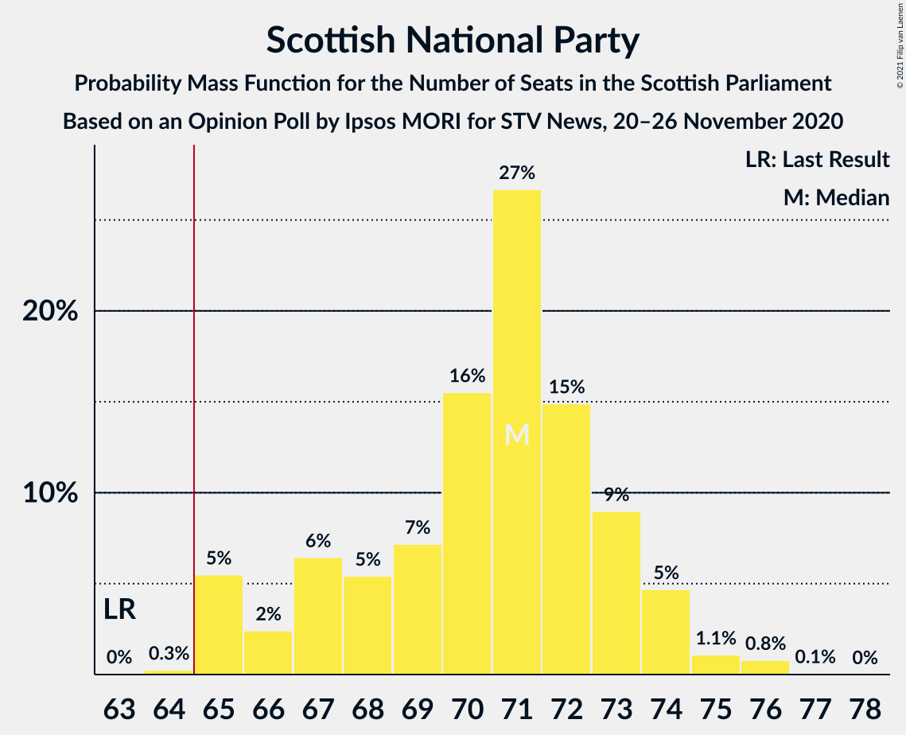

| Number of Seats | Probability | Accumulated | Special Marks |
|:---------------:|:-----------:|:-----------:|:-------------:|
| 63 | 0% | 100% | Last Result |
| 64 | 0.3% | 99.9% |  |
| 65 | 5% | 99.7% | Majority |
| 66 | 2% | 94% |  |
| 67 | 6% | 92% |  |
| 68 | 5% | 85% |  |
| 69 | 7% | 80% |  |
| 70 | 16% | 73% |  |
| 71 | 27% | 57% | Median |
| 72 | 15% | 31% |  |
| 73 | 9% | 16% |  |
| 74 | 5% | 7% |  |
| 75 | 1.1% | 2% |  |
| 76 | 0.8% | 0.9% |  |
| 77 | 0.1% | 0.1% |  |
| 78 | 0% | 0% |  |

### Scottish Conservative & Unionist Party

*For a full overview of the results for this party, see the [Scottish Conservative & Unionist Party](party-scottishconservativeunionistparty.html) page.*

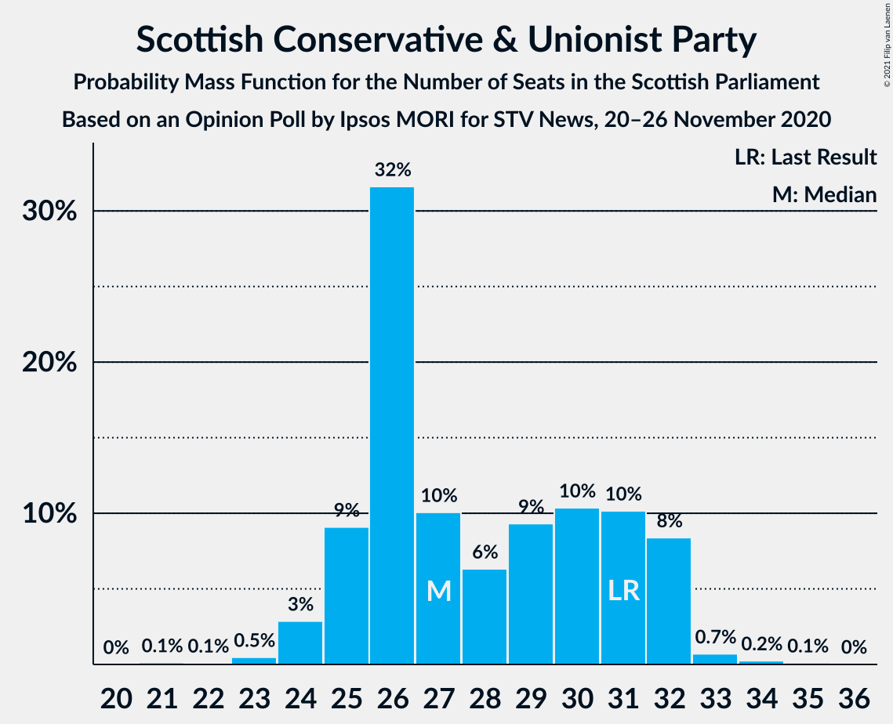

| Number of Seats | Probability | Accumulated | Special Marks |
|:---------------:|:-----------:|:-----------:|:-------------:|
| 21 | 0.1% | 100% |  |
| 22 | 0.1% | 99.9% |  |
| 23 | 0.5% | 99.8% |  |
| 24 | 3% | 99.3% |  |
| 25 | 9% | 96% |  |
| 26 | 32% | 87% |  |
| 27 | 10% | 56% | Median |
| 28 | 6% | 46% |  |
| 29 | 9% | 39% |  |
| 30 | 10% | 30% |  |
| 31 | 10% | 20% | Last Result |
| 32 | 8% | 9% |  |
| 33 | 0.7% | 1.1% |  |
| 34 | 0.2% | 0.4% |  |
| 35 | 0.1% | 0.1% |  |
| 36 | 0% | 0% |  |

### Scottish Labour

*For a full overview of the results for this party, see the [Scottish Labour](party-scottishlabour.html) page.*

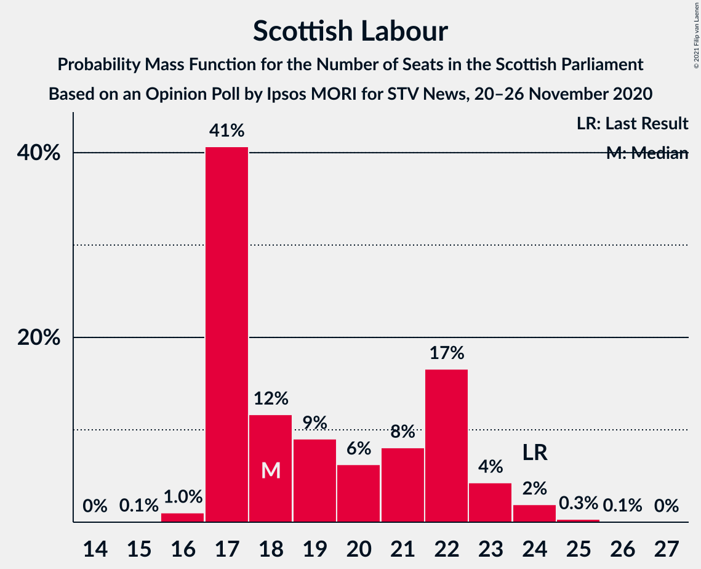

| Number of Seats | Probability | Accumulated | Special Marks |
|:---------------:|:-----------:|:-----------:|:-------------:|
| 15 | 0.1% | 100% |  |
| 16 | 1.0% | 99.9% |  |
| 17 | 41% | 98.9% |  |
| 18 | 12% | 58% | Median |
| 19 | 9% | 47% |  |
| 20 | 6% | 38% |  |
| 21 | 8% | 31% |  |
| 22 | 17% | 23% |  |
| 23 | 4% | 7% |  |
| 24 | 2% | 2% | Last Result |
| 25 | 0.3% | 0.4% |  |
| 26 | 0.1% | 0.1% |  |
| 27 | 0% | 0% |  |

### Scottish Greens

*For a full overview of the results for this party, see the [Scottish Greens](party-scottishgreens.html) page.*

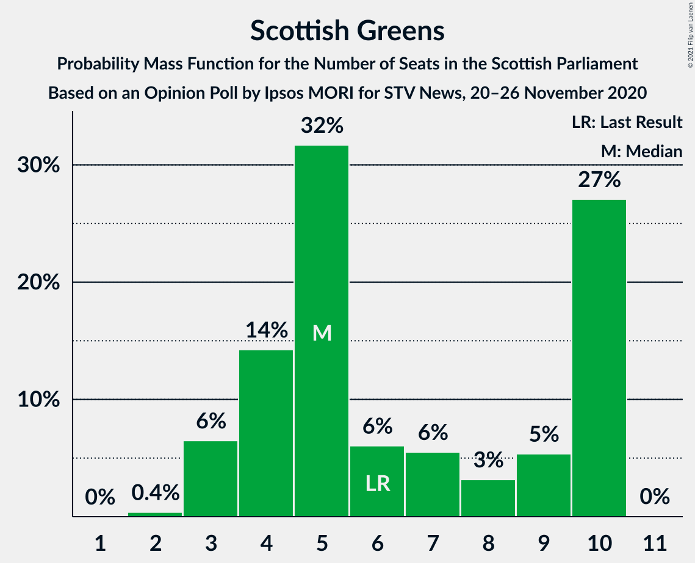

| Number of Seats | Probability | Accumulated | Special Marks |
|:---------------:|:-----------:|:-----------:|:-------------:|
| 2 | 0.4% | 100% |  |
| 3 | 6% | 99.6% |  |
| 4 | 14% | 93% |  |
| 5 | 32% | 79% | Median |
| 6 | 6% | 47% | Last Result |
| 7 | 6% | 41% |  |
| 8 | 3% | 36% |  |
| 9 | 5% | 32% |  |
| 10 | 27% | 27% |  |
| 11 | 0% | 0% |  |

### Scottish Liberal Democrats

*For a full overview of the results for this party, see the [Scottish Liberal Democrats](party-scottishliberaldemocrats.html) page.*

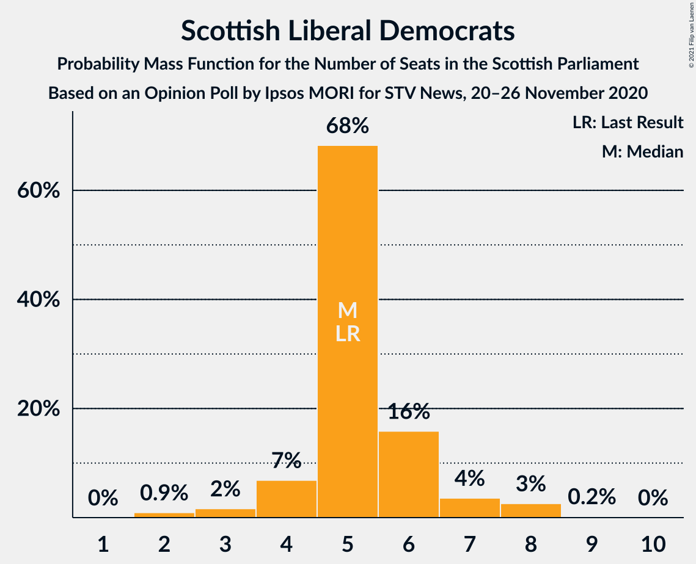

| Number of Seats | Probability | Accumulated | Special Marks |
|:---------------:|:-----------:|:-----------:|:-------------:|
| 2 | 0.9% | 100% |  |
| 3 | 2% | 99.1% |  |
| 4 | 7% | 97% |  |
| 5 | 68% | 91% | Last Result, Median |
| 6 | 16% | 22% |  |
| 7 | 4% | 6% |  |
| 8 | 3% | 3% |  |
| 9 | 0.2% | 0.2% |  |
| 10 | 0% | 0% |  |

## Coalitions

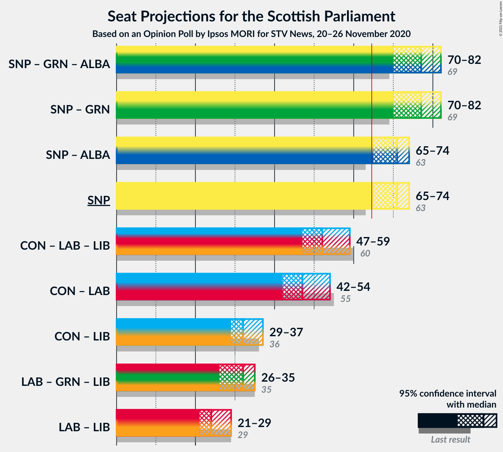

### Confidence Intervals

| Coalition | Last Result | Median | Majority? | 80% Confidence Interval | 90% Confidence Interval | 95% Confidence Interval | 99% Confidence Interval |
|:---------:|:-----------:|:------:|:---------:|:-----------------------:|:-----------------------:|:-----------------------:|:-----------------------:|
| Scottish National Party – Scottish Greens | 69 | 77 | 100% | 73–81 | 71–82 | 70–82 | 69–83 |
| Scottish National Party | 63 | 71 | 99.7% | 67–73 | 65–74 | 65–74 | 65–76 |
| Scottish Conservative & Unionist Party – Scottish Labour – Scottish Liberal Democrats | 60 | 52 | 0% | 48–56 | 47–58 | 47–59 | 46–60 |
| Scottish Conservative & Unionist Party – Scottish Labour | 55 | 47 | 0% | 43–50 | 43–52 | 42–54 | 41–55 |
| Scottish Conservative & Unionist Party – Scottish Liberal Democrats | 36 | 32 | 0% | 30–37 | 29–37 | 29–37 | 28–39 |
| Scottish Labour – Scottish Greens – Scottish Liberal Democrats | 35 | 32 | 0% | 27–33 | 26–34 | 26–35 | 25–37 |
| Scottish Labour – Scottish Liberal Democrats | 29 | 24 | 0% | 22–28 | 22–28 | 21–29 | 20–30 |

### Scottish National Party – Scottish Greens

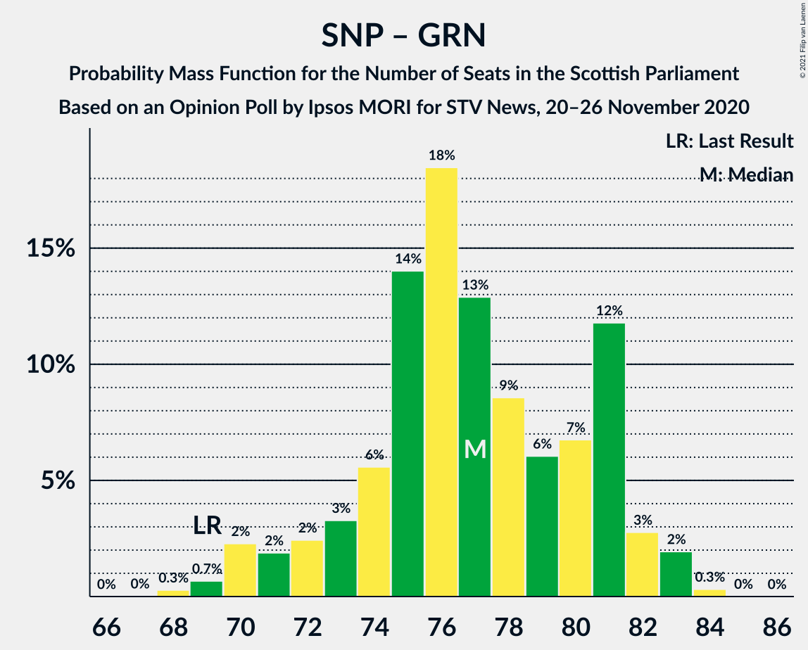

| Number of Seats | Probability | Accumulated | Special Marks |
|:---------------:|:-----------:|:-----------:|:-------------:|
| 68 | 0.3% | 100% |  |
| 69 | 0.7% | 99.7% | Last Result |
| 70 | 2% | 99.0% |  |
| 71 | 2% | 97% |  |
| 72 | 2% | 95% |  |
| 73 | 3% | 92% |  |
| 74 | 6% | 89% |  |
| 75 | 14% | 84% |  |
| 76 | 18% | 70% | Median |
| 77 | 13% | 51% |  |
| 78 | 9% | 38% |  |
| 79 | 6% | 30% |  |
| 80 | 7% | 24% |  |
| 81 | 12% | 17% |  |
| 82 | 3% | 5% |  |
| 83 | 2% | 2% |  |
| 84 | 0.3% | 0.3% |  |
| 85 | 0% | 0% |  |

### Scottish National Party

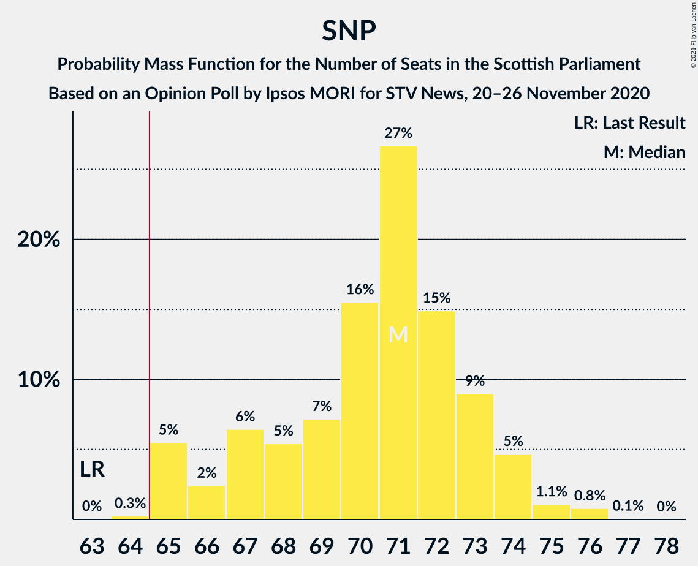

| Number of Seats | Probability | Accumulated | Special Marks |
|:---------------:|:-----------:|:-----------:|:-------------:|
| 63 | 0% | 100% | Last Result |
| 64 | 0.3% | 99.9% |  |
| 65 | 5% | 99.7% | Majority |
| 66 | 2% | 94% |  |
| 67 | 6% | 92% |  |
| 68 | 5% | 85% |  |
| 69 | 7% | 80% |  |
| 70 | 16% | 73% |  |
| 71 | 27% | 57% | Median |
| 72 | 15% | 31% |  |
| 73 | 9% | 16% |  |
| 74 | 5% | 7% |  |
| 75 | 1.1% | 2% |  |
| 76 | 0.8% | 0.9% |  |
| 77 | 0.1% | 0.1% |  |
| 78 | 0% | 0% |  |

### Scottish Conservative & Unionist Party – Scottish Labour – Scottish Liberal Democrats

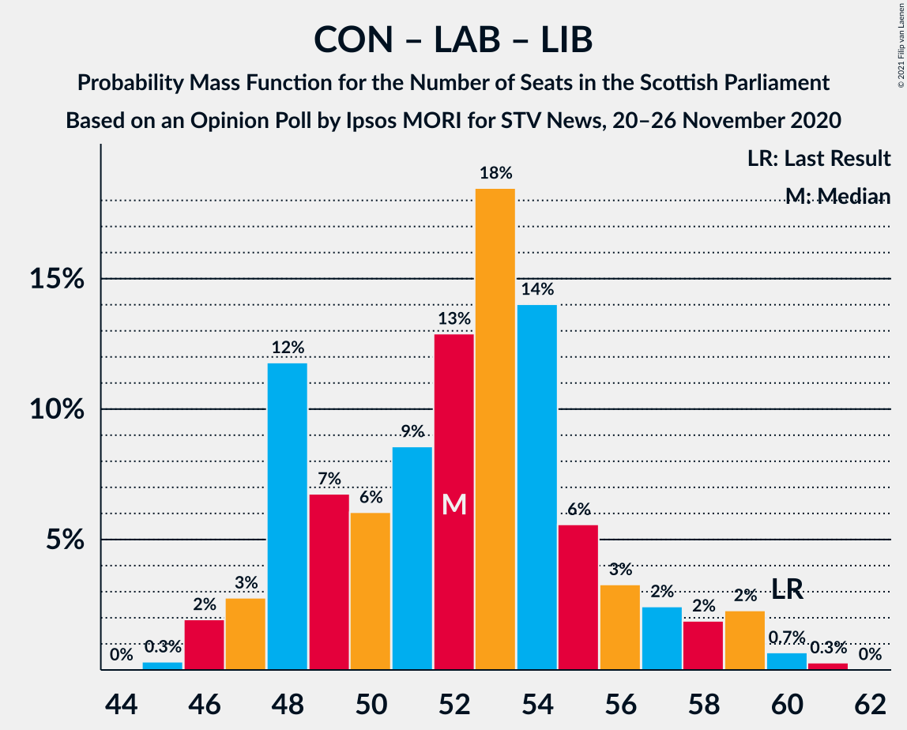

| Number of Seats | Probability | Accumulated | Special Marks |
|:---------------:|:-----------:|:-----------:|:-------------:|
| 45 | 0.3% | 100% |  |
| 46 | 2% | 99.7% |  |
| 47 | 3% | 98% |  |
| 48 | 12% | 95% |  |
| 49 | 7% | 83% |  |
| 50 | 6% | 76% | Median |
| 51 | 9% | 70% |  |
| 52 | 13% | 62% |  |
| 53 | 18% | 49% |  |
| 54 | 14% | 30% |  |
| 55 | 6% | 16% |  |
| 56 | 3% | 11% |  |
| 57 | 2% | 8% |  |
| 58 | 2% | 5% |  |
| 59 | 2% | 3% |  |
| 60 | 0.7% | 1.0% | Last Result |
| 61 | 0.3% | 0.3% |  |
| 62 | 0% | 0% |  |

### Scottish Conservative & Unionist Party – Scottish Labour

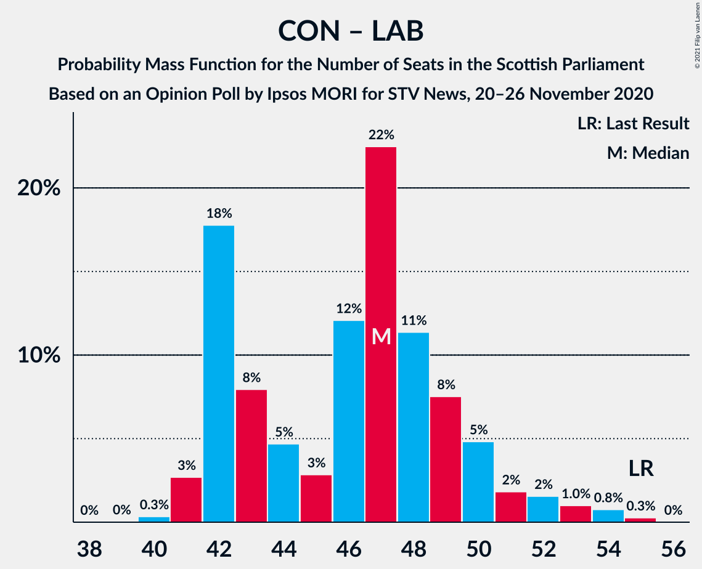

| Number of Seats | Probability | Accumulated | Special Marks |
|:---------------:|:-----------:|:-----------:|:-------------:|
| 40 | 0.1% | 100% |  |
| 41 | 1.0% | 99.9% |  |
| 42 | 3% | 98.9% |  |
| 43 | 15% | 95% |  |
| 44 | 6% | 81% |  |
| 45 | 5% | 75% | Median |
| 46 | 10% | 69% |  |
| 47 | 13% | 60% |  |
| 48 | 21% | 46% |  |
| 49 | 11% | 25% |  |
| 50 | 4% | 14% |  |
| 51 | 3% | 10% |  |
| 52 | 2% | 7% |  |
| 53 | 2% | 4% |  |
| 54 | 2% | 3% |  |
| 55 | 0.5% | 0.8% | Last Result |
| 56 | 0.2% | 0.2% |  |
| 57 | 0% | 0% |  |

### Scottish Conservative & Unionist Party – Scottish Liberal Democrats

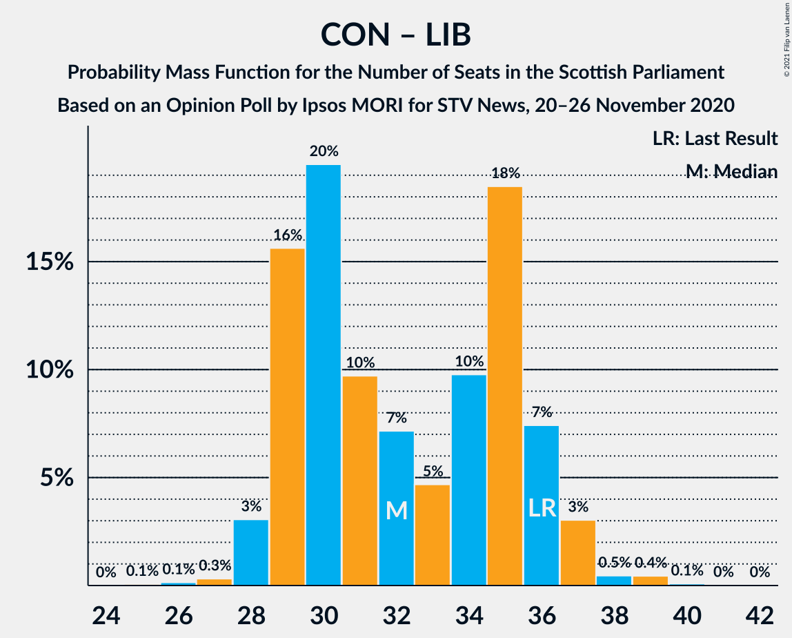

| Number of Seats | Probability | Accumulated | Special Marks |
|:---------------:|:-----------:|:-----------:|:-------------:|
| 26 | 0.1% | 100% |  |
| 27 | 0.2% | 99.9% |  |
| 28 | 1.2% | 99.7% |  |
| 29 | 4% | 98.5% |  |
| 30 | 7% | 94% |  |
| 31 | 24% | 87% |  |
| 32 | 13% | 63% | Median |
| 33 | 8% | 49% |  |
| 34 | 10% | 42% |  |
| 35 | 11% | 32% |  |
| 36 | 9% | 22% | Last Result |
| 37 | 10% | 13% |  |
| 38 | 1.5% | 2% |  |
| 39 | 0.6% | 0.9% |  |
| 40 | 0.2% | 0.3% |  |
| 41 | 0% | 0.1% |  |
| 42 | 0% | 0% |  |

### Scottish Labour – Scottish Greens – Scottish Liberal Democrats

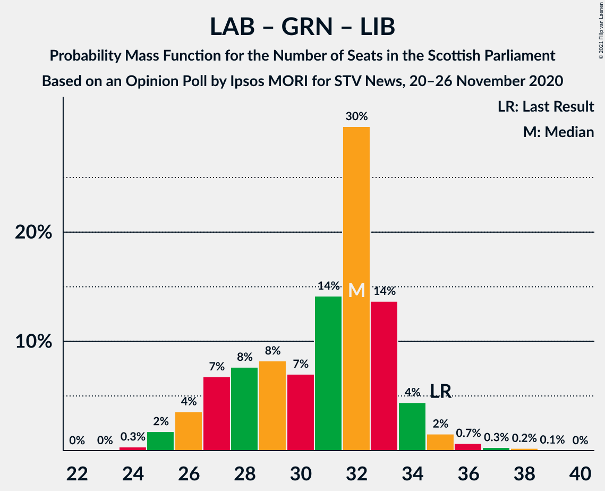

| Number of Seats | Probability | Accumulated | Special Marks |
|:---------------:|:-----------:|:-----------:|:-------------:|
| 24 | 0.3% | 100% |  |
| 25 | 2% | 99.6% |  |
| 26 | 4% | 98% |  |
| 27 | 7% | 94% |  |
| 28 | 8% | 88% | Median |
| 29 | 8% | 80% |  |
| 30 | 7% | 72% |  |
| 31 | 14% | 65% |  |
| 32 | 30% | 51% |  |
| 33 | 14% | 21% |  |
| 34 | 4% | 7% |  |
| 35 | 2% | 3% | Last Result |
| 36 | 0.7% | 1.3% |  |
| 37 | 0.3% | 0.6% |  |
| 38 | 0.2% | 0.3% |  |
| 39 | 0.1% | 0.1% |  |
| 40 | 0% | 0% |  |

### Scottish Labour – Scottish Liberal Democrats

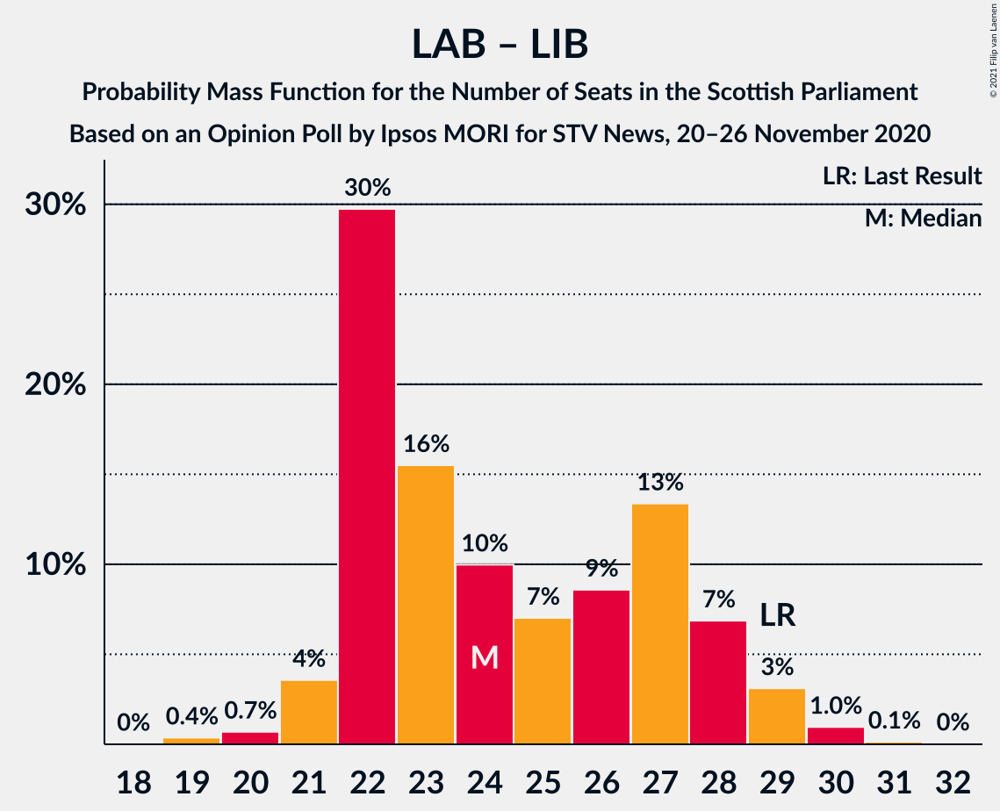

| Number of Seats | Probability | Accumulated | Special Marks |
|:---------------:|:-----------:|:-----------:|:-------------:|
| 19 | 0.4% | 100% |  |
| 20 | 0.7% | 99.6% |  |
| 21 | 4% | 98.9% |  |
| 22 | 30% | 95% |  |
| 23 | 16% | 66% | Median |
| 24 | 10% | 50% |  |
| 25 | 7% | 40% |  |
| 26 | 9% | 33% |  |
| 27 | 13% | 25% |  |
| 28 | 7% | 11% |  |
| 29 | 3% | 4% | Last Result |
| 30 | 1.0% | 1.1% |  |
| 31 | 0.1% | 0.2% |  |
| 32 | 0% | 0% |  |

## Technical Information

### Opinion Poll

+ **Polling firm:** Ipsos MORI
+ **Commissioner(s):** STV News
+ **Fieldwork period:** 20–26 November 2020

### Calculations

+ **Sample size:** 1006
+ **Simulations done:** 1,048,576
+ **Error estimate:** 1.37%

