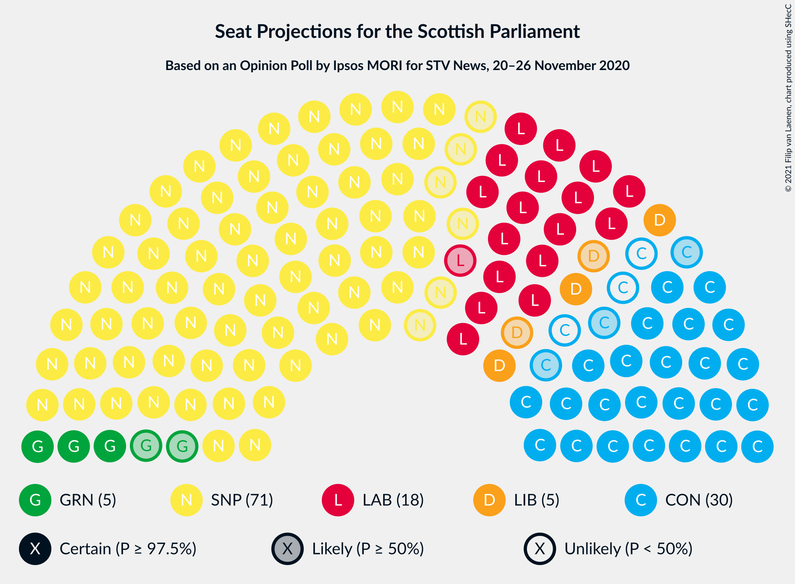

# Opinion Poll by Ipsos MORI for STV News, 20–26 November 2020

<a href="#voting-intentions">Voting Intentions</a> | <a href="#seats">Seats</a> | <a href="#coalitions">Coalitions</a> | <a href="#technical-information">Technical Information</a>

## Voting Intentions

### Confidence Intervals

| Party | Last Result | Poll Result | 80% Confidence Interval | 90% Confidence Interval | 95% Confidence Interval | 99% Confidence Interval |
|:-----:|:-----------:|:-----------:|:-----------------------:|:-----------------------:|:-----------------------:|:-----------------------:|
| Scottish National Party | 41.7% | 47.0% | 45.0–49.0% |44.4–49.6% |43.9–50.1% |43.0–51.1% |
| Scottish Conservative & Unionist Party | 22.9% | 22.0% | 20.4–23.7% |19.9–24.2% |19.5–24.6% |18.8–25.5% |
| Scottish Labour | 19.1% | 16.0% | 14.6–17.6% |14.2–18.0% |13.9–18.4% |13.2–19.2% |
| Scottish Greens | 6.6% | 7.0% | 6.0–8.1% |5.8–8.4% |5.5–8.7% |5.1–9.3% |
| Scottish Liberal Democrats | 5.2% | 6.0% | 5.1–7.0% |4.9–7.3% |4.7–7.6% |4.3–8.2% |

*Note:* The poll result column reflects the actual value used in the calculations. Published results may vary slightly, and in addition be rounded to fewer digits.

## Seats

### Confidence Intervals

| Party | Last Result | Median | 80% Confidence Interval | 90% Confidence Interval | 95% Confidence Interval | 99% Confidence Interval |
|:-----:|:-----------:|:------:|:-----------------------:|:-----------------------:|:-----------------------:|:-----------------------:|
| <a href="#scottish-national-party">Scottish National Party</a> | 63 | 73 | 68–74 |67–74 |67–76 |65–76 |
| <a href="#scottish-conservative-&-unionist-party">Scottish Conservative & Unionist Party</a> | 31 | 27 | 25–30 |24–31 |24–32 |23–32 |
| <a href="#scottish-labour">Scottish Labour</a> | 24 | 18 | 17–22 |17–22 |17–23 |16–24 |
| <a href="#scottish-greens">Scottish Greens</a> | 6 | 5 | 3–10 |3–10 |3–10 |3–10 |
| <a href="#scottish-liberal-democrats">Scottish Liberal Democrats</a> | 5 | 5 | 4–6 |4–7 |3–8 |2–8 |

### Scottish National Party

*For a full overview of the results for this party, see the [Scottish National Party](party-scottishnationalparty.html) page.*

| Number of Seats | Probability | Accumulated | Special Marks |
|:---------------:|:-----------:|:-----------:|:-------------:|
| 63 | 0% | 100% | Last Result |
| 64 | 0.1% | 100% |  |
| 65 | 0.5% | 99.9% | Majority |
| 66 | 1.4% | 99.4% |  |
| 67 | 4% | 98% |  |
| 68 | 4% | 94% |  |
| 69 | 6% | 90% |  |
| 70 | 7% | 84% |  |
| 71 | 14% | 77% |  |
| 72 | 12% | 63% |  |
| 73 | 33% | 51% | Median |
| 74 | 13% | 18% |  |
| 75 | 0.6% | 5% |  |
| 76 | 4% | 4% |  |
| 77 | 0.1% | 0.1% |  |
| 78 | 0% | 0% |  |

### Scottish Conservative & Unionist Party

*For a full overview of the results for this party, see the [Scottish Conservative & Unionist Party](party-scottishconservativeunionistparty.html) page.*

| Number of Seats | Probability | Accumulated | Special Marks |
|:---------------:|:-----------:|:-----------:|:-------------:|
| 21 | 0.2% | 100% |  |
| 22 | 0.2% | 99.8% |  |
| 23 | 0.8% | 99.6% |  |
| 24 | 5% | 98.8% |  |
| 25 | 36% | 94% |  |
| 26 | 8% | 59% |  |
| 27 | 6% | 50% | Median |
| 28 | 5% | 44% |  |
| 29 | 10% | 39% |  |
| 30 | 20% | 28% |  |
| 31 | 5% | 9% | Last Result |
| 32 | 4% | 4% |  |
| 33 | 0.3% | 0.5% |  |
| 34 | 0.1% | 0.1% |  |
| 35 | 0% | 0% |  |

### Scottish Labour

*For a full overview of the results for this party, see the [Scottish Labour](party-scottishlabour.html) page.*

| Number of Seats | Probability | Accumulated | Special Marks |
|:---------------:|:-----------:|:-----------:|:-------------:|
| 15 | 0.4% | 100% |  |
| 16 | 2% | 99.6% |  |
| 17 | 47% | 98% |  |
| 18 | 9% | 51% | Median |
| 19 | 9% | 42% |  |
| 20 | 5% | 33% |  |
| 21 | 14% | 28% |  |
| 22 | 11% | 15% |  |
| 23 | 3% | 4% |  |
| 24 | 0.8% | 1.0% | Last Result |
| 25 | 0.1% | 0.1% |  |
| 26 | 0% | 0% |  |

### Scottish Greens

*For a full overview of the results for this party, see the [Scottish Greens](party-scottishgreens.html) page.*

| Number of Seats | Probability | Accumulated | Special Marks |
|:---------------:|:-----------:|:-----------:|:-------------:|
| 2 | 0.4% | 100% |  |
| 3 | 17% | 99.6% |  |
| 4 | 11% | 83% |  |
| 5 | 24% | 72% | Median |
| 6 | 9% | 48% | Last Result |
| 7 | 4% | 39% |  |
| 8 | 4% | 36% |  |
| 9 | 15% | 31% |  |
| 10 | 16% | 16% |  |
| 11 | 0% | 0% |  |

### Scottish Liberal Democrats

*For a full overview of the results for this party, see the [Scottish Liberal Democrats](party-scottishliberaldemocrats.html) page.*

| Number of Seats | Probability | Accumulated | Special Marks |
|:---------------:|:-----------:|:-----------:|:-------------:|
| 2 | 1.3% | 100% |  |
| 3 | 2% | 98.7% |  |
| 4 | 29% | 97% |  |
| 5 | 46% | 68% | Last Result, Median |
| 6 | 16% | 22% |  |
| 7 | 3% | 6% |  |
| 8 | 3% | 3% |  |
| 9 | 0.2% | 0.2% |  |
| 10 | 0% | 0% |  |

## Coalitions

### Confidence Intervals

| Coalition | Last Result | Median | Majority? | 80% Confidence Interval | 90% Confidence Interval | 95% Confidence Interval | 99% Confidence Interval |
|:---------:|:-----------:|:------:|:---------:|:-----------------------:|:-----------------------:|:-----------------------:|:-----------------------:|
| Scottish National Party – Scottish Greens | 69 | 77 | 100% | 75–82 | 73–83 | 72–83 | 70–84 |
| Scottish National Party | 63 | 73 | 99.9% | 68–74 | 67–74 | 67–76 | 65–76 |
| Scottish Conservative & Unionist Party – Scottish Labour – Scottish Liberal Democrats | 60 | 52 | 0% | 47–54 | 46–56 | 46–57 | 45–59 |
| Scottish Conservative & Unionist Party – Scottish Labour | 55 | 47 | 0% | 42–50 | 42–51 | 41–52 | 41–54 |
| Scottish Conservative & Unionist Party – Scottish Liberal Democrats | 36 | 32 | 0% | 29–36 | 29–36 | 28–37 | 27–39 |
| Scottish Labour – Scottish Greens – Scottish Liberal Democrats | 35 | 31 | 0% | 26–32 | 25–33 | 25–34 | 24–36 |
| Scottish Labour – Scottish Liberal Democrats | 29 | 23 | 0% | 21–27 | 21–27 | 21–28 | 19–30 |

### Scottish National Party – Scottish Greens

| Number of Seats | Probability | Accumulated | Special Marks |
|:---------------:|:-----------:|:-----------:|:-------------:|
| 69 | 0.1% | 100% | Last Result |
| 70 | 0.9% | 99.9% |  |
| 71 | 1.1% | 99.0% |  |
| 72 | 2% | 98% |  |
| 73 | 2% | 96% |  |
| 74 | 4% | 95% |  |
| 75 | 8% | 90% |  |
| 76 | 13% | 82% |  |
| 77 | 20% | 69% |  |
| 78 | 12% | 49% | Median |
| 79 | 3% | 37% |  |
| 80 | 5% | 33% |  |
| 81 | 9% | 28% |  |
| 82 | 9% | 19% |  |
| 83 | 8% | 10% |  |
| 84 | 1.5% | 2% |  |
| 85 | 0% | 0% |  |

### Scottish National Party

| Number of Seats | Probability | Accumulated | Special Marks |
|:---------------:|:-----------:|:-----------:|:-------------:|
| 63 | 0% | 100% | Last Result |
| 64 | 0.1% | 100% |  |
| 65 | 0.5% | 99.9% | Majority |
| 66 | 1.4% | 99.4% |  |
| 67 | 4% | 98% |  |
| 68 | 4% | 94% |  |
| 69 | 6% | 90% |  |
| 70 | 7% | 84% |  |
| 71 | 14% | 77% |  |
| 72 | 12% | 63% |  |
| 73 | 33% | 51% | Median |
| 74 | 13% | 18% |  |
| 75 | 0.6% | 5% |  |
| 76 | 4% | 4% |  |
| 77 | 0.1% | 0.1% |  |
| 78 | 0% | 0% |  |

### Scottish Conservative & Unionist Party – Scottish Labour – Scottish Liberal Democrats

| Number of Seats | Probability | Accumulated | Special Marks |
|:---------------:|:-----------:|:-----------:|:-------------:|
| 45 | 1.5% | 100% |  |
| 46 | 8% | 98% |  |
| 47 | 9% | 90% |  |
| 48 | 9% | 81% |  |
| 49 | 5% | 72% |  |
| 50 | 3% | 67% | Median |
| 51 | 12% | 63% |  |
| 52 | 20% | 51% |  |
| 53 | 13% | 31% |  |
| 54 | 8% | 18% |  |
| 55 | 4% | 10% |  |
| 56 | 2% | 5% |  |
| 57 | 2% | 4% |  |
| 58 | 1.1% | 2% |  |
| 59 | 0.9% | 1.0% |  |
| 60 | 0.1% | 0.1% | Last Result |
| 61 | 0% | 0% |  |

### Scottish Conservative & Unionist Party – Scottish Labour

| Number of Seats | Probability | Accumulated | Special Marks |
|:---------------:|:-----------:|:-----------:|:-------------:|
| 40 | 0.3% | 100% |  |
| 41 | 3% | 99.6% |  |
| 42 | 18% | 97% |  |
| 43 | 8% | 79% |  |
| 44 | 5% | 71% |  |
| 45 | 3% | 67% | Median |
| 46 | 12% | 64% |  |
| 47 | 22% | 52% |  |
| 48 | 11% | 29% |  |
| 49 | 8% | 18% |  |
| 50 | 5% | 10% |  |
| 51 | 2% | 5% |  |
| 52 | 2% | 4% |  |
| 53 | 1.0% | 2% |  |
| 54 | 0.8% | 1.0% |  |
| 55 | 0.3% | 0.3% | Last Result |
| 56 | 0% | 0% |  |

### Scottish Conservative & Unionist Party – Scottish Liberal Democrats

| Number of Seats | Probability | Accumulated | Special Marks |
|:---------------:|:-----------:|:-----------:|:-------------:|
| 25 | 0.1% | 100% |  |
| 26 | 0.1% | 99.9% |  |
| 27 | 0.3% | 99.8% |  |
| 28 | 3% | 99.5% |  |
| 29 | 16% | 96% |  |
| 30 | 20% | 81% |  |
| 31 | 10% | 61% |  |
| 32 | 7% | 52% | Median |
| 33 | 5% | 44% |  |
| 34 | 10% | 40% |  |
| 35 | 18% | 30% |  |
| 36 | 7% | 11% | Last Result |
| 37 | 3% | 4% |  |
| 38 | 0.5% | 1.0% |  |
| 39 | 0.4% | 0.6% |  |
| 40 | 0.1% | 0.1% |  |
| 41 | 0% | 0% |  |

### Scottish Labour – Scottish Greens – Scottish Liberal Democrats

| Number of Seats | Probability | Accumulated | Special Marks |
|:---------------:|:-----------:|:-----------:|:-------------:|
| 24 | 1.1% | 100% |  |
| 25 | 7% | 98.9% |  |
| 26 | 4% | 92% |  |
| 27 | 4% | 88% |  |
| 28 | 10% | 84% | Median |
| 29 | 10% | 74% |  |
| 30 | 9% | 65% |  |
| 31 | 35% | 56% |  |
| 32 | 12% | 20% |  |
| 33 | 5% | 8% |  |
| 34 | 2% | 3% |  |
| 35 | 1.1% | 2% | Last Result |
| 36 | 0.3% | 0.5% |  |
| 37 | 0.1% | 0.2% |  |
| 38 | 0% | 0.1% |  |
| 39 | 0% | 0% |  |

### Scottish Labour – Scottish Liberal Democrats

| Number of Seats | Probability | Accumulated | Special Marks |
|:---------------:|:-----------:|:-----------:|:-------------:|
| 19 | 0.5% | 100% |  |
| 20 | 2% | 99.5% |  |
| 21 | 12% | 98% |  |
| 22 | 27% | 86% |  |
| 23 | 15% | 60% | Median |
| 24 | 10% | 45% |  |
| 25 | 5% | 34% |  |
| 26 | 17% | 29% |  |
| 27 | 8% | 11% |  |
| 28 | 2% | 4% |  |
| 29 | 1.0% | 1.5% | Last Result |
| 30 | 0.4% | 0.5% |  |
| 31 | 0% | 0.1% |  |
| 32 | 0% | 0% |  |

## Technical Information

### Opinion Poll

+ **Polling firm:** Ipsos MORI
+ **Commissioner(s):** STV News
+ **Fieldwork period:** 20–26 November 2020

### Calculations

+ **Sample size:** 1006
+ **Simulations done:** 131,072
+ **Error estimate:** 0.84%

