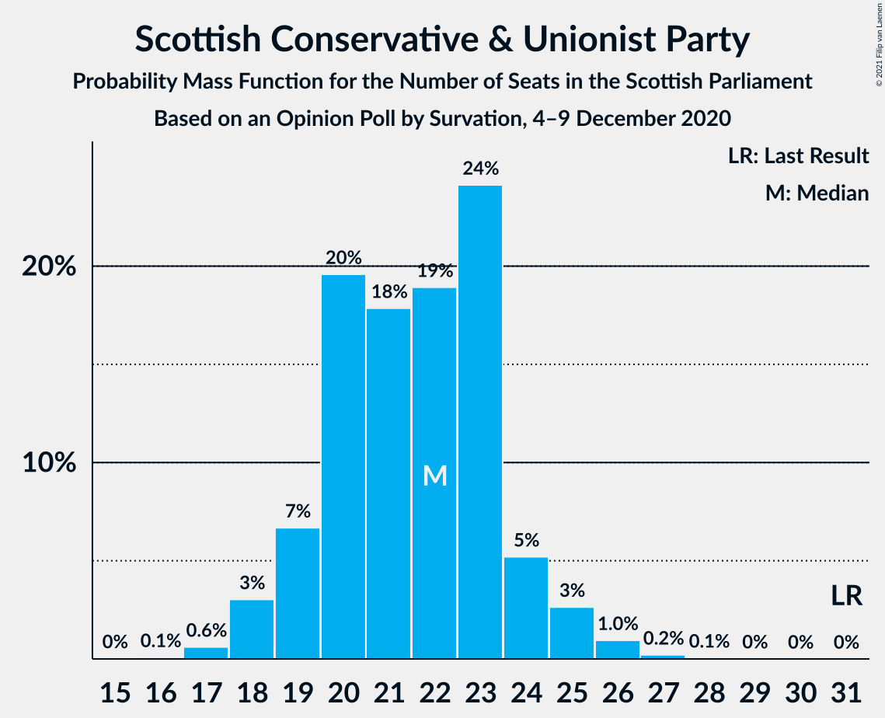
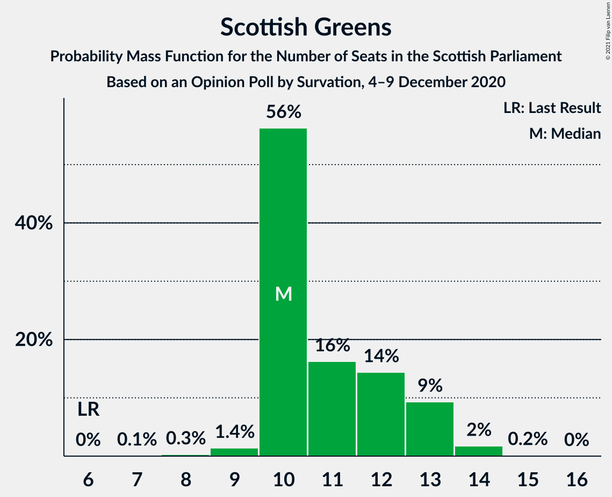

# Opinion Poll by Survation, 4–9 December 2020

<a href="#voting-intentions">Voting Intentions</a> | <a href="#seats">Seats</a> | <a href="#coalitions">Coalitions</a> | <a href="#technical-information">Technical Information</a>

## Voting Intentions

### Confidence Intervals

| Party | Last Result | Poll Result | 80% Confidence Interval | 90% Confidence Interval | 95% Confidence Interval | 99% Confidence Interval |
|:-----:|:-----------:|:-----------:|:-----------------------:|:-----------------------:|:-----------------------:|:-----------------------:|
| Scottish National Party | 41.7% | 41.0% | 39.0–43.0% |38.5–43.6% |38.0–44.1% |37.1–45.0% |
| Scottish Labour | 19.1% | 20.0% | 18.5–21.7% |18.0–22.2% |17.6–22.6% |16.9–23.4% |
| Scottish Conservative & Unionist Party | 22.9% | 18.0% | 16.5–19.6% |16.1–20.1% |15.8–20.5% |15.1–21.3% |
| Scottish Greens | 6.6% | 10.0% | 8.9–11.3% |8.6–11.7% |8.3–12.0% |7.8–12.7% |
| Scottish Liberal Democrats | 5.2% | 7.0% | 6.1–8.2% |5.8–8.5% |5.6–8.8% |5.2–9.4% |
| Reform UK | 0.0% | 1.0% | 0.7–1.5% |0.6–1.7% |0.5–1.8% |0.4–2.1% |

*Note:* The poll result column reflects the actual value used in the calculations. Published results may vary slightly, and in addition be rounded to fewer digits.

## Seats

### Confidence Intervals

| Party | Last Result | Median | 80% Confidence Interval | 90% Confidence Interval | 95% Confidence Interval | 99% Confidence Interval |
|:-----:|:-----------:|:------:|:-----------------------:|:-----------------------:|:-----------------------:|:-----------------------:|
| <a href="#scottish-national-party">Scottish National Party</a> | 63 | 70 | 67–71 |66–71 |65–71 |62–71 |
| <a href="#scottish-labour">Scottish Labour</a> | 24 | 23 | 21–25 |21–26 |20–26 |19–27 |
| <a href="#scottish-conservative-&-unionist-party">Scottish Conservative & Unionist Party</a> | 31 | 20 | 18–22 |18–23 |17–24 |16–25 |
| <a href="#scottish-greens">Scottish Greens</a> | 6 | 10 | 10–12 |9–12 |9–12 |7–12 |
| <a href="#scottish-liberal-democrats">Scottish Liberal Democrats</a> | 5 | 6 | 4–7 |4–8 |4–9 |4–10 |
| <a href="#reform-uk">Reform UK</a> | 0 | 0 | 0 |0 |0 |0 |

### Scottish National Party

*For a full overview of the results for this party, see the [Scottish National Party](party-scottishnationalparty.html) page.*

| Number of Seats | Probability | Accumulated | Special Marks |
|:---------------:|:-----------:|:-----------:|:-------------:|
| 61 | 0% | 100% |  |
| 62 | 0.6% | 99.9% |  |
| 63 | 0.6% | 99.3% | Last Result |
| 64 | 0.7% | 98.7% |  |
| 65 | 1.3% | 98% | Majority |
| 66 | 2% | 97% |  |
| 67 | 7% | 95% |  |
| 68 | 10% | 88% |  |
| 69 | 22% | 77% |  |
| 70 | 21% | 56% | Median |
| 71 | 34% | 35% |  |
| 72 | 0.4% | 0.4% |  |
| 73 | 0% | 0% |  |

### Scottish Labour

*For a full overview of the results for this party, see the [Scottish Labour](party-scottishlabour.html) page.*

| Number of Seats | Probability | Accumulated | Special Marks |
|:---------------:|:-----------:|:-----------:|:-------------:|
| 18 | 0.1% | 100% |  |
| 19 | 0.7% | 99.9% |  |
| 20 | 2% | 99.2% |  |
| 21 | 13% | 97% |  |
| 22 | 15% | 84% |  |
| 23 | 21% | 69% | Median |
| 24 | 25% | 48% | Last Result |
| 25 | 16% | 24% |  |
| 26 | 6% | 8% |  |
| 27 | 2% | 2% |  |
| 28 | 0.3% | 0.4% |  |
| 29 | 0.1% | 0.1% |  |
| 30 | 0% | 0% |  |

### Scottish Conservative & Unionist Party

*For a full overview of the results for this party, see the [Scottish Conservative & Unionist Party](party-scottishconservativeunionistparty.html) page.*

| Number of Seats | Probability | Accumulated | Special Marks |
|:---------------:|:-----------:|:-----------:|:-------------:|
| 15 | 0.2% | 100% |  |
| 16 | 0.3% | 99.8% |  |
| 17 | 3% | 99.5% |  |
| 18 | 16% | 96% |  |
| 19 | 19% | 80% |  |
| 20 | 19% | 61% | Median |
| 21 | 31% | 42% |  |
| 22 | 5% | 11% |  |
| 23 | 3% | 6% |  |
| 24 | 3% | 3% |  |
| 25 | 0.5% | 0.7% |  |
| 26 | 0.2% | 0.2% |  |
| 27 | 0% | 0% |  |
| 28 | 0% | 0% |  |
| 29 | 0% | 0% |  |
| 30 | 0% | 0% |  |
| 31 | 0% | 0% | Last Result |

### Scottish Greens

*For a full overview of the results for this party, see the [Scottish Greens](party-scottishgreens.html) page.*

| Number of Seats | Probability | Accumulated | Special Marks |
|:---------------:|:-----------:|:-----------:|:-------------:|
| 5 | 0.1% | 100% |  |
| 6 | 0.1% | 99.9% | Last Result |
| 7 | 0.4% | 99.9% |  |
| 8 | 1.1% | 99.5% |  |
| 9 | 7% | 98% |  |
| 10 | 44% | 91% | Median |
| 11 | 24% | 47% |  |
| 12 | 22% | 23% |  |
| 13 | 0.3% | 0.3% |  |
| 14 | 0% | 0% |  |

### Scottish Liberal Democrats

*For a full overview of the results for this party, see the [Scottish Liberal Democrats](party-scottishliberaldemocrats.html) page.*

| Number of Seats | Probability | Accumulated | Special Marks |
|:---------------:|:-----------:|:-----------:|:-------------:|
| 3 | 0.2% | 100% |  |
| 4 | 25% | 99.8% |  |
| 5 | 9% | 75% | Last Result |
| 6 | 51% | 66% | Median |
| 7 | 8% | 15% |  |
| 8 | 4% | 7% |  |
| 9 | 1.1% | 3% |  |
| 10 | 2% | 2% |  |
| 11 | 0% | 0% |  |

### Reform UK

*For a full overview of the results for this party, see the [Reform UK](party-reformuk.html) page.*

| Number of Seats | Probability | Accumulated | Special Marks |
|:---------------:|:-----------:|:-----------:|:-------------:|
| 0 | 100% | 100% | Last Result, Median |

## Coalitions

### Confidence Intervals

| Coalition | Last Result | Median | Majority? | 80% Confidence Interval | 90% Confidence Interval | 95% Confidence Interval | 99% Confidence Interval |
|:---------:|:-----------:|:------:|:---------:|:-----------------------:|:-----------------------:|:-----------------------:|:-----------------------:|
| Scottish National Party – Scottish Greens | 69 | 80 | 100% | 78–81 | 76–82 | 75–82 | 72–82 |
| Scottish National Party | 63 | 70 | 98% | 67–71 | 66–71 | 65–71 | 62–71 |
| Scottish Labour – Scottish Conservative & Unionist Party – Scottish Liberal Democrats | 60 | 49 | 0% | 48–51 | 47–53 | 47–54 | 47–57 |
| Scottish Labour – Scottish Conservative & Unionist Party | 55 | 43 | 0% | 42–45 | 41–46 | 40–48 | 40–50 |
| Scottish Labour – Scottish Greens – Scottish Liberal Democrats | 35 | 39 | 0% | 37–42 | 37–43 | 37–43 | 35–45 |
| Scottish Labour – Scottish Liberal Democrats | 29 | 29 | 0% | 27–31 | 27–32 | 26–33 | 25–34 |
| Scottish Conservative & Unionist Party – Scottish Liberal Democrats | 36 | 25 | 0% | 23–28 | 22–29 | 22–30 | 21–32 |

### Scottish National Party – Scottish Greens

| Number of Seats | Probability | Accumulated | Special Marks |
|:---------------:|:-----------:|:-----------:|:-------------:|
| 69 | 0% | 100% | Last Result |
| 70 | 0% | 100% |  |
| 71 | 0% | 100% |  |
| 72 | 0.5% | 99.9% |  |
| 73 | 0.5% | 99.5% |  |
| 74 | 0.8% | 99.0% |  |
| 75 | 0.8% | 98% |  |
| 76 | 3% | 97% |  |
| 77 | 2% | 95% |  |
| 78 | 7% | 93% |  |
| 79 | 9% | 85% |  |
| 80 | 28% | 76% | Median |
| 81 | 38% | 48% |  |
| 82 | 10% | 10% |  |
| 83 | 0.1% | 0.2% |  |
| 84 | 0% | 0% |  |

### Scottish National Party

| Number of Seats | Probability | Accumulated | Special Marks |
|:---------------:|:-----------:|:-----------:|:-------------:|
| 61 | 0% | 100% |  |
| 62 | 0.6% | 99.9% |  |
| 63 | 0.6% | 99.3% | Last Result |
| 64 | 0.7% | 98.7% |  |
| 65 | 1.3% | 98% | Majority |
| 66 | 2% | 97% |  |
| 67 | 7% | 95% |  |
| 68 | 10% | 88% |  |
| 69 | 22% | 77% |  |
| 70 | 21% | 56% | Median |
| 71 | 34% | 35% |  |
| 72 | 0.4% | 0.4% |  |
| 73 | 0% | 0% |  |

### Scottish Labour – Scottish Conservative & Unionist Party – Scottish Liberal Democrats

| Number of Seats | Probability | Accumulated | Special Marks |
|:---------------:|:-----------:|:-----------:|:-------------:|
| 46 | 0.1% | 100% |  |
| 47 | 10% | 99.8% |  |
| 48 | 38% | 90% |  |
| 49 | 28% | 52% | Median |
| 50 | 9% | 24% |  |
| 51 | 7% | 15% |  |
| 52 | 2% | 7% |  |
| 53 | 3% | 5% |  |
| 54 | 0.8% | 3% |  |
| 55 | 0.8% | 2% |  |
| 56 | 0.5% | 1.0% |  |
| 57 | 0.5% | 0.5% |  |
| 58 | 0% | 0.1% |  |
| 59 | 0% | 0% |  |
| 60 | 0% | 0% | Last Result |

### Scottish Labour – Scottish Conservative & Unionist Party

| Number of Seats | Probability | Accumulated | Special Marks |
|:---------------:|:-----------:|:-----------:|:-------------:|
| 39 | 0.2% | 100% |  |
| 40 | 2% | 99.8% |  |
| 41 | 5% | 97% |  |
| 42 | 23% | 92% |  |
| 43 | 30% | 69% | Median |
| 44 | 23% | 39% |  |
| 45 | 8% | 16% |  |
| 46 | 4% | 8% |  |
| 47 | 2% | 4% |  |
| 48 | 1.5% | 3% |  |
| 49 | 0.6% | 1.3% |  |
| 50 | 0.6% | 0.7% |  |
| 51 | 0.1% | 0.1% |  |
| 52 | 0% | 0% |  |
| 53 | 0% | 0% |  |
| 54 | 0% | 0% |  |
| 55 | 0% | 0% | Last Result |

### Scottish Labour – Scottish Greens – Scottish Liberal Democrats

| Number of Seats | Probability | Accumulated | Special Marks |
|:---------------:|:-----------:|:-----------:|:-------------:|
| 34 | 0.1% | 100% |  |
| 35 | 0.6% | 99.9% | Last Result |
| 36 | 0.7% | 99.3% |  |
| 37 | 14% | 98.6% |  |
| 38 | 13% | 85% |  |
| 39 | 25% | 72% | Median |
| 40 | 18% | 47% |  |
| 41 | 12% | 29% |  |
| 42 | 11% | 17% |  |
| 43 | 4% | 6% |  |
| 44 | 2% | 2% |  |
| 45 | 0.6% | 0.8% |  |
| 46 | 0.1% | 0.2% |  |
| 47 | 0% | 0% |  |

### Scottish Labour – Scottish Liberal Democrats

| Number of Seats | Probability | Accumulated | Special Marks |
|:---------------:|:-----------:|:-----------:|:-------------:|
| 23 | 0.1% | 100% |  |
| 24 | 0.2% | 99.9% |  |
| 25 | 0.5% | 99.7% |  |
| 26 | 3% | 99.2% |  |
| 27 | 19% | 96% |  |
| 28 | 20% | 78% |  |
| 29 | 22% | 58% | Last Result, Median |
| 30 | 15% | 35% |  |
| 31 | 12% | 20% |  |
| 32 | 5% | 9% |  |
| 33 | 3% | 4% |  |
| 34 | 0.7% | 1.0% |  |
| 35 | 0.2% | 0.3% |  |
| 36 | 0% | 0.1% |  |
| 37 | 0% | 0% |  |

### Scottish Conservative & Unionist Party – Scottish Liberal Democrats

| Number of Seats | Probability | Accumulated | Special Marks |
|:---------------:|:-----------:|:-----------:|:-------------:|
| 21 | 0.7% | 100% |  |
| 22 | 5% | 99.2% |  |
| 23 | 6% | 95% |  |
| 24 | 17% | 89% |  |
| 25 | 24% | 72% |  |
| 26 | 13% | 48% | Median |
| 27 | 22% | 35% |  |
| 28 | 6% | 14% |  |
| 29 | 5% | 8% |  |
| 30 | 2% | 3% |  |
| 31 | 1.0% | 2% |  |
| 32 | 0.5% | 0.8% |  |
| 33 | 0.1% | 0.3% |  |
| 34 | 0.2% | 0.2% |  |
| 35 | 0% | 0% |  |
| 36 | 0% | 0% | Last Result |

## Technical Information

### Opinion Poll

+ **Polling firm:** Survation
+ **Commissioner(s):** —
+ **Fieldwork period:** 4–9 December 2020

### Calculations

+ **Sample size:** 1010
+ **Simulations done:** 131,072
+ **Error estimate:** 0.62%

