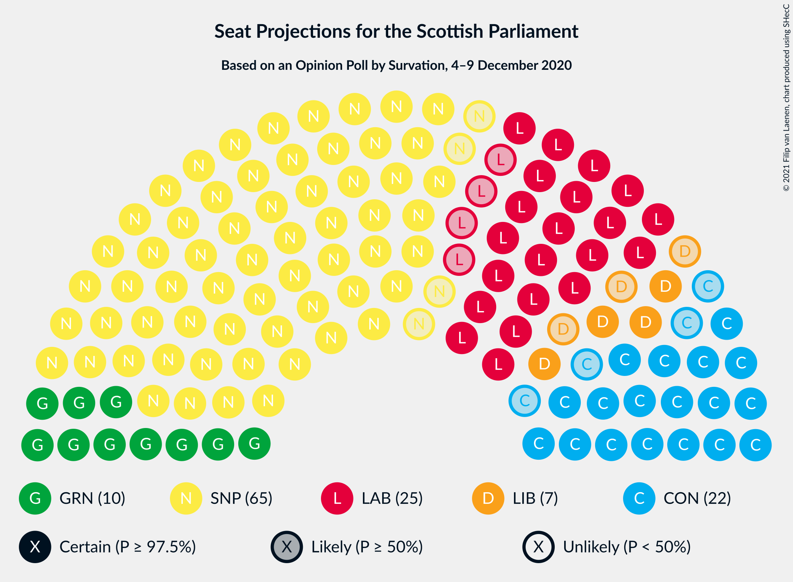
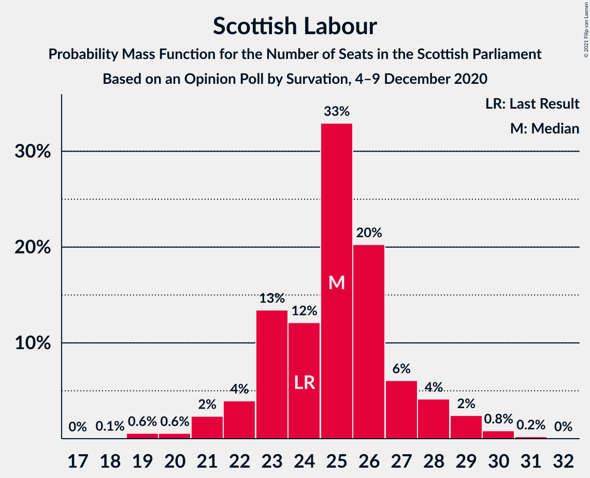
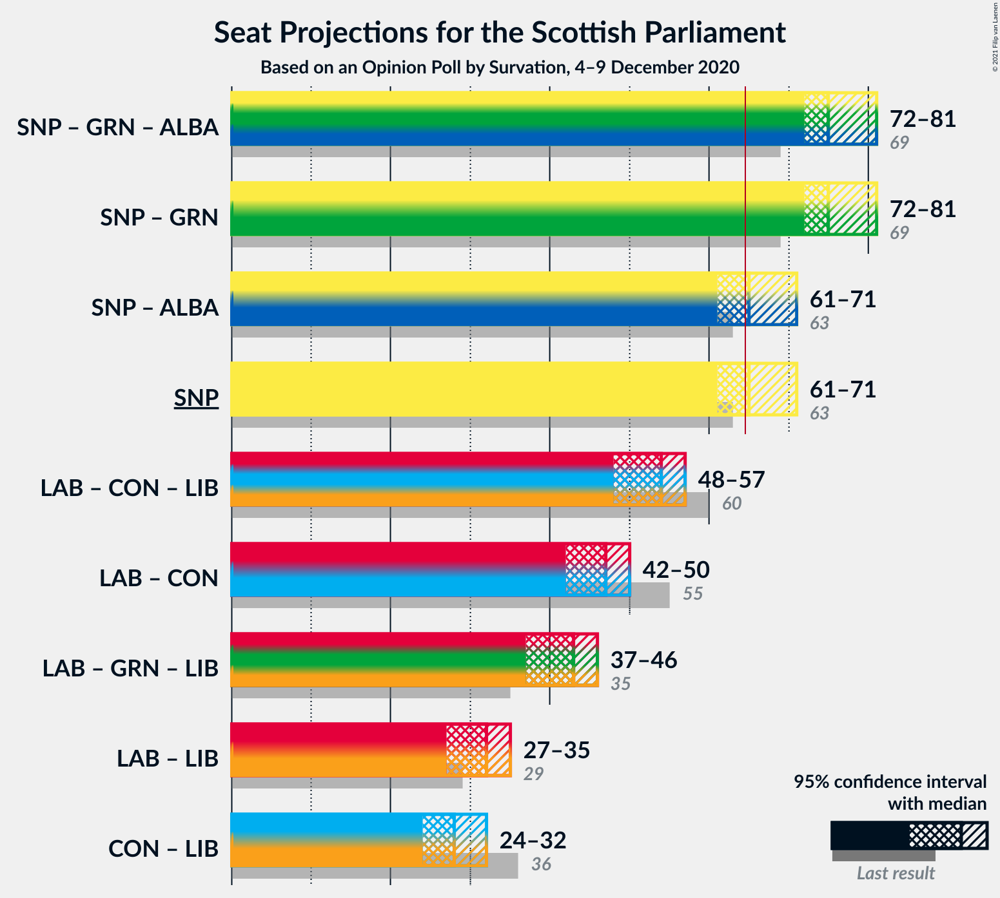

# Opinion Poll by Survation, 4–9 December 2020

<a href="#voting-intentions">Voting Intentions</a> | <a href="#seats">Seats</a> | <a href="#coalitions">Coalitions</a> | <a href="#technical-information">Technical Information</a>

## Voting Intentions

### Confidence Intervals

| Party | Last Result | Poll Result | 80% Confidence Interval | 90% Confidence Interval | 95% Confidence Interval | 99% Confidence Interval |
|:-----:|:-----------:|:-----------:|:-----------------------:|:-----------------------:|:-----------------------:|:-----------------------:|
| Scottish National Party | 41.7% | 41.0% | 39.0–43.0% |38.5–43.6% |38.0–44.1% |37.1–45.0% |
| Scottish Labour | 19.1% | 20.0% | 18.5–21.7% |18.0–22.2% |17.6–22.6% |16.9–23.4% |
| Scottish Conservative & Unionist Party | 22.9% | 18.0% | 16.5–19.6% |16.1–20.1% |15.8–20.5% |15.1–21.3% |
| Scottish Greens | 6.6% | 10.0% | 8.9–11.3% |8.6–11.7% |8.3–12.0% |7.8–12.7% |
| Scottish Liberal Democrats | 5.2% | 7.0% | 6.1–8.2% |5.8–8.5% |5.6–8.8% |5.2–9.4% |
| Reform UK | 0.0% | 1.0% | 0.7–1.5% |0.6–1.7% |0.5–1.8% |0.4–2.1% |

*Note:* The poll result column reflects the actual value used in the calculations. Published results may vary slightly, and in addition be rounded to fewer digits.

## Seats

### Confidence Intervals

| Party | Last Result | Median | 80% Confidence Interval | 90% Confidence Interval | 95% Confidence Interval | 99% Confidence Interval |
|:-----:|:-----------:|:------:|:-----------------------:|:-----------------------:|:-----------------------:|:-----------------------:|
| <a href="#scottish-national-party">Scottish National Party</a> | 63 | 65 | 63–69 |62–70 |61–71 |59–71 |
| <a href="#scottish-labour">Scottish Labour</a> | 24 | 25 | 23–27 |22–28 |21–29 |19–30 |
| <a href="#scottish-conservative-&-unionist-party">Scottish Conservative & Unionist Party</a> | 31 | 22 | 19–23 |19–24 |18–25 |17–26 |
| <a href="#scottish-greens">Scottish Greens</a> | 6 | 10 | 10–13 |10–13 |10–13 |9–14 |
| <a href="#scottish-liberal-democrats">Scottish Liberal Democrats</a> | 5 | 7 | 5–8 |5–8 |4–9 |4–11 |
| <a href="#reform-uk">Reform UK</a> | 0 | 0 | 0 |0 |0 |0 |

### Scottish National Party

*For a full overview of the results for this party, see the [Scottish National Party](party-scottishnationalparty.html) page.*

| Number of Seats | Probability | Accumulated | Special Marks |
|:---------------:|:-----------:|:-----------:|:-------------:|
| 57 | 0% | 100% |  |
| 58 | 0.1% | 99.9% |  |
| 59 | 0.3% | 99.8% |  |
| 60 | 1.3% | 99.5% |  |
| 61 | 2% | 98% |  |
| 62 | 3% | 96% |  |
| 63 | 24% | 93% | Last Result |
| 64 | 14% | 68% |  |
| 65 | 20% | 54% | Median, Majority |
| 66 | 9% | 35% |  |
| 67 | 9% | 26% |  |
| 68 | 4% | 16% |  |
| 69 | 5% | 12% |  |
| 70 | 3% | 7% |  |
| 71 | 4% | 4% |  |
| 72 | 0.1% | 0.1% |  |
| 73 | 0% | 0% |  |

### Scottish Labour

*For a full overview of the results for this party, see the [Scottish Labour](party-scottishlabour.html) page.*

| Number of Seats | Probability | Accumulated | Special Marks |
|:---------------:|:-----------:|:-----------:|:-------------:|
| 18 | 0.1% | 100% |  |
| 19 | 0.6% | 99.9% |  |
| 20 | 0.6% | 99.3% |  |
| 21 | 2% | 98.8% |  |
| 22 | 4% | 96% |  |
| 23 | 13% | 92% |  |
| 24 | 12% | 79% | Last Result |
| 25 | 33% | 67% | Median |
| 26 | 20% | 34% |  |
| 27 | 6% | 14% |  |
| 28 | 4% | 8% |  |
| 29 | 2% | 3% |  |
| 30 | 0.8% | 1.1% |  |
| 31 | 0.2% | 0.2% |  |
| 32 | 0% | 0% |  |

### Scottish Conservative & Unionist Party

*For a full overview of the results for this party, see the [Scottish Conservative & Unionist Party](party-scottishconservativeunionistparty.html) page.*

| Number of Seats | Probability | Accumulated | Special Marks |
|:---------------:|:-----------:|:-----------:|:-------------:|
| 16 | 0.1% | 100% |  |
| 17 | 0.6% | 99.9% |  |
| 18 | 3% | 99.3% |  |
| 19 | 7% | 96% |  |
| 20 | 20% | 90% |  |
| 21 | 18% | 70% |  |
| 22 | 19% | 52% | Median |
| 23 | 24% | 33% |  |
| 24 | 5% | 9% |  |
| 25 | 3% | 4% |  |
| 26 | 1.0% | 1.2% |  |
| 27 | 0.2% | 0.3% |  |
| 28 | 0.1% | 0.1% |  |
| 29 | 0% | 0% |  |
| 30 | 0% | 0% |  |
| 31 | 0% | 0% | Last Result |

### Scottish Greens

*For a full overview of the results for this party, see the [Scottish Greens](party-scottishgreens.html) page.*

| Number of Seats | Probability | Accumulated | Special Marks |
|:---------------:|:-----------:|:-----------:|:-------------:|
| 6 | 0% | 100% | Last Result |
| 7 | 0.1% | 99.9% |  |
| 8 | 0.3% | 99.9% |  |
| 9 | 1.4% | 99.6% |  |
| 10 | 56% | 98% | Median |
| 11 | 16% | 42% |  |
| 12 | 14% | 26% |  |
| 13 | 9% | 11% |  |
| 14 | 2% | 2% |  |
| 15 | 0.2% | 0.2% |  |
| 16 | 0% | 0% |  |

### Scottish Liberal Democrats

*For a full overview of the results for this party, see the [Scottish Liberal Democrats](party-scottishliberaldemocrats.html) page.*

| Number of Seats | Probability | Accumulated | Special Marks |
|:---------------:|:-----------:|:-----------:|:-------------:|
| 4 | 3% | 100% |  |
| 5 | 23% | 97% | Last Result |
| 6 | 23% | 74% |  |
| 7 | 16% | 51% | Median |
| 8 | 31% | 35% |  |
| 9 | 2% | 4% |  |
| 10 | 1.2% | 2% |  |
| 11 | 0.5% | 0.6% |  |
| 12 | 0% | 0% |  |

### Reform UK

*For a full overview of the results for this party, see the [Reform UK](party-reformuk.html) page.*

| Number of Seats | Probability | Accumulated | Special Marks |
|:---------------:|:-----------:|:-----------:|:-------------:|
| 0 | 100% | 100% | Last Result, Median |

## Coalitions

### Confidence Intervals

| Coalition | Last Result | Median | Majority? | 80% Confidence Interval | 90% Confidence Interval | 95% Confidence Interval | 99% Confidence Interval |
|:---------:|:-----------:|:------:|:---------:|:-----------------------:|:-----------------------:|:-----------------------:|:-----------------------:|
| Scottish National Party – Scottish Greens | 69 | 75 | 100% | 73–80 | 73–81 | 72–81 | 70–82 |
| Scottish National Party | 63 | 65 | 54% | 63–69 | 62–70 | 61–71 | 59–71 |
| Scottish Labour – Scottish Conservative & Unionist Party – Scottish Liberal Democrats | 60 | 54 | 0% | 49–56 | 48–56 | 48–57 | 47–59 |
| Scottish Labour – Scottish Conservative & Unionist Party | 55 | 47 | 0% | 43–49 | 42–50 | 42–50 | 40–52 |
| Scottish Labour – Scottish Greens – Scottish Liberal Democrats | 35 | 43 | 0% | 39–45 | 39–46 | 37–46 | 36–48 |
| Scottish Labour – Scottish Liberal Democrats | 29 | 32 | 0% | 29–34 | 28–35 | 27–35 | 26–37 |
| Scottish Conservative & Unionist Party – Scottish Liberal Democrats | 36 | 28 | 0% | 25–30 | 25–31 | 24–32 | 22–34 |

### Scottish National Party – Scottish Greens

| Number of Seats | Probability | Accumulated | Special Marks |
|:---------------:|:-----------:|:-----------:|:-------------:|
| 68 | 0.1% | 100% |  |
| 69 | 0.2% | 99.9% | Last Result |
| 70 | 0.6% | 99.7% |  |
| 71 | 1.1% | 99.1% |  |
| 72 | 2% | 98% |  |
| 73 | 8% | 96% |  |
| 74 | 19% | 87% |  |
| 75 | 22% | 68% | Median |
| 76 | 12% | 46% |  |
| 77 | 10% | 34% |  |
| 78 | 6% | 24% |  |
| 79 | 6% | 18% |  |
| 80 | 6% | 12% |  |
| 81 | 5% | 6% |  |
| 82 | 1.4% | 1.4% |  |
| 83 | 0% | 0% |  |

### Scottish National Party

| Number of Seats | Probability | Accumulated | Special Marks |
|:---------------:|:-----------:|:-----------:|:-------------:|
| 57 | 0% | 100% |  |
| 58 | 0.1% | 99.9% |  |
| 59 | 0.3% | 99.8% |  |
| 60 | 1.3% | 99.5% |  |
| 61 | 2% | 98% |  |
| 62 | 3% | 96% |  |
| 63 | 24% | 93% | Last Result |
| 64 | 14% | 68% |  |
| 65 | 20% | 54% | Median, Majority |
| 66 | 9% | 35% |  |
| 67 | 9% | 26% |  |
| 68 | 4% | 16% |  |
| 69 | 5% | 12% |  |
| 70 | 3% | 7% |  |
| 71 | 4% | 4% |  |
| 72 | 0.1% | 0.1% |  |
| 73 | 0% | 0% |  |

### Scottish Labour – Scottish Conservative & Unionist Party – Scottish Liberal Democrats

| Number of Seats | Probability | Accumulated | Special Marks |
|:---------------:|:-----------:|:-----------:|:-------------:|
| 47 | 1.4% | 100% |  |
| 48 | 5% | 98.6% |  |
| 49 | 6% | 94% |  |
| 50 | 6% | 88% |  |
| 51 | 6% | 82% |  |
| 52 | 10% | 76% |  |
| 53 | 12% | 66% |  |
| 54 | 22% | 54% | Median |
| 55 | 19% | 32% |  |
| 56 | 8% | 13% |  |
| 57 | 2% | 4% |  |
| 58 | 1.1% | 2% |  |
| 59 | 0.6% | 0.9% |  |
| 60 | 0.2% | 0.3% | Last Result |
| 61 | 0.1% | 0.1% |  |
| 62 | 0% | 0% |  |

### Scottish Labour – Scottish Conservative & Unionist Party

| Number of Seats | Probability | Accumulated | Special Marks |
|:---------------:|:-----------:|:-----------:|:-------------:|
| 39 | 0.1% | 100% |  |
| 40 | 0.5% | 99.9% |  |
| 41 | 1.1% | 99.4% |  |
| 42 | 4% | 98% |  |
| 43 | 7% | 94% |  |
| 44 | 7% | 88% |  |
| 45 | 11% | 80% |  |
| 46 | 17% | 69% |  |
| 47 | 16% | 52% | Median |
| 48 | 15% | 35% |  |
| 49 | 14% | 21% |  |
| 50 | 4% | 7% |  |
| 51 | 2% | 2% |  |
| 52 | 0.5% | 1.0% |  |
| 53 | 0.3% | 0.4% |  |
| 54 | 0.1% | 0.2% |  |
| 55 | 0% | 0% | Last Result |

### Scottish Labour – Scottish Greens – Scottish Liberal Democrats

| Number of Seats | Probability | Accumulated | Special Marks |
|:---------------:|:-----------:|:-----------:|:-------------:|
| 35 | 0.3% | 100% | Last Result |
| 36 | 0.2% | 99.7% |  |
| 37 | 2% | 99.5% |  |
| 38 | 2% | 97% |  |
| 39 | 8% | 95% |  |
| 40 | 8% | 87% |  |
| 41 | 13% | 79% |  |
| 42 | 14% | 66% | Median |
| 43 | 21% | 52% |  |
| 44 | 15% | 31% |  |
| 45 | 7% | 16% |  |
| 46 | 8% | 9% |  |
| 47 | 0.8% | 2% |  |
| 48 | 0.6% | 0.9% |  |
| 49 | 0.2% | 0.3% |  |
| 50 | 0.1% | 0.1% |  |
| 51 | 0% | 0% |  |

### Scottish Labour – Scottish Liberal Democrats

| Number of Seats | Probability | Accumulated | Special Marks |
|:---------------:|:-----------:|:-----------:|:-------------:|
| 24 | 0.2% | 100% |  |
| 25 | 0.3% | 99.8% |  |
| 26 | 0.6% | 99.5% |  |
| 27 | 3% | 98.9% |  |
| 28 | 5% | 96% |  |
| 29 | 9% | 91% | Last Result |
| 30 | 13% | 82% |  |
| 31 | 16% | 70% |  |
| 32 | 15% | 53% | Median |
| 33 | 20% | 38% |  |
| 34 | 13% | 18% |  |
| 35 | 3% | 6% |  |
| 36 | 1.4% | 2% |  |
| 37 | 0.5% | 0.8% |  |
| 38 | 0.2% | 0.3% |  |
| 39 | 0.1% | 0.1% |  |
| 40 | 0% | 0% |  |

### Scottish Conservative & Unionist Party – Scottish Liberal Democrats

| Number of Seats | Probability | Accumulated | Special Marks |
|:---------------:|:-----------:|:-----------:|:-------------:|
| 21 | 0.1% | 100% |  |
| 22 | 0.6% | 99.9% |  |
| 23 | 0.8% | 99.3% |  |
| 24 | 3% | 98.5% |  |
| 25 | 7% | 95% |  |
| 26 | 10% | 89% |  |
| 27 | 11% | 79% |  |
| 28 | 23% | 68% |  |
| 29 | 17% | 45% | Median |
| 30 | 19% | 28% |  |
| 31 | 5% | 9% |  |
| 32 | 2% | 4% |  |
| 33 | 1.3% | 2% |  |
| 34 | 0.4% | 0.5% |  |
| 35 | 0.1% | 0.1% |  |
| 36 | 0% | 0% | Last Result |

## Technical Information

### Opinion Poll

+ **Polling firm:** Survation
+ **Commissioner(s):** —
+ **Fieldwork period:** 4–9 December 2020

### Calculations

+ **Sample size:** 1010
+ **Simulations done:** 1,048,576
+ **Error estimate:** 0.52%

