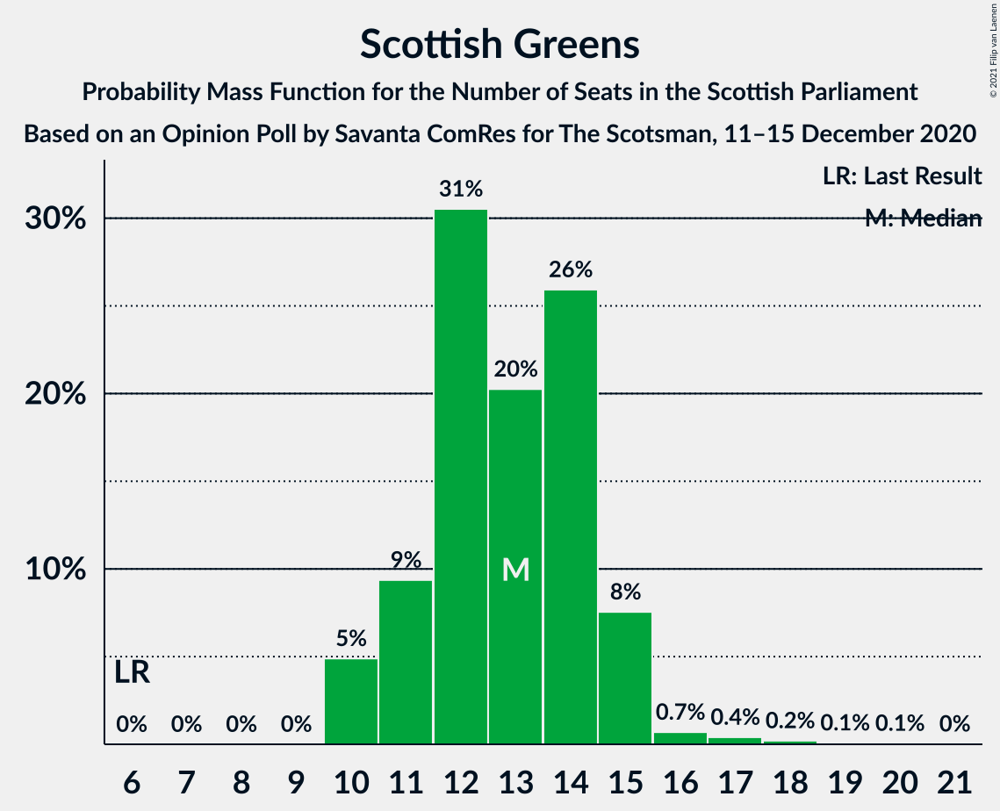

# Opinion Poll by Savanta ComRes for The Scotsman, 11–15 December 2020

<a href="#voting-intentions">Voting Intentions</a> | <a href="#seats">Seats</a> | <a href="#coalitions">Coalitions</a> | <a href="#technical-information">Technical Information</a>

## Voting Intentions

### Confidence Intervals

| Party | Last Result | Poll Result | 80% Confidence Interval | 90% Confidence Interval | 95% Confidence Interval | 99% Confidence Interval |
|:-----:|:-----------:|:-----------:|:-----------------------:|:-----------------------:|:-----------------------:|:-----------------------:|
| Scottish National Party | 41.7% | 42.0% | 40.0–44.0% |39.4–44.5% |38.9–45.0% |38.0–46.0% |
| Scottish Conservative & Unionist Party | 22.9% | 20.0% | 18.5–21.7% |18.1–22.2% |17.7–22.6% |17.0–23.5% |
| Scottish Labour | 19.1% | 17.0% | 15.5–18.6% |15.1–19.0% |14.8–19.4% |14.1–20.2% |
| Scottish Greens | 6.6% | 12.0% | 10.8–13.5% |10.5–13.9% |10.2–14.2% |9.6–14.9% |
| Scottish Liberal Democrats | 5.2% | 7.0% | 6.1–8.2% |5.8–8.5% |5.6–8.8% |5.2–9.3% |

*Note:* The poll result column reflects the actual value used in the calculations. Published results may vary slightly, and in addition be rounded to fewer digits.

## Seats

### Confidence Intervals

| Party | Last Result | Median | 80% Confidence Interval | 90% Confidence Interval | 95% Confidence Interval | 99% Confidence Interval |
|:-----:|:-----------:|:------:|:-----------------------:|:-----------------------:|:-----------------------:|:-----------------------:|
| <a href="#scottish-national-party">Scottish National Party</a> | 63 | 66 | 62–70 |61–70 |61–71 |60–72 |
| <a href="#scottish-conservative-&-unionist-party">Scottish Conservative & Unionist Party</a> | 31 | 24 | 21–27 |20–28 |20–29 |19–30 |
| <a href="#scottish-labour">Scottish Labour</a> | 24 | 19 | 17–23 |17–23 |17–24 |16–25 |
| <a href="#scottish-greens">Scottish Greens</a> | 6 | 13 | 11–14 |11–15 |10–15 |10–17 |
| <a href="#scottish-liberal-democrats">Scottish Liberal Democrats</a> | 5 | 6 | 5–8 |5–8 |5–9 |4–10 |

### Scottish National Party

*For a full overview of the results for this party, see the [Scottish National Party](party-scottishnationalparty.html) page.*

| Number of Seats | Probability | Accumulated | Special Marks |
|:---------------:|:-----------:|:-----------:|:-------------:|
| 59 | 0.2% | 100% |  |
| 60 | 2% | 99.8% |  |
| 61 | 4% | 98% |  |
| 62 | 4% | 94% |  |
| 63 | 10% | 90% | Last Result |
| 64 | 8% | 80% |  |
| 65 | 11% | 71% | Majority |
| 66 | 10% | 60% | Median |
| 67 | 14% | 50% |  |
| 68 | 13% | 36% |  |
| 69 | 11% | 23% |  |
| 70 | 8% | 12% |  |
| 71 | 4% | 5% |  |
| 72 | 0.6% | 0.6% |  |
| 73 | 0% | 0% |  |

### Scottish Conservative & Unionist Party

*For a full overview of the results for this party, see the [Scottish Conservative & Unionist Party](party-scottishconservativeunionistparty.html) page.*

| Number of Seats | Probability | Accumulated | Special Marks |
|:---------------:|:-----------:|:-----------:|:-------------:|
| 18 | 0.1% | 100% |  |
| 19 | 1.4% | 99.9% |  |
| 20 | 4% | 98% |  |
| 21 | 9% | 94% |  |
| 22 | 13% | 85% |  |
| 23 | 17% | 72% |  |
| 24 | 18% | 56% | Median |
| 25 | 14% | 37% |  |
| 26 | 11% | 23% |  |
| 27 | 6% | 12% |  |
| 28 | 2% | 6% |  |
| 29 | 1.5% | 3% |  |
| 30 | 2% | 2% |  |
| 31 | 0.2% | 0.3% | Last Result |
| 32 | 0% | 0.1% |  |
| 33 | 0% | 0% |  |

### Scottish Labour

*For a full overview of the results for this party, see the [Scottish Labour](party-scottishlabour.html) page.*

| Number of Seats | Probability | Accumulated | Special Marks |
|:---------------:|:-----------:|:-----------:|:-------------:|
| 16 | 0.8% | 100% |  |
| 17 | 10% | 99.2% |  |
| 18 | 23% | 90% |  |
| 19 | 20% | 66% | Median |
| 20 | 10% | 47% |  |
| 21 | 12% | 36% |  |
| 22 | 10% | 25% |  |
| 23 | 10% | 15% |  |
| 24 | 3% | 5% | Last Result |
| 25 | 1.5% | 2% |  |
| 26 | 0.1% | 0.1% |  |
| 27 | 0% | 0% |  |

### Scottish Greens

*For a full overview of the results for this party, see the [Scottish Greens](party-scottishgreens.html) page.*

| Number of Seats | Probability | Accumulated | Special Marks |
|:---------------:|:-----------:|:-----------:|:-------------:|
| 6 | 0% | 100% | Last Result |
| 7 | 0% | 100% |  |
| 8 | 0% | 100% |  |
| 9 | 0% | 100% |  |
| 10 | 5% | 100% |  |
| 11 | 9% | 95% |  |
| 12 | 31% | 86% |  |
| 13 | 20% | 55% | Median |
| 14 | 26% | 35% |  |
| 15 | 8% | 9% |  |
| 16 | 0.7% | 1.5% |  |
| 17 | 0.4% | 0.8% |  |
| 18 | 0.2% | 0.4% |  |
| 19 | 0.1% | 0.2% |  |
| 20 | 0.1% | 0.1% |  |
| 21 | 0% | 0% |  |

### Scottish Liberal Democrats

*For a full overview of the results for this party, see the [Scottish Liberal Democrats](party-scottishliberaldemocrats.html) page.*

| Number of Seats | Probability | Accumulated | Special Marks |
|:---------------:|:-----------:|:-----------:|:-------------:|
| 4 | 2% | 100% |  |
| 5 | 31% | 98% | Last Result |
| 6 | 31% | 66% | Median |
| 7 | 18% | 36% |  |
| 8 | 14% | 18% |  |
| 9 | 3% | 4% |  |
| 10 | 0.7% | 1.0% |  |
| 11 | 0.3% | 0.3% |  |
| 12 | 0% | 0% |  |

## Coalitions

### Confidence Intervals

| Coalition | Last Result | Median | Majority? | 80% Confidence Interval | 90% Confidence Interval | 95% Confidence Interval | 99% Confidence Interval |
|:---------:|:-----------:|:------:|:---------:|:-----------------------:|:-----------------------:|:-----------------------:|:-----------------------:|
| Scottish National Party – Scottish Greens | 69 | 79 | 100% | 75–82 | 74–83 | 73–83 | 72–84 |
| Scottish National Party | 63 | 66 | 71% | 62–70 | 61–70 | 61–71 | 60–72 |
| Scottish Conservative & Unionist Party – Scottish Labour – Scottish Liberal Democrats | 60 | 50 | 0% | 47–54 | 46–55 | 46–56 | 45–57 |
| Scottish Conservative & Unionist Party – Scottish Labour | 55 | 44 | 0% | 41–47 | 40–48 | 39–49 | 38–50 |
| Scottish Labour – Scottish Greens – Scottish Liberal Democrats | 35 | 39 | 0% | 36–43 | 35–44 | 34–44 | 33–45 |
| Scottish Conservative & Unionist Party – Scottish Liberal Democrats | 36 | 30 | 0% | 27–34 | 26–34 | 26–35 | 25–37 |
| Scottish Labour – Scottish Liberal Democrats | 29 | 26 | 0% | 23–29 | 23–30 | 22–31 | 22–32 |

### Scottish National Party – Scottish Greens

| Number of Seats | Probability | Accumulated | Special Marks |
|:---------------:|:-----------:|:-----------:|:-------------:|
| 69 | 0% | 100% | Last Result |
| 70 | 0% | 100% |  |
| 71 | 0.1% | 100% |  |
| 72 | 0.7% | 99.8% |  |
| 73 | 2% | 99.2% |  |
| 74 | 5% | 97% |  |
| 75 | 5% | 93% |  |
| 76 | 8% | 88% |  |
| 77 | 11% | 80% |  |
| 78 | 10% | 69% |  |
| 79 | 12% | 59% | Median |
| 80 | 12% | 47% |  |
| 81 | 12% | 35% |  |
| 82 | 14% | 22% |  |
| 83 | 7% | 9% |  |
| 84 | 2% | 2% |  |
| 85 | 0.3% | 0.4% |  |
| 86 | 0.1% | 0.1% |  |
| 87 | 0.1% | 0.1% |  |
| 88 | 0% | 0% |  |

### Scottish National Party

| Number of Seats | Probability | Accumulated | Special Marks |
|:---------------:|:-----------:|:-----------:|:-------------:|
| 59 | 0.2% | 100% |  |
| 60 | 2% | 99.8% |  |
| 61 | 4% | 98% |  |
| 62 | 4% | 94% |  |
| 63 | 10% | 90% | Last Result |
| 64 | 8% | 80% |  |
| 65 | 11% | 71% | Majority |
| 66 | 10% | 60% | Median |
| 67 | 14% | 50% |  |
| 68 | 13% | 36% |  |
| 69 | 11% | 23% |  |
| 70 | 8% | 12% |  |
| 71 | 4% | 5% |  |
| 72 | 0.6% | 0.6% |  |
| 73 | 0% | 0% |  |

### Scottish Conservative & Unionist Party – Scottish Labour – Scottish Liberal Democrats

| Number of Seats | Probability | Accumulated | Special Marks |
|:---------------:|:-----------:|:-----------:|:-------------:|
| 42 | 0.1% | 100% |  |
| 43 | 0.1% | 99.9% |  |
| 44 | 0.3% | 99.9% |  |
| 45 | 2% | 99.6% |  |
| 46 | 7% | 98% |  |
| 47 | 14% | 91% |  |
| 48 | 12% | 78% |  |
| 49 | 12% | 65% | Median |
| 50 | 12% | 53% |  |
| 51 | 10% | 41% |  |
| 52 | 11% | 31% |  |
| 53 | 8% | 20% |  |
| 54 | 5% | 12% |  |
| 55 | 5% | 7% |  |
| 56 | 2% | 3% |  |
| 57 | 0.7% | 0.8% |  |
| 58 | 0.1% | 0.2% |  |
| 59 | 0% | 0% |  |
| 60 | 0% | 0% | Last Result |

### Scottish Conservative & Unionist Party – Scottish Labour

| Number of Seats | Probability | Accumulated | Special Marks |
|:---------------:|:-----------:|:-----------:|:-------------:|
| 36 | 0.1% | 100% |  |
| 37 | 0.2% | 99.9% |  |
| 38 | 1.1% | 99.7% |  |
| 39 | 2% | 98.7% |  |
| 40 | 5% | 96% |  |
| 41 | 12% | 92% |  |
| 42 | 16% | 79% |  |
| 43 | 12% | 63% | Median |
| 44 | 15% | 51% |  |
| 45 | 11% | 36% |  |
| 46 | 8% | 25% |  |
| 47 | 8% | 17% |  |
| 48 | 4% | 9% |  |
| 49 | 3% | 4% |  |
| 50 | 1.1% | 2% |  |
| 51 | 0.4% | 0.5% |  |
| 52 | 0.1% | 0.1% |  |
| 53 | 0% | 0% |  |
| 54 | 0% | 0% |  |
| 55 | 0% | 0% | Last Result |

### Scottish Labour – Scottish Greens – Scottish Liberal Democrats

| Number of Seats | Probability | Accumulated | Special Marks |
|:---------------:|:-----------:|:-----------:|:-------------:|
| 32 | 0.1% | 100% |  |
| 33 | 0.8% | 99.9% |  |
| 34 | 3% | 99.2% |  |
| 35 | 6% | 96% | Last Result |
| 36 | 11% | 90% |  |
| 37 | 12% | 79% |  |
| 38 | 13% | 68% | Median |
| 39 | 14% | 54% |  |
| 40 | 12% | 40% |  |
| 41 | 11% | 28% |  |
| 42 | 7% | 18% |  |
| 43 | 5% | 10% |  |
| 44 | 4% | 5% |  |
| 45 | 1.5% | 2% |  |
| 46 | 0.3% | 0.4% |  |
| 47 | 0% | 0% |  |

### Scottish Conservative & Unionist Party – Scottish Liberal Democrats

| Number of Seats | Probability | Accumulated | Special Marks |
|:---------------:|:-----------:|:-----------:|:-------------:|
| 23 | 0.1% | 100% |  |
| 24 | 0.1% | 99.9% |  |
| 25 | 0.9% | 99.8% |  |
| 26 | 5% | 98.9% |  |
| 27 | 7% | 94% |  |
| 28 | 15% | 87% |  |
| 29 | 18% | 73% |  |
| 30 | 15% | 55% | Median |
| 31 | 11% | 40% |  |
| 32 | 11% | 29% |  |
| 33 | 6% | 18% |  |
| 34 | 7% | 11% |  |
| 35 | 2% | 5% |  |
| 36 | 2% | 2% | Last Result |
| 37 | 0.4% | 0.5% |  |
| 38 | 0.1% | 0.1% |  |
| 39 | 0% | 0% |  |

### Scottish Labour – Scottish Liberal Democrats

| Number of Seats | Probability | Accumulated | Special Marks |
|:---------------:|:-----------:|:-----------:|:-------------:|
| 21 | 0.3% | 100% |  |
| 22 | 4% | 99.7% |  |
| 23 | 10% | 95% |  |
| 24 | 15% | 85% |  |
| 25 | 15% | 70% | Median |
| 26 | 15% | 55% |  |
| 27 | 13% | 40% |  |
| 28 | 9% | 27% |  |
| 29 | 9% | 19% | Last Result |
| 30 | 5% | 10% |  |
| 31 | 3% | 5% |  |
| 32 | 1.4% | 2% |  |
| 33 | 0.4% | 0.4% |  |
| 34 | 0% | 0% |  |

## Technical Information

### Opinion Poll

+ **Polling firm:** Savanta ComRes
+ **Commissioner(s):** The Scotsman
+ **Fieldwork period:** 11–15 December 2020

### Calculations

+ **Sample size:** 1013
+ **Simulations done:** 1,048,576
+ **Error estimate:** 0.40%

