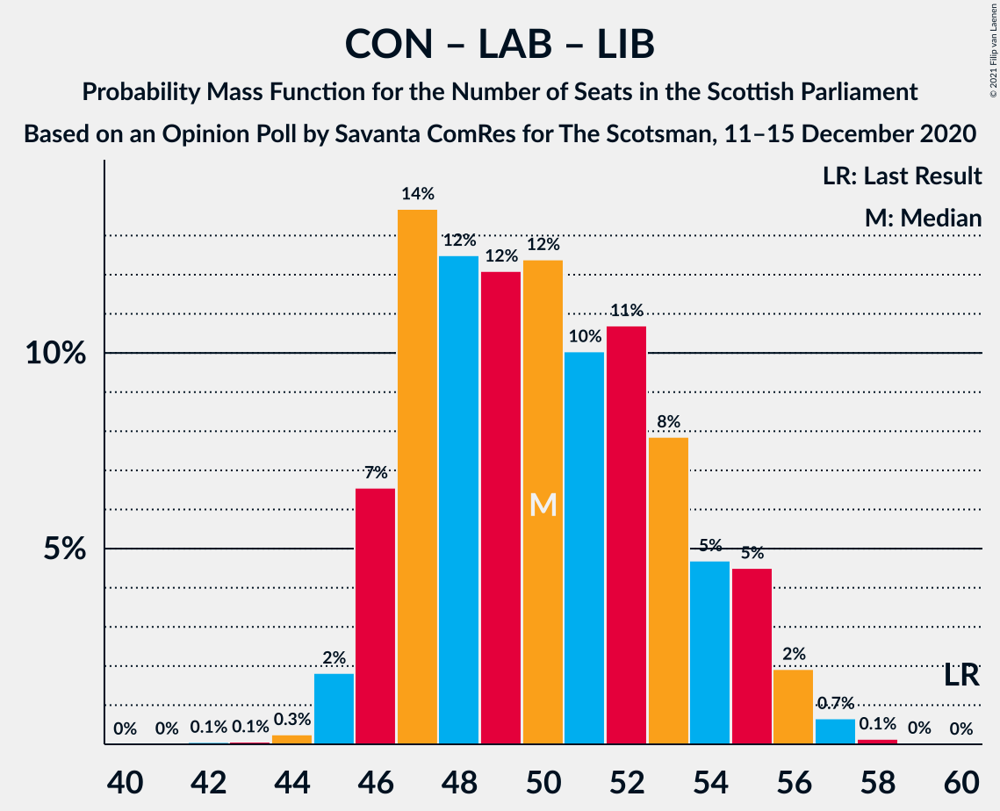
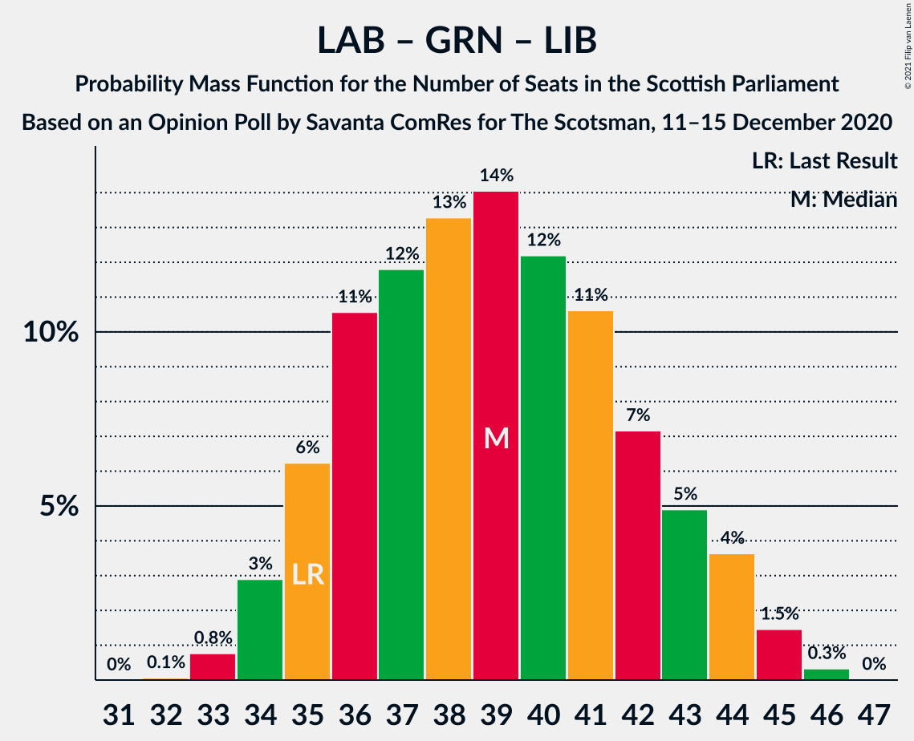

# Opinion Poll by Savanta ComRes for The Scotsman, 11–15 December 2020

<a href="#voting-intentions">Voting Intentions</a> | <a href="#seats">Seats</a> | <a href="#coalitions">Coalitions</a> | <a href="#technical-information">Technical Information</a>

## Voting Intentions

### Confidence Intervals

| Party | Last Result | Poll Result | 80% Confidence Interval | 90% Confidence Interval | 95% Confidence Interval | 99% Confidence Interval |
|:-----:|:-----------:|:-----------:|:-----------------------:|:-----------------------:|:-----------------------:|:-----------------------:|
| Scottish National Party | 41.7% | 42.0% | 40.0–44.0% |39.4–44.5% |38.9–45.0% |38.0–46.0% |
| Scottish Conservative & Unionist Party | 22.9% | 20.0% | 18.5–21.7% |18.1–22.2% |17.7–22.6% |17.0–23.5% |
| Scottish Labour | 19.1% | 17.0% | 15.5–18.6% |15.1–19.0% |14.8–19.4% |14.1–20.2% |
| Scottish Greens | 6.6% | 12.0% | 10.8–13.5% |10.5–13.9% |10.2–14.2% |9.6–14.9% |
| Scottish Liberal Democrats | 5.2% | 7.0% | 6.1–8.2% |5.8–8.5% |5.6–8.8% |5.2–9.3% |

*Note:* The poll result column reflects the actual value used in the calculations. Published results may vary slightly, and in addition be rounded to fewer digits.

## Seats

### Confidence Intervals

| Party | Last Result | Median | 80% Confidence Interval | 90% Confidence Interval | 95% Confidence Interval | 99% Confidence Interval |
|:-----:|:-----------:|:------:|:-----------------------:|:-----------------------:|:-----------------------:|:-----------------------:|
| <a href="#scottish-national-party">Scottish National Party</a> | 63 | 70 | 69–71 |68–71 |67–72 |65–72 |
| <a href="#scottish-conservative-&-unionist-party">Scottish Conservative & Unionist Party</a> | 31 | 23 | 21–24 |20–24 |19–25 |18–28 |
| <a href="#scottish-labour">Scottish Labour</a> | 24 | 19 | 17–21 |17–21 |17–22 |16–23 |
| <a href="#scottish-greens">Scottish Greens</a> | 6 | 12 | 11–13 |10–13 |10–14 |10–16 |
| <a href="#scottish-liberal-democrats">Scottish Liberal Democrats</a> | 5 | 6 | 4–7 |4–8 |4–9 |4–9 |

### Scottish National Party

*For a full overview of the results for this party, see the [Scottish National Party](party-scottishnationalparty.html) page.*

| Number of Seats | Probability | Accumulated | Special Marks |
|:---------------:|:-----------:|:-----------:|:-------------:|
| 63 | 0.1% | 100% | Last Result |
| 64 | 0.4% | 99.9% |  |
| 65 | 0.4% | 99.5% | Majority |
| 66 | 0.4% | 99.2% |  |
| 67 | 2% | 98.7% |  |
| 68 | 5% | 96% |  |
| 69 | 20% | 91% |  |
| 70 | 38% | 72% | Median |
| 71 | 30% | 34% |  |
| 72 | 4% | 4% |  |
| 73 | 0.1% | 0.1% |  |
| 74 | 0% | 0% |  |

### Scottish Conservative & Unionist Party

*For a full overview of the results for this party, see the [Scottish Conservative & Unionist Party](party-scottishconservativeunionistparty.html) page.*

| Number of Seats | Probability | Accumulated | Special Marks |
|:---------------:|:-----------:|:-----------:|:-------------:|
| 18 | 0.5% | 100% |  |
| 19 | 2% | 99.5% |  |
| 20 | 6% | 97% |  |
| 21 | 21% | 92% |  |
| 22 | 18% | 71% |  |
| 23 | 36% | 53% | Median |
| 24 | 13% | 17% |  |
| 25 | 3% | 5% |  |
| 26 | 0.5% | 2% |  |
| 27 | 0.4% | 1.1% |  |
| 28 | 0.3% | 0.7% |  |
| 29 | 0.2% | 0.4% |  |
| 30 | 0.2% | 0.2% |  |
| 31 | 0% | 0% | Last Result |

### Scottish Labour

*For a full overview of the results for this party, see the [Scottish Labour](party-scottishlabour.html) page.*

| Number of Seats | Probability | Accumulated | Special Marks |
|:---------------:|:-----------:|:-----------:|:-------------:|
| 15 | 0.1% | 100% |  |
| 16 | 1.2% | 99.8% |  |
| 17 | 9% | 98.6% |  |
| 18 | 39% | 89% |  |
| 19 | 22% | 51% | Median |
| 20 | 10% | 29% |  |
| 21 | 15% | 19% |  |
| 22 | 3% | 4% |  |
| 23 | 0.7% | 1.0% |  |
| 24 | 0.3% | 0.3% | Last Result |
| 25 | 0% | 0% |  |

### Scottish Greens

*For a full overview of the results for this party, see the [Scottish Greens](party-scottishgreens.html) page.*

| Number of Seats | Probability | Accumulated | Special Marks |
|:---------------:|:-----------:|:-----------:|:-------------:|
| 6 | 0% | 100% | Last Result |
| 7 | 0% | 100% |  |
| 8 | 0% | 100% |  |
| 9 | 0% | 100% |  |
| 10 | 6% | 100% |  |
| 11 | 23% | 94% |  |
| 12 | 58% | 71% | Median |
| 13 | 10% | 13% |  |
| 14 | 2% | 3% |  |
| 15 | 0.7% | 1.2% |  |
| 16 | 0.2% | 0.5% |  |
| 17 | 0.2% | 0.3% |  |
| 18 | 0.1% | 0.2% |  |
| 19 | 0.1% | 0.1% |  |
| 20 | 0% | 0% |  |

### Scottish Liberal Democrats

*For a full overview of the results for this party, see the [Scottish Liberal Democrats](party-scottishliberaldemocrats.html) page.*

| Number of Seats | Probability | Accumulated | Special Marks |
|:---------------:|:-----------:|:-----------:|:-------------:|
| 3 | 0.1% | 100% |  |
| 4 | 13% | 99.9% |  |
| 5 | 19% | 87% | Last Result |
| 6 | 44% | 68% | Median |
| 7 | 16% | 24% |  |
| 8 | 5% | 8% |  |
| 9 | 3% | 3% |  |
| 10 | 0.5% | 0.5% |  |
| 11 | 0% | 0% |  |

## Coalitions

### Confidence Intervals

| Coalition | Last Result | Median | Majority? | 80% Confidence Interval | 90% Confidence Interval | 95% Confidence Interval | 99% Confidence Interval |
|:---------:|:-----------:|:------:|:---------:|:-----------------------:|:-----------------------:|:-----------------------:|:-----------------------:|
| Scottish National Party – Scottish Greens | 69 | 82 | 100% | 81–83 | 80–84 | 79–84 | 76–85 |
| Scottish National Party | 63 | 70 | 99.5% | 69–71 | 68–71 | 67–72 | 65–72 |
| Scottish Conservative & Unionist Party – Scottish Labour – Scottish Liberal Democrats | 60 | 47 | 0% | 46–48 | 45–49 | 45–50 | 44–53 |
| Scottish Conservative & Unionist Party – Scottish Labour | 55 | 41 | 0% | 40–42 | 39–43 | 38–43 | 37–47 |
| Scottish Labour – Scottish Greens – Scottish Liberal Democrats | 35 | 37 | 0% | 35–39 | 34–39 | 34–40 | 33–42 |
| Scottish Conservative & Unionist Party – Scottish Liberal Democrats | 36 | 28 | 0% | 26–30 | 25–31 | 25–31 | 24–34 |
| Scottish Labour – Scottish Liberal Democrats | 29 | 25 | 0% | 23–27 | 22–27 | 22–28 | 21–30 |

### Scottish National Party – Scottish Greens

| Number of Seats | Probability | Accumulated | Special Marks |
|:---------------:|:-----------:|:-----------:|:-------------:|
| 69 | 0% | 100% | Last Result |
| 70 | 0% | 100% |  |
| 71 | 0% | 100% |  |
| 72 | 0% | 100% |  |
| 73 | 0% | 100% |  |
| 74 | 0% | 100% |  |
| 75 | 0.1% | 100% |  |
| 76 | 0.4% | 99.9% |  |
| 77 | 0.3% | 99.4% |  |
| 78 | 0.6% | 99.2% |  |
| 79 | 2% | 98.5% |  |
| 80 | 4% | 97% |  |
| 81 | 35% | 93% |  |
| 82 | 33% | 58% | Median |
| 83 | 19% | 25% |  |
| 84 | 4% | 6% |  |
| 85 | 1.0% | 2% |  |
| 86 | 0.2% | 0.5% |  |
| 87 | 0.2% | 0.3% |  |
| 88 | 0.1% | 0.2% |  |
| 89 | 0.1% | 0.1% |  |
| 90 | 0% | 0% |  |

### Scottish National Party

| Number of Seats | Probability | Accumulated | Special Marks |
|:---------------:|:-----------:|:-----------:|:-------------:|
| 63 | 0.1% | 100% | Last Result |
| 64 | 0.4% | 99.9% |  |
| 65 | 0.4% | 99.5% | Majority |
| 66 | 0.4% | 99.2% |  |
| 67 | 2% | 98.7% |  |
| 68 | 5% | 96% |  |
| 69 | 20% | 91% |  |
| 70 | 38% | 72% | Median |
| 71 | 30% | 34% |  |
| 72 | 4% | 4% |  |
| 73 | 0.1% | 0.1% |  |
| 74 | 0% | 0% |  |

### Scottish Conservative & Unionist Party – Scottish Labour – Scottish Liberal Democrats

| Number of Seats | Probability | Accumulated | Special Marks |
|:---------------:|:-----------:|:-----------:|:-------------:|
| 40 | 0.1% | 100% |  |
| 41 | 0.1% | 99.9% |  |
| 42 | 0.2% | 99.8% |  |
| 43 | 0.2% | 99.7% |  |
| 44 | 1.0% | 99.5% |  |
| 45 | 4% | 98% |  |
| 46 | 19% | 94% |  |
| 47 | 33% | 75% |  |
| 48 | 35% | 42% | Median |
| 49 | 4% | 7% |  |
| 50 | 2% | 3% |  |
| 51 | 0.6% | 1.5% |  |
| 52 | 0.3% | 0.8% |  |
| 53 | 0.4% | 0.6% |  |
| 54 | 0.1% | 0.1% |  |
| 55 | 0% | 0% |  |
| 56 | 0% | 0% |  |
| 57 | 0% | 0% |  |
| 58 | 0% | 0% |  |
| 59 | 0% | 0% |  |
| 60 | 0% | 0% | Last Result |

### Scottish Conservative & Unionist Party – Scottish Labour

| Number of Seats | Probability | Accumulated | Special Marks |
|:---------------:|:-----------:|:-----------:|:-------------:|
| 35 | 0.1% | 100% |  |
| 36 | 0.1% | 99.9% |  |
| 37 | 0.4% | 99.8% |  |
| 38 | 2% | 99.4% |  |
| 39 | 4% | 97% |  |
| 40 | 11% | 93% |  |
| 41 | 37% | 82% |  |
| 42 | 39% | 45% | Median |
| 43 | 5% | 7% |  |
| 44 | 0.6% | 2% |  |
| 45 | 0.2% | 1.5% |  |
| 46 | 0.4% | 1.3% |  |
| 47 | 0.6% | 0.9% |  |
| 48 | 0.3% | 0.3% |  |
| 49 | 0% | 0.1% |  |
| 50 | 0% | 0% |  |
| 51 | 0% | 0% |  |
| 52 | 0% | 0% |  |
| 53 | 0% | 0% |  |
| 54 | 0% | 0% |  |
| 55 | 0% | 0% | Last Result |

### Scottish Labour – Scottish Greens – Scottish Liberal Democrats

| Number of Seats | Probability | Accumulated | Special Marks |
|:---------------:|:-----------:|:-----------:|:-------------:|
| 32 | 0.3% | 100% |  |
| 33 | 2% | 99.7% |  |
| 34 | 7% | 98% |  |
| 35 | 16% | 90% | Last Result |
| 36 | 24% | 74% |  |
| 37 | 19% | 50% | Median |
| 38 | 16% | 31% |  |
| 39 | 10% | 15% |  |
| 40 | 3% | 5% |  |
| 41 | 2% | 2% |  |
| 42 | 0.5% | 0.6% |  |
| 43 | 0.1% | 0.2% |  |
| 44 | 0% | 0% |  |

### Scottish Conservative & Unionist Party – Scottish Liberal Democrats

| Number of Seats | Probability | Accumulated | Special Marks |
|:---------------:|:-----------:|:-----------:|:-------------:|
| 22 | 0.1% | 100% |  |
| 23 | 0.4% | 99.9% |  |
| 24 | 0.5% | 99.5% |  |
| 25 | 4% | 99.0% |  |
| 26 | 7% | 95% |  |
| 27 | 17% | 88% |  |
| 28 | 24% | 72% |  |
| 29 | 30% | 48% | Median |
| 30 | 12% | 18% |  |
| 31 | 4% | 6% |  |
| 32 | 1.1% | 2% |  |
| 33 | 0.6% | 1.3% |  |
| 34 | 0.3% | 0.6% |  |
| 35 | 0.2% | 0.3% |  |
| 36 | 0% | 0.1% | Last Result |
| 37 | 0% | 0% |  |

### Scottish Labour – Scottish Liberal Democrats

| Number of Seats | Probability | Accumulated | Special Marks |
|:---------------:|:-----------:|:-----------:|:-------------:|
| 19 | 0.1% | 100% |  |
| 20 | 0.1% | 99.9% |  |
| 21 | 2% | 99.9% |  |
| 22 | 6% | 98% |  |
| 23 | 14% | 92% |  |
| 24 | 25% | 78% |  |
| 25 | 18% | 54% | Median |
| 26 | 15% | 35% |  |
| 27 | 16% | 20% |  |
| 28 | 2% | 4% |  |
| 29 | 0.8% | 1.5% | Last Result |
| 30 | 0.5% | 0.6% |  |
| 31 | 0.1% | 0.1% |  |
| 32 | 0% | 0% |  |

## Technical Information

### Opinion Poll

+ **Polling firm:** Savanta ComRes
+ **Commissioner(s):** The Scotsman
+ **Fieldwork period:** 11–15 December 2020

### Calculations

+ **Sample size:** 1013
+ **Simulations done:** 131,072
+ **Error estimate:** 2.26%

