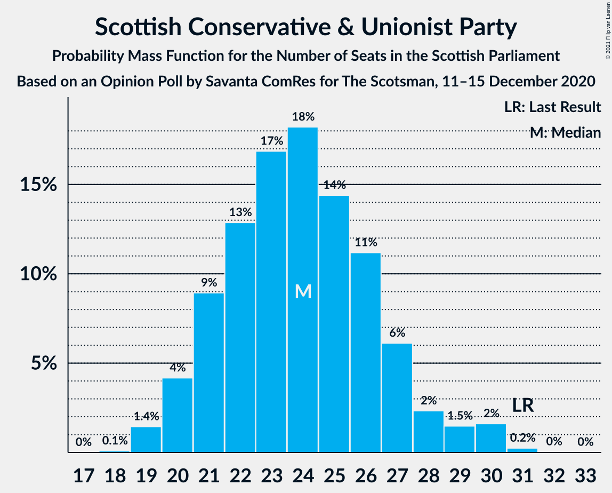
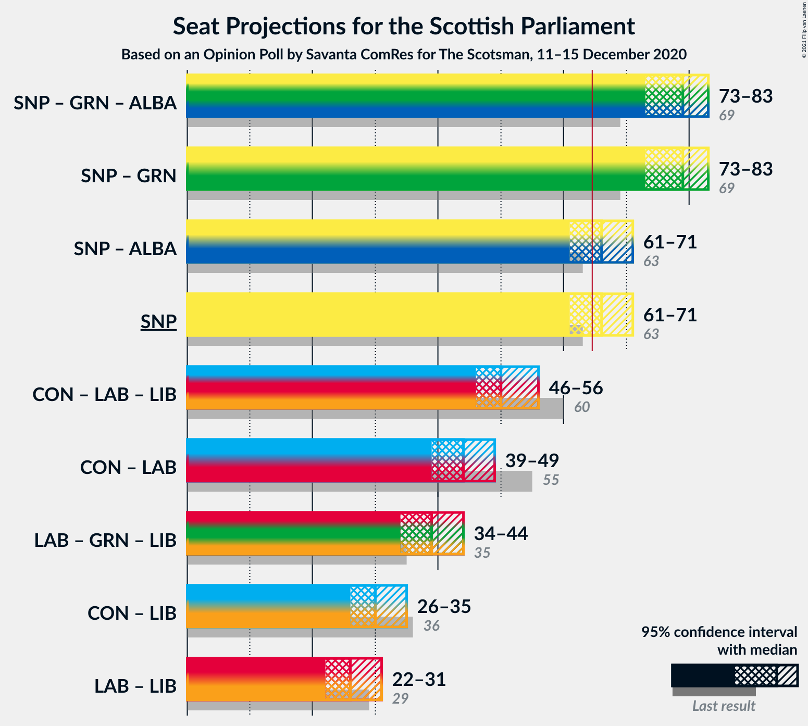

# Opinion Poll by Savanta ComRes for The Scotsman, 11–15 December 2020

<a href="#voting-intentions">Voting Intentions</a> | <a href="#seats">Seats</a> | <a href="#coalitions">Coalitions</a> | <a href="#technical-information">Technical Information</a>

## Voting Intentions

### Confidence Intervals

| Party | Last Result | Poll Result | 80% Confidence Interval | 90% Confidence Interval | 95% Confidence Interval | 99% Confidence Interval |
|:-----:|:-----------:|:-----------:|:-----------------------:|:-----------------------:|:-----------------------:|:-----------------------:|
| Scottish National Party | 41.7% | 42.0% | 40.0–44.0% |39.4–44.5% |38.9–45.0% |38.0–46.0% |
| Scottish Conservative & Unionist Party | 22.9% | 20.0% | 18.5–21.7% |18.1–22.2% |17.7–22.6% |17.0–23.5% |
| Scottish Labour | 19.1% | 17.0% | 15.5–18.6% |15.1–19.0% |14.8–19.4% |14.1–20.2% |
| Scottish Greens | 6.6% | 12.0% | 10.8–13.5% |10.5–13.9% |10.2–14.2% |9.6–14.9% |
| Scottish Liberal Democrats | 5.2% | 7.0% | 6.1–8.2% |5.8–8.5% |5.6–8.8% |5.2–9.3% |

*Note:* The poll result column reflects the actual value used in the calculations. Published results may vary slightly, and in addition be rounded to fewer digits.

## Seats

### Confidence Intervals

| Party | Last Result | Median | 80% Confidence Interval | 90% Confidence Interval | 95% Confidence Interval | 99% Confidence Interval |
|:-----:|:-----------:|:------:|:-----------------------:|:-----------------------:|:-----------------------:|:-----------------------:|
| <a href="#scottish-national-party">Scottish National Party</a> | 63 | 67 | 63–70 |61–71 |61–71 |60–72 |
| <a href="#scottish-conservative-&-unionist-party">Scottish Conservative & Unionist Party</a> | 31 | 24 | 21–27 |20–27 |20–29 |19–30 |
| <a href="#scottish-labour">Scottish Labour</a> | 24 | 19 | 17–23 |17–23 |17–24 |16–25 |
| <a href="#scottish-greens">Scottish Greens</a> | 6 | 12 | 11–14 |11–15 |10–15 |10–17 |
| <a href="#scottish-liberal-democrats">Scottish Liberal Democrats</a> | 5 | 6 | 5–8 |5–8 |4–9 |4–10 |

### Scottish National Party

*For a full overview of the results for this party, see the [Scottish National Party](party-scottishnationalparty.html) page.*

| Number of Seats | Probability | Accumulated | Special Marks |
|:---------------:|:-----------:|:-----------:|:-------------:|
| 59 | 0.2% | 100% |  |
| 60 | 2% | 99.8% |  |
| 61 | 3% | 98% |  |
| 62 | 3% | 95% |  |
| 63 | 9% | 92% | Last Result |
| 64 | 7% | 83% |  |
| 65 | 11% | 76% | Majority |
| 66 | 9% | 65% |  |
| 67 | 11% | 56% | Median |
| 68 | 12% | 44% |  |
| 69 | 12% | 32% |  |
| 70 | 12% | 21% |  |
| 71 | 8% | 9% |  |
| 72 | 1.1% | 1.1% |  |
| 73 | 0% | 0% |  |

### Scottish Conservative & Unionist Party

*For a full overview of the results for this party, see the [Scottish Conservative & Unionist Party](party-scottishconservativeunionistparty.html) page.*

| Number of Seats | Probability | Accumulated | Special Marks |
|:---------------:|:-----------:|:-----------:|:-------------:|
| 18 | 0.1% | 100% |  |
| 19 | 1.4% | 99.8% |  |
| 20 | 4% | 98% |  |
| 21 | 10% | 94% |  |
| 22 | 14% | 84% |  |
| 23 | 19% | 71% |  |
| 24 | 18% | 51% | Median |
| 25 | 13% | 34% |  |
| 26 | 10% | 21% |  |
| 27 | 5% | 10% |  |
| 28 | 2% | 5% |  |
| 29 | 1.3% | 3% |  |
| 30 | 1.3% | 2% |  |
| 31 | 0.2% | 0.2% | Last Result |
| 32 | 0% | 0% |  |

### Scottish Labour

*For a full overview of the results for this party, see the [Scottish Labour](party-scottishlabour.html) page.*

| Number of Seats | Probability | Accumulated | Special Marks |
|:---------------:|:-----------:|:-----------:|:-------------:|
| 15 | 0% | 100% |  |
| 16 | 0.8% | 99.9% |  |
| 17 | 9% | 99.1% |  |
| 18 | 26% | 90% |  |
| 19 | 20% | 64% | Median |
| 20 | 10% | 44% |  |
| 21 | 13% | 34% |  |
| 22 | 8% | 21% |  |
| 23 | 8% | 13% |  |
| 24 | 3% | 4% | Last Result |
| 25 | 1.2% | 1.3% |  |
| 26 | 0.1% | 0.1% |  |
| 27 | 0% | 0% |  |

### Scottish Greens

*For a full overview of the results for this party, see the [Scottish Greens](party-scottishgreens.html) page.*

| Number of Seats | Probability | Accumulated | Special Marks |
|:---------------:|:-----------:|:-----------:|:-------------:|
| 6 | 0% | 100% | Last Result |
| 7 | 0% | 100% |  |
| 8 | 0% | 100% |  |
| 9 | 0% | 100% |  |
| 10 | 5% | 100% |  |
| 11 | 12% | 95% |  |
| 12 | 35% | 84% | Median |
| 13 | 18% | 49% |  |
| 14 | 22% | 30% |  |
| 15 | 7% | 8% |  |
| 16 | 0.7% | 1.4% |  |
| 17 | 0.4% | 0.7% |  |
| 18 | 0.2% | 0.4% |  |
| 19 | 0.1% | 0.1% |  |
| 20 | 0.1% | 0.1% |  |
| 21 | 0% | 0% |  |

### Scottish Liberal Democrats

*For a full overview of the results for this party, see the [Scottish Liberal Democrats](party-scottishliberaldemocrats.html) page.*

| Number of Seats | Probability | Accumulated | Special Marks |
|:---------------:|:-----------:|:-----------:|:-------------:|
| 4 | 4% | 100% |  |
| 5 | 30% | 96% | Last Result |
| 6 | 32% | 66% | Median |
| 7 | 17% | 34% |  |
| 8 | 13% | 17% |  |
| 9 | 3% | 4% |  |
| 10 | 0.6% | 0.9% |  |
| 11 | 0.2% | 0.2% |  |
| 12 | 0% | 0% |  |

## Coalitions

### Confidence Intervals

| Coalition | Last Result | Median | Majority? | 80% Confidence Interval | 90% Confidence Interval | 95% Confidence Interval | 99% Confidence Interval |
|:---------:|:-----------:|:------:|:---------:|:-----------------------:|:-----------------------:|:-----------------------:|:-----------------------:|
| Scottish National Party – Scottish Greens | 69 | 80 | 100% | 76–83 | 74–83 | 74–84 | 72–85 |
| Scottish National Party | 63 | 67 | 76% | 63–70 | 61–71 | 61–71 | 60–72 |
| Scottish Conservative & Unionist Party – Scottish Labour – Scottish Liberal Democrats | 60 | 49 | 0% | 46–53 | 46–55 | 45–55 | 44–57 |
| Scottish Conservative & Unionist Party – Scottish Labour | 55 | 43 | 0% | 41–47 | 40–48 | 39–49 | 38–50 |
| Scottish Labour – Scottish Greens – Scottish Liberal Democrats | 35 | 38 | 0% | 35–42 | 35–43 | 34–44 | 33–45 |
| Scottish Conservative & Unionist Party – Scottish Liberal Democrats | 36 | 30 | 0% | 27–34 | 26–34 | 26–35 | 25–36 |
| Scottish Labour – Scottish Liberal Democrats | 29 | 26 | 0% | 23–29 | 23–30 | 22–31 | 21–32 |

### Scottish National Party – Scottish Greens

| Number of Seats | Probability | Accumulated | Special Marks |
|:---------------:|:-----------:|:-----------:|:-------------:|
| 69 | 0% | 100% | Last Result |
| 70 | 0% | 100% |  |
| 71 | 0.1% | 100% |  |
| 72 | 0.6% | 99.9% |  |
| 73 | 2% | 99.3% |  |
| 74 | 4% | 98% |  |
| 75 | 4% | 94% |  |
| 76 | 8% | 90% |  |
| 77 | 9% | 82% |  |
| 78 | 10% | 74% |  |
| 79 | 10% | 64% | Median |
| 80 | 11% | 54% |  |
| 81 | 15% | 43% |  |
| 82 | 17% | 28% |  |
| 83 | 8% | 11% |  |
| 84 | 2% | 3% |  |
| 85 | 0.4% | 0.6% |  |
| 86 | 0.1% | 0.2% |  |
| 87 | 0.1% | 0.1% |  |
| 88 | 0% | 0% |  |

### Scottish National Party

| Number of Seats | Probability | Accumulated | Special Marks |
|:---------------:|:-----------:|:-----------:|:-------------:|
| 59 | 0.2% | 100% |  |
| 60 | 2% | 99.8% |  |
| 61 | 3% | 98% |  |
| 62 | 3% | 95% |  |
| 63 | 9% | 92% | Last Result |
| 64 | 7% | 83% |  |
| 65 | 11% | 76% | Majority |
| 66 | 9% | 65% |  |
| 67 | 11% | 56% | Median |
| 68 | 12% | 44% |  |
| 69 | 12% | 32% |  |
| 70 | 12% | 21% |  |
| 71 | 8% | 9% |  |
| 72 | 1.1% | 1.1% |  |
| 73 | 0% | 0% |  |

### Scottish Conservative & Unionist Party – Scottish Labour – Scottish Liberal Democrats

| Number of Seats | Probability | Accumulated | Special Marks |
|:---------------:|:-----------:|:-----------:|:-------------:|
| 42 | 0.1% | 100% |  |
| 43 | 0.1% | 99.9% |  |
| 44 | 0.4% | 99.8% |  |
| 45 | 2% | 99.4% |  |
| 46 | 8% | 97% |  |
| 47 | 17% | 89% |  |
| 48 | 15% | 72% |  |
| 49 | 11% | 57% | Median |
| 50 | 10% | 46% |  |
| 51 | 10% | 36% |  |
| 52 | 9% | 26% |  |
| 53 | 8% | 18% |  |
| 54 | 4% | 10% |  |
| 55 | 4% | 6% |  |
| 56 | 2% | 2% |  |
| 57 | 0.6% | 0.7% |  |
| 58 | 0.1% | 0.1% |  |
| 59 | 0% | 0% |  |
| 60 | 0% | 0% | Last Result |

### Scottish Conservative & Unionist Party – Scottish Labour

| Number of Seats | Probability | Accumulated | Special Marks |
|:---------------:|:-----------:|:-----------:|:-------------:|
| 36 | 0.1% | 100% |  |
| 37 | 0.2% | 99.9% |  |
| 38 | 1.1% | 99.7% |  |
| 39 | 2% | 98.6% |  |
| 40 | 5% | 96% |  |
| 41 | 15% | 91% |  |
| 42 | 20% | 75% |  |
| 43 | 10% | 56% | Median |
| 44 | 14% | 45% |  |
| 45 | 10% | 32% |  |
| 46 | 7% | 22% |  |
| 47 | 7% | 15% |  |
| 48 | 4% | 7% |  |
| 49 | 2% | 3% |  |
| 50 | 0.9% | 1.3% |  |
| 51 | 0.3% | 0.4% |  |
| 52 | 0.1% | 0.1% |  |
| 53 | 0% | 0% |  |
| 54 | 0% | 0% |  |
| 55 | 0% | 0% | Last Result |

### Scottish Labour – Scottish Greens – Scottish Liberal Democrats

| Number of Seats | Probability | Accumulated | Special Marks |
|:---------------:|:-----------:|:-----------:|:-------------:|
| 32 | 0.1% | 100% |  |
| 33 | 0.9% | 99.9% |  |
| 34 | 4% | 99.0% |  |
| 35 | 8% | 95% | Last Result |
| 36 | 13% | 88% |  |
| 37 | 13% | 75% | Median |
| 38 | 14% | 62% |  |
| 39 | 13% | 48% |  |
| 40 | 11% | 35% |  |
| 41 | 9% | 24% |  |
| 42 | 6% | 15% |  |
| 43 | 4% | 9% |  |
| 44 | 3% | 5% |  |
| 45 | 1.3% | 2% |  |
| 46 | 0.3% | 0.3% |  |
| 47 | 0% | 0% |  |

### Scottish Conservative & Unionist Party – Scottish Liberal Democrats

| Number of Seats | Probability | Accumulated | Special Marks |
|:---------------:|:-----------:|:-----------:|:-------------:|
| 23 | 0.1% | 100% |  |
| 24 | 0.2% | 99.9% |  |
| 25 | 1.3% | 99.7% |  |
| 26 | 5% | 98% |  |
| 27 | 8% | 94% |  |
| 28 | 16% | 85% |  |
| 29 | 19% | 69% |  |
| 30 | 15% | 50% | Median |
| 31 | 10% | 36% |  |
| 32 | 10% | 26% |  |
| 33 | 6% | 16% |  |
| 34 | 6% | 10% |  |
| 35 | 2% | 4% |  |
| 36 | 1.5% | 2% | Last Result |
| 37 | 0.4% | 0.4% |  |
| 38 | 0.1% | 0.1% |  |
| 39 | 0% | 0% |  |

### Scottish Labour – Scottish Liberal Democrats

| Number of Seats | Probability | Accumulated | Special Marks |
|:---------------:|:-----------:|:-----------:|:-------------:|
| 21 | 0.6% | 100% |  |
| 22 | 4% | 99.4% |  |
| 23 | 11% | 95% |  |
| 24 | 17% | 85% |  |
| 25 | 15% | 67% | Median |
| 26 | 15% | 52% |  |
| 27 | 14% | 37% |  |
| 28 | 7% | 23% |  |
| 29 | 7% | 16% | Last Result |
| 30 | 4% | 9% |  |
| 31 | 2% | 4% |  |
| 32 | 1.2% | 2% |  |
| 33 | 0.3% | 0.3% |  |
| 34 | 0% | 0% |  |

## Technical Information

### Opinion Poll

+ **Polling firm:** Savanta ComRes
+ **Commissioner(s):** The Scotsman
+ **Fieldwork period:** 11–15 December 2020

### Calculations

+ **Sample size:** 1013
+ **Simulations done:** 524,288
+ **Error estimate:** 0.75%

