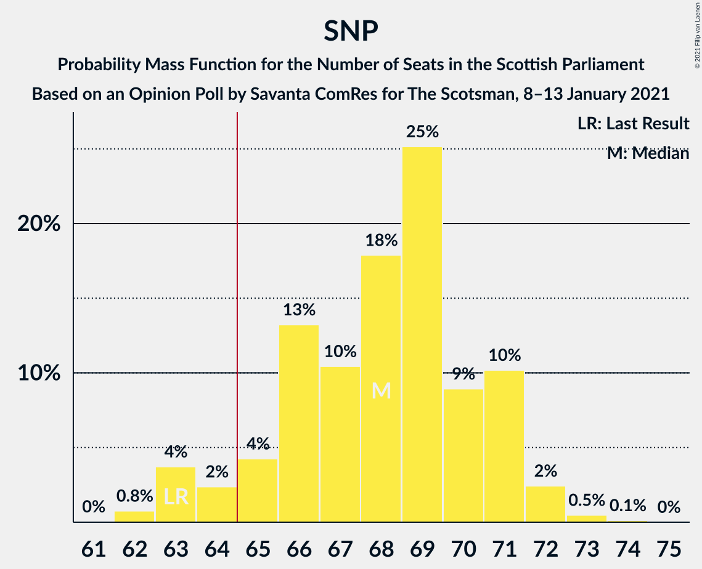
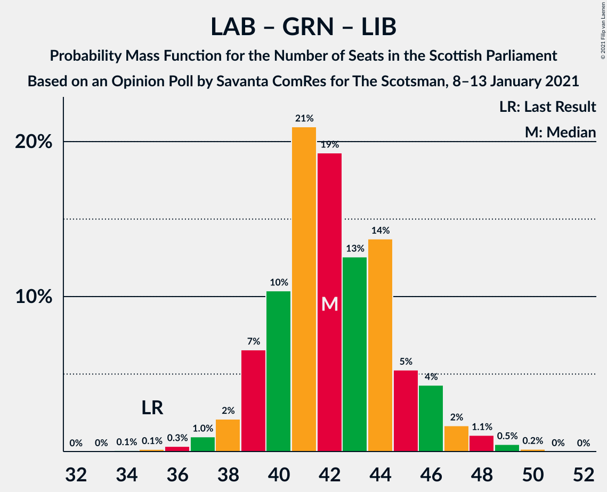

# Opinion Poll by Savanta ComRes for The Scotsman, 8–13 January 2021

<a href="#voting-intentions">Voting Intentions</a> | <a href="#seats">Seats</a> | <a href="#coalitions">Coalitions</a> | <a href="#technical-information">Technical Information</a>

## Voting Intentions

### Confidence Intervals

| Party | Last Result | Poll Result | 80% Confidence Interval | 90% Confidence Interval | 95% Confidence Interval | 99% Confidence Interval |
|:-----:|:-----------:|:-----------:|:-----------------------:|:-----------------------:|:-----------------------:|:-----------------------:|
| Scottish National Party | 41.7% | 44.0% | 42.0–46.0% |41.5–46.6% |41.0–47.1% |40.0–48.0% |
| Scottish Labour | 19.1% | 18.0% | 16.5–19.6% |16.1–20.1% |15.8–20.5% |15.1–21.3% |
| Scottish Conservative & Unionist Party | 22.9% | 16.0% | 14.6–17.6% |14.3–18.0% |13.9–18.4% |13.3–19.2% |
| Scottish Greens | 6.6% | 11.0% | 9.8–12.4% |9.5–12.8% |9.2–13.1% |8.7–13.8% |
| Scottish Liberal Democrats | 5.2% | 8.0% | 7.0–9.2% |6.7–9.5% |6.5–9.8% |6.0–10.4% |

*Note:* The poll result column reflects the actual value used in the calculations. Published results may vary slightly, and in addition be rounded to fewer digits.

## Seats

### Confidence Intervals

| Party | Last Result | Median | 80% Confidence Interval | 90% Confidence Interval | 95% Confidence Interval | 99% Confidence Interval |
|:-----:|:-----------:|:------:|:-----------------------:|:-----------------------:|:-----------------------:|:-----------------------:|
| <a href="#scottish-national-party">Scottish National Party</a> | 63 | 71 | 69–72 |68–72 |67–72 |65–74 |
| <a href="#scottish-labour">Scottish Labour</a> | 24 | 21 | 20–23 |19–24 |18–25 |17–26 |
| <a href="#scottish-conservative-&-unionist-party">Scottish Conservative & Unionist Party</a> | 31 | 19 | 16–20 |16–21 |16–22 |15–23 |
| <a href="#scottish-greens">Scottish Greens</a> | 6 | 11 | 10–12 |10–13 |10–13 |9–14 |
| <a href="#scottish-liberal-democrats">Scottish Liberal Democrats</a> | 5 | 8 | 6–10 |6–10 |5–10 |4–11 |

### Scottish National Party

*For a full overview of the results for this party, see the [Scottish National Party](party-scottishnationalparty.html) page.*

| Number of Seats | Probability | Accumulated | Special Marks |
|:---------------:|:-----------:|:-----------:|:-------------:|
| 63 | 0.1% | 100% | Last Result |
| 64 | 0.2% | 99.9% |  |
| 65 | 0.5% | 99.6% | Majority |
| 66 | 0.7% | 99.1% |  |
| 67 | 2% | 98% |  |
| 68 | 4% | 97% |  |
| 69 | 9% | 93% |  |
| 70 | 13% | 83% |  |
| 71 | 56% | 71% | Median |
| 72 | 12% | 14% |  |
| 73 | 1.2% | 2% |  |
| 74 | 0.9% | 0.9% |  |
| 75 | 0% | 0% |  |

### Scottish Labour

*For a full overview of the results for this party, see the [Scottish Labour](party-scottishlabour.html) page.*

| Number of Seats | Probability | Accumulated | Special Marks |
|:---------------:|:-----------:|:-----------:|:-------------:|
| 17 | 1.2% | 100% |  |
| 18 | 3% | 98.8% |  |
| 19 | 5% | 96% |  |
| 20 | 36% | 91% |  |
| 21 | 21% | 55% | Median |
| 22 | 18% | 34% |  |
| 23 | 10% | 16% |  |
| 24 | 4% | 6% | Last Result |
| 25 | 2% | 3% |  |
| 26 | 1.0% | 1.1% |  |
| 27 | 0.1% | 0.1% |  |
| 28 | 0% | 0% |  |

### Scottish Conservative & Unionist Party

*For a full overview of the results for this party, see the [Scottish Conservative & Unionist Party](party-scottishconservativeunionistparty.html) page.*

| Number of Seats | Probability | Accumulated | Special Marks |
|:---------------:|:-----------:|:-----------:|:-------------:|
| 14 | 0.1% | 100% |  |
| 15 | 2% | 99.9% |  |
| 16 | 9% | 98% |  |
| 17 | 22% | 89% |  |
| 18 | 14% | 68% |  |
| 19 | 36% | 53% | Median |
| 20 | 11% | 17% |  |
| 21 | 4% | 7% |  |
| 22 | 1.3% | 3% |  |
| 23 | 1.2% | 1.4% |  |
| 24 | 0.2% | 0.2% |  |
| 25 | 0% | 0% |  |
| 26 | 0% | 0% |  |
| 27 | 0% | 0% |  |
| 28 | 0% | 0% |  |
| 29 | 0% | 0% |  |
| 30 | 0% | 0% |  |
| 31 | 0% | 0% | Last Result |

### Scottish Greens

*For a full overview of the results for this party, see the [Scottish Greens](party-scottishgreens.html) page.*

| Number of Seats | Probability | Accumulated | Special Marks |
|:---------------:|:-----------:|:-----------:|:-------------:|
| 6 | 0% | 100% | Last Result |
| 7 | 0% | 100% |  |
| 8 | 0% | 100% |  |
| 9 | 0.7% | 100% |  |
| 10 | 15% | 99.2% |  |
| 11 | 52% | 84% | Median |
| 12 | 23% | 32% |  |
| 13 | 8% | 9% |  |
| 14 | 0.9% | 1.2% |  |
| 15 | 0.3% | 0.3% |  |
| 16 | 0% | 0.1% |  |
| 17 | 0% | 0% |  |

### Scottish Liberal Democrats

*For a full overview of the results for this party, see the [Scottish Liberal Democrats](party-scottishliberaldemocrats.html) page.*

| Number of Seats | Probability | Accumulated | Special Marks |
|:---------------:|:-----------:|:-----------:|:-------------:|
| 4 | 1.3% | 100% |  |
| 5 | 3% | 98.7% | Last Result |
| 6 | 17% | 96% |  |
| 7 | 14% | 79% |  |
| 8 | 37% | 65% | Median |
| 9 | 14% | 27% |  |
| 10 | 12% | 13% |  |
| 11 | 1.5% | 2% |  |
| 12 | 0% | 0% |  |

## Coalitions

### Confidence Intervals

| Coalition | Last Result | Median | Majority? | 80% Confidence Interval | 90% Confidence Interval | 95% Confidence Interval | 99% Confidence Interval |
|:---------:|:-----------:|:------:|:---------:|:-----------------------:|:-----------------------:|:-----------------------:|:-----------------------:|
| Scottish National Party – Scottish Greens | 69 | 82 | 100% | 80–83 | 79–84 | 78–85 | 77–85 |
| Scottish National Party | 63 | 71 | 99.6% | 69–72 | 68–72 | 67–72 | 65–74 |
| Scottish Labour – Scottish Conservative & Unionist Party – Scottish Liberal Democrats | 60 | 47 | 0% | 46–49 | 45–50 | 44–51 | 44–52 |
| Scottish Labour – Scottish Greens – Scottish Liberal Democrats | 35 | 40 | 0% | 38–42 | 37–43 | 37–44 | 36–45 |
| Scottish Labour – Scottish Conservative & Unionist Party | 55 | 39 | 0% | 38–41 | 37–42 | 36–43 | 35–45 |
| Scottish Labour – Scottish Liberal Democrats | 29 | 29 | 0% | 27–31 | 26–32 | 26–32 | 24–34 |
| Scottish Conservative & Unionist Party – Scottish Liberal Democrats | 36 | 26 | 0% | 24–28 | 23–29 | 23–30 | 22–31 |

### Scottish National Party – Scottish Greens

| Number of Seats | Probability | Accumulated | Special Marks |
|:---------------:|:-----------:|:-----------:|:-------------:|
| 69 | 0% | 100% | Last Result |
| 70 | 0% | 100% |  |
| 71 | 0% | 100% |  |
| 72 | 0% | 100% |  |
| 73 | 0% | 100% |  |
| 74 | 0% | 100% |  |
| 75 | 0.1% | 100% |  |
| 76 | 0.3% | 99.9% |  |
| 77 | 1.3% | 99.6% |  |
| 78 | 1.0% | 98% |  |
| 79 | 4% | 97% |  |
| 80 | 7% | 93% |  |
| 81 | 14% | 86% |  |
| 82 | 47% | 72% | Median |
| 83 | 18% | 26% |  |
| 84 | 3% | 7% |  |
| 85 | 3% | 4% |  |
| 86 | 0.2% | 0.4% |  |
| 87 | 0.1% | 0.2% |  |
| 88 | 0% | 0% |  |

### Scottish National Party

| Number of Seats | Probability | Accumulated | Special Marks |
|:---------------:|:-----------:|:-----------:|:-------------:|
| 63 | 0.1% | 100% | Last Result |
| 64 | 0.2% | 99.9% |  |
| 65 | 0.5% | 99.6% | Majority |
| 66 | 0.7% | 99.1% |  |
| 67 | 2% | 98% |  |
| 68 | 4% | 97% |  |
| 69 | 9% | 93% |  |
| 70 | 13% | 83% |  |
| 71 | 56% | 71% | Median |
| 72 | 12% | 14% |  |
| 73 | 1.2% | 2% |  |
| 74 | 0.9% | 0.9% |  |
| 75 | 0% | 0% |  |

### Scottish Labour – Scottish Conservative & Unionist Party – Scottish Liberal Democrats

| Number of Seats | Probability | Accumulated | Special Marks |
|:---------------:|:-----------:|:-----------:|:-------------:|
| 42 | 0.1% | 100% |  |
| 43 | 0.2% | 99.8% |  |
| 44 | 3% | 99.6% |  |
| 45 | 3% | 96% |  |
| 46 | 18% | 93% |  |
| 47 | 47% | 74% |  |
| 48 | 14% | 28% | Median |
| 49 | 7% | 14% |  |
| 50 | 4% | 7% |  |
| 51 | 1.0% | 3% |  |
| 52 | 1.3% | 2% |  |
| 53 | 0.3% | 0.4% |  |
| 54 | 0.1% | 0.1% |  |
| 55 | 0% | 0% |  |
| 56 | 0% | 0% |  |
| 57 | 0% | 0% |  |
| 58 | 0% | 0% |  |
| 59 | 0% | 0% |  |
| 60 | 0% | 0% | Last Result |

### Scottish Labour – Scottish Greens – Scottish Liberal Democrats

| Number of Seats | Probability | Accumulated | Special Marks |
|:---------------:|:-----------:|:-----------:|:-------------:|
| 34 | 0.1% | 100% |  |
| 35 | 0.2% | 99.8% | Last Result |
| 36 | 1.2% | 99.6% |  |
| 37 | 4% | 98% |  |
| 38 | 6% | 95% |  |
| 39 | 33% | 89% |  |
| 40 | 14% | 56% | Median |
| 41 | 29% | 42% |  |
| 42 | 6% | 14% |  |
| 43 | 4% | 7% |  |
| 44 | 2% | 3% |  |
| 45 | 0.9% | 1.0% |  |
| 46 | 0.1% | 0.2% |  |
| 47 | 0% | 0% |  |

### Scottish Labour – Scottish Conservative & Unionist Party

| Number of Seats | Probability | Accumulated | Special Marks |
|:---------------:|:-----------:|:-----------:|:-------------:|
| 35 | 0.5% | 100% |  |
| 36 | 4% | 99.5% |  |
| 37 | 5% | 96% |  |
| 38 | 17% | 90% |  |
| 39 | 36% | 74% |  |
| 40 | 15% | 37% | Median |
| 41 | 13% | 23% |  |
| 42 | 6% | 10% |  |
| 43 | 2% | 4% |  |
| 44 | 0.8% | 2% |  |
| 45 | 0.7% | 0.8% |  |
| 46 | 0.2% | 0.2% |  |
| 47 | 0% | 0% |  |
| 48 | 0% | 0% |  |
| 49 | 0% | 0% |  |
| 50 | 0% | 0% |  |
| 51 | 0% | 0% |  |
| 52 | 0% | 0% |  |
| 53 | 0% | 0% |  |
| 54 | 0% | 0% |  |
| 55 | 0% | 0% | Last Result |

### Scottish Labour – Scottish Liberal Democrats

| Number of Seats | Probability | Accumulated | Special Marks |
|:---------------:|:-----------:|:-----------:|:-------------:|
| 23 | 0.1% | 100% |  |
| 24 | 0.5% | 99.9% |  |
| 25 | 1.2% | 99.4% |  |
| 26 | 5% | 98% |  |
| 27 | 14% | 93% |  |
| 28 | 29% | 79% |  |
| 29 | 11% | 50% | Last Result, Median |
| 30 | 27% | 39% |  |
| 31 | 6% | 12% |  |
| 32 | 4% | 6% |  |
| 33 | 1.3% | 2% |  |
| 34 | 0.8% | 1.0% |  |
| 35 | 0.2% | 0.2% |  |
| 36 | 0% | 0% |  |

### Scottish Conservative & Unionist Party – Scottish Liberal Democrats

| Number of Seats | Probability | Accumulated | Special Marks |
|:---------------:|:-----------:|:-----------:|:-------------:|
| 20 | 0.1% | 100% |  |
| 21 | 0.3% | 99.9% |  |
| 22 | 2% | 99.6% |  |
| 23 | 4% | 98% |  |
| 24 | 13% | 94% |  |
| 25 | 15% | 81% |  |
| 26 | 21% | 66% |  |
| 27 | 29% | 45% | Median |
| 28 | 8% | 17% |  |
| 29 | 6% | 9% |  |
| 30 | 2% | 3% |  |
| 31 | 0.9% | 1.4% |  |
| 32 | 0.2% | 0.4% |  |
| 33 | 0.2% | 0.2% |  |
| 34 | 0% | 0% |  |
| 35 | 0% | 0% |  |
| 36 | 0% | 0% | Last Result |

## Technical Information

### Opinion Poll

+ **Polling firm:** Savanta ComRes
+ **Commissioner(s):** The Scotsman
+ **Fieldwork period:** 8–13 January 2021

### Calculations

+ **Sample size:** 1016
+ **Simulations done:** 32,768
+ **Error estimate:** 1.20%

