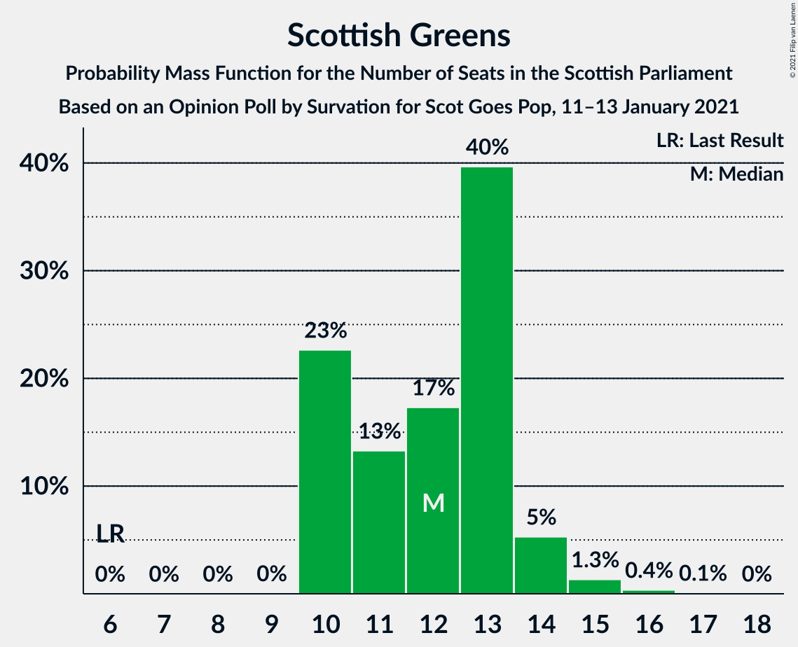
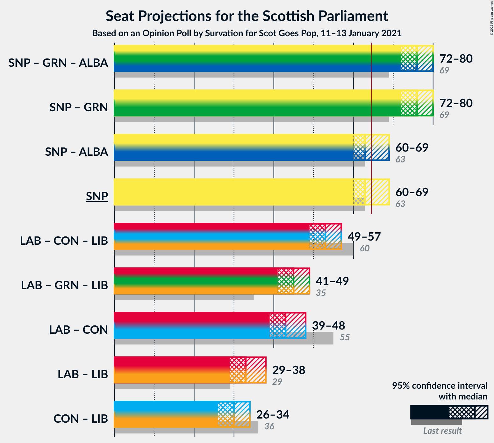

# Opinion Poll by Survation for Scot Goes Pop, 11–13 January 2021

<a href="#voting-intentions">Voting Intentions</a> | <a href="#seats">Seats</a> | <a href="#coalitions">Coalitions</a> | <a href="#technical-information">Technical Information</a>

## Voting Intentions

### Confidence Intervals

| Party | Last Result | Poll Result | 80% Confidence Interval | 90% Confidence Interval | 95% Confidence Interval | 99% Confidence Interval |
|:-----:|:-----------:|:-----------:|:-----------------------:|:-----------------------:|:-----------------------:|:-----------------------:|
| Scottish National Party | 41.7% | 40.0% | 38.1–42.0% |37.5–42.6% |37.0–43.0% |36.1–44.0% |
| Scottish Labour | 19.1% | 19.0% | 17.5–20.7% |17.1–21.1% |16.7–21.6% |16.0–22.4% |
| Scottish Conservative & Unionist Party | 22.9% | 17.0% | 15.5–18.5% |15.1–19.0% |14.8–19.4% |14.1–20.2% |
| Scottish Greens | 6.6% | 11.0% | 9.8–12.3% |9.5–12.7% |9.2–13.1% |8.7–13.7% |
| Scottish Liberal Democrats | 5.2% | 9.0% | 8.0–10.3% |7.7–10.6% |7.4–10.9% |6.9–11.6% |

*Note:* The poll result column reflects the actual value used in the calculations. Published results may vary slightly, and in addition be rounded to fewer digits.

## Seats

### Confidence Intervals

| Party | Last Result | Median | 80% Confidence Interval | 90% Confidence Interval | 95% Confidence Interval | 99% Confidence Interval |
|:-----:|:-----------:|:------:|:-----------------------:|:-----------------------:|:-----------------------:|:-----------------------:|
| <a href="#scottish-national-party">Scottish National Party</a> | 63 | 63 | 62–68 |61–68 |60–69 |59–69 |
| <a href="#scottish-labour">Scottish Labour</a> | 24 | 23 | 21–26 |21–26 |20–27 |19–29 |
| <a href="#scottish-conservative-&-unionist-party">Scottish Conservative & Unionist Party</a> | 31 | 20 | 18–22 |17–23 |17–24 |16–25 |
| <a href="#scottish-greens">Scottish Greens</a> | 6 | 12 | 10–13 |10–14 |10–14 |10–15 |
| <a href="#scottish-liberal-democrats">Scottish Liberal Democrats</a> | 5 | 10 | 8–12 |7–12 |7–13 |6–14 |

### Scottish National Party

*For a full overview of the results for this party, see the [Scottish National Party](party-scottishnationalparty.html) page.*

| Number of Seats | Probability | Accumulated | Special Marks |
|:---------------:|:-----------:|:-----------:|:-------------:|
| 57 | 0.1% | 100% |  |
| 58 | 0.2% | 99.9% |  |
| 59 | 1.0% | 99.7% |  |
| 60 | 2% | 98.7% |  |
| 61 | 6% | 97% |  |
| 62 | 26% | 90% |  |
| 63 | 20% | 64% | Last Result, Median |
| 64 | 11% | 44% |  |
| 65 | 7% | 33% | Majority |
| 66 | 9% | 26% |  |
| 67 | 6% | 18% |  |
| 68 | 8% | 11% |  |
| 69 | 3% | 4% |  |
| 70 | 0.1% | 0.2% |  |
| 71 | 0% | 0% |  |

### Scottish Labour

*For a full overview of the results for this party, see the [Scottish Labour](party-scottishlabour.html) page.*

| Number of Seats | Probability | Accumulated | Special Marks |
|:---------------:|:-----------:|:-----------:|:-------------:|
| 18 | 0.3% | 100% |  |
| 19 | 1.2% | 99.7% |  |
| 20 | 3% | 98% |  |
| 21 | 7% | 96% |  |
| 22 | 20% | 89% |  |
| 23 | 24% | 69% | Median |
| 24 | 17% | 45% | Last Result |
| 25 | 17% | 27% |  |
| 26 | 6% | 10% |  |
| 27 | 3% | 4% |  |
| 28 | 0.8% | 2% |  |
| 29 | 0.7% | 0.8% |  |
| 30 | 0.1% | 0.2% |  |
| 31 | 0% | 0% |  |

### Scottish Conservative & Unionist Party

*For a full overview of the results for this party, see the [Scottish Conservative & Unionist Party](party-scottishconservativeunionistparty.html) page.*

| Number of Seats | Probability | Accumulated | Special Marks |
|:---------------:|:-----------:|:-----------:|:-------------:|
| 15 | 0% | 100% |  |
| 16 | 0.8% | 99.9% |  |
| 17 | 4% | 99.2% |  |
| 18 | 9% | 95% |  |
| 19 | 28% | 86% |  |
| 20 | 24% | 58% | Median |
| 21 | 16% | 34% |  |
| 22 | 10% | 18% |  |
| 23 | 5% | 8% |  |
| 24 | 2% | 3% |  |
| 25 | 0.7% | 0.8% |  |
| 26 | 0.1% | 0.1% |  |
| 27 | 0% | 0% |  |
| 28 | 0% | 0% |  |
| 29 | 0% | 0% |  |
| 30 | 0% | 0% |  |
| 31 | 0% | 0% | Last Result |

### Scottish Greens

*For a full overview of the results for this party, see the [Scottish Greens](party-scottishgreens.html) page.*

| Number of Seats | Probability | Accumulated | Special Marks |
|:---------------:|:-----------:|:-----------:|:-------------:|
| 6 | 0% | 100% | Last Result |
| 7 | 0% | 100% |  |
| 8 | 0% | 100% |  |
| 9 | 0% | 100% |  |
| 10 | 23% | 100% |  |
| 11 | 13% | 77% |  |
| 12 | 17% | 64% | Median |
| 13 | 40% | 47% |  |
| 14 | 5% | 7% |  |
| 15 | 1.3% | 2% |  |
| 16 | 0.4% | 0.5% |  |
| 17 | 0.1% | 0.1% |  |
| 18 | 0% | 0% |  |

### Scottish Liberal Democrats

*For a full overview of the results for this party, see the [Scottish Liberal Democrats](party-scottishliberaldemocrats.html) page.*

| Number of Seats | Probability | Accumulated | Special Marks |
|:---------------:|:-----------:|:-----------:|:-------------:|
| 5 | 0.1% | 100% | Last Result |
| 6 | 1.5% | 99.9% |  |
| 7 | 4% | 98% |  |
| 8 | 23% | 95% |  |
| 9 | 13% | 71% |  |
| 10 | 18% | 58% | Median |
| 11 | 29% | 40% |  |
| 12 | 8% | 10% |  |
| 13 | 2% | 3% |  |
| 14 | 0.6% | 0.7% |  |
| 15 | 0% | 0% |  |

## Coalitions

### Confidence Intervals

| Coalition | Last Result | Median | Majority? | 80% Confidence Interval | 90% Confidence Interval | 95% Confidence Interval | 99% Confidence Interval |
|:---------:|:-----------:|:------:|:---------:|:-----------------------:|:-----------------------:|:-----------------------:|:-----------------------:|
| Scottish National Party – Scottish Greens | 69 | 76 | 100% | 73–79 | 72–80 | 72–80 | 70–82 |
| Scottish National Party | 63 | 63 | 33% | 62–68 | 61–68 | 60–69 | 59–69 |
| Scottish Labour – Scottish Conservative & Unionist Party – Scottish Liberal Democrats | 60 | 53 | 0% | 50–56 | 49–57 | 49–57 | 47–59 |
| Scottish Labour – Scottish Greens – Scottish Liberal Democrats | 35 | 45 | 0% | 42–48 | 41–49 | 41–49 | 39–51 |
| Scottish Labour – Scottish Conservative & Unionist Party | 55 | 43 | 0% | 40–46 | 40–47 | 39–48 | 38–49 |
| Scottish Labour – Scottish Liberal Democrats | 29 | 33 | 0% | 31–36 | 30–37 | 29–38 | 27–40 |
| Scottish Conservative & Unionist Party – Scottish Liberal Democrats | 36 | 30 | 0% | 27–32 | 26–33 | 26–34 | 25–35 |

### Scottish National Party – Scottish Greens

| Number of Seats | Probability | Accumulated | Special Marks |
|:---------------:|:-----------:|:-----------:|:-------------:|
| 68 | 0.1% | 100% |  |
| 69 | 0.2% | 99.9% | Last Result |
| 70 | 0.4% | 99.7% |  |
| 71 | 1.3% | 99.4% |  |
| 72 | 6% | 98% |  |
| 73 | 10% | 92% |  |
| 74 | 12% | 83% |  |
| 75 | 19% | 71% | Median |
| 76 | 16% | 52% |  |
| 77 | 11% | 36% |  |
| 78 | 7% | 25% |  |
| 79 | 12% | 18% |  |
| 80 | 4% | 6% |  |
| 81 | 0.9% | 2% |  |
| 82 | 0.7% | 0.8% |  |
| 83 | 0.1% | 0.1% |  |
| 84 | 0% | 0% |  |

### Scottish National Party

| Number of Seats | Probability | Accumulated | Special Marks |
|:---------------:|:-----------:|:-----------:|:-------------:|
| 57 | 0.1% | 100% |  |
| 58 | 0.2% | 99.9% |  |
| 59 | 1.0% | 99.7% |  |
| 60 | 2% | 98.7% |  |
| 61 | 6% | 97% |  |
| 62 | 26% | 90% |  |
| 63 | 20% | 64% | Last Result, Median |
| 64 | 11% | 44% |  |
| 65 | 7% | 33% | Majority |
| 66 | 9% | 26% |  |
| 67 | 6% | 18% |  |
| 68 | 8% | 11% |  |
| 69 | 3% | 4% |  |
| 70 | 0.1% | 0.2% |  |
| 71 | 0% | 0% |  |

### Scottish Labour – Scottish Conservative & Unionist Party – Scottish Liberal Democrats

| Number of Seats | Probability | Accumulated | Special Marks |
|:---------------:|:-----------:|:-----------:|:-------------:|
| 46 | 0.1% | 100% |  |
| 47 | 0.7% | 99.9% |  |
| 48 | 0.9% | 99.2% |  |
| 49 | 4% | 98% |  |
| 50 | 12% | 94% |  |
| 51 | 7% | 82% |  |
| 52 | 11% | 75% |  |
| 53 | 16% | 64% | Median |
| 54 | 19% | 48% |  |
| 55 | 12% | 29% |  |
| 56 | 10% | 17% |  |
| 57 | 6% | 8% |  |
| 58 | 1.3% | 2% |  |
| 59 | 0.4% | 0.6% |  |
| 60 | 0.2% | 0.3% | Last Result |
| 61 | 0.1% | 0.1% |  |
| 62 | 0% | 0% |  |

### Scottish Labour – Scottish Greens – Scottish Liberal Democrats

| Number of Seats | Probability | Accumulated | Special Marks |
|:---------------:|:-----------:|:-----------:|:-------------:|
| 35 | 0% | 100% | Last Result |
| 36 | 0% | 100% |  |
| 37 | 0.1% | 100% |  |
| 38 | 0.1% | 99.9% |  |
| 39 | 0.5% | 99.8% |  |
| 40 | 1.0% | 99.2% |  |
| 41 | 4% | 98% |  |
| 42 | 8% | 94% |  |
| 43 | 11% | 86% |  |
| 44 | 13% | 75% |  |
| 45 | 14% | 62% | Median |
| 46 | 19% | 47% |  |
| 47 | 13% | 28% |  |
| 48 | 10% | 15% |  |
| 49 | 3% | 5% |  |
| 50 | 2% | 2% |  |
| 51 | 0.6% | 0.8% |  |
| 52 | 0.2% | 0.2% |  |
| 53 | 0% | 0.1% |  |
| 54 | 0% | 0% |  |

### Scottish Labour – Scottish Conservative & Unionist Party

| Number of Seats | Probability | Accumulated | Special Marks |
|:---------------:|:-----------:|:-----------:|:-------------:|
| 37 | 0.1% | 100% |  |
| 38 | 0.9% | 99.8% |  |
| 39 | 2% | 99.0% |  |
| 40 | 8% | 97% |  |
| 41 | 12% | 89% |  |
| 42 | 12% | 77% |  |
| 43 | 18% | 65% | Median |
| 44 | 10% | 47% |  |
| 45 | 18% | 37% |  |
| 46 | 11% | 19% |  |
| 47 | 5% | 8% |  |
| 48 | 2% | 4% |  |
| 49 | 0.9% | 1.2% |  |
| 50 | 0.2% | 0.3% |  |
| 51 | 0.1% | 0.1% |  |
| 52 | 0% | 0% |  |
| 53 | 0% | 0% |  |
| 54 | 0% | 0% |  |
| 55 | 0% | 0% | Last Result |

### Scottish Labour – Scottish Liberal Democrats

| Number of Seats | Probability | Accumulated | Special Marks |
|:---------------:|:-----------:|:-----------:|:-------------:|
| 26 | 0.2% | 100% |  |
| 27 | 0.4% | 99.8% |  |
| 28 | 0.8% | 99.4% |  |
| 29 | 1.5% | 98.5% | Last Result |
| 30 | 6% | 97% |  |
| 31 | 13% | 91% |  |
| 32 | 13% | 78% |  |
| 33 | 26% | 66% | Median |
| 34 | 15% | 39% |  |
| 35 | 12% | 24% |  |
| 36 | 5% | 12% |  |
| 37 | 3% | 6% |  |
| 38 | 2% | 3% |  |
| 39 | 0.8% | 1.3% |  |
| 40 | 0.4% | 0.6% |  |
| 41 | 0.1% | 0.2% |  |
| 42 | 0% | 0% |  |

### Scottish Conservative & Unionist Party – Scottish Liberal Democrats

| Number of Seats | Probability | Accumulated | Special Marks |
|:---------------:|:-----------:|:-----------:|:-------------:|
| 23 | 0.1% | 100% |  |
| 24 | 0.2% | 99.9% |  |
| 25 | 2% | 99.8% |  |
| 26 | 4% | 98% |  |
| 27 | 7% | 95% |  |
| 28 | 15% | 87% |  |
| 29 | 14% | 72% |  |
| 30 | 23% | 58% | Median |
| 31 | 15% | 35% |  |
| 32 | 11% | 19% |  |
| 33 | 6% | 9% |  |
| 34 | 2% | 3% |  |
| 35 | 0.7% | 0.9% |  |
| 36 | 0.1% | 0.2% | Last Result |
| 37 | 0.1% | 0.1% |  |
| 38 | 0% | 0% |  |

## Technical Information

### Opinion Poll

+ **Polling firm:** Survation
+ **Commissioner(s):** Scot Goes Pop
+ **Fieldwork period:** 11–13 January 2021

### Calculations

+ **Sample size:** 1020
+ **Simulations done:** 1,048,576
+ **Error estimate:** 0.58%

