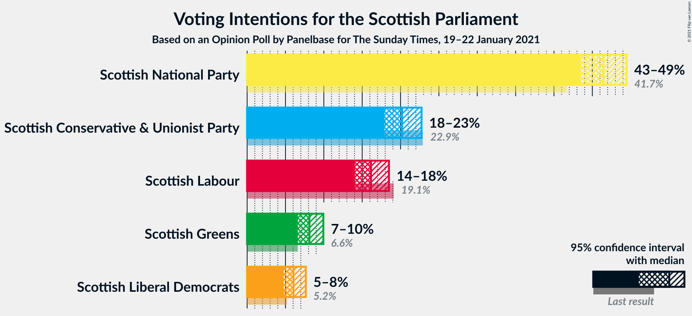
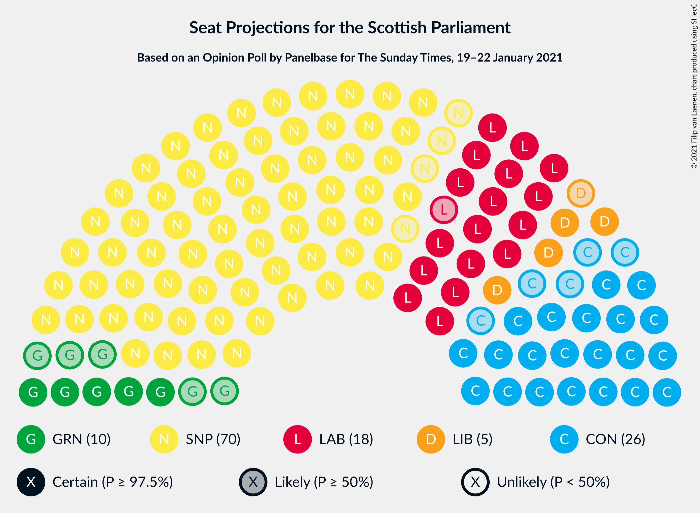
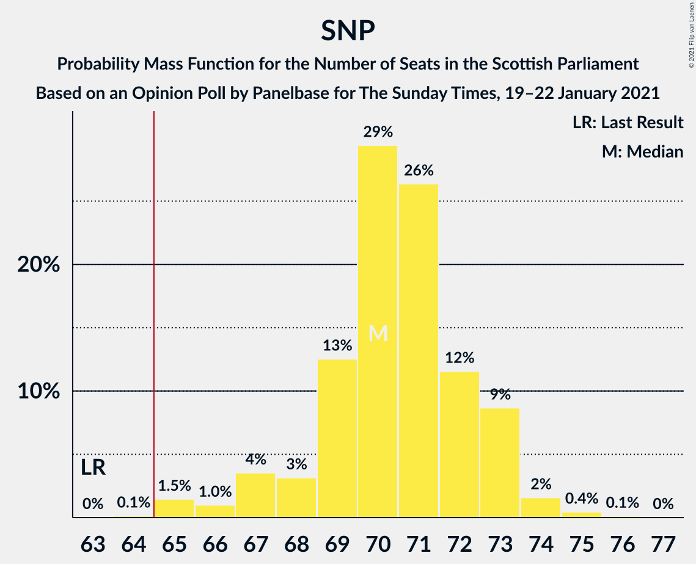
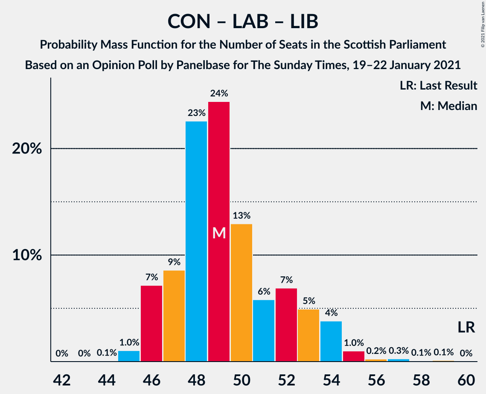

# Opinion Poll by Panelbase for The Sunday Times, 19–22 January 2021

<a href="#voting-intentions">Voting Intentions</a> | <a href="#seats">Seats</a> | <a href="#coalitions">Coalitions</a> | <a href="#technical-information">Technical Information</a>

## Voting Intentions

### Confidence Intervals

| Party | Last Result | Poll Result | 80% Confidence Interval | 90% Confidence Interval | 95% Confidence Interval | 99% Confidence Interval |
|:-----:|:-----------:|:-----------:|:-----------------------:|:-----------------------:|:-----------------------:|:-----------------------:|
| Scottish National Party | 41.7% | 46.5% | 44.5–48.4% |43.9–49.0% |43.5–49.5% |42.5–50.4% |
| Scottish Conservative & Unionist Party | 22.9% | 20.2% | 18.7–21.9% |18.3–22.3% |17.9–22.7% |17.2–23.5% |
| Scottish Labour | 19.1% | 16.1% | 14.8–17.7% |14.4–18.1% |14.1–18.5% |13.4–19.3% |
| Scottish Greens | 6.6% | 8.1% | 7.1–9.3% |6.9–9.6% |6.6–9.9% |6.2–10.5% |
| Scottish Liberal Democrats | 5.2% | 6.0% | 5.2–7.1% |5.0–7.4% |4.8–7.7% |4.4–8.2% |

*Note:* The poll result column reflects the actual value used in the calculations. Published results may vary slightly, and in addition be rounded to fewer digits.

## Seats

### Confidence Intervals

| Party | Last Result | Median | 80% Confidence Interval | 90% Confidence Interval | 95% Confidence Interval | 99% Confidence Interval |
|:-----:|:-----------:|:------:|:-----------------------:|:-----------------------:|:-----------------------:|:-----------------------:|
| <a href="#scottish-national-party">Scottish National Party</a> | 63 | 71 | 68–73 |67–73 |66–73 |65–75 |
| <a href="#scottish-conservative-&-unionist-party">Scottish Conservative & Unionist Party</a> | 31 | 25 | 23–26 |22–28 |21–30 |20–31 |
| <a href="#scottish-labour">Scottish Labour</a> | 24 | 18 | 17–22 |17–22 |17–23 |17–24 |
| <a href="#scottish-greens">Scottish Greens</a> | 6 | 10 | 6–10 |5–10 |5–10 |4–11 |
| <a href="#scottish-liberal-democrats">Scottish Liberal Democrats</a> | 5 | 5 | 4–6 |4–7 |3–7 |3–8 |

### Scottish National Party

*For a full overview of the results for this party, see the [Scottish National Party](party-scottishnationalparty.html) page.*

| Number of Seats | Probability | Accumulated | Special Marks |
|:---------------:|:-----------:|:-----------:|:-------------:|
| 63 | 0% | 100% | Last Result |
| 64 | 0.2% | 100% |  |
| 65 | 1.2% | 99.7% | Majority |
| 66 | 2% | 98.6% |  |
| 67 | 3% | 97% |  |
| 68 | 6% | 93% |  |
| 69 | 12% | 88% |  |
| 70 | 10% | 76% |  |
| 71 | 23% | 66% | Median |
| 72 | 26% | 43% |  |
| 73 | 15% | 17% |  |
| 74 | 0.9% | 2% |  |
| 75 | 0.8% | 0.9% |  |
| 76 | 0.1% | 0.1% |  |
| 77 | 0% | 0% |  |

### Scottish Conservative & Unionist Party

*For a full overview of the results for this party, see the [Scottish Conservative & Unionist Party](party-scottishconservativeunionistparty.html) page.*

| Number of Seats | Probability | Accumulated | Special Marks |
|:---------------:|:-----------:|:-----------:|:-------------:|
| 19 | 0% | 100% |  |
| 20 | 0.5% | 99.9% |  |
| 21 | 3% | 99.4% |  |
| 22 | 3% | 96% |  |
| 23 | 5% | 93% |  |
| 24 | 26% | 88% |  |
| 25 | 37% | 62% | Median |
| 26 | 16% | 25% |  |
| 27 | 3% | 9% |  |
| 28 | 2% | 6% |  |
| 29 | 2% | 4% |  |
| 30 | 1.5% | 3% |  |
| 31 | 1.0% | 1.1% | Last Result |
| 32 | 0.2% | 0.2% |  |
| 33 | 0% | 0% |  |

### Scottish Labour

*For a full overview of the results for this party, see the [Scottish Labour](party-scottishlabour.html) page.*

| Number of Seats | Probability | Accumulated | Special Marks |
|:---------------:|:-----------:|:-----------:|:-------------:|
| 16 | 0.3% | 100% |  |
| 17 | 38% | 99.6% |  |
| 18 | 14% | 61% | Median |
| 19 | 16% | 47% |  |
| 20 | 9% | 31% |  |
| 21 | 5% | 22% |  |
| 22 | 13% | 17% |  |
| 23 | 3% | 4% |  |
| 24 | 0.8% | 0.9% | Last Result |
| 25 | 0.1% | 0.1% |  |
| 26 | 0% | 0% |  |

### Scottish Greens

*For a full overview of the results for this party, see the [Scottish Greens](party-scottishgreens.html) page.*

| Number of Seats | Probability | Accumulated | Special Marks |
|:---------------:|:-----------:|:-----------:|:-------------:|
| 3 | 0.4% | 100% |  |
| 4 | 0.9% | 99.6% |  |
| 5 | 6% | 98.7% |  |
| 6 | 3% | 93% | Last Result |
| 7 | 3% | 90% |  |
| 8 | 4% | 87% |  |
| 9 | 4% | 83% |  |
| 10 | 77% | 79% | Median |
| 11 | 2% | 2% |  |
| 12 | 0.2% | 0.3% |  |
| 13 | 0.1% | 0.1% |  |
| 14 | 0% | 0% |  |

### Scottish Liberal Democrats

*For a full overview of the results for this party, see the [Scottish Liberal Democrats](party-scottishliberaldemocrats.html) page.*

| Number of Seats | Probability | Accumulated | Special Marks |
|:---------------:|:-----------:|:-----------:|:-------------:|
| 2 | 0.4% | 100% |  |
| 3 | 2% | 99.6% |  |
| 4 | 15% | 97% |  |
| 5 | 52% | 83% | Last Result, Median |
| 6 | 25% | 30% |  |
| 7 | 3% | 6% |  |
| 8 | 2% | 2% |  |
| 9 | 0.3% | 0.3% |  |
| 10 | 0% | 0% |  |

## Coalitions

### Confidence Intervals

| Coalition | Last Result | Median | Majority? | 80% Confidence Interval | 90% Confidence Interval | 95% Confidence Interval | 99% Confidence Interval |
|:---------:|:-----------:|:------:|:---------:|:-----------------------:|:-----------------------:|:-----------------------:|:-----------------------:|
| Scottish National Party – Scottish Greens | 69 | 81 | 100% | 77–83 | 76–83 | 75–83 | 72–84 |
| Scottish National Party | 63 | 71 | 99.7% | 68–73 | 67–73 | 66–73 | 65–75 |
| Scottish Conservative & Unionist Party – Scottish Labour – Scottish Liberal Democrats | 60 | 48 | 0% | 46–52 | 46–53 | 46–54 | 45–57 |
| Scottish Conservative & Unionist Party – Scottish Labour | 55 | 43 | 0% | 41–47 | 41–48 | 41–48 | 40–51 |
| Scottish Labour – Scottish Greens – Scottish Liberal Democrats | 35 | 33 | 0% | 32–36 | 31–37 | 30–38 | 28–39 |
| Scottish Conservative & Unionist Party – Scottish Liberal Democrats | 36 | 30 | 0% | 28–32 | 26–34 | 26–35 | 26–36 |
| Scottish Labour – Scottish Liberal Democrats | 29 | 24 | 0% | 22–27 | 22–28 | 22–29 | 21–29 |

### Scottish National Party – Scottish Greens

| Number of Seats | Probability | Accumulated | Special Marks |
|:---------------:|:-----------:|:-----------:|:-------------:|
| 69 | 0% | 100% | Last Result |
| 70 | 0.1% | 100% |  |
| 71 | 0.1% | 99.9% |  |
| 72 | 0.3% | 99.8% |  |
| 73 | 0.2% | 99.5% |  |
| 74 | 1.0% | 99.3% |  |
| 75 | 2% | 98% |  |
| 76 | 4% | 96% |  |
| 77 | 6% | 92% |  |
| 78 | 10% | 86% |  |
| 79 | 11% | 76% |  |
| 80 | 10% | 65% |  |
| 81 | 21% | 55% | Median |
| 82 | 22% | 34% |  |
| 83 | 12% | 13% |  |
| 84 | 0.7% | 0.7% |  |
| 85 | 0% | 0% |  |

### Scottish National Party

| Number of Seats | Probability | Accumulated | Special Marks |
|:---------------:|:-----------:|:-----------:|:-------------:|
| 63 | 0% | 100% | Last Result |
| 64 | 0.2% | 100% |  |
| 65 | 1.2% | 99.7% | Majority |
| 66 | 2% | 98.6% |  |
| 67 | 3% | 97% |  |
| 68 | 6% | 93% |  |
| 69 | 12% | 88% |  |
| 70 | 10% | 76% |  |
| 71 | 23% | 66% | Median |
| 72 | 26% | 43% |  |
| 73 | 15% | 17% |  |
| 74 | 0.9% | 2% |  |
| 75 | 0.8% | 0.9% |  |
| 76 | 0.1% | 0.1% |  |
| 77 | 0% | 0% |  |

### Scottish Conservative & Unionist Party – Scottish Labour – Scottish Liberal Democrats

| Number of Seats | Probability | Accumulated | Special Marks |
|:---------------:|:-----------:|:-----------:|:-------------:|
| 45 | 0.7% | 100% |  |
| 46 | 12% | 99.3% |  |
| 47 | 22% | 87% |  |
| 48 | 21% | 66% | Median |
| 49 | 10% | 45% |  |
| 50 | 11% | 35% |  |
| 51 | 10% | 24% |  |
| 52 | 6% | 14% |  |
| 53 | 4% | 8% |  |
| 54 | 2% | 4% |  |
| 55 | 1.0% | 2% |  |
| 56 | 0.2% | 0.7% |  |
| 57 | 0.3% | 0.5% |  |
| 58 | 0.1% | 0.2% |  |
| 59 | 0.1% | 0.1% |  |
| 60 | 0% | 0% | Last Result |

### Scottish Conservative & Unionist Party – Scottish Labour

| Number of Seats | Probability | Accumulated | Special Marks |
|:---------------:|:-----------:|:-----------:|:-------------:|
| 39 | 0.3% | 100% |  |
| 40 | 1.1% | 99.7% |  |
| 41 | 11% | 98.6% |  |
| 42 | 22% | 87% |  |
| 43 | 20% | 65% | Median |
| 44 | 15% | 45% |  |
| 45 | 11% | 31% |  |
| 46 | 7% | 20% |  |
| 47 | 6% | 12% |  |
| 48 | 3% | 6% |  |
| 49 | 2% | 2% |  |
| 50 | 0.2% | 0.8% |  |
| 51 | 0.3% | 0.6% |  |
| 52 | 0.2% | 0.3% |  |
| 53 | 0.1% | 0.1% |  |
| 54 | 0% | 0% |  |
| 55 | 0% | 0% | Last Result |

### Scottish Labour – Scottish Greens – Scottish Liberal Democrats

| Number of Seats | Probability | Accumulated | Special Marks |
|:---------------:|:-----------:|:-----------:|:-------------:|
| 26 | 0.1% | 100% |  |
| 27 | 0.2% | 99.8% |  |
| 28 | 0.4% | 99.7% |  |
| 29 | 1.1% | 99.3% |  |
| 30 | 0.8% | 98% |  |
| 31 | 3% | 97% |  |
| 32 | 39% | 95% |  |
| 33 | 14% | 56% | Median |
| 34 | 20% | 42% |  |
| 35 | 11% | 22% | Last Result |
| 36 | 4% | 11% |  |
| 37 | 4% | 7% |  |
| 38 | 2% | 3% |  |
| 39 | 1.2% | 1.3% |  |
| 40 | 0.1% | 0.1% |  |
| 41 | 0% | 0% |  |

### Scottish Conservative & Unionist Party – Scottish Liberal Democrats

| Number of Seats | Probability | Accumulated | Special Marks |
|:---------------:|:-----------:|:-----------:|:-------------:|
| 25 | 0.1% | 100% |  |
| 26 | 5% | 99.8% |  |
| 27 | 3% | 95% |  |
| 28 | 8% | 92% |  |
| 29 | 24% | 84% |  |
| 30 | 28% | 60% | Median |
| 31 | 14% | 33% |  |
| 32 | 9% | 19% |  |
| 33 | 4% | 10% |  |
| 34 | 2% | 6% |  |
| 35 | 2% | 4% |  |
| 36 | 1.1% | 2% | Last Result |
| 37 | 0.4% | 0.5% |  |
| 38 | 0.1% | 0.1% |  |
| 39 | 0% | 0% |  |

### Scottish Labour – Scottish Liberal Democrats

| Number of Seats | Probability | Accumulated | Special Marks |
|:---------------:|:-----------:|:-----------:|:-------------:|
| 19 | 0.1% | 100% |  |
| 20 | 0.1% | 99.9% |  |
| 21 | 0.8% | 99.8% |  |
| 22 | 34% | 99.0% |  |
| 23 | 12% | 65% | Median |
| 24 | 19% | 53% |  |
| 25 | 12% | 34% |  |
| 26 | 7% | 23% |  |
| 27 | 8% | 16% |  |
| 28 | 5% | 8% |  |
| 29 | 2% | 3% | Last Result |
| 30 | 0.3% | 0.4% |  |
| 31 | 0.1% | 0.1% |  |
| 32 | 0% | 0% |  |

## Technical Information

### Opinion Poll

+ **Polling firm:** Panelbase
+ **Commissioner(s):** The Sunday Times
+ **Fieldwork period:** 19–22 January 2021

### Calculations

+ **Sample size:** 1059
+ **Simulations done:** 131,072
+ **Error estimate:** 0.72%

