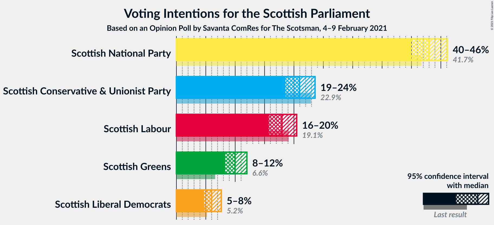
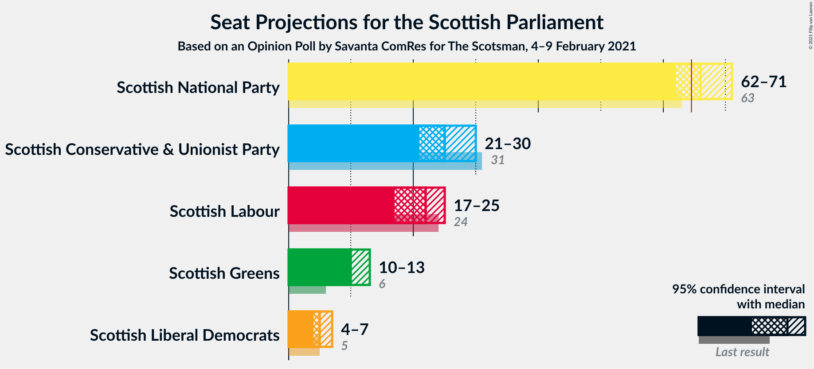
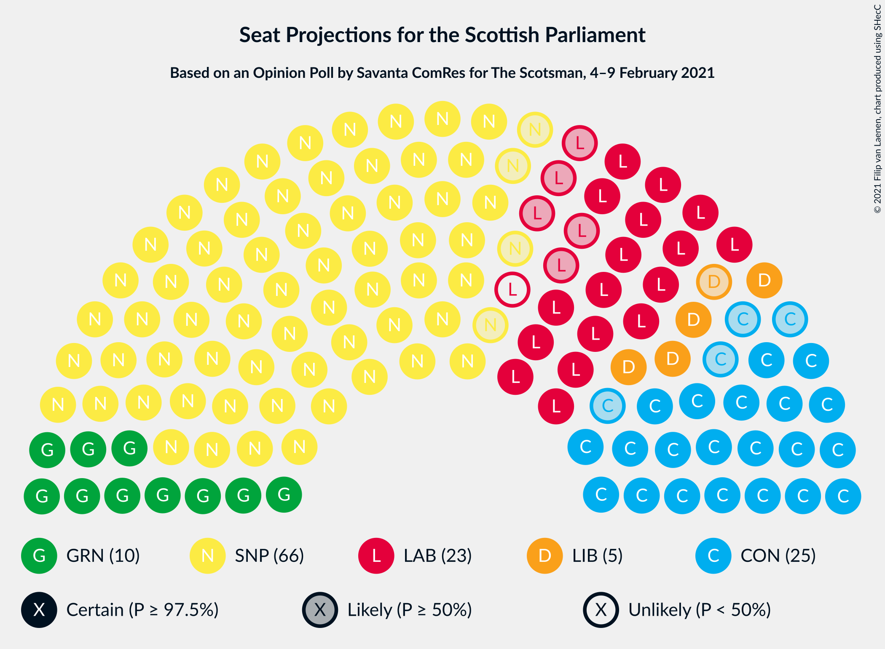
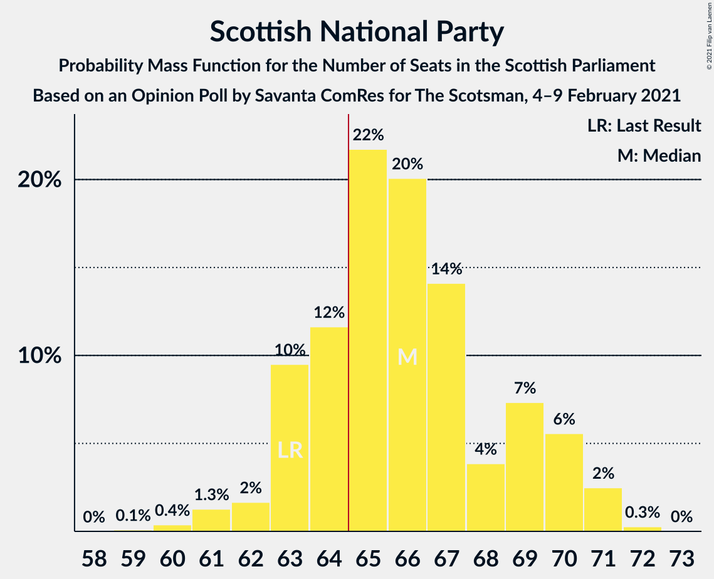
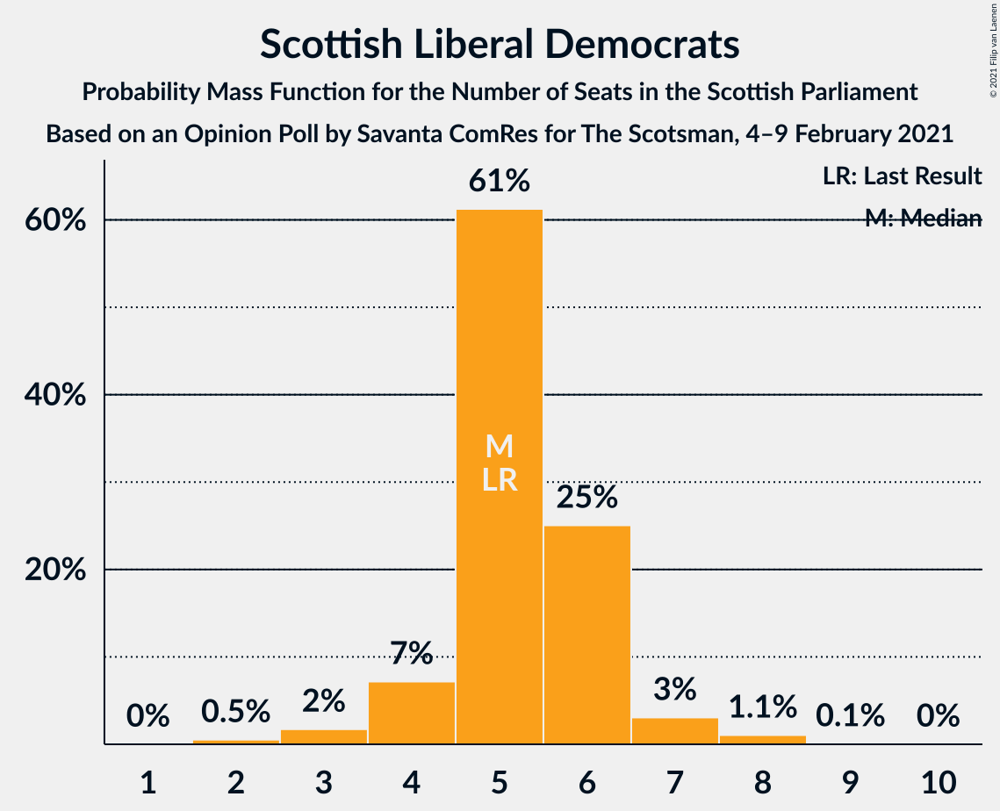
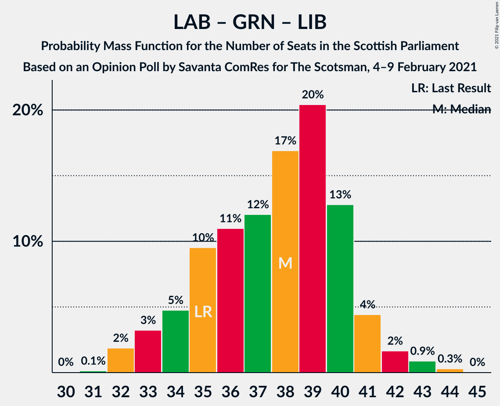

# Opinion Poll by Savanta ComRes for The Scotsman, 4–9 February 2021

<a href="#voting-intentions">Voting Intentions</a> | <a href="#seats">Seats</a> | <a href="#coalitions">Coalitions</a> | <a href="#technical-information">Technical Information</a>

## Voting Intentions

### Confidence Intervals

| Party | Last Result | Poll Result | 80% Confidence Interval | 90% Confidence Interval | 95% Confidence Interval | 99% Confidence Interval |
|:-----:|:-----------:|:-----------:|:-----------------------:|:-----------------------:|:-----------------------:|:-----------------------:|
| Scottish National Party | 41.7% | 43.0% | 41.0–45.0% |40.5–45.6% |40.0–46.1% |39.0–47.1% |
| Scottish Conservative & Unionist Party | 22.9% | 21.0% | 19.4–22.7% |18.9–23.2% |18.5–23.6% |17.8–24.4% |
| Scottish Labour | 19.1% | 18.0% | 16.5–19.6% |16.1–20.1% |15.7–20.5% |15.0–21.3% |
| Scottish Greens | 6.6% | 10.0% | 8.9–11.3% |8.5–11.7% |8.3–12.0% |7.8–12.7% |
| Scottish Liberal Democrats | 5.2% | 6.0% | 5.1–7.1% |4.9–7.4% |4.7–7.6% |4.3–8.2% |

*Note:* The poll result column reflects the actual value used in the calculations. Published results may vary slightly, and in addition be rounded to fewer digits.

## Seats

### Confidence Intervals

| Party | Last Result | Median | 80% Confidence Interval | 90% Confidence Interval | 95% Confidence Interval | 99% Confidence Interval |
|:-----:|:-----------:|:------:|:-----------------------:|:-----------------------:|:-----------------------:|:-----------------------:|
| <a href="#scottish-national-party">Scottish National Party</a> | 63 | 67 | 66–70 |65–71 |65–71 |63–72 |
| <a href="#scottish-conservative-&-unionist-party">Scottish Conservative & Unionist Party</a> | 31 | 25 | 22–27 |21–28 |21–29 |20–30 |
| <a href="#scottish-labour">Scottish Labour</a> | 24 | 22 | 19–24 |18–24 |17–24 |17–25 |
| <a href="#scottish-greens">Scottish Greens</a> | 6 | 10 | 10–12 |10–12 |10–12 |8–13 |
| <a href="#scottish-liberal-democrats">Scottish Liberal Democrats</a> | 5 | 5 | 4–6 |3–6 |3–7 |2–8 |

### Scottish National Party

*For a full overview of the results for this party, see the [Scottish National Party](party-scottishnationalparty.html) page.*

| Number of Seats | Probability | Accumulated | Special Marks |
|:---------------:|:-----------:|:-----------:|:-------------:|
| 62 | 0.2% | 100% |  |
| 63 | 0.3% | 99.8% | Last Result |
| 64 | 0.6% | 99.5% |  |
| 65 | 5% | 98.8% | Majority |
| 66 | 41% | 94% |  |
| 67 | 18% | 53% | Median |
| 68 | 10% | 35% |  |
| 69 | 9% | 24% |  |
| 70 | 8% | 15% |  |
| 71 | 7% | 8% |  |
| 72 | 0.7% | 0.8% |  |
| 73 | 0% | 0% |  |

### Scottish Conservative & Unionist Party

*For a full overview of the results for this party, see the [Scottish Conservative & Unionist Party](party-scottishconservativeunionistparty.html) page.*

| Number of Seats | Probability | Accumulated | Special Marks |
|:---------------:|:-----------:|:-----------:|:-------------:|
| 19 | 0.3% | 100% |  |
| 20 | 0.4% | 99.7% |  |
| 21 | 7% | 99.3% |  |
| 22 | 6% | 93% |  |
| 23 | 6% | 87% |  |
| 24 | 15% | 80% |  |
| 25 | 35% | 66% | Median |
| 26 | 17% | 31% |  |
| 27 | 8% | 14% |  |
| 28 | 4% | 7% |  |
| 29 | 1.2% | 3% |  |
| 30 | 1.3% | 2% |  |
| 31 | 0.2% | 0.2% | Last Result |
| 32 | 0.1% | 0.1% |  |
| 33 | 0% | 0% |  |

### Scottish Labour

*For a full overview of the results for this party, see the [Scottish Labour](party-scottishlabour.html) page.*

| Number of Seats | Probability | Accumulated | Special Marks |
|:---------------:|:-----------:|:-----------:|:-------------:|
| 17 | 3% | 100% |  |
| 18 | 3% | 97% |  |
| 19 | 10% | 94% |  |
| 20 | 12% | 84% |  |
| 21 | 22% | 72% |  |
| 22 | 23% | 50% | Median |
| 23 | 9% | 28% |  |
| 24 | 18% | 19% | Last Result |
| 25 | 0.5% | 0.6% |  |
| 26 | 0.1% | 0.1% |  |
| 27 | 0% | 0% |  |

### Scottish Greens

*For a full overview of the results for this party, see the [Scottish Greens](party-scottishgreens.html) page.*

| Number of Seats | Probability | Accumulated | Special Marks |
|:---------------:|:-----------:|:-----------:|:-------------:|
| 6 | 0.1% | 100% | Last Result |
| 7 | 0.2% | 99.9% |  |
| 8 | 0.7% | 99.7% |  |
| 9 | 1.2% | 99.0% |  |
| 10 | 54% | 98% | Median |
| 11 | 30% | 44% |  |
| 12 | 13% | 15% |  |
| 13 | 2% | 2% |  |
| 14 | 0.1% | 0.1% |  |
| 15 | 0% | 0% |  |

### Scottish Liberal Democrats

*For a full overview of the results for this party, see the [Scottish Liberal Democrats](party-scottishliberaldemocrats.html) page.*

| Number of Seats | Probability | Accumulated | Special Marks |
|:---------------:|:-----------:|:-----------:|:-------------:|
| 1 | 0.2% | 100% |  |
| 2 | 0.9% | 99.8% |  |
| 3 | 4% | 99.0% |  |
| 4 | 34% | 95% |  |
| 5 | 31% | 61% | Last Result, Median |
| 6 | 25% | 30% |  |
| 7 | 4% | 5% |  |
| 8 | 0.6% | 0.7% |  |
| 9 | 0.1% | 0.1% |  |
| 10 | 0% | 0% |  |

## Coalitions

### Confidence Intervals

| Coalition | Last Result | Median | Majority? | 80% Confidence Interval | 90% Confidence Interval | 95% Confidence Interval | 99% Confidence Interval |
|:---------:|:-----------:|:------:|:---------:|:-----------------------:|:-----------------------:|:-----------------------:|:-----------------------:|
| Scottish National Party – Scottish Greens | 69 | 77 | 100% | 76–81 | 76–81 | 75–82 | 74–83 |
| Scottish National Party | 63 | 67 | 98.8% | 66–70 | 65–71 | 65–71 | 63–72 |
| Scottish Conservative & Unionist Party – Scottish Labour – Scottish Liberal Democrats | 60 | 52 | 0% | 48–53 | 48–53 | 47–54 | 46–55 |
| Scottish Conservative & Unionist Party – Scottish Labour | 55 | 47 | 0% | 43–49 | 43–49 | 42–49 | 41–51 |
| Scottish Labour – Scottish Greens – Scottish Liberal Democrats | 35 | 37 | 0% | 34–39 | 34–39 | 33–40 | 32–40 |
| Scottish Conservative & Unionist Party – Scottish Liberal Democrats | 36 | 30 | 0% | 27–32 | 26–33 | 26–34 | 25–35 |
| Scottish Labour – Scottish Liberal Democrats | 29 | 27 | 0% | 24–28 | 23–28 | 22–29 | 21–30 |

### Scottish National Party – Scottish Greens

| Number of Seats | Probability | Accumulated | Special Marks |
|:---------------:|:-----------:|:-----------:|:-------------:|
| 69 | 0% | 100% | Last Result |
| 70 | 0% | 100% |  |
| 71 | 0% | 100% |  |
| 72 | 0.2% | 100% |  |
| 73 | 0.3% | 99.8% |  |
| 74 | 0.3% | 99.5% |  |
| 75 | 3% | 99.2% |  |
| 76 | 19% | 96% |  |
| 77 | 33% | 77% | Median |
| 78 | 13% | 44% |  |
| 79 | 10% | 31% |  |
| 80 | 7% | 21% |  |
| 81 | 11% | 14% |  |
| 82 | 2% | 3% |  |
| 83 | 0.9% | 1.1% |  |
| 84 | 0.2% | 0.2% |  |
| 85 | 0% | 0% |  |

### Scottish National Party

| Number of Seats | Probability | Accumulated | Special Marks |
|:---------------:|:-----------:|:-----------:|:-------------:|
| 62 | 0.2% | 100% |  |
| 63 | 0.3% | 99.8% | Last Result |
| 64 | 0.6% | 99.5% |  |
| 65 | 5% | 98.8% | Majority |
| 66 | 41% | 94% |  |
| 67 | 18% | 53% | Median |
| 68 | 10% | 35% |  |
| 69 | 9% | 24% |  |
| 70 | 8% | 15% |  |
| 71 | 7% | 8% |  |
| 72 | 0.7% | 0.8% |  |
| 73 | 0% | 0% |  |

### Scottish Conservative & Unionist Party – Scottish Labour – Scottish Liberal Democrats

| Number of Seats | Probability | Accumulated | Special Marks |
|:---------------:|:-----------:|:-----------:|:-------------:|
| 45 | 0.2% | 100% |  |
| 46 | 0.9% | 99.8% |  |
| 47 | 2% | 98.9% |  |
| 48 | 11% | 97% |  |
| 49 | 7% | 86% |  |
| 50 | 10% | 79% |  |
| 51 | 13% | 69% |  |
| 52 | 33% | 56% | Median |
| 53 | 19% | 23% |  |
| 54 | 3% | 4% |  |
| 55 | 0.3% | 0.8% |  |
| 56 | 0.3% | 0.5% |  |
| 57 | 0.2% | 0.2% |  |
| 58 | 0% | 0% |  |
| 59 | 0% | 0% |  |
| 60 | 0% | 0% | Last Result |

### Scottish Conservative & Unionist Party – Scottish Labour

| Number of Seats | Probability | Accumulated | Special Marks |
|:---------------:|:-----------:|:-----------:|:-------------:|
| 40 | 0.1% | 100% |  |
| 41 | 0.6% | 99.9% |  |
| 42 | 3% | 99.3% |  |
| 43 | 7% | 96% |  |
| 44 | 12% | 89% |  |
| 45 | 9% | 77% |  |
| 46 | 16% | 67% |  |
| 47 | 24% | 51% | Median |
| 48 | 12% | 27% |  |
| 49 | 12% | 15% |  |
| 50 | 2% | 2% |  |
| 51 | 0.4% | 0.7% |  |
| 52 | 0.3% | 0.4% |  |
| 53 | 0% | 0% |  |
| 54 | 0% | 0% |  |
| 55 | 0% | 0% | Last Result |

### Scottish Labour – Scottish Greens – Scottish Liberal Democrats

| Number of Seats | Probability | Accumulated | Special Marks |
|:---------------:|:-----------:|:-----------:|:-------------:|
| 31 | 0.1% | 100% |  |
| 32 | 0.9% | 99.8% |  |
| 33 | 4% | 98.9% |  |
| 34 | 6% | 95% |  |
| 35 | 7% | 89% | Last Result |
| 36 | 16% | 82% |  |
| 37 | 26% | 67% | Median |
| 38 | 26% | 40% |  |
| 39 | 10% | 14% |  |
| 40 | 4% | 4% |  |
| 41 | 0.3% | 0.5% |  |
| 42 | 0.2% | 0.2% |  |
| 43 | 0% | 0% |  |

### Scottish Conservative & Unionist Party – Scottish Liberal Democrats

| Number of Seats | Probability | Accumulated | Special Marks |
|:---------------:|:-----------:|:-----------:|:-------------:|
| 24 | 0.2% | 100% |  |
| 25 | 0.9% | 99.8% |  |
| 26 | 7% | 98.9% |  |
| 27 | 10% | 92% |  |
| 28 | 14% | 82% |  |
| 29 | 11% | 69% |  |
| 30 | 14% | 57% | Median |
| 31 | 25% | 43% |  |
| 32 | 12% | 18% |  |
| 33 | 3% | 6% |  |
| 34 | 1.2% | 3% |  |
| 35 | 1.4% | 2% |  |
| 36 | 0.1% | 0.1% | Last Result |
| 37 | 0% | 0% |  |

### Scottish Labour – Scottish Liberal Democrats

| Number of Seats | Probability | Accumulated | Special Marks |
|:---------------:|:-----------:|:-----------:|:-------------:|
| 20 | 0.1% | 100% |  |
| 21 | 0.6% | 99.9% |  |
| 22 | 3% | 99.3% |  |
| 23 | 5% | 97% |  |
| 24 | 7% | 91% |  |
| 25 | 7% | 84% |  |
| 26 | 25% | 77% |  |
| 27 | 23% | 52% | Median |
| 28 | 24% | 29% |  |
| 29 | 3% | 4% | Last Result |
| 30 | 0.4% | 0.7% |  |
| 31 | 0.2% | 0.3% |  |
| 32 | 0.1% | 0.1% |  |
| 33 | 0% | 0% |  |

## Technical Information

### Opinion Poll

+ **Polling firm:** Savanta ComRes
+ **Commissioner(s):** The Scotsman
+ **Fieldwork period:** 4–9 February 2021

### Calculations

+ **Sample size:** 1002
+ **Simulations done:** 131,072
+ **Error estimate:** 0.69%

