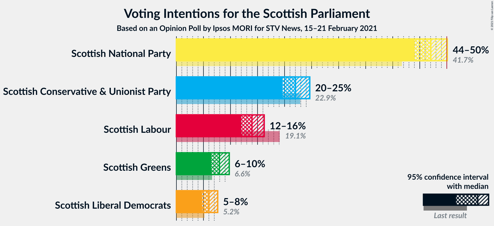
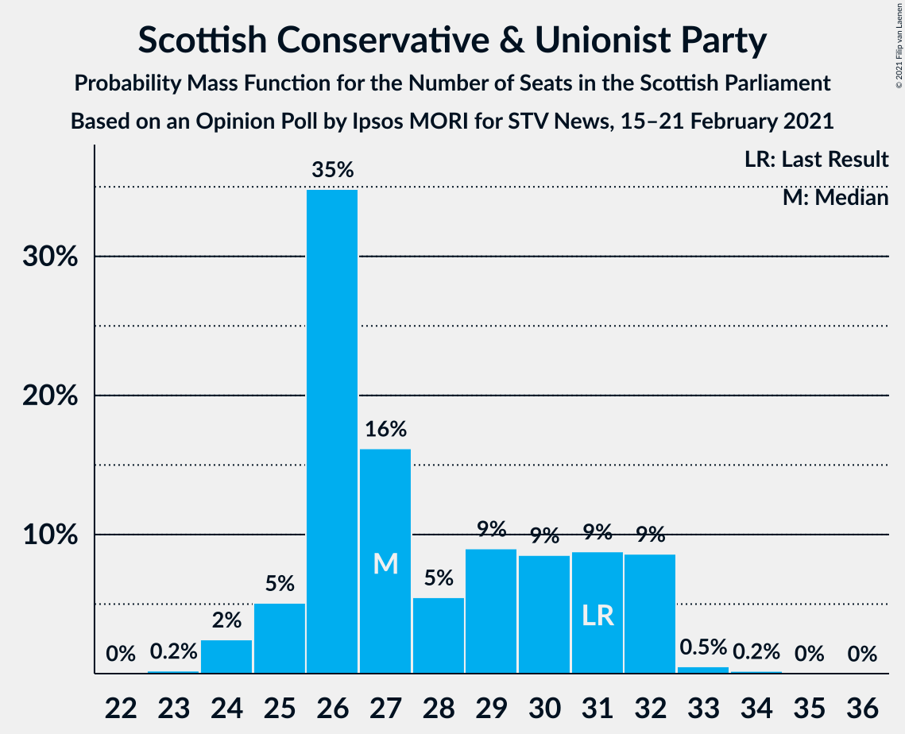
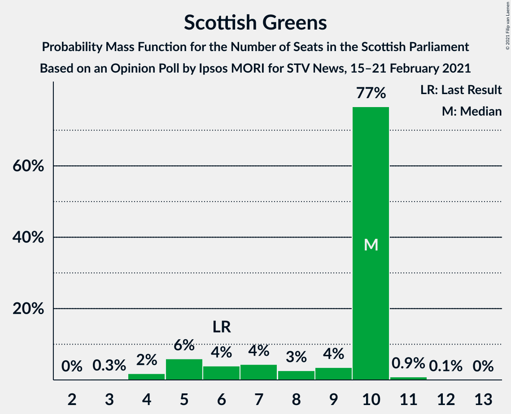
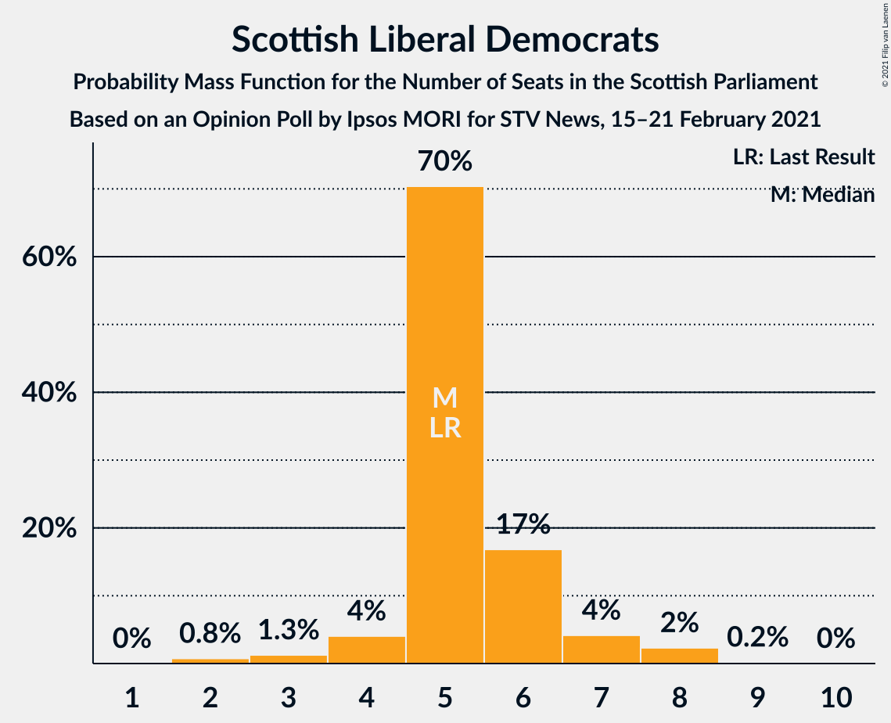
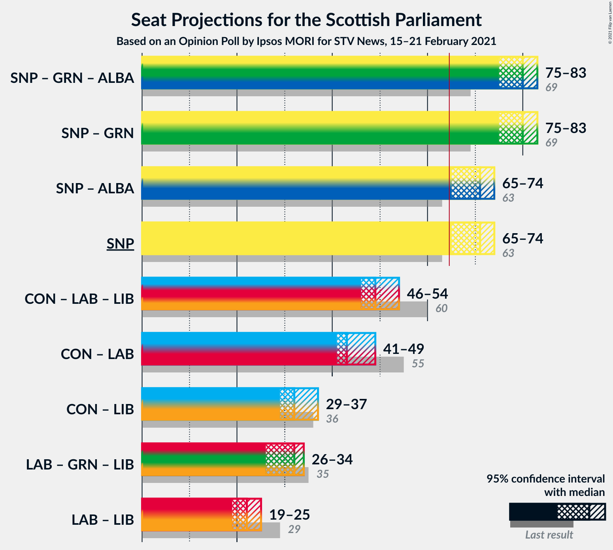

# Opinion Poll by Ipsos MORI for STV News, 15–21 February 2021

<a href="#voting-intentions">Voting Intentions</a> | <a href="#seats">Seats</a> | <a href="#coalitions">Coalitions</a> | <a href="#technical-information">Technical Information</a>

## Voting Intentions

### Confidence Intervals

| Party | Last Result | Poll Result | 80% Confidence Interval | 90% Confidence Interval | 95% Confidence Interval | 99% Confidence Interval |
|:-----:|:-----------:|:-----------:|:-----------------------:|:-----------------------:|:-----------------------:|:-----------------------:|
| Scottish National Party | 41.7% | 47.0% | 45.1–49.0% |44.5–49.6% |44.0–50.1% |43.1–51.1% |
| Scottish Conservative & Unionist Party | 22.9% | 22.0% | 20.4–23.7% |20.0–24.2% |19.6–24.7% |18.9–25.5% |
| Scottish Labour | 19.1% | 14.0% | 12.7–15.4% |12.3–15.9% |12.0–16.2% |11.4–16.9% |
| Scottish Greens | 6.6% | 8.0% | 7.0–9.1% |6.7–9.5% |6.4–9.8% |6.0–10.4% |
| Scottish Liberal Democrats | 5.2% | 6.0% | 5.2–7.1% |4.9–7.4% |4.7–7.6% |4.3–8.2% |

*Note:* The poll result column reflects the actual value used in the calculations. Published results may vary slightly, and in addition be rounded to fewer digits.

## Seats

### Confidence Intervals

| Party | Last Result | Median | 80% Confidence Interval | 90% Confidence Interval | 95% Confidence Interval | 99% Confidence Interval |
|:-----:|:-----------:|:------:|:-----------------------:|:-----------------------:|:-----------------------:|:-----------------------:|
| <a href="#scottish-national-party">Scottish National Party</a> | 63 | 71 | 67–72 |65–73 |65–74 |65–75 |
| <a href="#scottish-conservative-&-unionist-party">Scottish Conservative & Unionist Party</a> | 31 | 27 | 26–31 |25–32 |24–32 |24–33 |
| <a href="#scottish-labour">Scottish Labour</a> | 24 | 17 | 16–17 |15–18 |14–19 |13–22 |
| <a href="#scottish-greens">Scottish Greens</a> | 6 | 10 | 6–10 |5–10 |5–10 |4–11 |
| <a href="#scottish-liberal-democrats">Scottish Liberal Democrats</a> | 5 | 5 | 5–6 |4–7 |4–8 |2–8 |

### Scottish National Party

*For a full overview of the results for this party, see the [Scottish National Party](party-scottishnationalparty.html) page.*

| Number of Seats | Probability | Accumulated | Special Marks |
|:---------------:|:-----------:|:-----------:|:-------------:|
| 63 | 0% | 100% | Last Result |
| 64 | 0.1% | 100% |  |
| 65 | 7% | 99.9% | Majority |
| 66 | 2% | 93% |  |
| 67 | 9% | 91% |  |
| 68 | 6% | 82% |  |
| 69 | 6% | 76% |  |
| 70 | 17% | 70% |  |
| 71 | 33% | 53% | Median |
| 72 | 13% | 20% |  |
| 73 | 5% | 8% |  |
| 74 | 2% | 3% |  |
| 75 | 0.7% | 0.9% |  |
| 76 | 0.2% | 0.2% |  |
| 77 | 0% | 0% |  |

### Scottish Conservative & Unionist Party

*For a full overview of the results for this party, see the [Scottish Conservative & Unionist Party](party-scottishconservativeunionistparty.html) page.*

| Number of Seats | Probability | Accumulated | Special Marks |
|:---------------:|:-----------:|:-----------:|:-------------:|
| 22 | 0% | 100% |  |
| 23 | 0.2% | 99.9% |  |
| 24 | 2% | 99.7% |  |
| 25 | 5% | 97% |  |
| 26 | 35% | 92% |  |
| 27 | 16% | 57% | Median |
| 28 | 5% | 41% |  |
| 29 | 9% | 36% |  |
| 30 | 9% | 27% |  |
| 31 | 9% | 18% | Last Result |
| 32 | 9% | 9% |  |
| 33 | 0.5% | 0.8% |  |
| 34 | 0.2% | 0.2% |  |
| 35 | 0% | 0.1% |  |
| 36 | 0% | 0% |  |

### Scottish Labour

*For a full overview of the results for this party, see the [Scottish Labour](party-scottishlabour.html) page.*

| Number of Seats | Probability | Accumulated | Special Marks |
|:---------------:|:-----------:|:-----------:|:-------------:|
| 12 | 0.3% | 100% |  |
| 13 | 0.9% | 99.6% |  |
| 14 | 2% | 98.7% |  |
| 15 | 3% | 97% |  |
| 16 | 15% | 94% |  |
| 17 | 73% | 79% | Median |
| 18 | 3% | 6% |  |
| 19 | 1.2% | 3% |  |
| 20 | 0.5% | 1.4% |  |
| 21 | 0.3% | 1.0% |  |
| 22 | 0.6% | 0.6% |  |
| 23 | 0% | 0% |  |
| 24 | 0% | 0% | Last Result |

### Scottish Greens

*For a full overview of the results for this party, see the [Scottish Greens](party-scottishgreens.html) page.*

| Number of Seats | Probability | Accumulated | Special Marks |
|:---------------:|:-----------:|:-----------:|:-------------:|
| 3 | 0.3% | 100% |  |
| 4 | 2% | 99.7% |  |
| 5 | 6% | 98% |  |
| 6 | 4% | 92% | Last Result |
| 7 | 4% | 88% |  |
| 8 | 3% | 84% |  |
| 9 | 4% | 81% |  |
| 10 | 77% | 78% | Median |
| 11 | 0.9% | 1.0% |  |
| 12 | 0.1% | 0.1% |  |
| 13 | 0% | 0% |  |

### Scottish Liberal Democrats

*For a full overview of the results for this party, see the [Scottish Liberal Democrats](party-scottishliberaldemocrats.html) page.*

| Number of Seats | Probability | Accumulated | Special Marks |
|:---------------:|:-----------:|:-----------:|:-------------:|
| 2 | 0.8% | 100% |  |
| 3 | 1.3% | 99.2% |  |
| 4 | 4% | 98% |  |
| 5 | 70% | 94% | Last Result, Median |
| 6 | 17% | 24% |  |
| 7 | 4% | 7% |  |
| 8 | 2% | 3% |  |
| 9 | 0.2% | 0.2% |  |
| 10 | 0% | 0% |  |

## Coalitions

### Confidence Intervals

| Coalition | Last Result | Median | Majority? | 80% Confidence Interval | 90% Confidence Interval | 95% Confidence Interval | 99% Confidence Interval |
|:---------:|:-----------:|:------:|:---------:|:-----------------------:|:-----------------------:|:-----------------------:|:-----------------------:|
| Scottish National Party – Scottish Greens | 69 | 80 | 100% | 75–82 | 75–82 | 75–83 | 73–84 |
| Scottish National Party | 63 | 71 | 99.9% | 67–72 | 65–73 | 65–74 | 65–75 |
| Scottish Conservative & Unionist Party – Scottish Labour – Scottish Liberal Democrats | 60 | 49 | 0% | 47–54 | 47–54 | 46–54 | 45–56 |
| Scottish Conservative & Unionist Party – Scottish Labour | 55 | 43 | 0% | 42–48 | 42–49 | 41–49 | 40–51 |
| Scottish Conservative & Unionist Party – Scottish Liberal Democrats | 36 | 32 | 0% | 31–37 | 30–37 | 29–37 | 29–39 |
| Scottish Labour – Scottish Greens – Scottish Liberal Democrats | 35 | 32 | 0% | 28–33 | 27–33 | 26–34 | 25–35 |
| Scottish Labour – Scottish Liberal Democrats | 29 | 22 | 0% | 21–23 | 20–24 | 19–25 | 18–27 |

### Scottish National Party – Scottish Greens

| Number of Seats | Probability | Accumulated | Special Marks |
|:---------------:|:-----------:|:-----------:|:-------------:|
| 69 | 0% | 100% | Last Result |
| 70 | 0.1% | 100% |  |
| 71 | 0.1% | 99.9% |  |
| 72 | 0.2% | 99.8% |  |
| 73 | 0.3% | 99.7% |  |
| 74 | 0.9% | 99.3% |  |
| 75 | 10% | 98% |  |
| 76 | 6% | 88% |  |
| 77 | 11% | 82% |  |
| 78 | 7% | 71% |  |
| 79 | 6% | 63% |  |
| 80 | 14% | 57% |  |
| 81 | 31% | 43% | Median |
| 82 | 8% | 12% |  |
| 83 | 3% | 4% |  |
| 84 | 0.7% | 0.8% |  |
| 85 | 0.1% | 0.1% |  |
| 86 | 0% | 0% |  |

### Scottish National Party

| Number of Seats | Probability | Accumulated | Special Marks |
|:---------------:|:-----------:|:-----------:|:-------------:|
| 63 | 0% | 100% | Last Result |
| 64 | 0.1% | 100% |  |
| 65 | 7% | 99.9% | Majority |
| 66 | 2% | 93% |  |
| 67 | 9% | 91% |  |
| 68 | 6% | 82% |  |
| 69 | 6% | 76% |  |
| 70 | 17% | 70% |  |
| 71 | 33% | 53% | Median |
| 72 | 13% | 20% |  |
| 73 | 5% | 8% |  |
| 74 | 2% | 3% |  |
| 75 | 0.7% | 0.9% |  |
| 76 | 0.2% | 0.2% |  |
| 77 | 0% | 0% |  |

### Scottish Conservative & Unionist Party – Scottish Labour – Scottish Liberal Democrats

| Number of Seats | Probability | Accumulated | Special Marks |
|:---------------:|:-----------:|:-----------:|:-------------:|
| 44 | 0.1% | 100% |  |
| 45 | 0.7% | 99.9% |  |
| 46 | 3% | 99.2% |  |
| 47 | 8% | 96% |  |
| 48 | 31% | 88% |  |
| 49 | 14% | 57% | Median |
| 50 | 6% | 43% |  |
| 51 | 7% | 37% |  |
| 52 | 11% | 29% |  |
| 53 | 6% | 18% |  |
| 54 | 10% | 12% |  |
| 55 | 0.9% | 2% |  |
| 56 | 0.3% | 0.7% |  |
| 57 | 0.2% | 0.3% |  |
| 58 | 0.1% | 0.2% |  |
| 59 | 0.1% | 0.1% |  |
| 60 | 0% | 0% | Last Result |

### Scottish Conservative & Unionist Party – Scottish Labour

| Number of Seats | Probability | Accumulated | Special Marks |
|:---------------:|:-----------:|:-----------:|:-------------:|
| 39 | 0.2% | 100% |  |
| 40 | 0.6% | 99.8% |  |
| 41 | 3% | 99.2% |  |
| 42 | 9% | 96% |  |
| 43 | 39% | 87% |  |
| 44 | 9% | 48% | Median |
| 45 | 5% | 39% |  |
| 46 | 9% | 35% |  |
| 47 | 9% | 26% |  |
| 48 | 8% | 17% |  |
| 49 | 8% | 9% |  |
| 50 | 0.5% | 1.0% |  |
| 51 | 0.2% | 0.5% |  |
| 52 | 0.1% | 0.3% |  |
| 53 | 0.1% | 0.1% |  |
| 54 | 0% | 0% |  |
| 55 | 0% | 0% | Last Result |

### Scottish Conservative & Unionist Party – Scottish Liberal Democrats

| Number of Seats | Probability | Accumulated | Special Marks |
|:---------------:|:-----------:|:-----------:|:-------------:|
| 27 | 0% | 100% |  |
| 28 | 0.4% | 99.9% |  |
| 29 | 3% | 99.6% |  |
| 30 | 5% | 97% |  |
| 31 | 26% | 92% |  |
| 32 | 19% | 65% | Median |
| 33 | 8% | 46% |  |
| 34 | 7% | 38% |  |
| 35 | 10% | 30% |  |
| 36 | 8% | 20% | Last Result |
| 37 | 10% | 12% |  |
| 38 | 1.4% | 2% |  |
| 39 | 0.5% | 0.6% |  |
| 40 | 0.1% | 0.1% |  |
| 41 | 0% | 0% |  |

### Scottish Labour – Scottish Greens – Scottish Liberal Democrats

| Number of Seats | Probability | Accumulated | Special Marks |
|:---------------:|:-----------:|:-----------:|:-------------:|
| 24 | 0.1% | 100% |  |
| 25 | 0.4% | 99.8% |  |
| 26 | 2% | 99.4% |  |
| 27 | 4% | 97% |  |
| 28 | 5% | 93% |  |
| 29 | 5% | 88% |  |
| 30 | 6% | 83% |  |
| 31 | 11% | 76% |  |
| 32 | 46% | 65% | Median |
| 33 | 16% | 19% |  |
| 34 | 2% | 3% |  |
| 35 | 0.6% | 0.7% | Last Result |
| 36 | 0.1% | 0.2% |  |
| 37 | 0% | 0.1% |  |
| 38 | 0% | 0% |  |

### Scottish Labour – Scottish Liberal Democrats

| Number of Seats | Probability | Accumulated | Special Marks |
|:---------------:|:-----------:|:-----------:|:-------------:|
| 16 | 0.1% | 100% |  |
| 17 | 0.4% | 99.9% |  |
| 18 | 1.0% | 99.5% |  |
| 19 | 2% | 98.6% |  |
| 20 | 4% | 96% |  |
| 21 | 12% | 92% |  |
| 22 | 56% | 80% | Median |
| 23 | 18% | 24% |  |
| 24 | 4% | 7% |  |
| 25 | 1.3% | 3% |  |
| 26 | 0.5% | 1.3% |  |
| 27 | 0.6% | 0.8% |  |
| 28 | 0.2% | 0.3% |  |
| 29 | 0% | 0% | Last Result |

## Technical Information

### Opinion Poll

+ **Polling firm:** Ipsos MORI
+ **Commissioner(s):** STV News
+ **Fieldwork period:** 15–21 February 2021

### Calculations

+ **Sample size:** 1031
+ **Simulations done:** 1,048,576
+ **Error estimate:** 0.59%

