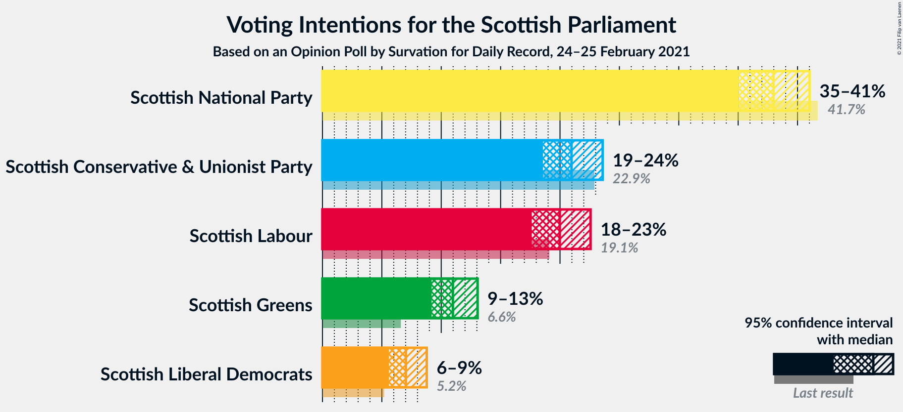
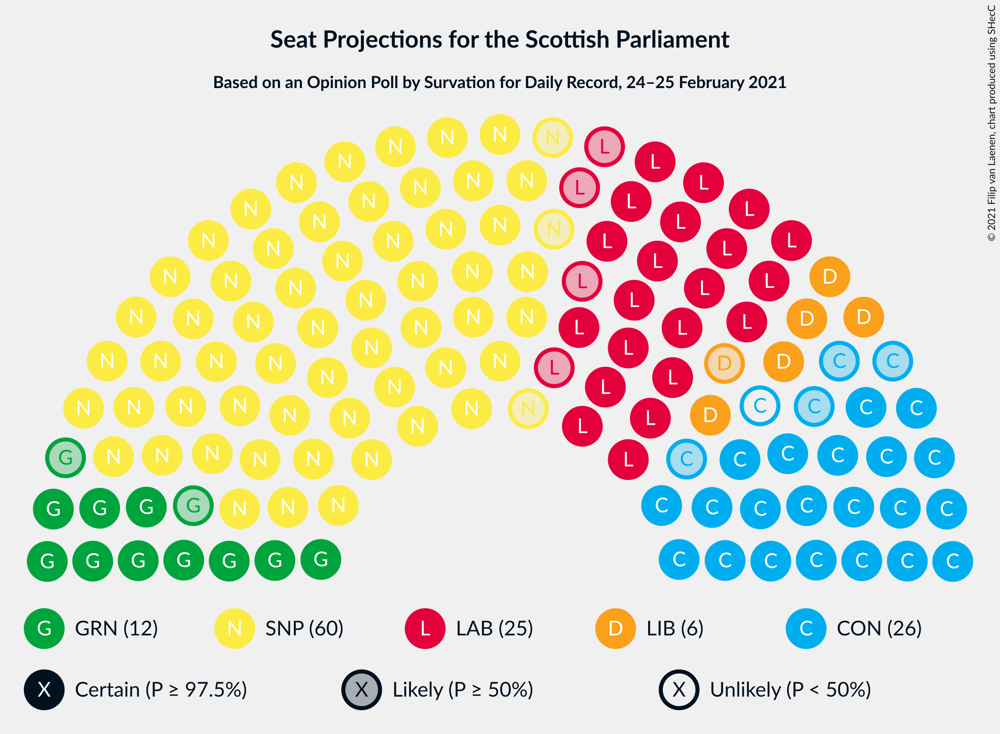
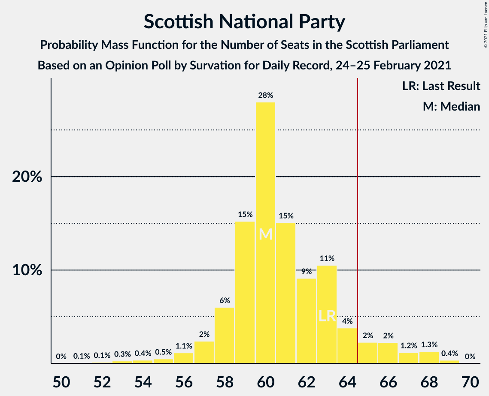
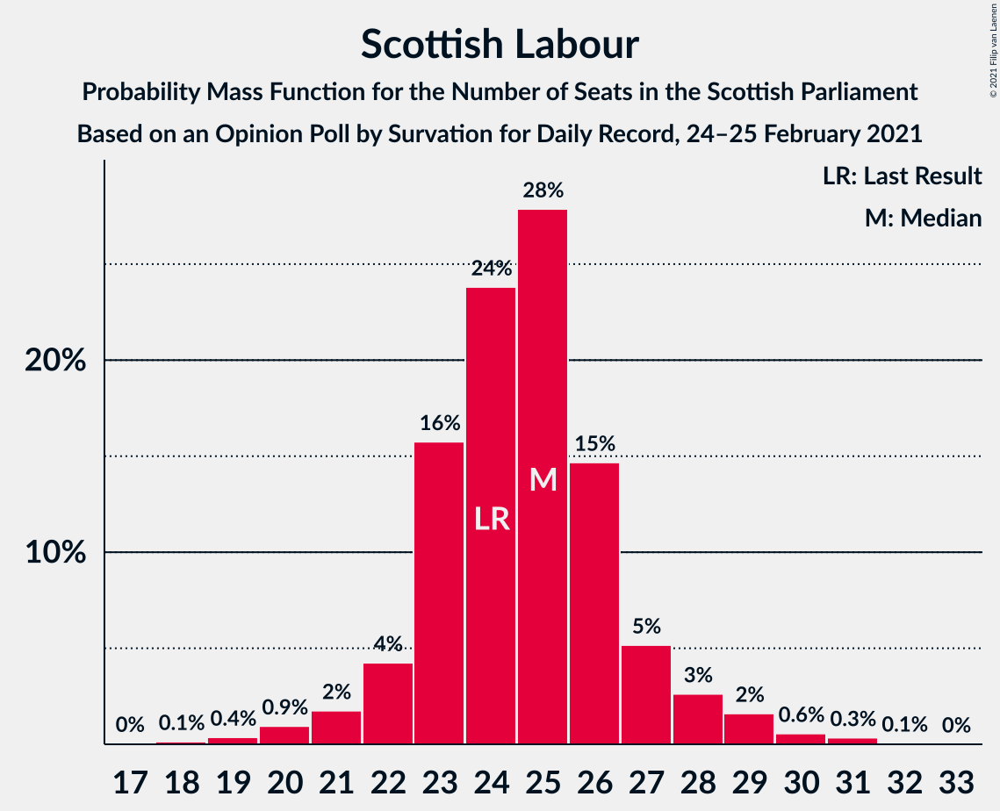
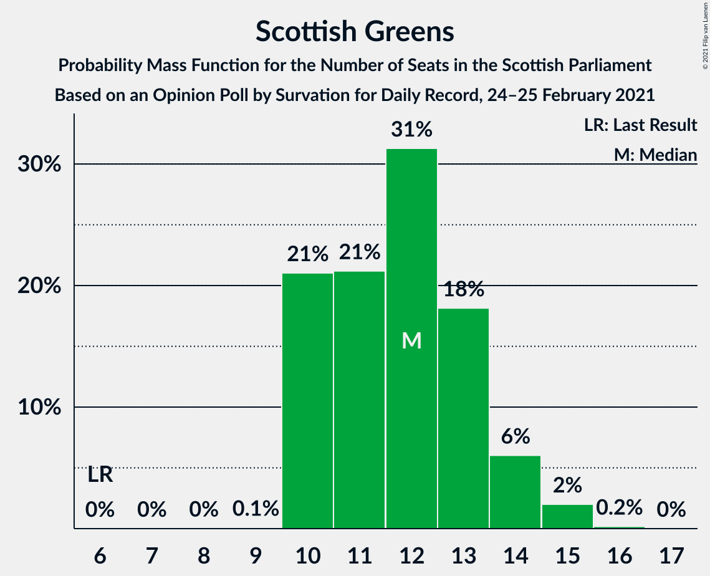
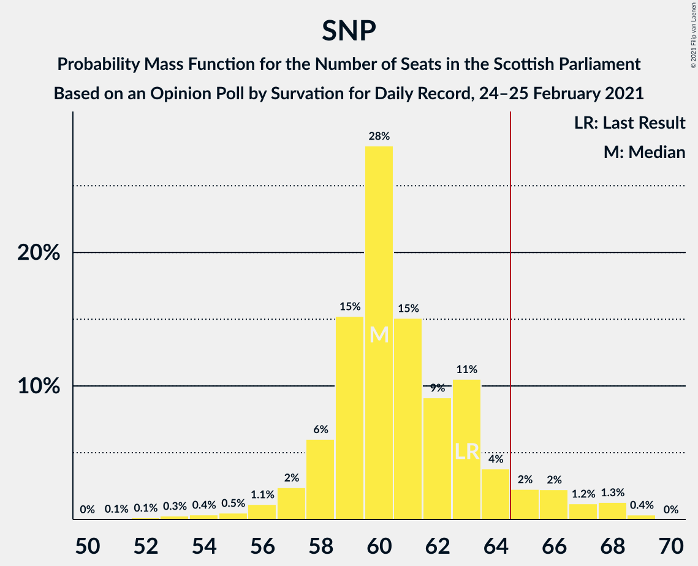

# Opinion Poll by Survation for Daily Record, 24–25 February 2021

<a href="#voting-intentions">Voting Intentions</a> | <a href="#seats">Seats</a> | <a href="#coalitions">Coalitions</a> | <a href="#technical-information">Technical Information</a>

## Voting Intentions

### Confidence Intervals

| Party | Last Result | Poll Result | 80% Confidence Interval | 90% Confidence Interval | 95% Confidence Interval | 99% Confidence Interval |
|:-----:|:-----------:|:-----------:|:-----------------------:|:-----------------------:|:-----------------------:|:-----------------------:|
| Scottish National Party | 41.7% | 38.0% | 36.0–40.0% |35.5–40.5% |35.0–41.0% |34.1–42.0% |
| Scottish Conservative & Unionist Party | 22.9% | 21.0% | 19.4–22.7% |18.9–23.2% |18.6–23.6% |17.8–24.4% |
| Scottish Labour | 19.1% | 20.0% | 18.4–21.7% |18.0–22.1% |17.6–22.6% |16.9–23.4% |
| Scottish Greens | 6.6% | 11.0% | 9.8–12.3% |9.5–12.7% |9.2–13.1% |8.7–13.7% |
| Scottish Liberal Democrats | 5.2% | 7.0% | 6.1–8.2% |5.8–8.5% |5.6–8.8% |5.2–9.3% |

*Note:* The poll result column reflects the actual value used in the calculations. Published results may vary slightly, and in addition be rounded to fewer digits.

## Seats

### Confidence Intervals

| Party | Last Result | Median | 80% Confidence Interval | 90% Confidence Interval | 95% Confidence Interval | 99% Confidence Interval |
|:-----:|:-----------:|:------:|:-----------------------:|:-----------------------:|:-----------------------:|:-----------------------:|
| <a href="#scottish-national-party">Scottish National Party</a> | 63 | 64 | 62–68 |61–68 |61–69 |60–69 |
| <a href="#scottish-conservative-&-unionist-party">Scottish Conservative & Unionist Party</a> | 31 | 24 | 21–27 |21–27 |20–28 |19–29 |
| <a href="#scottish-labour">Scottish Labour</a> | 24 | 23 | 21–26 |20–26 |20–27 |18–29 |
| <a href="#scottish-greens">Scottish Greens</a> | 6 | 11 | 10–12 |10–13 |10–13 |10–14 |
| <a href="#scottish-liberal-democrats">Scottish Liberal Democrats</a> | 5 | 6 | 4–7 |4–8 |4–8 |3–9 |

### Scottish National Party

*For a full overview of the results for this party, see the [Scottish National Party](party-scottishnationalparty.html) page.*

| Number of Seats | Probability | Accumulated | Special Marks |
|:---------------:|:-----------:|:-----------:|:-------------:|
| 59 | 0.3% | 100% |  |
| 60 | 1.3% | 99.7% |  |
| 61 | 5% | 98% |  |
| 62 | 23% | 93% |  |
| 63 | 11% | 70% | Last Result |
| 64 | 14% | 60% | Median |
| 65 | 10% | 45% | Majority |
| 66 | 14% | 36% |  |
| 67 | 9% | 21% |  |
| 68 | 10% | 13% |  |
| 69 | 3% | 3% |  |
| 70 | 0.1% | 0.1% |  |
| 71 | 0% | 0% |  |

### Scottish Conservative & Unionist Party

*For a full overview of the results for this party, see the [Scottish Conservative & Unionist Party](party-scottishconservativeunionistparty.html) page.*

| Number of Seats | Probability | Accumulated | Special Marks |
|:---------------:|:-----------:|:-----------:|:-------------:|
| 18 | 0.1% | 100% |  |
| 19 | 1.0% | 99.9% |  |
| 20 | 3% | 98.9% |  |
| 21 | 13% | 96% |  |
| 22 | 14% | 83% |  |
| 23 | 9% | 69% |  |
| 24 | 11% | 60% | Median |
| 25 | 11% | 48% |  |
| 26 | 24% | 38% |  |
| 27 | 10% | 14% |  |
| 28 | 2% | 4% |  |
| 29 | 0.9% | 1.1% |  |
| 30 | 0.2% | 0.2% |  |
| 31 | 0.1% | 0.1% | Last Result |
| 32 | 0% | 0% |  |

### Scottish Labour

*For a full overview of the results for this party, see the [Scottish Labour](party-scottishlabour.html) page.*

| Number of Seats | Probability | Accumulated | Special Marks |
|:---------------:|:-----------:|:-----------:|:-------------:|
| 17 | 0.1% | 100% |  |
| 18 | 0.5% | 99.9% |  |
| 19 | 1.2% | 99.5% |  |
| 20 | 5% | 98% |  |
| 21 | 5% | 93% |  |
| 22 | 12% | 88% |  |
| 23 | 31% | 76% | Median |
| 24 | 22% | 45% | Last Result |
| 25 | 13% | 24% |  |
| 26 | 7% | 11% |  |
| 27 | 3% | 4% |  |
| 28 | 0.8% | 1.4% |  |
| 29 | 0.6% | 0.6% |  |
| 30 | 0% | 0% |  |

### Scottish Greens

*For a full overview of the results for this party, see the [Scottish Greens](party-scottishgreens.html) page.*

| Number of Seats | Probability | Accumulated | Special Marks |
|:---------------:|:-----------:|:-----------:|:-------------:|
| 6 | 0% | 100% | Last Result |
| 7 | 0% | 100% |  |
| 8 | 0.1% | 100% |  |
| 9 | 0.1% | 99.9% |  |
| 10 | 21% | 99.7% |  |
| 11 | 41% | 79% | Median |
| 12 | 30% | 38% |  |
| 13 | 7% | 9% |  |
| 14 | 1.3% | 2% |  |
| 15 | 0.4% | 0.4% |  |
| 16 | 0% | 0% |  |

### Scottish Liberal Democrats

*For a full overview of the results for this party, see the [Scottish Liberal Democrats](party-scottishliberaldemocrats.html) page.*

| Number of Seats | Probability | Accumulated | Special Marks |
|:---------------:|:-----------:|:-----------:|:-------------:|
| 2 | 0.1% | 100% |  |
| 3 | 1.0% | 99.9% |  |
| 4 | 18% | 98.9% |  |
| 5 | 16% | 81% | Last Result |
| 6 | 39% | 65% | Median |
| 7 | 17% | 26% |  |
| 8 | 8% | 10% |  |
| 9 | 1.2% | 1.5% |  |
| 10 | 0.3% | 0.3% |  |
| 11 | 0% | 0% |  |

## Coalitions

### Confidence Intervals

| Coalition | Last Result | Median | Majority? | 80% Confidence Interval | 90% Confidence Interval | 95% Confidence Interval | 99% Confidence Interval |
|:---------:|:-----------:|:------:|:---------:|:-----------------------:|:-----------------------:|:-----------------------:|:-----------------------:|
| Scottish National Party – Scottish Greens | 69 | 76 | 100% | 73–79 | 72–80 | 71–80 | 70–81 |
| Scottish National Party | 63 | 64 | 45% | 62–68 | 61–68 | 61–69 | 60–69 |
| Scottish Conservative & Unionist Party – Scottish Labour – Scottish Liberal Democrats | 60 | 53 | 0% | 50–56 | 49–57 | 49–58 | 48–59 |
| Scottish Conservative & Unionist Party – Scottish Labour | 55 | 47 | 0% | 44–51 | 44–51 | 43–51 | 42–53 |
| Scottish Labour – Scottish Greens – Scottish Liberal Democrats | 35 | 41 | 0% | 38–43 | 37–44 | 37–44 | 35–45 |
| Scottish Conservative & Unionist Party – Scottish Liberal Democrats | 36 | 30 | 0% | 26–33 | 26–34 | 25–34 | 24–35 |
| Scottish Labour – Scottish Liberal Democrats | 29 | 29 | 0% | 27–32 | 26–33 | 26–33 | 24–35 |

### Scottish National Party – Scottish Greens

| Number of Seats | Probability | Accumulated | Special Marks |
|:---------------:|:-----------:|:-----------:|:-------------:|
| 69 | 0.2% | 100% | Last Result |
| 70 | 0.7% | 99.8% |  |
| 71 | 3% | 99.1% |  |
| 72 | 4% | 96% |  |
| 73 | 19% | 92% |  |
| 74 | 10% | 73% |  |
| 75 | 13% | 63% | Median |
| 76 | 12% | 50% |  |
| 77 | 10% | 38% |  |
| 78 | 8% | 27% |  |
| 79 | 12% | 19% |  |
| 80 | 5% | 7% |  |
| 81 | 1.2% | 1.4% |  |
| 82 | 0.1% | 0.1% |  |
| 83 | 0% | 0% |  |

### Scottish National Party

| Number of Seats | Probability | Accumulated | Special Marks |
|:---------------:|:-----------:|:-----------:|:-------------:|
| 59 | 0.3% | 100% |  |
| 60 | 1.3% | 99.7% |  |
| 61 | 5% | 98% |  |
| 62 | 23% | 93% |  |
| 63 | 11% | 70% | Last Result |
| 64 | 14% | 60% | Median |
| 65 | 10% | 45% | Majority |
| 66 | 14% | 36% |  |
| 67 | 9% | 21% |  |
| 68 | 10% | 13% |  |
| 69 | 3% | 3% |  |
| 70 | 0.1% | 0.1% |  |
| 71 | 0% | 0% |  |

### Scottish Conservative & Unionist Party – Scottish Labour – Scottish Liberal Democrats

| Number of Seats | Probability | Accumulated | Special Marks |
|:---------------:|:-----------:|:-----------:|:-------------:|
| 47 | 0.1% | 100% |  |
| 48 | 1.2% | 99.9% |  |
| 49 | 5% | 98.6% |  |
| 50 | 12% | 93% |  |
| 51 | 8% | 81% |  |
| 52 | 10% | 73% |  |
| 53 | 12% | 62% | Median |
| 54 | 13% | 50% |  |
| 55 | 10% | 37% |  |
| 56 | 19% | 27% |  |
| 57 | 4% | 8% |  |
| 58 | 3% | 4% |  |
| 59 | 0.7% | 0.9% |  |
| 60 | 0.2% | 0.2% | Last Result |
| 61 | 0% | 0% |  |

### Scottish Conservative & Unionist Party – Scottish Labour

| Number of Seats | Probability | Accumulated | Special Marks |
|:---------------:|:-----------:|:-----------:|:-------------:|
| 41 | 0.2% | 100% |  |
| 42 | 0.4% | 99.8% |  |
| 43 | 2% | 99.4% |  |
| 44 | 9% | 97% |  |
| 45 | 14% | 88% |  |
| 46 | 12% | 75% |  |
| 47 | 13% | 63% | Median |
| 48 | 12% | 50% |  |
| 49 | 12% | 38% |  |
| 50 | 14% | 26% |  |
| 51 | 10% | 12% |  |
| 52 | 1.3% | 2% |  |
| 53 | 0.7% | 0.8% |  |
| 54 | 0% | 0.1% |  |
| 55 | 0% | 0% | Last Result |

### Scottish Labour – Scottish Greens – Scottish Liberal Democrats

| Number of Seats | Probability | Accumulated | Special Marks |
|:---------------:|:-----------:|:-----------:|:-------------:|
| 35 | 0.8% | 100% | Last Result |
| 36 | 0.9% | 99.2% |  |
| 37 | 4% | 98% |  |
| 38 | 8% | 94% |  |
| 39 | 18% | 87% |  |
| 40 | 17% | 69% | Median |
| 41 | 22% | 52% |  |
| 42 | 14% | 30% |  |
| 43 | 10% | 15% |  |
| 44 | 4% | 6% |  |
| 45 | 1.2% | 2% |  |
| 46 | 0.3% | 0.4% |  |
| 47 | 0.1% | 0.1% |  |
| 48 | 0% | 0% |  |

### Scottish Conservative & Unionist Party – Scottish Liberal Democrats

| Number of Seats | Probability | Accumulated | Special Marks |
|:---------------:|:-----------:|:-----------:|:-------------:|
| 24 | 0.5% | 100% |  |
| 25 | 3% | 99.5% |  |
| 26 | 9% | 97% |  |
| 27 | 12% | 88% |  |
| 28 | 11% | 76% |  |
| 29 | 8% | 65% |  |
| 30 | 13% | 57% | Median |
| 31 | 10% | 44% |  |
| 32 | 13% | 34% |  |
| 33 | 13% | 21% |  |
| 34 | 6% | 8% |  |
| 35 | 2% | 2% |  |
| 36 | 0.2% | 0.3% | Last Result |
| 37 | 0.1% | 0.1% |  |
| 38 | 0% | 0% |  |

### Scottish Labour – Scottish Liberal Democrats

| Number of Seats | Probability | Accumulated | Special Marks |
|:---------------:|:-----------:|:-----------:|:-------------:|
| 22 | 0.1% | 100% |  |
| 23 | 0.2% | 99.9% |  |
| 24 | 0.4% | 99.7% |  |
| 25 | 1.5% | 99.3% |  |
| 26 | 4% | 98% |  |
| 27 | 12% | 94% |  |
| 28 | 19% | 82% |  |
| 29 | 23% | 64% | Last Result, Median |
| 30 | 17% | 41% |  |
| 31 | 12% | 24% |  |
| 32 | 6% | 12% |  |
| 33 | 4% | 6% |  |
| 34 | 2% | 2% |  |
| 35 | 0.5% | 0.6% |  |
| 36 | 0.1% | 0.1% |  |
| 37 | 0% | 0% |  |

## Technical Information

### Opinion Poll

+ **Polling firm:** Survation
+ **Commissioner(s):** Daily Record
+ **Fieldwork period:** 24–25 February 2021

### Calculations

+ **Sample size:** 1011
+ **Simulations done:** 131,072
+ **Error estimate:** 1.07%

