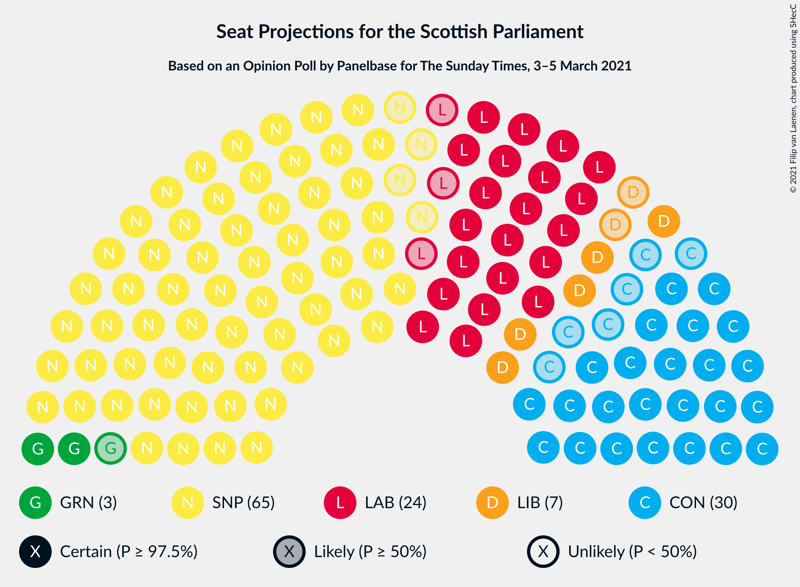

# Opinion Poll by Panelbase for The Sunday Times, 3–5 March 2021

<a href="#voting-intentions">Voting Intentions</a> | <a href="#seats">Seats</a> | <a href="#coalitions">Coalitions</a> | <a href="#technical-information">Technical Information</a>

## Voting Intentions

### Confidence Intervals

| Party | Last Result | Poll Result | 80% Confidence Interval | 90% Confidence Interval | 95% Confidence Interval | 99% Confidence Interval |
|:-----:|:-----------:|:-----------:|:-----------------------:|:-----------------------:|:-----------------------:|:-----------------------:|
| Scottish National Party | 41.7% | 42.0% | 40.0–44.0% |39.4–44.5% |38.9–45.0% |38.0–46.0% |
| Scottish Conservative & Unionist Party | 22.9% | 22.0% | 20.4–23.8% |20.0–24.2% |19.6–24.7% |18.8–25.5% |
| Scottish Labour | 19.1% | 19.0% | 17.4–20.6% |17.0–21.1% |16.7–21.5% |16.0–22.3% |
| Scottish Liberal Democrats | 5.2% | 7.0% | 6.1–8.2% |5.8–8.5% |5.6–8.8% |5.2–9.3% |
| Scottish Greens | 6.6% | 6.0% | 5.2–7.1% |4.9–7.4% |4.7–7.7% |4.3–8.2% |

*Note:* The poll result column reflects the actual value used in the calculations. Published results may vary slightly, and in addition be rounded to fewer digits.

## Seats

### Confidence Intervals

| Party | Last Result | Median | 80% Confidence Interval | 90% Confidence Interval | 95% Confidence Interval | 99% Confidence Interval |
|:-----:|:-----------:|:------:|:-----------------------:|:-----------------------:|:-----------------------:|:-----------------------:|
| <a href="#scottish-national-party">Scottish National Party</a> | 63 | 65 | 62–68 |61–69 |60–70 |59–71 |
| <a href="#scottish-conservative-&-unionist-party">Scottish Conservative & Unionist Party</a> | 31 | 29 | 25–32 |25–32 |24–33 |24–34 |
| <a href="#scottish-labour">Scottish Labour</a> | 24 | 24 | 22–27 |22–28 |21–29 |19–30 |
| <a href="#scottish-liberal-democrats">Scottish Liberal Democrats</a> | 5 | 7 | 5–8 |5–9 |5–9 |5–11 |
| <a href="#scottish-greens">Scottish Greens</a> | 6 | 4 | 3–6 |2–9 |2–9 |2–10 |

### Scottish National Party

*For a full overview of the results for this party, see the [Scottish National Party](party-scottishnationalparty.html) page.*

| Number of Seats | Probability | Accumulated | Special Marks |
|:---------------:|:-----------:|:-----------:|:-------------:|
| 57 | 0% | 100% |  |
| 58 | 0.1% | 99.9% |  |
| 59 | 0.6% | 99.8% |  |
| 60 | 2% | 99.2% |  |
| 61 | 6% | 97% |  |
| 62 | 15% | 91% |  |
| 63 | 13% | 76% | Last Result |
| 64 | 11% | 63% |  |
| 65 | 24% | 52% | Median, Majority |
| 66 | 10% | 28% |  |
| 67 | 7% | 17% |  |
| 68 | 3% | 10% |  |
| 69 | 3% | 7% |  |
| 70 | 3% | 4% |  |
| 71 | 0.7% | 0.8% |  |
| 72 | 0.1% | 0.1% |  |
| 73 | 0% | 0% |  |

### Scottish Conservative & Unionist Party

*For a full overview of the results for this party, see the [Scottish Conservative & Unionist Party](party-scottishconservativeunionistparty.html) page.*

| Number of Seats | Probability | Accumulated | Special Marks |
|:---------------:|:-----------:|:-----------:|:-------------:|
| 22 | 0.1% | 100% |  |
| 23 | 0.3% | 99.9% |  |
| 24 | 2% | 99.6% |  |
| 25 | 9% | 97% |  |
| 26 | 10% | 89% |  |
| 27 | 9% | 79% |  |
| 28 | 9% | 70% |  |
| 29 | 11% | 61% | Median |
| 30 | 16% | 50% |  |
| 31 | 20% | 34% | Last Result |
| 32 | 11% | 14% |  |
| 33 | 2% | 3% |  |
| 34 | 0.5% | 0.7% |  |
| 35 | 0.2% | 0.3% |  |
| 36 | 0.1% | 0.1% |  |
| 37 | 0% | 0% |  |

### Scottish Labour

*For a full overview of the results for this party, see the [Scottish Labour](party-scottishlabour.html) page.*

| Number of Seats | Probability | Accumulated | Special Marks |
|:---------------:|:-----------:|:-----------:|:-------------:|
| 17 | 0.1% | 100% |  |
| 18 | 0.2% | 99.9% |  |
| 19 | 0.3% | 99.7% |  |
| 20 | 0.4% | 99.4% |  |
| 21 | 2% | 99.0% |  |
| 22 | 12% | 97% |  |
| 23 | 16% | 85% |  |
| 24 | 20% | 69% | Last Result, Median |
| 25 | 12% | 49% |  |
| 26 | 15% | 37% |  |
| 27 | 14% | 22% |  |
| 28 | 5% | 8% |  |
| 29 | 1.4% | 3% |  |
| 30 | 1.1% | 1.2% |  |
| 31 | 0.1% | 0.1% |  |
| 32 | 0% | 0% |  |

### Scottish Liberal Democrats

*For a full overview of the results for this party, see the [Scottish Liberal Democrats](party-scottishliberaldemocrats.html) page.*

| Number of Seats | Probability | Accumulated | Special Marks |
|:---------------:|:-----------:|:-----------:|:-------------:|
| 4 | 0.2% | 100% |  |
| 5 | 25% | 99.8% | Last Result |
| 6 | 24% | 75% |  |
| 7 | 16% | 51% | Median |
| 8 | 29% | 35% |  |
| 9 | 4% | 6% |  |
| 10 | 1.2% | 2% |  |
| 11 | 0.6% | 0.7% |  |
| 12 | 0.1% | 0.1% |  |
| 13 | 0% | 0% |  |

### Scottish Greens

*For a full overview of the results for this party, see the [Scottish Greens](party-scottishgreens.html) page.*

| Number of Seats | Probability | Accumulated | Special Marks |
|:---------------:|:-----------:|:-----------:|:-------------:|
| 2 | 7% | 100% |  |
| 3 | 41% | 92% |  |
| 4 | 19% | 52% | Median |
| 5 | 12% | 32% |  |
| 6 | 10% | 20% | Last Result |
| 7 | 3% | 10% |  |
| 8 | 2% | 7% |  |
| 9 | 3% | 5% |  |
| 10 | 2% | 2% |  |
| 11 | 0% | 0% |  |

## Coalitions

### Confidence Intervals

| Coalition | Last Result | Median | Majority? | 80% Confidence Interval | 90% Confidence Interval | 95% Confidence Interval | 99% Confidence Interval |
|:---------:|:-----------:|:------:|:---------:|:-----------------------:|:-----------------------:|:-----------------------:|:-----------------------:|
| Scottish National Party – Scottish Greens | 69 | 68 | 95% | 65–73 | 64–74 | 64–75 | 62–76 |
| Scottish National Party | 63 | 65 | 52% | 62–68 | 61–69 | 60–70 | 59–71 |
| Scottish Conservative & Unionist Party – Scottish Labour – Scottish Liberal Democrats | 60 | 61 | 5% | 56–64 | 55–65 | 54–65 | 53–67 |
| Scottish Conservative & Unionist Party – Scottish Labour | 55 | 54 | 0% | 50–57 | 48–58 | 48–58 | 46–60 |
| Scottish Labour – Scottish Liberal Democrats – Scottish Greens | 35 | 35 | 0% | 33–39 | 32–40 | 32–41 | 31–42 |
| Scottish Conservative & Unionist Party – Scottish Liberal Democrats | 36 | 36 | 0% | 32–39 | 31–39 | 30–40 | 29–41 |
| Scottish Labour – Scottish Liberal Democrats | 29 | 31 | 0% | 29–35 | 28–35 | 27–36 | 26–37 |

### Scottish National Party – Scottish Greens

| Number of Seats | Probability | Accumulated | Special Marks |
|:---------------:|:-----------:|:-----------:|:-------------:|
| 61 | 0.1% | 100% |  |
| 62 | 0.4% | 99.9% |  |
| 63 | 0.9% | 99.5% |  |
| 64 | 4% | 98.5% |  |
| 65 | 11% | 95% | Majority |
| 66 | 7% | 84% |  |
| 67 | 11% | 77% |  |
| 68 | 16% | 66% |  |
| 69 | 15% | 49% | Last Result, Median |
| 70 | 12% | 34% |  |
| 71 | 5% | 23% |  |
| 72 | 6% | 18% |  |
| 73 | 5% | 11% |  |
| 74 | 4% | 7% |  |
| 75 | 2% | 3% |  |
| 76 | 0.7% | 1.0% |  |
| 77 | 0.2% | 0.3% |  |
| 78 | 0.1% | 0.2% |  |
| 79 | 0% | 0.1% |  |
| 80 | 0% | 0% |  |

### Scottish National Party

| Number of Seats | Probability | Accumulated | Special Marks |
|:---------------:|:-----------:|:-----------:|:-------------:|
| 57 | 0% | 100% |  |
| 58 | 0.1% | 99.9% |  |
| 59 | 0.6% | 99.8% |  |
| 60 | 2% | 99.2% |  |
| 61 | 6% | 97% |  |
| 62 | 15% | 91% |  |
| 63 | 13% | 76% | Last Result |
| 64 | 11% | 63% |  |
| 65 | 24% | 52% | Median, Majority |
| 66 | 10% | 28% |  |
| 67 | 7% | 17% |  |
| 68 | 3% | 10% |  |
| 69 | 3% | 7% |  |
| 70 | 3% | 4% |  |
| 71 | 0.7% | 0.8% |  |
| 72 | 0.1% | 0.1% |  |
| 73 | 0% | 0% |  |

### Scottish Conservative & Unionist Party – Scottish Labour – Scottish Liberal Democrats

| Number of Seats | Probability | Accumulated | Special Marks |
|:---------------:|:-----------:|:-----------:|:-------------:|
| 50 | 0% | 100% |  |
| 51 | 0.1% | 99.9% |  |
| 52 | 0.2% | 99.8% |  |
| 53 | 0.7% | 99.7% |  |
| 54 | 2% | 99.0% |  |
| 55 | 4% | 97% |  |
| 56 | 5% | 93% |  |
| 57 | 6% | 89% |  |
| 58 | 5% | 82% |  |
| 59 | 12% | 77% |  |
| 60 | 15% | 66% | Last Result, Median |
| 61 | 16% | 51% |  |
| 62 | 11% | 34% |  |
| 63 | 7% | 23% |  |
| 64 | 11% | 16% |  |
| 65 | 4% | 5% | Majority |
| 66 | 0.9% | 1.5% |  |
| 67 | 0.4% | 0.5% |  |
| 68 | 0.1% | 0.1% |  |
| 69 | 0% | 0% |  |

### Scottish Conservative & Unionist Party – Scottish Labour

| Number of Seats | Probability | Accumulated | Special Marks |
|:---------------:|:-----------:|:-----------:|:-------------:|
| 44 | 0.1% | 100% |  |
| 45 | 0.2% | 99.9% |  |
| 46 | 0.4% | 99.7% |  |
| 47 | 1.2% | 99.3% |  |
| 48 | 3% | 98% |  |
| 49 | 4% | 95% |  |
| 50 | 6% | 91% |  |
| 51 | 7% | 85% |  |
| 52 | 11% | 78% |  |
| 53 | 10% | 67% | Median |
| 54 | 15% | 57% |  |
| 55 | 13% | 42% | Last Result |
| 56 | 12% | 29% |  |
| 57 | 11% | 17% |  |
| 58 | 4% | 6% |  |
| 59 | 2% | 2% |  |
| 60 | 0.4% | 0.6% |  |
| 61 | 0.1% | 0.1% |  |
| 62 | 0% | 0% |  |

### Scottish Labour – Scottish Liberal Democrats – Scottish Greens

| Number of Seats | Probability | Accumulated | Special Marks |
|:---------------:|:-----------:|:-----------:|:-------------:|
| 29 | 0% | 100% |  |
| 30 | 0.2% | 99.9% |  |
| 31 | 0.8% | 99.7% |  |
| 32 | 6% | 98.9% |  |
| 33 | 16% | 93% |  |
| 34 | 13% | 77% |  |
| 35 | 16% | 64% | Last Result, Median |
| 36 | 14% | 47% |  |
| 37 | 11% | 33% |  |
| 38 | 10% | 22% |  |
| 39 | 5% | 12% |  |
| 40 | 4% | 7% |  |
| 41 | 2% | 3% |  |
| 42 | 1.0% | 1.3% |  |
| 43 | 0.2% | 0.3% |  |
| 44 | 0.1% | 0.1% |  |
| 45 | 0% | 0% |  |

### Scottish Conservative & Unionist Party – Scottish Liberal Democrats

| Number of Seats | Probability | Accumulated | Special Marks |
|:---------------:|:-----------:|:-----------:|:-------------:|
| 28 | 0.1% | 100% |  |
| 29 | 0.9% | 99.9% |  |
| 30 | 2% | 99.1% |  |
| 31 | 4% | 97% |  |
| 32 | 7% | 92% |  |
| 33 | 8% | 85% |  |
| 34 | 6% | 77% |  |
| 35 | 12% | 71% |  |
| 36 | 13% | 59% | Last Result, Median |
| 37 | 25% | 46% |  |
| 38 | 11% | 21% |  |
| 39 | 6% | 11% |  |
| 40 | 3% | 5% |  |
| 41 | 1.2% | 2% |  |
| 42 | 0.3% | 0.4% |  |
| 43 | 0% | 0.1% |  |
| 44 | 0% | 0% |  |

### Scottish Labour – Scottish Liberal Democrats

| Number of Seats | Probability | Accumulated | Special Marks |
|:---------------:|:-----------:|:-----------:|:-------------:|
| 23 | 0% | 100% |  |
| 24 | 0.2% | 99.9% |  |
| 25 | 0.2% | 99.8% |  |
| 26 | 0.3% | 99.6% |  |
| 27 | 2% | 99.2% |  |
| 28 | 5% | 97% |  |
| 29 | 13% | 92% | Last Result |
| 30 | 21% | 79% |  |
| 31 | 16% | 59% | Median |
| 32 | 12% | 43% |  |
| 33 | 9% | 31% |  |
| 34 | 9% | 21% |  |
| 35 | 9% | 12% |  |
| 36 | 2% | 4% |  |
| 37 | 1.0% | 1.3% |  |
| 38 | 0.2% | 0.3% |  |
| 39 | 0.1% | 0.1% |  |
| 40 | 0% | 0% |  |

## Technical Information

### Opinion Poll

+ **Polling firm:** Panelbase
+ **Commissioner(s):** The Sunday Times
+ **Fieldwork period:** 3–5 March 2021

### Calculations

+ **Sample size:** 1013
+ **Simulations done:** 524,288
+ **Error estimate:** 0.40%

