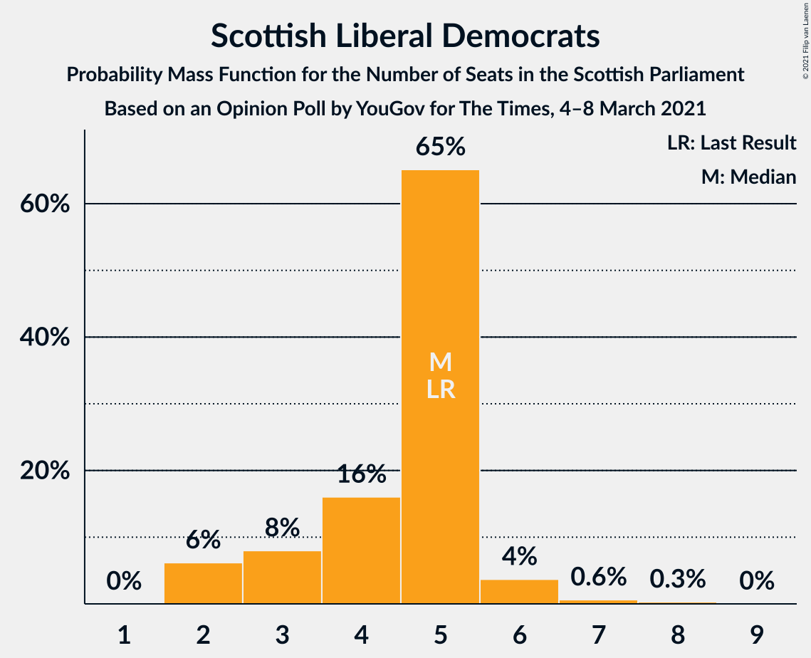
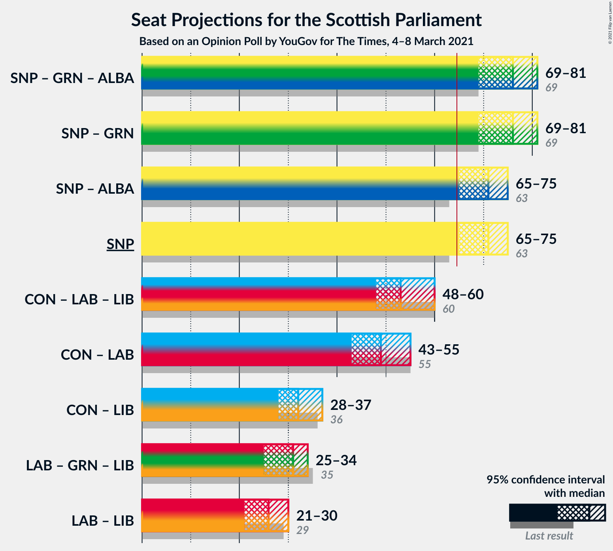
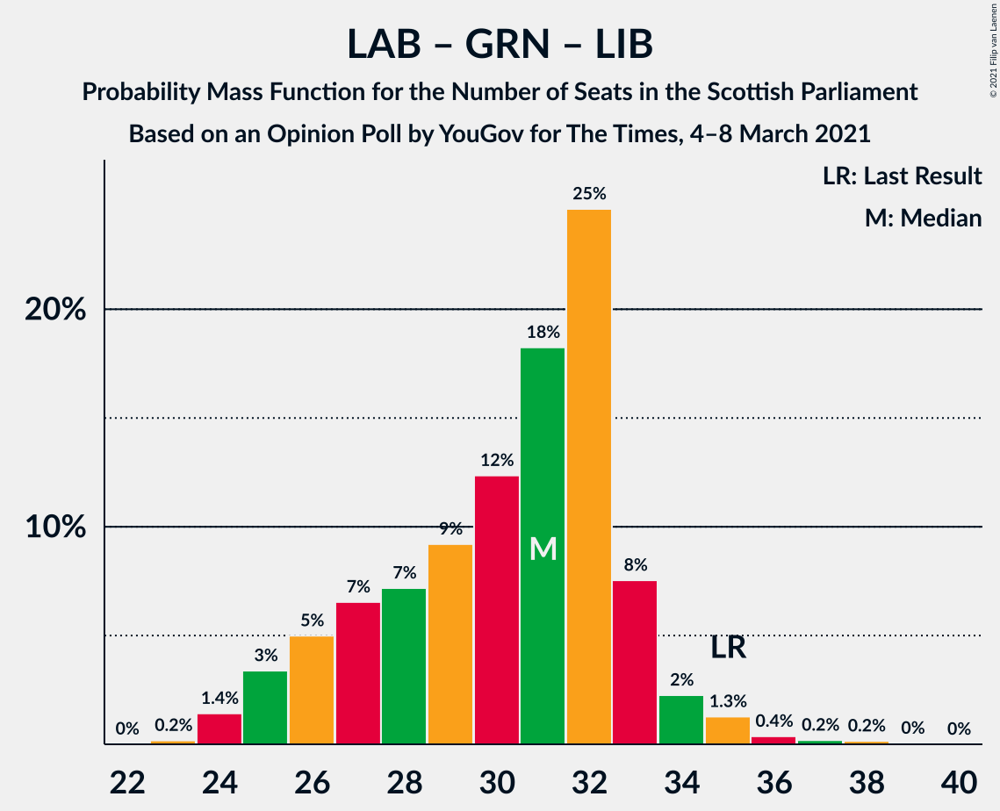

# Opinion Poll by YouGov for The Times, 4–8 March 2021

<a href="#voting-intentions">Voting Intentions</a> | <a href="#seats">Seats</a> | <a href="#coalitions">Coalitions</a> | <a href="#technical-information">Technical Information</a>

## Voting Intentions

### Confidence Intervals

| Party | Last Result | Poll Result | 80% Confidence Interval | 90% Confidence Interval | 95% Confidence Interval | 99% Confidence Interval |
|:-----:|:-----------:|:-----------:|:-----------------------:|:-----------------------:|:-----------------------:|:-----------------------:|
| Scottish National Party | 0.0% | 45.0% | 43.1–46.9% |42.5–47.5% |42.1–48.0% |41.2–48.9% |
| Scottish Conservative & Unionist Party | 0.0% | 21.0% | 19.5–22.6% |19.1–23.1% |18.7–23.5% |18.0–24.3% |
| Scottish Labour | 0.0% | 16.0% | 14.6–17.5% |14.3–17.9% |13.9–18.3% |13.3–19.0% |
| Scottish Greens | 0.0% | 6.0% | 5.2–7.0% |4.9–7.3% |4.7–7.6% |4.4–8.1% |
| Scottish Liberal Democrats | 0.0% | 5.0% | 4.3–6.0% |4.0–6.2% |3.9–6.5% |3.5–7.0% |
| Scottish Socialist Party | 0.0% | 3.0% | 2.4–3.8% |2.3–4.0% |2.1–4.2% |1.9–4.6% |

*Note:* The poll result column reflects the actual value used in the calculations. Published results may vary slightly, and in addition be rounded to fewer digits.

## Seats

### Confidence Intervals

| Party | Last Result | Median | 80% Confidence Interval | 90% Confidence Interval | 95% Confidence Interval | 99% Confidence Interval |
|:-----:|:-----------:|:------:|:-----------------------:|:-----------------------:|:-----------------------:|:-----------------------:|
| <a href="#scottish-national-party">Scottish National Party</a> | 0 | 70 | 67–72 |66–73 |65–73 |64–75 |
| <a href="#scottish-conservative-&-unionist-party">Scottish Conservative & Unionist Party</a> | 0 | 29 | 25–32 |24–32 |24–32 |23–33 |
| <a href="#scottish-labour">Scottish Labour</a> | 0 | 21 | 18–23 |17–24 |17–24 |17–26 |
| <a href="#scottish-greens">Scottish Greens</a> | 0 | 4 | 3–8 |3–9 |3–10 |2–10 |
| <a href="#scottish-liberal-democrats">Scottish Liberal Democrats</a> | 0 | 5 | 3–5 |2–5 |2–6 |2–7 |
| <a href="#scottish-socialist-party">Scottish Socialist Party</a> | 0 | 1 | 0–1 |0–1 |0–2 |0–2 |

### Scottish National Party

*For a full overview of the results for this party, see the [Scottish National Party](party-scottishnationalparty.html) page.*

| Number of Seats | Probability | Accumulated | Special Marks |
|:---------------:|:-----------:|:-----------:|:-------------:|
| 0 | 0% | 100% | Last Result |
| 1 | 0% | 100% |  |
| 2 | 0% | 100% |  |
| 3 | 0% | 100% |  |
| 4 | 0% | 100% |  |
| 5 | 0% | 100% |  |
| 6 | 0% | 100% |  |
| 7 | 0% | 100% |  |
| 8 | 0% | 100% |  |
| 9 | 0% | 100% |  |
| 10 | 0% | 100% |  |
| 11 | 0% | 100% |  |
| 12 | 0% | 100% |  |
| 13 | 0% | 100% |  |
| 14 | 0% | 100% |  |
| 15 | 0% | 100% |  |
| 16 | 0% | 100% |  |
| 17 | 0% | 100% |  |
| 18 | 0% | 100% |  |
| 19 | 0% | 100% |  |
| 20 | 0% | 100% |  |
| 21 | 0% | 100% |  |
| 22 | 0% | 100% |  |
| 23 | 0% | 100% |  |
| 24 | 0% | 100% |  |
| 25 | 0% | 100% |  |
| 26 | 0% | 100% |  |
| 27 | 0% | 100% |  |
| 28 | 0% | 100% |  |
| 29 | 0% | 100% |  |
| 30 | 0% | 100% |  |
| 31 | 0% | 100% |  |
| 32 | 0% | 100% |  |
| 33 | 0% | 100% |  |
| 34 | 0% | 100% |  |
| 35 | 0% | 100% |  |
| 36 | 0% | 100% |  |
| 37 | 0% | 100% |  |
| 38 | 0% | 100% |  |
| 39 | 0% | 100% |  |
| 40 | 0% | 100% |  |
| 41 | 0% | 100% |  |
| 42 | 0% | 100% |  |
| 43 | 0% | 100% |  |
| 44 | 0% | 100% |  |
| 45 | 0% | 100% |  |
| 46 | 0% | 100% |  |
| 47 | 0% | 100% |  |
| 48 | 0% | 100% |  |
| 49 | 0% | 100% |  |
| 50 | 0% | 100% |  |
| 51 | 0% | 100% |  |
| 52 | 0% | 100% |  |
| 53 | 0% | 100% |  |
| 54 | 0% | 100% |  |
| 55 | 0% | 100% |  |
| 56 | 0% | 100% |  |
| 57 | 0% | 100% |  |
| 58 | 0% | 100% |  |
| 59 | 0% | 100% |  |
| 60 | 0% | 100% |  |
| 61 | 0% | 100% |  |
| 62 | 0% | 100% |  |
| 63 | 0.1% | 100% |  |
| 64 | 2% | 99.9% |  |
| 65 | 3% | 98% | Majority |
| 66 | 5% | 96% |  |
| 67 | 10% | 91% |  |
| 68 | 11% | 80% |  |
| 69 | 7% | 69% |  |
| 70 | 13% | 62% | Median |
| 71 | 15% | 49% |  |
| 72 | 27% | 34% |  |
| 73 | 4% | 6% |  |
| 74 | 1.0% | 2% |  |
| 75 | 1.2% | 1.4% |  |
| 76 | 0.2% | 0.3% |  |
| 77 | 0% | 0.1% |  |
| 78 | 0% | 0% |  |

### Scottish Conservative & Unionist Party

*For a full overview of the results for this party, see the [Scottish Conservative & Unionist Party](party-scottishconservativeunionistparty.html) page.*

| Number of Seats | Probability | Accumulated | Special Marks |
|:---------------:|:-----------:|:-----------:|:-------------:|
| 0 | 0% | 100% | Last Result |
| 1 | 0% | 100% |  |
| 2 | 0% | 100% |  |
| 3 | 0% | 100% |  |
| 4 | 0% | 100% |  |
| 5 | 0% | 100% |  |
| 6 | 0% | 100% |  |
| 7 | 0% | 100% |  |
| 8 | 0% | 100% |  |
| 9 | 0% | 100% |  |
| 10 | 0% | 100% |  |
| 11 | 0% | 100% |  |
| 12 | 0% | 100% |  |
| 13 | 0% | 100% |  |
| 14 | 0% | 100% |  |
| 15 | 0% | 100% |  |
| 16 | 0% | 100% |  |
| 17 | 0% | 100% |  |
| 18 | 0% | 100% |  |
| 19 | 0% | 100% |  |
| 20 | 0% | 100% |  |
| 21 | 0% | 100% |  |
| 22 | 0% | 100% |  |
| 23 | 0.5% | 100% |  |
| 24 | 7% | 99.5% |  |
| 25 | 15% | 93% |  |
| 26 | 10% | 78% |  |
| 27 | 9% | 68% |  |
| 28 | 4% | 59% |  |
| 29 | 10% | 55% | Median |
| 30 | 16% | 45% |  |
| 31 | 18% | 29% |  |
| 32 | 10% | 11% |  |
| 33 | 0.8% | 1.3% |  |
| 34 | 0.4% | 0.5% |  |
| 35 | 0% | 0.1% |  |
| 36 | 0.1% | 0.1% |  |
| 37 | 0% | 0% |  |

### Scottish Labour

*For a full overview of the results for this party, see the [Scottish Labour](party-scottishlabour.html) page.*

| Number of Seats | Probability | Accumulated | Special Marks |
|:---------------:|:-----------:|:-----------:|:-------------:|
| 0 | 0% | 100% | Last Result |
| 1 | 0% | 100% |  |
| 2 | 0% | 100% |  |
| 3 | 0% | 100% |  |
| 4 | 0% | 100% |  |
| 5 | 0% | 100% |  |
| 6 | 0% | 100% |  |
| 7 | 0% | 100% |  |
| 8 | 0% | 100% |  |
| 9 | 0% | 100% |  |
| 10 | 0% | 100% |  |
| 11 | 0% | 100% |  |
| 12 | 0% | 100% |  |
| 13 | 0% | 100% |  |
| 14 | 0% | 100% |  |
| 15 | 0% | 100% |  |
| 16 | 0.1% | 100% |  |
| 17 | 9% | 99.9% |  |
| 18 | 14% | 91% |  |
| 19 | 12% | 77% |  |
| 20 | 9% | 65% |  |
| 21 | 17% | 56% | Median |
| 22 | 14% | 39% |  |
| 23 | 19% | 26% |  |
| 24 | 5% | 7% |  |
| 25 | 1.1% | 2% |  |
| 26 | 0.3% | 0.5% |  |
| 27 | 0.2% | 0.2% |  |
| 28 | 0% | 0% |  |

### Scottish Greens

*For a full overview of the results for this party, see the [Scottish Greens](party-scottishgreens.html) page.*

| Number of Seats | Probability | Accumulated | Special Marks |
|:---------------:|:-----------:|:-----------:|:-------------:|
| 0 | 0% | 100% | Last Result |
| 1 | 0% | 100% |  |
| 2 | 2% | 100% |  |
| 3 | 34% | 98% |  |
| 4 | 18% | 64% | Median |
| 5 | 25% | 46% |  |
| 6 | 7% | 21% |  |
| 7 | 3% | 14% |  |
| 8 | 2% | 11% |  |
| 9 | 4% | 9% |  |
| 10 | 5% | 5% |  |
| 11 | 0% | 0% |  |

### Scottish Liberal Democrats

*For a full overview of the results for this party, see the [Scottish Liberal Democrats](party-scottishliberaldemocrats.html) page.*

| Number of Seats | Probability | Accumulated | Special Marks |
|:---------------:|:-----------:|:-----------:|:-------------:|
| 0 | 0% | 100% | Last Result |
| 1 | 0% | 100% |  |
| 2 | 6% | 100% |  |
| 3 | 6% | 94% |  |
| 4 | 30% | 88% |  |
| 5 | 54% | 58% | Median |
| 6 | 3% | 5% |  |
| 7 | 0.7% | 1.0% |  |
| 8 | 0.3% | 0.3% |  |
| 9 | 0% | 0% |  |

### Scottish Socialist Party

*For a full overview of the results for this party, see the [Scottish Socialist Party](party-scottishsocialistparty.html) page.*

| Number of Seats | Probability | Accumulated | Special Marks |
|:---------------:|:-----------:|:-----------:|:-------------:|
| 0 | 10% | 100% | Last Result |
| 1 | 85% | 90% | Median |
| 2 | 4% | 5% |  |
| 3 | 0.1% | 0.2% |  |
| 4 | 0% | 0% |  |

## Coalitions

### Confidence Intervals

| Coalition | Last Result | Median | Majority? | 80% Confidence Interval | 90% Confidence Interval | 95% Confidence Interval | 99% Confidence Interval |
|:---------:|:-----------:|:------:|:---------:|:-----------------------:|:-----------------------:|:-----------------------:|:-----------------------:|
| Scottish National Party – Scottish Greens | 0 | 75 | 100% | 70–78 | 69–80 | 69–81 | 67–82 |
| Scottish National Party | 0 | 70 | 98% | 67–72 | 66–73 | 65–73 | 64–75 |
| Scottish Conservative & Unionist Party – Scottish Labour – Scottish Liberal Democrats | 0 | 53 | 0% | 50–58 | 48–59 | 47–59 | 46–61 |
| Scottish Conservative & Unionist Party – Scottish Labour | 0 | 49 | 0% | 46–53 | 44–54 | 43–55 | 41–56 |
| Scottish Conservative & Unionist Party – Scottish Liberal Democrats | 0 | 33 | 0% | 29–36 | 29–37 | 28–37 | 27–38 |
| Scottish Labour – Scottish Greens – Scottish Liberal Democrats | 0 | 30 | 0% | 26–33 | 26–33 | 25–34 | 25–36 |
| Scottish Labour – Scottish Liberal Democrats | 0 | 25 | 0% | 22–28 | 22–29 | 21–29 | 20–30 |

### Scottish National Party – Scottish Greens

| Number of Seats | Probability | Accumulated | Special Marks |
|:---------------:|:-----------:|:-----------:|:-------------:|
| 0 | 0% | 100% | Last Result |
| 1 | 0% | 100% |  |
| 2 | 0% | 100% |  |
| 3 | 0% | 100% |  |
| 4 | 0% | 100% |  |
| 5 | 0% | 100% |  |
| 6 | 0% | 100% |  |
| 7 | 0% | 100% |  |
| 8 | 0% | 100% |  |
| 9 | 0% | 100% |  |
| 10 | 0% | 100% |  |
| 11 | 0% | 100% |  |
| 12 | 0% | 100% |  |
| 13 | 0% | 100% |  |
| 14 | 0% | 100% |  |
| 15 | 0% | 100% |  |
| 16 | 0% | 100% |  |
| 17 | 0% | 100% |  |
| 18 | 0% | 100% |  |
| 19 | 0% | 100% |  |
| 20 | 0% | 100% |  |
| 21 | 0% | 100% |  |
| 22 | 0% | 100% |  |
| 23 | 0% | 100% |  |
| 24 | 0% | 100% |  |
| 25 | 0% | 100% |  |
| 26 | 0% | 100% |  |
| 27 | 0% | 100% |  |
| 28 | 0% | 100% |  |
| 29 | 0% | 100% |  |
| 30 | 0% | 100% |  |
| 31 | 0% | 100% |  |
| 32 | 0% | 100% |  |
| 33 | 0% | 100% |  |
| 34 | 0% | 100% |  |
| 35 | 0% | 100% |  |
| 36 | 0% | 100% |  |
| 37 | 0% | 100% |  |
| 38 | 0% | 100% |  |
| 39 | 0% | 100% |  |
| 40 | 0% | 100% |  |
| 41 | 0% | 100% |  |
| 42 | 0% | 100% |  |
| 43 | 0% | 100% |  |
| 44 | 0% | 100% |  |
| 45 | 0% | 100% |  |
| 46 | 0% | 100% |  |
| 47 | 0% | 100% |  |
| 48 | 0% | 100% |  |
| 49 | 0% | 100% |  |
| 50 | 0% | 100% |  |
| 51 | 0% | 100% |  |
| 52 | 0% | 100% |  |
| 53 | 0% | 100% |  |
| 54 | 0% | 100% |  |
| 55 | 0% | 100% |  |
| 56 | 0% | 100% |  |
| 57 | 0% | 100% |  |
| 58 | 0% | 100% |  |
| 59 | 0% | 100% |  |
| 60 | 0% | 100% |  |
| 61 | 0% | 100% |  |
| 62 | 0% | 100% |  |
| 63 | 0% | 100% |  |
| 64 | 0% | 100% |  |
| 65 | 0% | 100% | Majority |
| 66 | 0% | 100% |  |
| 67 | 0.5% | 99.9% |  |
| 68 | 0.9% | 99.4% |  |
| 69 | 4% | 98.6% |  |
| 70 | 5% | 95% |  |
| 71 | 7% | 89% |  |
| 72 | 4% | 82% |  |
| 73 | 13% | 79% |  |
| 74 | 7% | 66% | Median |
| 75 | 27% | 60% |  |
| 76 | 10% | 33% |  |
| 77 | 11% | 23% |  |
| 78 | 4% | 12% |  |
| 79 | 2% | 8% |  |
| 80 | 2% | 6% |  |
| 81 | 2% | 4% |  |
| 82 | 2% | 2% |  |
| 83 | 0% | 0% |  |

### Scottish National Party

| Number of Seats | Probability | Accumulated | Special Marks |
|:---------------:|:-----------:|:-----------:|:-------------:|
| 0 | 0% | 100% | Last Result |
| 1 | 0% | 100% |  |
| 2 | 0% | 100% |  |
| 3 | 0% | 100% |  |
| 4 | 0% | 100% |  |
| 5 | 0% | 100% |  |
| 6 | 0% | 100% |  |
| 7 | 0% | 100% |  |
| 8 | 0% | 100% |  |
| 9 | 0% | 100% |  |
| 10 | 0% | 100% |  |
| 11 | 0% | 100% |  |
| 12 | 0% | 100% |  |
| 13 | 0% | 100% |  |
| 14 | 0% | 100% |  |
| 15 | 0% | 100% |  |
| 16 | 0% | 100% |  |
| 17 | 0% | 100% |  |
| 18 | 0% | 100% |  |
| 19 | 0% | 100% |  |
| 20 | 0% | 100% |  |
| 21 | 0% | 100% |  |
| 22 | 0% | 100% |  |
| 23 | 0% | 100% |  |
| 24 | 0% | 100% |  |
| 25 | 0% | 100% |  |
| 26 | 0% | 100% |  |
| 27 | 0% | 100% |  |
| 28 | 0% | 100% |  |
| 29 | 0% | 100% |  |
| 30 | 0% | 100% |  |
| 31 | 0% | 100% |  |
| 32 | 0% | 100% |  |
| 33 | 0% | 100% |  |
| 34 | 0% | 100% |  |
| 35 | 0% | 100% |  |
| 36 | 0% | 100% |  |
| 37 | 0% | 100% |  |
| 38 | 0% | 100% |  |
| 39 | 0% | 100% |  |
| 40 | 0% | 100% |  |
| 41 | 0% | 100% |  |
| 42 | 0% | 100% |  |
| 43 | 0% | 100% |  |
| 44 | 0% | 100% |  |
| 45 | 0% | 100% |  |
| 46 | 0% | 100% |  |
| 47 | 0% | 100% |  |
| 48 | 0% | 100% |  |
| 49 | 0% | 100% |  |
| 50 | 0% | 100% |  |
| 51 | 0% | 100% |  |
| 52 | 0% | 100% |  |
| 53 | 0% | 100% |  |
| 54 | 0% | 100% |  |
| 55 | 0% | 100% |  |
| 56 | 0% | 100% |  |
| 57 | 0% | 100% |  |
| 58 | 0% | 100% |  |
| 59 | 0% | 100% |  |
| 60 | 0% | 100% |  |
| 61 | 0% | 100% |  |
| 62 | 0% | 100% |  |
| 63 | 0.1% | 100% |  |
| 64 | 2% | 99.9% |  |
| 65 | 3% | 98% | Majority |
| 66 | 5% | 96% |  |
| 67 | 10% | 91% |  |
| 68 | 11% | 80% |  |
| 69 | 7% | 69% |  |
| 70 | 13% | 62% | Median |
| 71 | 15% | 49% |  |
| 72 | 27% | 34% |  |
| 73 | 4% | 6% |  |
| 74 | 1.0% | 2% |  |
| 75 | 1.2% | 1.4% |  |
| 76 | 0.2% | 0.3% |  |
| 77 | 0% | 0.1% |  |
| 78 | 0% | 0% |  |

### Scottish Conservative & Unionist Party – Scottish Labour – Scottish Liberal Democrats

| Number of Seats | Probability | Accumulated | Special Marks |
|:---------------:|:-----------:|:-----------:|:-------------:|
| 0 | 0% | 100% | Last Result |
| 1 | 0% | 100% |  |
| 2 | 0% | 100% |  |
| 3 | 0% | 100% |  |
| 4 | 0% | 100% |  |
| 5 | 0% | 100% |  |
| 6 | 0% | 100% |  |
| 7 | 0% | 100% |  |
| 8 | 0% | 100% |  |
| 9 | 0% | 100% |  |
| 10 | 0% | 100% |  |
| 11 | 0% | 100% |  |
| 12 | 0% | 100% |  |
| 13 | 0% | 100% |  |
| 14 | 0% | 100% |  |
| 15 | 0% | 100% |  |
| 16 | 0% | 100% |  |
| 17 | 0% | 100% |  |
| 18 | 0% | 100% |  |
| 19 | 0% | 100% |  |
| 20 | 0% | 100% |  |
| 21 | 0% | 100% |  |
| 22 | 0% | 100% |  |
| 23 | 0% | 100% |  |
| 24 | 0% | 100% |  |
| 25 | 0% | 100% |  |
| 26 | 0% | 100% |  |
| 27 | 0% | 100% |  |
| 28 | 0% | 100% |  |
| 29 | 0% | 100% |  |
| 30 | 0% | 100% |  |
| 31 | 0% | 100% |  |
| 32 | 0% | 100% |  |
| 33 | 0% | 100% |  |
| 34 | 0% | 100% |  |
| 35 | 0% | 100% |  |
| 36 | 0% | 100% |  |
| 37 | 0% | 100% |  |
| 38 | 0% | 100% |  |
| 39 | 0% | 100% |  |
| 40 | 0% | 100% |  |
| 41 | 0% | 100% |  |
| 42 | 0% | 100% |  |
| 43 | 0% | 100% |  |
| 44 | 0% | 100% |  |
| 45 | 0% | 100% |  |
| 46 | 1.4% | 100% |  |
| 47 | 2% | 98.6% |  |
| 48 | 2% | 97% |  |
| 49 | 2% | 94% |  |
| 50 | 4% | 92% |  |
| 51 | 11% | 88% |  |
| 52 | 9% | 78% |  |
| 53 | 28% | 68% |  |
| 54 | 7% | 41% |  |
| 55 | 13% | 34% | Median |
| 56 | 3% | 21% |  |
| 57 | 7% | 18% |  |
| 58 | 5% | 11% |  |
| 59 | 4% | 6% |  |
| 60 | 0.9% | 1.5% |  |
| 61 | 0.5% | 0.5% |  |
| 62 | 0.1% | 0.1% |  |
| 63 | 0% | 0% |  |

### Scottish Conservative & Unionist Party – Scottish Labour

| Number of Seats | Probability | Accumulated | Special Marks |
|:---------------:|:-----------:|:-----------:|:-------------:|
| 0 | 0% | 100% | Last Result |
| 1 | 0% | 100% |  |
| 2 | 0% | 100% |  |
| 3 | 0% | 100% |  |
| 4 | 0% | 100% |  |
| 5 | 0% | 100% |  |
| 6 | 0% | 100% |  |
| 7 | 0% | 100% |  |
| 8 | 0% | 100% |  |
| 9 | 0% | 100% |  |
| 10 | 0% | 100% |  |
| 11 | 0% | 100% |  |
| 12 | 0% | 100% |  |
| 13 | 0% | 100% |  |
| 14 | 0% | 100% |  |
| 15 | 0% | 100% |  |
| 16 | 0% | 100% |  |
| 17 | 0% | 100% |  |
| 18 | 0% | 100% |  |
| 19 | 0% | 100% |  |
| 20 | 0% | 100% |  |
| 21 | 0% | 100% |  |
| 22 | 0% | 100% |  |
| 23 | 0% | 100% |  |
| 24 | 0% | 100% |  |
| 25 | 0% | 100% |  |
| 26 | 0% | 100% |  |
| 27 | 0% | 100% |  |
| 28 | 0% | 100% |  |
| 29 | 0% | 100% |  |
| 30 | 0% | 100% |  |
| 31 | 0% | 100% |  |
| 32 | 0% | 100% |  |
| 33 | 0% | 100% |  |
| 34 | 0% | 100% |  |
| 35 | 0% | 100% |  |
| 36 | 0% | 100% |  |
| 37 | 0% | 100% |  |
| 38 | 0% | 100% |  |
| 39 | 0% | 100% |  |
| 40 | 0% | 100% |  |
| 41 | 0.6% | 100% |  |
| 42 | 2% | 99.4% |  |
| 43 | 2% | 98% |  |
| 44 | 1.1% | 95% |  |
| 45 | 1.4% | 94% |  |
| 46 | 9% | 93% |  |
| 47 | 10% | 84% |  |
| 48 | 21% | 74% |  |
| 49 | 13% | 52% |  |
| 50 | 12% | 39% | Median |
| 51 | 5% | 27% |  |
| 52 | 7% | 21% |  |
| 53 | 7% | 15% |  |
| 54 | 5% | 8% |  |
| 55 | 2% | 3% |  |
| 56 | 0.7% | 0.8% |  |
| 57 | 0.1% | 0.1% |  |
| 58 | 0% | 0% |  |

### Scottish Conservative & Unionist Party – Scottish Liberal Democrats

| Number of Seats | Probability | Accumulated | Special Marks |
|:---------------:|:-----------:|:-----------:|:-------------:|
| 0 | 0% | 100% | Last Result |
| 1 | 0% | 100% |  |
| 2 | 0% | 100% |  |
| 3 | 0% | 100% |  |
| 4 | 0% | 100% |  |
| 5 | 0% | 100% |  |
| 6 | 0% | 100% |  |
| 7 | 0% | 100% |  |
| 8 | 0% | 100% |  |
| 9 | 0% | 100% |  |
| 10 | 0% | 100% |  |
| 11 | 0% | 100% |  |
| 12 | 0% | 100% |  |
| 13 | 0% | 100% |  |
| 14 | 0% | 100% |  |
| 15 | 0% | 100% |  |
| 16 | 0% | 100% |  |
| 17 | 0% | 100% |  |
| 18 | 0% | 100% |  |
| 19 | 0% | 100% |  |
| 20 | 0% | 100% |  |
| 21 | 0% | 100% |  |
| 22 | 0% | 100% |  |
| 23 | 0% | 100% |  |
| 24 | 0% | 100% |  |
| 25 | 0% | 100% |  |
| 26 | 0.3% | 100% |  |
| 27 | 0.6% | 99.7% |  |
| 28 | 4% | 99.1% |  |
| 29 | 8% | 96% |  |
| 30 | 16% | 88% |  |
| 31 | 7% | 72% |  |
| 32 | 10% | 65% |  |
| 33 | 7% | 55% |  |
| 34 | 12% | 48% | Median |
| 35 | 15% | 36% |  |
| 36 | 15% | 21% |  |
| 37 | 5% | 6% |  |
| 38 | 0.4% | 0.9% |  |
| 39 | 0.3% | 0.5% |  |
| 40 | 0.1% | 0.1% |  |
| 41 | 0% | 0% |  |

### Scottish Labour – Scottish Greens – Scottish Liberal Democrats

| Number of Seats | Probability | Accumulated | Special Marks |
|:---------------:|:-----------:|:-----------:|:-------------:|
| 0 | 0% | 100% | Last Result |
| 1 | 0% | 100% |  |
| 2 | 0% | 100% |  |
| 3 | 0% | 100% |  |
| 4 | 0% | 100% |  |
| 5 | 0% | 100% |  |
| 6 | 0% | 100% |  |
| 7 | 0% | 100% |  |
| 8 | 0% | 100% |  |
| 9 | 0% | 100% |  |
| 10 | 0% | 100% |  |
| 11 | 0% | 100% |  |
| 12 | 0% | 100% |  |
| 13 | 0% | 100% |  |
| 14 | 0% | 100% |  |
| 15 | 0% | 100% |  |
| 16 | 0% | 100% |  |
| 17 | 0% | 100% |  |
| 18 | 0% | 100% |  |
| 19 | 0% | 100% |  |
| 20 | 0% | 100% |  |
| 21 | 0% | 100% |  |
| 22 | 0% | 100% |  |
| 23 | 0% | 100% |  |
| 24 | 0.3% | 100% |  |
| 25 | 4% | 99.7% |  |
| 26 | 8% | 96% |  |
| 27 | 8% | 88% |  |
| 28 | 10% | 80% |  |
| 29 | 12% | 69% |  |
| 30 | 14% | 58% | Median |
| 31 | 20% | 43% |  |
| 32 | 12% | 24% |  |
| 33 | 8% | 12% |  |
| 34 | 2% | 4% |  |
| 35 | 1.0% | 2% |  |
| 36 | 0.3% | 0.7% |  |
| 37 | 0.2% | 0.5% |  |
| 38 | 0.2% | 0.2% |  |
| 39 | 0% | 0% |  |

### Scottish Labour – Scottish Liberal Democrats

| Number of Seats | Probability | Accumulated | Special Marks |
|:---------------:|:-----------:|:-----------:|:-------------:|
| 0 | 0% | 100% | Last Result |
| 1 | 0% | 100% |  |
| 2 | 0% | 100% |  |
| 3 | 0% | 100% |  |
| 4 | 0% | 100% |  |
| 5 | 0% | 100% |  |
| 6 | 0% | 100% |  |
| 7 | 0% | 100% |  |
| 8 | 0% | 100% |  |
| 9 | 0% | 100% |  |
| 10 | 0% | 100% |  |
| 11 | 0% | 100% |  |
| 12 | 0% | 100% |  |
| 13 | 0% | 100% |  |
| 14 | 0% | 100% |  |
| 15 | 0% | 100% |  |
| 16 | 0% | 100% |  |
| 17 | 0% | 100% |  |
| 18 | 0% | 100% |  |
| 19 | 0.4% | 100% |  |
| 20 | 0.7% | 99.6% |  |
| 21 | 3% | 98.9% |  |
| 22 | 15% | 96% |  |
| 23 | 12% | 82% |  |
| 24 | 10% | 70% |  |
| 25 | 14% | 59% |  |
| 26 | 14% | 45% | Median |
| 27 | 12% | 31% |  |
| 28 | 13% | 19% |  |
| 29 | 4% | 6% |  |
| 30 | 1.0% | 2% |  |
| 31 | 0.4% | 0.5% |  |
| 32 | 0.1% | 0.1% |  |
| 33 | 0% | 0% |  |

## Technical Information

### Opinion Poll

+ **Polling firm:** YouGov
+ **Commissioner(s):** The Times
+ **Fieldwork period:** 4–8 March 2021

### Calculations

+ **Sample size:** 1100
+ **Simulations done:** 131,072
+ **Error estimate:** 1.51%

