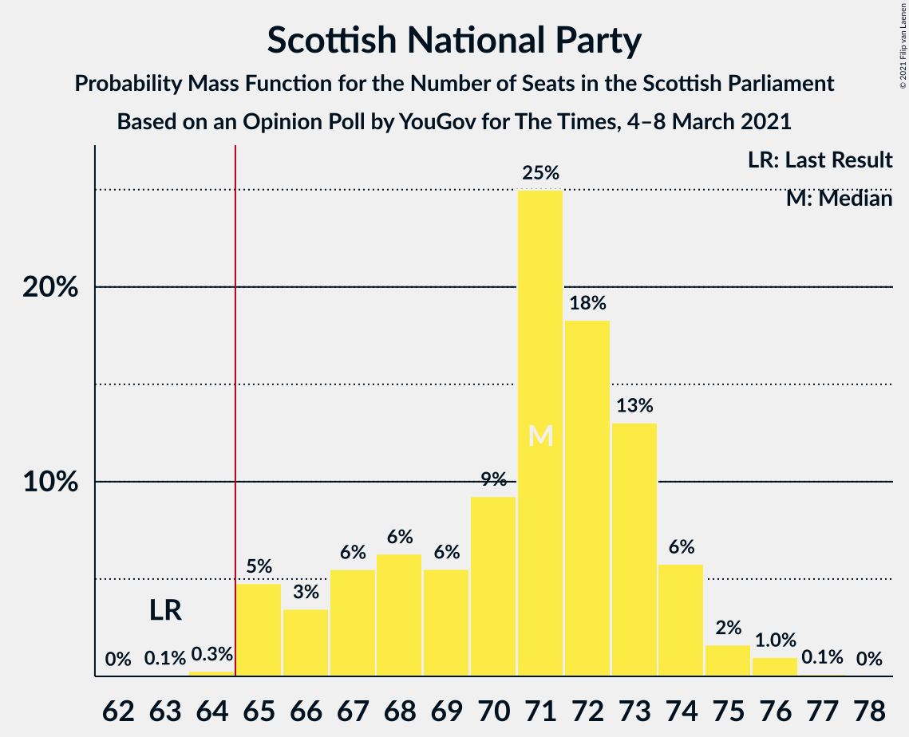
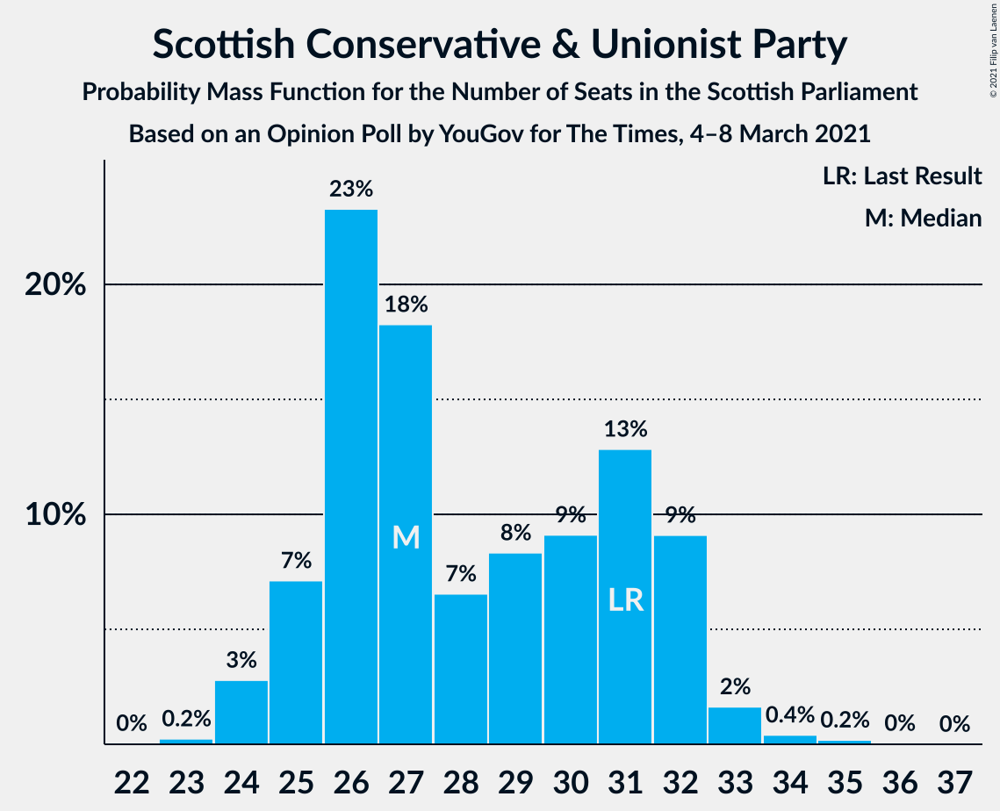
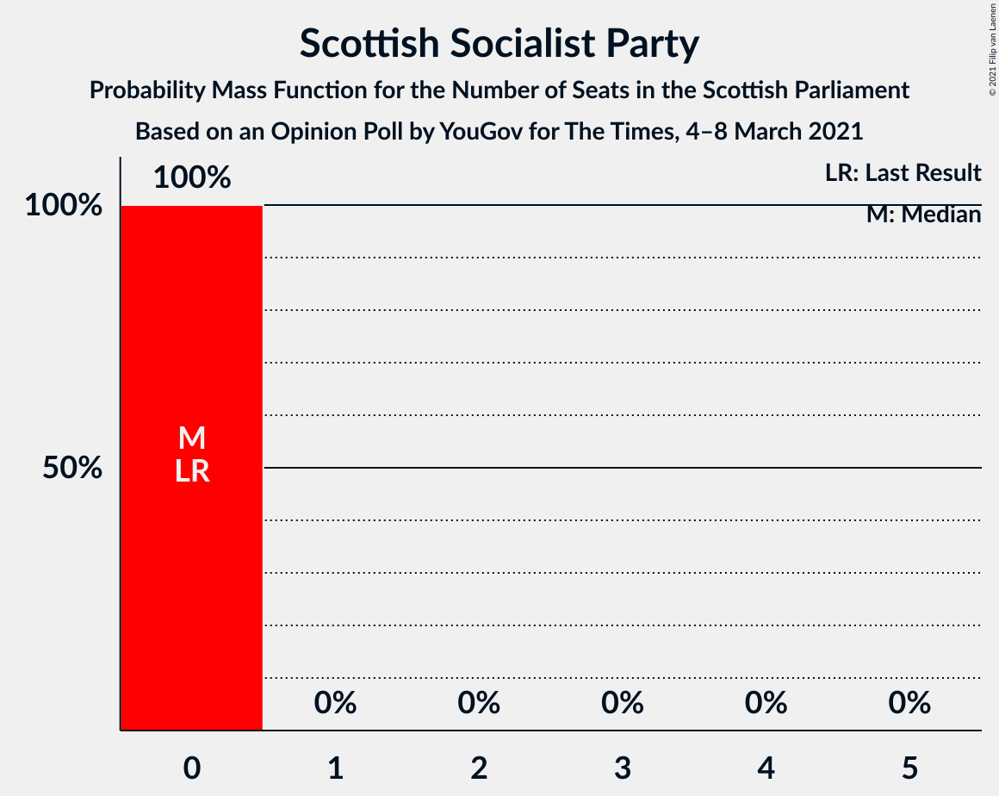

# Opinion Poll by YouGov for The Times, 4–8 March 2021

<a href="#voting-intentions">Voting Intentions</a> | <a href="#seats">Seats</a> | <a href="#coalitions">Coalitions</a> | <a href="#technical-information">Technical Information</a>

## Voting Intentions

### Confidence Intervals

| Party | Last Result | Poll Result | 80% Confidence Interval | 90% Confidence Interval | 95% Confidence Interval | 99% Confidence Interval |
|:-----:|:-----------:|:-----------:|:-----------------------:|:-----------------------:|:-----------------------:|:-----------------------:|
| Scottish National Party | 41.7% | 45.0% | 43.1–46.9% |42.5–47.5% |42.1–48.0% |41.2–48.9% |
| Scottish Conservative & Unionist Party | 22.9% | 21.0% | 19.5–22.6% |19.1–23.1% |18.7–23.5% |18.0–24.3% |
| Scottish Labour | 19.1% | 16.0% | 14.6–17.5% |14.3–17.9% |13.9–18.3% |13.3–19.0% |
| Scottish Greens | 6.6% | 6.0% | 5.2–7.0% |4.9–7.3% |4.7–7.6% |4.4–8.1% |
| Scottish Liberal Democrats | 5.2% | 5.0% | 4.3–6.0% |4.0–6.2% |3.9–6.5% |3.5–7.0% |
| Scottish Socialist Party | 0.5% | 3.0% | 2.4–3.8% |2.3–4.0% |2.1–4.2% |1.9–4.6% |

*Note:* The poll result column reflects the actual value used in the calculations. Published results may vary slightly, and in addition be rounded to fewer digits.

## Seats

### Confidence Intervals

| Party | Last Result | Median | 80% Confidence Interval | 90% Confidence Interval | 95% Confidence Interval | 99% Confidence Interval |
|:-----:|:-----------:|:------:|:-----------------------:|:-----------------------:|:-----------------------:|:-----------------------:|
| <a href="#scottish-national-party">Scottish National Party</a> | 63 | 70 | 67–73 |67–74 |66–74 |65–75 |
| <a href="#scottish-conservative-&-unionist-party">Scottish Conservative & Unionist Party</a> | 31 | 30 | 25–31 |24–32 |24–32 |24–33 |
| <a href="#scottish-labour">Scottish Labour</a> | 24 | 21 | 17–23 |17–24 |17–24 |17–26 |
| <a href="#scottish-greens">Scottish Greens</a> | 6 | 4 | 3–8 |3–10 |3–10 |2–10 |
| <a href="#scottish-liberal-democrats">Scottish Liberal Democrats</a> | 5 | 5 | 4–5 |3–5 |2–6 |2–7 |
| <a href="#scottish-socialist-party">Scottish Socialist Party</a> | 0 | 0 | 0 |0 |0 |0 |

### Scottish National Party

*For a full overview of the results for this party, see the [Scottish National Party](party-scottishnationalparty.html) page.*

| Number of Seats | Probability | Accumulated | Special Marks |
|:---------------:|:-----------:|:-----------:|:-------------:|
| 63 | 0% | 100% | Last Result |
| 64 | 0.1% | 100% |  |
| 65 | 1.1% | 99.8% | Majority |
| 66 | 2% | 98.7% |  |
| 67 | 8% | 96% |  |
| 68 | 3% | 88% |  |
| 69 | 33% | 86% |  |
| 70 | 4% | 53% | Median |
| 71 | 7% | 48% |  |
| 72 | 16% | 42% |  |
| 73 | 19% | 26% |  |
| 74 | 5% | 6% |  |
| 75 | 0.7% | 0.9% |  |
| 76 | 0% | 0.2% |  |
| 77 | 0.1% | 0.1% |  |
| 78 | 0% | 0% |  |

### Scottish Conservative & Unionist Party

*For a full overview of the results for this party, see the [Scottish Conservative & Unionist Party](party-scottishconservativeunionistparty.html) page.*

| Number of Seats | Probability | Accumulated | Special Marks |
|:---------------:|:-----------:|:-----------:|:-------------:|
| 23 | 0.2% | 100% |  |
| 24 | 5% | 99.8% |  |
| 25 | 7% | 95% |  |
| 26 | 5% | 88% |  |
| 27 | 10% | 82% |  |
| 28 | 0.9% | 72% |  |
| 29 | 6% | 71% |  |
| 30 | 30% | 65% | Median |
| 31 | 30% | 35% | Last Result |
| 32 | 3% | 5% |  |
| 33 | 2% | 2% |  |
| 34 | 0.4% | 0.5% |  |
| 35 | 0% | 0.1% |  |
| 36 | 0% | 0.1% |  |
| 37 | 0% | 0% |  |

### Scottish Labour

*For a full overview of the results for this party, see the [Scottish Labour](party-scottishlabour.html) page.*

| Number of Seats | Probability | Accumulated | Special Marks |
|:---------------:|:-----------:|:-----------:|:-------------:|
| 17 | 15% | 100% |  |
| 18 | 16% | 85% |  |
| 19 | 6% | 69% |  |
| 20 | 8% | 63% |  |
| 21 | 29% | 55% | Median |
| 22 | 9% | 27% |  |
| 23 | 9% | 17% |  |
| 24 | 7% | 9% | Last Result |
| 25 | 0.6% | 1.2% |  |
| 26 | 0.2% | 0.6% |  |
| 27 | 0.3% | 0.4% |  |
| 28 | 0.1% | 0.1% |  |
| 29 | 0% | 0% |  |

### Scottish Greens

*For a full overview of the results for this party, see the [Scottish Greens](party-scottishgreens.html) page.*

| Number of Seats | Probability | Accumulated | Special Marks |
|:---------------:|:-----------:|:-----------:|:-------------:|
| 2 | 2% | 100% |  |
| 3 | 36% | 98% |  |
| 4 | 33% | 62% | Median |
| 5 | 10% | 30% |  |
| 6 | 4% | 20% | Last Result |
| 7 | 5% | 16% |  |
| 8 | 2% | 11% |  |
| 9 | 0.6% | 9% |  |
| 10 | 9% | 9% |  |
| 11 | 0% | 0% |  |

### Scottish Liberal Democrats

*For a full overview of the results for this party, see the [Scottish Liberal Democrats](party-scottishliberaldemocrats.html) page.*

| Number of Seats | Probability | Accumulated | Special Marks |
|:---------------:|:-----------:|:-----------:|:-------------:|
| 2 | 5% | 100% |  |
| 3 | 2% | 95% |  |
| 4 | 30% | 93% |  |
| 5 | 58% | 63% | Last Result, Median |
| 6 | 4% | 5% |  |
| 7 | 1.1% | 1.4% |  |
| 8 | 0.3% | 0.3% |  |
| 9 | 0.1% | 0.1% |  |
| 10 | 0% | 0% |  |

### Scottish Socialist Party

*For a full overview of the results for this party, see the [Scottish Socialist Party](party-scottishsocialistparty.html) page.*

| Number of Seats | Probability | Accumulated | Special Marks |
|:---------------:|:-----------:|:-----------:|:-------------:|
| 0 | 100% | 100% | Last Result, Median |

## Coalitions

### Confidence Intervals

| Coalition | Last Result | Median | Majority? | 80% Confidence Interval | 90% Confidence Interval | 95% Confidence Interval | 99% Confidence Interval |
|:---------:|:-----------:|:------:|:---------:|:-----------------------:|:-----------------------:|:-----------------------:|:-----------------------:|
| Scottish National Party – Scottish Greens | 69 | 75 | 100% | 72–79 | 70–82 | 70–82 | 69–83 |
| Scottish National Party | 63 | 70 | 99.8% | 67–73 | 67–74 | 66–74 | 65–75 |
| Scottish Conservative & Unionist Party – Scottish Labour – Scottish Liberal Democrats | 60 | 54 | 0% | 50–57 | 47–59 | 47–59 | 46–60 |
| Scottish Conservative & Unionist Party – Scottish Labour | 55 | 50 | 0% | 46–53 | 43–54 | 42–54 | 42–55 |
| Scottish Conservative & Unionist Party – Scottish Liberal Democrats | 36 | 35 | 0% | 30–36 | 29–37 | 28–37 | 28–39 |
| Scottish Labour – Scottish Greens – Scottish Liberal Democrats | 35 | 30 | 0% | 25–32 | 25–33 | 25–34 | 25–36 |
| Scottish Labour – Scottish Liberal Democrats | 29 | 25 | 0% | 22–28 | 22–29 | 21–29 | 19–31 |

### Scottish National Party – Scottish Greens

| Number of Seats | Probability | Accumulated | Special Marks |
|:---------------:|:-----------:|:-----------:|:-------------:|
| 67 | 0.1% | 100% |  |
| 68 | 0.1% | 99.9% |  |
| 69 | 0.4% | 99.8% | Last Result |
| 70 | 7% | 99.4% |  |
| 71 | 2% | 93% |  |
| 72 | 0.7% | 91% |  |
| 73 | 28% | 90% |  |
| 74 | 8% | 62% | Median |
| 75 | 12% | 54% |  |
| 76 | 19% | 42% |  |
| 77 | 8% | 22% |  |
| 78 | 2% | 14% |  |
| 79 | 4% | 12% |  |
| 80 | 0.4% | 8% |  |
| 81 | 2% | 8% |  |
| 82 | 5% | 5% |  |
| 83 | 0.8% | 0.8% |  |
| 84 | 0% | 0% |  |

### Scottish National Party

| Number of Seats | Probability | Accumulated | Special Marks |
|:---------------:|:-----------:|:-----------:|:-------------:|
| 63 | 0% | 100% | Last Result |
| 64 | 0.1% | 100% |  |
| 65 | 1.1% | 99.8% | Majority |
| 66 | 2% | 98.7% |  |
| 67 | 8% | 96% |  |
| 68 | 3% | 88% |  |
| 69 | 33% | 86% |  |
| 70 | 4% | 53% | Median |
| 71 | 7% | 48% |  |
| 72 | 16% | 42% |  |
| 73 | 19% | 26% |  |
| 74 | 5% | 6% |  |
| 75 | 0.7% | 0.9% |  |
| 76 | 0% | 0.2% |  |
| 77 | 0.1% | 0.1% |  |
| 78 | 0% | 0% |  |

### Scottish Conservative & Unionist Party – Scottish Labour – Scottish Liberal Democrats

| Number of Seats | Probability | Accumulated | Special Marks |
|:---------------:|:-----------:|:-----------:|:-------------:|
| 46 | 0.8% | 100% |  |
| 47 | 5% | 99.2% |  |
| 48 | 2% | 95% |  |
| 49 | 0.4% | 92% |  |
| 50 | 4% | 92% |  |
| 51 | 2% | 88% |  |
| 52 | 8% | 86% |  |
| 53 | 19% | 78% |  |
| 54 | 12% | 58% |  |
| 55 | 8% | 46% |  |
| 56 | 28% | 38% | Median |
| 57 | 0.7% | 10% |  |
| 58 | 2% | 9% |  |
| 59 | 7% | 7% |  |
| 60 | 0.4% | 0.6% | Last Result |
| 61 | 0.1% | 0.2% |  |
| 62 | 0.1% | 0.1% |  |
| 63 | 0% | 0% |  |

### Scottish Conservative & Unionist Party – Scottish Labour

| Number of Seats | Probability | Accumulated | Special Marks |
|:---------------:|:-----------:|:-----------:|:-------------:|
| 41 | 0.2% | 100% |  |
| 42 | 5% | 99.8% |  |
| 43 | 0.6% | 95% |  |
| 44 | 2% | 94% |  |
| 45 | 2% | 93% |  |
| 46 | 4% | 91% |  |
| 47 | 7% | 86% |  |
| 48 | 12% | 79% |  |
| 49 | 11% | 67% |  |
| 50 | 16% | 56% |  |
| 51 | 16% | 39% | Median |
| 52 | 12% | 23% |  |
| 53 | 2% | 10% |  |
| 54 | 8% | 8% |  |
| 55 | 0.5% | 0.7% | Last Result |
| 56 | 0.1% | 0.2% |  |
| 57 | 0.1% | 0.1% |  |
| 58 | 0% | 0% |  |

### Scottish Conservative & Unionist Party – Scottish Liberal Democrats

| Number of Seats | Probability | Accumulated | Special Marks |
|:---------------:|:-----------:|:-----------:|:-------------:|
| 27 | 0.2% | 100% |  |
| 28 | 4% | 99.7% |  |
| 29 | 4% | 96% |  |
| 30 | 6% | 92% |  |
| 31 | 10% | 87% |  |
| 32 | 5% | 77% |  |
| 33 | 5% | 72% |  |
| 34 | 8% | 67% |  |
| 35 | 43% | 59% | Median |
| 36 | 9% | 16% | Last Result |
| 37 | 5% | 6% |  |
| 38 | 0.7% | 1.3% |  |
| 39 | 0.4% | 0.5% |  |
| 40 | 0% | 0.1% |  |
| 41 | 0% | 0.1% |  |
| 42 | 0% | 0% |  |

### Scottish Labour – Scottish Greens – Scottish Liberal Democrats

| Number of Seats | Probability | Accumulated | Special Marks |
|:---------------:|:-----------:|:-----------:|:-------------:|
| 24 | 0.2% | 100% |  |
| 25 | 11% | 99.8% |  |
| 26 | 11% | 89% |  |
| 27 | 0.5% | 77% |  |
| 28 | 4% | 77% |  |
| 29 | 15% | 73% |  |
| 30 | 28% | 58% | Median |
| 31 | 7% | 30% |  |
| 32 | 14% | 23% |  |
| 33 | 6% | 9% |  |
| 34 | 2% | 3% |  |
| 35 | 0.6% | 1.3% | Last Result |
| 36 | 0.4% | 0.7% |  |
| 37 | 0.2% | 0.3% |  |
| 38 | 0.1% | 0.1% |  |
| 39 | 0% | 0% |  |

### Scottish Labour – Scottish Liberal Democrats

| Number of Seats | Probability | Accumulated | Special Marks |
|:---------------:|:-----------:|:-----------:|:-------------:|
| 19 | 0.6% | 100% |  |
| 20 | 0.7% | 99.4% |  |
| 21 | 2% | 98.8% |  |
| 22 | 21% | 97% |  |
| 23 | 11% | 76% |  |
| 24 | 6% | 66% |  |
| 25 | 17% | 60% |  |
| 26 | 20% | 43% | Median |
| 27 | 12% | 23% |  |
| 28 | 4% | 11% |  |
| 29 | 6% | 8% | Last Result |
| 30 | 0.7% | 1.5% |  |
| 31 | 0.7% | 0.8% |  |
| 32 | 0% | 0.1% |  |
| 33 | 0.1% | 0.1% |  |
| 34 | 0% | 0% |  |

## Technical Information

### Opinion Poll

+ **Polling firm:** YouGov
+ **Commissioner(s):** The Times
+ **Fieldwork period:** 4–8 March 2021

### Calculations

+ **Sample size:** 1100
+ **Simulations done:** 16,384
+ **Error estimate:** 2.01%

