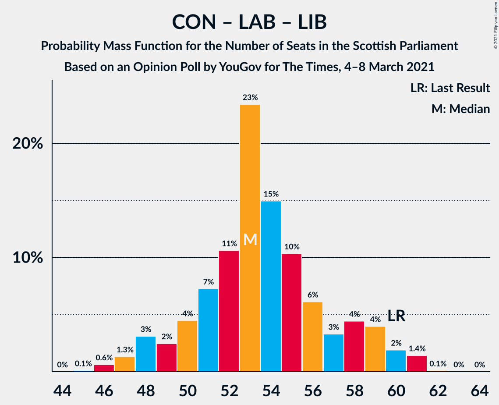

# Opinion Poll by YouGov for The Times, 4–8 March 2021

<a href="#voting-intentions">Voting Intentions</a> | <a href="#seats">Seats</a> | <a href="#coalitions">Coalitions</a> | <a href="#technical-information">Technical Information</a>

## Voting Intentions

### Confidence Intervals

| Party | Last Result | Poll Result | 80% Confidence Interval | 90% Confidence Interval | 95% Confidence Interval | 99% Confidence Interval |
|:-----:|:-----------:|:-----------:|:-----------------------:|:-----------------------:|:-----------------------:|:-----------------------:|
| Scottish National Party | 41.7% | 45.0% | 43.1–46.9% |42.5–47.5% |42.1–48.0% |41.2–48.9% |
| Scottish Conservative & Unionist Party | 22.9% | 21.0% | 19.5–22.6% |19.1–23.1% |18.7–23.5% |18.0–24.3% |
| Scottish Labour | 19.1% | 16.0% | 14.6–17.5% |14.3–17.9% |13.9–18.3% |13.3–19.0% |
| Scottish Greens | 6.6% | 6.0% | 5.2–7.0% |4.9–7.3% |4.7–7.6% |4.4–8.1% |
| Scottish Liberal Democrats | 5.2% | 5.0% | 4.3–6.0% |4.0–6.2% |3.9–6.5% |3.5–7.0% |
| Scottish Socialist Party | 0.5% | 3.0% | 2.4–3.8% |2.3–4.0% |2.1–4.2% |1.9–4.6% |

*Note:* The poll result column reflects the actual value used in the calculations. Published results may vary slightly, and in addition be rounded to fewer digits.

## Seats

### Confidence Intervals

| Party | Last Result | Median | 80% Confidence Interval | 90% Confidence Interval | 95% Confidence Interval | 99% Confidence Interval |
|:-----:|:-----------:|:------:|:-----------------------:|:-----------------------:|:-----------------------:|:-----------------------:|
| <a href="#scottish-national-party">Scottish National Party</a> | 63 | 71 | 67–73 |66–74 |65–75 |65–76 |
| <a href="#scottish-conservative-&-unionist-party">Scottish Conservative & Unionist Party</a> | 31 | 27 | 25–32 |25–32 |24–32 |24–34 |
| <a href="#scottish-labour">Scottish Labour</a> | 24 | 22 | 17–24 |17–24 |17–25 |17–26 |
| <a href="#scottish-greens">Scottish Greens</a> | 6 | 4 | 3–8 |3–10 |3–10 |2–10 |
| <a href="#scottish-liberal-democrats">Scottish Liberal Democrats</a> | 5 | 5 | 3–5 |2–5 |2–6 |2–7 |
| <a href="#scottish-socialist-party">Scottish Socialist Party</a> | 0 | 0 | 0 |0 |0 |0 |

### Scottish National Party

*For a full overview of the results for this party, see the [Scottish National Party](party-scottishnationalparty.html) page.*

| Number of Seats | Probability | Accumulated | Special Marks |
|:---------------:|:-----------:|:-----------:|:-------------:|
| 63 | 0.1% | 100% | Last Result |
| 64 | 0.2% | 99.9% |  |
| 65 | 5% | 99.7% | Majority |
| 66 | 3% | 95% |  |
| 67 | 6% | 92% |  |
| 68 | 7% | 86% |  |
| 69 | 6% | 79% |  |
| 70 | 9% | 73% |  |
| 71 | 25% | 64% | Median |
| 72 | 17% | 39% |  |
| 73 | 14% | 21% |  |
| 74 | 5% | 8% |  |
| 75 | 2% | 3% |  |
| 76 | 0.8% | 0.9% |  |
| 77 | 0.1% | 0.1% |  |
| 78 | 0% | 0% |  |

### Scottish Conservative & Unionist Party

*For a full overview of the results for this party, see the [Scottish Conservative & Unionist Party](party-scottishconservativeunionistparty.html) page.*

| Number of Seats | Probability | Accumulated | Special Marks |
|:---------------:|:-----------:|:-----------:|:-------------:|
| 22 | 0% | 100% |  |
| 23 | 0.2% | 99.9% |  |
| 24 | 3% | 99.7% |  |
| 25 | 9% | 97% |  |
| 26 | 20% | 88% |  |
| 27 | 19% | 68% | Median |
| 28 | 6% | 49% |  |
| 29 | 8% | 43% |  |
| 30 | 10% | 35% |  |
| 31 | 14% | 25% | Last Result |
| 32 | 10% | 12% |  |
| 33 | 1.4% | 2% |  |
| 34 | 0.4% | 0.6% |  |
| 35 | 0.2% | 0.2% |  |
| 36 | 0% | 0.1% |  |
| 37 | 0% | 0% |  |

### Scottish Labour

*For a full overview of the results for this party, see the [Scottish Labour](party-scottishlabour.html) page.*

| Number of Seats | Probability | Accumulated | Special Marks |
|:---------------:|:-----------:|:-----------:|:-------------:|
| 16 | 0.1% | 100% |  |
| 17 | 14% | 99.9% |  |
| 18 | 8% | 86% |  |
| 19 | 8% | 78% |  |
| 20 | 5% | 70% |  |
| 21 | 13% | 65% |  |
| 22 | 24% | 52% | Median |
| 23 | 17% | 28% |  |
| 24 | 9% | 11% | Last Result |
| 25 | 2% | 3% |  |
| 26 | 0.6% | 0.8% |  |
| 27 | 0.2% | 0.2% |  |
| 28 | 0% | 0% |  |

### Scottish Greens

*For a full overview of the results for this party, see the [Scottish Greens](party-scottishgreens.html) page.*

| Number of Seats | Probability | Accumulated | Special Marks |
|:---------------:|:-----------:|:-----------:|:-------------:|
| 2 | 2% | 100% |  |
| 3 | 25% | 98% |  |
| 4 | 25% | 72% | Median |
| 5 | 29% | 47% |  |
| 6 | 4% | 18% | Last Result |
| 7 | 3% | 13% |  |
| 8 | 2% | 10% |  |
| 9 | 2% | 8% |  |
| 10 | 7% | 7% |  |
| 11 | 0% | 0% |  |

### Scottish Liberal Democrats

*For a full overview of the results for this party, see the [Scottish Liberal Democrats](party-scottishliberaldemocrats.html) page.*

| Number of Seats | Probability | Accumulated | Special Marks |
|:---------------:|:-----------:|:-----------:|:-------------:|
| 2 | 6% | 100% |  |
| 3 | 8% | 94% |  |
| 4 | 18% | 86% |  |
| 5 | 63% | 68% | Last Result, Median |
| 6 | 4% | 5% |  |
| 7 | 0.6% | 0.9% |  |
| 8 | 0.3% | 0.3% |  |
| 9 | 0% | 0% |  |

### Scottish Socialist Party

*For a full overview of the results for this party, see the [Scottish Socialist Party](party-scottishsocialistparty.html) page.*

| Number of Seats | Probability | Accumulated | Special Marks |
|:---------------:|:-----------:|:-----------:|:-------------:|
| 0 | 100% | 100% | Last Result, Median |

## Coalitions

### Confidence Intervals

| Coalition | Last Result | Median | Majority? | 80% Confidence Interval | 90% Confidence Interval | 95% Confidence Interval | 99% Confidence Interval |
|:---------:|:-----------:|:------:|:---------:|:-----------------------:|:-----------------------:|:-----------------------:|:-----------------------:|
| Scottish National Party – Scottish Greens | 69 | 76 | 100% | 71–79 | 70–81 | 69–81 | 68–83 |
| Scottish National Party | 63 | 71 | 99.7% | 67–73 | 66–74 | 65–75 | 65–76 |
| Scottish Conservative & Unionist Party – Scottish Labour – Scottish Liberal Democrats | 60 | 53 | 0% | 50–58 | 48–59 | 48–60 | 46–61 |
| Scottish Conservative & Unionist Party – Scottish Labour | 55 | 49 | 0% | 46–53 | 44–54 | 43–55 | 42–56 |
| Scottish Conservative & Unionist Party – Scottish Liberal Democrats | 36 | 32 | 0% | 30–36 | 29–37 | 28–37 | 27–39 |
| Scottish Labour – Scottish Greens – Scottish Liberal Democrats | 35 | 31 | 0% | 26–33 | 26–33 | 25–34 | 24–36 |
| Scottish Labour – Scottish Liberal Democrats | 29 | 26 | 0% | 22–28 | 22–29 | 21–30 | 19–31 |

### Scottish National Party – Scottish Greens

| Number of Seats | Probability | Accumulated | Special Marks |
|:---------------:|:-----------:|:-----------:|:-------------:|
| 67 | 0.1% | 100% |  |
| 68 | 1.4% | 99.9% |  |
| 69 | 2% | 98.5% | Last Result |
| 70 | 4% | 97% |  |
| 71 | 5% | 93% |  |
| 72 | 3% | 88% |  |
| 73 | 7% | 85% |  |
| 74 | 10% | 78% |  |
| 75 | 15% | 67% | Median |
| 76 | 23% | 52% |  |
| 77 | 10% | 29% |  |
| 78 | 7% | 19% |  |
| 79 | 5% | 12% |  |
| 80 | 2% | 7% |  |
| 81 | 3% | 5% |  |
| 82 | 2% | 2% |  |
| 83 | 0.6% | 0.7% |  |
| 84 | 0.1% | 0.1% |  |
| 85 | 0% | 0% |  |

### Scottish National Party

| Number of Seats | Probability | Accumulated | Special Marks |
|:---------------:|:-----------:|:-----------:|:-------------:|
| 63 | 0.1% | 100% | Last Result |
| 64 | 0.2% | 99.9% |  |
| 65 | 5% | 99.7% | Majority |
| 66 | 3% | 95% |  |
| 67 | 6% | 92% |  |
| 68 | 7% | 86% |  |
| 69 | 6% | 79% |  |
| 70 | 9% | 73% |  |
| 71 | 25% | 64% | Median |
| 72 | 17% | 39% |  |
| 73 | 14% | 21% |  |
| 74 | 5% | 8% |  |
| 75 | 2% | 3% |  |
| 76 | 0.8% | 0.9% |  |
| 77 | 0.1% | 0.1% |  |
| 78 | 0% | 0% |  |

### Scottish Conservative & Unionist Party – Scottish Labour – Scottish Liberal Democrats

| Number of Seats | Probability | Accumulated | Special Marks |
|:---------------:|:-----------:|:-----------:|:-------------:|
| 45 | 0.1% | 100% |  |
| 46 | 0.6% | 99.9% |  |
| 47 | 2% | 99.3% |  |
| 48 | 3% | 98% |  |
| 49 | 2% | 95% |  |
| 50 | 5% | 93% |  |
| 51 | 7% | 88% |  |
| 52 | 10% | 81% |  |
| 53 | 23% | 71% |  |
| 54 | 15% | 48% | Median |
| 55 | 10% | 33% |  |
| 56 | 7% | 22% |  |
| 57 | 3% | 15% |  |
| 58 | 5% | 12% |  |
| 59 | 4% | 7% |  |
| 60 | 2% | 3% | Last Result |
| 61 | 1.4% | 1.5% |  |
| 62 | 0.1% | 0.1% |  |
| 63 | 0% | 0% |  |

### Scottish Conservative & Unionist Party – Scottish Labour

| Number of Seats | Probability | Accumulated | Special Marks |
|:---------------:|:-----------:|:-----------:|:-------------:|
| 41 | 0.2% | 100% |  |
| 42 | 0.5% | 99.8% |  |
| 43 | 3% | 99.3% |  |
| 44 | 2% | 96% |  |
| 45 | 3% | 94% |  |
| 46 | 5% | 92% |  |
| 47 | 8% | 86% |  |
| 48 | 22% | 78% |  |
| 49 | 19% | 57% | Median |
| 50 | 12% | 38% |  |
| 51 | 8% | 26% |  |
| 52 | 4% | 18% |  |
| 53 | 5% | 14% |  |
| 54 | 5% | 9% |  |
| 55 | 3% | 4% | Last Result |
| 56 | 1.5% | 2% |  |
| 57 | 0.2% | 0.2% |  |
| 58 | 0% | 0% |  |

### Scottish Conservative & Unionist Party – Scottish Liberal Democrats

| Number of Seats | Probability | Accumulated | Special Marks |
|:---------------:|:-----------:|:-----------:|:-------------:|
| 26 | 0.2% | 100% |  |
| 27 | 0.5% | 99.8% |  |
| 28 | 2% | 99.3% |  |
| 29 | 5% | 97% |  |
| 30 | 11% | 92% |  |
| 31 | 20% | 81% |  |
| 32 | 17% | 61% | Median |
| 33 | 7% | 44% |  |
| 34 | 8% | 38% |  |
| 35 | 9% | 30% |  |
| 36 | 12% | 21% | Last Result |
| 37 | 8% | 9% |  |
| 38 | 1.2% | 2% |  |
| 39 | 0.3% | 0.5% |  |
| 40 | 0.2% | 0.2% |  |
| 41 | 0% | 0% |  |

### Scottish Labour – Scottish Greens – Scottish Liberal Democrats

| Number of Seats | Probability | Accumulated | Special Marks |
|:---------------:|:-----------:|:-----------:|:-------------:|
| 23 | 0.2% | 100% |  |
| 24 | 1.2% | 99.8% |  |
| 25 | 3% | 98.7% |  |
| 26 | 5% | 95% |  |
| 27 | 7% | 90% |  |
| 28 | 6% | 83% |  |
| 29 | 10% | 77% |  |
| 30 | 14% | 67% |  |
| 31 | 17% | 53% | Median |
| 32 | 23% | 36% |  |
| 33 | 8% | 13% |  |
| 34 | 2% | 5% |  |
| 35 | 2% | 2% | Last Result |
| 36 | 0.3% | 0.8% |  |
| 37 | 0.2% | 0.4% |  |
| 38 | 0.2% | 0.2% |  |
| 39 | 0.1% | 0.1% |  |
| 40 | 0% | 0% |  |

### Scottish Labour – Scottish Liberal Democrats

| Number of Seats | Probability | Accumulated | Special Marks |
|:---------------:|:-----------:|:-----------:|:-------------:|
| 19 | 0.5% | 100% |  |
| 20 | 1.0% | 99.5% |  |
| 21 | 3% | 98% |  |
| 22 | 15% | 95% |  |
| 23 | 7% | 81% |  |
| 24 | 8% | 73% |  |
| 25 | 10% | 66% |  |
| 26 | 13% | 55% |  |
| 27 | 19% | 42% | Median |
| 28 | 13% | 23% |  |
| 29 | 7% | 10% | Last Result |
| 30 | 2% | 3% |  |
| 31 | 0.6% | 0.7% |  |
| 32 | 0.1% | 0.2% |  |
| 33 | 0% | 0% |  |

## Technical Information

### Opinion Poll

+ **Polling firm:** YouGov
+ **Commissioner(s):** The Times
+ **Fieldwork period:** 4–8 March 2021

### Calculations

+ **Sample size:** 1100
+ **Simulations done:** 524,288
+ **Error estimate:** 0.81%

