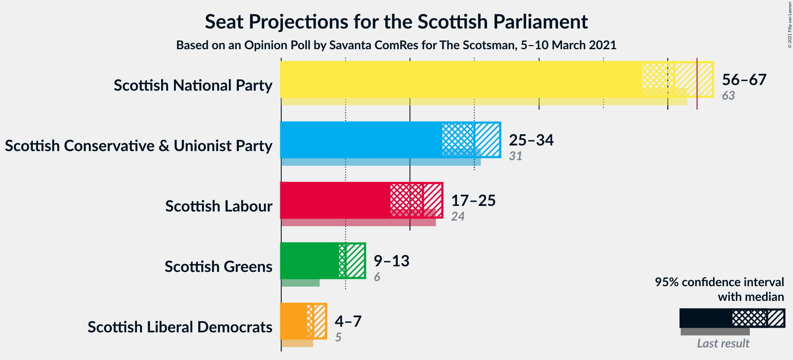
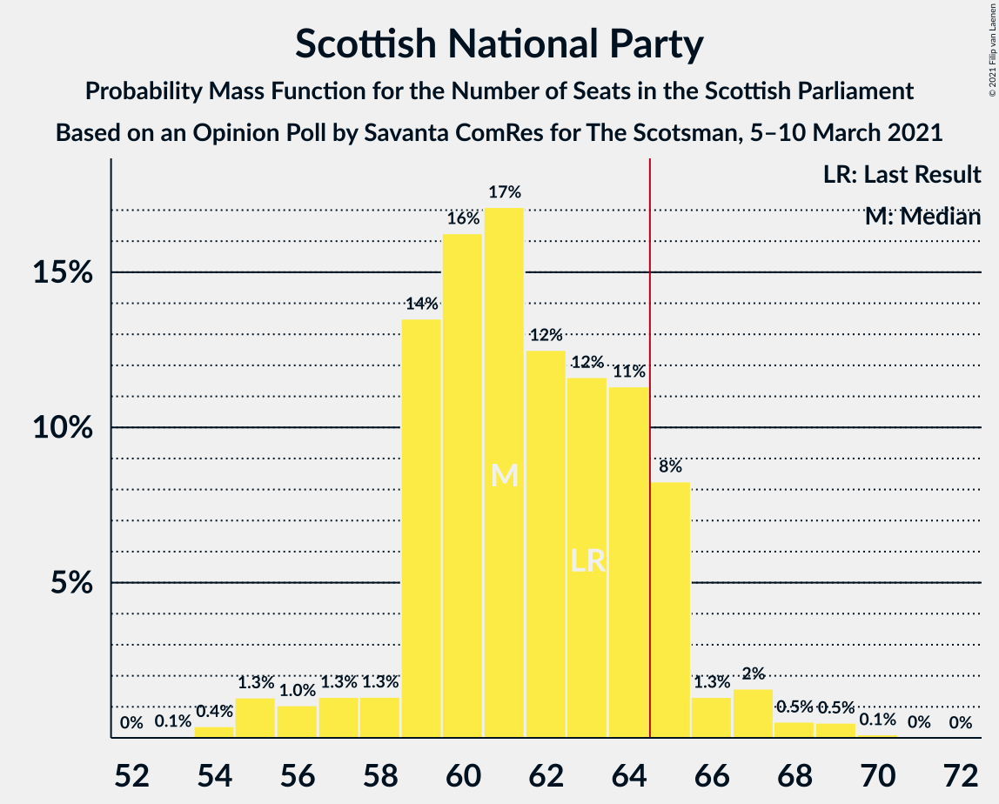

# Opinion Poll by Savanta ComRes for The Scotsman, 5–10 March 2021

<a href="#voting-intentions">Voting Intentions</a> | <a href="#seats">Seats</a> | <a href="#coalitions">Coalitions</a> | <a href="#technical-information">Technical Information</a>

## Voting Intentions

### Confidence Intervals

| Party | Last Result | Poll Result | 80% Confidence Interval | 90% Confidence Interval | 95% Confidence Interval | 99% Confidence Interval |
|:-----:|:-----------:|:-----------:|:-----------------------:|:-----------------------:|:-----------------------:|:-----------------------:|
| Scottish National Party | 41.7% | 40.0% | 38.1–42.1% |37.5–42.6% |37.1–43.1% |36.1–44.1% |
| Scottish Conservative & Unionist Party | 22.9% | 24.0% | 22.3–25.8% |21.8–26.3% |21.4–26.7% |20.7–27.6% |
| Scottish Labour | 19.1% | 18.0% | 16.6–19.7% |16.1–20.1% |15.8–20.5% |15.1–21.3% |
| Scottish Greens | 6.6% | 10.0% | 8.9–11.3% |8.6–11.7% |8.3–12.0% |7.8–12.7% |
| Scottish Liberal Democrats | 5.2% | 6.0% | 5.2–7.1% |4.9–7.4% |4.7–7.7% |4.3–8.2% |

*Note:* The poll result column reflects the actual value used in the calculations. Published results may vary slightly, and in addition be rounded to fewer digits.

## Seats

### Confidence Intervals

| Party | Last Result | Median | 80% Confidence Interval | 90% Confidence Interval | 95% Confidence Interval | 99% Confidence Interval |
|:-----:|:-----------:|:------:|:-----------------------:|:-----------------------:|:-----------------------:|:-----------------------:|
| <a href="#scottish-national-party">Scottish National Party</a> | 63 | 62 | 59–65 |59–66 |57–67 |55–69 |
| <a href="#scottish-conservative-&-unionist-party">Scottish Conservative & Unionist Party</a> | 31 | 30 | 27–33 |26–33 |25–34 |24–35 |
| <a href="#scottish-labour">Scottish Labour</a> | 24 | 22 | 17–24 |17–25 |17–25 |17–26 |
| <a href="#scottish-greens">Scottish Greens</a> | 6 | 10 | 10–12 |10–13 |9–13 |7–14 |
| <a href="#scottish-liberal-democrats">Scottish Liberal Democrats</a> | 5 | 5 | 5–6 |4–6 |4–7 |2–8 |

### Scottish National Party

*For a full overview of the results for this party, see the [Scottish National Party](party-scottishnationalparty.html) page.*

| Number of Seats | Probability | Accumulated | Special Marks |
|:---------------:|:-----------:|:-----------:|:-------------:|
| 53 | 0.1% | 100% |  |
| 54 | 0.4% | 99.9% |  |
| 55 | 1.1% | 99.6% |  |
| 56 | 1.0% | 98.5% |  |
| 57 | 1.0% | 98% |  |
| 58 | 1.1% | 97% |  |
| 59 | 11% | 95% |  |
| 60 | 14% | 84% |  |
| 61 | 17% | 70% |  |
| 62 | 14% | 54% | Median |
| 63 | 14% | 40% | Last Result |
| 64 | 12% | 26% |  |
| 65 | 8% | 14% | Majority |
| 66 | 2% | 6% |  |
| 67 | 2% | 4% |  |
| 68 | 0.7% | 2% |  |
| 69 | 0.8% | 1.1% |  |
| 70 | 0.2% | 0.2% |  |
| 71 | 0% | 0% |  |

### Scottish Conservative & Unionist Party

*For a full overview of the results for this party, see the [Scottish Conservative & Unionist Party](party-scottishconservativeunionistparty.html) page.*

| Number of Seats | Probability | Accumulated | Special Marks |
|:---------------:|:-----------:|:-----------:|:-------------:|
| 21 | 0.1% | 100% |  |
| 22 | 0.1% | 99.9% |  |
| 23 | 0.3% | 99.9% |  |
| 24 | 1.0% | 99.5% |  |
| 25 | 2% | 98.5% |  |
| 26 | 4% | 96% |  |
| 27 | 7% | 93% |  |
| 28 | 10% | 86% |  |
| 29 | 15% | 76% |  |
| 30 | 25% | 60% | Median |
| 31 | 11% | 35% | Last Result |
| 32 | 8% | 24% |  |
| 33 | 13% | 16% |  |
| 34 | 2% | 4% |  |
| 35 | 0.9% | 1.3% |  |
| 36 | 0.2% | 0.3% |  |
| 37 | 0.1% | 0.1% |  |
| 38 | 0% | 0% |  |

### Scottish Labour

*For a full overview of the results for this party, see the [Scottish Labour](party-scottishlabour.html) page.*

| Number of Seats | Probability | Accumulated | Special Marks |
|:---------------:|:-----------:|:-----------:|:-------------:|
| 17 | 11% | 100% |  |
| 18 | 8% | 89% |  |
| 19 | 9% | 81% |  |
| 20 | 4% | 72% |  |
| 21 | 17% | 68% |  |
| 22 | 16% | 50% | Median |
| 23 | 10% | 35% |  |
| 24 | 17% | 25% | Last Result |
| 25 | 7% | 8% |  |
| 26 | 1.0% | 1.1% |  |
| 27 | 0.1% | 0.1% |  |
| 28 | 0% | 0% |  |

### Scottish Greens

*For a full overview of the results for this party, see the [Scottish Greens](party-scottishgreens.html) page.*

| Number of Seats | Probability | Accumulated | Special Marks |
|:---------------:|:-----------:|:-----------:|:-------------:|
| 6 | 0.2% | 100% | Last Result |
| 7 | 0.4% | 99.8% |  |
| 8 | 0.2% | 99.4% |  |
| 9 | 2% | 99.1% |  |
| 10 | 50% | 97% | Median |
| 11 | 31% | 48% |  |
| 12 | 11% | 17% |  |
| 13 | 4% | 5% |  |
| 14 | 2% | 2% |  |
| 15 | 0.1% | 0.1% |  |
| 16 | 0% | 0% |  |

### Scottish Liberal Democrats

*For a full overview of the results for this party, see the [Scottish Liberal Democrats](party-scottishliberaldemocrats.html) page.*

| Number of Seats | Probability | Accumulated | Special Marks |
|:---------------:|:-----------:|:-----------:|:-------------:|
| 2 | 0.6% | 100% |  |
| 3 | 0.9% | 99.4% |  |
| 4 | 6% | 98% |  |
| 5 | 65% | 92% | Last Result, Median |
| 6 | 23% | 28% |  |
| 7 | 3% | 5% |  |
| 8 | 2% | 2% |  |
| 9 | 0.2% | 0.2% |  |
| 10 | 0.1% | 0.1% |  |
| 11 | 0% | 0% |  |

## Coalitions

### Confidence Intervals

| Coalition | Last Result | Median | Majority? | 80% Confidence Interval | 90% Confidence Interval | 95% Confidence Interval | 99% Confidence Interval |
|:---------:|:-----------:|:------:|:---------:|:-----------------------:|:-----------------------:|:-----------------------:|:-----------------------:|
| Scottish National Party – Scottish Greens | 69 | 73 | 99.9% | 70–75 | 69–77 | 67–78 | 66–80 |
| Scottish National Party | 63 | 62 | 14% | 59–65 | 59–66 | 57–67 | 55–69 |
| Scottish Conservative & Unionist Party – Scottish Labour – Scottish Liberal Democrats | 60 | 56 | 0.1% | 54–59 | 52–60 | 51–62 | 49–63 |
| Scottish Conservative & Unionist Party – Scottish Labour | 55 | 51 | 0% | 48–54 | 47–55 | 46–56 | 44–58 |
| Scottish Labour – Scottish Greens – Scottish Liberal Democrats | 35 | 37 | 0% | 33–40 | 32–41 | 32–42 | 32–43 |
| Scottish Conservative & Unionist Party – Scottish Liberal Democrats | 36 | 35 | 0% | 32–38 | 31–39 | 30–40 | 28–41 |
| Scottish Labour – Scottish Liberal Democrats | 29 | 27 | 0% | 23–30 | 22–30 | 22–31 | 22–32 |

### Scottish National Party – Scottish Greens

| Number of Seats | Probability | Accumulated | Special Marks |
|:---------------:|:-----------:|:-----------:|:-------------:|
| 64 | 0.1% | 100% |  |
| 65 | 0.3% | 99.9% | Majority |
| 66 | 1.0% | 99.5% |  |
| 67 | 1.2% | 98.5% |  |
| 68 | 1.0% | 97% |  |
| 69 | 5% | 96% | Last Result |
| 70 | 14% | 92% |  |
| 71 | 12% | 78% |  |
| 72 | 15% | 66% | Median |
| 73 | 15% | 51% |  |
| 74 | 15% | 36% |  |
| 75 | 11% | 21% |  |
| 76 | 4% | 9% |  |
| 77 | 3% | 6% |  |
| 78 | 1.0% | 3% |  |
| 79 | 0.9% | 2% |  |
| 80 | 0.5% | 0.6% |  |
| 81 | 0.1% | 0.1% |  |
| 82 | 0% | 0% |  |

### Scottish National Party

| Number of Seats | Probability | Accumulated | Special Marks |
|:---------------:|:-----------:|:-----------:|:-------------:|
| 53 | 0.1% | 100% |  |
| 54 | 0.4% | 99.9% |  |
| 55 | 1.1% | 99.6% |  |
| 56 | 1.0% | 98.5% |  |
| 57 | 1.0% | 98% |  |
| 58 | 1.1% | 97% |  |
| 59 | 11% | 95% |  |
| 60 | 14% | 84% |  |
| 61 | 17% | 70% |  |
| 62 | 14% | 54% | Median |
| 63 | 14% | 40% | Last Result |
| 64 | 12% | 26% |  |
| 65 | 8% | 14% | Majority |
| 66 | 2% | 6% |  |
| 67 | 2% | 4% |  |
| 68 | 0.7% | 2% |  |
| 69 | 0.8% | 1.1% |  |
| 70 | 0.2% | 0.2% |  |
| 71 | 0% | 0% |  |

### Scottish Conservative & Unionist Party – Scottish Labour – Scottish Liberal Democrats

| Number of Seats | Probability | Accumulated | Special Marks |
|:---------------:|:-----------:|:-----------:|:-------------:|
| 48 | 0.1% | 100% |  |
| 49 | 0.5% | 99.9% |  |
| 50 | 0.9% | 99.4% |  |
| 51 | 1.0% | 98% |  |
| 52 | 3% | 97% |  |
| 53 | 4% | 94% |  |
| 54 | 11% | 91% |  |
| 55 | 15% | 79% |  |
| 56 | 15% | 64% |  |
| 57 | 15% | 49% | Median |
| 58 | 12% | 34% |  |
| 59 | 14% | 22% |  |
| 60 | 5% | 8% | Last Result |
| 61 | 1.0% | 4% |  |
| 62 | 1.2% | 3% |  |
| 63 | 1.0% | 1.5% |  |
| 64 | 0.3% | 0.5% |  |
| 65 | 0.1% | 0.1% | Majority |
| 66 | 0% | 0% |  |

### Scottish Conservative & Unionist Party – Scottish Labour

| Number of Seats | Probability | Accumulated | Special Marks |
|:---------------:|:-----------:|:-----------:|:-------------:|
| 44 | 0.8% | 100% |  |
| 45 | 0.9% | 99.1% |  |
| 46 | 2% | 98% |  |
| 47 | 3% | 96% |  |
| 48 | 5% | 94% |  |
| 49 | 13% | 89% |  |
| 50 | 17% | 76% |  |
| 51 | 13% | 59% |  |
| 52 | 16% | 46% | Median |
| 53 | 11% | 29% |  |
| 54 | 11% | 19% |  |
| 55 | 4% | 8% | Last Result |
| 56 | 1.4% | 4% |  |
| 57 | 2% | 2% |  |
| 58 | 0.4% | 0.8% |  |
| 59 | 0.3% | 0.3% |  |
| 60 | 0% | 0% |  |

### Scottish Labour – Scottish Greens – Scottish Liberal Democrats

| Number of Seats | Probability | Accumulated | Special Marks |
|:---------------:|:-----------:|:-----------:|:-------------:|
| 30 | 0.1% | 100% |  |
| 31 | 0.2% | 99.9% |  |
| 32 | 5% | 99.6% |  |
| 33 | 5% | 95% |  |
| 34 | 9% | 90% |  |
| 35 | 7% | 80% | Last Result |
| 36 | 9% | 73% |  |
| 37 | 15% | 64% | Median |
| 38 | 14% | 49% |  |
| 39 | 13% | 35% |  |
| 40 | 13% | 22% |  |
| 41 | 7% | 10% |  |
| 42 | 2% | 3% |  |
| 43 | 0.5% | 0.7% |  |
| 44 | 0.2% | 0.2% |  |
| 45 | 0% | 0% |  |

### Scottish Conservative & Unionist Party – Scottish Liberal Democrats

| Number of Seats | Probability | Accumulated | Special Marks |
|:---------------:|:-----------:|:-----------:|:-------------:|
| 26 | 0.1% | 100% |  |
| 27 | 0.1% | 99.9% |  |
| 28 | 0.5% | 99.8% |  |
| 29 | 0.8% | 99.4% |  |
| 30 | 2% | 98.6% |  |
| 31 | 3% | 97% |  |
| 32 | 6% | 94% |  |
| 33 | 9% | 88% |  |
| 34 | 15% | 79% |  |
| 35 | 27% | 64% | Median |
| 36 | 11% | 38% | Last Result |
| 37 | 9% | 26% |  |
| 38 | 9% | 18% |  |
| 39 | 6% | 9% |  |
| 40 | 2% | 3% |  |
| 41 | 0.6% | 0.8% |  |
| 42 | 0.2% | 0.2% |  |
| 43 | 0% | 0.1% |  |
| 44 | 0% | 0% |  |

### Scottish Labour – Scottish Liberal Democrats

| Number of Seats | Probability | Accumulated | Special Marks |
|:---------------:|:-----------:|:-----------:|:-------------:|
| 20 | 0.1% | 100% |  |
| 21 | 0.3% | 99.8% |  |
| 22 | 9% | 99.5% |  |
| 23 | 7% | 91% |  |
| 24 | 8% | 84% |  |
| 25 | 8% | 76% |  |
| 26 | 14% | 68% |  |
| 27 | 15% | 54% | Median |
| 28 | 11% | 39% |  |
| 29 | 18% | 28% | Last Result |
| 30 | 8% | 11% |  |
| 31 | 2% | 3% |  |
| 32 | 0.6% | 0.8% |  |
| 33 | 0.2% | 0.2% |  |
| 34 | 0.1% | 0.1% |  |
| 35 | 0% | 0% |  |

## Technical Information

### Opinion Poll

+ **Polling firm:** Savanta ComRes
+ **Commissioner(s):** The Scotsman
+ **Fieldwork period:** 5–10 March 2021

### Calculations

+ **Sample size:** 1009
+ **Simulations done:** 524,288
+ **Error estimate:** 1.02%

