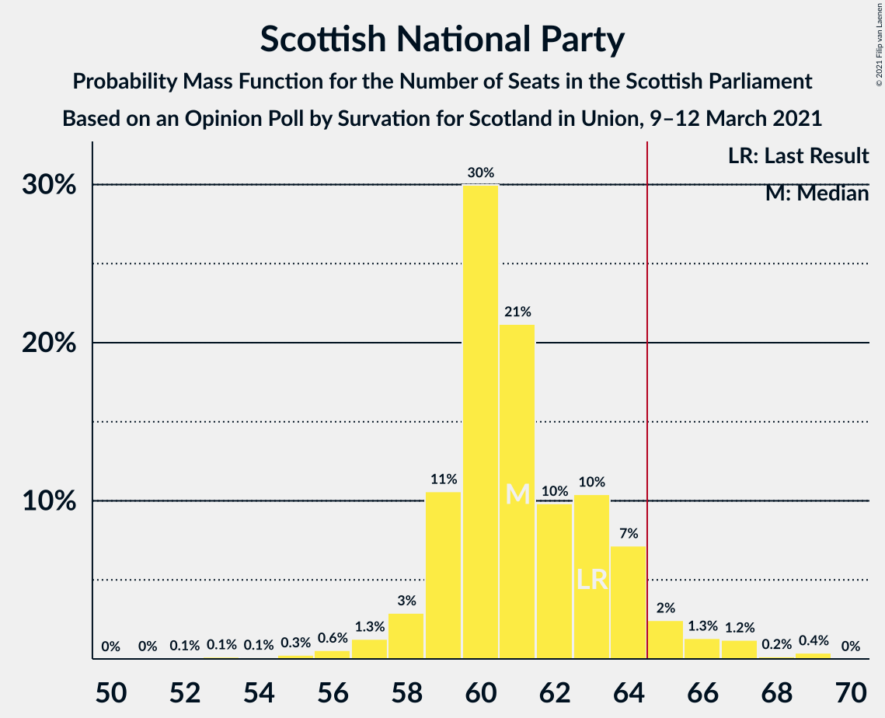
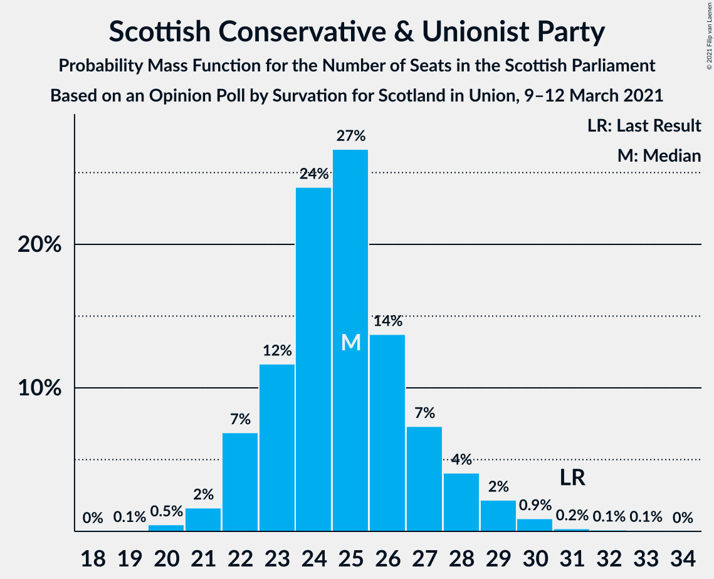
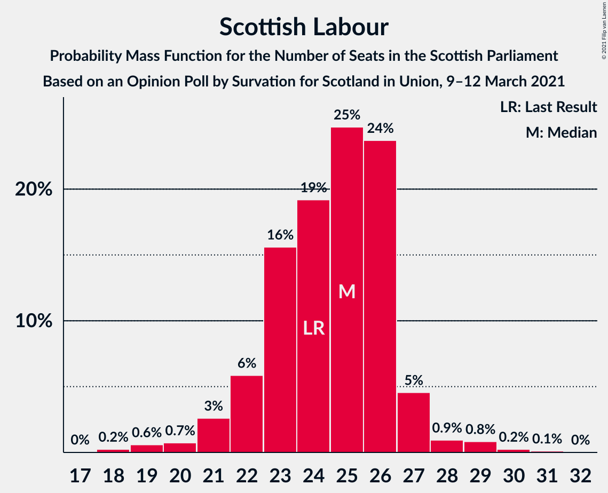
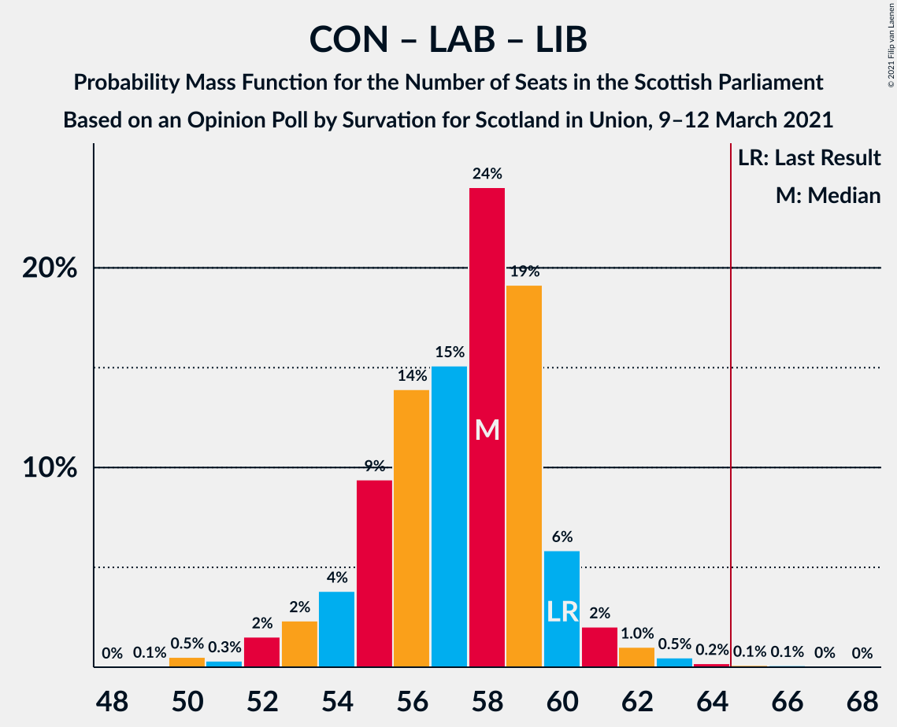

# Opinion Poll by Survation for Scotland in Union, 9–12 March 2021

<a href="#voting-intentions">Voting Intentions</a> | <a href="#seats">Seats</a> | <a href="#coalitions">Coalitions</a> | <a href="#technical-information">Technical Information</a>

## Voting Intentions

### Confidence Intervals

| Party | Last Result | Poll Result | 80% Confidence Interval | 90% Confidence Interval | 95% Confidence Interval | 99% Confidence Interval |
|:-----:|:-----------:|:-----------:|:-----------------------:|:-----------------------:|:-----------------------:|:-----------------------:|
| Scottish National Party | 41.7% | 39.0% | 37.0–41.0% |36.5–41.5% |36.0–42.0% |35.1–43.0% |
| Scottish Conservative & Unionist Party | 22.9% | 21.0% | 19.4–22.7% |18.9–23.2% |18.6–23.6% |17.8–24.4% |
| Scottish Labour | 19.1% | 20.0% | 18.4–21.7% |18.0–22.1% |17.6–22.6% |16.9–23.4% |
| Scottish Greens | 6.6% | 10.0% | 8.9–11.3% |8.6–11.7% |8.3–12.0% |7.8–12.7% |
| Scottish Liberal Democrats | 5.2% | 8.0% | 7.0–9.2% |6.7–9.6% |6.5–9.9% |6.0–10.5% |

*Note:* The poll result column reflects the actual value used in the calculations. Published results may vary slightly, and in addition be rounded to fewer digits.

## Seats

### Confidence Intervals

| Party | Last Result | Median | 80% Confidence Interval | 90% Confidence Interval | 95% Confidence Interval | 99% Confidence Interval |
|:-----:|:-----------:|:------:|:-----------------------:|:-----------------------:|:-----------------------:|:-----------------------:|
| <a href="#scottish-national-party">Scottish National Party</a> | 63 | 61 | 60–65 |59–66 |59–67 |58–69 |
| <a href="#scottish-conservative-&-unionist-party">Scottish Conservative & Unionist Party</a> | 31 | 25 | 22–27 |22–28 |21–29 |20–30 |
| <a href="#scottish-labour">Scottish Labour</a> | 24 | 25 | 22–26 |21–27 |20–27 |19–29 |
| <a href="#scottish-greens">Scottish Greens</a> | 6 | 10 | 10–12 |10–12 |10–13 |8–13 |
| <a href="#scottish-liberal-democrats">Scottish Liberal Democrats</a> | 5 | 8 | 6–9 |6–10 |5–10 |4–11 |

### Scottish National Party

*For a full overview of the results for this party, see the [Scottish National Party](party-scottishnationalparty.html) page.*

| Number of Seats | Probability | Accumulated | Special Marks |
|:---------------:|:-----------:|:-----------:|:-------------:|
| 53 | 0% | 100% |  |
| 54 | 0% | 99.9% |  |
| 55 | 0.1% | 99.9% |  |
| 56 | 0.1% | 99.8% |  |
| 57 | 0.1% | 99.8% |  |
| 58 | 0.3% | 99.6% |  |
| 59 | 5% | 99.4% |  |
| 60 | 39% | 94% |  |
| 61 | 14% | 55% | Median |
| 62 | 10% | 41% |  |
| 63 | 8% | 31% | Last Result |
| 64 | 10% | 23% |  |
| 65 | 5% | 13% | Majority |
| 66 | 3% | 7% |  |
| 67 | 2% | 4% |  |
| 68 | 0.6% | 2% |  |
| 69 | 2% | 2% |  |
| 70 | 0.2% | 0.2% |  |
| 71 | 0% | 0% |  |

### Scottish Conservative & Unionist Party

*For a full overview of the results for this party, see the [Scottish Conservative & Unionist Party](party-scottishconservativeunionistparty.html) page.*

| Number of Seats | Probability | Accumulated | Special Marks |
|:---------------:|:-----------:|:-----------:|:-------------:|
| 19 | 0.3% | 100% |  |
| 20 | 0.9% | 99.7% |  |
| 21 | 3% | 98.8% |  |
| 22 | 7% | 95% |  |
| 23 | 14% | 88% |  |
| 24 | 17% | 74% |  |
| 25 | 29% | 56% | Median |
| 26 | 15% | 27% |  |
| 27 | 7% | 12% |  |
| 28 | 2% | 5% |  |
| 29 | 2% | 3% |  |
| 30 | 0.7% | 1.0% |  |
| 31 | 0.2% | 0.3% | Last Result |
| 32 | 0.1% | 0.1% |  |
| 33 | 0% | 0.1% |  |
| 34 | 0% | 0% |  |

### Scottish Labour

*For a full overview of the results for this party, see the [Scottish Labour](party-scottishlabour.html) page.*

| Number of Seats | Probability | Accumulated | Special Marks |
|:---------------:|:-----------:|:-----------:|:-------------:|
| 18 | 0.2% | 100% |  |
| 19 | 1.2% | 99.8% |  |
| 20 | 2% | 98.6% |  |
| 21 | 2% | 97% |  |
| 22 | 9% | 94% |  |
| 23 | 11% | 85% |  |
| 24 | 16% | 74% | Last Result |
| 25 | 23% | 58% | Median |
| 26 | 29% | 35% |  |
| 27 | 5% | 6% |  |
| 28 | 0.6% | 1.3% |  |
| 29 | 0.6% | 0.7% |  |
| 30 | 0.1% | 0.1% |  |
| 31 | 0% | 0% |  |

### Scottish Greens

*For a full overview of the results for this party, see the [Scottish Greens](party-scottishgreens.html) page.*

| Number of Seats | Probability | Accumulated | Special Marks |
|:---------------:|:-----------:|:-----------:|:-------------:|
| 6 | 0.1% | 100% | Last Result |
| 7 | 0.1% | 99.9% |  |
| 8 | 0.4% | 99.7% |  |
| 9 | 1.5% | 99.3% |  |
| 10 | 69% | 98% | Median |
| 11 | 11% | 29% |  |
| 12 | 13% | 18% |  |
| 13 | 4% | 5% |  |
| 14 | 0.4% | 0.4% |  |
| 15 | 0% | 0% |  |

### Scottish Liberal Democrats

*For a full overview of the results for this party, see the [Scottish Liberal Democrats](party-scottishliberaldemocrats.html) page.*

| Number of Seats | Probability | Accumulated | Special Marks |
|:---------------:|:-----------:|:-----------:|:-------------:|
| 4 | 0.6% | 100% |  |
| 5 | 4% | 99.4% | Last Result |
| 6 | 14% | 96% |  |
| 7 | 11% | 81% |  |
| 8 | 57% | 70% | Median |
| 9 | 4% | 13% |  |
| 10 | 8% | 9% |  |
| 11 | 0.6% | 0.7% |  |
| 12 | 0.1% | 0.1% |  |
| 13 | 0% | 0% |  |

## Coalitions

### Confidence Intervals

| Coalition | Last Result | Median | Majority? | 80% Confidence Interval | 90% Confidence Interval | 95% Confidence Interval | 99% Confidence Interval |
|:---------:|:-----------:|:------:|:---------:|:-----------------------:|:-----------------------:|:-----------------------:|:-----------------------:|
| Scottish National Party – Scottish Greens | 69 | 72 | 99.9% | 70–76 | 70–77 | 69–78 | 68–79 |
| Scottish National Party | 63 | 61 | 13% | 60–65 | 59–66 | 59–67 | 58–69 |
| Scottish Conservative & Unionist Party – Scottish Labour – Scottish Liberal Democrats | 60 | 57 | 0.1% | 53–59 | 52–59 | 51–60 | 50–61 |
| Scottish Conservative & Unionist Party – Scottish Labour | 55 | 49 | 0% | 46–52 | 45–52 | 44–53 | 41–54 |
| Scottish Labour – Scottish Greens – Scottish Liberal Democrats | 35 | 43 | 0% | 40–45 | 39–45 | 38–45 | 37–46 |
| Scottish Conservative & Unionist Party – Scottish Liberal Democrats | 36 | 33 | 0% | 29–35 | 29–35 | 28–36 | 27–38 |
| Scottish Labour – Scottish Liberal Democrats | 29 | 32 | 0% | 29–34 | 29–35 | 28–35 | 26–36 |

### Scottish National Party – Scottish Greens

| Number of Seats | Probability | Accumulated | Special Marks |
|:---------------:|:-----------:|:-----------:|:-------------:|
| 64 | 0% | 100% |  |
| 65 | 0.1% | 99.9% | Majority |
| 66 | 0.1% | 99.9% |  |
| 67 | 0.2% | 99.8% |  |
| 68 | 0.3% | 99.6% |  |
| 69 | 4% | 99.3% | Last Result |
| 70 | 29% | 95% |  |
| 71 | 13% | 67% | Median |
| 72 | 12% | 53% |  |
| 73 | 14% | 42% |  |
| 74 | 10% | 27% |  |
| 75 | 6% | 17% |  |
| 76 | 5% | 11% |  |
| 77 | 3% | 6% |  |
| 78 | 1.0% | 3% |  |
| 79 | 2% | 2% |  |
| 80 | 0.2% | 0.3% |  |
| 81 | 0.1% | 0.1% |  |
| 82 | 0% | 0% |  |

### Scottish National Party

| Number of Seats | Probability | Accumulated | Special Marks |
|:---------------:|:-----------:|:-----------:|:-------------:|
| 53 | 0% | 100% |  |
| 54 | 0% | 99.9% |  |
| 55 | 0.1% | 99.9% |  |
| 56 | 0.1% | 99.8% |  |
| 57 | 0.1% | 99.8% |  |
| 58 | 0.3% | 99.6% |  |
| 59 | 5% | 99.4% |  |
| 60 | 39% | 94% |  |
| 61 | 14% | 55% | Median |
| 62 | 10% | 41% |  |
| 63 | 8% | 31% | Last Result |
| 64 | 10% | 23% |  |
| 65 | 5% | 13% | Majority |
| 66 | 3% | 7% |  |
| 67 | 2% | 4% |  |
| 68 | 0.6% | 2% |  |
| 69 | 2% | 2% |  |
| 70 | 0.2% | 0.2% |  |
| 71 | 0% | 0% |  |

### Scottish Conservative & Unionist Party – Scottish Labour – Scottish Liberal Democrats

| Number of Seats | Probability | Accumulated | Special Marks |
|:---------------:|:-----------:|:-----------:|:-------------:|
| 48 | 0.1% | 100% |  |
| 49 | 0.2% | 99.9% |  |
| 50 | 2% | 99.7% |  |
| 51 | 1.0% | 98% |  |
| 52 | 3% | 97% |  |
| 53 | 5% | 94% |  |
| 54 | 6% | 89% |  |
| 55 | 10% | 83% |  |
| 56 | 14% | 73% |  |
| 57 | 12% | 58% |  |
| 58 | 13% | 47% | Median |
| 59 | 29% | 33% |  |
| 60 | 4% | 5% | Last Result |
| 61 | 0.3% | 0.7% |  |
| 62 | 0.2% | 0.4% |  |
| 63 | 0.1% | 0.2% |  |
| 64 | 0.1% | 0.1% |  |
| 65 | 0% | 0.1% | Majority |
| 66 | 0% | 0% |  |

### Scottish Conservative & Unionist Party – Scottish Labour

| Number of Seats | Probability | Accumulated | Special Marks |
|:---------------:|:-----------:|:-----------:|:-------------:|
| 40 | 0.1% | 100% |  |
| 41 | 0.4% | 99.9% |  |
| 42 | 0.5% | 99.5% |  |
| 43 | 1.2% | 99.0% |  |
| 44 | 2% | 98% |  |
| 45 | 4% | 95% |  |
| 46 | 5% | 91% |  |
| 47 | 9% | 86% |  |
| 48 | 15% | 77% |  |
| 49 | 14% | 62% |  |
| 50 | 13% | 48% | Median |
| 51 | 24% | 35% |  |
| 52 | 6% | 11% |  |
| 53 | 3% | 5% |  |
| 54 | 1.3% | 2% |  |
| 55 | 0.2% | 0.4% | Last Result |
| 56 | 0.1% | 0.2% |  |
| 57 | 0% | 0.1% |  |
| 58 | 0% | 0% |  |

### Scottish Labour – Scottish Greens – Scottish Liberal Democrats

| Number of Seats | Probability | Accumulated | Special Marks |
|:---------------:|:-----------:|:-----------:|:-------------:|
| 35 | 0.1% | 100% | Last Result |
| 36 | 0.2% | 99.8% |  |
| 37 | 0.7% | 99.6% |  |
| 38 | 3% | 98.9% |  |
| 39 | 3% | 96% |  |
| 40 | 5% | 93% |  |
| 41 | 9% | 87% |  |
| 42 | 17% | 78% |  |
| 43 | 18% | 61% | Median |
| 44 | 33% | 43% |  |
| 45 | 9% | 10% |  |
| 46 | 1.1% | 1.3% |  |
| 47 | 0.2% | 0.2% |  |
| 48 | 0% | 0.1% |  |
| 49 | 0% | 0% |  |

### Scottish Conservative & Unionist Party – Scottish Liberal Democrats

| Number of Seats | Probability | Accumulated | Special Marks |
|:---------------:|:-----------:|:-----------:|:-------------:|
| 25 | 0.1% | 100% |  |
| 26 | 0.2% | 99.9% |  |
| 27 | 2% | 99.8% |  |
| 28 | 2% | 98% |  |
| 29 | 9% | 96% |  |
| 30 | 7% | 87% |  |
| 31 | 10% | 80% |  |
| 32 | 16% | 70% |  |
| 33 | 29% | 55% | Median |
| 34 | 13% | 25% |  |
| 35 | 9% | 12% |  |
| 36 | 3% | 4% | Last Result |
| 37 | 0.4% | 1.0% |  |
| 38 | 0.3% | 0.6% |  |
| 39 | 0.1% | 0.3% |  |
| 40 | 0.1% | 0.1% |  |
| 41 | 0% | 0% |  |

### Scottish Labour – Scottish Liberal Democrats

| Number of Seats | Probability | Accumulated | Special Marks |
|:---------------:|:-----------:|:-----------:|:-------------:|
| 24 | 0.1% | 100% |  |
| 25 | 0.2% | 99.9% |  |
| 26 | 0.3% | 99.7% |  |
| 27 | 0.9% | 99.4% |  |
| 28 | 3% | 98% |  |
| 29 | 5% | 95% | Last Result |
| 30 | 9% | 90% |  |
| 31 | 11% | 81% |  |
| 32 | 20% | 70% |  |
| 33 | 21% | 50% | Median |
| 34 | 24% | 29% |  |
| 35 | 5% | 5% |  |
| 36 | 0.4% | 0.5% |  |
| 37 | 0.1% | 0.2% |  |
| 38 | 0% | 0% |  |

## Technical Information

### Opinion Poll

+ **Polling firm:** Survation
+ **Commissioner(s):** Scotland in Union
+ **Fieldwork period:** 9–12 March 2021

### Calculations

+ **Sample size:** 1011
+ **Simulations done:** 131,072
+ **Error estimate:** 0.82%

