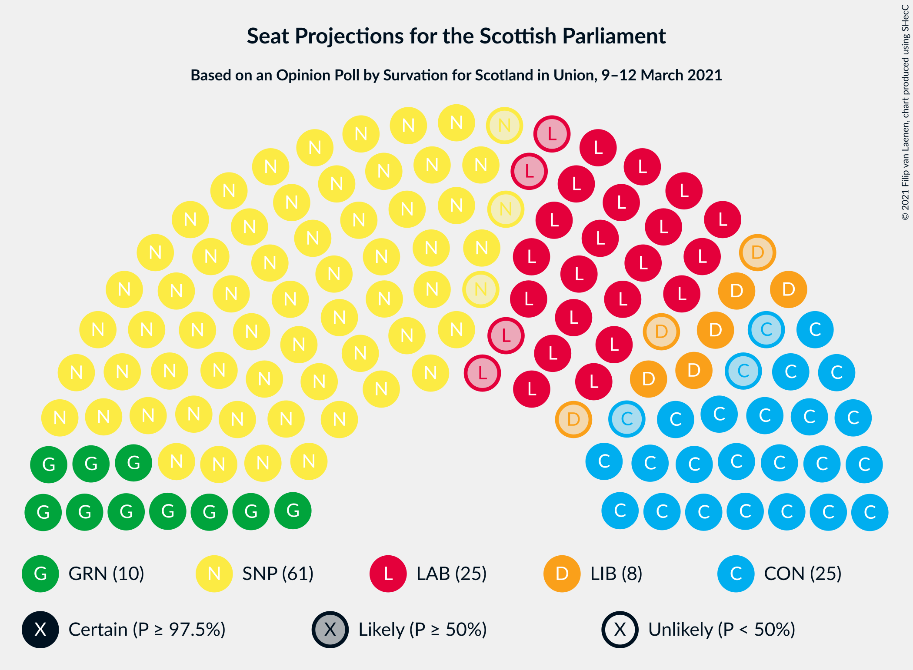
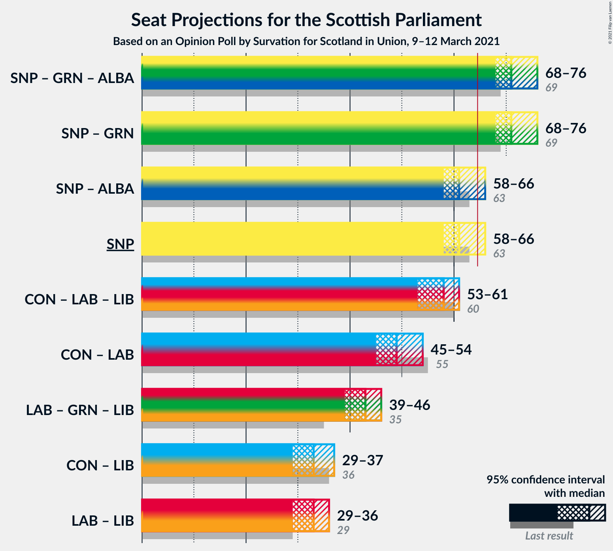
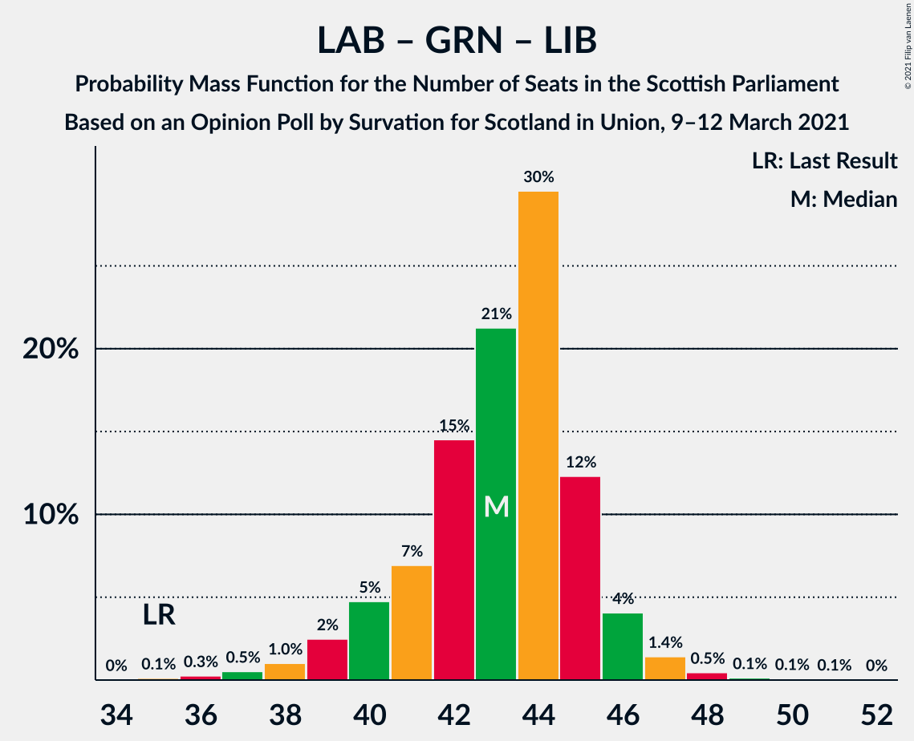

# Opinion Poll by Survation for Scotland in Union, 9–12 March 2021

<a href="#voting-intentions">Voting Intentions</a> | <a href="#seats">Seats</a> | <a href="#coalitions">Coalitions</a> | <a href="#technical-information">Technical Information</a>

## Voting Intentions

### Confidence Intervals

| Party | Last Result | Poll Result | 80% Confidence Interval | 90% Confidence Interval | 95% Confidence Interval | 99% Confidence Interval |
|:-----:|:-----------:|:-----------:|:-----------------------:|:-----------------------:|:-----------------------:|:-----------------------:|
| Scottish National Party | 41.7% | 39.0% | 37.0–41.0% |36.5–41.5% |36.0–42.0% |35.1–43.0% |
| Scottish Conservative & Unionist Party | 22.9% | 21.0% | 19.4–22.7% |18.9–23.2% |18.6–23.6% |17.8–24.4% |
| Scottish Labour | 19.1% | 20.0% | 18.4–21.7% |18.0–22.1% |17.6–22.6% |16.9–23.4% |
| Scottish Greens | 6.6% | 10.0% | 8.9–11.3% |8.6–11.7% |8.3–12.0% |7.8–12.7% |
| Scottish Liberal Democrats | 5.2% | 8.0% | 7.0–9.2% |6.7–9.6% |6.5–9.9% |6.0–10.5% |

*Note:* The poll result column reflects the actual value used in the calculations. Published results may vary slightly, and in addition be rounded to fewer digits.

## Seats

### Confidence Intervals

| Party | Last Result | Median | 80% Confidence Interval | 90% Confidence Interval | 95% Confidence Interval | 99% Confidence Interval |
|:-----:|:-----------:|:------:|:-----------------------:|:-----------------------:|:-----------------------:|:-----------------------:|
| <a href="#scottish-national-party">Scottish National Party</a> | 63 | 61 | 59–64 |58–65 |58–66 |55–68 |
| <a href="#scottish-conservative-&-unionist-party">Scottish Conservative & Unionist Party</a> | 31 | 25 | 23–27 |22–28 |22–29 |20–30 |
| <a href="#scottish-labour">Scottish Labour</a> | 24 | 25 | 22–26 |22–27 |21–27 |19–29 |
| <a href="#scottish-greens">Scottish Greens</a> | 6 | 10 | 10–12 |10–13 |10–13 |9–14 |
| <a href="#scottish-liberal-democrats">Scottish Liberal Democrats</a> | 5 | 8 | 6–10 |6–10 |5–11 |5–12 |

### Scottish National Party

*For a full overview of the results for this party, see the [Scottish National Party](party-scottishnationalparty.html) page.*

| Number of Seats | Probability | Accumulated | Special Marks |
|:---------------:|:-----------:|:-----------:|:-------------:|
| 52 | 0.1% | 100% |  |
| 53 | 0.1% | 99.9% |  |
| 54 | 0.1% | 99.8% |  |
| 55 | 0.3% | 99.7% |  |
| 56 | 0.6% | 99.4% |  |
| 57 | 1.3% | 98.9% |  |
| 58 | 3% | 98% |  |
| 59 | 11% | 95% |  |
| 60 | 30% | 84% |  |
| 61 | 21% | 54% | Median |
| 62 | 10% | 33% |  |
| 63 | 10% | 23% | Last Result |
| 64 | 7% | 13% |  |
| 65 | 2% | 6% | Majority |
| 66 | 1.3% | 3% |  |
| 67 | 1.2% | 2% |  |
| 68 | 0.2% | 0.6% |  |
| 69 | 0.4% | 0.4% |  |
| 70 | 0% | 0% |  |

### Scottish Conservative & Unionist Party

*For a full overview of the results for this party, see the [Scottish Conservative & Unionist Party](party-scottishconservativeunionistparty.html) page.*

| Number of Seats | Probability | Accumulated | Special Marks |
|:---------------:|:-----------:|:-----------:|:-------------:|
| 19 | 0.1% | 100% |  |
| 20 | 0.5% | 99.9% |  |
| 21 | 2% | 99.4% |  |
| 22 | 7% | 98% |  |
| 23 | 12% | 91% |  |
| 24 | 24% | 79% |  |
| 25 | 27% | 55% | Median |
| 26 | 14% | 29% |  |
| 27 | 7% | 15% |  |
| 28 | 4% | 8% |  |
| 29 | 2% | 3% |  |
| 30 | 0.9% | 1.3% |  |
| 31 | 0.2% | 0.4% | Last Result |
| 32 | 0.1% | 0.2% |  |
| 33 | 0.1% | 0.1% |  |
| 34 | 0% | 0% |  |

### Scottish Labour

*For a full overview of the results for this party, see the [Scottish Labour](party-scottishlabour.html) page.*

| Number of Seats | Probability | Accumulated | Special Marks |
|:---------------:|:-----------:|:-----------:|:-------------:|
| 18 | 0.2% | 100% |  |
| 19 | 0.6% | 99.7% |  |
| 20 | 0.7% | 99.1% |  |
| 21 | 3% | 98% |  |
| 22 | 6% | 96% |  |
| 23 | 16% | 90% |  |
| 24 | 19% | 74% | Last Result |
| 25 | 25% | 55% | Median |
| 26 | 24% | 30% |  |
| 27 | 5% | 7% |  |
| 28 | 0.9% | 2% |  |
| 29 | 0.8% | 1.2% |  |
| 30 | 0.2% | 0.4% |  |
| 31 | 0.1% | 0.1% |  |
| 32 | 0% | 0% |  |

### Scottish Greens

*For a full overview of the results for this party, see the [Scottish Greens](party-scottishgreens.html) page.*

| Number of Seats | Probability | Accumulated | Special Marks |
|:---------------:|:-----------:|:-----------:|:-------------:|
| 6 | 0.1% | 100% | Last Result |
| 7 | 0.1% | 99.9% |  |
| 8 | 0.3% | 99.8% |  |
| 9 | 1.3% | 99.6% |  |
| 10 | 64% | 98% | Median |
| 11 | 13% | 34% |  |
| 12 | 15% | 21% |  |
| 13 | 5% | 6% |  |
| 14 | 0.5% | 0.6% |  |
| 15 | 0.1% | 0.1% |  |
| 16 | 0% | 0% |  |

### Scottish Liberal Democrats

*For a full overview of the results for this party, see the [Scottish Liberal Democrats](party-scottishliberaldemocrats.html) page.*

| Number of Seats | Probability | Accumulated | Special Marks |
|:---------------:|:-----------:|:-----------:|:-------------:|
| 4 | 0.1% | 100% |  |
| 5 | 3% | 99.9% | Last Result |
| 6 | 12% | 97% |  |
| 7 | 9% | 85% |  |
| 8 | 49% | 76% | Median |
| 9 | 13% | 26% |  |
| 10 | 11% | 13% |  |
| 11 | 2% | 3% |  |
| 12 | 0.6% | 0.8% |  |
| 13 | 0.2% | 0.2% |  |
| 14 | 0% | 0% |  |

## Coalitions

### Confidence Intervals

| Coalition | Last Result | Median | Majority? | 80% Confidence Interval | 90% Confidence Interval | 95% Confidence Interval | 99% Confidence Interval |
|:---------:|:-----------:|:------:|:---------:|:-----------------------:|:-----------------------:|:-----------------------:|:-----------------------:|
| Scottish National Party – Scottish Greens | 69 | 71 | 99.7% | 70–74 | 69–75 | 68–76 | 66–79 |
| Scottish National Party | 63 | 61 | 6% | 59–64 | 58–65 | 58–66 | 55–68 |
| Scottish Conservative & Unionist Party – Scottish Labour – Scottish Liberal Democrats | 60 | 58 | 0.3% | 55–59 | 54–60 | 53–61 | 50–63 |
| Scottish Conservative & Unionist Party – Scottish Labour | 55 | 49 | 0% | 47–52 | 46–53 | 45–54 | 43–55 |
| Scottish Labour – Scottish Greens – Scottish Liberal Democrats | 35 | 43 | 0% | 41–45 | 40–46 | 39–46 | 37–48 |
| Scottish Conservative & Unionist Party – Scottish Liberal Democrats | 36 | 33 | 0% | 30–35 | 29–36 | 29–37 | 28–39 |
| Scottish Labour – Scottish Liberal Democrats | 29 | 33 | 0% | 30–35 | 29–35 | 29–36 | 26–38 |

### Scottish National Party – Scottish Greens

| Number of Seats | Probability | Accumulated | Special Marks |
|:---------------:|:-----------:|:-----------:|:-------------:|
| 62 | 0% | 100% |  |
| 63 | 0.1% | 99.9% |  |
| 64 | 0.1% | 99.8% |  |
| 65 | 0.2% | 99.7% | Majority |
| 66 | 0.5% | 99.5% |  |
| 67 | 1.0% | 99.1% |  |
| 68 | 2% | 98% |  |
| 69 | 6% | 96% | Last Result |
| 70 | 19% | 90% |  |
| 71 | 24% | 71% | Median |
| 72 | 15% | 47% |  |
| 73 | 14% | 32% |  |
| 74 | 9% | 18% |  |
| 75 | 4% | 9% |  |
| 76 | 2% | 5% |  |
| 77 | 2% | 2% |  |
| 78 | 0.3% | 0.9% |  |
| 79 | 0.5% | 0.6% |  |
| 80 | 0.1% | 0.1% |  |
| 81 | 0% | 0% |  |

### Scottish National Party

| Number of Seats | Probability | Accumulated | Special Marks |
|:---------------:|:-----------:|:-----------:|:-------------:|
| 52 | 0.1% | 100% |  |
| 53 | 0.1% | 99.9% |  |
| 54 | 0.1% | 99.8% |  |
| 55 | 0.3% | 99.7% |  |
| 56 | 0.6% | 99.4% |  |
| 57 | 1.3% | 98.9% |  |
| 58 | 3% | 98% |  |
| 59 | 11% | 95% |  |
| 60 | 30% | 84% |  |
| 61 | 21% | 54% | Median |
| 62 | 10% | 33% |  |
| 63 | 10% | 23% | Last Result |
| 64 | 7% | 13% |  |
| 65 | 2% | 6% | Majority |
| 66 | 1.3% | 3% |  |
| 67 | 1.2% | 2% |  |
| 68 | 0.2% | 0.6% |  |
| 69 | 0.4% | 0.4% |  |
| 70 | 0% | 0% |  |

### Scottish Conservative & Unionist Party – Scottish Labour – Scottish Liberal Democrats

| Number of Seats | Probability | Accumulated | Special Marks |
|:---------------:|:-----------:|:-----------:|:-------------:|
| 49 | 0.1% | 100% |  |
| 50 | 0.5% | 99.9% |  |
| 51 | 0.3% | 99.4% |  |
| 52 | 2% | 99.1% |  |
| 53 | 2% | 98% |  |
| 54 | 4% | 95% |  |
| 55 | 9% | 91% |  |
| 56 | 14% | 82% |  |
| 57 | 15% | 68% |  |
| 58 | 24% | 53% | Median |
| 59 | 19% | 29% |  |
| 60 | 6% | 10% | Last Result |
| 61 | 2% | 4% |  |
| 62 | 1.0% | 2% |  |
| 63 | 0.5% | 0.9% |  |
| 64 | 0.2% | 0.5% |  |
| 65 | 0.1% | 0.3% | Majority |
| 66 | 0.1% | 0.2% |  |
| 67 | 0% | 0.1% |  |
| 68 | 0% | 0% |  |

### Scottish Conservative & Unionist Party – Scottish Labour

| Number of Seats | Probability | Accumulated | Special Marks |
|:---------------:|:-----------:|:-----------:|:-------------:|
| 41 | 0.1% | 100% |  |
| 42 | 0.2% | 99.9% |  |
| 43 | 0.5% | 99.7% |  |
| 44 | 1.0% | 99.2% |  |
| 45 | 2% | 98% |  |
| 46 | 4% | 96% |  |
| 47 | 9% | 92% |  |
| 48 | 17% | 83% |  |
| 49 | 17% | 66% |  |
| 50 | 20% | 49% | Median |
| 51 | 17% | 29% |  |
| 52 | 6% | 12% |  |
| 53 | 3% | 6% |  |
| 54 | 2% | 3% |  |
| 55 | 0.5% | 0.9% | Last Result |
| 56 | 0.2% | 0.5% |  |
| 57 | 0.1% | 0.2% |  |
| 58 | 0% | 0.1% |  |
| 59 | 0% | 0.1% |  |
| 60 | 0% | 0% |  |

### Scottish Labour – Scottish Greens – Scottish Liberal Democrats

| Number of Seats | Probability | Accumulated | Special Marks |
|:---------------:|:-----------:|:-----------:|:-------------:|
| 35 | 0.1% | 100% | Last Result |
| 36 | 0.3% | 99.9% |  |
| 37 | 0.5% | 99.6% |  |
| 38 | 1.0% | 99.1% |  |
| 39 | 2% | 98% |  |
| 40 | 5% | 96% |  |
| 41 | 7% | 91% |  |
| 42 | 15% | 84% |  |
| 43 | 21% | 69% | Median |
| 44 | 30% | 48% |  |
| 45 | 12% | 19% |  |
| 46 | 4% | 6% |  |
| 47 | 1.4% | 2% |  |
| 48 | 0.5% | 0.8% |  |
| 49 | 0.1% | 0.3% |  |
| 50 | 0.1% | 0.2% |  |
| 51 | 0.1% | 0.1% |  |
| 52 | 0% | 0% |  |

### Scottish Conservative & Unionist Party – Scottish Liberal Democrats

| Number of Seats | Probability | Accumulated | Special Marks |
|:---------------:|:-----------:|:-----------:|:-------------:|
| 26 | 0.1% | 100% |  |
| 27 | 0.4% | 99.9% |  |
| 28 | 1.1% | 99.6% |  |
| 29 | 4% | 98% |  |
| 30 | 9% | 94% |  |
| 31 | 10% | 86% |  |
| 32 | 18% | 76% |  |
| 33 | 23% | 58% | Median |
| 34 | 16% | 35% |  |
| 35 | 12% | 19% |  |
| 36 | 4% | 7% | Last Result |
| 37 | 2% | 3% |  |
| 38 | 0.7% | 1.2% |  |
| 39 | 0.3% | 0.6% |  |
| 40 | 0.2% | 0.3% |  |
| 41 | 0.1% | 0.1% |  |
| 42 | 0% | 0% |  |

### Scottish Labour – Scottish Liberal Democrats

| Number of Seats | Probability | Accumulated | Special Marks |
|:---------------:|:-----------:|:-----------:|:-------------:|
| 24 | 0% | 100% |  |
| 25 | 0.2% | 99.9% |  |
| 26 | 0.4% | 99.8% |  |
| 27 | 0.6% | 99.4% |  |
| 28 | 1.3% | 98.8% |  |
| 29 | 4% | 98% | Last Result |
| 30 | 8% | 93% |  |
| 31 | 11% | 86% |  |
| 32 | 19% | 75% |  |
| 33 | 25% | 56% | Median |
| 34 | 21% | 31% |  |
| 35 | 7% | 10% |  |
| 36 | 2% | 3% |  |
| 37 | 1.1% | 2% |  |
| 38 | 0.3% | 0.5% |  |
| 39 | 0.1% | 0.2% |  |
| 40 | 0.1% | 0.1% |  |
| 41 | 0% | 0% |  |

## Technical Information

### Opinion Poll

+ **Polling firm:** Survation
+ **Commissioner(s):** Scotland in Union
+ **Fieldwork period:** 9–12 March 2021

### Calculations

+ **Sample size:** 1011
+ **Simulations done:** 1,048,576
+ **Error estimate:** 0.43%

