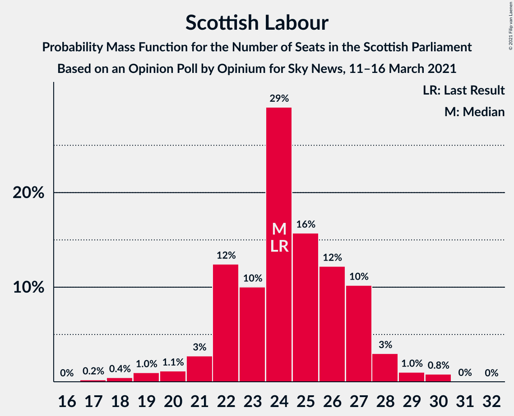

# Opinion Poll by Opinium for Sky News, 11–16 March 2021

<a href="#voting-intentions">Voting Intentions</a> | <a href="#seats">Seats</a> | <a href="#coalitions">Coalitions</a> | <a href="#technical-information">Technical Information</a>

## Voting Intentions

### Confidence Intervals

| Party | Last Result | Poll Result | 80% Confidence Interval | 90% Confidence Interval | 95% Confidence Interval | 99% Confidence Interval |
|:-----:|:-----------:|:-----------:|:-----------------------:|:-----------------------:|:-----------------------:|:-----------------------:|
| Scottish National Party | 41.7% | 42.4% | 40.5–44.4% |40.0–44.9% |39.5–45.4% |38.6–46.3% |
| Scottish Conservative & Unionist Party | 22.9% | 22.3% | 20.7–23.9% |20.3–24.4% |19.9–24.8% |19.2–25.7% |
| Scottish Labour | 19.1% | 19.2% | 17.7–20.8% |17.3–21.2% |16.9–21.6% |16.3–22.4% |
| Scottish Greens | 6.6% | 7.0% | 6.1–8.1% |5.9–8.4% |5.7–8.7% |5.2–9.3% |
| Scottish Liberal Democrats | 5.2% | 5.0% | 4.3–6.0% |4.1–6.2% |3.9–6.5% |3.5–7.0% |

*Note:* The poll result column reflects the actual value used in the calculations. Published results may vary slightly, and in addition be rounded to fewer digits.

## Seats

### Confidence Intervals

| Party | Last Result | Median | 80% Confidence Interval | 90% Confidence Interval | 95% Confidence Interval | 99% Confidence Interval |
|:-----:|:-----------:|:------:|:-----------------------:|:-----------------------:|:-----------------------:|:-----------------------:|
| <a href="#scottish-national-party">Scottish National Party</a> | 63 | 65 | 62–68 |61–69 |60–70 |58–72 |
| <a href="#scottish-conservative-&-unionist-party">Scottish Conservative & Unionist Party</a> | 31 | 29 | 25–32 |25–32 |24–32 |24–34 |
| <a href="#scottish-labour">Scottish Labour</a> | 24 | 24 | 22–27 |22–28 |21–28 |18–30 |
| <a href="#scottish-greens">Scottish Greens</a> | 6 | 6 | 4–10 |3–10 |3–10 |3–10 |
| <a href="#scottish-liberal-democrats">Scottish Liberal Democrats</a> | 5 | 5 | 3–5 |2–5 |2–6 |2–6 |

### Scottish National Party

*For a full overview of the results for this party, see the [Scottish National Party](party-scottishnationalparty.html) page.*

| Number of Seats | Probability | Accumulated | Special Marks |
|:---------------:|:-----------:|:-----------:|:-------------:|
| 56 | 0% | 100% |  |
| 57 | 0.1% | 99.9% |  |
| 58 | 0.3% | 99.8% |  |
| 59 | 0.7% | 99.5% |  |
| 60 | 2% | 98.8% |  |
| 61 | 4% | 97% |  |
| 62 | 6% | 93% |  |
| 63 | 22% | 88% | Last Result |
| 64 | 14% | 66% |  |
| 65 | 20% | 53% | Median, Majority |
| 66 | 13% | 33% |  |
| 67 | 8% | 20% |  |
| 68 | 4% | 12% |  |
| 69 | 3% | 8% |  |
| 70 | 3% | 5% |  |
| 71 | 1.5% | 2% |  |
| 72 | 0.3% | 0.5% |  |
| 73 | 0.2% | 0.2% |  |
| 74 | 0% | 0% |  |

### Scottish Conservative & Unionist Party

*For a full overview of the results for this party, see the [Scottish Conservative & Unionist Party](party-scottishconservativeunionistparty.html) page.*

| Number of Seats | Probability | Accumulated | Special Marks |
|:---------------:|:-----------:|:-----------:|:-------------:|
| 22 | 0.1% | 100% |  |
| 23 | 0.2% | 99.9% |  |
| 24 | 5% | 99.7% |  |
| 25 | 11% | 95% |  |
| 26 | 12% | 84% |  |
| 27 | 9% | 72% |  |
| 28 | 10% | 63% |  |
| 29 | 9% | 53% | Median |
| 30 | 8% | 44% |  |
| 31 | 16% | 36% | Last Result |
| 32 | 18% | 20% |  |
| 33 | 2% | 2% |  |
| 34 | 0.5% | 0.6% |  |
| 35 | 0.1% | 0.2% |  |
| 36 | 0% | 0% |  |

### Scottish Labour

*For a full overview of the results for this party, see the [Scottish Labour](party-scottishlabour.html) page.*

| Number of Seats | Probability | Accumulated | Special Marks |
|:---------------:|:-----------:|:-----------:|:-------------:|
| 17 | 0.2% | 100% |  |
| 18 | 0.3% | 99.8% |  |
| 19 | 0.8% | 99.5% |  |
| 20 | 1.1% | 98.7% |  |
| 21 | 3% | 98% |  |
| 22 | 13% | 95% |  |
| 23 | 11% | 82% |  |
| 24 | 27% | 71% | Last Result, Median |
| 25 | 16% | 43% |  |
| 26 | 13% | 27% |  |
| 27 | 8% | 14% |  |
| 28 | 4% | 6% |  |
| 29 | 1.2% | 2% |  |
| 30 | 0.9% | 0.9% |  |
| 31 | 0.1% | 0.1% |  |
| 32 | 0% | 0% |  |

### Scottish Greens

*For a full overview of the results for this party, see the [Scottish Greens](party-scottishgreens.html) page.*

| Number of Seats | Probability | Accumulated | Special Marks |
|:---------------:|:-----------:|:-----------:|:-------------:|
| 2 | 0.2% | 100% |  |
| 3 | 8% | 99.8% |  |
| 4 | 14% | 92% |  |
| 5 | 16% | 78% |  |
| 6 | 15% | 62% | Last Result, Median |
| 7 | 7% | 47% |  |
| 8 | 8% | 40% |  |
| 9 | 12% | 32% |  |
| 10 | 20% | 20% |  |
| 11 | 0.1% | 0.1% |  |
| 12 | 0% | 0% |  |

### Scottish Liberal Democrats

*For a full overview of the results for this party, see the [Scottish Liberal Democrats](party-scottishliberaldemocrats.html) page.*

| Number of Seats | Probability | Accumulated | Special Marks |
|:---------------:|:-----------:|:-----------:|:-------------:|
| 2 | 8% | 100% |  |
| 3 | 6% | 92% |  |
| 4 | 18% | 85% |  |
| 5 | 65% | 67% | Last Result, Median |
| 6 | 2% | 3% |  |
| 7 | 0.2% | 0.3% |  |
| 8 | 0.1% | 0.1% |  |
| 9 | 0% | 0% |  |

## Coalitions

### Confidence Intervals

| Coalition | Last Result | Median | Majority? | 80% Confidence Interval | 90% Confidence Interval | 95% Confidence Interval | 99% Confidence Interval |
|:---------:|:-----------:|:------:|:---------:|:-----------------------:|:-----------------------:|:-----------------------:|:-----------------------:|
| Scottish National Party – Scottish Greens | 69 | 71 | 99.6% | 68–75 | 67–76 | 66–78 | 65–79 |
| Scottish National Party | 63 | 65 | 53% | 62–68 | 61–69 | 60–70 | 58–72 |
| Scottish Conservative & Unionist Party – Scottish Labour – Scottish Liberal Democrats | 60 | 58 | 0.4% | 54–61 | 53–62 | 51–63 | 50–64 |
| Scottish Conservative & Unionist Party – Scottish Labour | 55 | 53 | 0% | 49–57 | 48–58 | 48–58 | 45–60 |
| Scottish Labour – Scottish Greens – Scottish Liberal Democrats | 35 | 36 | 0% | 32–39 | 32–40 | 31–40 | 29–42 |
| Scottish Conservative & Unionist Party – Scottish Liberal Democrats | 36 | 33 | 0% | 29–37 | 28–37 | 28–37 | 26–38 |
| Scottish Labour – Scottish Liberal Democrats | 29 | 29 | 0% | 26–32 | 25–32 | 24–33 | 22–35 |

### Scottish National Party – Scottish Greens

| Number of Seats | Probability | Accumulated | Special Marks |
|:---------------:|:-----------:|:-----------:|:-------------:|
| 63 | 0.1% | 100% |  |
| 64 | 0.2% | 99.9% |  |
| 65 | 1.0% | 99.6% | Majority |
| 66 | 3% | 98.7% |  |
| 67 | 5% | 96% |  |
| 68 | 8% | 91% |  |
| 69 | 15% | 83% | Last Result |
| 70 | 11% | 68% |  |
| 71 | 7% | 57% | Median |
| 72 | 10% | 49% |  |
| 73 | 12% | 40% |  |
| 74 | 11% | 28% |  |
| 75 | 7% | 17% |  |
| 76 | 5% | 10% |  |
| 77 | 2% | 5% |  |
| 78 | 1.2% | 3% |  |
| 79 | 0.9% | 1.4% |  |
| 80 | 0.4% | 0.5% |  |
| 81 | 0% | 0.1% |  |
| 82 | 0% | 0% |  |

### Scottish National Party

| Number of Seats | Probability | Accumulated | Special Marks |
|:---------------:|:-----------:|:-----------:|:-------------:|
| 56 | 0% | 100% |  |
| 57 | 0.1% | 99.9% |  |
| 58 | 0.3% | 99.8% |  |
| 59 | 0.7% | 99.5% |  |
| 60 | 2% | 98.8% |  |
| 61 | 4% | 97% |  |
| 62 | 6% | 93% |  |
| 63 | 22% | 88% | Last Result |
| 64 | 14% | 66% |  |
| 65 | 20% | 53% | Median, Majority |
| 66 | 13% | 33% |  |
| 67 | 8% | 20% |  |
| 68 | 4% | 12% |  |
| 69 | 3% | 8% |  |
| 70 | 3% | 5% |  |
| 71 | 1.5% | 2% |  |
| 72 | 0.3% | 0.5% |  |
| 73 | 0.2% | 0.2% |  |
| 74 | 0% | 0% |  |

### Scottish Conservative & Unionist Party – Scottish Labour – Scottish Liberal Democrats

| Number of Seats | Probability | Accumulated | Special Marks |
|:---------------:|:-----------:|:-----------:|:-------------:|
| 48 | 0% | 100% |  |
| 49 | 0.4% | 99.9% |  |
| 50 | 0.9% | 99.5% |  |
| 51 | 1.2% | 98.6% |  |
| 52 | 2% | 97% |  |
| 53 | 5% | 95% |  |
| 54 | 7% | 90% |  |
| 55 | 11% | 83% |  |
| 56 | 12% | 72% |  |
| 57 | 10% | 60% |  |
| 58 | 7% | 51% | Median |
| 59 | 11% | 43% |  |
| 60 | 15% | 32% | Last Result |
| 61 | 8% | 17% |  |
| 62 | 5% | 9% |  |
| 63 | 3% | 4% |  |
| 64 | 1.0% | 1.3% |  |
| 65 | 0.2% | 0.4% | Majority |
| 66 | 0.1% | 0.1% |  |
| 67 | 0% | 0% |  |

### Scottish Conservative & Unionist Party – Scottish Labour

| Number of Seats | Probability | Accumulated | Special Marks |
|:---------------:|:-----------:|:-----------:|:-------------:|
| 44 | 0.3% | 100% |  |
| 45 | 0.4% | 99.7% |  |
| 46 | 0.4% | 99.4% |  |
| 47 | 0.8% | 98.9% |  |
| 48 | 3% | 98% |  |
| 49 | 7% | 95% |  |
| 50 | 11% | 88% |  |
| 51 | 11% | 77% |  |
| 52 | 11% | 67% |  |
| 53 | 7% | 56% | Median |
| 54 | 10% | 48% |  |
| 55 | 16% | 38% | Last Result |
| 56 | 10% | 22% |  |
| 57 | 7% | 12% |  |
| 58 | 4% | 5% |  |
| 59 | 1.3% | 2% |  |
| 60 | 0.4% | 0.5% |  |
| 61 | 0.1% | 0.2% |  |
| 62 | 0% | 0.1% |  |
| 63 | 0% | 0% |  |

### Scottish Labour – Scottish Greens – Scottish Liberal Democrats

| Number of Seats | Probability | Accumulated | Special Marks |
|:---------------:|:-----------:|:-----------:|:-------------:|
| 28 | 0% | 100% |  |
| 29 | 0.6% | 99.9% |  |
| 30 | 1.1% | 99.3% |  |
| 31 | 3% | 98% |  |
| 32 | 11% | 96% |  |
| 33 | 10% | 85% |  |
| 34 | 7% | 75% |  |
| 35 | 17% | 67% | Last Result, Median |
| 36 | 14% | 50% |  |
| 37 | 9% | 36% |  |
| 38 | 13% | 27% |  |
| 39 | 8% | 14% |  |
| 40 | 4% | 6% |  |
| 41 | 1.5% | 2% |  |
| 42 | 0.5% | 0.8% |  |
| 43 | 0.2% | 0.3% |  |
| 44 | 0% | 0% |  |

### Scottish Conservative & Unionist Party – Scottish Liberal Democrats

| Number of Seats | Probability | Accumulated | Special Marks |
|:---------------:|:-----------:|:-----------:|:-------------:|
| 26 | 0.5% | 100% |  |
| 27 | 1.2% | 99.5% |  |
| 28 | 4% | 98% |  |
| 29 | 7% | 95% |  |
| 30 | 7% | 88% |  |
| 31 | 12% | 80% |  |
| 32 | 10% | 68% |  |
| 33 | 12% | 58% |  |
| 34 | 8% | 46% | Median |
| 35 | 9% | 38% |  |
| 36 | 15% | 29% | Last Result |
| 37 | 13% | 14% |  |
| 38 | 0.8% | 1.3% |  |
| 39 | 0.4% | 0.5% |  |
| 40 | 0.1% | 0.1% |  |
| 41 | 0% | 0% |  |

### Scottish Labour – Scottish Liberal Democrats

| Number of Seats | Probability | Accumulated | Special Marks |
|:---------------:|:-----------:|:-----------:|:-------------:|
| 21 | 0.1% | 100% |  |
| 22 | 0.5% | 99.9% |  |
| 23 | 0.4% | 99.4% |  |
| 24 | 2% | 98.9% |  |
| 25 | 4% | 96% |  |
| 26 | 5% | 93% |  |
| 27 | 13% | 88% |  |
| 28 | 16% | 75% |  |
| 29 | 21% | 58% | Last Result, Median |
| 30 | 16% | 38% |  |
| 31 | 10% | 21% |  |
| 32 | 7% | 11% |  |
| 33 | 3% | 4% |  |
| 34 | 0.9% | 2% |  |
| 35 | 0.7% | 0.7% |  |
| 36 | 0.1% | 0.1% |  |
| 37 | 0% | 0% |  |

## Technical Information

### Opinion Poll

+ **Polling firm:** Opinium
+ **Commissioner(s):** Sky News
+ **Fieldwork period:** 11–16 March 2021

### Calculations

+ **Sample size:** 1096
+ **Simulations done:** 524,288
+ **Error estimate:** 0.43%

