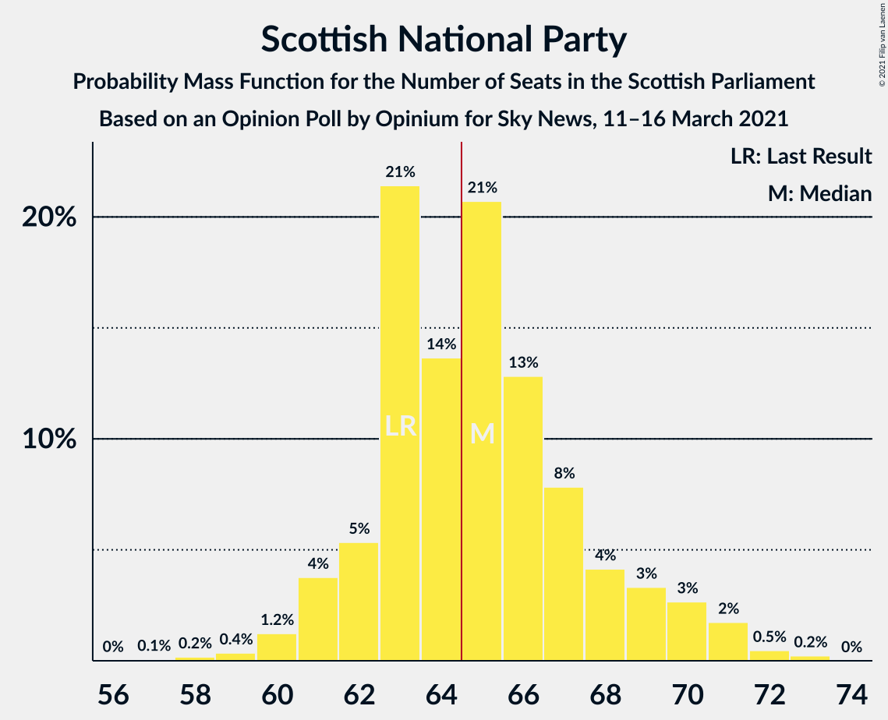

# Opinion Poll by Opinium for Sky News, 11–16 March 2021

<a href="#voting-intentions">Voting Intentions</a> | <a href="#seats">Seats</a> | <a href="#coalitions">Coalitions</a> | <a href="#technical-information">Technical Information</a>

## Voting Intentions

### Confidence Intervals

| Party | Last Result | Poll Result | 80% Confidence Interval | 90% Confidence Interval | 95% Confidence Interval | 99% Confidence Interval |
|:-----:|:-----------:|:-----------:|:-----------------------:|:-----------------------:|:-----------------------:|:-----------------------:|
| Scottish National Party | 41.7% | 42.4% | 40.5–44.4% |40.0–44.9% |39.5–45.4% |38.6–46.3% |
| Scottish Conservative & Unionist Party | 22.9% | 22.3% | 20.7–23.9% |20.3–24.4% |19.9–24.8% |19.2–25.7% |
| Scottish Labour | 19.1% | 19.2% | 17.7–20.8% |17.3–21.2% |16.9–21.6% |16.3–22.4% |
| Scottish Greens | 6.6% | 7.0% | 6.1–8.1% |5.9–8.4% |5.7–8.7% |5.2–9.3% |
| Scottish Liberal Democrats | 5.2% | 5.0% | 4.3–6.0% |4.1–6.2% |3.9–6.5% |3.5–7.0% |

*Note:* The poll result column reflects the actual value used in the calculations. Published results may vary slightly, and in addition be rounded to fewer digits.

## Seats

### Confidence Intervals

| Party | Last Result | Median | 80% Confidence Interval | 90% Confidence Interval | 95% Confidence Interval | 99% Confidence Interval |
|:-----:|:-----------:|:------:|:-----------------------:|:-----------------------:|:-----------------------:|:-----------------------:|
| <a href="#scottish-national-party">Scottish National Party</a> | 63 | 65 | 62–67 |61–69 |60–70 |58–71 |
| <a href="#scottish-conservative-&-unionist-party">Scottish Conservative & Unionist Party</a> | 31 | 29 | 25–32 |25–32 |24–33 |24–34 |
| <a href="#scottish-labour">Scottish Labour</a> | 24 | 24 | 22–27 |22–28 |21–29 |18–30 |
| <a href="#scottish-greens">Scottish Greens</a> | 6 | 6 | 4–10 |3–10 |3–10 |3–10 |
| <a href="#scottish-liberal-democrats">Scottish Liberal Democrats</a> | 5 | 5 | 3–5 |2–5 |2–6 |2–6 |

### Scottish National Party

*For a full overview of the results for this party, see the [Scottish National Party](party-scottishnationalparty.html) page.*

| Number of Seats | Probability | Accumulated | Special Marks |
|:---------------:|:-----------:|:-----------:|:-------------:|
| 56 | 0.1% | 100% |  |
| 57 | 0.2% | 99.9% |  |
| 58 | 0.6% | 99.7% |  |
| 59 | 1.3% | 99.0% |  |
| 60 | 2% | 98% |  |
| 61 | 4% | 96% |  |
| 62 | 5% | 91% |  |
| 63 | 22% | 87% | Last Result |
| 64 | 13% | 64% |  |
| 65 | 18% | 51% | Median, Majority |
| 66 | 15% | 33% |  |
| 67 | 8% | 18% |  |
| 68 | 4% | 10% |  |
| 69 | 2% | 6% |  |
| 70 | 3% | 4% |  |
| 71 | 1.3% | 2% |  |
| 72 | 0.2% | 0.3% |  |
| 73 | 0.1% | 0.1% |  |
| 74 | 0% | 0% |  |

### Scottish Conservative & Unionist Party

*For a full overview of the results for this party, see the [Scottish Conservative & Unionist Party](party-scottishconservativeunionistparty.html) page.*

| Number of Seats | Probability | Accumulated | Special Marks |
|:---------------:|:-----------:|:-----------:|:-------------:|
| 22 | 0.1% | 100% |  |
| 23 | 0.2% | 99.9% |  |
| 24 | 4% | 99.7% |  |
| 25 | 7% | 96% |  |
| 26 | 17% | 88% |  |
| 27 | 9% | 71% |  |
| 28 | 10% | 63% |  |
| 29 | 6% | 53% | Median |
| 30 | 8% | 47% |  |
| 31 | 17% | 39% | Last Result |
| 32 | 19% | 22% |  |
| 33 | 2% | 3% |  |
| 34 | 0.6% | 0.9% |  |
| 35 | 0.2% | 0.3% |  |
| 36 | 0% | 0% |  |

### Scottish Labour

*For a full overview of the results for this party, see the [Scottish Labour](party-scottishlabour.html) page.*

| Number of Seats | Probability | Accumulated | Special Marks |
|:---------------:|:-----------:|:-----------:|:-------------:|
| 17 | 0.2% | 100% |  |
| 18 | 0.4% | 99.8% |  |
| 19 | 0.7% | 99.5% |  |
| 20 | 1.0% | 98.8% |  |
| 21 | 2% | 98% |  |
| 22 | 9% | 96% |  |
| 23 | 12% | 87% |  |
| 24 | 37% | 75% | Last Result, Median |
| 25 | 11% | 38% |  |
| 26 | 12% | 26% |  |
| 27 | 7% | 14% |  |
| 28 | 5% | 7% |  |
| 29 | 1.4% | 3% |  |
| 30 | 1.0% | 1.1% |  |
| 31 | 0.1% | 0.1% |  |
| 32 | 0% | 0% |  |

### Scottish Greens

*For a full overview of the results for this party, see the [Scottish Greens](party-scottishgreens.html) page.*

| Number of Seats | Probability | Accumulated | Special Marks |
|:---------------:|:-----------:|:-----------:|:-------------:|
| 2 | 0.2% | 100% |  |
| 3 | 8% | 99.8% |  |
| 4 | 16% | 92% |  |
| 5 | 13% | 76% |  |
| 6 | 15% | 63% | Last Result, Median |
| 7 | 6% | 47% |  |
| 8 | 8% | 41% |  |
| 9 | 8% | 33% |  |
| 10 | 25% | 25% |  |
| 11 | 0.1% | 0.1% |  |
| 12 | 0% | 0% |  |

### Scottish Liberal Democrats

*For a full overview of the results for this party, see the [Scottish Liberal Democrats](party-scottishliberaldemocrats.html) page.*

| Number of Seats | Probability | Accumulated | Special Marks |
|:---------------:|:-----------:|:-----------:|:-------------:|
| 2 | 10% | 100% |  |
| 3 | 7% | 90% |  |
| 4 | 21% | 84% |  |
| 5 | 61% | 63% | Last Result, Median |
| 6 | 2% | 3% |  |
| 7 | 0.1% | 0.3% |  |
| 8 | 0.1% | 0.1% |  |
| 9 | 0% | 0% |  |

## Coalitions

### Confidence Intervals

| Coalition | Last Result | Median | Majority? | 80% Confidence Interval | 90% Confidence Interval | 95% Confidence Interval | 99% Confidence Interval |
|:---------:|:-----------:|:------:|:---------:|:-----------------------:|:-----------------------:|:-----------------------:|:-----------------------:|
| Scottish National Party – Scottish Greens | 69 | 72 | 99.5% | 67–75 | 67–76 | 66–77 | 65–79 |
| Scottish National Party | 63 | 65 | 51% | 62–67 | 61–69 | 60–70 | 58–71 |
| Scottish Conservative & Unionist Party – Scottish Labour – Scottish Liberal Democrats | 60 | 57 | 0.5% | 54–62 | 53–62 | 52–63 | 50–64 |
| Scottish Conservative & Unionist Party – Scottish Labour | 55 | 53 | 0% | 49–57 | 49–58 | 48–59 | 45–60 |
| Scottish Labour – Scottish Greens – Scottish Liberal Democrats | 35 | 35 | 0% | 32–39 | 32–40 | 31–41 | 29–42 |
| Scottish Conservative & Unionist Party – Scottish Liberal Democrats | 36 | 33 | 0% | 29–37 | 28–37 | 28–37 | 27–39 |
| Scottish Labour – Scottish Liberal Democrats | 29 | 29 | 0% | 26–32 | 25–32 | 24–33 | 23–35 |

### Scottish National Party – Scottish Greens

| Number of Seats | Probability | Accumulated | Special Marks |
|:---------------:|:-----------:|:-----------:|:-------------:|
| 62 | 0.1% | 100% |  |
| 63 | 0.1% | 99.9% |  |
| 64 | 0.3% | 99.8% |  |
| 65 | 2% | 99.5% | Majority |
| 66 | 3% | 98% |  |
| 67 | 5% | 95% |  |
| 68 | 8% | 90% |  |
| 69 | 19% | 82% | Last Result |
| 70 | 7% | 63% |  |
| 71 | 7% | 57% | Median |
| 72 | 11% | 50% |  |
| 73 | 12% | 40% |  |
| 74 | 11% | 27% |  |
| 75 | 7% | 17% |  |
| 76 | 6% | 10% |  |
| 77 | 2% | 4% |  |
| 78 | 0.7% | 2% |  |
| 79 | 0.5% | 0.9% |  |
| 80 | 0.4% | 0.5% |  |
| 81 | 0% | 0% |  |

### Scottish National Party

| Number of Seats | Probability | Accumulated | Special Marks |
|:---------------:|:-----------:|:-----------:|:-------------:|
| 56 | 0.1% | 100% |  |
| 57 | 0.2% | 99.9% |  |
| 58 | 0.6% | 99.7% |  |
| 59 | 1.3% | 99.0% |  |
| 60 | 2% | 98% |  |
| 61 | 4% | 96% |  |
| 62 | 5% | 91% |  |
| 63 | 22% | 87% | Last Result |
| 64 | 13% | 64% |  |
| 65 | 18% | 51% | Median, Majority |
| 66 | 15% | 33% |  |
| 67 | 8% | 18% |  |
| 68 | 4% | 10% |  |
| 69 | 2% | 6% |  |
| 70 | 3% | 4% |  |
| 71 | 1.3% | 2% |  |
| 72 | 0.2% | 0.3% |  |
| 73 | 0.1% | 0.1% |  |
| 74 | 0% | 0% |  |

### Scottish Conservative & Unionist Party – Scottish Labour – Scottish Liberal Democrats

| Number of Seats | Probability | Accumulated | Special Marks |
|:---------------:|:-----------:|:-----------:|:-------------:|
| 49 | 0.4% | 100% |  |
| 50 | 0.5% | 99.5% |  |
| 51 | 0.7% | 99.1% |  |
| 52 | 2% | 98% |  |
| 53 | 6% | 96% |  |
| 54 | 7% | 90% |  |
| 55 | 11% | 83% |  |
| 56 | 12% | 73% |  |
| 57 | 11% | 60% |  |
| 58 | 7% | 50% | Median |
| 59 | 7% | 43% |  |
| 60 | 19% | 37% | Last Result |
| 61 | 8% | 18% |  |
| 62 | 5% | 10% |  |
| 63 | 3% | 5% |  |
| 64 | 2% | 2% |  |
| 65 | 0.3% | 0.5% | Majority |
| 66 | 0.1% | 0.2% |  |
| 67 | 0.1% | 0.1% |  |
| 68 | 0% | 0% |  |

### Scottish Conservative & Unionist Party – Scottish Labour

| Number of Seats | Probability | Accumulated | Special Marks |
|:---------------:|:-----------:|:-----------:|:-------------:|
| 44 | 0.3% | 100% |  |
| 45 | 0.3% | 99.6% |  |
| 46 | 0.3% | 99.4% |  |
| 47 | 0.6% | 99.1% |  |
| 48 | 3% | 98.5% |  |
| 49 | 6% | 95% |  |
| 50 | 10% | 90% |  |
| 51 | 11% | 80% |  |
| 52 | 12% | 69% |  |
| 53 | 8% | 57% | Median |
| 54 | 8% | 49% |  |
| 55 | 17% | 41% | Last Result |
| 56 | 10% | 23% |  |
| 57 | 7% | 14% |  |
| 58 | 4% | 7% |  |
| 59 | 2% | 3% |  |
| 60 | 0.5% | 0.8% |  |
| 61 | 0.2% | 0.3% |  |
| 62 | 0.1% | 0.1% |  |
| 63 | 0% | 0% |  |

### Scottish Labour – Scottish Greens – Scottish Liberal Democrats

| Number of Seats | Probability | Accumulated | Special Marks |
|:---------------:|:-----------:|:-----------:|:-------------:|
| 28 | 0% | 100% |  |
| 29 | 0.5% | 99.9% |  |
| 30 | 1.2% | 99.5% |  |
| 31 | 3% | 98% |  |
| 32 | 14% | 95% |  |
| 33 | 8% | 82% |  |
| 34 | 6% | 73% |  |
| 35 | 19% | 67% | Last Result, Median |
| 36 | 9% | 48% |  |
| 37 | 10% | 39% |  |
| 38 | 16% | 30% |  |
| 39 | 5% | 14% |  |
| 40 | 6% | 9% |  |
| 41 | 2% | 3% |  |
| 42 | 1.0% | 1.5% |  |
| 43 | 0.4% | 0.5% |  |
| 44 | 0% | 0% |  |

### Scottish Conservative & Unionist Party – Scottish Liberal Democrats

| Number of Seats | Probability | Accumulated | Special Marks |
|:---------------:|:-----------:|:-----------:|:-------------:|
| 26 | 0.1% | 100% |  |
| 27 | 1.0% | 99.9% |  |
| 28 | 5% | 98.9% |  |
| 29 | 6% | 94% |  |
| 30 | 4% | 88% |  |
| 31 | 16% | 84% |  |
| 32 | 11% | 68% |  |
| 33 | 13% | 57% |  |
| 34 | 6% | 45% | Median |
| 35 | 6% | 39% |  |
| 36 | 19% | 33% | Last Result |
| 37 | 13% | 14% |  |
| 38 | 0.9% | 2% |  |
| 39 | 0.5% | 0.6% |  |
| 40 | 0.1% | 0.1% |  |
| 41 | 0% | 0% |  |

### Scottish Labour – Scottish Liberal Democrats

| Number of Seats | Probability | Accumulated | Special Marks |
|:---------------:|:-----------:|:-----------:|:-------------:|
| 21 | 0.1% | 100% |  |
| 22 | 0.3% | 99.9% |  |
| 23 | 0.5% | 99.6% |  |
| 24 | 3% | 99.1% |  |
| 25 | 5% | 96% |  |
| 26 | 4% | 91% |  |
| 27 | 7% | 87% |  |
| 28 | 22% | 80% |  |
| 29 | 27% | 58% | Last Result, Median |
| 30 | 10% | 31% |  |
| 31 | 8% | 21% |  |
| 32 | 8% | 13% |  |
| 33 | 3% | 4% |  |
| 34 | 1.0% | 2% |  |
| 35 | 0.7% | 0.7% |  |
| 36 | 0.1% | 0.1% |  |
| 37 | 0% | 0% |  |

## Technical Information

### Opinion Poll

+ **Polling firm:** Opinium
+ **Commissioner(s):** Sky News
+ **Fieldwork period:** 11–16 March 2021

### Calculations

+ **Sample size:** 1096
+ **Simulations done:** 262,144
+ **Error estimate:** 0.78%

