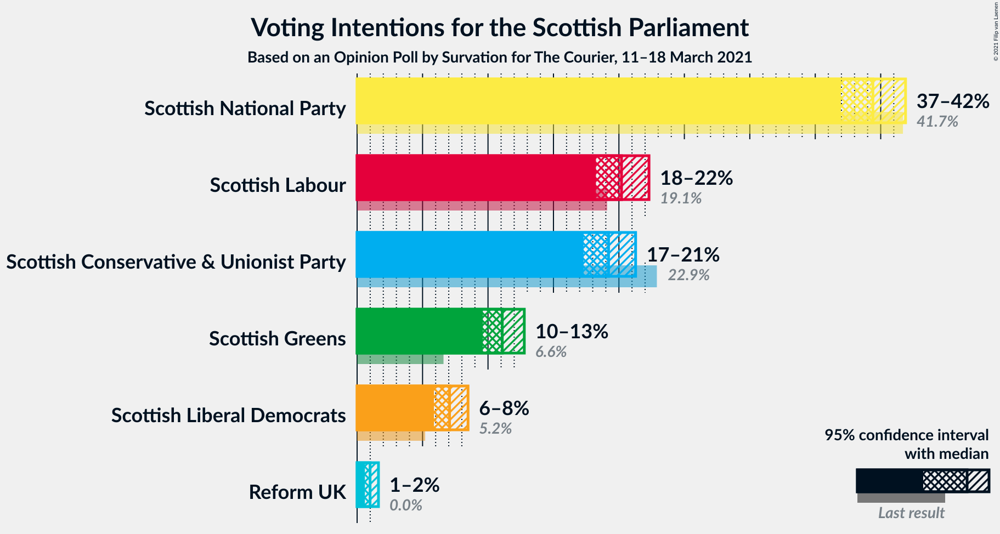
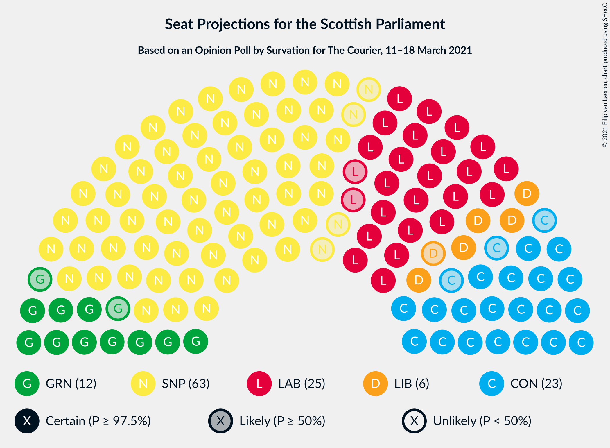
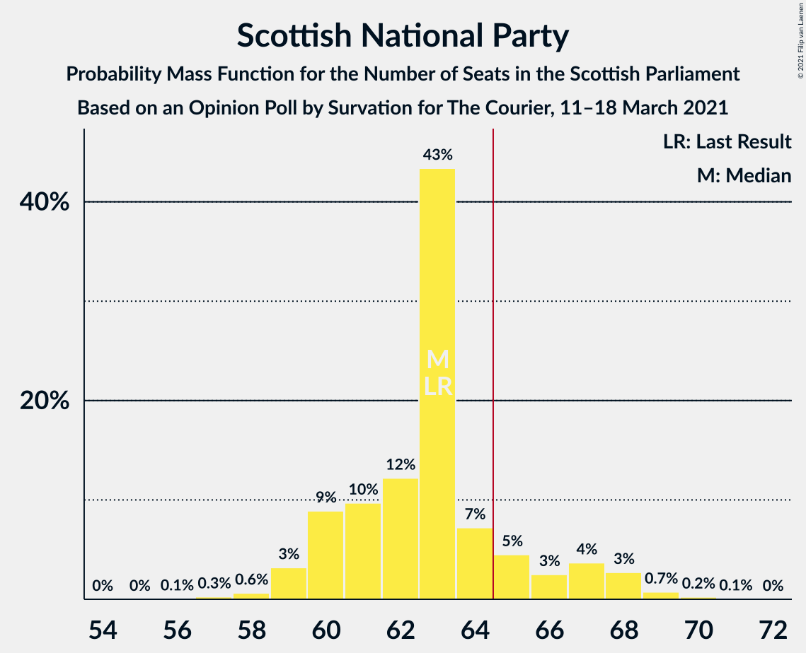
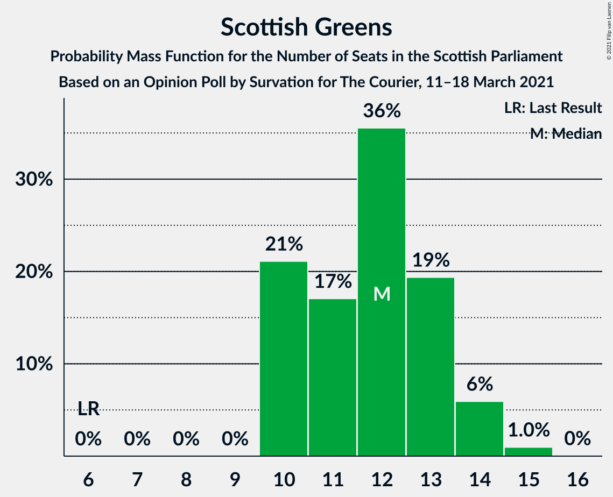
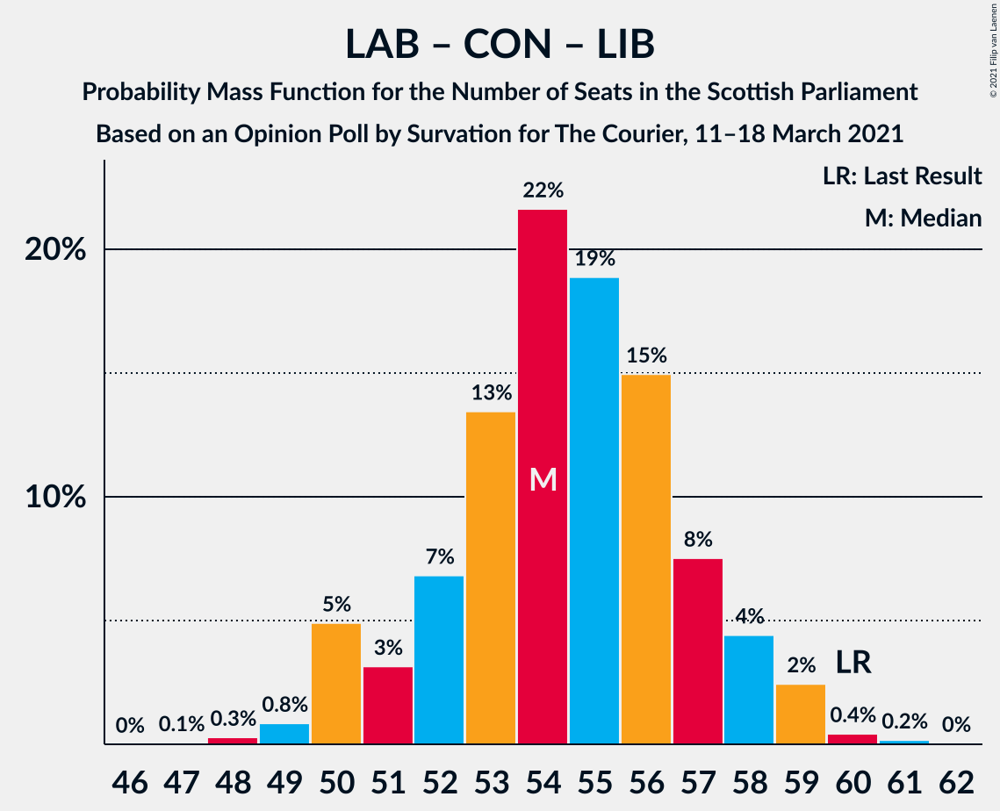

# Opinion Poll by Survation for The Courier, 11–18 March 2021

<a href="#voting-intentions">Voting Intentions</a> | <a href="#seats">Seats</a> | <a href="#coalitions">Coalitions</a> | <a href="#technical-information">Technical Information</a>

## Voting Intentions

### Confidence Intervals

| Party | Last Result | Poll Result | 80% Confidence Interval | 90% Confidence Interval | 95% Confidence Interval | 99% Confidence Interval |
|:-----:|:-----------:|:-----------:|:-----------------------:|:-----------------------:|:-----------------------:|:-----------------------:|
| Scottish National Party | 41.7% | 39.4% | 37.8–41.0% |37.4–41.5% |37.0–41.9% |36.2–42.7% |
| Scottish Labour | 19.1% | 20.2% | 18.9–21.6% |18.5–22.0% |18.2–22.3% |17.6–23.0% |
| Scottish Conservative & Unionist Party | 22.9% | 19.2% | 18.0–20.6% |17.6–20.9% |17.3–21.3% |16.7–21.9% |
| Scottish Greens | 6.6% | 11.1% | 10.1–12.2% |9.8–12.5% |9.6–12.8% |9.1–13.3% |
| Scottish Liberal Democrats | 5.2% | 7.1% | 6.3–8.0% |6.1–8.2% |5.9–8.5% |5.5–8.9% |
| Reform UK | 0.0% | 1.0% | 0.7–1.4% |0.7–1.5% |0.6–1.6% |0.5–1.9% |

*Note:* The poll result column reflects the actual value used in the calculations. Published results may vary slightly, and in addition be rounded to fewer digits.

## Seats

### Confidence Intervals

| Party | Last Result | Median | 80% Confidence Interval | 90% Confidence Interval | 95% Confidence Interval | 99% Confidence Interval |
|:-----:|:-----------:|:------:|:-----------------------:|:-----------------------:|:-----------------------:|:-----------------------:|
| <a href="#scottish-national-party">Scottish National Party</a> | 63 | 67 | 62–68 |62–69 |62–69 |61–70 |
| <a href="#scottish-labour">Scottish Labour</a> | 24 | 25 | 23–25 |23–26 |22–26 |20–28 |
| <a href="#scottish-conservative-&-unionist-party">Scottish Conservative & Unionist Party</a> | 31 | 21 | 19–24 |19–24 |19–25 |19–26 |
| <a href="#scottish-greens">Scottish Greens</a> | 6 | 11 | 10–12 |10–12 |10–13 |10–14 |
| <a href="#scottish-liberal-democrats">Scottish Liberal Democrats</a> | 5 | 6 | 5–7 |4–8 |4–8 |4–9 |
| <a href="#reform-uk">Reform UK</a> | 0 | 0 | 0 |0 |0 |0 |

### Scottish National Party

*For a full overview of the results for this party, see the [Scottish National Party](party-scottishnationalparty.html) page.*

| Number of Seats | Probability | Accumulated | Special Marks |
|:---------------:|:-----------:|:-----------:|:-------------:|
| 60 | 0.2% | 100% |  |
| 61 | 2% | 99.8% |  |
| 62 | 10% | 98% |  |
| 63 | 7% | 88% | Last Result |
| 64 | 8% | 81% |  |
| 65 | 10% | 73% | Majority |
| 66 | 9% | 63% |  |
| 67 | 25% | 54% | Median |
| 68 | 21% | 29% |  |
| 69 | 6% | 8% |  |
| 70 | 2% | 2% |  |
| 71 | 0.4% | 0.4% |  |
| 72 | 0% | 0% |  |

### Scottish Labour

*For a full overview of the results for this party, see the [Scottish Labour](party-scottishlabour.html) page.*

| Number of Seats | Probability | Accumulated | Special Marks |
|:---------------:|:-----------:|:-----------:|:-------------:|
| 19 | 0.2% | 100% |  |
| 20 | 0.4% | 99.8% |  |
| 21 | 2% | 99.4% |  |
| 22 | 3% | 98% |  |
| 23 | 14% | 95% |  |
| 24 | 26% | 81% | Last Result |
| 25 | 47% | 55% | Median |
| 26 | 5% | 7% |  |
| 27 | 1.2% | 2% |  |
| 28 | 0.6% | 0.8% |  |
| 29 | 0.2% | 0.2% |  |
| 30 | 0% | 0% |  |

### Scottish Conservative & Unionist Party

*For a full overview of the results for this party, see the [Scottish Conservative & Unionist Party](party-scottishconservativeunionistparty.html) page.*

| Number of Seats | Probability | Accumulated | Special Marks |
|:---------------:|:-----------:|:-----------:|:-------------:|
| 18 | 0.4% | 100% |  |
| 19 | 16% | 99.5% |  |
| 20 | 14% | 83% |  |
| 21 | 29% | 69% | Median |
| 22 | 15% | 41% |  |
| 23 | 5% | 26% |  |
| 24 | 16% | 20% |  |
| 25 | 4% | 5% |  |
| 26 | 1.0% | 1.2% |  |
| 27 | 0.2% | 0.2% |  |
| 28 | 0.1% | 0.1% |  |
| 29 | 0% | 0% |  |
| 30 | 0% | 0% |  |
| 31 | 0% | 0% | Last Result |

### Scottish Greens

*For a full overview of the results for this party, see the [Scottish Greens](party-scottishgreens.html) page.*

| Number of Seats | Probability | Accumulated | Special Marks |
|:---------------:|:-----------:|:-----------:|:-------------:|
| 6 | 0% | 100% | Last Result |
| 7 | 0% | 100% |  |
| 8 | 0% | 100% |  |
| 9 | 0% | 100% |  |
| 10 | 21% | 100% |  |
| 11 | 35% | 79% | Median |
| 12 | 39% | 44% |  |
| 13 | 3% | 4% |  |
| 14 | 2% | 2% |  |
| 15 | 0.1% | 0.1% |  |
| 16 | 0% | 0% |  |

### Scottish Liberal Democrats

*For a full overview of the results for this party, see the [Scottish Liberal Democrats](party-scottishliberaldemocrats.html) page.*

| Number of Seats | Probability | Accumulated | Special Marks |
|:---------------:|:-----------:|:-----------:|:-------------:|
| 3 | 0.1% | 100% |  |
| 4 | 8% | 99.9% |  |
| 5 | 23% | 92% | Last Result |
| 6 | 44% | 69% | Median |
| 7 | 19% | 25% |  |
| 8 | 5% | 6% |  |
| 9 | 0.5% | 0.7% |  |
| 10 | 0.2% | 0.2% |  |
| 11 | 0% | 0% |  |

### Reform UK

*For a full overview of the results for this party, see the [Reform UK](party-reformuk.html) page.*

| Number of Seats | Probability | Accumulated | Special Marks |
|:---------------:|:-----------:|:-----------:|:-------------:|
| 0 | 100% | 100% | Last Result, Median |

## Coalitions

### Confidence Intervals

| Coalition | Last Result | Median | Majority? | 80% Confidence Interval | 90% Confidence Interval | 95% Confidence Interval | 99% Confidence Interval |
|:---------:|:-----------:|:------:|:---------:|:-----------------------:|:-----------------------:|:-----------------------:|:-----------------------:|
| Scottish National Party – Scottish Greens | 69 | 78 | 100% | 74–79 | 73–80 | 73–80 | 71–81 |
| Scottish National Party | 63 | 67 | 73% | 62–68 | 62–69 | 62–69 | 61–70 |
| Scottish Labour – Scottish Conservative & Unionist Party – Scottish Liberal Democrats | 60 | 51 | 0% | 50–55 | 49–56 | 49–56 | 48–58 |
| Scottish Labour – Scottish Conservative & Unionist Party | 55 | 45 | 0% | 44–49 | 44–49 | 43–50 | 42–51 |
| Scottish Labour – Scottish Greens – Scottish Liberal Democrats | 35 | 42 | 0% | 40–43 | 39–43 | 39–44 | 38–45 |
| Scottish Labour – Scottish Liberal Democrats | 29 | 31 | 0% | 29–32 | 28–32 | 28–33 | 27–34 |
| Scottish Conservative & Unionist Party – Scottish Liberal Democrats | 36 | 27 | 0% | 25–31 | 25–31 | 25–32 | 23–33 |

### Scottish National Party – Scottish Greens

| Number of Seats | Probability | Accumulated | Special Marks |
|:---------------:|:-----------:|:-----------:|:-------------:|
| 69 | 0% | 100% | Last Result |
| 70 | 0.1% | 100% |  |
| 71 | 0.6% | 99.9% |  |
| 72 | 1.3% | 99.4% |  |
| 73 | 6% | 98% |  |
| 74 | 9% | 92% |  |
| 75 | 6% | 83% |  |
| 76 | 10% | 77% |  |
| 77 | 12% | 67% |  |
| 78 | 13% | 55% | Median |
| 79 | 34% | 42% |  |
| 80 | 5% | 8% |  |
| 81 | 2% | 2% |  |
| 82 | 0.4% | 0.4% |  |
| 83 | 0% | 0% |  |

### Scottish National Party

| Number of Seats | Probability | Accumulated | Special Marks |
|:---------------:|:-----------:|:-----------:|:-------------:|
| 60 | 0.2% | 100% |  |
| 61 | 2% | 99.8% |  |
| 62 | 10% | 98% |  |
| 63 | 7% | 88% | Last Result |
| 64 | 8% | 81% |  |
| 65 | 10% | 73% | Majority |
| 66 | 9% | 63% |  |
| 67 | 25% | 54% | Median |
| 68 | 21% | 29% |  |
| 69 | 6% | 8% |  |
| 70 | 2% | 2% |  |
| 71 | 0.4% | 0.4% |  |
| 72 | 0% | 0% |  |

### Scottish Labour – Scottish Conservative & Unionist Party – Scottish Liberal Democrats

| Number of Seats | Probability | Accumulated | Special Marks |
|:---------------:|:-----------:|:-----------:|:-------------:|
| 47 | 0.4% | 100% |  |
| 48 | 2% | 99.6% |  |
| 49 | 5% | 98% |  |
| 50 | 34% | 92% |  |
| 51 | 13% | 58% |  |
| 52 | 12% | 45% | Median |
| 53 | 10% | 33% |  |
| 54 | 6% | 23% |  |
| 55 | 9% | 17% |  |
| 56 | 6% | 8% |  |
| 57 | 1.3% | 2% |  |
| 58 | 0.6% | 0.6% |  |
| 59 | 0.1% | 0.1% |  |
| 60 | 0% | 0% | Last Result |

### Scottish Labour – Scottish Conservative & Unionist Party

| Number of Seats | Probability | Accumulated | Special Marks |
|:---------------:|:-----------:|:-----------:|:-------------:|
| 40 | 0.1% | 100% |  |
| 41 | 0.4% | 99.9% |  |
| 42 | 1.5% | 99.5% |  |
| 43 | 3% | 98% |  |
| 44 | 25% | 95% |  |
| 45 | 24% | 70% |  |
| 46 | 15% | 46% | Median |
| 47 | 9% | 32% |  |
| 48 | 10% | 23% |  |
| 49 | 9% | 13% |  |
| 50 | 3% | 4% |  |
| 51 | 1.0% | 1.3% |  |
| 52 | 0.2% | 0.3% |  |
| 53 | 0.1% | 0.1% |  |
| 54 | 0% | 0% |  |
| 55 | 0% | 0% | Last Result |

### Scottish Labour – Scottish Greens – Scottish Liberal Democrats

| Number of Seats | Probability | Accumulated | Special Marks |
|:---------------:|:-----------:|:-----------:|:-------------:|
| 35 | 0% | 100% | Last Result |
| 36 | 0% | 100% |  |
| 37 | 0.3% | 99.9% |  |
| 38 | 2% | 99.6% |  |
| 39 | 5% | 98% |  |
| 40 | 10% | 93% |  |
| 41 | 25% | 83% |  |
| 42 | 36% | 58% | Median |
| 43 | 17% | 22% |  |
| 44 | 3% | 4% |  |
| 45 | 1.4% | 2% |  |
| 46 | 0.2% | 0.2% |  |
| 47 | 0% | 0% |  |

### Scottish Labour – Scottish Liberal Democrats

| Number of Seats | Probability | Accumulated | Special Marks |
|:---------------:|:-----------:|:-----------:|:-------------:|
| 24 | 0% | 100% |  |
| 25 | 0% | 99.9% |  |
| 26 | 0.2% | 99.9% |  |
| 27 | 2% | 99.7% |  |
| 28 | 6% | 98% |  |
| 29 | 16% | 91% | Last Result |
| 30 | 25% | 75% |  |
| 31 | 39% | 50% | Median |
| 32 | 8% | 11% |  |
| 33 | 2% | 3% |  |
| 34 | 1.0% | 1.1% |  |
| 35 | 0.1% | 0.1% |  |
| 36 | 0% | 0% |  |

### Scottish Conservative & Unionist Party – Scottish Liberal Democrats

| Number of Seats | Probability | Accumulated | Special Marks |
|:---------------:|:-----------:|:-----------:|:-------------:|
| 22 | 0.1% | 100% |  |
| 23 | 0.5% | 99.9% |  |
| 24 | 1.1% | 99.4% |  |
| 25 | 25% | 98% |  |
| 26 | 15% | 74% |  |
| 27 | 22% | 59% | Median |
| 28 | 7% | 37% |  |
| 29 | 10% | 30% |  |
| 30 | 6% | 20% |  |
| 31 | 10% | 14% |  |
| 32 | 3% | 4% |  |
| 33 | 0.8% | 1.0% |  |
| 34 | 0.2% | 0.2% |  |
| 35 | 0% | 0% |  |
| 36 | 0% | 0% | Last Result |

## Technical Information

### Opinion Poll

+ **Polling firm:** Survation
+ **Commissioner(s):** The Courier
+ **Fieldwork period:** 11–18 March 2021

### Calculations

+ **Sample size:** 1515
+ **Simulations done:** 131,072
+ **Error estimate:** 0.81%

