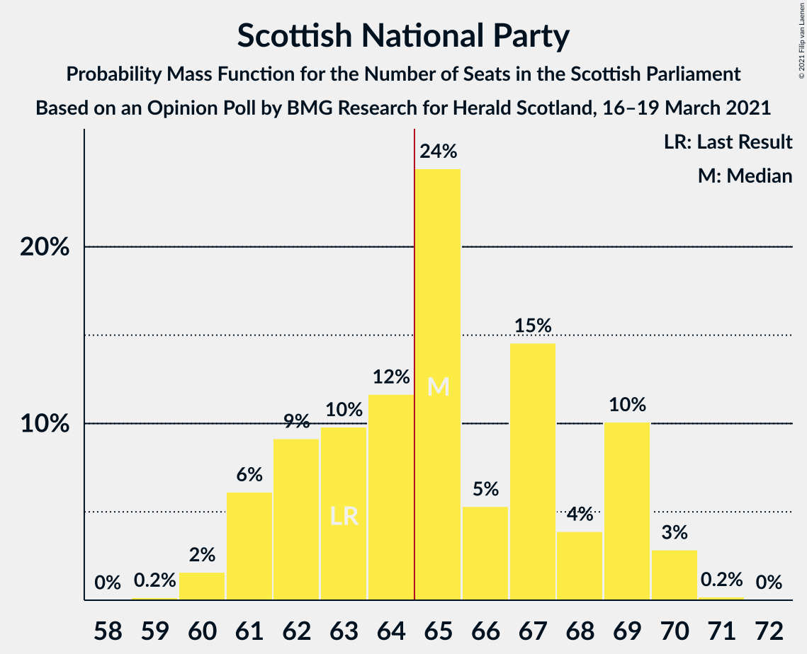
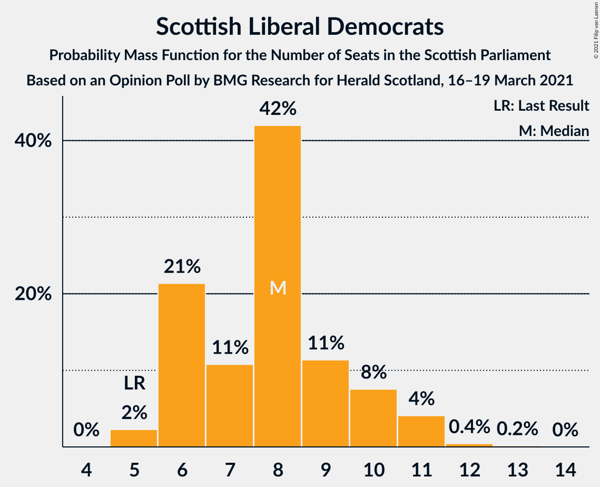
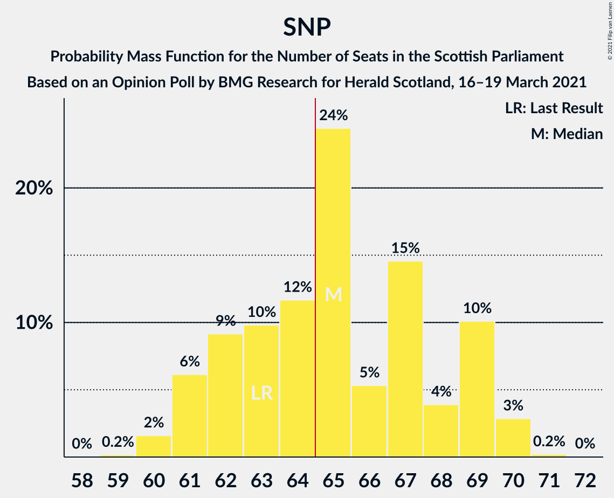
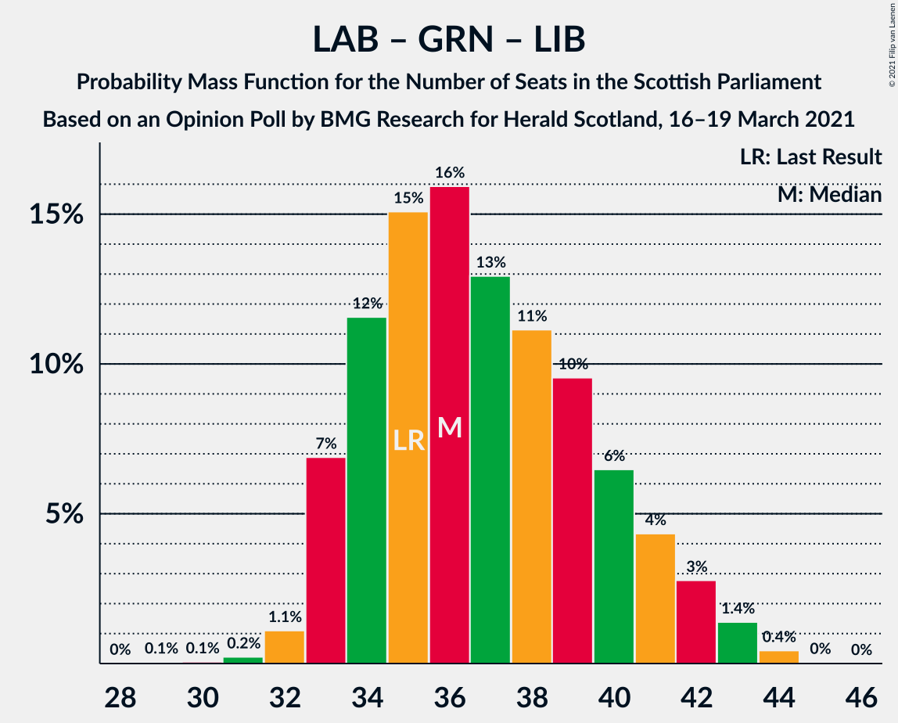

# Opinion Poll by BMG Research for Herald Scotland, 16–19 March 2021

<a href="#voting-intentions">Voting Intentions</a> | <a href="#seats">Seats</a> | <a href="#coalitions">Coalitions</a> | <a href="#technical-information">Technical Information</a>

## Voting Intentions

### Confidence Intervals

| Party | Last Result | Poll Result | 80% Confidence Interval | 90% Confidence Interval | 95% Confidence Interval | 99% Confidence Interval |
|:-----:|:-----------:|:-----------:|:-----------------------:|:-----------------------:|:-----------------------:|:-----------------------:|
| Scottish National Party | 41.7% | 42.0% | 40.1–44.0% |39.5–44.6% |39.0–45.1% |38.1–46.0% |
| Scottish Conservative & Unionist Party | 22.9% | 22.0% | 20.4–23.8% |20.0–24.3% |19.6–24.7% |18.9–25.5% |
| Scottish Labour | 19.1% | 17.0% | 15.6–18.6% |15.2–19.1% |14.9–19.5% |14.2–20.3% |
| Scottish Greens | 6.6% | 8.0% | 7.0–9.2% |6.8–9.6% |6.5–9.9% |6.1–10.5% |
| Scottish Liberal Democrats | 5.2% | 8.0% | 7.0–9.2% |6.8–9.6% |6.5–9.9% |6.1–10.5% |
| Reform UK | 0.0% | 1.0% | 0.7–1.5% |0.6–1.7% |0.5–1.8% |0.4–2.1% |

*Note:* The poll result column reflects the actual value used in the calculations. Published results may vary slightly, and in addition be rounded to fewer digits.

## Seats

### Confidence Intervals

| Party | Last Result | Median | 80% Confidence Interval | 90% Confidence Interval | 95% Confidence Interval | 99% Confidence Interval |
|:-----:|:-----------:|:------:|:-----------------------:|:-----------------------:|:-----------------------:|:-----------------------:|
| <a href="#scottish-national-party">Scottish National Party</a> | 63 | 65 | 62–69 |61–69 |61–70 |60–70 |
| <a href="#scottish-conservative-&-unionist-party">Scottish Conservative & Unionist Party</a> | 31 | 27 | 25–31 |24–32 |23–32 |22–33 |
| <a href="#scottish-labour">Scottish Labour</a> | 24 | 20 | 17–23 |17–24 |17–25 |16–26 |
| <a href="#scottish-greens">Scottish Greens</a> | 6 | 10 | 5–10 |5–10 |4–10 |4–11 |
| <a href="#scottish-liberal-democrats">Scottish Liberal Democrats</a> | 5 | 8 | 6–10 |6–10 |6–11 |5–11 |
| <a href="#reform-uk">Reform UK</a> | 0 | 0 | 0 |0 |0 |0 |

### Scottish National Party

*For a full overview of the results for this party, see the [Scottish National Party](party-scottishnationalparty.html) page.*

| Number of Seats | Probability | Accumulated | Special Marks |
|:---------------:|:-----------:|:-----------:|:-------------:|
| 58 | 0% | 100% |  |
| 59 | 0.2% | 99.9% |  |
| 60 | 2% | 99.8% |  |
| 61 | 6% | 98% |  |
| 62 | 9% | 92% |  |
| 63 | 8% | 82% | Last Result |
| 64 | 13% | 74% |  |
| 65 | 21% | 61% | Median, Majority |
| 66 | 7% | 40% |  |
| 67 | 14% | 33% |  |
| 68 | 4% | 19% |  |
| 69 | 12% | 16% |  |
| 70 | 3% | 3% |  |
| 71 | 0.2% | 0.3% |  |
| 72 | 0.1% | 0.1% |  |
| 73 | 0% | 0% |  |

### Scottish Conservative & Unionist Party

*For a full overview of the results for this party, see the [Scottish Conservative & Unionist Party](party-scottishconservativeunionistparty.html) page.*

| Number of Seats | Probability | Accumulated | Special Marks |
|:---------------:|:-----------:|:-----------:|:-------------:|
| 20 | 0.1% | 100% |  |
| 21 | 0.3% | 99.9% |  |
| 22 | 1.5% | 99.6% |  |
| 23 | 3% | 98% |  |
| 24 | 5% | 95% |  |
| 25 | 17% | 90% |  |
| 26 | 22% | 73% |  |
| 27 | 16% | 52% | Median |
| 28 | 8% | 35% |  |
| 29 | 7% | 27% |  |
| 30 | 9% | 20% |  |
| 31 | 6% | 12% | Last Result |
| 32 | 4% | 6% |  |
| 33 | 1.1% | 1.2% |  |
| 34 | 0.1% | 0.1% |  |
| 35 | 0% | 0% |  |

### Scottish Labour

*For a full overview of the results for this party, see the [Scottish Labour](party-scottishlabour.html) page.*

| Number of Seats | Probability | Accumulated | Special Marks |
|:---------------:|:-----------:|:-----------:|:-------------:|
| 16 | 1.1% | 100% |  |
| 17 | 12% | 98.9% |  |
| 18 | 20% | 87% |  |
| 19 | 12% | 67% |  |
| 20 | 9% | 55% | Median |
| 21 | 16% | 46% |  |
| 22 | 18% | 30% |  |
| 23 | 5% | 12% |  |
| 24 | 4% | 7% | Last Result |
| 25 | 2% | 3% |  |
| 26 | 0.8% | 0.9% |  |
| 27 | 0.1% | 0.1% |  |
| 28 | 0% | 0% |  |

### Scottish Greens

*For a full overview of the results for this party, see the [Scottish Greens](party-scottishgreens.html) page.*

| Number of Seats | Probability | Accumulated | Special Marks |
|:---------------:|:-----------:|:-----------:|:-------------:|
| 3 | 0.4% | 100% |  |
| 4 | 4% | 99.6% |  |
| 5 | 6% | 96% |  |
| 6 | 6% | 90% | Last Result |
| 7 | 5% | 83% |  |
| 8 | 4% | 78% |  |
| 9 | 9% | 74% |  |
| 10 | 65% | 66% | Median |
| 11 | 0.6% | 0.9% |  |
| 12 | 0.3% | 0.3% |  |
| 13 | 0.1% | 0.1% |  |
| 14 | 0% | 0% |  |

### Scottish Liberal Democrats

*For a full overview of the results for this party, see the [Scottish Liberal Democrats](party-scottishliberaldemocrats.html) page.*

| Number of Seats | Probability | Accumulated | Special Marks |
|:---------------:|:-----------:|:-----------:|:-------------:|
| 4 | 0.1% | 100% |  |
| 5 | 2% | 99.9% | Last Result |
| 6 | 22% | 98% |  |
| 7 | 12% | 75% |  |
| 8 | 39% | 63% | Median |
| 9 | 11% | 24% |  |
| 10 | 8% | 12% |  |
| 11 | 4% | 5% |  |
| 12 | 0.4% | 0.5% |  |
| 13 | 0.1% | 0.1% |  |
| 14 | 0% | 0% |  |

### Reform UK

*For a full overview of the results for this party, see the [Reform UK](party-reformuk.html) page.*

| Number of Seats | Probability | Accumulated | Special Marks |
|:---------------:|:-----------:|:-----------:|:-------------:|
| 0 | 100% | 100% | Last Result, Median |

## Coalitions

### Confidence Intervals

| Coalition | Last Result | Median | Majority? | 80% Confidence Interval | 90% Confidence Interval | 95% Confidence Interval | 99% Confidence Interval |
|:---------:|:-----------:|:------:|:---------:|:-----------------------:|:-----------------------:|:-----------------------:|:-----------------------:|
| Scottish National Party – Scottish Greens | 69 | 74 | 99.9% | 70–79 | 69–79 | 68–79 | 66–80 |
| Scottish National Party | 63 | 65 | 61% | 62–69 | 61–69 | 61–70 | 60–70 |
| Scottish Conservative & Unionist Party – Scottish Labour – Scottish Liberal Democrats | 60 | 55 | 0.1% | 50–59 | 50–60 | 50–61 | 49–63 |
| Scottish Conservative & Unionist Party – Scottish Labour | 55 | 47 | 0% | 44–51 | 43–52 | 42–53 | 41–55 |
| Scottish Labour – Scottish Greens – Scottish Liberal Democrats | 35 | 36 | 0% | 34–40 | 33–41 | 33–42 | 32–44 |
| Scottish Conservative & Unionist Party – Scottish Liberal Democrats | 36 | 35 | 0% | 32–38 | 31–39 | 30–40 | 29–41 |
| Scottish Labour – Scottish Liberal Democrats | 29 | 28 | 0% | 24–31 | 24–32 | 23–33 | 22–34 |

### Scottish National Party – Scottish Greens

| Number of Seats | Probability | Accumulated | Special Marks |
|:---------------:|:-----------:|:-----------:|:-------------:|
| 64 | 0.1% | 100% |  |
| 65 | 0.1% | 99.9% | Majority |
| 66 | 0.5% | 99.8% |  |
| 67 | 1.2% | 99.3% |  |
| 68 | 2% | 98% |  |
| 69 | 3% | 96% | Last Result |
| 70 | 6% | 93% |  |
| 71 | 8% | 87% |  |
| 72 | 9% | 79% |  |
| 73 | 11% | 70% |  |
| 74 | 14% | 60% |  |
| 75 | 18% | 46% | Median |
| 76 | 5% | 28% |  |
| 77 | 11% | 24% |  |
| 78 | 2% | 12% |  |
| 79 | 9% | 10% |  |
| 80 | 1.3% | 1.4% |  |
| 81 | 0.1% | 0.1% |  |
| 82 | 0% | 0% |  |

### Scottish National Party

| Number of Seats | Probability | Accumulated | Special Marks |
|:---------------:|:-----------:|:-----------:|:-------------:|
| 58 | 0% | 100% |  |
| 59 | 0.2% | 99.9% |  |
| 60 | 2% | 99.8% |  |
| 61 | 6% | 98% |  |
| 62 | 9% | 92% |  |
| 63 | 8% | 82% | Last Result |
| 64 | 13% | 74% |  |
| 65 | 21% | 61% | Median, Majority |
| 66 | 7% | 40% |  |
| 67 | 14% | 33% |  |
| 68 | 4% | 19% |  |
| 69 | 12% | 16% |  |
| 70 | 3% | 3% |  |
| 71 | 0.2% | 0.3% |  |
| 72 | 0.1% | 0.1% |  |
| 73 | 0% | 0% |  |

### Scottish Conservative & Unionist Party – Scottish Labour – Scottish Liberal Democrats

| Number of Seats | Probability | Accumulated | Special Marks |
|:---------------:|:-----------:|:-----------:|:-------------:|
| 48 | 0.1% | 100% |  |
| 49 | 1.3% | 99.9% |  |
| 50 | 9% | 98.6% |  |
| 51 | 2% | 90% |  |
| 52 | 11% | 88% |  |
| 53 | 5% | 76% |  |
| 54 | 18% | 72% |  |
| 55 | 14% | 54% | Median |
| 56 | 11% | 40% |  |
| 57 | 9% | 30% |  |
| 58 | 8% | 21% |  |
| 59 | 6% | 13% |  |
| 60 | 3% | 7% | Last Result |
| 61 | 2% | 4% |  |
| 62 | 1.2% | 2% |  |
| 63 | 0.5% | 0.7% |  |
| 64 | 0.1% | 0.2% |  |
| 65 | 0.1% | 0.1% | Majority |
| 66 | 0% | 0% |  |

### Scottish Conservative & Unionist Party – Scottish Labour

| Number of Seats | Probability | Accumulated | Special Marks |
|:---------------:|:-----------:|:-----------:|:-------------:|
| 40 | 0.3% | 100% |  |
| 41 | 1.1% | 99.7% |  |
| 42 | 2% | 98.6% |  |
| 43 | 6% | 96% |  |
| 44 | 14% | 91% |  |
| 45 | 8% | 77% |  |
| 46 | 9% | 69% |  |
| 47 | 13% | 59% | Median |
| 48 | 16% | 46% |  |
| 49 | 9% | 30% |  |
| 50 | 8% | 21% |  |
| 51 | 5% | 13% |  |
| 52 | 4% | 8% |  |
| 53 | 2% | 4% |  |
| 54 | 1.3% | 2% |  |
| 55 | 0.8% | 1.1% | Last Result |
| 56 | 0.3% | 0.4% |  |
| 57 | 0.1% | 0.1% |  |
| 58 | 0% | 0% |  |

### Scottish Labour – Scottish Greens – Scottish Liberal Democrats

| Number of Seats | Probability | Accumulated | Special Marks |
|:---------------:|:-----------:|:-----------:|:-------------:|
| 29 | 0.1% | 100% |  |
| 30 | 0.1% | 99.9% |  |
| 31 | 0.3% | 99.9% |  |
| 32 | 1.3% | 99.6% |  |
| 33 | 7% | 98% |  |
| 34 | 12% | 92% |  |
| 35 | 16% | 79% | Last Result |
| 36 | 15% | 64% |  |
| 37 | 15% | 48% |  |
| 38 | 8% | 34% | Median |
| 39 | 9% | 25% |  |
| 40 | 7% | 16% |  |
| 41 | 4% | 9% |  |
| 42 | 3% | 5% |  |
| 43 | 1.4% | 2% |  |
| 44 | 0.5% | 0.5% |  |
| 45 | 0% | 0% |  |

### Scottish Conservative & Unionist Party – Scottish Liberal Democrats

| Number of Seats | Probability | Accumulated | Special Marks |
|:---------------:|:-----------:|:-----------:|:-------------:|
| 27 | 0.1% | 100% |  |
| 28 | 0.2% | 99.9% |  |
| 29 | 0.8% | 99.7% |  |
| 30 | 2% | 99.0% |  |
| 31 | 5% | 97% |  |
| 32 | 9% | 92% |  |
| 33 | 12% | 83% |  |
| 34 | 20% | 70% |  |
| 35 | 13% | 51% | Median |
| 36 | 13% | 38% | Last Result |
| 37 | 9% | 25% |  |
| 38 | 7% | 16% |  |
| 39 | 4% | 9% |  |
| 40 | 3% | 5% |  |
| 41 | 0.9% | 1.1% |  |
| 42 | 0.1% | 0.2% |  |
| 43 | 0% | 0% |  |

### Scottish Labour – Scottish Liberal Democrats

| Number of Seats | Probability | Accumulated | Special Marks |
|:---------------:|:-----------:|:-----------:|:-------------:|
| 22 | 0.5% | 100% |  |
| 23 | 3% | 99.5% |  |
| 24 | 7% | 96% |  |
| 25 | 12% | 89% |  |
| 26 | 11% | 77% |  |
| 27 | 12% | 66% |  |
| 28 | 12% | 55% | Median |
| 29 | 13% | 43% | Last Result |
| 30 | 15% | 30% |  |
| 31 | 6% | 15% |  |
| 32 | 4% | 8% |  |
| 33 | 3% | 4% |  |
| 34 | 1.0% | 1.3% |  |
| 35 | 0.2% | 0.3% |  |
| 36 | 0.1% | 0.1% |  |
| 37 | 0% | 0% |  |

## Technical Information

### Opinion Poll

+ **Polling firm:** BMG Research
+ **Commissioner(s):** Herald Scotland
+ **Fieldwork period:** 16–19 March 2021

### Calculations

+ **Sample size:** 1021
+ **Simulations done:** 524,288
+ **Error estimate:** 0.27%

