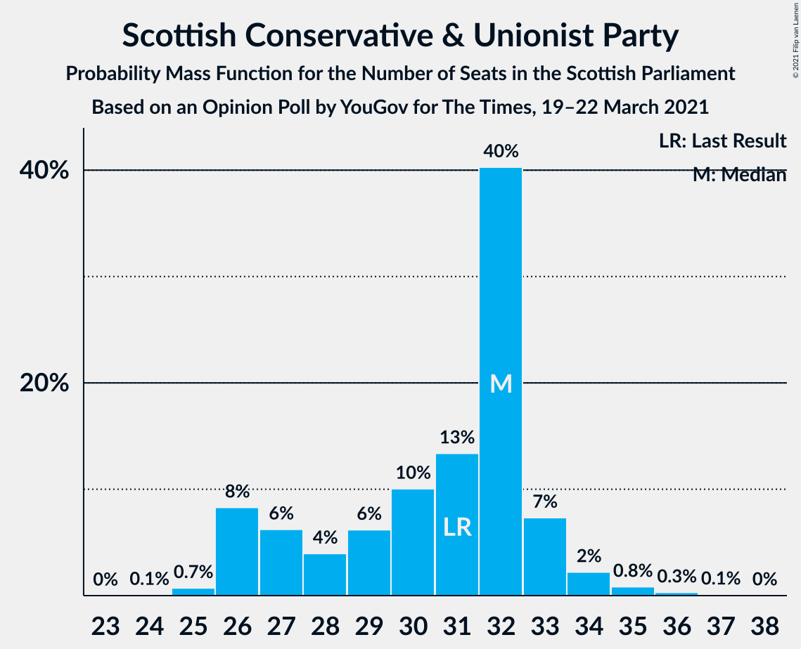
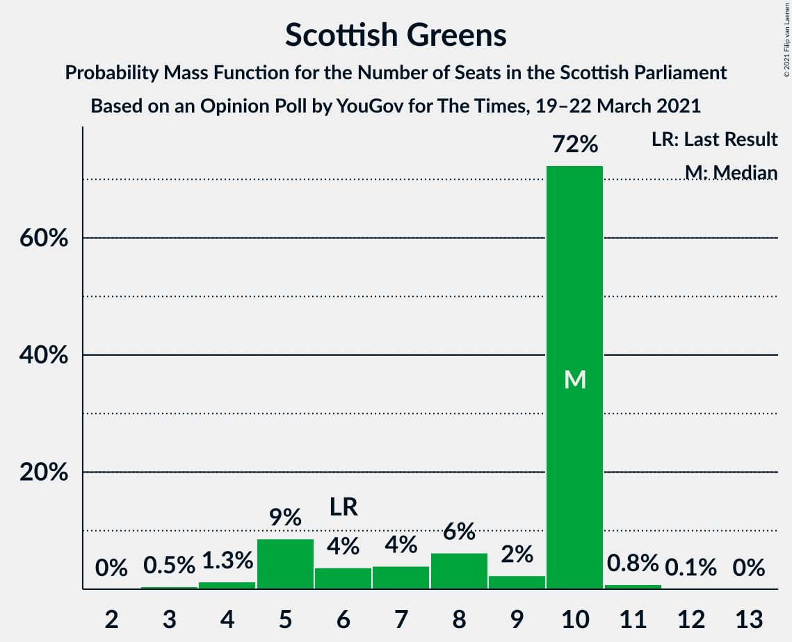

# Opinion Poll by YouGov for The Times, 19–22 March 2021

<a href="#voting-intentions">Voting Intentions</a> | <a href="#seats">Seats</a> | <a href="#coalitions">Coalitions</a> | <a href="#technical-information">Technical Information</a>

## Voting Intentions

### Confidence Intervals

| Party | Last Result | Poll Result | 80% Confidence Interval | 90% Confidence Interval | 95% Confidence Interval | 99% Confidence Interval |
|:-----:|:-----------:|:-----------:|:-----------------------:|:-----------------------:|:-----------------------:|:-----------------------:|
| Scottish National Party | 41.7% | 45.5% | 43.5–47.5% |42.9–48.1% |42.4–48.6% |41.5–49.6% |
| Scottish Conservative & Unionist Party | 22.9% | 23.8% | 22.1–25.5% |21.6–26.0% |21.2–26.5% |20.4–27.4% |
| Scottish Labour | 19.1% | 14.9% | 13.5–16.4% |13.1–16.8% |12.8–17.2% |12.2–18.0% |
| Scottish Greens | 6.6% | 7.9% | 6.9–9.1% |6.6–9.4% |6.4–9.7% |5.9–10.3% |
| Scottish Liberal Democrats | 5.2% | 5.0% | 4.2–6.0% |4.0–6.3% |3.8–6.5% |3.5–7.0% |

*Note:* The poll result column reflects the actual value used in the calculations. Published results may vary slightly, and in addition be rounded to fewer digits.

## Seats

### Confidence Intervals

| Party | Last Result | Median | 80% Confidence Interval | 90% Confidence Interval | 95% Confidence Interval | 99% Confidence Interval |
|:-----:|:-----------:|:------:|:-----------------------:|:-----------------------:|:-----------------------:|:-----------------------:|
| <a href="#scottish-national-party">Scottish National Party</a> | 63 | 67 | 65–71 |65–72 |64–73 |64–74 |
| <a href="#scottish-conservative-&-unionist-party">Scottish Conservative & Unionist Party</a> | 31 | 32 | 27–33 |26–33 |26–34 |25–35 |
| <a href="#scottish-labour">Scottish Labour</a> | 24 | 17 | 17–19 |17–21 |16–22 |15–22 |
| <a href="#scottish-greens">Scottish Greens</a> | 6 | 10 | 5–10 |5–10 |5–10 |4–11 |
| <a href="#scottish-liberal-democrats">Scottish Liberal Democrats</a> | 5 | 5 | 2–5 |2–5 |2–5 |2–6 |

### Scottish National Party

*For a full overview of the results for this party, see the [Scottish National Party](party-scottishnationalparty.html) page.*

| Number of Seats | Probability | Accumulated | Special Marks |
|:---------------:|:-----------:|:-----------:|:-------------:|
| 61 | 0.1% | 100% |  |
| 62 | 0.1% | 99.9% |  |
| 63 | 0.2% | 99.8% | Last Result |
| 64 | 2% | 99.6% |  |
| 65 | 26% | 97% | Majority |
| 66 | 11% | 71% |  |
| 67 | 18% | 60% | Median |
| 68 | 9% | 42% |  |
| 69 | 6% | 33% |  |
| 70 | 7% | 27% |  |
| 71 | 11% | 20% |  |
| 72 | 4% | 9% |  |
| 73 | 4% | 5% |  |
| 74 | 0.8% | 0.9% |  |
| 75 | 0.1% | 0.2% |  |
| 76 | 0.1% | 0.1% |  |
| 77 | 0% | 0% |  |

### Scottish Conservative & Unionist Party

*For a full overview of the results for this party, see the [Scottish Conservative & Unionist Party](party-scottishconservativeunionistparty.html) page.*

| Number of Seats | Probability | Accumulated | Special Marks |
|:---------------:|:-----------:|:-----------:|:-------------:|
| 24 | 0.1% | 100% |  |
| 25 | 0.7% | 99.9% |  |
| 26 | 8% | 99.2% |  |
| 27 | 6% | 91% |  |
| 28 | 4% | 85% |  |
| 29 | 6% | 81% |  |
| 30 | 10% | 75% |  |
| 31 | 13% | 64% | Last Result |
| 32 | 40% | 51% | Median |
| 33 | 7% | 11% |  |
| 34 | 2% | 4% |  |
| 35 | 0.8% | 1.3% |  |
| 36 | 0.3% | 0.5% |  |
| 37 | 0.1% | 0.2% |  |
| 38 | 0% | 0% |  |

### Scottish Labour

*For a full overview of the results for this party, see the [Scottish Labour](party-scottishlabour.html) page.*

| Number of Seats | Probability | Accumulated | Special Marks |
|:---------------:|:-----------:|:-----------:|:-------------:|
| 12 | 0% | 100% |  |
| 13 | 0.2% | 99.9% |  |
| 14 | 0.3% | 99.8% |  |
| 15 | 0.4% | 99.5% |  |
| 16 | 3% | 99.1% |  |
| 17 | 74% | 96% | Median |
| 18 | 10% | 21% |  |
| 19 | 4% | 12% |  |
| 20 | 2% | 8% |  |
| 21 | 2% | 5% |  |
| 22 | 3% | 3% |  |
| 23 | 0.3% | 0.4% |  |
| 24 | 0.1% | 0.1% | Last Result |
| 25 | 0% | 0% |  |

### Scottish Greens

*For a full overview of the results for this party, see the [Scottish Greens](party-scottishgreens.html) page.*

| Number of Seats | Probability | Accumulated | Special Marks |
|:---------------:|:-----------:|:-----------:|:-------------:|
| 3 | 0.5% | 100% |  |
| 4 | 1.3% | 99.5% |  |
| 5 | 9% | 98% |  |
| 6 | 4% | 90% | Last Result |
| 7 | 4% | 86% |  |
| 8 | 6% | 82% |  |
| 9 | 2% | 76% |  |
| 10 | 72% | 73% | Median |
| 11 | 0.8% | 0.9% |  |
| 12 | 0.1% | 0.1% |  |
| 13 | 0% | 0% |  |

### Scottish Liberal Democrats

*For a full overview of the results for this party, see the [Scottish Liberal Democrats](party-scottishliberaldemocrats.html) page.*

| Number of Seats | Probability | Accumulated | Special Marks |
|:---------------:|:-----------:|:-----------:|:-------------:|
| 2 | 16% | 100% |  |
| 3 | 8% | 84% |  |
| 4 | 13% | 76% |  |
| 5 | 61% | 63% | Last Result, Median |
| 6 | 2% | 2% |  |
| 7 | 0.1% | 0.2% |  |
| 8 | 0.1% | 0.1% |  |
| 9 | 0% | 0% |  |

## Coalitions

### Confidence Intervals

| Coalition | Last Result | Median | Majority? | 80% Confidence Interval | 90% Confidence Interval | 95% Confidence Interval | 99% Confidence Interval |
|:---------:|:-----------:|:------:|:---------:|:-----------------------:|:-----------------------:|:-----------------------:|:-----------------------:|
| Scottish National Party – Scottish Greens | 69 | 76 | 100% | 74–81 | 73–81 | 71–83 | 70–83 |
| Scottish National Party | 63 | 67 | 97% | 65–71 | 65–72 | 64–73 | 64–74 |
| Scottish Conservative & Unionist Party – Scottish Labour – Scottish Liberal Democrats | 60 | 53 | 0% | 48–55 | 48–56 | 46–58 | 46–59 |
| Scottish Conservative & Unionist Party – Scottish Labour | 55 | 49 | 0% | 44–50 | 43–52 | 43–53 | 42–55 |
| Scottish Conservative & Unionist Party – Scottish Liberal Democrats | 36 | 35 | 0% | 31–37 | 30–38 | 29–38 | 28–40 |
| Scottish Labour – Scottish Greens – Scottish Liberal Democrats | 35 | 32 | 0% | 28–32 | 27–33 | 26–33 | 25–35 |
| Scottish Labour – Scottish Liberal Democrats | 29 | 22 | 0% | 19–23 | 19–25 | 19–26 | 18–27 |

### Scottish National Party – Scottish Greens

| Number of Seats | Probability | Accumulated | Special Marks |
|:---------------:|:-----------:|:-----------:|:-------------:|
| 68 | 0.1% | 100% |  |
| 69 | 0.3% | 99.9% | Last Result |
| 70 | 1.3% | 99.7% |  |
| 71 | 1.3% | 98% |  |
| 72 | 1.5% | 97% |  |
| 73 | 3% | 96% |  |
| 74 | 4% | 93% |  |
| 75 | 30% | 89% |  |
| 76 | 12% | 59% |  |
| 77 | 16% | 46% | Median |
| 78 | 8% | 31% |  |
| 79 | 5% | 23% |  |
| 80 | 5% | 18% |  |
| 81 | 8% | 13% |  |
| 82 | 2% | 5% |  |
| 83 | 2% | 3% |  |
| 84 | 0.1% | 0.1% |  |
| 85 | 0% | 0% |  |

### Scottish National Party

| Number of Seats | Probability | Accumulated | Special Marks |
|:---------------:|:-----------:|:-----------:|:-------------:|
| 61 | 0.1% | 100% |  |
| 62 | 0.1% | 99.9% |  |
| 63 | 0.2% | 99.8% | Last Result |
| 64 | 2% | 99.6% |  |
| 65 | 26% | 97% | Majority |
| 66 | 11% | 71% |  |
| 67 | 18% | 60% | Median |
| 68 | 9% | 42% |  |
| 69 | 6% | 33% |  |
| 70 | 7% | 27% |  |
| 71 | 11% | 20% |  |
| 72 | 4% | 9% |  |
| 73 | 4% | 5% |  |
| 74 | 0.8% | 0.9% |  |
| 75 | 0.1% | 0.2% |  |
| 76 | 0.1% | 0.1% |  |
| 77 | 0% | 0% |  |

### Scottish Conservative & Unionist Party – Scottish Labour – Scottish Liberal Democrats

| Number of Seats | Probability | Accumulated | Special Marks |
|:---------------:|:-----------:|:-----------:|:-------------:|
| 45 | 0.1% | 100% |  |
| 46 | 2% | 99.9% |  |
| 47 | 2% | 97% |  |
| 48 | 8% | 95% |  |
| 49 | 5% | 87% |  |
| 50 | 5% | 82% |  |
| 51 | 8% | 77% |  |
| 52 | 16% | 69% |  |
| 53 | 12% | 54% |  |
| 54 | 30% | 41% | Median |
| 55 | 4% | 11% |  |
| 56 | 3% | 7% |  |
| 57 | 1.5% | 4% |  |
| 58 | 1.3% | 3% |  |
| 59 | 1.3% | 2% |  |
| 60 | 0.3% | 0.3% | Last Result |
| 61 | 0.1% | 0.1% |  |
| 62 | 0% | 0% |  |

### Scottish Conservative & Unionist Party – Scottish Labour

| Number of Seats | Probability | Accumulated | Special Marks |
|:---------------:|:-----------:|:-----------:|:-------------:|
| 41 | 0.1% | 100% |  |
| 42 | 0.5% | 99.9% |  |
| 43 | 7% | 99.4% |  |
| 44 | 5% | 92% |  |
| 45 | 3% | 87% |  |
| 46 | 6% | 83% |  |
| 47 | 9% | 77% |  |
| 48 | 12% | 68% |  |
| 49 | 35% | 56% | Median |
| 50 | 11% | 21% |  |
| 51 | 4% | 10% |  |
| 52 | 2% | 6% |  |
| 53 | 1.4% | 4% |  |
| 54 | 2% | 2% |  |
| 55 | 0.4% | 0.5% | Last Result |
| 56 | 0.1% | 0.2% |  |
| 57 | 0% | 0% |  |

### Scottish Conservative & Unionist Party – Scottish Liberal Democrats

| Number of Seats | Probability | Accumulated | Special Marks |
|:---------------:|:-----------:|:-----------:|:-------------:|
| 28 | 0.5% | 100% |  |
| 29 | 2% | 99.5% |  |
| 30 | 3% | 97% |  |
| 31 | 8% | 94% |  |
| 32 | 6% | 86% |  |
| 33 | 6% | 80% |  |
| 34 | 10% | 73% |  |
| 35 | 14% | 64% |  |
| 36 | 13% | 49% | Last Result |
| 37 | 31% | 36% | Median |
| 38 | 3% | 6% |  |
| 39 | 1.4% | 2% |  |
| 40 | 0.6% | 0.9% |  |
| 41 | 0.2% | 0.3% |  |
| 42 | 0.1% | 0.1% |  |
| 43 | 0% | 0% |  |

### Scottish Labour – Scottish Greens – Scottish Liberal Democrats

| Number of Seats | Probability | Accumulated | Special Marks |
|:---------------:|:-----------:|:-----------:|:-------------:|
| 23 | 0.1% | 100% |  |
| 24 | 0.2% | 99.9% |  |
| 25 | 0.9% | 99.7% |  |
| 26 | 2% | 98.8% |  |
| 27 | 5% | 97% |  |
| 28 | 5% | 92% |  |
| 29 | 12% | 87% |  |
| 30 | 11% | 75% |  |
| 31 | 13% | 64% |  |
| 32 | 43% | 50% | Median |
| 33 | 5% | 8% |  |
| 34 | 1.4% | 2% |  |
| 35 | 0.5% | 0.9% | Last Result |
| 36 | 0.4% | 0.5% |  |
| 37 | 0.1% | 0.1% |  |
| 38 | 0% | 0% |  |

### Scottish Labour – Scottish Liberal Democrats

| Number of Seats | Probability | Accumulated | Special Marks |
|:---------------:|:-----------:|:-----------:|:-------------:|
| 16 | 0.1% | 100% |  |
| 17 | 0.2% | 99.9% |  |
| 18 | 0.8% | 99.7% |  |
| 19 | 11% | 99.0% |  |
| 20 | 9% | 88% |  |
| 21 | 13% | 80% |  |
| 22 | 51% | 67% | Median |
| 23 | 7% | 16% |  |
| 24 | 3% | 9% |  |
| 25 | 2% | 5% |  |
| 26 | 2% | 4% |  |
| 27 | 2% | 2% |  |
| 28 | 0.2% | 0.3% |  |
| 29 | 0.1% | 0.1% | Last Result |
| 30 | 0% | 0% |  |

## Technical Information

### Opinion Poll

+ **Polling firm:** YouGov
+ **Commissioner(s):** The Times
+ **Fieldwork period:** 19–22 March 2021

### Calculations

+ **Sample size:** 1002
+ **Simulations done:** 1,048,576
+ **Error estimate:** 0.34%

