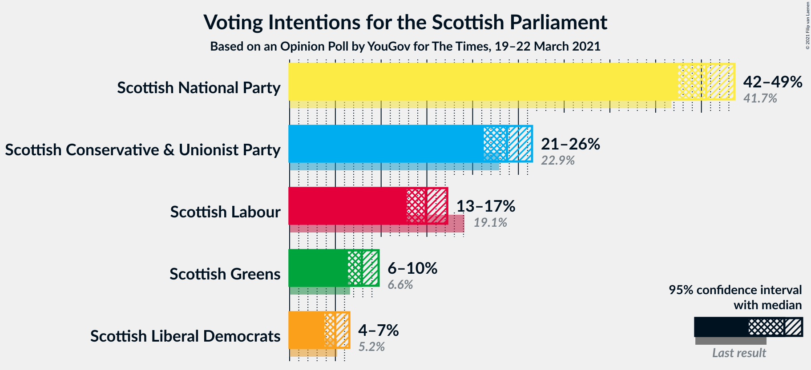
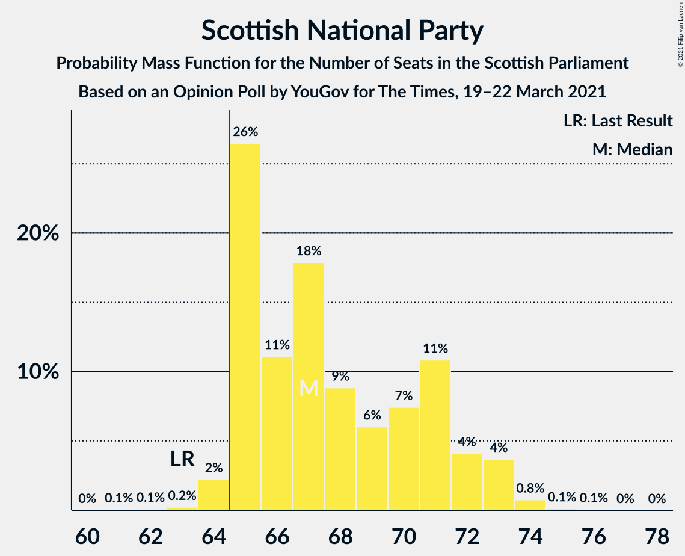
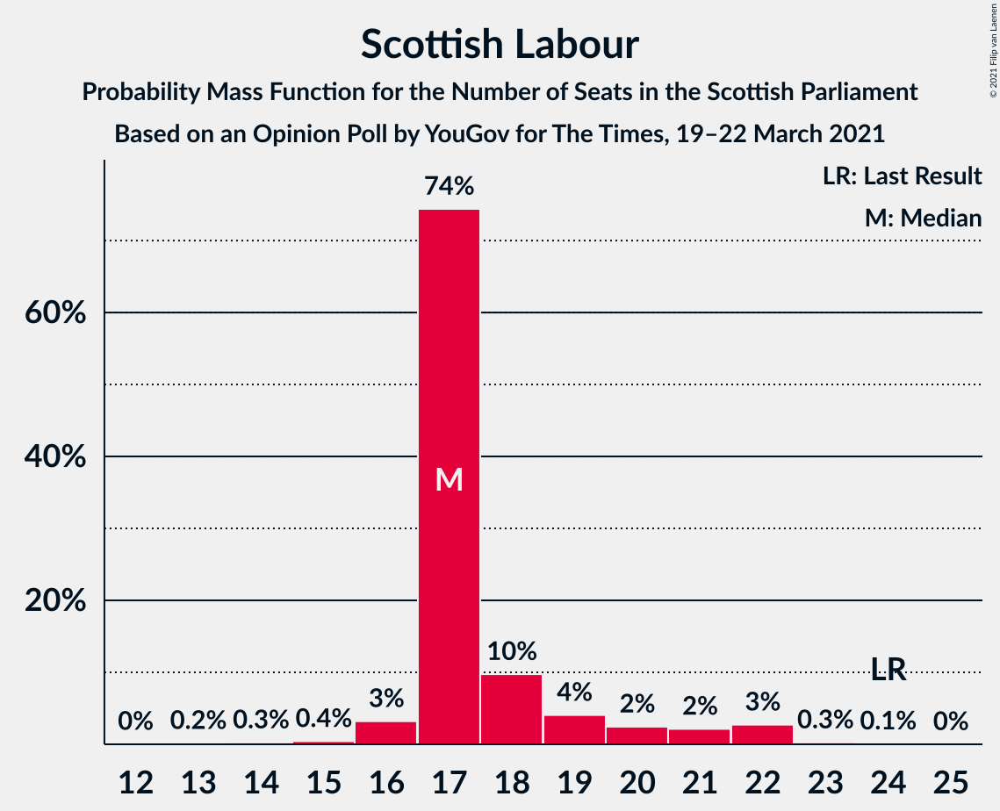
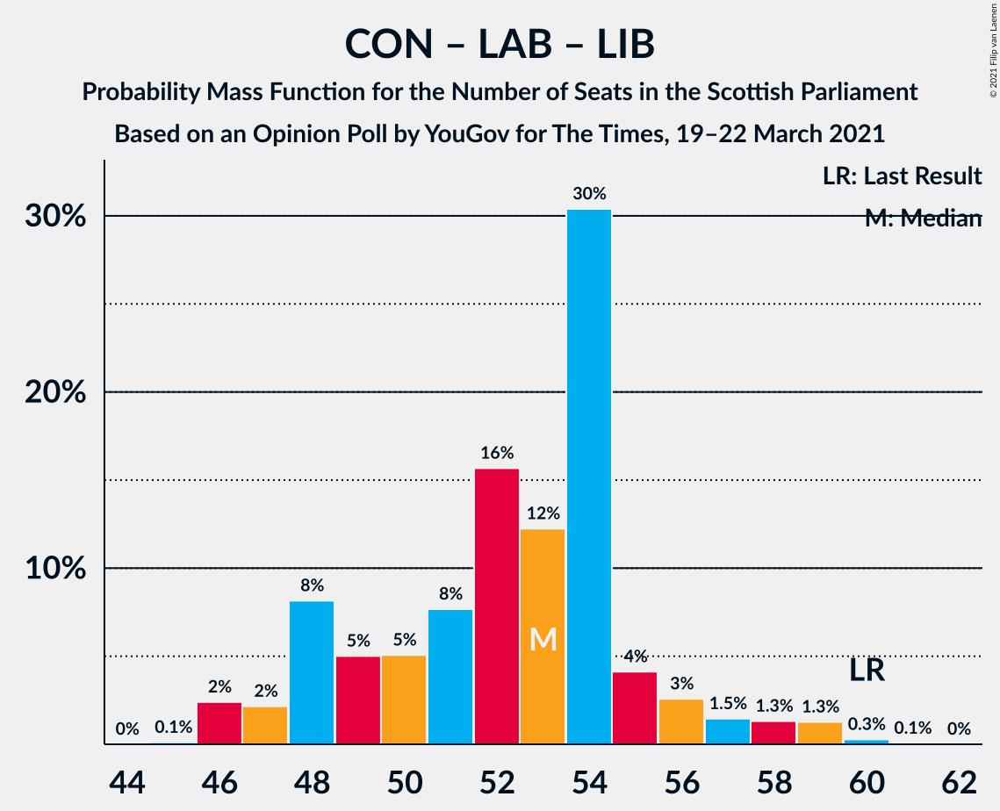
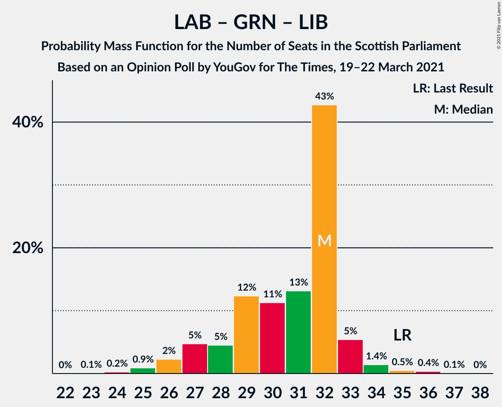

# Opinion Poll by YouGov for The Times, 19–22 March 2021

<a href="#voting-intentions">Voting Intentions</a> | <a href="#seats">Seats</a> | <a href="#coalitions">Coalitions</a> | <a href="#technical-information">Technical Information</a>

## Voting Intentions

### Confidence Intervals

| Party | Last Result | Poll Result | 80% Confidence Interval | 90% Confidence Interval | 95% Confidence Interval | 99% Confidence Interval |
|:-----:|:-----------:|:-----------:|:-----------------------:|:-----------------------:|:-----------------------:|:-----------------------:|
| Scottish National Party | 41.7% | 45.5% | 43.5–47.5% |42.9–48.1% |42.4–48.6% |41.5–49.6% |
| Scottish Conservative & Unionist Party | 22.9% | 23.8% | 22.1–25.5% |21.6–26.0% |21.2–26.5% |20.4–27.4% |
| Scottish Labour | 19.1% | 14.9% | 13.5–16.4% |13.1–16.8% |12.8–17.2% |12.2–18.0% |
| Scottish Greens | 6.6% | 7.9% | 6.9–9.1% |6.6–9.4% |6.4–9.7% |5.9–10.3% |
| Scottish Liberal Democrats | 5.2% | 5.0% | 4.2–6.0% |4.0–6.3% |3.8–6.5% |3.5–7.0% |

*Note:* The poll result column reflects the actual value used in the calculations. Published results may vary slightly, and in addition be rounded to fewer digits.

## Seats

### Confidence Intervals

| Party | Last Result | Median | 80% Confidence Interval | 90% Confidence Interval | 95% Confidence Interval | 99% Confidence Interval |
|:-----:|:-----------:|:------:|:-----------------------:|:-----------------------:|:-----------------------:|:-----------------------:|
| <a href="#scottish-national-party">Scottish National Party</a> | 63 | 67 | 66–71 |66–72 |65–72 |62–73 |
| <a href="#scottish-conservative-&-unionist-party">Scottish Conservative & Unionist Party</a> | 31 | 30 | 26–33 |26–34 |25–34 |25–36 |
| <a href="#scottish-labour">Scottish Labour</a> | 24 | 17 | 17–20 |16–21 |16–22 |14–23 |
| <a href="#scottish-greens">Scottish Greens</a> | 6 | 10 | 6–10 |5–10 |4–10 |3–11 |
| <a href="#scottish-liberal-democrats">Scottish Liberal Democrats</a> | 5 | 4 | 2–5 |2–5 |2–6 |2–6 |

### Scottish National Party

*For a full overview of the results for this party, see the [Scottish National Party](party-scottishnationalparty.html) page.*

| Number of Seats | Probability | Accumulated | Special Marks |
|:---------------:|:-----------:|:-----------:|:-------------:|
| 60 | 0.1% | 100% |  |
| 61 | 0.2% | 99.9% |  |
| 62 | 0.3% | 99.7% |  |
| 63 | 0.3% | 99.4% | Last Result |
| 64 | 0.9% | 99.1% |  |
| 65 | 2% | 98% | Majority |
| 66 | 14% | 96% |  |
| 67 | 35% | 82% | Median |
| 68 | 11% | 46% |  |
| 69 | 6% | 35% |  |
| 70 | 9% | 29% |  |
| 71 | 14% | 21% |  |
| 72 | 5% | 7% |  |
| 73 | 1.0% | 1.4% |  |
| 74 | 0.2% | 0.4% |  |
| 75 | 0.2% | 0.2% |  |
| 76 | 0% | 0% |  |

### Scottish Conservative & Unionist Party

*For a full overview of the results for this party, see the [Scottish Conservative & Unionist Party](party-scottishconservativeunionistparty.html) page.*

| Number of Seats | Probability | Accumulated | Special Marks |
|:---------------:|:-----------:|:-----------:|:-------------:|
| 24 | 0.1% | 100% |  |
| 25 | 3% | 99.9% |  |
| 26 | 11% | 97% |  |
| 27 | 7% | 86% |  |
| 28 | 6% | 79% |  |
| 29 | 10% | 73% |  |
| 30 | 21% | 63% | Median |
| 31 | 13% | 42% | Last Result |
| 32 | 17% | 29% |  |
| 33 | 7% | 12% |  |
| 34 | 3% | 5% |  |
| 35 | 1.2% | 2% |  |
| 36 | 0.7% | 0.9% |  |
| 37 | 0.2% | 0.2% |  |
| 38 | 0% | 0% |  |

### Scottish Labour

*For a full overview of the results for this party, see the [Scottish Labour](party-scottishlabour.html) page.*

| Number of Seats | Probability | Accumulated | Special Marks |
|:---------------:|:-----------:|:-----------:|:-------------:|
| 12 | 0.1% | 100% |  |
| 13 | 0.2% | 99.9% |  |
| 14 | 0.2% | 99.7% |  |
| 15 | 0.7% | 99.5% |  |
| 16 | 7% | 98.8% |  |
| 17 | 64% | 91% | Median |
| 18 | 10% | 28% |  |
| 19 | 7% | 18% |  |
| 20 | 3% | 11% |  |
| 21 | 4% | 8% |  |
| 22 | 4% | 5% |  |
| 23 | 0.5% | 0.6% |  |
| 24 | 0.2% | 0.2% | Last Result |
| 25 | 0% | 0% |  |

### Scottish Greens

*For a full overview of the results for this party, see the [Scottish Greens](party-scottishgreens.html) page.*

| Number of Seats | Probability | Accumulated | Special Marks |
|:---------------:|:-----------:|:-----------:|:-------------:|
| 3 | 1.0% | 100% |  |
| 4 | 2% | 99.0% |  |
| 5 | 5% | 97% |  |
| 6 | 3% | 92% | Last Result |
| 7 | 4% | 89% |  |
| 8 | 4% | 86% |  |
| 9 | 3% | 82% |  |
| 10 | 78% | 79% | Median |
| 11 | 1.1% | 1.3% |  |
| 12 | 0.2% | 0.2% |  |
| 13 | 0.1% | 0.1% |  |
| 14 | 0% | 0% |  |

### Scottish Liberal Democrats

*For a full overview of the results for this party, see the [Scottish Liberal Democrats](party-scottishliberaldemocrats.html) page.*

| Number of Seats | Probability | Accumulated | Special Marks |
|:---------------:|:-----------:|:-----------:|:-------------:|
| 1 | 0.1% | 100% |  |
| 2 | 13% | 99.9% |  |
| 3 | 8% | 87% |  |
| 4 | 36% | 79% | Median |
| 5 | 41% | 43% | Last Result |
| 6 | 2% | 3% |  |
| 7 | 0.2% | 0.3% |  |
| 8 | 0.1% | 0.1% |  |
| 9 | 0% | 0% |  |

## Coalitions

### Confidence Intervals

| Coalition | Last Result | Median | Majority? | 80% Confidence Interval | 90% Confidence Interval | 95% Confidence Interval | 99% Confidence Interval |
|:---------:|:-----------:|:------:|:---------:|:-----------------------:|:-----------------------:|:-----------------------:|:-----------------------:|
| Scottish National Party – Scottish Greens | 69 | 77 | 100% | 75–81 | 73–81 | 72–82 | 70–82 |
| Scottish National Party | 63 | 67 | 98% | 66–71 | 66–72 | 65–72 | 62–73 |
| Scottish Conservative & Unionist Party – Scottish Labour – Scottish Liberal Democrats | 60 | 52 | 0% | 48–54 | 48–56 | 47–57 | 47–59 |
| Scottish Conservative & Unionist Party – Scottish Labour | 55 | 48 | 0% | 44–50 | 43–52 | 43–53 | 42–55 |
| Scottish Conservative & Unionist Party – Scottish Liberal Democrats | 36 | 35 | 0% | 30–37 | 30–38 | 30–39 | 29–40 |
| Scottish Labour – Scottish Greens – Scottish Liberal Democrats | 35 | 31 | 0% | 28–33 | 27–33 | 26–34 | 25–36 |
| Scottish Labour – Scottish Liberal Democrats | 29 | 22 | 0% | 20–23 | 19–25 | 19–26 | 18–27 |

### Scottish National Party – Scottish Greens

| Number of Seats | Probability | Accumulated | Special Marks |
|:---------------:|:-----------:|:-----------:|:-------------:|
| 68 | 0% | 100% |  |
| 69 | 0.2% | 99.9% | Last Result |
| 70 | 0.4% | 99.7% |  |
| 71 | 1.2% | 99.4% |  |
| 72 | 2% | 98% |  |
| 73 | 2% | 97% |  |
| 74 | 3% | 95% |  |
| 75 | 6% | 91% |  |
| 76 | 13% | 85% |  |
| 77 | 35% | 72% | Median |
| 78 | 11% | 37% |  |
| 79 | 4% | 25% |  |
| 80 | 6% | 21% |  |
| 81 | 11% | 15% |  |
| 82 | 4% | 4% |  |
| 83 | 0.3% | 0.3% |  |
| 84 | 0% | 0% |  |

### Scottish National Party

| Number of Seats | Probability | Accumulated | Special Marks |
|:---------------:|:-----------:|:-----------:|:-------------:|
| 60 | 0.1% | 100% |  |
| 61 | 0.2% | 99.9% |  |
| 62 | 0.3% | 99.7% |  |
| 63 | 0.3% | 99.4% | Last Result |
| 64 | 0.9% | 99.1% |  |
| 65 | 2% | 98% | Majority |
| 66 | 14% | 96% |  |
| 67 | 35% | 82% | Median |
| 68 | 11% | 46% |  |
| 69 | 6% | 35% |  |
| 70 | 9% | 29% |  |
| 71 | 14% | 21% |  |
| 72 | 5% | 7% |  |
| 73 | 1.0% | 1.4% |  |
| 74 | 0.2% | 0.4% |  |
| 75 | 0.2% | 0.2% |  |
| 76 | 0% | 0% |  |

### Scottish Conservative & Unionist Party – Scottish Labour – Scottish Liberal Democrats

| Number of Seats | Probability | Accumulated | Special Marks |
|:---------------:|:-----------:|:-----------:|:-------------:|
| 46 | 0.3% | 100% |  |
| 47 | 4% | 99.7% |  |
| 48 | 11% | 96% |  |
| 49 | 6% | 85% |  |
| 50 | 4% | 79% |  |
| 51 | 11% | 75% | Median |
| 52 | 35% | 63% |  |
| 53 | 13% | 28% |  |
| 54 | 6% | 15% |  |
| 55 | 3% | 9% |  |
| 56 | 2% | 5% |  |
| 57 | 2% | 3% |  |
| 58 | 1.2% | 2% |  |
| 59 | 0.4% | 0.6% |  |
| 60 | 0.2% | 0.3% | Last Result |
| 61 | 0% | 0.1% |  |
| 62 | 0% | 0% |  |

### Scottish Conservative & Unionist Party – Scottish Labour

| Number of Seats | Probability | Accumulated | Special Marks |
|:---------------:|:-----------:|:-----------:|:-------------:|
| 41 | 0.2% | 100% |  |
| 42 | 2% | 99.8% |  |
| 43 | 8% | 98% |  |
| 44 | 5% | 90% |  |
| 45 | 4% | 85% |  |
| 46 | 9% | 80% |  |
| 47 | 18% | 71% | Median |
| 48 | 20% | 53% |  |
| 49 | 15% | 32% |  |
| 50 | 8% | 18% |  |
| 51 | 4% | 10% |  |
| 52 | 3% | 6% |  |
| 53 | 2% | 3% |  |
| 54 | 1.0% | 2% |  |
| 55 | 0.4% | 0.8% | Last Result |
| 56 | 0.2% | 0.3% |  |
| 57 | 0.1% | 0.1% |  |
| 58 | 0% | 0% |  |

### Scottish Conservative & Unionist Party – Scottish Liberal Democrats

| Number of Seats | Probability | Accumulated | Special Marks |
|:---------------:|:-----------:|:-----------:|:-------------:|
| 28 | 0.4% | 100% |  |
| 29 | 2% | 99.5% |  |
| 30 | 8% | 98% |  |
| 31 | 11% | 89% |  |
| 32 | 7% | 78% |  |
| 33 | 6% | 71% |  |
| 34 | 12% | 66% | Median |
| 35 | 28% | 54% |  |
| 36 | 15% | 26% | Last Result |
| 37 | 5% | 10% |  |
| 38 | 2% | 5% |  |
| 39 | 2% | 3% |  |
| 40 | 0.5% | 0.9% |  |
| 41 | 0.3% | 0.5% |  |
| 42 | 0.1% | 0.1% |  |
| 43 | 0% | 0% |  |

### Scottish Labour – Scottish Greens – Scottish Liberal Democrats

| Number of Seats | Probability | Accumulated | Special Marks |
|:---------------:|:-----------:|:-----------:|:-------------:|
| 24 | 0.3% | 100% |  |
| 25 | 1.2% | 99.7% |  |
| 26 | 3% | 98% |  |
| 27 | 2% | 96% |  |
| 28 | 4% | 94% |  |
| 29 | 6% | 90% |  |
| 30 | 13% | 83% |  |
| 31 | 24% | 70% | Median |
| 32 | 35% | 46% |  |
| 33 | 7% | 11% |  |
| 34 | 3% | 5% |  |
| 35 | 0.9% | 2% | Last Result |
| 36 | 1.0% | 1.2% |  |
| 37 | 0.1% | 0.2% |  |
| 38 | 0% | 0.1% |  |
| 39 | 0% | 0% |  |

### Scottish Labour – Scottish Liberal Democrats

| Number of Seats | Probability | Accumulated | Special Marks |
|:---------------:|:-----------:|:-----------:|:-------------:|
| 16 | 0.1% | 100% |  |
| 17 | 0.3% | 99.9% |  |
| 18 | 0.3% | 99.6% |  |
| 19 | 5% | 99.3% |  |
| 20 | 12% | 94% |  |
| 21 | 24% | 82% | Median |
| 22 | 40% | 57% |  |
| 23 | 7% | 17% |  |
| 24 | 4% | 10% |  |
| 25 | 2% | 6% |  |
| 26 | 2% | 3% |  |
| 27 | 1.3% | 2% |  |
| 28 | 0.2% | 0.3% |  |
| 29 | 0.1% | 0.1% | Last Result |
| 30 | 0% | 0% |  |

## Technical Information

### Opinion Poll

+ **Polling firm:** YouGov
+ **Commissioner(s):** The Times
+ **Fieldwork period:** 19–22 March 2021

### Calculations

+ **Sample size:** 1002
+ **Simulations done:** 131,072
+ **Error estimate:** 1.86%

