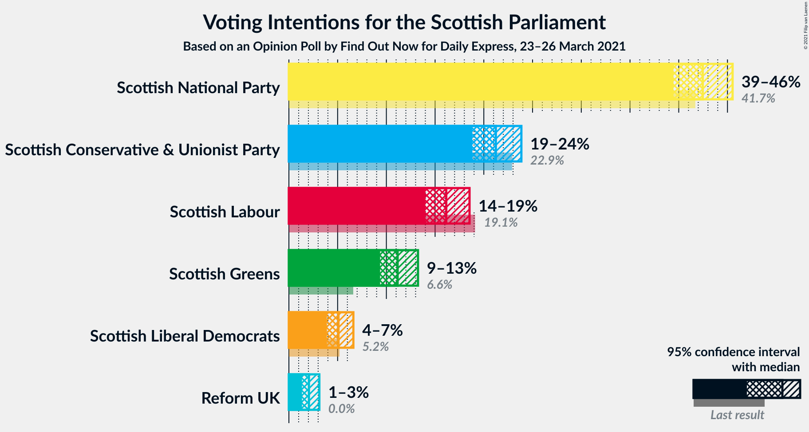
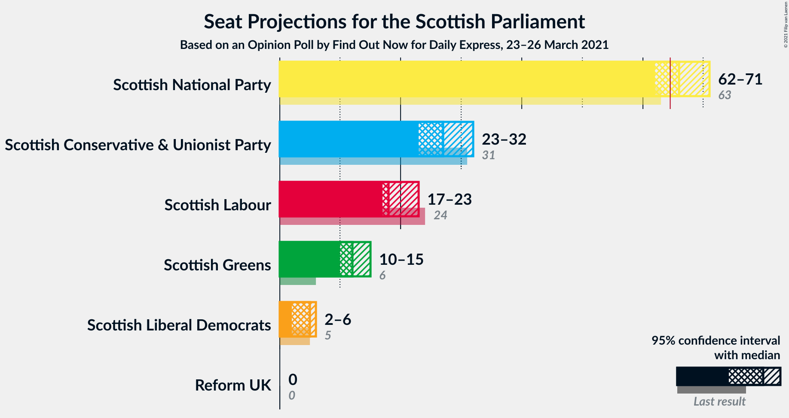
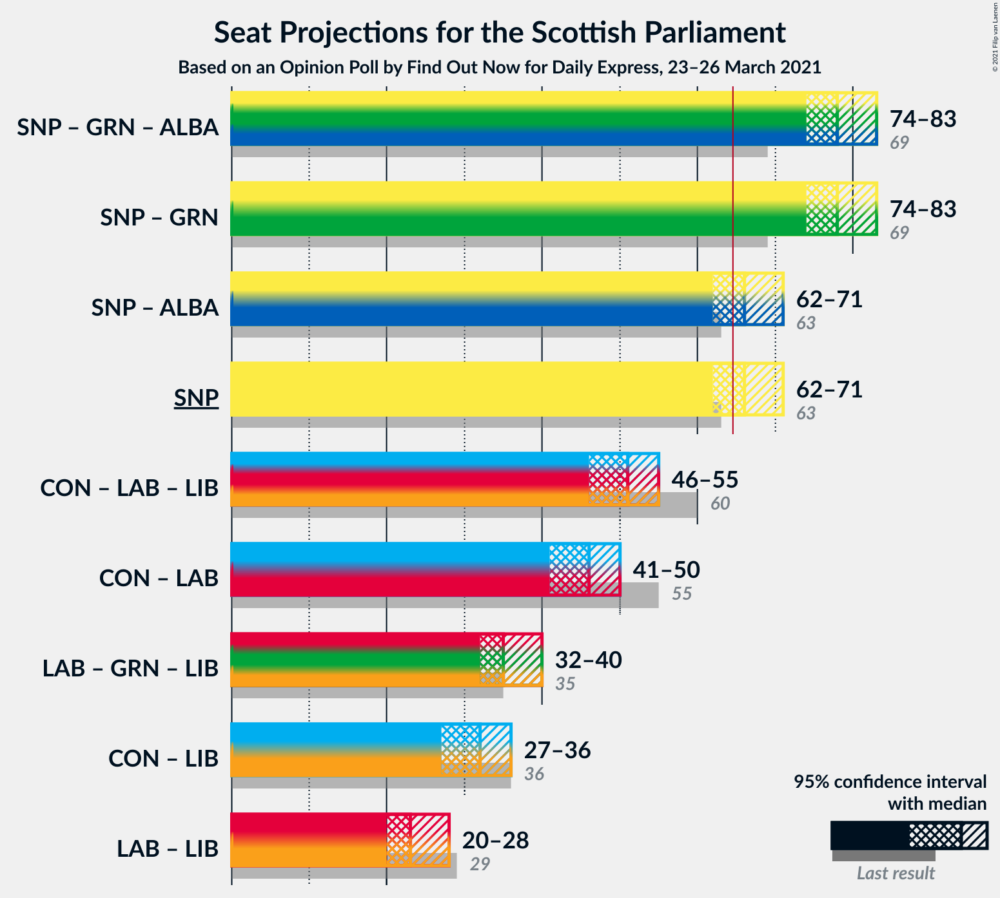

# Opinion Poll by Find Out Now for Daily Express, 23–26 March 2021

<a href="#voting-intentions">Voting Intentions</a> | <a href="#seats">Seats</a> | <a href="#coalitions">Coalitions</a> | <a href="#technical-information">Technical Information</a>

## Voting Intentions

### Confidence Intervals

| Party | Last Result | Poll Result | 80% Confidence Interval | 90% Confidence Interval | 95% Confidence Interval | 99% Confidence Interval |
|:-----:|:-----------:|:-----------:|:-----------------------:|:-----------------------:|:-----------------------:|:-----------------------:|
| Scottish National Party | 41.7% | 42.5% | 40.5–44.5% |39.9–45.0% |39.5–45.5% |38.5–46.5% |
| Scottish Conservative & Unionist Party | 22.9% | 21.2% | 19.7–23.0% |19.2–23.4% |18.8–23.9% |18.1–24.7% |
| Scottish Labour | 19.1% | 16.1% | 14.7–17.7% |14.3–18.2% |14.0–18.5% |13.4–19.3% |
| Scottish Greens | 6.6% | 11.2% | 10.0–12.5% |9.6–12.9% |9.4–13.2% |8.8–13.9% |
| Scottish Liberal Democrats | 5.2% | 5.1% | 4.3–6.1% |4.1–6.4% |3.9–6.6% |3.6–7.1% |
| Reform UK | 0.0% | 2.1% | 1.6–2.8% |1.4–3.0% |1.3–3.1% |1.1–3.5% |

*Note:* The poll result column reflects the actual value used in the calculations. Published results may vary slightly, and in addition be rounded to fewer digits.

## Seats

### Confidence Intervals

| Party | Last Result | Median | 80% Confidence Interval | 90% Confidence Interval | 95% Confidence Interval | 99% Confidence Interval |
|:-----:|:-----------:|:------:|:-----------------------:|:-----------------------:|:-----------------------:|:-----------------------:|
| <a href="#scottish-national-party">Scottish National Party</a> | 63 | 68 | 66–70 |65–71 |65–71 |63–72 |
| <a href="#scottish-conservative-&-unionist-party">Scottish Conservative & Unionist Party</a> | 31 | 26 | 24–29 |23–30 |22–31 |21–32 |
| <a href="#scottish-labour">Scottish Labour</a> | 24 | 18 | 17–22 |17–22 |17–23 |16–24 |
| <a href="#scottish-greens">Scottish Greens</a> | 6 | 12 | 11–13 |10–13 |10–14 |10–15 |
| <a href="#scottish-liberal-democrats">Scottish Liberal Democrats</a> | 5 | 4 | 2–5 |2–5 |2–5 |2–7 |
| <a href="#reform-uk">Reform UK</a> | 0 | 0 | 0 |0 |0 |0 |

### Scottish National Party

*For a full overview of the results for this party, see the [Scottish National Party](party-scottishnationalparty.html) page.*

| Number of Seats | Probability | Accumulated | Special Marks |
|:---------------:|:-----------:|:-----------:|:-------------:|
| 62 | 0.2% | 100% |  |
| 63 | 0.8% | 99.8% | Last Result |
| 64 | 1.4% | 99.0% |  |
| 65 | 3% | 98% | Majority |
| 66 | 26% | 94% |  |
| 67 | 17% | 68% |  |
| 68 | 5% | 51% | Median |
| 69 | 25% | 46% |  |
| 70 | 13% | 21% |  |
| 71 | 7% | 8% |  |
| 72 | 0.8% | 0.8% |  |
| 73 | 0% | 0% |  |

### Scottish Conservative & Unionist Party

*For a full overview of the results for this party, see the [Scottish Conservative & Unionist Party](party-scottishconservativeunionistparty.html) page.*

| Number of Seats | Probability | Accumulated | Special Marks |
|:---------------:|:-----------:|:-----------:|:-------------:|
| 20 | 0% | 100% |  |
| 21 | 1.1% | 99.9% |  |
| 22 | 1.4% | 98.8% |  |
| 23 | 4% | 97% |  |
| 24 | 13% | 94% |  |
| 25 | 22% | 81% |  |
| 26 | 14% | 59% | Median |
| 27 | 12% | 44% |  |
| 28 | 9% | 32% |  |
| 29 | 16% | 23% |  |
| 30 | 5% | 7% |  |
| 31 | 2% | 3% | Last Result |
| 32 | 1.2% | 1.3% |  |
| 33 | 0.1% | 0.1% |  |
| 34 | 0% | 0% |  |

### Scottish Labour

*For a full overview of the results for this party, see the [Scottish Labour](party-scottishlabour.html) page.*

| Number of Seats | Probability | Accumulated | Special Marks |
|:---------------:|:-----------:|:-----------:|:-------------:|
| 15 | 0.1% | 100% |  |
| 16 | 0.4% | 99.9% |  |
| 17 | 35% | 99.5% |  |
| 18 | 21% | 65% | Median |
| 19 | 7% | 44% |  |
| 20 | 18% | 37% |  |
| 21 | 6% | 19% |  |
| 22 | 9% | 13% |  |
| 23 | 2% | 3% |  |
| 24 | 0.9% | 0.9% | Last Result |
| 25 | 0% | 0% |  |

### Scottish Greens

*For a full overview of the results for this party, see the [Scottish Greens](party-scottishgreens.html) page.*

| Number of Seats | Probability | Accumulated | Special Marks |
|:---------------:|:-----------:|:-----------:|:-------------:|
| 6 | 0% | 100% | Last Result |
| 7 | 0% | 100% |  |
| 8 | 0% | 100% |  |
| 9 | 0% | 100% |  |
| 10 | 7% | 100% |  |
| 11 | 34% | 93% |  |
| 12 | 14% | 59% | Median |
| 13 | 40% | 44% |  |
| 14 | 3% | 5% |  |
| 15 | 0.7% | 1.2% |  |
| 16 | 0.3% | 0.5% |  |
| 17 | 0.1% | 0.1% |  |
| 18 | 0% | 0.1% |  |
| 19 | 0% | 0% |  |

### Scottish Liberal Democrats

*For a full overview of the results for this party, see the [Scottish Liberal Democrats](party-scottishliberaldemocrats.html) page.*

| Number of Seats | Probability | Accumulated | Special Marks |
|:---------------:|:-----------:|:-----------:|:-------------:|
| 2 | 10% | 100% |  |
| 3 | 13% | 90% |  |
| 4 | 56% | 77% | Median |
| 5 | 18% | 21% | Last Result |
| 6 | 2% | 2% |  |
| 7 | 0.4% | 0.6% |  |
| 8 | 0.2% | 0.2% |  |
| 9 | 0% | 0% |  |

### Reform UK

*For a full overview of the results for this party, see the [Reform UK](party-reformuk.html) page.*

| Number of Seats | Probability | Accumulated | Special Marks |
|:---------------:|:-----------:|:-----------:|:-------------:|
| 0 | 100% | 100% | Last Result, Median |

## Coalitions

### Confidence Intervals

| Coalition | Last Result | Median | Majority? | 80% Confidence Interval | 90% Confidence Interval | 95% Confidence Interval | 99% Confidence Interval |
|:---------:|:-----------:|:------:|:---------:|:-----------------------:|:-----------------------:|:-----------------------:|:-----------------------:|
| Scottish National Party – Scottish Greens | 69 | 80 | 100% | 77–83 | 77–83 | 76–84 | 74–84 |
| Scottish National Party | 63 | 68 | 98% | 66–70 | 65–71 | 65–71 | 63–72 |
| Scottish Conservative & Unionist Party – Scottish Labour – Scottish Liberal Democrats | 60 | 49 | 0% | 46–52 | 46–52 | 45–53 | 45–55 |
| Scottish Conservative & Unionist Party – Scottish Labour | 55 | 45 | 0% | 42–48 | 41–49 | 41–50 | 41–51 |
| Scottish Labour – Scottish Greens – Scottish Liberal Democrats | 35 | 34 | 0% | 33–37 | 33–38 | 32–39 | 30–40 |
| Scottish Conservative & Unionist Party – Scottish Liberal Democrats | 36 | 30 | 0% | 28–33 | 26–34 | 26–35 | 25–36 |
| Scottish Labour – Scottish Liberal Democrats | 29 | 22 | 0% | 21–25 | 20–26 | 19–27 | 19–28 |

### Scottish National Party – Scottish Greens

| Number of Seats | Probability | Accumulated | Special Marks |
|:---------------:|:-----------:|:-----------:|:-------------:|
| 69 | 0% | 100% | Last Result |
| 70 | 0% | 100% |  |
| 71 | 0% | 100% |  |
| 72 | 0% | 100% |  |
| 73 | 0.1% | 100% |  |
| 74 | 0.5% | 99.9% |  |
| 75 | 1.1% | 99.4% |  |
| 76 | 3% | 98% |  |
| 77 | 9% | 95% |  |
| 78 | 6% | 86% |  |
| 79 | 21% | 80% |  |
| 80 | 28% | 59% | Median |
| 81 | 9% | 31% |  |
| 82 | 11% | 22% |  |
| 83 | 7% | 11% |  |
| 84 | 4% | 4% |  |
| 85 | 0.3% | 0.4% |  |
| 86 | 0.1% | 0.1% |  |
| 87 | 0% | 0% |  |

### Scottish National Party

| Number of Seats | Probability | Accumulated | Special Marks |
|:---------------:|:-----------:|:-----------:|:-------------:|
| 62 | 0.2% | 100% |  |
| 63 | 0.8% | 99.8% | Last Result |
| 64 | 1.4% | 99.0% |  |
| 65 | 3% | 98% | Majority |
| 66 | 26% | 94% |  |
| 67 | 17% | 68% |  |
| 68 | 5% | 51% | Median |
| 69 | 25% | 46% |  |
| 70 | 13% | 21% |  |
| 71 | 7% | 8% |  |
| 72 | 0.8% | 0.8% |  |
| 73 | 0% | 0% |  |

### Scottish Conservative & Unionist Party – Scottish Labour – Scottish Liberal Democrats

| Number of Seats | Probability | Accumulated | Special Marks |
|:---------------:|:-----------:|:-----------:|:-------------:|
| 43 | 0.1% | 100% |  |
| 44 | 0.3% | 99.9% |  |
| 45 | 4% | 99.6% |  |
| 46 | 7% | 96% |  |
| 47 | 11% | 89% |  |
| 48 | 9% | 78% | Median |
| 49 | 28% | 69% |  |
| 50 | 21% | 41% |  |
| 51 | 6% | 20% |  |
| 52 | 9% | 14% |  |
| 53 | 3% | 5% |  |
| 54 | 1.1% | 2% |  |
| 55 | 0.5% | 0.6% |  |
| 56 | 0.1% | 0.1% |  |
| 57 | 0% | 0% |  |
| 58 | 0% | 0% |  |
| 59 | 0% | 0% |  |
| 60 | 0% | 0% | Last Result |

### Scottish Conservative & Unionist Party – Scottish Labour

| Number of Seats | Probability | Accumulated | Special Marks |
|:---------------:|:-----------:|:-----------:|:-------------:|
| 39 | 0.1% | 100% |  |
| 40 | 0.1% | 99.9% |  |
| 41 | 5% | 99.8% |  |
| 42 | 8% | 95% |  |
| 43 | 8% | 87% |  |
| 44 | 9% | 79% | Median |
| 45 | 24% | 70% |  |
| 46 | 23% | 46% |  |
| 47 | 10% | 22% |  |
| 48 | 6% | 12% |  |
| 49 | 3% | 7% |  |
| 50 | 2% | 3% |  |
| 51 | 0.7% | 0.8% |  |
| 52 | 0.1% | 0.1% |  |
| 53 | 0% | 0% |  |
| 54 | 0% | 0% |  |
| 55 | 0% | 0% | Last Result |

### Scottish Labour – Scottish Greens – Scottish Liberal Democrats

| Number of Seats | Probability | Accumulated | Special Marks |
|:---------------:|:-----------:|:-----------:|:-------------:|
| 29 | 0.3% | 100% |  |
| 30 | 0.5% | 99.7% |  |
| 31 | 1.2% | 99.2% |  |
| 32 | 3% | 98% |  |
| 33 | 13% | 95% |  |
| 34 | 35% | 83% | Median |
| 35 | 20% | 48% | Last Result |
| 36 | 15% | 28% |  |
| 37 | 7% | 13% |  |
| 38 | 3% | 6% |  |
| 39 | 2% | 3% |  |
| 40 | 0.5% | 0.8% |  |
| 41 | 0.2% | 0.3% |  |
| 42 | 0% | 0% |  |

### Scottish Conservative & Unionist Party – Scottish Liberal Democrats

| Number of Seats | Probability | Accumulated | Special Marks |
|:---------------:|:-----------:|:-----------:|:-------------:|
| 24 | 0% | 100% |  |
| 25 | 2% | 99.9% |  |
| 26 | 3% | 98% |  |
| 27 | 3% | 94% |  |
| 28 | 12% | 92% |  |
| 29 | 25% | 80% |  |
| 30 | 11% | 55% | Median |
| 31 | 10% | 44% |  |
| 32 | 12% | 34% |  |
| 33 | 14% | 22% |  |
| 34 | 6% | 8% |  |
| 35 | 2% | 3% |  |
| 36 | 0.5% | 0.7% | Last Result |
| 37 | 0.2% | 0.2% |  |
| 38 | 0% | 0% |  |

### Scottish Labour – Scottish Liberal Democrats

| Number of Seats | Probability | Accumulated | Special Marks |
|:---------------:|:-----------:|:-----------:|:-------------:|
| 18 | 0.1% | 100% |  |
| 19 | 3% | 99.9% |  |
| 20 | 3% | 97% |  |
| 21 | 25% | 95% |  |
| 22 | 23% | 70% | Median |
| 23 | 14% | 47% |  |
| 24 | 16% | 33% |  |
| 25 | 8% | 17% |  |
| 26 | 6% | 9% |  |
| 27 | 2% | 3% |  |
| 28 | 1.0% | 1.2% |  |
| 29 | 0.1% | 0.2% | Last Result |
| 30 | 0% | 0.1% |  |
| 31 | 0% | 0% |  |

## Technical Information

### Opinion Poll

+ **Polling firm:** Find Out Now
+ **Commissioner(s):** Daily Express
+ **Fieldwork period:** 23–26 March 2021

### Calculations

+ **Sample size:** 1022
+ **Simulations done:** 65,536
+ **Error estimate:** 1.55%

