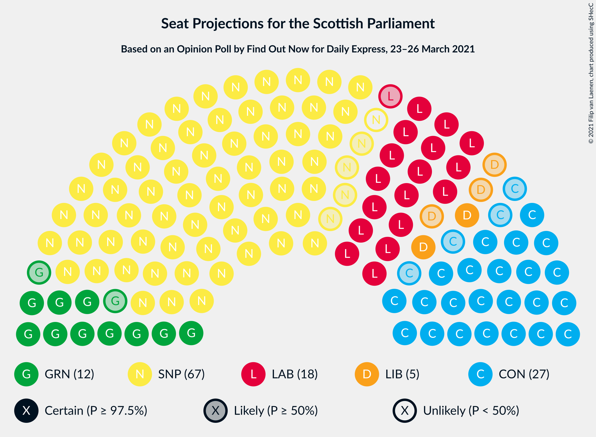
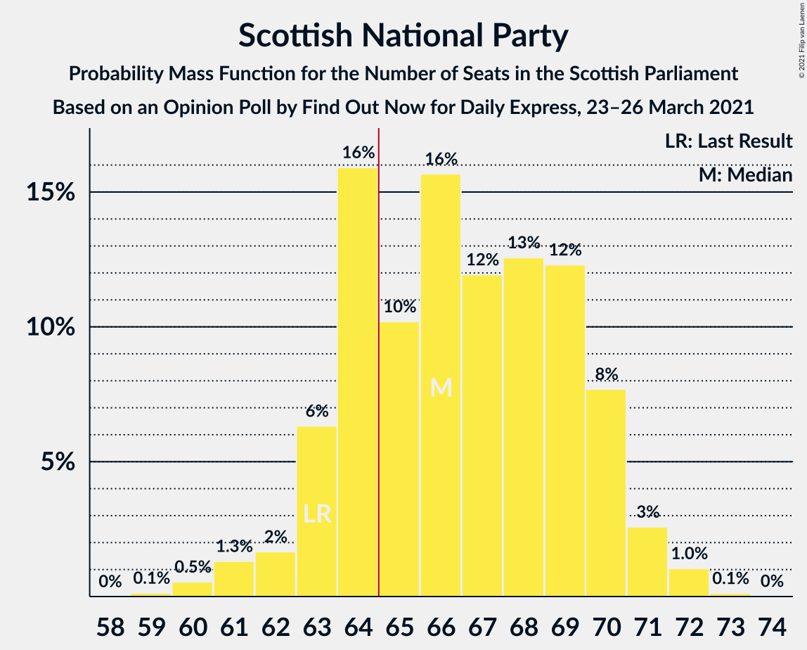
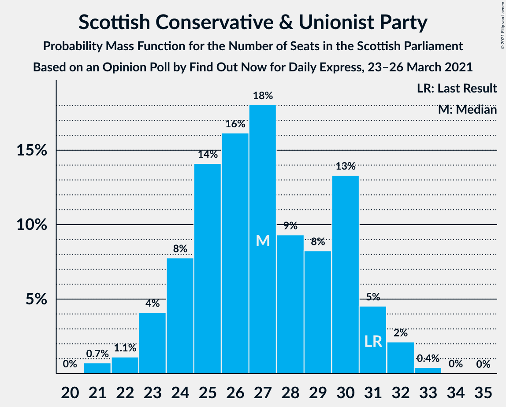
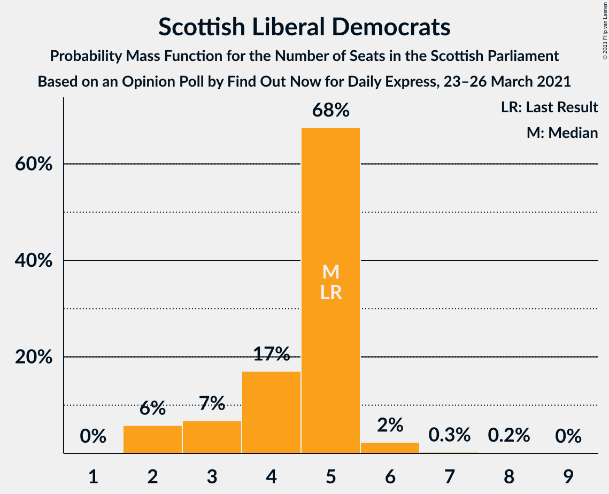
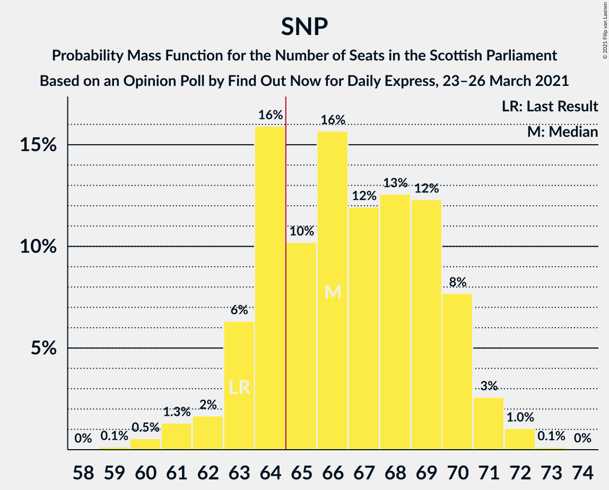

# Opinion Poll by Find Out Now for Daily Express, 23–26 March 2021

<a href="#voting-intentions">Voting Intentions</a> | <a href="#seats">Seats</a> | <a href="#coalitions">Coalitions</a> | <a href="#technical-information">Technical Information</a>

## Voting Intentions

### Confidence Intervals

| Party | Last Result | Poll Result | 80% Confidence Interval | 90% Confidence Interval | 95% Confidence Interval | 99% Confidence Interval |
|:-----:|:-----------:|:-----------:|:-----------------------:|:-----------------------:|:-----------------------:|:-----------------------:|
| Scottish National Party | 41.7% | 42.5% | 40.5–44.5% |39.9–45.0% |39.5–45.5% |38.5–46.5% |
| Scottish Conservative & Unionist Party | 22.9% | 21.2% | 19.7–23.0% |19.2–23.4% |18.8–23.9% |18.1–24.7% |
| Scottish Labour | 19.1% | 16.1% | 14.7–17.7% |14.3–18.2% |14.0–18.5% |13.4–19.3% |
| Scottish Greens | 6.6% | 11.2% | 10.0–12.5% |9.6–12.9% |9.4–13.2% |8.8–13.9% |
| Scottish Liberal Democrats | 5.2% | 5.1% | 4.3–6.1% |4.1–6.4% |3.9–6.6% |3.6–7.1% |
| Reform UK | 0.0% | 2.1% | 1.6–2.8% |1.4–3.0% |1.3–3.1% |1.1–3.5% |

*Note:* The poll result column reflects the actual value used in the calculations. Published results may vary slightly, and in addition be rounded to fewer digits.

## Seats

### Confidence Intervals

| Party | Last Result | Median | 80% Confidence Interval | 90% Confidence Interval | 95% Confidence Interval | 99% Confidence Interval |
|:-----:|:-----------:|:------:|:-----------------------:|:-----------------------:|:-----------------------:|:-----------------------:|
| <a href="#scottish-national-party">Scottish National Party</a> | 63 | 66 | 64–70 |63–70 |62–71 |60–72 |
| <a href="#scottish-conservative-&-unionist-party">Scottish Conservative & Unionist Party</a> | 31 | 27 | 24–30 |23–31 |23–32 |21–32 |
| <a href="#scottish-labour">Scottish Labour</a> | 24 | 18 | 17–22 |17–23 |17–23 |17–25 |
| <a href="#scottish-greens">Scottish Greens</a> | 6 | 12 | 11–14 |10–14 |10–15 |10–15 |
| <a href="#scottish-liberal-democrats">Scottish Liberal Democrats</a> | 5 | 5 | 3–5 |2–5 |2–6 |2–6 |
| <a href="#reform-uk">Reform UK</a> | 0 | 0 | 0 |0 |0 |0 |

### Scottish National Party

*For a full overview of the results for this party, see the [Scottish National Party](party-scottishnationalparty.html) page.*

| Number of Seats | Probability | Accumulated | Special Marks |
|:---------------:|:-----------:|:-----------:|:-------------:|
| 59 | 0.1% | 100% |  |
| 60 | 0.5% | 99.9% |  |
| 61 | 1.3% | 99.3% |  |
| 62 | 2% | 98% |  |
| 63 | 6% | 96% | Last Result |
| 64 | 16% | 90% |  |
| 65 | 10% | 74% | Majority |
| 66 | 16% | 64% | Median |
| 67 | 12% | 48% |  |
| 68 | 13% | 36% |  |
| 69 | 12% | 24% |  |
| 70 | 8% | 11% |  |
| 71 | 3% | 4% |  |
| 72 | 1.0% | 1.2% |  |
| 73 | 0.1% | 0.1% |  |
| 74 | 0% | 0% |  |

### Scottish Conservative & Unionist Party

*For a full overview of the results for this party, see the [Scottish Conservative & Unionist Party](party-scottishconservativeunionistparty.html) page.*

| Number of Seats | Probability | Accumulated | Special Marks |
|:---------------:|:-----------:|:-----------:|:-------------:|
| 21 | 0.7% | 100% |  |
| 22 | 1.1% | 99.2% |  |
| 23 | 4% | 98% |  |
| 24 | 8% | 94% |  |
| 25 | 14% | 86% |  |
| 26 | 16% | 72% |  |
| 27 | 18% | 56% | Median |
| 28 | 9% | 38% |  |
| 29 | 8% | 29% |  |
| 30 | 13% | 20% |  |
| 31 | 5% | 7% | Last Result |
| 32 | 2% | 3% |  |
| 33 | 0.4% | 0.5% |  |
| 34 | 0% | 0.1% |  |
| 35 | 0% | 0% |  |

### Scottish Labour

*For a full overview of the results for this party, see the [Scottish Labour](party-scottishlabour.html) page.*

| Number of Seats | Probability | Accumulated | Special Marks |
|:---------------:|:-----------:|:-----------:|:-------------:|
| 15 | 0.1% | 100% |  |
| 16 | 0.2% | 99.9% |  |
| 17 | 30% | 99.8% |  |
| 18 | 24% | 70% | Median |
| 19 | 16% | 47% |  |
| 20 | 10% | 31% |  |
| 21 | 8% | 21% |  |
| 22 | 6% | 13% |  |
| 23 | 5% | 7% |  |
| 24 | 2% | 2% | Last Result |
| 25 | 0.6% | 0.7% |  |
| 26 | 0% | 0% |  |

### Scottish Greens

*For a full overview of the results for this party, see the [Scottish Greens](party-scottishgreens.html) page.*

| Number of Seats | Probability | Accumulated | Special Marks |
|:---------------:|:-----------:|:-----------:|:-------------:|
| 6 | 0% | 100% | Last Result |
| 7 | 0% | 100% |  |
| 8 | 0% | 100% |  |
| 9 | 0% | 100% |  |
| 10 | 7% | 100% |  |
| 11 | 27% | 93% |  |
| 12 | 33% | 65% | Median |
| 13 | 21% | 32% |  |
| 14 | 7% | 11% |  |
| 15 | 3% | 3% |  |
| 16 | 0.2% | 0.4% |  |
| 17 | 0.1% | 0.2% |  |
| 18 | 0.1% | 0.1% |  |
| 19 | 0% | 0% |  |

### Scottish Liberal Democrats

*For a full overview of the results for this party, see the [Scottish Liberal Democrats](party-scottishliberaldemocrats.html) page.*

| Number of Seats | Probability | Accumulated | Special Marks |
|:---------------:|:-----------:|:-----------:|:-------------:|
| 2 | 6% | 100% |  |
| 3 | 7% | 94% |  |
| 4 | 17% | 87% |  |
| 5 | 68% | 70% | Last Result, Median |
| 6 | 2% | 3% |  |
| 7 | 0.3% | 0.5% |  |
| 8 | 0.2% | 0.2% |  |
| 9 | 0% | 0% |  |

### Reform UK

*For a full overview of the results for this party, see the [Reform UK](party-reformuk.html) page.*

| Number of Seats | Probability | Accumulated | Special Marks |
|:---------------:|:-----------:|:-----------:|:-------------:|
| 0 | 100% | 100% | Last Result, Median |

## Coalitions

### Confidence Intervals

| Coalition | Last Result | Median | Majority? | 80% Confidence Interval | 90% Confidence Interval | 95% Confidence Interval | 99% Confidence Interval |
|:---------:|:-----------:|:------:|:---------:|:-----------------------:|:-----------------------:|:-----------------------:|:-----------------------:|
| Scottish National Party – Scottish Greens | 69 | 78 | 100% | 75–82 | 75–83 | 74–83 | 72–84 |
| Scottish National Party | 63 | 66 | 74% | 64–70 | 63–70 | 62–71 | 60–72 |
| Scottish Conservative & Unionist Party – Scottish Labour – Scottish Liberal Democrats | 60 | 51 | 0% | 47–54 | 46–54 | 46–55 | 45–57 |
| Scottish Conservative & Unionist Party – Scottish Labour | 55 | 46 | 0% | 43–49 | 42–50 | 41–50 | 40–52 |
| Scottish Labour – Scottish Greens – Scottish Liberal Democrats | 35 | 35 | 0% | 33–39 | 32–40 | 32–40 | 30–42 |
| Scottish Conservative & Unionist Party – Scottish Liberal Democrats | 36 | 32 | 0% | 28–35 | 28–36 | 27–36 | 25–37 |
| Scottish Labour – Scottish Liberal Democrats | 29 | 23 | 0% | 22–27 | 21–27 | 20–28 | 19–29 |

### Scottish National Party – Scottish Greens

| Number of Seats | Probability | Accumulated | Special Marks |
|:---------------:|:-----------:|:-----------:|:-------------:|
| 69 | 0% | 100% | Last Result |
| 70 | 0.1% | 100% |  |
| 71 | 0.2% | 99.9% |  |
| 72 | 0.5% | 99.7% |  |
| 73 | 0.9% | 99.2% |  |
| 74 | 2% | 98% |  |
| 75 | 8% | 96% |  |
| 76 | 9% | 89% |  |
| 77 | 16% | 79% |  |
| 78 | 15% | 63% | Median |
| 79 | 12% | 48% |  |
| 80 | 15% | 37% |  |
| 81 | 9% | 22% |  |
| 82 | 7% | 12% |  |
| 83 | 3% | 5% |  |
| 84 | 2% | 2% |  |
| 85 | 0.3% | 0.4% |  |
| 86 | 0.1% | 0.1% |  |
| 87 | 0% | 0% |  |

### Scottish National Party

| Number of Seats | Probability | Accumulated | Special Marks |
|:---------------:|:-----------:|:-----------:|:-------------:|
| 59 | 0.1% | 100% |  |
| 60 | 0.5% | 99.9% |  |
| 61 | 1.3% | 99.3% |  |
| 62 | 2% | 98% |  |
| 63 | 6% | 96% | Last Result |
| 64 | 16% | 90% |  |
| 65 | 10% | 74% | Majority |
| 66 | 16% | 64% | Median |
| 67 | 12% | 48% |  |
| 68 | 13% | 36% |  |
| 69 | 12% | 24% |  |
| 70 | 8% | 11% |  |
| 71 | 3% | 4% |  |
| 72 | 1.0% | 1.2% |  |
| 73 | 0.1% | 0.1% |  |
| 74 | 0% | 0% |  |

### Scottish Conservative & Unionist Party – Scottish Labour – Scottish Liberal Democrats

| Number of Seats | Probability | Accumulated | Special Marks |
|:---------------:|:-----------:|:-----------:|:-------------:|
| 43 | 0.1% | 100% |  |
| 44 | 0.3% | 99.9% |  |
| 45 | 2% | 99.6% |  |
| 46 | 3% | 98% |  |
| 47 | 7% | 95% |  |
| 48 | 9% | 88% |  |
| 49 | 15% | 78% |  |
| 50 | 12% | 63% | Median |
| 51 | 15% | 52% |  |
| 52 | 16% | 37% |  |
| 53 | 9% | 21% |  |
| 54 | 8% | 11% |  |
| 55 | 2% | 4% |  |
| 56 | 0.9% | 2% |  |
| 57 | 0.5% | 0.8% |  |
| 58 | 0.2% | 0.3% |  |
| 59 | 0.1% | 0.1% |  |
| 60 | 0% | 0% | Last Result |

### Scottish Conservative & Unionist Party – Scottish Labour

| Number of Seats | Probability | Accumulated | Special Marks |
|:---------------:|:-----------:|:-----------:|:-------------:|
| 39 | 0.1% | 100% |  |
| 40 | 0.8% | 99.9% |  |
| 41 | 2% | 99.1% |  |
| 42 | 5% | 97% |  |
| 43 | 9% | 92% |  |
| 44 | 12% | 83% |  |
| 45 | 13% | 71% | Median |
| 46 | 14% | 58% |  |
| 47 | 18% | 44% |  |
| 48 | 12% | 26% |  |
| 49 | 8% | 14% |  |
| 50 | 4% | 6% |  |
| 51 | 1.0% | 2% |  |
| 52 | 0.7% | 1.1% |  |
| 53 | 0.3% | 0.4% |  |
| 54 | 0.1% | 0.2% |  |
| 55 | 0% | 0% | Last Result |

### Scottish Labour – Scottish Greens – Scottish Liberal Democrats

| Number of Seats | Probability | Accumulated | Special Marks |
|:---------------:|:-----------:|:-----------:|:-------------:|
| 29 | 0.1% | 100% |  |
| 30 | 0.6% | 99.9% |  |
| 31 | 1.4% | 99.3% |  |
| 32 | 4% | 98% |  |
| 33 | 10% | 94% |  |
| 34 | 17% | 84% |  |
| 35 | 25% | 67% | Last Result, Median |
| 36 | 13% | 42% |  |
| 37 | 10% | 29% |  |
| 38 | 8% | 19% |  |
| 39 | 6% | 11% |  |
| 40 | 3% | 5% |  |
| 41 | 1.3% | 2% |  |
| 42 | 0.5% | 0.8% |  |
| 43 | 0.2% | 0.3% |  |
| 44 | 0.1% | 0.1% |  |
| 45 | 0% | 0% |  |

### Scottish Conservative & Unionist Party – Scottish Liberal Democrats

| Number of Seats | Probability | Accumulated | Special Marks |
|:---------------:|:-----------:|:-----------:|:-------------:|
| 24 | 0.1% | 100% |  |
| 25 | 0.5% | 99.9% |  |
| 26 | 2% | 99.4% |  |
| 27 | 2% | 98% |  |
| 28 | 6% | 95% |  |
| 29 | 11% | 89% |  |
| 30 | 12% | 78% |  |
| 31 | 14% | 66% |  |
| 32 | 17% | 51% | Median |
| 33 | 10% | 34% |  |
| 34 | 8% | 24% |  |
| 35 | 10% | 16% |  |
| 36 | 4% | 6% | Last Result |
| 37 | 2% | 2% |  |
| 38 | 0.3% | 0.4% |  |
| 39 | 0% | 0% |  |

### Scottish Labour – Scottish Liberal Democrats

| Number of Seats | Probability | Accumulated | Special Marks |
|:---------------:|:-----------:|:-----------:|:-------------:|
| 19 | 1.2% | 100% |  |
| 20 | 2% | 98.8% |  |
| 21 | 5% | 96% |  |
| 22 | 28% | 91% |  |
| 23 | 24% | 63% | Median |
| 24 | 16% | 39% |  |
| 25 | 7% | 23% |  |
| 26 | 6% | 17% |  |
| 27 | 5% | 10% |  |
| 28 | 3% | 5% |  |
| 29 | 1.1% | 2% | Last Result |
| 30 | 0.4% | 0.5% |  |
| 31 | 0% | 0% |  |

## Technical Information

### Opinion Poll

+ **Polling firm:** Find Out Now
+ **Commissioner(s):** Daily Express
+ **Fieldwork period:** 23–26 March 2021

### Calculations

+ **Sample size:** 1022
+ **Simulations done:** 1,048,576
+ **Error estimate:** 0.85%

