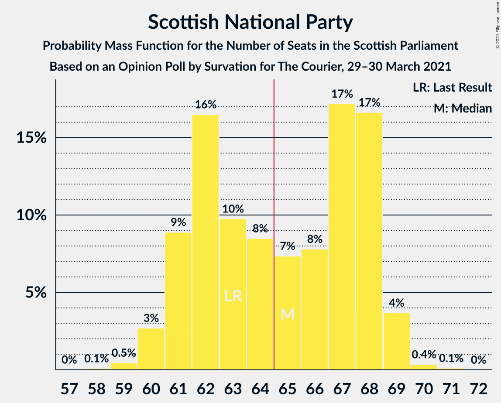
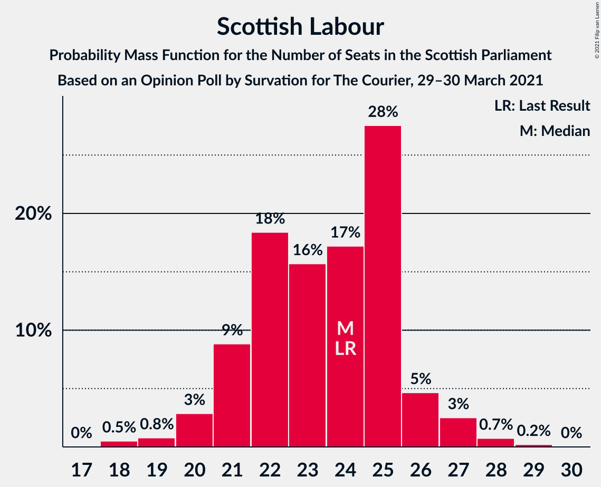
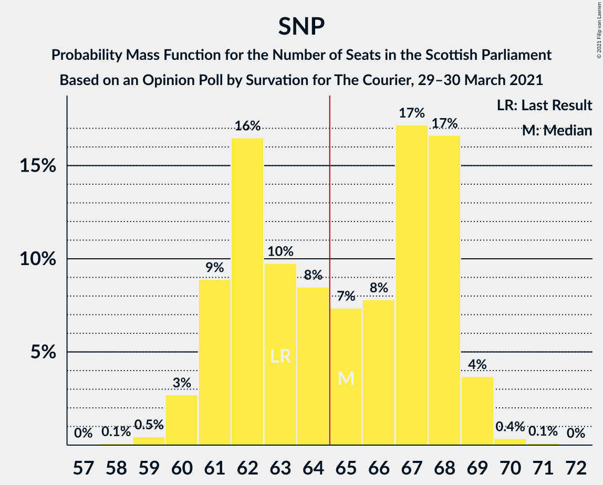
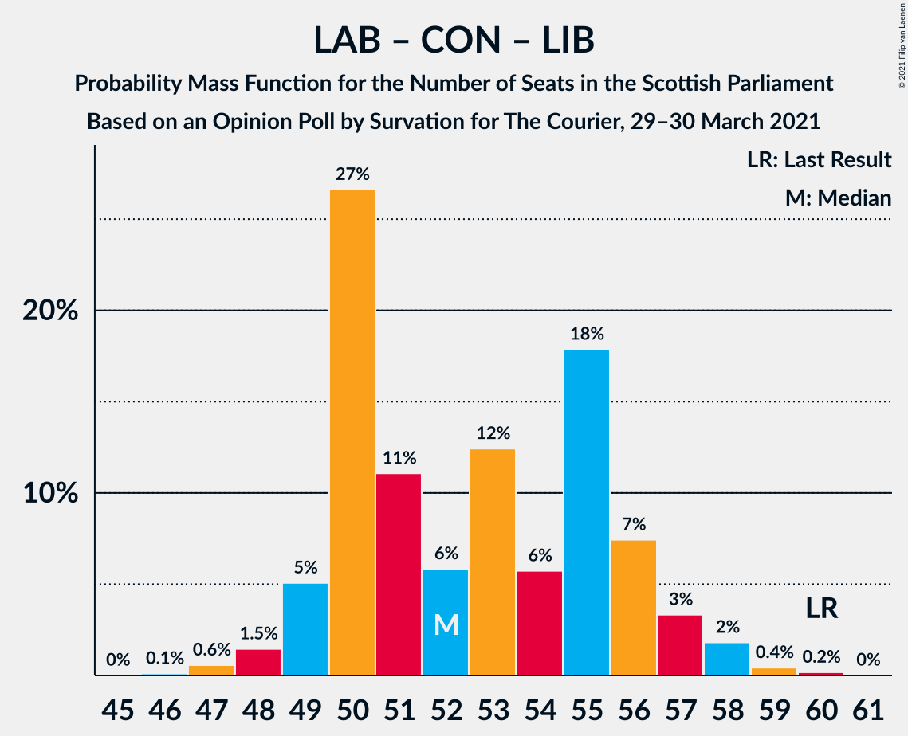

# Opinion Poll by Survation for The Courier, 29–30 March 2021

<a href="#voting-intentions">Voting Intentions</a> | <a href="#seats">Seats</a> | <a href="#coalitions">Coalitions</a> | <a href="#technical-information">Technical Information</a>

## Voting Intentions

### Confidence Intervals

| Party | Last Result | Poll Result | 80% Confidence Interval | 90% Confidence Interval | 95% Confidence Interval | 99% Confidence Interval |
|:-----:|:-----------:|:-----------:|:-----------------------:|:-----------------------:|:-----------------------:|:-----------------------:|
| Scottish National Party | 41.7% | 37.0% | 35.1–39.0% |34.5–39.6% |34.0–40.0% |33.2–41.0% |
| Scottish Labour | 19.1% | 19.0% | 17.5–20.7% |17.1–21.1% |16.7–21.6% |16.0–22.4% |
| Scottish Conservative & Unionist Party | 22.9% | 18.0% | 16.5–19.6% |16.1–20.1% |15.7–20.5% |15.0–21.3% |
| Scottish Greens | 6.6% | 11.0% | 9.8–12.4% |9.5–12.8% |9.2–13.1% |8.7–13.8% |
| Scottish Liberal Democrats | 5.2% | 8.0% | 7.0–9.2% |6.7–9.6% |6.5–9.9% |6.0–10.5% |
| Alba Party | 0.0% | 3.0% | 2.4–3.8% |2.2–4.1% |2.1–4.3% |1.9–4.7% |

*Note:* The poll result column reflects the actual value used in the calculations. Published results may vary slightly, and in addition be rounded to fewer digits.

## Seats

### Confidence Intervals

| Party | Last Result | Median | 80% Confidence Interval | 90% Confidence Interval | 95% Confidence Interval | 99% Confidence Interval |
|:-----:|:-----------:|:------:|:-----------------------:|:-----------------------:|:-----------------------:|:-----------------------:|
| <a href="#scottish-national-party">Scottish National Party</a> | 63 | 62 | 59–66 |59–67 |58–68 |56–69 |
| <a href="#scottish-labour">Scottish Labour</a> | 24 | 24 | 22–26 |21–27 |21–27 |19–30 |
| <a href="#scottish-conservative-&-unionist-party">Scottish Conservative & Unionist Party</a> | 31 | 22 | 20–24 |19–25 |18–25 |17–27 |
| <a href="#scottish-greens">Scottish Greens</a> | 6 | 12 | 10–14 |10–14 |10–15 |10–15 |
| <a href="#scottish-liberal-democrats">Scottish Liberal Democrats</a> | 5 | 8 | 7–10 |6–11 |6–12 |5–12 |
| <a href="#alba-party">Alba Party</a> | 0 | 0 | 0 |0 |0 |0 |

### Scottish National Party

*For a full overview of the results for this party, see the [Scottish National Party](party-scottishnationalparty.html) page.*

| Number of Seats | Probability | Accumulated | Special Marks |
|:---------------:|:-----------:|:-----------:|:-------------:|
| 52 | 0% | 100% |  |
| 53 | 0.1% | 99.9% |  |
| 54 | 0.1% | 99.9% |  |
| 55 | 0.1% | 99.8% |  |
| 56 | 0.4% | 99.7% |  |
| 57 | 1.3% | 99.3% |  |
| 58 | 1.5% | 98% |  |
| 59 | 10% | 97% |  |
| 60 | 11% | 86% |  |
| 61 | 12% | 75% |  |
| 62 | 21% | 63% | Median |
| 63 | 21% | 43% | Last Result |
| 64 | 6% | 22% |  |
| 65 | 6% | 16% | Majority |
| 66 | 3% | 10% |  |
| 67 | 4% | 7% |  |
| 68 | 3% | 3% |  |
| 69 | 0.7% | 0.8% |  |
| 70 | 0% | 0.1% |  |
| 71 | 0% | 0% |  |

### Scottish Labour

*For a full overview of the results for this party, see the [Scottish Labour](party-scottishlabour.html) page.*

| Number of Seats | Probability | Accumulated | Special Marks |
|:---------------:|:-----------:|:-----------:|:-------------:|
| 18 | 0.2% | 100% |  |
| 19 | 0.7% | 99.8% |  |
| 20 | 1.0% | 99.1% |  |
| 21 | 4% | 98% |  |
| 22 | 9% | 94% |  |
| 23 | 22% | 85% |  |
| 24 | 27% | 63% | Last Result, Median |
| 25 | 21% | 36% |  |
| 26 | 9% | 15% |  |
| 27 | 3% | 5% |  |
| 28 | 0.9% | 2% |  |
| 29 | 0.6% | 1.1% |  |
| 30 | 0.3% | 0.5% |  |
| 31 | 0.1% | 0.2% |  |
| 32 | 0% | 0.1% |  |
| 33 | 0% | 0% |  |

### Scottish Conservative & Unionist Party

*For a full overview of the results for this party, see the [Scottish Conservative & Unionist Party](party-scottishconservativeunionistparty.html) page.*

| Number of Seats | Probability | Accumulated | Special Marks |
|:---------------:|:-----------:|:-----------:|:-------------:|
| 16 | 0.1% | 100% |  |
| 17 | 0.7% | 99.9% |  |
| 18 | 3% | 99.2% |  |
| 19 | 5% | 97% |  |
| 20 | 13% | 91% |  |
| 21 | 14% | 79% |  |
| 22 | 19% | 65% | Median |
| 23 | 15% | 45% |  |
| 24 | 23% | 31% |  |
| 25 | 6% | 8% |  |
| 26 | 2% | 2% |  |
| 27 | 0.4% | 0.6% |  |
| 28 | 0.1% | 0.1% |  |
| 29 | 0% | 0% |  |
| 30 | 0% | 0% |  |
| 31 | 0% | 0% | Last Result |

### Scottish Greens

*For a full overview of the results for this party, see the [Scottish Greens](party-scottishgreens.html) page.*

| Number of Seats | Probability | Accumulated | Special Marks |
|:---------------:|:-----------:|:-----------:|:-------------:|
| 6 | 0% | 100% | Last Result |
| 7 | 0% | 100% |  |
| 8 | 0% | 100% |  |
| 9 | 0% | 100% |  |
| 10 | 15% | 100% |  |
| 11 | 15% | 85% |  |
| 12 | 25% | 71% | Median |
| 13 | 34% | 45% |  |
| 14 | 8% | 11% |  |
| 15 | 2% | 3% |  |
| 16 | 0.4% | 0.5% |  |
| 17 | 0.1% | 0.1% |  |
| 18 | 0% | 0% |  |

### Scottish Liberal Democrats

*For a full overview of the results for this party, see the [Scottish Liberal Democrats](party-scottishliberaldemocrats.html) page.*

| Number of Seats | Probability | Accumulated | Special Marks |
|:---------------:|:-----------:|:-----------:|:-------------:|
| 4 | 0.2% | 100% |  |
| 5 | 2% | 99.8% | Last Result |
| 6 | 5% | 98% |  |
| 7 | 12% | 93% |  |
| 8 | 41% | 81% | Median |
| 9 | 17% | 40% |  |
| 10 | 13% | 23% |  |
| 11 | 6% | 10% |  |
| 12 | 3% | 3% |  |
| 13 | 0.3% | 0.3% |  |
| 14 | 0% | 0% |  |

### Alba Party

*For a full overview of the results for this party, see the [Alba Party](party-albaparty.html) page.*

| Number of Seats | Probability | Accumulated | Special Marks |
|:---------------:|:-----------:|:-----------:|:-------------:|
| 0 | 99.6% | 100% | Last Result, Median |
| 1 | 0.3% | 0.4% |  |
| 2 | 0.1% | 0.1% |  |
| 3 | 0% | 0.1% |  |
| 4 | 0% | 0% |  |

## Coalitions

### Confidence Intervals

| Coalition | Last Result | Median | Majority? | 80% Confidence Interval | 90% Confidence Interval | 95% Confidence Interval | 99% Confidence Interval |
|:---------:|:-----------:|:------:|:---------:|:-----------------------:|:-----------------------:|:-----------------------:|:-----------------------:|
| Scottish National Party – Scottish Greens – Alba Party | 69 | 74 | 99.9% | 71–78 | 71–79 | 70–79 | 68–81 |
| Scottish National Party – Scottish Greens | 69 | 74 | 99.9% | 71–78 | 71–79 | 70–79 | 68–81 |
| Scottish National Party – Alba Party | 63 | 62 | 16% | 59–66 | 59–67 | 58–68 | 56–69 |
| Scottish National Party | 63 | 62 | 16% | 59–66 | 59–67 | 58–68 | 56–69 |
| Scottish Labour – Scottish Conservative & Unionist Party – Scottish Liberal Democrats | 60 | 55 | 0.1% | 51–58 | 50–58 | 50–59 | 48–61 |
| Scottish Labour – Scottish Conservative & Unionist Party | 55 | 46 | 0% | 43–49 | 42–50 | 41–51 | 40–52 |
| Scottish Labour – Scottish Greens – Scottish Liberal Democrats | 35 | 45 | 0% | 42–47 | 42–48 | 41–49 | 39–51 |
| Scottish Labour – Scottish Liberal Democrats | 29 | 33 | 0% | 30–35 | 30–36 | 29–36 | 27–39 |
| Scottish Conservative & Unionist Party – Scottish Liberal Democrats | 36 | 31 | 0% | 28–34 | 27–34 | 26–35 | 25–36 |

### Scottish National Party – Scottish Greens – Alba Party

| Number of Seats | Probability | Accumulated | Special Marks |
|:---------------:|:-----------:|:-----------:|:-------------:|
| 64 | 0% | 100% |  |
| 65 | 0% | 99.9% | Majority |
| 66 | 0.1% | 99.9% |  |
| 67 | 0.2% | 99.8% |  |
| 68 | 0.5% | 99.6% |  |
| 69 | 2% | 99.1% | Last Result |
| 70 | 3% | 98% |  |
| 71 | 5% | 95% |  |
| 72 | 15% | 90% |  |
| 73 | 12% | 75% |  |
| 74 | 17% | 63% | Median |
| 75 | 15% | 46% |  |
| 76 | 14% | 31% |  |
| 77 | 6% | 17% |  |
| 78 | 3% | 11% |  |
| 79 | 6% | 8% |  |
| 80 | 1.2% | 2% |  |
| 81 | 0.5% | 0.8% |  |
| 82 | 0.3% | 0.3% |  |
| 83 | 0% | 0% |  |

### Scottish National Party – Scottish Greens

| Number of Seats | Probability | Accumulated | Special Marks |
|:---------------:|:-----------:|:-----------:|:-------------:|
| 64 | 0% | 100% |  |
| 65 | 0.1% | 99.9% | Majority |
| 66 | 0.1% | 99.9% |  |
| 67 | 0.2% | 99.8% |  |
| 68 | 0.5% | 99.6% |  |
| 69 | 2% | 99.1% | Last Result |
| 70 | 3% | 98% |  |
| 71 | 5% | 95% |  |
| 72 | 15% | 90% |  |
| 73 | 12% | 75% |  |
| 74 | 17% | 63% | Median |
| 75 | 15% | 46% |  |
| 76 | 14% | 31% |  |
| 77 | 6% | 17% |  |
| 78 | 3% | 11% |  |
| 79 | 6% | 8% |  |
| 80 | 1.1% | 2% |  |
| 81 | 0.5% | 0.8% |  |
| 82 | 0.3% | 0.3% |  |
| 83 | 0% | 0% |  |

### Scottish National Party – Alba Party

| Number of Seats | Probability | Accumulated | Special Marks |
|:---------------:|:-----------:|:-----------:|:-------------:|
| 52 | 0% | 100% |  |
| 53 | 0.1% | 99.9% |  |
| 54 | 0.1% | 99.9% |  |
| 55 | 0.1% | 99.8% |  |
| 56 | 0.4% | 99.7% |  |
| 57 | 1.3% | 99.3% |  |
| 58 | 1.5% | 98% |  |
| 59 | 10% | 97% |  |
| 60 | 11% | 86% |  |
| 61 | 12% | 75% |  |
| 62 | 21% | 64% | Median |
| 63 | 21% | 43% | Last Result |
| 64 | 6% | 22% |  |
| 65 | 6% | 16% | Majority |
| 66 | 3% | 10% |  |
| 67 | 4% | 7% |  |
| 68 | 3% | 3% |  |
| 69 | 0.7% | 0.8% |  |
| 70 | 0% | 0.1% |  |
| 71 | 0% | 0% |  |

### Scottish National Party

| Number of Seats | Probability | Accumulated | Special Marks |
|:---------------:|:-----------:|:-----------:|:-------------:|
| 52 | 0% | 100% |  |
| 53 | 0.1% | 99.9% |  |
| 54 | 0.1% | 99.9% |  |
| 55 | 0.1% | 99.8% |  |
| 56 | 0.4% | 99.7% |  |
| 57 | 1.3% | 99.3% |  |
| 58 | 1.5% | 98% |  |
| 59 | 10% | 97% |  |
| 60 | 11% | 86% |  |
| 61 | 12% | 75% |  |
| 62 | 21% | 63% | Median |
| 63 | 21% | 43% | Last Result |
| 64 | 6% | 22% |  |
| 65 | 6% | 16% | Majority |
| 66 | 3% | 10% |  |
| 67 | 4% | 7% |  |
| 68 | 3% | 3% |  |
| 69 | 0.7% | 0.8% |  |
| 70 | 0% | 0.1% |  |
| 71 | 0% | 0% |  |

### Scottish Labour – Scottish Conservative & Unionist Party – Scottish Liberal Democrats

| Number of Seats | Probability | Accumulated | Special Marks |
|:---------------:|:-----------:|:-----------:|:-------------:|
| 47 | 0.3% | 100% |  |
| 48 | 0.5% | 99.7% |  |
| 49 | 1.2% | 99.2% |  |
| 50 | 6% | 98% |  |
| 51 | 3% | 92% |  |
| 52 | 6% | 89% |  |
| 53 | 14% | 83% |  |
| 54 | 15% | 69% | Median |
| 55 | 17% | 54% |  |
| 56 | 12% | 37% |  |
| 57 | 15% | 25% |  |
| 58 | 5% | 10% |  |
| 59 | 3% | 5% |  |
| 60 | 2% | 2% | Last Result |
| 61 | 0.5% | 0.9% |  |
| 62 | 0.2% | 0.4% |  |
| 63 | 0.1% | 0.2% |  |
| 64 | 0% | 0.1% |  |
| 65 | 0% | 0.1% | Majority |
| 66 | 0% | 0% |  |

### Scottish Labour – Scottish Conservative & Unionist Party

| Number of Seats | Probability | Accumulated | Special Marks |
|:---------------:|:-----------:|:-----------:|:-------------:|
| 38 | 0.1% | 100% |  |
| 39 | 0.3% | 99.9% |  |
| 40 | 2% | 99.6% |  |
| 41 | 2% | 98% |  |
| 42 | 3% | 96% |  |
| 43 | 6% | 93% |  |
| 44 | 9% | 86% |  |
| 45 | 16% | 78% |  |
| 46 | 15% | 62% | Median |
| 47 | 17% | 47% |  |
| 48 | 17% | 31% |  |
| 49 | 7% | 14% |  |
| 50 | 4% | 7% |  |
| 51 | 2% | 3% |  |
| 52 | 0.6% | 1.1% |  |
| 53 | 0.2% | 0.5% |  |
| 54 | 0.1% | 0.2% |  |
| 55 | 0.1% | 0.1% | Last Result |
| 56 | 0% | 0% |  |

### Scottish Labour – Scottish Greens – Scottish Liberal Democrats

| Number of Seats | Probability | Accumulated | Special Marks |
|:---------------:|:-----------:|:-----------:|:-------------:|
| 35 | 0% | 100% | Last Result |
| 36 | 0% | 100% |  |
| 37 | 0.1% | 100% |  |
| 38 | 0.2% | 99.9% |  |
| 39 | 0.5% | 99.7% |  |
| 40 | 1.0% | 99.2% |  |
| 41 | 3% | 98% |  |
| 42 | 9% | 95% |  |
| 43 | 14% | 86% |  |
| 44 | 20% | 72% | Median |
| 45 | 18% | 52% |  |
| 46 | 21% | 34% |  |
| 47 | 5% | 13% |  |
| 48 | 3% | 7% |  |
| 49 | 2% | 4% |  |
| 50 | 0.6% | 1.5% |  |
| 51 | 0.4% | 0.8% |  |
| 52 | 0.2% | 0.4% |  |
| 53 | 0.1% | 0.2% |  |
| 54 | 0.1% | 0.1% |  |
| 55 | 0% | 0% |  |

### Scottish Labour – Scottish Liberal Democrats

| Number of Seats | Probability | Accumulated | Special Marks |
|:---------------:|:-----------:|:-----------:|:-------------:|
| 25 | 0% | 100% |  |
| 26 | 0.3% | 99.9% |  |
| 27 | 0.5% | 99.6% |  |
| 28 | 0.9% | 99.1% |  |
| 29 | 3% | 98% | Last Result |
| 30 | 7% | 95% |  |
| 31 | 18% | 88% |  |
| 32 | 19% | 70% | Median |
| 33 | 28% | 51% |  |
| 34 | 11% | 23% |  |
| 35 | 7% | 12% |  |
| 36 | 3% | 5% |  |
| 37 | 1.2% | 2% |  |
| 38 | 0.5% | 1.2% |  |
| 39 | 0.5% | 0.7% |  |
| 40 | 0.1% | 0.3% |  |
| 41 | 0.1% | 0.1% |  |
| 42 | 0% | 0.1% |  |
| 43 | 0% | 0% |  |

### Scottish Conservative & Unionist Party – Scottish Liberal Democrats

| Number of Seats | Probability | Accumulated | Special Marks |
|:---------------:|:-----------:|:-----------:|:-------------:|
| 23 | 0% | 100% |  |
| 24 | 0.2% | 99.9% |  |
| 25 | 2% | 99.7% |  |
| 26 | 2% | 98% |  |
| 27 | 3% | 95% |  |
| 28 | 11% | 92% |  |
| 29 | 10% | 81% |  |
| 30 | 17% | 71% | Median |
| 31 | 18% | 54% |  |
| 32 | 14% | 36% |  |
| 33 | 11% | 22% |  |
| 34 | 8% | 11% |  |
| 35 | 2% | 3% |  |
| 36 | 0.6% | 0.8% | Last Result |
| 37 | 0.2% | 0.3% |  |
| 38 | 0.1% | 0.1% |  |
| 39 | 0% | 0% |  |

## Technical Information

### Opinion Poll

+ **Polling firm:** Survation
+ **Commissioner(s):** The Courier
+ **Fieldwork period:** 29–30 March 2021

### Calculations

+ **Sample size:** 1000
+ **Simulations done:** 524,288
+ **Error estimate:** 0.49%

