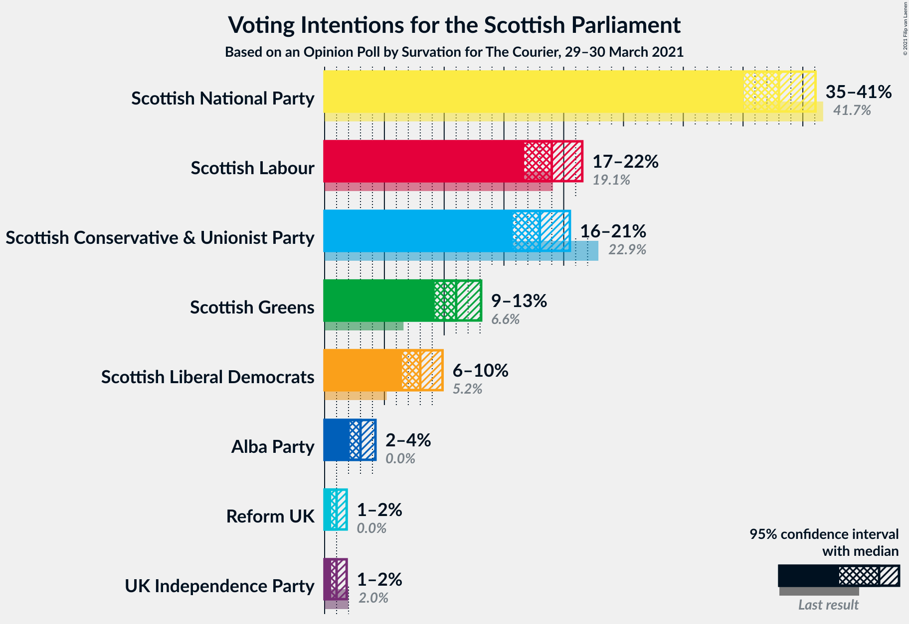
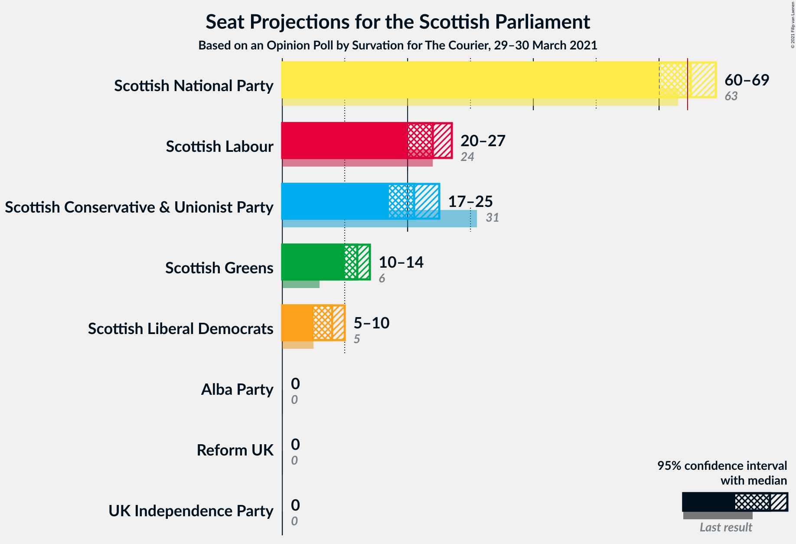
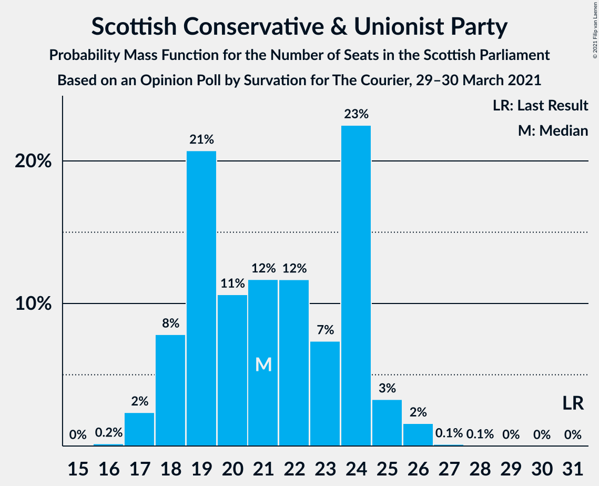
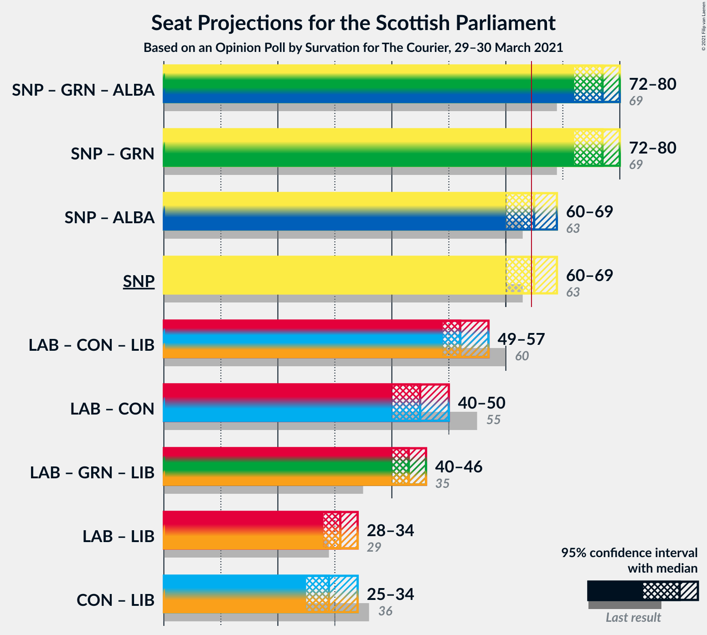

# Opinion Poll by Survation for The Courier, 29–30 March 2021

<a href="#voting-intentions">Voting Intentions</a> | <a href="#seats">Seats</a> | <a href="#coalitions">Coalitions</a> | <a href="#technical-information">Technical Information</a>

## Voting Intentions

### Confidence Intervals

| Party | Last Result | Poll Result | 80% Confidence Interval | 90% Confidence Interval | 95% Confidence Interval | 99% Confidence Interval |
|:-----:|:-----------:|:-----------:|:-----------------------:|:-----------------------:|:-----------------------:|:-----------------------:|
| Scottish National Party | 41.7% | 37.0% | 35.1–39.0% |34.5–39.6% |34.0–40.0% |33.2–41.0% |
| Scottish Labour | 19.1% | 19.0% | 17.5–20.7% |17.1–21.1% |16.7–21.6% |16.0–22.4% |
| Scottish Conservative & Unionist Party | 22.9% | 18.0% | 16.5–19.6% |16.1–20.1% |15.7–20.5% |15.0–21.3% |
| Scottish Greens | 6.6% | 11.0% | 9.8–12.4% |9.5–12.8% |9.2–13.1% |8.7–13.8% |
| Scottish Liberal Democrats | 5.2% | 8.0% | 7.0–9.2% |6.7–9.6% |6.5–9.9% |6.0–10.5% |
| Alba Party | 0.0% | 3.0% | 2.4–3.8% |2.2–4.1% |2.1–4.3% |1.9–4.7% |

*Note:* The poll result column reflects the actual value used in the calculations. Published results may vary slightly, and in addition be rounded to fewer digits.

## Seats

### Confidence Intervals

| Party | Last Result | Median | 80% Confidence Interval | 90% Confidence Interval | 95% Confidence Interval | 99% Confidence Interval |
|:-----:|:-----------:|:------:|:-----------------------:|:-----------------------:|:-----------------------:|:-----------------------:|
| <a href="#scottish-national-party">Scottish National Party</a> | 63 | 64 | 61–68 |61–68 |60–69 |60–69 |
| <a href="#scottish-labour">Scottish Labour</a> | 24 | 23 | 21–25 |21–26 |20–27 |19–28 |
| <a href="#scottish-conservative-&-unionist-party">Scottish Conservative & Unionist Party</a> | 31 | 22 | 19–24 |18–24 |18–25 |17–26 |
| <a href="#scottish-greens">Scottish Greens</a> | 6 | 12 | 10–13 |10–14 |10–14 |10–15 |
| <a href="#scottish-liberal-democrats">Scottish Liberal Democrats</a> | 5 | 8 | 6–10 |6–10 |5–10 |4–11 |
| <a href="#alba-party">Alba Party</a> | 0 | 0 | 0 |0 |0 |0 |

### Scottish National Party

*For a full overview of the results for this party, see the [Scottish National Party](party-scottishnationalparty.html) page.*

| Number of Seats | Probability | Accumulated | Special Marks |
|:---------------:|:-----------:|:-----------:|:-------------:|
| 58 | 0.1% | 100% |  |
| 59 | 0.3% | 99.9% |  |
| 60 | 2% | 99.6% |  |
| 61 | 8% | 97% |  |
| 62 | 24% | 89% |  |
| 63 | 12% | 65% | Last Result |
| 64 | 6% | 54% | Median |
| 65 | 15% | 48% | Majority |
| 66 | 8% | 33% |  |
| 67 | 13% | 25% |  |
| 68 | 9% | 12% |  |
| 69 | 2% | 3% |  |
| 70 | 0.1% | 0.3% |  |
| 71 | 0.1% | 0.1% |  |
| 72 | 0% | 0% |  |

### Scottish Labour

*For a full overview of the results for this party, see the [Scottish Labour](party-scottishlabour.html) page.*

| Number of Seats | Probability | Accumulated | Special Marks |
|:---------------:|:-----------:|:-----------:|:-------------:|
| 18 | 0.3% | 100% |  |
| 19 | 1.4% | 99.7% |  |
| 20 | 2% | 98% |  |
| 21 | 10% | 96% |  |
| 22 | 15% | 86% |  |
| 23 | 23% | 71% | Median |
| 24 | 20% | 48% | Last Result |
| 25 | 20% | 28% |  |
| 26 | 6% | 8% |  |
| 27 | 2% | 3% |  |
| 28 | 0.5% | 0.8% |  |
| 29 | 0.2% | 0.3% |  |
| 30 | 0.1% | 0.1% |  |
| 31 | 0% | 0% |  |

### Scottish Conservative & Unionist Party

*For a full overview of the results for this party, see the [Scottish Conservative & Unionist Party](party-scottishconservativeunionistparty.html) page.*

| Number of Seats | Probability | Accumulated | Special Marks |
|:---------------:|:-----------:|:-----------:|:-------------:|
| 16 | 0.3% | 100% |  |
| 17 | 2% | 99.7% |  |
| 18 | 7% | 98% |  |
| 19 | 11% | 90% |  |
| 20 | 7% | 79% |  |
| 21 | 11% | 72% |  |
| 22 | 18% | 61% | Median |
| 23 | 14% | 43% |  |
| 24 | 24% | 28% |  |
| 25 | 3% | 4% |  |
| 26 | 1.4% | 2% |  |
| 27 | 0.2% | 0.3% |  |
| 28 | 0% | 0.1% |  |
| 29 | 0% | 0% |  |
| 30 | 0% | 0% |  |
| 31 | 0% | 0% | Last Result |

### Scottish Greens

*For a full overview of the results for this party, see the [Scottish Greens](party-scottishgreens.html) page.*

| Number of Seats | Probability | Accumulated | Special Marks |
|:---------------:|:-----------:|:-----------:|:-------------:|
| 6 | 0% | 100% | Last Result |
| 7 | 0% | 100% |  |
| 8 | 0% | 100% |  |
| 9 | 0% | 100% |  |
| 10 | 16% | 100% |  |
| 11 | 26% | 84% |  |
| 12 | 34% | 58% | Median |
| 13 | 16% | 24% |  |
| 14 | 7% | 8% |  |
| 15 | 0.5% | 0.6% |  |
| 16 | 0.1% | 0.1% |  |
| 17 | 0% | 0% |  |

### Scottish Liberal Democrats

*For a full overview of the results for this party, see the [Scottish Liberal Democrats](party-scottishliberaldemocrats.html) page.*

| Number of Seats | Probability | Accumulated | Special Marks |
|:---------------:|:-----------:|:-----------:|:-------------:|
| 4 | 0.6% | 100% |  |
| 5 | 3% | 99.4% | Last Result |
| 6 | 11% | 96% |  |
| 7 | 22% | 85% |  |
| 8 | 42% | 63% | Median |
| 9 | 7% | 22% |  |
| 10 | 12% | 14% |  |
| 11 | 2% | 2% |  |
| 12 | 0.1% | 0.1% |  |
| 13 | 0% | 0% |  |

### Alba Party

*For a full overview of the results for this party, see the [Alba Party](party-albaparty.html) page.*

| Number of Seats | Probability | Accumulated | Special Marks |
|:---------------:|:-----------:|:-----------:|:-------------:|
| 0 | 99.8% | 100% | Last Result, Median |
| 1 | 0.1% | 0.2% |  |
| 2 | 0% | 0.1% |  |
| 3 | 0% | 0% |  |

## Coalitions

### Confidence Intervals

| Coalition | Last Result | Median | Majority? | 80% Confidence Interval | 90% Confidence Interval | 95% Confidence Interval | 99% Confidence Interval |
|:---------:|:-----------:|:------:|:---------:|:-----------------------:|:-----------------------:|:-----------------------:|:-----------------------:|
| Scottish National Party – Scottish Greens – Alba Party | 69 | 76 | 100% | 73–79 | 72–80 | 72–80 | 71–82 |
| Scottish National Party – Scottish Greens | 69 | 76 | 100% | 73–79 | 72–80 | 72–80 | 71–82 |
| Scottish National Party – Alba Party | 63 | 64 | 48% | 61–68 | 61–68 | 60–69 | 60–69 |
| Scottish National Party | 63 | 64 | 48% | 61–68 | 61–68 | 60–69 | 60–69 |
| Scottish Labour – Scottish Conservative & Unionist Party – Scottish Liberal Democrats | 60 | 53 | 0% | 50–56 | 49–57 | 49–57 | 47–58 |
| Scottish Labour – Scottish Conservative & Unionist Party | 55 | 45 | 0% | 41–48 | 40–49 | 40–50 | 39–51 |
| Scottish Labour – Scottish Greens – Scottish Liberal Democrats | 35 | 43 | 0% | 41–45 | 41–45 | 40–46 | 39–48 |
| Scottish Labour – Scottish Liberal Democrats | 29 | 31 | 0% | 29–33 | 29–34 | 28–34 | 26–36 |
| Scottish Conservative & Unionist Party – Scottish Liberal Democrats | 36 | 30 | 0% | 26–32 | 25–33 | 25–34 | 24–35 |

### Scottish National Party – Scottish Greens – Alba Party

| Number of Seats | Probability | Accumulated | Special Marks |
|:---------------:|:-----------:|:-----------:|:-------------:|
| 69 | 0.1% | 100% | Last Result |
| 70 | 0.3% | 99.9% |  |
| 71 | 1.4% | 99.6% |  |
| 72 | 4% | 98% |  |
| 73 | 8% | 94% |  |
| 74 | 23% | 86% |  |
| 75 | 9% | 63% |  |
| 76 | 13% | 54% | Median |
| 77 | 10% | 41% |  |
| 78 | 7% | 31% |  |
| 79 | 20% | 25% |  |
| 80 | 3% | 5% |  |
| 81 | 1.3% | 2% |  |
| 82 | 0.7% | 0.7% |  |
| 83 | 0.1% | 0.1% |  |
| 84 | 0% | 0% |  |

### Scottish National Party – Scottish Greens

| Number of Seats | Probability | Accumulated | Special Marks |
|:---------------:|:-----------:|:-----------:|:-------------:|
| 69 | 0.1% | 100% | Last Result |
| 70 | 0.3% | 99.9% |  |
| 71 | 1.4% | 99.6% |  |
| 72 | 4% | 98% |  |
| 73 | 8% | 94% |  |
| 74 | 23% | 86% |  |
| 75 | 9% | 63% |  |
| 76 | 13% | 54% | Median |
| 77 | 10% | 41% |  |
| 78 | 7% | 31% |  |
| 79 | 20% | 25% |  |
| 80 | 3% | 5% |  |
| 81 | 1.3% | 2% |  |
| 82 | 0.7% | 0.7% |  |
| 83 | 0.1% | 0.1% |  |
| 84 | 0% | 0% |  |

### Scottish National Party – Alba Party

| Number of Seats | Probability | Accumulated | Special Marks |
|:---------------:|:-----------:|:-----------:|:-------------:|
| 58 | 0.1% | 100% |  |
| 59 | 0.3% | 99.9% |  |
| 60 | 2% | 99.6% |  |
| 61 | 8% | 97% |  |
| 62 | 24% | 89% |  |
| 63 | 12% | 65% | Last Result |
| 64 | 6% | 54% | Median |
| 65 | 15% | 48% | Majority |
| 66 | 8% | 33% |  |
| 67 | 13% | 25% |  |
| 68 | 9% | 12% |  |
| 69 | 2% | 3% |  |
| 70 | 0.1% | 0.3% |  |
| 71 | 0.1% | 0.1% |  |
| 72 | 0% | 0% |  |

### Scottish National Party

| Number of Seats | Probability | Accumulated | Special Marks |
|:---------------:|:-----------:|:-----------:|:-------------:|
| 58 | 0.1% | 100% |  |
| 59 | 0.3% | 99.9% |  |
| 60 | 2% | 99.6% |  |
| 61 | 8% | 97% |  |
| 62 | 24% | 89% |  |
| 63 | 12% | 65% | Last Result |
| 64 | 6% | 54% | Median |
| 65 | 15% | 48% | Majority |
| 66 | 8% | 33% |  |
| 67 | 13% | 25% |  |
| 68 | 9% | 12% |  |
| 69 | 2% | 3% |  |
| 70 | 0.1% | 0.3% |  |
| 71 | 0.1% | 0.1% |  |
| 72 | 0% | 0% |  |

### Scottish Labour – Scottish Conservative & Unionist Party – Scottish Liberal Democrats

| Number of Seats | Probability | Accumulated | Special Marks |
|:---------------:|:-----------:|:-----------:|:-------------:|
| 46 | 0.1% | 100% |  |
| 47 | 0.7% | 99.9% |  |
| 48 | 1.3% | 99.3% |  |
| 49 | 3% | 98% |  |
| 50 | 20% | 95% |  |
| 51 | 7% | 75% |  |
| 52 | 10% | 69% |  |
| 53 | 13% | 59% | Median |
| 54 | 9% | 46% |  |
| 55 | 23% | 37% |  |
| 56 | 8% | 14% |  |
| 57 | 4% | 6% |  |
| 58 | 1.4% | 2% |  |
| 59 | 0.3% | 0.4% |  |
| 60 | 0.1% | 0.1% | Last Result |
| 61 | 0% | 0% |  |

### Scottish Labour – Scottish Conservative & Unionist Party

| Number of Seats | Probability | Accumulated | Special Marks |
|:---------------:|:-----------:|:-----------:|:-------------:|
| 38 | 0.2% | 100% |  |
| 39 | 0.8% | 99.8% |  |
| 40 | 6% | 99.0% |  |
| 41 | 4% | 93% |  |
| 42 | 8% | 90% |  |
| 43 | 7% | 81% |  |
| 44 | 14% | 75% |  |
| 45 | 15% | 60% | Median |
| 46 | 10% | 46% |  |
| 47 | 13% | 36% |  |
| 48 | 14% | 23% |  |
| 49 | 6% | 9% |  |
| 50 | 2% | 3% |  |
| 51 | 0.5% | 0.8% |  |
| 52 | 0.2% | 0.3% |  |
| 53 | 0.1% | 0.1% |  |
| 54 | 0% | 0% |  |
| 55 | 0% | 0% | Last Result |

### Scottish Labour – Scottish Greens – Scottish Liberal Democrats

| Number of Seats | Probability | Accumulated | Special Marks |
|:---------------:|:-----------:|:-----------:|:-------------:|
| 35 | 0% | 100% | Last Result |
| 36 | 0% | 100% |  |
| 37 | 0.1% | 99.9% |  |
| 38 | 0.4% | 99.9% |  |
| 39 | 1.3% | 99.5% |  |
| 40 | 2% | 98% |  |
| 41 | 7% | 96% |  |
| 42 | 30% | 89% |  |
| 43 | 25% | 59% | Median |
| 44 | 22% | 34% |  |
| 45 | 8% | 13% |  |
| 46 | 3% | 5% |  |
| 47 | 1.3% | 2% |  |
| 48 | 0.5% | 0.7% |  |
| 49 | 0.1% | 0.2% |  |
| 50 | 0% | 0.1% |  |
| 51 | 0% | 0% |  |

### Scottish Labour – Scottish Liberal Democrats

| Number of Seats | Probability | Accumulated | Special Marks |
|:---------------:|:-----------:|:-----------:|:-------------:|
| 25 | 0% | 100% |  |
| 26 | 0.5% | 99.9% |  |
| 27 | 1.1% | 99.4% |  |
| 28 | 2% | 98% |  |
| 29 | 7% | 96% | Last Result |
| 30 | 14% | 89% |  |
| 31 | 38% | 75% | Median |
| 32 | 21% | 38% |  |
| 33 | 10% | 16% |  |
| 34 | 4% | 6% |  |
| 35 | 1.4% | 2% |  |
| 36 | 0.5% | 0.8% |  |
| 37 | 0.2% | 0.3% |  |
| 38 | 0.1% | 0.1% |  |
| 39 | 0% | 0% |  |

### Scottish Conservative & Unionist Party – Scottish Liberal Democrats

| Number of Seats | Probability | Accumulated | Special Marks |
|:---------------:|:-----------:|:-----------:|:-------------:|
| 23 | 0.2% | 100% |  |
| 24 | 0.8% | 99.8% |  |
| 25 | 7% | 99.0% |  |
| 26 | 7% | 92% |  |
| 27 | 6% | 85% |  |
| 28 | 8% | 79% |  |
| 29 | 11% | 71% |  |
| 30 | 19% | 59% | Median |
| 31 | 20% | 40% |  |
| 32 | 11% | 20% |  |
| 33 | 5% | 9% |  |
| 34 | 3% | 4% |  |
| 35 | 0.4% | 0.6% |  |
| 36 | 0.2% | 0.2% | Last Result |
| 37 | 0% | 0% |  |

## Technical Information

### Opinion Poll

+ **Polling firm:** Survation
+ **Commissioner(s):** The Courier
+ **Fieldwork period:** 29–30 March 2021

### Calculations

+ **Sample size:** 1000
+ **Simulations done:** 131,072
+ **Error estimate:** 1.20%

