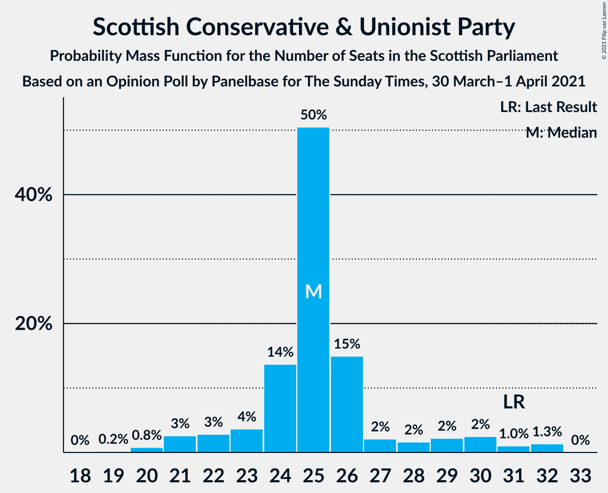

# Opinion Poll by Panelbase for The Sunday Times, 30 March–1 April 2021

<a href="#voting-intentions">Voting Intentions</a> | <a href="#seats">Seats</a> | <a href="#coalitions">Coalitions</a> | <a href="#technical-information">Technical Information</a>

## Voting Intentions

### Confidence Intervals

| Party | Last Result | Poll Result | 80% Confidence Interval | 90% Confidence Interval | 95% Confidence Interval | 99% Confidence Interval |
|:-----:|:-----------:|:-----------:|:-----------------------:|:-----------------------:|:-----------------------:|:-----------------------:|
| Scottish National Party | 41.7% | 39.0% | 37.1–41.0% |36.5–41.6% |36.0–42.1% |35.1–43.0% |
| Scottish Conservative & Unionist Party | 22.9% | 21.0% | 19.4–22.7% |19.0–23.2% |18.6–23.6% |17.8–24.5% |
| Scottish Labour | 19.1% | 17.0% | 15.6–18.6% |15.2–19.1% |14.8–19.5% |14.2–20.3% |
| Scottish Greens | 6.6% | 8.0% | 7.0–9.2% |6.7–9.6% |6.5–9.9% |6.1–10.5% |
| Alba Party | 0.0% | 6.0% | 5.2–7.1% |4.9–7.4% |4.7–7.7% |4.3–8.2% |
| Scottish Liberal Democrats | 5.2% | 5.0% | 4.2–5.9% |3.9–6.2% |3.8–6.5% |3.4–7.0% |
| All For Unity | 0.0% | 4.0% | 3.3–4.9% |3.1–5.1% |2.9–5.3% |2.6–5.8% |

*Note:* The poll result column reflects the actual value used in the calculations. Published results may vary slightly, and in addition be rounded to fewer digits.

## Seats

### Confidence Intervals

| Party | Last Result | Median | 80% Confidence Interval | 90% Confidence Interval | 95% Confidence Interval | 99% Confidence Interval |
|:-----:|:-----------:|:------:|:-----------------------:|:-----------------------:|:-----------------------:|:-----------------------:|
| <a href="#scottish-national-party">Scottish National Party</a> | 63 | 66 | 62–68 |61–69 |61–69 |60–70 |
| <a href="#scottish-conservative-&-unionist-party">Scottish Conservative & Unionist Party</a> | 31 | 25 | 23–27 |22–29 |21–30 |20–32 |
| <a href="#scottish-labour">Scottish Labour</a> | 24 | 19 | 17–23 |17–24 |17–24 |16–26 |
| <a href="#scottish-greens">Scottish Greens</a> | 6 | 10 | 6–10 |5–10 |4–11 |3–11 |
| <a href="#alba-party">Alba Party</a> | 0 | 6 | 3–8 |2–8 |0–8 |0–8 |
| <a href="#scottish-liberal-democrats">Scottish Liberal Democrats</a> | 5 | 3 | 2–5 |2–5 |2–6 |2–6 |
| <a href="#all-for-unity">All For Unity</a> | 0 | 0 | 0–1 |0–3 |0–3 |0–5 |

### Scottish National Party

*For a full overview of the results for this party, see the [Scottish National Party](party-scottishnationalparty.html) page.*

| Number of Seats | Probability | Accumulated | Special Marks |
|:---------------:|:-----------:|:-----------:|:-------------:|
| 57 | 0% | 100% |  |
| 58 | 0.1% | 99.9% |  |
| 59 | 0.1% | 99.8% |  |
| 60 | 1.1% | 99.7% |  |
| 61 | 6% | 98.5% |  |
| 62 | 6% | 93% |  |
| 63 | 8% | 86% | Last Result |
| 64 | 12% | 78% |  |
| 65 | 12% | 67% | Majority |
| 66 | 9% | 55% | Median |
| 67 | 29% | 45% |  |
| 68 | 10% | 16% |  |
| 69 | 5% | 6% |  |
| 70 | 0.9% | 0.9% |  |
| 71 | 0% | 0.1% |  |
| 72 | 0% | 0% |  |

### Scottish Conservative & Unionist Party

*For a full overview of the results for this party, see the [Scottish Conservative & Unionist Party](party-scottishconservativeunionistparty.html) page.*

| Number of Seats | Probability | Accumulated | Special Marks |
|:---------------:|:-----------:|:-----------:|:-------------:|
| 19 | 0.2% | 100% |  |
| 20 | 0.8% | 99.8% |  |
| 21 | 3% | 99.0% |  |
| 22 | 3% | 96% |  |
| 23 | 4% | 94% |  |
| 24 | 14% | 90% |  |
| 25 | 50% | 76% | Median |
| 26 | 15% | 26% |  |
| 27 | 2% | 11% |  |
| 28 | 2% | 9% |  |
| 29 | 2% | 7% |  |
| 30 | 2% | 5% |  |
| 31 | 1.0% | 2% | Last Result |
| 32 | 1.3% | 1.4% |  |
| 33 | 0% | 0% |  |

### Scottish Labour

*For a full overview of the results for this party, see the [Scottish Labour](party-scottishlabour.html) page.*

| Number of Seats | Probability | Accumulated | Special Marks |
|:---------------:|:-----------:|:-----------:|:-------------:|
| 15 | 0.1% | 100% |  |
| 16 | 0.6% | 99.9% |  |
| 17 | 13% | 99.3% |  |
| 18 | 24% | 87% |  |
| 19 | 16% | 63% | Median |
| 20 | 13% | 47% |  |
| 21 | 10% | 34% |  |
| 22 | 12% | 24% |  |
| 23 | 7% | 12% |  |
| 24 | 3% | 6% | Last Result |
| 25 | 1.3% | 2% |  |
| 26 | 0.9% | 1.0% |  |
| 27 | 0% | 0.1% |  |
| 28 | 0% | 0% |  |

### Scottish Greens

*For a full overview of the results for this party, see the [Scottish Greens](party-scottishgreens.html) page.*

| Number of Seats | Probability | Accumulated | Special Marks |
|:---------------:|:-----------:|:-----------:|:-------------:|
| 3 | 2% | 100% |  |
| 4 | 2% | 98% |  |
| 5 | 5% | 96% |  |
| 6 | 4% | 91% | Last Result |
| 7 | 9% | 87% |  |
| 8 | 8% | 78% |  |
| 9 | 15% | 71% |  |
| 10 | 53% | 56% | Median |
| 11 | 3% | 3% |  |
| 12 | 0.3% | 0.3% |  |
| 13 | 0% | 0% |  |

### Alba Party

*For a full overview of the results for this party, see the [Alba Party](party-albaparty.html) page.*

| Number of Seats | Probability | Accumulated | Special Marks |
|:---------------:|:-----------:|:-----------:|:-------------:|
| 0 | 3% | 100% | Last Result |
| 1 | 0.8% | 97% |  |
| 2 | 3% | 97% |  |
| 3 | 4% | 94% |  |
| 4 | 9% | 89% |  |
| 5 | 9% | 80% |  |
| 6 | 36% | 71% | Median |
| 7 | 14% | 36% |  |
| 8 | 22% | 22% |  |
| 9 | 0% | 0% |  |

### Scottish Liberal Democrats

*For a full overview of the results for this party, see the [Scottish Liberal Democrats](party-scottishliberaldemocrats.html) page.*

| Number of Seats | Probability | Accumulated | Special Marks |
|:---------------:|:-----------:|:-----------:|:-------------:|
| 2 | 23% | 100% |  |
| 3 | 33% | 77% | Median |
| 4 | 19% | 44% |  |
| 5 | 22% | 25% | Last Result |
| 6 | 3% | 3% |  |
| 7 | 0.1% | 0.1% |  |
| 8 | 0% | 0% |  |

### All For Unity

*For a full overview of the results for this party, see the [All For Unity](party-allforunity.html) page.*

| Number of Seats | Probability | Accumulated | Special Marks |
|:---------------:|:-----------:|:-----------:|:-------------:|
| 0 | 66% | 100% | Last Result, Median |
| 1 | 26% | 34% |  |
| 2 | 2% | 8% |  |
| 3 | 4% | 6% |  |
| 4 | 0.8% | 2% |  |
| 5 | 0.6% | 0.8% |  |
| 6 | 0.1% | 0.1% |  |
| 7 | 0% | 0% |  |

## Coalitions

### Confidence Intervals

| Coalition | Last Result | Median | Majority? | 80% Confidence Interval | 90% Confidence Interval | 95% Confidence Interval | 99% Confidence Interval |
|:---------:|:-----------:|:------:|:---------:|:-----------------------:|:-----------------------:|:-----------------------:|:-----------------------:|
| Scottish National Party – Scottish Greens – Alba Party | 69 | 81 | 100% | 76–83 | 74–85 | 73–86 | 71–86 |
| Scottish National Party – Scottish Greens | 69 | 75 | 99.9% | 71–77 | 68–78 | 68–79 | 66–80 |
| Scottish National Party – Alba Party | 63 | 71 | 98% | 68–74 | 66–76 | 65–76 | 63–77 |
| Scottish National Party | 63 | 66 | 67% | 62–68 | 61–69 | 61–69 | 60–70 |
| Scottish Conservative & Unionist Party – Scottish Labour – Scottish Liberal Democrats | 60 | 48 | 0% | 46–53 | 44–54 | 43–56 | 42–58 |
| Scottish Conservative & Unionist Party – Scottish Labour | 55 | 44 | 0% | 42–48 | 41–50 | 40–52 | 39–54 |
| Scottish Labour – Scottish Greens – Scottish Liberal Democrats | 35 | 32 | 0% | 29–35 | 29–36 | 27–38 | 26–40 |
| Scottish Conservative & Unionist Party – Scottish Liberal Democrats | 36 | 28 | 0% | 27–31 | 25–33 | 24–34 | 23–36 |
| Scottish Labour – Scottish Liberal Democrats | 29 | 22 | 0% | 21–27 | 20–28 | 19–29 | 19–31 |

### Scottish National Party – Scottish Greens – Alba Party

| Number of Seats | Probability | Accumulated | Special Marks |
|:---------------:|:-----------:|:-----------:|:-------------:|
| 69 | 0.1% | 100% | Last Result |
| 70 | 0.1% | 99.9% |  |
| 71 | 0.5% | 99.8% |  |
| 72 | 1.2% | 99.3% |  |
| 73 | 2% | 98% |  |
| 74 | 2% | 96% |  |
| 75 | 2% | 94% |  |
| 76 | 6% | 92% |  |
| 77 | 3% | 85% |  |
| 78 | 7% | 82% |  |
| 79 | 14% | 75% |  |
| 80 | 8% | 60% |  |
| 81 | 14% | 52% |  |
| 82 | 15% | 38% | Median |
| 83 | 16% | 23% |  |
| 84 | 2% | 7% |  |
| 85 | 3% | 5% |  |
| 86 | 2% | 3% |  |
| 87 | 0.3% | 0.4% |  |
| 88 | 0.1% | 0.1% |  |
| 89 | 0% | 0% |  |

### Scottish National Party – Scottish Greens

| Number of Seats | Probability | Accumulated | Special Marks |
|:---------------:|:-----------:|:-----------:|:-------------:|
| 64 | 0.1% | 100% |  |
| 65 | 0.2% | 99.9% | Majority |
| 66 | 0.5% | 99.8% |  |
| 67 | 1.5% | 99.3% |  |
| 68 | 3% | 98% |  |
| 69 | 2% | 95% | Last Result |
| 70 | 2% | 93% |  |
| 71 | 7% | 91% |  |
| 72 | 7% | 84% |  |
| 73 | 15% | 77% |  |
| 74 | 12% | 63% |  |
| 75 | 11% | 50% |  |
| 76 | 14% | 39% | Median |
| 77 | 17% | 25% |  |
| 78 | 5% | 8% |  |
| 79 | 2% | 3% |  |
| 80 | 0.5% | 0.6% |  |
| 81 | 0.1% | 0.1% |  |
| 82 | 0% | 0% |  |

### Scottish National Party – Alba Party

| Number of Seats | Probability | Accumulated | Special Marks |
|:---------------:|:-----------:|:-----------:|:-------------:|
| 61 | 0.2% | 100% |  |
| 62 | 0.2% | 99.8% |  |
| 63 | 0.8% | 99.6% | Last Result |
| 64 | 1.2% | 98.8% |  |
| 65 | 1.2% | 98% | Majority |
| 66 | 2% | 96% |  |
| 67 | 2% | 94% |  |
| 68 | 3% | 92% |  |
| 69 | 6% | 89% |  |
| 70 | 12% | 83% |  |
| 71 | 26% | 71% |  |
| 72 | 10% | 45% | Median |
| 73 | 23% | 35% |  |
| 74 | 3% | 12% |  |
| 75 | 3% | 9% |  |
| 76 | 4% | 6% |  |
| 77 | 2% | 2% |  |
| 78 | 0.2% | 0.3% |  |
| 79 | 0% | 0% |  |

### Scottish National Party

| Number of Seats | Probability | Accumulated | Special Marks |
|:---------------:|:-----------:|:-----------:|:-------------:|
| 57 | 0% | 100% |  |
| 58 | 0.1% | 99.9% |  |
| 59 | 0.1% | 99.8% |  |
| 60 | 1.1% | 99.7% |  |
| 61 | 6% | 98.5% |  |
| 62 | 6% | 93% |  |
| 63 | 8% | 86% | Last Result |
| 64 | 12% | 78% |  |
| 65 | 12% | 67% | Majority |
| 66 | 9% | 55% | Median |
| 67 | 29% | 45% |  |
| 68 | 10% | 16% |  |
| 69 | 5% | 6% |  |
| 70 | 0.9% | 0.9% |  |
| 71 | 0% | 0.1% |  |
| 72 | 0% | 0% |  |

### Scottish Conservative & Unionist Party – Scottish Labour – Scottish Liberal Democrats

| Number of Seats | Probability | Accumulated | Special Marks |
|:---------------:|:-----------:|:-----------:|:-------------:|
| 41 | 0.1% | 100% |  |
| 42 | 0.5% | 99.9% |  |
| 43 | 3% | 99.4% |  |
| 44 | 4% | 96% |  |
| 45 | 1.1% | 93% |  |
| 46 | 19% | 92% |  |
| 47 | 17% | 72% | Median |
| 48 | 15% | 55% |  |
| 49 | 11% | 41% |  |
| 50 | 10% | 29% |  |
| 51 | 3% | 19% |  |
| 52 | 4% | 16% |  |
| 53 | 5% | 12% |  |
| 54 | 2% | 6% |  |
| 55 | 1.0% | 4% |  |
| 56 | 2% | 3% |  |
| 57 | 0.7% | 1.2% |  |
| 58 | 0.4% | 0.5% |  |
| 59 | 0.1% | 0.1% |  |
| 60 | 0% | 0.1% | Last Result |
| 61 | 0% | 0% |  |

### Scottish Conservative & Unionist Party – Scottish Labour

| Number of Seats | Probability | Accumulated | Special Marks |
|:---------------:|:-----------:|:-----------:|:-------------:|
| 38 | 0.3% | 100% |  |
| 39 | 2% | 99.7% |  |
| 40 | 1.1% | 98% |  |
| 41 | 2% | 97% |  |
| 42 | 9% | 95% |  |
| 43 | 23% | 86% |  |
| 44 | 13% | 63% | Median |
| 45 | 11% | 50% |  |
| 46 | 16% | 39% |  |
| 47 | 8% | 23% |  |
| 48 | 7% | 16% |  |
| 49 | 3% | 9% |  |
| 50 | 2% | 6% |  |
| 51 | 2% | 5% |  |
| 52 | 1.1% | 3% |  |
| 53 | 0.9% | 1.5% |  |
| 54 | 0.5% | 0.6% |  |
| 55 | 0.1% | 0.1% | Last Result |
| 56 | 0% | 0% |  |

### Scottish Labour – Scottish Greens – Scottish Liberal Democrats

| Number of Seats | Probability | Accumulated | Special Marks |
|:---------------:|:-----------:|:-----------:|:-------------:|
| 24 | 0.2% | 100% |  |
| 25 | 0.3% | 99.8% |  |
| 26 | 0.6% | 99.5% |  |
| 27 | 2% | 99.0% |  |
| 28 | 2% | 97% |  |
| 29 | 5% | 95% |  |
| 30 | 5% | 90% |  |
| 31 | 30% | 84% |  |
| 32 | 21% | 54% | Median |
| 33 | 11% | 33% |  |
| 34 | 8% | 23% |  |
| 35 | 9% | 15% | Last Result |
| 36 | 2% | 6% |  |
| 37 | 0.9% | 4% |  |
| 38 | 1.3% | 3% |  |
| 39 | 0.6% | 1.3% |  |
| 40 | 0.5% | 0.7% |  |
| 41 | 0.2% | 0.2% |  |
| 42 | 0% | 0% |  |

### Scottish Conservative & Unionist Party – Scottish Liberal Democrats

| Number of Seats | Probability | Accumulated | Special Marks |
|:---------------:|:-----------:|:-----------:|:-------------:|
| 23 | 1.3% | 100% |  |
| 24 | 1.4% | 98.7% |  |
| 25 | 3% | 97% |  |
| 26 | 4% | 95% |  |
| 27 | 13% | 91% |  |
| 28 | 36% | 78% | Median |
| 29 | 14% | 41% |  |
| 30 | 14% | 28% |  |
| 31 | 6% | 14% |  |
| 32 | 2% | 9% |  |
| 33 | 1.5% | 6% |  |
| 34 | 2% | 5% |  |
| 35 | 1.3% | 2% |  |
| 36 | 0.9% | 1.2% | Last Result |
| 37 | 0.3% | 0.3% |  |
| 38 | 0% | 0% |  |

### Scottish Labour – Scottish Liberal Democrats

| Number of Seats | Probability | Accumulated | Special Marks |
|:---------------:|:-----------:|:-----------:|:-------------:|
| 18 | 0.3% | 100% |  |
| 19 | 3% | 99.7% |  |
| 20 | 2% | 96% |  |
| 21 | 20% | 94% |  |
| 22 | 24% | 74% | Median |
| 23 | 10% | 49% |  |
| 24 | 10% | 39% |  |
| 25 | 13% | 29% |  |
| 26 | 5% | 17% |  |
| 27 | 3% | 12% |  |
| 28 | 5% | 8% |  |
| 29 | 2% | 3% | Last Result |
| 30 | 0.3% | 1.2% |  |
| 31 | 0.7% | 0.9% |  |
| 32 | 0.2% | 0.2% |  |
| 33 | 0% | 0% |  |

## Technical Information

### Opinion Poll

+ **Polling firm:** Panelbase
+ **Commissioner(s):** The Sunday Times
+ **Fieldwork period:** 30 March–1 April 2021

### Calculations

+ **Sample size:** 1010
+ **Simulations done:** 1,048,576
+ **Error estimate:** 0.98%

