# Opinion Poll by Ipsos MORI for STV News, 30 March–4 April 2021

<a href="#voting-intentions">Voting Intentions</a> | <a href="#seats">Seats</a> | <a href="#coalitions">Coalitions</a> | <a href="#technical-information">Technical Information</a>

## Voting Intentions

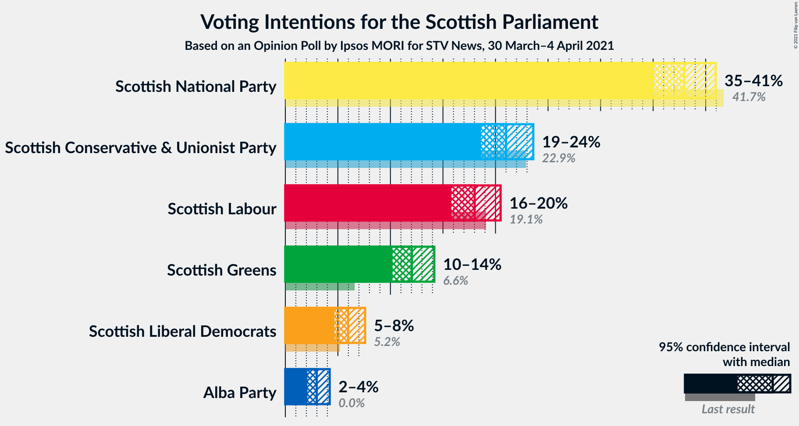

### Confidence Intervals

| Party | Last Result | Poll Result | 80% Confidence Interval | 90% Confidence Interval | 95% Confidence Interval | 99% Confidence Interval |
|:-----:|:-----------:|:-----------:|:-----------------------:|:-----------------------:|:-----------------------:|:-----------------------:|
| Scottish National Party | 41.7% | 38.0% | 36.0–39.9% |35.5–40.5% |35.1–41.0% |34.1–41.9% |
| Scottish Conservative & Unionist Party | 22.9% | 21.0% | 19.4–22.7% |19.0–23.2% |18.6–23.6% |17.9–24.4% |
| Scottish Labour | 19.1% | 18.0% | 16.6–19.6% |16.1–20.1% |15.8–20.5% |15.1–21.3% |
| Scottish Greens | 6.6% | 12.0% | 10.8–13.4% |10.5–13.8% |10.2–14.2% |9.6–14.9% |
| Scottish Liberal Democrats | 5.2% | 6.0% | 5.1–7.0% |4.9–7.3% |4.7–7.6% |4.3–8.1% |
| Alba Party | 0.0% | 3.0% | 2.4–3.8% |2.2–4.0% |2.1–4.2% |1.9–4.6% |

*Note:* The poll result column reflects the actual value used in the calculations. Published results may vary slightly, and in addition be rounded to fewer digits.

## Seats

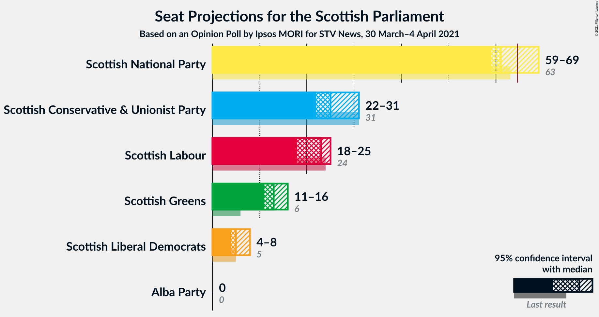

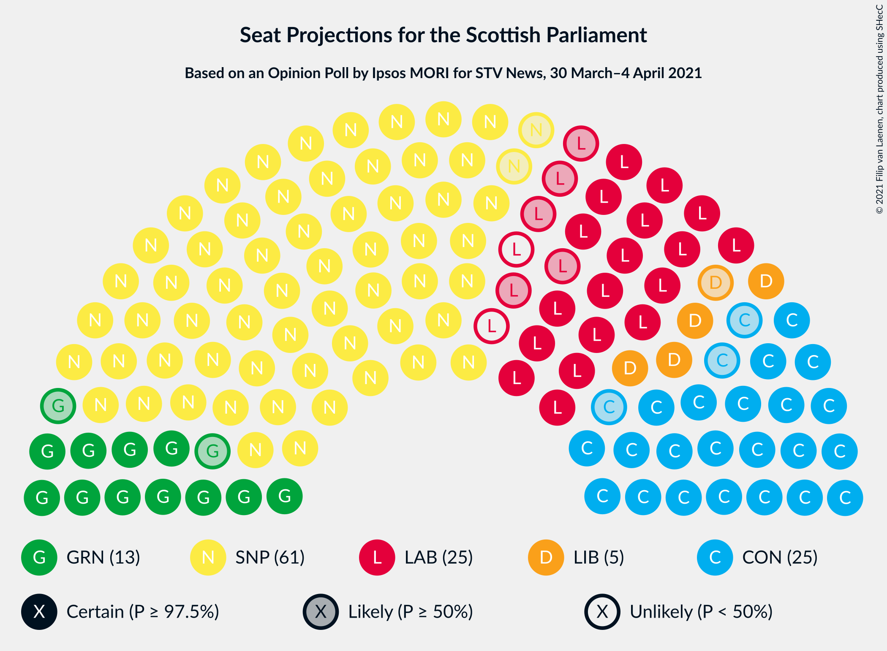

### Confidence Intervals

| Party | Last Result | Median | 80% Confidence Interval | 90% Confidence Interval | 95% Confidence Interval | 99% Confidence Interval |
|:-----:|:-----------:|:------:|:-----------------------:|:-----------------------:|:-----------------------:|:-----------------------:|
| <a href="#scottish-national-party">Scottish National Party</a> | 63 | 61 | 59–67 |59–68 |59–69 |56–69 |
| <a href="#scottish-conservative-&-unionist-party">Scottish Conservative & Unionist Party</a> | 31 | 25 | 23–29 |22–30 |22–31 |21–32 |
| <a href="#scottish-labour">Scottish Labour</a> | 24 | 23 | 19–25 |18–25 |18–25 |17–27 |
| <a href="#scottish-greens">Scottish Greens</a> | 6 | 13 | 12–15 |11–15 |11–16 |10–17 |
| <a href="#scottish-liberal-democrats">Scottish Liberal Democrats</a> | 5 | 5 | 5–7 |4–8 |4–8 |3–8 |
| <a href="#alba-party">Alba Party</a> | 0 | 0 | 0 |0 |0 |0 |

### Scottish National Party

*For a full overview of the results for this party, see the [Scottish National Party](party-scottishnationalparty.html) page.*

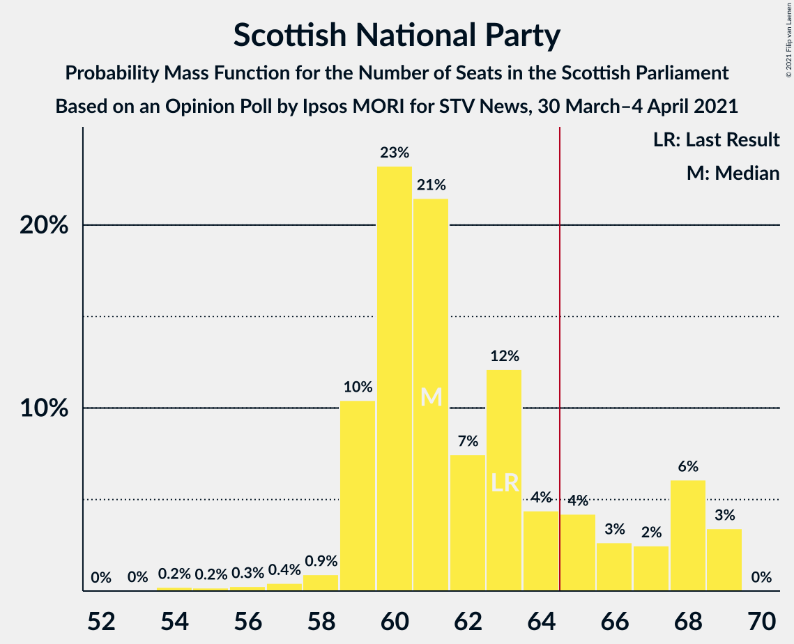

| Number of Seats | Probability | Accumulated | Special Marks |
|:---------------:|:-----------:|:-----------:|:-------------:|
| 54 | 0.2% | 100% |  |
| 55 | 0.2% | 99.7% |  |
| 56 | 0.3% | 99.6% |  |
| 57 | 0.4% | 99.3% |  |
| 58 | 0.9% | 98.9% |  |
| 59 | 10% | 98% |  |
| 60 | 23% | 88% |  |
| 61 | 21% | 64% | Median |
| 62 | 7% | 43% |  |
| 63 | 12% | 35% | Last Result |
| 64 | 4% | 23% |  |
| 65 | 4% | 19% | Majority |
| 66 | 3% | 15% |  |
| 67 | 2% | 12% |  |
| 68 | 6% | 10% |  |
| 69 | 3% | 3% |  |
| 70 | 0% | 0% |  |

### Scottish Conservative & Unionist Party

*For a full overview of the results for this party, see the [Scottish Conservative & Unionist Party](party-scottishconservativeunionistparty.html) page.*

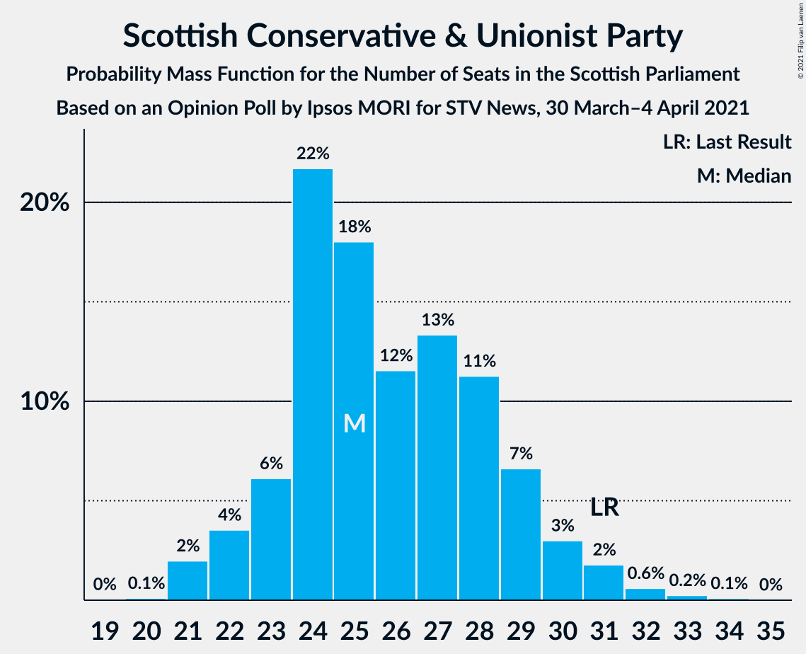

| Number of Seats | Probability | Accumulated | Special Marks |
|:---------------:|:-----------:|:-----------:|:-------------:|
| 20 | 0.1% | 100% |  |
| 21 | 2% | 99.9% |  |
| 22 | 4% | 98% |  |
| 23 | 6% | 94% |  |
| 24 | 22% | 88% |  |
| 25 | 18% | 67% | Median |
| 26 | 12% | 48% |  |
| 27 | 13% | 37% |  |
| 28 | 11% | 24% |  |
| 29 | 7% | 12% |  |
| 30 | 3% | 6% |  |
| 31 | 2% | 3% | Last Result |
| 32 | 0.6% | 1.0% |  |
| 33 | 0.2% | 0.4% |  |
| 34 | 0.1% | 0.1% |  |
| 35 | 0% | 0% |  |

### Scottish Labour

*For a full overview of the results for this party, see the [Scottish Labour](party-scottishlabour.html) page.*

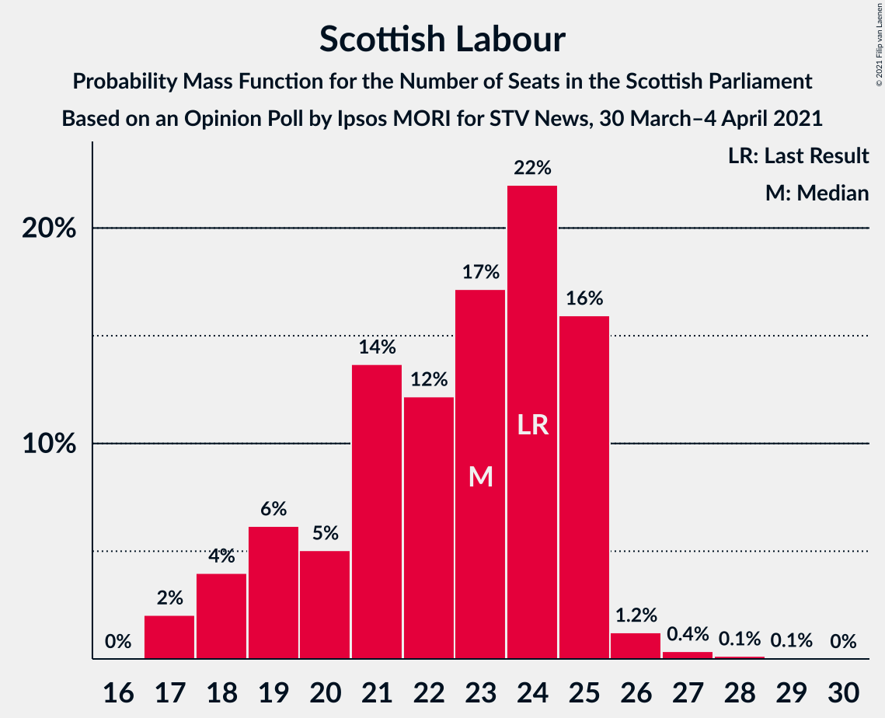

| Number of Seats | Probability | Accumulated | Special Marks |
|:---------------:|:-----------:|:-----------:|:-------------:|
| 17 | 2% | 100% |  |
| 18 | 4% | 98% |  |
| 19 | 6% | 94% |  |
| 20 | 5% | 88% |  |
| 21 | 14% | 83% |  |
| 22 | 12% | 69% |  |
| 23 | 17% | 57% | Median |
| 24 | 22% | 40% | Last Result |
| 25 | 16% | 18% |  |
| 26 | 1.2% | 2% |  |
| 27 | 0.4% | 0.6% |  |
| 28 | 0.1% | 0.2% |  |
| 29 | 0.1% | 0.1% |  |
| 30 | 0% | 0% |  |

### Scottish Greens

*For a full overview of the results for this party, see the [Scottish Greens](party-scottishgreens.html) page.*

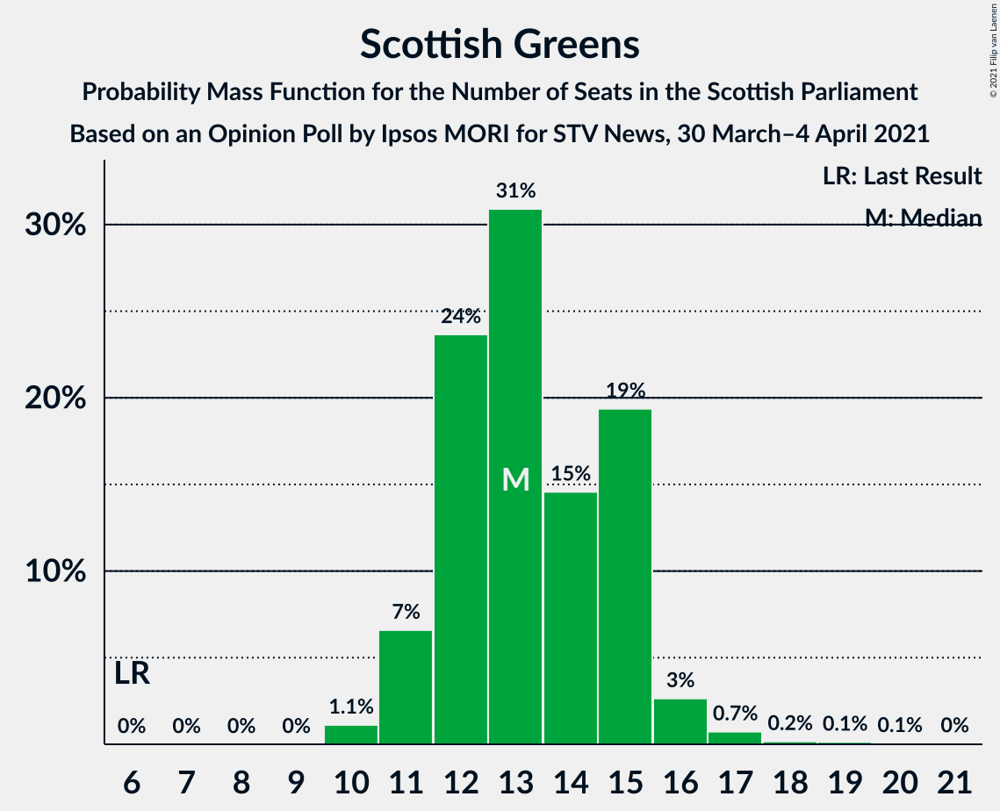

| Number of Seats | Probability | Accumulated | Special Marks |
|:---------------:|:-----------:|:-----------:|:-------------:|
| 6 | 0% | 100% | Last Result |
| 7 | 0% | 100% |  |
| 8 | 0% | 100% |  |
| 9 | 0% | 100% |  |
| 10 | 1.1% | 100% |  |
| 11 | 7% | 98.9% |  |
| 12 | 24% | 92% |  |
| 13 | 31% | 69% | Median |
| 14 | 15% | 38% |  |
| 15 | 19% | 23% |  |
| 16 | 3% | 4% |  |
| 17 | 0.7% | 1.1% |  |
| 18 | 0.2% | 0.4% |  |
| 19 | 0.1% | 0.2% |  |
| 20 | 0.1% | 0.1% |  |
| 21 | 0% | 0% |  |

### Scottish Liberal Democrats

*For a full overview of the results for this party, see the [Scottish Liberal Democrats](party-scottishliberaldemocrats.html) page.*

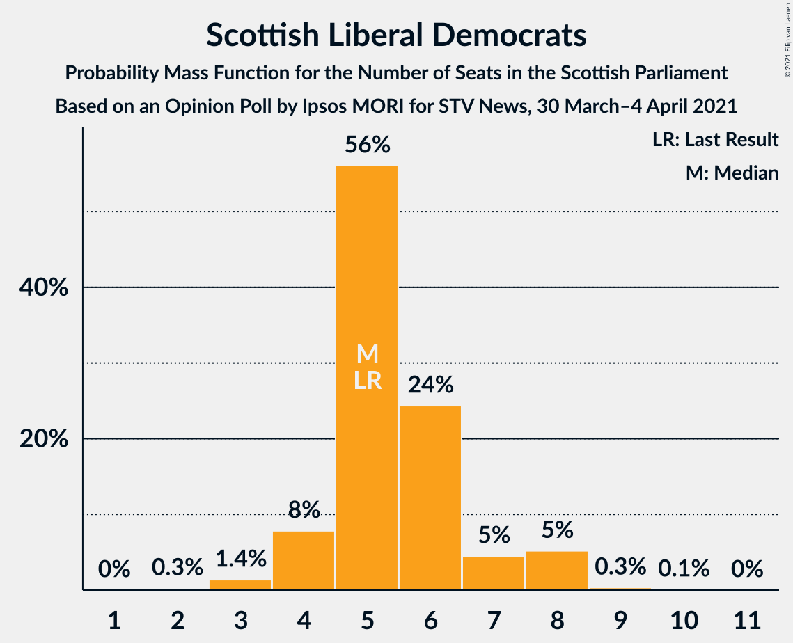

| Number of Seats | Probability | Accumulated | Special Marks |
|:---------------:|:-----------:|:-----------:|:-------------:|
| 2 | 0.3% | 100% |  |
| 3 | 1.4% | 99.7% |  |
| 4 | 8% | 98% |  |
| 5 | 56% | 91% | Last Result, Median |
| 6 | 24% | 34% |  |
| 7 | 5% | 10% |  |
| 8 | 5% | 6% |  |
| 9 | 0.3% | 0.4% |  |
| 10 | 0.1% | 0.1% |  |
| 11 | 0% | 0% |  |

### Alba Party

*For a full overview of the results for this party, see the [Alba Party](party-albaparty.html) page.*

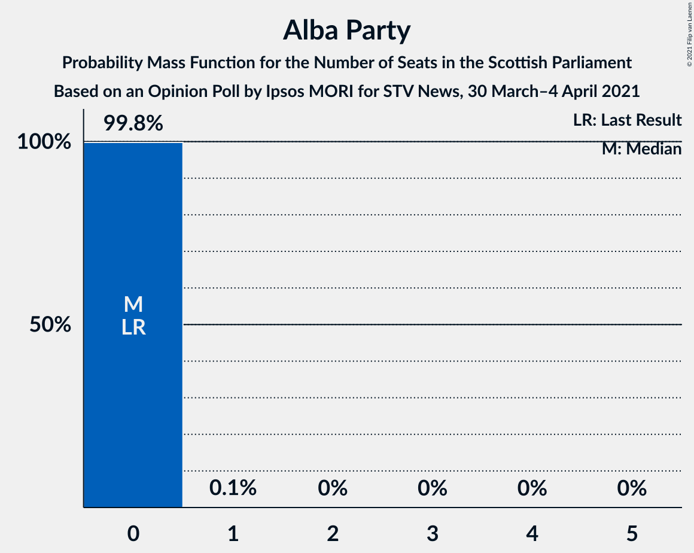

| Number of Seats | Probability | Accumulated | Special Marks |
|:---------------:|:-----------:|:-----------:|:-------------:|
| 0 | 99.8% | 100% | Last Result, Median |
| 1 | 0.1% | 0.2% |  |
| 2 | 0% | 0.1% |  |
| 3 | 0% | 0% |  |

## Coalitions

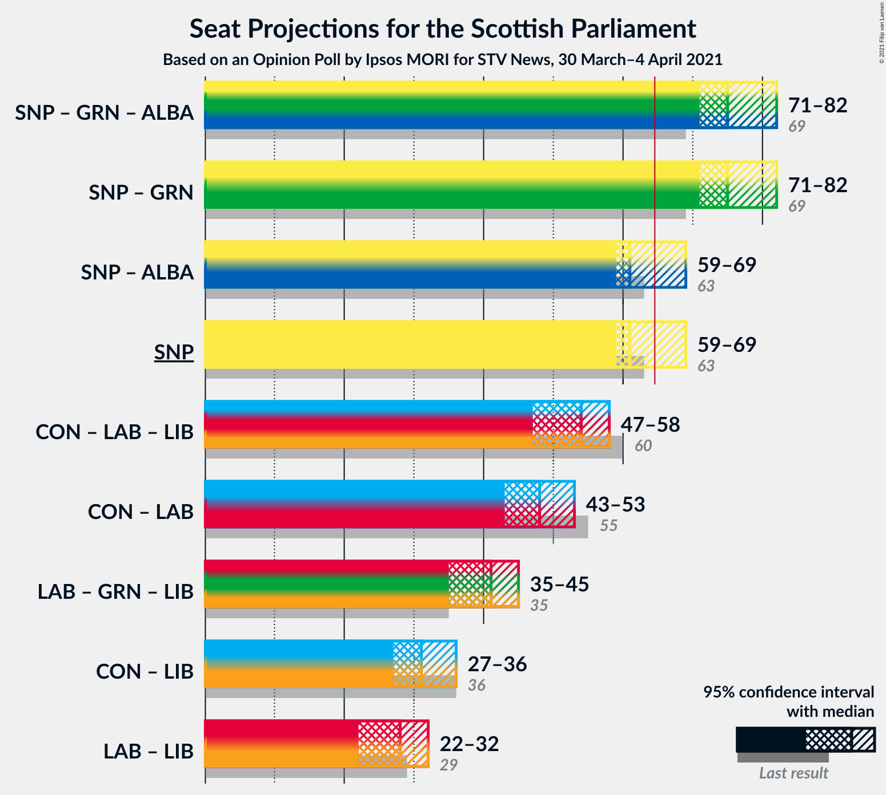

### Confidence Intervals

| Coalition | Last Result | Median | Majority? | 80% Confidence Interval | 90% Confidence Interval | 95% Confidence Interval | 99% Confidence Interval |
|:---------:|:-----------:|:------:|:---------:|:-----------------------:|:-----------------------:|:-----------------------:|:-----------------------:|
| Scottish National Party – Scottish Greens – Alba Party | 69 | 75 | 100% | 72–80 | 71–81 | 71–82 | 69–82 |
| Scottish National Party – Scottish Greens | 69 | 75 | 100% | 72–80 | 71–81 | 71–82 | 69–82 |
| Scottish National Party – Alba Party | 63 | 61 | 19% | 59–67 | 59–68 | 59–69 | 56–69 |
| Scottish National Party | 63 | 61 | 19% | 59–67 | 59–68 | 59–69 | 56–69 |
| Scottish Conservative & Unionist Party – Scottish Labour – Scottish Liberal Democrats | 60 | 54 | 0% | 49–57 | 48–58 | 47–58 | 47–60 |
| Scottish Conservative & Unionist Party – Scottish Labour | 55 | 48 | 0% | 44–52 | 43–52 | 43–53 | 42–55 |
| Scottish Labour – Scottish Greens – Scottish Liberal Democrats | 35 | 41 | 0% | 37–44 | 36–45 | 35–45 | 35–46 |
| Scottish Conservative & Unionist Party – Scottish Liberal Democrats | 36 | 31 | 0% | 28–34 | 27–35 | 27–36 | 25–38 |
| Scottish Labour – Scottish Liberal Democrats | 29 | 28 | 0% | 24–30 | 23–31 | 22–32 | 22–33 |

### Scottish National Party – Scottish Greens – Alba Party

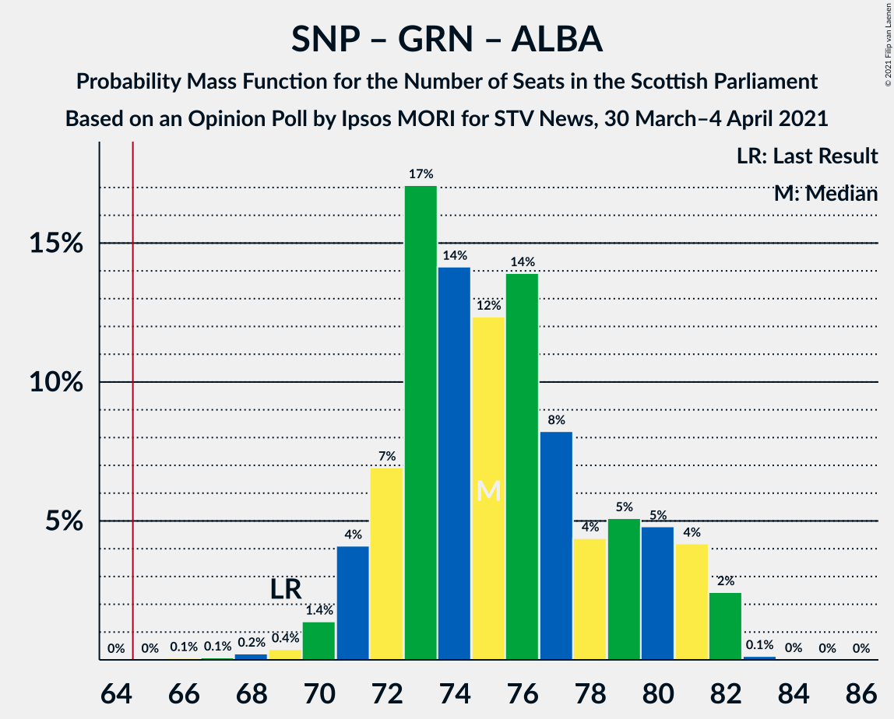

| Number of Seats | Probability | Accumulated | Special Marks |
|:---------------:|:-----------:|:-----------:|:-------------:|
| 66 | 0.1% | 100% |  |
| 67 | 0.1% | 99.9% |  |
| 68 | 0.2% | 99.8% |  |
| 69 | 0.4% | 99.6% | Last Result |
| 70 | 1.4% | 99.2% |  |
| 71 | 4% | 98% |  |
| 72 | 7% | 94% |  |
| 73 | 17% | 87% |  |
| 74 | 14% | 70% | Median |
| 75 | 12% | 56% |  |
| 76 | 14% | 43% |  |
| 77 | 8% | 29% |  |
| 78 | 4% | 21% |  |
| 79 | 5% | 17% |  |
| 80 | 5% | 12% |  |
| 81 | 4% | 7% |  |
| 82 | 2% | 3% |  |
| 83 | 0.1% | 0.2% |  |
| 84 | 0% | 0.1% |  |
| 85 | 0% | 0% |  |

### Scottish National Party – Scottish Greens

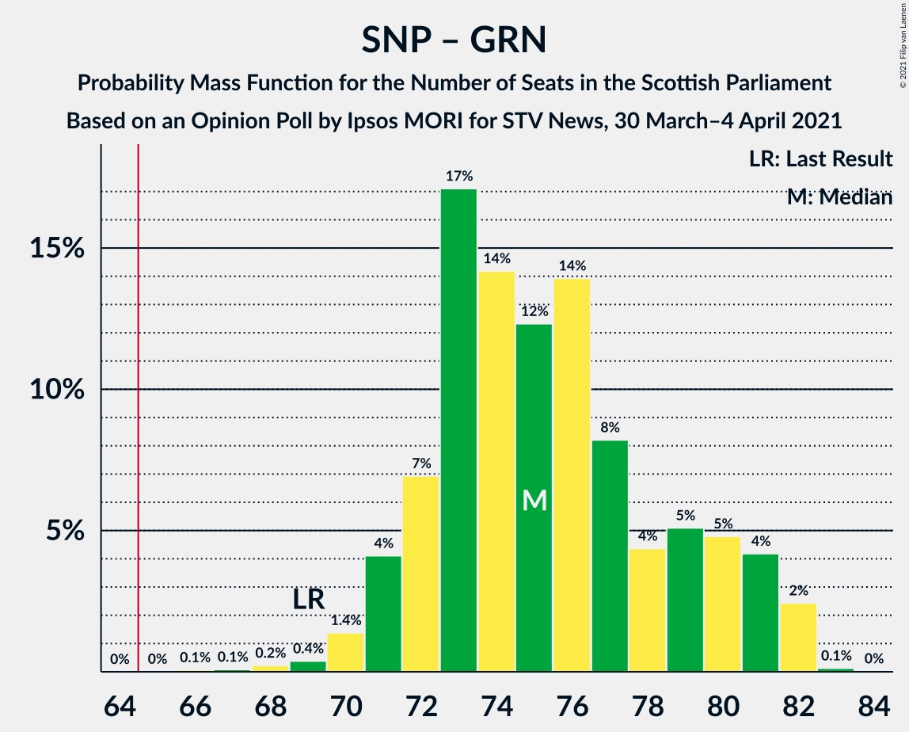

| Number of Seats | Probability | Accumulated | Special Marks |
|:---------------:|:-----------:|:-----------:|:-------------:|
| 66 | 0.1% | 100% |  |
| 67 | 0.1% | 99.9% |  |
| 68 | 0.2% | 99.8% |  |
| 69 | 0.4% | 99.6% | Last Result |
| 70 | 1.4% | 99.2% |  |
| 71 | 4% | 98% |  |
| 72 | 7% | 94% |  |
| 73 | 17% | 87% |  |
| 74 | 14% | 70% | Median |
| 75 | 12% | 56% |  |
| 76 | 14% | 43% |  |
| 77 | 8% | 29% |  |
| 78 | 4% | 21% |  |
| 79 | 5% | 17% |  |
| 80 | 5% | 12% |  |
| 81 | 4% | 7% |  |
| 82 | 2% | 3% |  |
| 83 | 0.1% | 0.2% |  |
| 84 | 0% | 0% |  |

### Scottish National Party – Alba Party

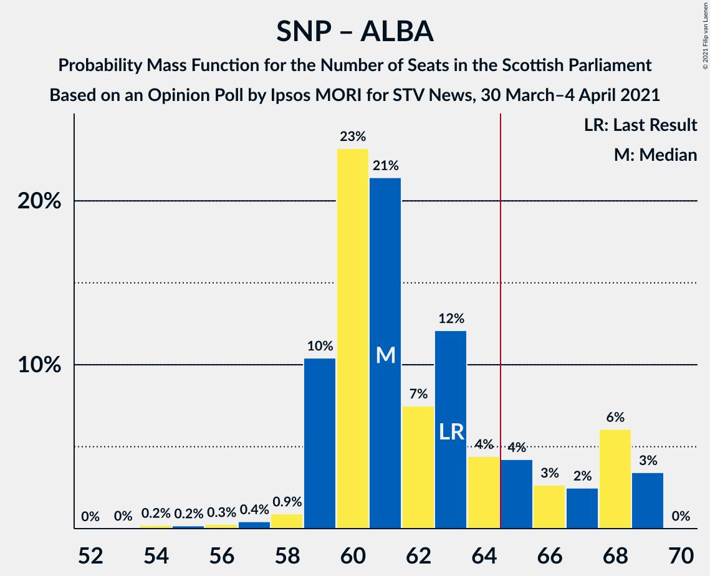

| Number of Seats | Probability | Accumulated | Special Marks |
|:---------------:|:-----------:|:-----------:|:-------------:|
| 54 | 0.2% | 100% |  |
| 55 | 0.2% | 99.7% |  |
| 56 | 0.3% | 99.6% |  |
| 57 | 0.4% | 99.3% |  |
| 58 | 0.9% | 98.9% |  |
| 59 | 10% | 98% |  |
| 60 | 23% | 88% |  |
| 61 | 21% | 64% | Median |
| 62 | 7% | 43% |  |
| 63 | 12% | 35% | Last Result |
| 64 | 4% | 23% |  |
| 65 | 4% | 19% | Majority |
| 66 | 3% | 15% |  |
| 67 | 2% | 12% |  |
| 68 | 6% | 10% |  |
| 69 | 3% | 3% |  |
| 70 | 0% | 0% |  |

### Scottish National Party

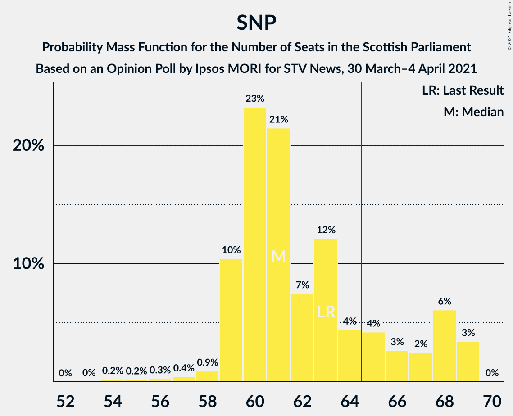

| Number of Seats | Probability | Accumulated | Special Marks |
|:---------------:|:-----------:|:-----------:|:-------------:|
| 54 | 0.2% | 100% |  |
| 55 | 0.2% | 99.7% |  |
| 56 | 0.3% | 99.6% |  |
| 57 | 0.4% | 99.3% |  |
| 58 | 0.9% | 98.9% |  |
| 59 | 10% | 98% |  |
| 60 | 23% | 88% |  |
| 61 | 21% | 64% | Median |
| 62 | 7% | 43% |  |
| 63 | 12% | 35% | Last Result |
| 64 | 4% | 23% |  |
| 65 | 4% | 19% | Majority |
| 66 | 3% | 15% |  |
| 67 | 2% | 12% |  |
| 68 | 6% | 10% |  |
| 69 | 3% | 3% |  |
| 70 | 0% | 0% |  |

### Scottish Conservative & Unionist Party – Scottish Labour – Scottish Liberal Democrats

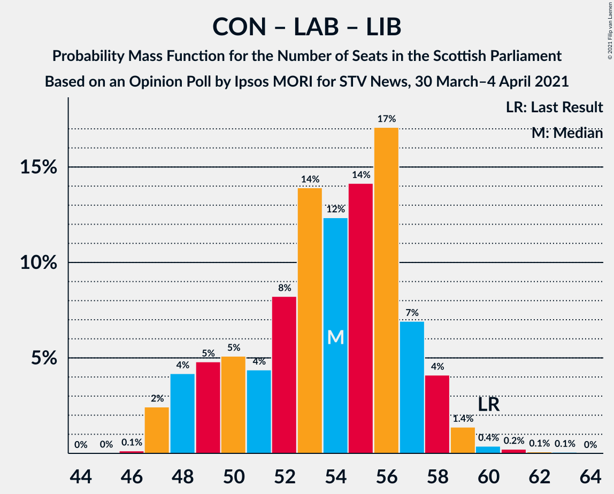

| Number of Seats | Probability | Accumulated | Special Marks |
|:---------------:|:-----------:|:-----------:|:-------------:|
| 45 | 0% | 100% |  |
| 46 | 0.1% | 99.9% |  |
| 47 | 2% | 99.8% |  |
| 48 | 4% | 97% |  |
| 49 | 5% | 93% |  |
| 50 | 5% | 88% |  |
| 51 | 4% | 83% |  |
| 52 | 8% | 79% |  |
| 53 | 14% | 71% | Median |
| 54 | 12% | 57% |  |
| 55 | 14% | 44% |  |
| 56 | 17% | 30% |  |
| 57 | 7% | 13% |  |
| 58 | 4% | 6% |  |
| 59 | 1.4% | 2% |  |
| 60 | 0.4% | 0.8% | Last Result |
| 61 | 0.2% | 0.4% |  |
| 62 | 0.1% | 0.2% |  |
| 63 | 0.1% | 0.1% |  |
| 64 | 0% | 0% |  |

### Scottish Conservative & Unionist Party – Scottish Labour

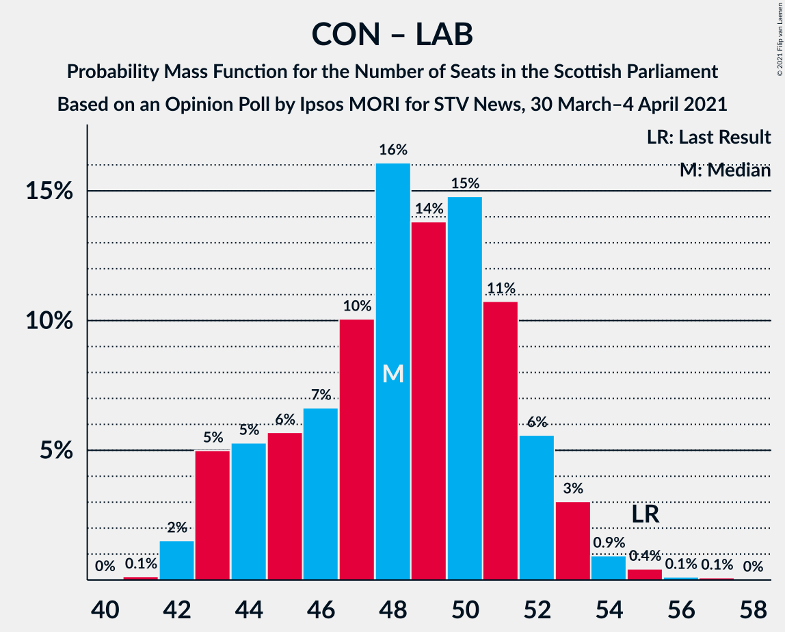

| Number of Seats | Probability | Accumulated | Special Marks |
|:---------------:|:-----------:|:-----------:|:-------------:|
| 40 | 0% | 100% |  |
| 41 | 0.1% | 99.9% |  |
| 42 | 2% | 99.8% |  |
| 43 | 5% | 98% |  |
| 44 | 5% | 93% |  |
| 45 | 6% | 88% |  |
| 46 | 7% | 82% |  |
| 47 | 10% | 76% |  |
| 48 | 16% | 66% | Median |
| 49 | 14% | 50% |  |
| 50 | 15% | 36% |  |
| 51 | 11% | 21% |  |
| 52 | 6% | 10% |  |
| 53 | 3% | 5% |  |
| 54 | 0.9% | 2% |  |
| 55 | 0.4% | 0.7% | Last Result |
| 56 | 0.1% | 0.2% |  |
| 57 | 0.1% | 0.1% |  |
| 58 | 0% | 0% |  |

### Scottish Labour – Scottish Greens – Scottish Liberal Democrats

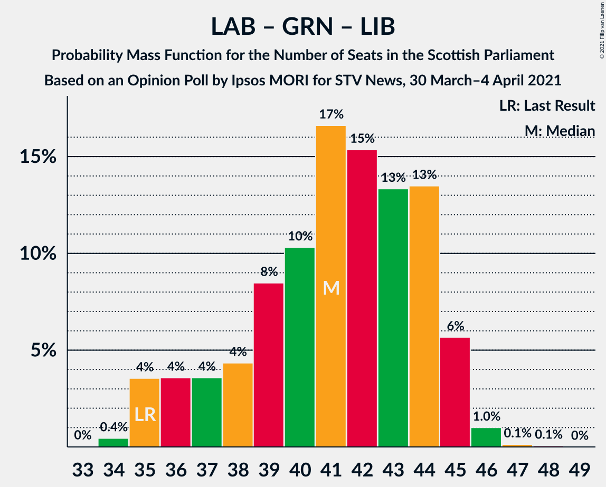

| Number of Seats | Probability | Accumulated | Special Marks |
|:---------------:|:-----------:|:-----------:|:-------------:|
| 34 | 0.4% | 100% |  |
| 35 | 4% | 99.5% | Last Result |
| 36 | 4% | 96% |  |
| 37 | 4% | 92% |  |
| 38 | 4% | 89% |  |
| 39 | 8% | 84% |  |
| 40 | 10% | 76% |  |
| 41 | 17% | 66% | Median |
| 42 | 15% | 49% |  |
| 43 | 13% | 34% |  |
| 44 | 13% | 20% |  |
| 45 | 6% | 7% |  |
| 46 | 1.0% | 1.2% |  |
| 47 | 0.1% | 0.2% |  |
| 48 | 0.1% | 0.1% |  |
| 49 | 0% | 0% |  |

### Scottish Conservative & Unionist Party – Scottish Liberal Democrats

| Number of Seats | Probability | Accumulated | Special Marks |
|:---------------:|:-----------:|:-----------:|:-------------:|
| 24 | 0% | 100% |  |
| 25 | 0.8% | 99.9% |  |
| 26 | 2% | 99.1% |  |
| 27 | 3% | 98% |  |
| 28 | 6% | 94% |  |
| 29 | 15% | 88% |  |
| 30 | 16% | 73% | Median |
| 31 | 12% | 57% |  |
| 32 | 14% | 45% |  |
| 33 | 10% | 31% |  |
| 34 | 13% | 21% |  |
| 35 | 4% | 7% |  |
| 36 | 2% | 4% | Last Result |
| 37 | 0.8% | 1.4% |  |
| 38 | 0.4% | 0.6% |  |
| 39 | 0.1% | 0.2% |  |
| 40 | 0.1% | 0.1% |  |
| 41 | 0% | 0% |  |

### Scottish Labour – Scottish Liberal Democrats

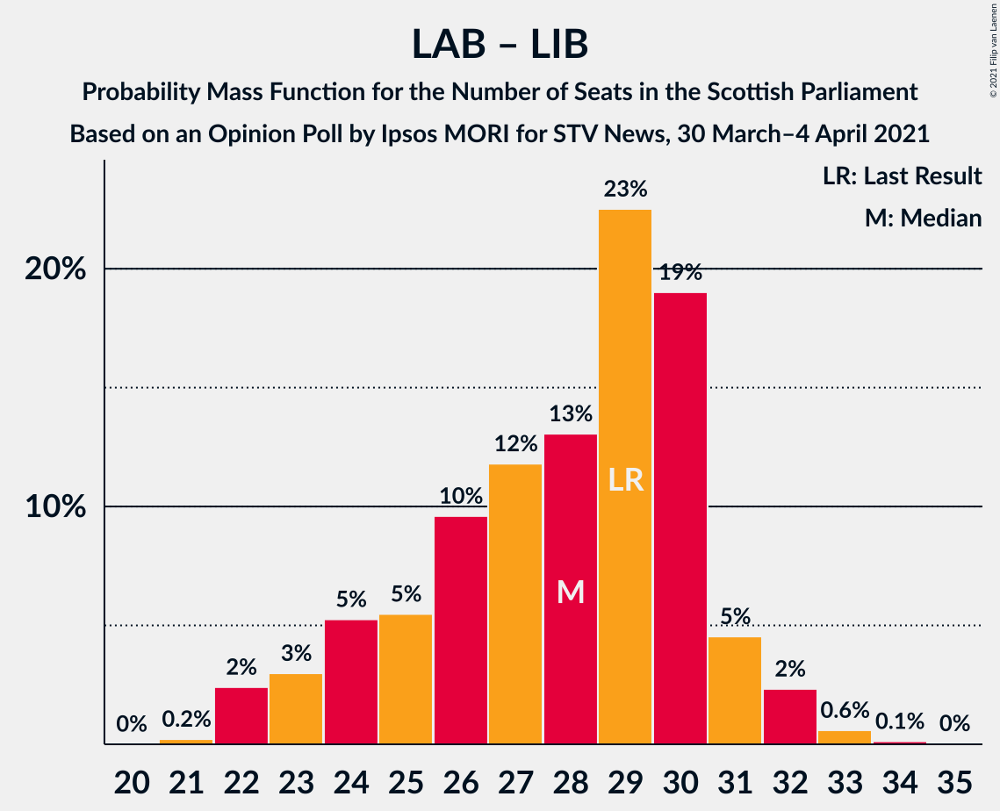

| Number of Seats | Probability | Accumulated | Special Marks |
|:---------------:|:-----------:|:-----------:|:-------------:|
| 21 | 0.2% | 100% |  |
| 22 | 2% | 99.8% |  |
| 23 | 3% | 97% |  |
| 24 | 5% | 94% |  |
| 25 | 5% | 89% |  |
| 26 | 10% | 84% |  |
| 27 | 12% | 74% |  |
| 28 | 13% | 62% | Median |
| 29 | 23% | 49% | Last Result |
| 30 | 19% | 27% |  |
| 31 | 5% | 8% |  |
| 32 | 2% | 3% |  |
| 33 | 0.6% | 0.8% |  |
| 34 | 0.1% | 0.2% |  |
| 35 | 0% | 0% |  |

## Technical Information

### Opinion Poll

+ **Polling firm:** Ipsos MORI
+ **Commissioner(s):** STV News
+ **Fieldwork period:** 30 March–4 April 2021

### Calculations

+ **Sample size:** 1038
+ **Simulations done:** 1,048,576
+ **Error estimate:** 0.40%

